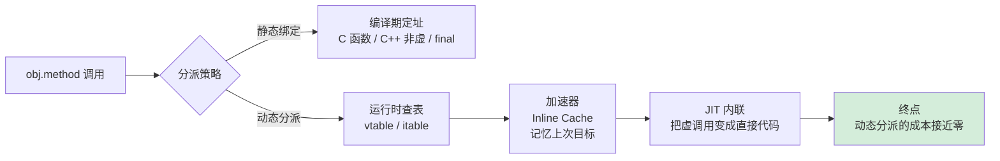

# 09.对象和函数访问原理

> 📍 **本篇位置**：第 2 卷 · 运行时模型 · 第 3 篇（卷扛鼎之作）
> 🎯 **核心矛盾**：**多态的灵活 vs 调用的高效** —— 一次方法调用要在编译期 / 链接期 / 运行期 三个时刻间分配工作
> 🧭 **设计灵魂**：所有 OOP 语言都靠**虚方法表（vtable）+ 内联缓存（IC）** 把动态分派降到接近静态调用——背后是 CPU 分支预测的胜利
> 🌐 **跨语言覆盖**：Java(invokevirtual + JIT 内联) · C++(vtable 多重继承复杂化) · Swift(Witness Table for 协议) · Go(interface 双指针) · JavaScript(V8 Hidden Class + IC)
> 🔗 **延伸阅读**：← [08.对象创建流程原理](./08.对象创建流程原理.md) · → [04.泛型设计灵魂思想](./04.泛型设计灵魂思想.md) · → [31.内存模型技术设计](./31.内存模型技术设计.md)



---

#### 目录介绍
- [1.访问对象设计哲学](#1访问对象设计哲学)
  - [1.1 核心设计原则](#11-核心设计原则)
  - [1.2 抽象层次设计](#12-抽象层次设计)
  - [1.3 直接访问模型](#13-直接访问模型)
  - [1.4 间接访问模型](#14-间接访问模型)
  - [1.5 混合访问模型](#15-混合访问模型)
  - [1.6 访问模型决策树](#16-访问模型决策树)
- [2.内存访问设计](#2内存访问设计)
  - [2.1 三级地址模型](#21-三级地址模型)
  - [2.2 内存地址值设计](#22-内存地址值设计)
  - [2.3 引用设计机制](#23-引用设计机制)
  - [2.4 内存布局设计](#24-内存布局设计)
- [3.访问权限控制设计](#3访问权限控制设计)
  - [3.1 访问权限哲学](#31-访问权限哲学)
  - [3.2 访问权限级别](#32-访问权限级别)
  - [3.3 权限实现思路](#33-权限实现思路)
  - [3.4 权限设计原理](#34-权限设计原理)
- [4.函数调用机制](#4函数调用机制)
  - [4.1 函数调用本质](#41-函数调用本质)
  - [4.2 生命周期模型](#42-生命周期模型)
  - [4.3 调用约定设计](#43-调用约定设计)
  - [4.4 栈帧设计原理](#44-栈帧设计原理)
  - [4.5 虚函数调用机制](#45-虚函数调用机制)
  - [4.6 函数调用性能](#46-函数调用性能)
- [5.内联函数机制](#5内联函数机制)
  - [5.1 设计内联动机](#51-设计内联动机)
  - [5.2 性能的矛盾](#52-性能的矛盾)
  - [5.3 内联函数与宏](#53-内联函数与宏)
  - [5.4 各语言中内联](#54-各语言中内联)
  - [5.5 内联实现原理](#55-内联实现原理)
  - [5.6 内联副作用](#56-内联副作用)
  - [5.7 内联机制对比](#57-内联机制对比)
- [6.变量访问设计](#6变量访问设计)
  - [6.1 变量存储模型](#61-变量存储模型)
  - [6.2 变量访问实现](#62-变量访问实现)
  - [6.3 常量访问机制](#63-常量访问机制)
- [6.Java访问机制](#6java访问机制)
- [7.C++访问机制](#7c访问机制)
- [8.JavaScript访问机制](#8javascript访问机制)


## 1.访问对象设计哲学

### 1.1 核心设计原则

访问对象的设计哲学基于以下几个核心原则：

统一性原则（Uniformity Principle）

- **定义**：所有实体（对象、函数、变量）都应该通过统一的访问机制进行操作
- **目标**：降低认知负担，提高代码一致性
- **实现**：通过统一的标识符解析、作用域查找和访问控制机制

封装性原则（Encapsulation Principle）

- **定义**：隐藏内部实现细节，只暴露必要的接口
- **目标**：提高代码安全性和可维护性
- **实现**：通过访问修饰符、作用域限制和接口抽象

可控性原则（Controllability Principle）

- **定义**：提供细粒度的访问控制机制
- **目标**：确保系统安全性和数据完整性
- **实现**：通过权限检查、类型检查和运行时验证

### 1.2 抽象层次设计

```
应用层访问接口
    ↓
语言层访问语法
    ↓
编译器/解释器层
    ↓
运行时系统层
    ↓
操作系统层
    ↓
硬件层（CPU、内存）
```

### 1.3 直接访问模型

**核心原理**：直接访问模型基于"零抽象开销"的设计哲学，程序直接操作物理内存地址，没有中间层的转换和检查。

**底层实现机制：**

```cpp
// 直接访问的底层实现
class DirectAccessExample {
private:
    int* data_ptr;  // 直接存储内存地址
    
public:
    // 直接内存分配
    DirectAccessExample(size_t size) {
        data_ptr = static_cast<int*>(malloc(size * sizeof(int)));
    }
    
    // 直接内存访问 - 零开销
    int& operator[](size_t index) {
        return data_ptr[index];  // 直接地址计算：base + index * sizeof(int)
    }
    
    // 直接内存释放
    ~DirectAccessExample() {
        free(data_ptr);  // 程序员负责内存管理
    }
};

// 汇编级别的直接访问
// mov eax, [base_address + index * 4]  ; 直接内存读取
// mov [base_address + index * 4], ebx  ; 直接内存写入
```

**设计优势深度分析：**

1. **性能最优化**： CPU直接访问内存，无额外指令开销；编译器可进行激进优化（内联、循环展开等）
2. **精确控制**：程序员完全控制内存布局；可实现自定义内存分配策略；支持底层系统编程需求

**设计劣势深度分析：**

1. **安全性风险**：缓冲区溢出：`array[1000] = value;` 可能覆盖其他内存；悬空指针：释放后的指针仍可访问，导致未定义行为；内存泄漏：忘记释放动态分配的内存
2. **错误易发性**： 指针算术错误：`ptr + sizeof(int)` vs `ptr + 1`；类型转换错误：不安全的类型转换可能导致数据损坏

### 1.4 间接访问模型

**核心原理**：间接访问模型引入了"句柄-对象"分离的设计，通过引用、句柄或指针间接访问实际对象，在访问路径中插入检查和管理层。

**底层实现机制：**

```java
// Java间接访问的底层实现概念
public class IndirectAccessExample {
    private int[] data;  // 对象引用，不是直接地址
    
    public IndirectAccessExample(int size) {
        this.data = new int[size];  // 堆分配，返回引用
    }
    
    public int get(int index) {
        // JVM执行的底层操作：
        // 1. 检查引用是否为null
        if (data == null) {
            throw new NullPointerException();
        }
        
        // 2. 边界检查
        if (index < 0 || index >= data.length) {
            throw new ArrayIndexOutOfBoundsException(index);
        }
        
        // 3. 通过引用访问实际对象
        return data[index];  // 间接内存访问
    }
}

// 底层引用表结构（概念性）
struct ObjectReference {
    void* object_address;     // 实际对象地址
    size_t object_size;       // 对象大小
    int reference_count;      // 引用计数（如果使用）
    int gc_mark;             // 垃圾回收标记
    ClassInfo* type_info;    // 类型信息
};
```

**引用解析过程：**

```
程序访问 obj.field
    ↓
1. 检查引用有效性（null检查）
    ↓
2. 通过引用表查找实际对象地址
    ↓
3. 执行访问权限检查
    ↓
4. 计算字段偏移量
    ↓
5. 访问实际内存位置
```

**设计优势深度分析：**

1. **内存安全性**：自动边界检查防止缓冲区溢出；空引用检查防止野指针访问
2. **自动内存管理**：垃圾回收器自动回收不再使用的对象；引用计数自动管理对象生命周期；避免内存泄漏和悬空指针问题
3. **运行时灵活性**：支持动态类型检查和转换；反射机制允许运行时对象检查

**设计劣势深度分析：**

1. **性能开销**：每次访问需要多次间接寻址；运行时检查增加CPU开销；垃圾回收暂停影响实时性
2. **内存开销**：引用表占用额外内存空间；对象头信息增加内存消耗；内存碎片化问题

**性能开销量化分析：**

```
直接访问：1个CPU周期
间接访问：3-5个CPU周期
- 引用检查：1个周期
- 地址解析：1-2个周期
- 边界检查：1个周期
- 实际访问：1个周期
```

### 1.5 混合访问模型

**核心原理**：混合访问模型结合直接访问和间接访问的优势，通过智能选择访问策略，在不同场景下提供最优的性能和安全性平衡。

**底层实现机制：**

```cpp
// C++智能指针的混合访问实现
template<typename T>
class HybridAccessPointer {
private:
    T* raw_ptr;              // 直接指针（性能）
    std::atomic<int>* ref_count;  // 引用计数（安全）
    bool is_managed;         // 管理标志
    
public:
    // 构造函数 - 选择访问模式
    explicit HybridAccessPointer(T* ptr, bool managed = true) 
        : raw_ptr(ptr), is_managed(managed) {
        if (is_managed && ptr) {
            ref_count = new std::atomic<int>(1);
        } else {
            ref_count = nullptr;
        }
    }
    
    // 智能访问 - 根据模式选择策略
    T& operator*() const {
        if (is_managed) {
            // 间接访问模式 - 安全检查
            if (!raw_ptr) {
                throw std::runtime_error("Null pointer access");
            }
            if (ref_count && ref_count->load() == 0) {
                throw std::runtime_error("Accessing deleted object");
            }
        }
        // 直接访问模式 - 零开销
        return *raw_ptr;
    }
    
    // 性能关键路径 - 直接访问
    T* get_unsafe() const noexcept {
        return raw_ptr;  // 绕过所有检查，最高性能
    }
    
    // 安全访问路径 - 完整检查
    T* get_safe() const {
        if (!raw_ptr) return nullptr;
        if (is_managed && ref_count && ref_count->load() == 0) {
            return nullptr;
        }
        return raw_ptr;
    }
};

// 使用示例 - 根据场景选择访问方式
void hybrid_access_demo() {
    auto ptr = std::make_shared<HybridAccessPointer<int>>(new int(42));
    
    // 性能关键循环 - 使用直接访问
    for (int i = 0; i < 1000000; ++i) {
        *ptr->get_unsafe() += 1;  // 零开销访问
    }
    
    // 安全检查场景 - 使用间接访问
    if (auto safe_ptr = ptr->get_safe()) {
        std::cout << "Value: " << *safe_ptr << std::endl;
    }
}
```

### 1.6 访问模型决策树

```
访问需求分析
    ↓
性能是否为首要考虑？
    ├─ 是 → 错误容忍度如何？
    │   ├─ 高 → 直接访问模型
    │   └─ 低 → 混合访问模型（性能优先）
    └─ 否 → 安全性要求如何？
        ├─ 高 → 间接访问模型
        └─ 中 → 混合访问模型（安全优先）
```

**模型对比总结表：**

| 特性 | 直接访问 | 间接访问 | 混合访问 |
|------|----------|----------|----------|
| **性能** | 最优 | 较差 | 可配置 |
| **安全性** | 最差 | 最优 | 可配置 |
| **内存开销** | 最小 | 较大 | 中等 |
| **开发复杂度** | 高 | 低 | 最高 |
| **调试难度** | 高 | 低 | 中等 |
| **适用场景** | 系统编程 | 应用开发 | 库/框架 |

## 2.内存访问设计

### 2.1 三级地址模型

三级地址空间模型

```text
物理地址 → 逻辑地址 → 虚拟地址
    ↓           ↓          ↓
真实硬件    CPU视角    程序视角
```

**设计原理**：

1. **物理地址**：硬件总线上的实际信号
2. **逻辑地址**：CPU指令中使用的偏移量
3. **虚拟地址**：进程看到的连续地址空间

### 2.2 内存地址值设计

**核心设计哲学**：物理地址设计基于"统一寻址空间"的理念，将整个系统内存抽象为一个连续的地址空间，通过数学计算实现精确的内存定位。

**基础地址计算模型**：物理地址 = 基址 + 偏移量 × 数据类型大小

**详细实现机制：**

```cpp
// 物理地址计算的底层实现
class PhysicalAddressCalculator {
private:
    uintptr_t base_address;    // 基址
    size_t element_size;       // 元素大小
    size_t alignment;          // 对齐要求
    
public:
    // 地址计算核心算法
    uintptr_t calculate_address(size_t index) const {
        // 1. 基本地址计算
        uintptr_t raw_address = base_address + (index * element_size);
        
        // 2. 对齐调整
        uintptr_t aligned_address = align_address(raw_address, alignment);
        
        // 3. 边界检查（可选）
        validate_address_bounds(aligned_address);
        
        return aligned_address;
    }
    
private:
    // 地址对齐算法
    uintptr_t align_address(uintptr_t addr, size_t align) const {
        // 向上对齐到最近的对齐边界
        return (addr + align - 1) & ~(align - 1);
    }
    
    // 地址边界验证
    void validate_address_bounds(uintptr_t addr) const {
        if (addr < base_address || addr >= base_address + total_size) {
            throw std::out_of_range("Address out of bounds");
        }
    }
};

// 实际使用示例
void physical_address_demo() {
    // 分配1MB内存块
    void* memory_block = malloc(1024 * 1024);
    uintptr_t base = reinterpret_cast<uintptr_t>(memory_block);
    
    // 计算数组元素地址
    PhysicalAddressCalculator calc(base, sizeof(int), alignof(int));
    
    // 访问第100个元素
    uintptr_t element_addr = calc.calculate_address(100);
    int* element_ptr = reinterpret_cast<int*>(element_addr);
    *element_ptr = 42;  // 直接内存写入
    
    free(memory_block);
}
```

### 2.2 引用设计机制

> 强引用（Strong Reference）

```cpp
// C++示例
class Object {
    int data;
public:
    Object(int d) : data(d) {}
};

Object* ptr = new Object(42);  // 强引用
// 需要手动释放：delete ptr;
```

**特点**：1.直接持有对象的内存地址；2.对象生命周期由引用者控制；3可能导致内存泄漏

> 弱引用（Weak Reference）

```cpp
// C++智能指针示例
std::shared_ptr<Object> strong_ref = std::make_shared<Object>(42);
std::weak_ptr<Object> weak_ref = strong_ref;

// 使用前需要检查对象是否还存在
if (auto locked = weak_ref.lock()) {
    // 安全访问对象
}
```

### 2.4 内存布局设计

内存布局设计的核心是在空间效率、访问速度和硬件友好之间取得最佳平衡。其设计遵循三大黄金法则：

1. 局部性原理：相关数据放在一起
2. 对齐原则：地址符合硬件要求
3. 连续性原则：顺序访问效率最高

不同的编程语言根据其设计哲学和用途，会有不同的内存布局策略。以下是内存布局设计的核心思想和原理：

1. 对齐与填充：现代计算机硬件通常要求数据在内存中的地址是特定值的倍数（例如，4字节对齐、8字节对齐）。对齐可以提升内存访问效率，但可能会导致内存碎片。因此，编译器会在数据成员之间插入填充字节以满足对齐要求。
2. 连续存储：数组和结构体等聚合类型通常采用连续内存存储，以便通过基地址和偏移量快速访问元素。连续存储也有利于缓存局部性。
3. 内存模型：编程语言的内存模型定义了程序如何访问内存，以及如何与硬件和操作系统交互。例如，C++有严格的内存模型，允许直接操作内存地址，而Java则通过虚拟机抽象，使用引用来访问对象，并且有自动垃圾回收。
4. 对象布局：面向对象语言中的对象内存布局包括对象头（用于存储类型信息、垃圾回收标记、同步锁等）和实例数据。对象头是运行时管理对象所必需的。实例数据通常按照某种顺序排列（如声明顺序、大小顺序等）以最小化填充。
5. 栈与堆：局部变量和函数调用上下文通常存储在栈上，而动态分配的数据则位于堆上。栈上分配和释放快速，但生命周期受限；堆上分配更灵活，但管理成本高。
6. 常量与静态存储：常量数据（如字符串字面量）和静态变量通常存储在特定的内存区域（如只读数据段、静态存储区），这些区域在程序生命周期内一直存在。
7. 内存安全：内存布局设计也关系到内存安全。例如，缓冲区溢出攻击就是利用了内存布局的连续性。一些语言通过边界检查、禁止指针运算等来保证安全。
8. 压缩与优化：为了节省内存，一些语言会进行内存压缩，例如指针压缩（在64位JVM中使用32位偏移表示对象指针）、空基类优化（C++中空基类不占空间）、共享字符串等。
9. 动态与静态布局：静态类型语言通常在编译时确定内存布局，而动态类型语言可能在运行时动态改变。例如，JavaScript对象可以动态添加属性，其内存布局可能是字典结构。

对象内存布局

```
对象内存布局：
+------------------+
| 虚函数表指针     |  (如果有虚函数)
+------------------+
| 成员变量1        |
+------------------+
| 成员变量2        |
+------------------+
| ...              |
+------------------+
| 填充字节         |  (内存对齐)
+------------------+
```

引用表设计

```
引用表结构：
+------------------+
| 对象地址         |
+------------------+
| 引用计数         |
+------------------+
| 类型信息         |
+------------------+
| 标记位           |  (GC标记等)
+------------------+
```

## 3.访问权限控制设计

### 3.1 访问权限哲学

**核心设计理念**：访问权限控制基于"最小权限原则"（Principle of Least Privilege）和"纵深防御"（Defense in Depth）的安全设计哲学，通过多层次、多维度的权限控制机制，确保系统的安全性和数据完整性。

**设计目标层次：**

1. **安全性**：防止未授权访问和恶意操作
2. **封装性**：隐藏实现细节，提供清晰的接口
3. **可维护性**：便于代码重构和功能扩展
4. **性能平衡**：在安全和性能之间找到最优平衡点

```
没有访问控制:
  任何人都能直接修改 balance
  → 100个地方直接写 obj.balance = xxx
  → 改 balance 的类型/逻辑 → 100个地方全炸

有访问控制:
  balance 是 private，只能通过 withdraw()/deposit() 修改
  → 修改内部逻辑 → 只改这两个方法 → 外部无感知
```

### 3.2 访问权限级别

**权限级别金字塔模型：**

```
        private (最严格)
           ↑
      protected (继承访问)
           ↑
       package (包访问)
           ↑
        public (最宽松)
```

### 3.3 权限实现思路

如果让你设计类，属性的访问权限，你的设计思路是什么样的？

> 1.C++：纯编译期检查，零运行时开销

C++ 的访问控制**完全在编译期完成**，编译后的二进制中没有任何访问权限信息：

```cpp
class Foo {
 private:
    int secret = 42;
};

Foo f;
f.secret;  // 编译错误：'secret' is private

// 但在二进制层面，secret 就是对象偏移量0处的一个int
// 用指针算术可以直接访问（未定义行为，但能"工作"）：
int* p = reinterpret_cast<int*>(&f);
*p;  // 42，绕过了访问控制
```

**编译器的实现**：

```
1. 解析类定义，记录每个成员的访问级别（AST上的标记）
2. 在名称查找（name lookup）阶段，检查访问者的上下文：
   - 当前函数属于哪个类？
   - 当前类与目标类的继承关系？
   - 是否是 friend？
3. 如果访问违规 → 编译错误
4. 如果合法 → 生成与无访问控制完全相同的机器码

→ 运行时开销：零。完全是编译器在做静态分析。
```

friend 的实现也很简单——编译器在检查访问权限时，额外查一下目标类的 friend 列表。

> 2.Java：编译期 + 运行时双重检查

**编译期**：javac 像 C++ 一样做静态检查。

**运行时**：JVM 在以下场景做额外检查——

```
// 反射访问
Field f = Account.class.getDeclaredField("balance");
f.get(account);  // IllegalAccessException（运行时检查）

f.setAccessible(true);  // 关闭检查（Java 9+ 受模块系统限制）
f.get(account);  // 成功
```

**字节码层面**：

```
每个字段/方法在 .class 文件中有 access_flags：

ACC_PUBLIC    = 0x0001
ACC_PRIVATE   = 0x0002
ACC_PROTECTED = 0x0004
ACC_STATIC    = 0x0008
...

JVM 在链接（linking）阶段验证这些标志：
1. 类加载时：检查类的访问权限
2. 方法调用时：检查方法的访问权限
3. 字段访问时：检查字段的访问权限

违规 → 抛出 IllegalAccessError（不是编译错误，是运行时异常）
```

为什么 Java 需要运行时检查？因为 Java 支持**动态加载**——一个类可能在编译时还不存在，无法在编译期完成所有检查。

> 3.JavaScript `#` 私有字段：引擎级隔离

```javascript
class Foo {
    #x = 10;
    getX() { return this.#x; }
}
```

V8 引擎实现：

```
1. #x 不是普通的字符串属性名
2. 引擎为每个类的 #x 生成一个唯一的内部 Symbol（类似UUID）
3. 只有类定义的词法作用域内才知道这个 Symbol
4. 外部代码无法构造这个 Symbol → 无法访问

本质：不是"检查你有没有权限"，而是"你根本不知道钥匙长什么样"
```

这和 C++/Java 的"我知道名字但被拒绝"不同——JS 私有字段是**信息隐藏**而非**访问控制**。

### 3.4 权限设计原理

访问权限的设计原理是**通过限制可见性来降低系统复杂度**：对外暴露最小接口（契约），对内保护不变量（正确性）。实现上，C++ 是纯编译期名称查找规则（零开销），Java 是字节码 access_flags + 运行时验证（安全性最高），JS 是内部 Symbol 隔离（信息隐藏），Python 是名称改写（纯约定）。本质都是在**"谁能看到什么"这个维度上建立边界**。

```cpp
// C++访问权限的底层实现原理
class AccessControlSystem {

public:
    // 权限级别枚举
    enum class AccessLevel : uint8_t {
        PRIVATE = 0,    // 000 - 仅类内部
        PROTECTED = 1,  // 001 - 类和子类
        PACKAGE = 2,    // 010 - 包内访问（Java概念）
        PUBLIC = 3      // 011 - 全局访问
    };
    
    // 访问上下文信息
    struct AccessContext {
        const std::type_info* caller_class;     // 调用者类型
        const std::type_info* target_class;     // 目标类型
        bool is_same_package;                   // 是否同包
        bool is_inheritance_relation;           // 是否有继承关系
        bool is_friend_class;                   // 是否友元类
        uint32_t security_level;                // 安全级别
    };
    
    // 权限检查核心算法
    bool check_access_permission(AccessLevel member_level, 
                                const AccessContext& context) {
        switch (member_level) {
            case AccessLevel::PRIVATE:
                return check_private_access(context);
                
            case AccessLevel::PROTECTED:
                return check_protected_access(context);
                
            case AccessLevel::PACKAGE:
                return check_package_access(context);
                
            case AccessLevel::PUBLIC:
                return check_public_access(context);
                
            default:
                return false;
        }
    }
    
private:
    // 私有访问检查
    bool check_private_access(const AccessContext& context) {
        // 1. 同一类内部访问
        if (context.caller_class == context.target_class) {
            return true;
        }
        
        // 2. 友元类访问（C++特有）
        if (context.is_friend_class) {
            return true;
        }
        
        // 3. 嵌套类访问（特殊情况）
        if (is_nested_class_access(context)) {
            return true;
        }
        
        return false;
    }
    
    // 保护访问检查
    bool check_protected_access(const AccessContext& context) {
        // 1. 私有访问的所有情况
        if (check_private_access(context)) {
            return true;
        }
        
        // 2. 继承关系访问
        if (context.is_inheritance_relation) {
            return true;
        }
        
        // 3. 同包访问（Java风格）
        if (context.is_same_package) {
            return true;
        }
        
        return false;
    }
    
    // 包访问检查
    bool check_package_access(const AccessContext& context) {
        // 1. 保护访问的所有情况
        if (check_protected_access(context)) {
            return true;
        }
        
        // 2. 同包内的任何类
        if (context.is_same_package) {
            return true;
        }
        
        return false;
    }
    
    // 公共访问检查
    bool check_public_access(const AccessContext& context) {
        // 公共成员对所有调用者开放
        // 但仍需要进行安全级别检查
        return context.security_level >= MIN_SECURITY_LEVEL;
    }
    
    bool is_nested_class_access(const AccessContext& context) {
        // 检查是否为嵌套类访问
        return false; // 简化实现
    }
    
    static constexpr uint32_t MIN_SECURITY_LEVEL = 1;
};
```

## 4.函数调用机制

### 4.1 函数调用本质

**函数调用的本质**：程序控制流的有序转移和状态保护机制

**设计哲学原则：**

1. **状态隔离原则**：每个函数调用都有独立的执行环境
2. **可恢复性原则**：调用完成后能够准确恢复到调用点
3. **参数传递统一性**：标准化的数据传递机制
4. **性能优化原则**：在安全性和性能之间找到最佳平衡

### 4.2 生命周期模型

函数调用的生命周期模型：

```
准备阶段 → 调用阶段 → 执行阶段 → 返回阶段 → 清理阶段
    ↓         ↓         ↓         ↓         ↓
参数准备   控制转移   函数执行   结果返回   状态恢复
```

### 4.3 调用约定设计

**核心问题**：如何在调用者和被调用者之间建立标准化的通信协议？

### 4.4 栈帧设计原理

> 栈帧设计哲学

**核心问题**：如何在有限的栈空间中实现无限深度的函数调用？

**设计原理：**

1. **LIFO原则**：后进先出的调用顺序管理
2. **状态封装**：每个栈帧包含完整的函数执行状态
3. **地址相对化**：使用基址+偏移的相对寻址
4. **自动管理**：栈帧的创建和销毁完全自动化

栈帧结构的精密设计

```cpp
// 栈帧管理器的完整实现
class StackFrameManager {
public:
    struct FrameLayout {
        // 栈帧头部（固定部分）
        void* return_address;      // 返回地址
        void* saved_frame_pointer; // 保存的帧指针
        
        // 栈帧主体（可变部分）
        struct {
            void* local_variables;     // 局部变量区
            void* temporary_storage;   // 临时存储区
            void* register_spill_area; // 寄存器溢出区
            void* alignment_padding;   // 对齐填充
        } frame_body;
        
        // 栈帧尾部（参数区）
        void* parameters[];        // 参数数组
    };
    
private:
    static thread_local void* current_frame_pointer;
    static thread_local void* stack_limit;
    static const size_t STACK_GUARD_SIZE = 4096;  // 栈保护区大小
    
public:
    // 创建新栈帧
    static void* create_frame(size_t local_size, size_t param_count) {
        // 1. 栈溢出检查
        void* new_sp = (char*)get_stack_pointer() - 
                       sizeof(FrameLayout) - local_size;
        if (new_sp < (char*)stack_limit + STACK_GUARD_SIZE) {
            throw std::runtime_error("Stack overflow detected");
        }
        
        // 2. 保存当前状态
        FrameLayout* frame = (FrameLayout*)new_sp;
        frame->saved_frame_pointer = current_frame_pointer;
        frame->return_address = get_return_address();
        
        // 3. 初始化局部变量区
        memset(&frame->frame_body, 0, local_size);
        
        // 4. 设置新的帧指针
        current_frame_pointer = frame;
        
        // 5. 栈对齐处理
        align_stack_pointer();
        
        return frame;
    }
    
    // 销毁栈帧
    static void destroy_frame() {
        FrameLayout* current = (FrameLayout*)current_frame_pointer;
        
        // 1. 恢复帧指针
        current_frame_pointer = current->saved_frame_pointer;
        
        // 2. 恢复栈指针
        set_stack_pointer((char*)current + sizeof(FrameLayout));
        
        // 3. 跳转到返回地址
        jump_to_address(current->return_address);
    }
    
    // 局部变量访问
    template<typename T>
    static T& get_local_variable(int offset) {
        FrameLayout* frame = (FrameLayout*)current_frame_pointer;
        return *(T*)((char*)&frame->frame_body.local_variables + offset);
    }
    
    // 参数访问
    template<typename T>
    static T& get_parameter(int index) {
        FrameLayout* frame = (FrameLayout*)current_frame_pointer;
        return *(T*)&frame->parameters[index];
    }
};
```

### 4.5 虚函数调用机制

**核心问题**：如何在编译时不知道具体类型的情况下，实现运行时的正确函数调用？

**设计原理：**
1. **间接调用原则**：通过函数指针表实现动态绑定
2. **类型信息保持**：对象携带类型信息（vtable指针）
3. **继承兼容性**：子类vtable与父类vtable兼容
4. **性能优化**：单次间接跳转的最小开销

### 4.6 函数调用性能

调用开销分析

```cpp
// 函数调用性能分析器
class CallPerformanceAnalyzer {
public:
    struct CallCost {
        uint64_t setup_cycles;      // 参数准备周期
        uint64_t call_cycles;       // 调用指令周期
        uint64_t frame_cycles;      // 栈帧管理周期
        uint64_t cleanup_cycles;    // 清理周期
        uint64_t total_cycles;      // 总周期数
    };
    
    static CallCost analyze_call_cost(const Function& func, 
                                    const CallSite& call_site) {
        CallCost cost = {};
        
        // 1. 参数传递开销
        cost.setup_cycles = calculate_parameter_cost(func.parameters());
        
        // 2. 调用指令开销
        if (func.is_virtual()) {
            cost.call_cycles = 3;  // 间接调用：load + jump
        } else {
            cost.call_cycles = 1;  // 直接调用：call
        }
        
        // 3. 栈帧管理开销
        if (func.needs_frame_pointer()) {
            cost.frame_cycles = 4;  // push ebp, mov ebp esp, sub esp, ...
        } else {
            cost.frame_cycles = 1;  // sub esp
        }
        
        // 4. 清理开销
        cost.cleanup_cycles = calculate_cleanup_cost(func.calling_convention());
        
        cost.total_cycles = cost.setup_cycles + cost.call_cycles + 
                          cost.frame_cycles + cost.cleanup_cycles;
        
        return cost;
    }
    
private:
    static uint64_t calculate_parameter_cost(const std::vector<Parameter>& params) {
        uint64_t cost = 0;
        int register_params = 0;
        
        for (const auto& param : params) {
            if (register_params < 4) {  // 前4个参数用寄存器
                cost += 1;  // mov register, value
                register_params++;
            } else {
                cost += 2;  // push value (可能需要load)
            }
        }
        
        return cost;
    }
};
```

## 5.内联函数机制

### 5.1 设计内联动机

为什么要设计内联函数？根本动机是消除函数调用的开销，同时保留函数的抽象能力。

函数调用不是免费的。每次调用一个函数，CPU 要做一系列"仪式"：

```
调用 add(a, b) 的真实开销：

1. 参数传递：把 a, b 压栈或写入寄存器
2. 保存现场：保存调用者的寄存器（caller-saved registers）
3. 跳转：      call 指令，跳到函数地址
4. 建立栈帧：  push rbp; mov rbp, rsp; sub rsp, N
5. 执行函数体： return a + b;  ← 真正有用的就这一句
6. 销毁栈帧：  mov rsp, rbp; pop rbp
7. 返回：      ret 指令，跳回调用点
8. 恢复现场：  恢复寄存器

一次 add(a, b) 调用：有用工作 1 条指令，调用开销 7-8 条指令
```

对于**小函数**，调用开销可能远大于函数本身的计算量。内联的思想是：**把函数体直接嵌入调用点，消除调用/返回的全部开销**。

### 5.2 性能的矛盾

矛盾：性能 vs 抽象

```
方案1：不写函数，到处复制代码
  int result = a + b;  // 性能好，但重复代码，不可维护

方案2：写函数
  int add(int a, int b) { return a + b; }
  int result = add(a, b);  // 可维护，但有调用开销

方案3：内联函数 —— 两全其美
  inline int add(int a, int b) { return a + b; }
  int result = add(a, b);
  // 源码层面是函数调用（可读、可维护）
  // 编译后等价于 int result = a + b;（零调用开销）
```

**内联 = 用编译器的力量，让你写函数但不付函数调用的代价。**

### 5.3 内联函数与宏

C 时代没有内联函数，用宏实现"零开销抽象"：

```c
#define ADD(a, b) ((a) + (b))
#define MAX(a, b) ((a) > (b) ? (a) : (b))
```

宏的致命问题：

```c
// 1. 副作用重复求值
MAX(i++, j++)
// 展开为: ((i++) > (j++) ? (i++) : (j++))
// i 或 j 被自增两次！

// 2. 无类型检查
ADD("hello", 42)  // 编译通过，运行崩溃

// 3. 无作用域
#define MAX ...    // 污染全局命名空间，可能与其他库冲突

// 4. 无法调试
// 调试器看到的是展开后的代码，无法单步进入"宏函数"
```

内联函数解决了所有这些问题：

| | 宏 | 内联函数 |
|---|---|---|
| 参数求值 | 文本替换，可能多次求值 | 只求值一次 |
| 类型检查 | 无 | 有，编译器完整检查 |
| 作用域 | 无，全局污染 | 有，遵守命名空间 |
| 调试 | 无法单步 | 可以（调试模式下可不内联） |
| 副作用安全 | 不安全 | 安全 |

### 5.4 各语言中内联

> C/C++：`inline` 关键字

```cpp
inline int square(int x) { return x * x; }
```

**关键点**：`inline` 是对编译器的**建议**，不是命令。编译器可以：
- 忽略 `inline`，仍然生成函数调用（函数太大、递归等）
- 自动内联没有标记 `inline` 的函数（如果编译器认为值得）

C++ 中 `inline` 还有第二层语义——**允许多个翻译单元包含相同定义**（解决 ODR 问题）：

```cpp
// header.h
inline int add(int a, int b) { return a + b; }

// a.cpp 包含 header.h → 有一份 add 定义
// b.cpp 包含 header.h → 有一份 add 定义
// 链接器不报"重复定义"错误，因为是 inline
```

> Java：无 inline 关键字，完全由 JIT 决定

```java
// Java 没有 inline 关键字
// JVM 的 JIT 编译器自动判断是否内联

int add(int a, int b) { return a + b; }

// JIT 内联的判断标准：
// 1. 方法字节码大小 < 35字节（-XX:MaxInlineSize）
// 2. 热方法 < 325字节（-XX:FreqInlineSize）
// 3. 调用频次足够高（热点检测）
// 4. 调用链深度 < 9层（-XX:MaxInlineLevel）
```

> JavaScript：V8 引擎自动内联

```javascript
function add(a, b) { return a + b; }

// V8 的 TurboFan 编译器会自动内联小函数
// 内联决策基于：
// 1. 函数大小（AST 节点数）
// 2. 调用频次（是否是热函数）
// 3. 调用点的类型反馈（是否单态）
```

> Kotlin：`inline` 关键字有特殊语义

```kotlin
// Kotlin 的 inline 保证内联，不是建议
inline fun <T> measure(block: () -> T): T {
    val start = System.nanoTime()
    val result = block()          // Lambda 也被内联，不创建匿名类对象
    println("Cost: ${System.nanoTime() - start}ns")
    return result
}

// 没有 inline → block 参数是一个 Function 对象（堆分配）
// 有 inline → block 的代码直接嵌入调用点（零对象分配）
```

### 5.5 内联实现原理

> 1. 编译器内联的工作流程

```
源码:
  inline int square(int x) { return x * x; }
  int main() {
      int a = square(5);
      int b = square(a + 1);
  }

词法分析 → 语法分析 → AST:
  main:
    a = call square(5)
    b = call square(a + 1)

内联展开（在中间表示 IR 上操作）:
  main:
    a = 5 * 5           ← 把函数体粘贴过来，形参替换为实参
    _temp = a + 1
    b = _temp * _temp   ← 同理

常量折叠（后续优化）:
  main:
    a = 25              ← 编译期算出结果
    _temp = 26
    b = 676

最终机器码:
    mov [a], 25
    mov [b], 676

→ 函数调用完全消失，甚至计算都在编译期完成了
```

> 2. 内联的真正价值：不是省几条指令，是打开优化大门

内联本身省的调用开销只是次要的。**真正的价值是让编译器看到更大的代码上下文，从而做更深层的优化**：

```
没有内联时，编译器优化的视野：

void process(int x) {
    int y = transform(x);   // 编译器不知道 transform 做了什么
    if (y > 0) { ... }      // 无法判断 y 的范围
}

内联 transform 后：

void process(int x) {
    int y = x * 2 + 1;      // 编译器现在看到了 transform 的实现
    if (y > 0) { ... }      // 如果 x >= 0，y 必 > 0，可以消除分支
}
```

内联触发的后续优化链：

```
内联
 ├→ 常量传播（已知参数值直接代入）
 ├→ 常量折叠（编译期算出结果）
 ├→ 死代码消除（不可达分支删掉）
 ├→ 公共子表达式消除
 ├→ 循环优化（循环体内的函数调用消失后，可以向量化）
 └→ 寄存器分配优化（不再需要为调用保存/恢复寄存器）

一次内联可能触发一连串优化，最终效果远超省掉几条 call/ret
```

> 3. 编译器如何决定是否内联

现代编译器（GCC/Clang/MSVC）用**成本-收益模型**：

```
收益:
  + 消除调用开销（call/ret/栈帧）
  + 暴露优化机会（常量传播、死代码消除等）
  + 减少寄存器压力（参数不再需要放特定寄存器）

成本:
  - 代码膨胀（函数体复制到每个调用点）
  - 指令缓存（I-Cache）压力增大
  - 编译时间增加

决策伪代码:
  if (函数体太大) → 不内联（默认阈值约 100-200 条 IR 指令）
  if (递归函数) → 不内联（或只内联有限深度）
  if (调用次数极多 && 函数体不小) → 不内联（代码膨胀严重）
  if (调用次数少 && 函数体中等) → 内联（膨胀代价小）
  if (调用在热路径上) → 倾向内联（PGO 数据指导）
  if (函数体极小，<10条指令) → 几乎总是内联
```

GCC 的相关选项：

```
-finline-functions          开启自动内联（-O2 以上默认开启）
-finline-limit=N            设置内联阈值
--param max-inline-insns-single=N   单次内联的最大指令数
-fno-inline                 完全禁止内联（调试用）
```

> 4. JIT 内联（Java/JS）—— 比静态编译更聪明

JIT 编译器有静态编译器没有的优势：**运行时信息**。

```
Java JIT 内联流程:

1. 解释执行阶段：收集每个调用点的类型信息（Profile）
   
   animal.speak()
   → 运行10000次，发现9999次是 Cat，1次是 Dog

2. 编译阶段：基于 Profile 做"推测性内联"（Speculative Inlining）

   // JIT 生成的代码：
   if (animal.class == Cat) {     // 类型守卫
       // Cat::speak 的函数体直接内联在这里（快速路径）
       printf("meow");
   } else {
       // 慢速路径：走虚表分派
       animal.speak();  // invokevirtual
   }

3. 去优化（Deoptimization）：
   如果运行时发现假设不成立（比如突然来了大量 Dog）
   → 丢弃编译后的代码，退回解释执行
   → 重新收集 Profile，重新编译

→ JIT 能内联虚函数！这是静态编译器做不到的（不知道运行时类型）
```

> 5. 内联失败的典型场景

```
// 1. 递归——无限展开
inline int factorial(int n) {
    if (n <= 1) return 1;
    return n * factorial(n - 1);  // 编译器不知道展开几层
}
// → 编译器拒绝内联，或只展开有限层数

// 2. 通过函数指针调用——地址不确定
void (*fp)(int) = &someFunc;
fp(42);  // 编译器不知道 fp 指向谁 → 无法内联

// 3. 虚函数——类型不确定（静态编译器）
base->virtualMethod();  // 不知道具体类型 → 不内联
// （JIT 编译器可以用推测性内联解决）

// 4. 跨翻译单元——看不到函数体
// a.cpp 调用 b.cpp 中的函数
// 编译 a.cpp 时看不到函数体 → 无法内联
// 解决：LTO（Link-Time Optimization）在链接时跨文件内联
```

### 5.6 内联副作用

内联副作用：代码膨胀（Code Bloat）

```
void bigFunc() { /* 200行代码 */ }

// 如果 bigFunc 被内联到100个调用点
// → 200 × 100 = 20000 行代码嵌入到100个地方
// → 可执行文件急剧膨胀
// → I-Cache 命中率下降
// → 性能反而变差！

经验法程：
  函数体 < 10行（或 ~50条 IR 指令）→ 内联几乎总是值得
  函数体 10-50行 → 看调用频率和热度
  函数体 > 50行 → 通常不值得内联（除非只被调用一次）
```

### 5.7 内联机制对比

内联函数的设计动机是**在不牺牲代码抽象性的前提下消除函数调用开销**；核心原理是**编译器将函数体直接复制到调用点，让函数调用在编译后完全消失**；真正的价值不是省掉 call/ret 那几条指令，而是**打破函数边界后暴露给编译器更大的优化视野**——常量传播、死代码消除、向量化等一连串优化由此成为可能。

```
┌──────────┬────────────────┬──────────────┬───────────────────────┐
│ 语言      │ 关键字          │ 语义         │ 实际内联决策者          │
├──────────┼────────────────┼──────────────┼───────────────────────┤
│ C/C++    │ inline          │ 建议         │ 编译器（GCC/Clang/MSVC）│
│ C++      │ constexpr       │ 编译期求值   │ 编译器（必须可内联）     │
│ Java     │ 无              │ -            │ JIT（HotSpot C2）      │
│ JS       │ 无              │ -            │ JIT（V8 TurboFan）     │
│ Kotlin   │ inline          │ 强制         │ 编译器（保证内联Lambda）│
│ Rust     │ #[inline]       │ 建议         │ LLVM 后端              │
│ Rust     │ #[inline(always)]│ 强制        │ LLVM（强制内联）        │
│ Go       │ 无              │ -            │ Go 编译器自动决策       │
└──────────┴────────────────┴──────────────┴───────────────────────┘
```

## 5.变量访问设计

### 5.1 变量存储模型

```
进程内存布局：
+------------------+ ← 高地址
| 栈区             | ← 局部变量、函数参数
| (向下增长)       |
+------------------+
| 堆区             | ← 动态分配内存
| (向上增长)       |
+------------------+
| BSS段            | ← 未初始化全局变量
+------------------+
| 数据段           | ← 已初始化全局变量
+------------------+
| 代码段           | ← 程序代码和常量
+------------------+ ← 低地址
```

### 5.2 变量访问实现

```cpp
// 不同类型变量的访问方式
void variable_access_demo() {
    // 1. 局部变量访问 - 栈偏移
    int local_var = 42;        // [ebp-4]
    
    // 2. 全局变量访问 - 直接地址
    static int global_var = 100;  // 固定内存地址
    
    // 3. 成员变量访问 - 对象偏移
    struct Object {
        int member1;  // 偏移量: 0
        int member2;  // 偏移量: 4
    } obj;
    obj.member1 = 10;  // this + 0
    
    // 4. 动态变量访问 - 指针解引用
    int* heap_var = new int(200);  // 堆分配
    *heap_var = 300;  // 间接访问
    delete heap_var;
}
```

### 5.3 常量访问机制

编译时常量 vs 运行时常量

```cpp
// 编译时常量 - 直接替换
const int COMPILE_TIME_CONSTANT = 42;
void use_constant() {
    int x = COMPILE_TIME_CONSTANT;  // 编译器替换为: int x = 42;
}

// 运行时常量 - 内存访问
class RuntimeConstant {
private:
    const int value;
public:
    RuntimeConstant(int v) : value(v) {}  // 构造时初始化
    int get_value() const { return value; }  // 内存读取
};
```


## 6.Java访问机制

Java通过**句柄(Handle)**或**直接指针(Direct Pointer)**两种方式访问对象：

- **句柄方式**：引用→句柄池（包含数据指针+类型指针）→实际对象。优点：对象移动时只需更新句柄，引用本身不变（GC友好）。
- **直接指针方式**（HotSpot采用）：引用→对象头（包含类型指针）→实例数据。优点：少一次间接寻址，访问更快。

```java
Object obj = new Object();
// 栈上的obj是一个引用（32/64位指针）
// HotSpot实现中，obj直接指向堆中对象
// 对象头中的Klass Pointer指向方法区的类元数据
```

Java的方法调用采用**虚方法表(vtable)**实现多态，每个类有一张vtable，存储可被覆写方法的实际入口地址。invokevirtual指令通过vtable间接跳转。

## 7.C++访问机制

C++对象访问的核心是**编译时确定偏移量**：

- **成员变量访问**：编译器在编译期计算字段偏移量，`obj.field`被编译为`*(base + offset)`
- **虚函数调用**：通过对象内嵌的**vptr（虚表指针）**找到vtable，再通过vtable中的函数指针调用。非虚函数在编译期直接绑定地址（静态分派）
- **多重继承**：对象中包含多个vptr，基类子对象按声明顺序排列，指针转换时需要调整偏移量(thunk)

```cpp
class Base { virtual void foo(); };
class Derived : public Base { void foo() override; };
Base* p = new Derived();
p->foo();  // vptr → vtable → Derived::foo() 的地址
```

## 8.JavaScript访问机制

JavaScript的对象访问基于**隐藏类(Hidden Class/Shape)**和**内联缓存(Inline Cache)**：

- **隐藏类**：V8为每种对象结构生成一个隐藏类（类似Java的类元数据），记录属性名到偏移量的映射。相同结构的对象共享同一个隐藏类，使动态语言的属性访问接近静态语言的效率。
- **内联缓存(IC)**：在属性访问的调用点缓存上次的隐藏类和偏移量。如果下次访问的对象隐藏类相同，直接用缓存的偏移量（单态IC），否则退化为字典查找。
- **原型链查找**：访问不存在的属性时，沿`__proto__`链逐级向上查找，这是JavaScript最昂贵的属性访问路径。

