# 09.对象和函数访问原理

> 📍 **本篇位置**：第 2 卷 · 运行时模型 · 第 3 篇（卷扛鼎之作）
> 🎯 **核心矛盾**：**多态的灵活 vs 调用的高效** —— 一次方法调用要在编译期 / 链接期 / 运行期 三个时刻间分配工作
> 🧭 **设计灵魂**：所有 OOP 语言都靠**虚方法表（vtable）+ 内联缓存（IC）** 把动态分派降到接近静态调用——背后是 CPU 分支预测的胜利
> 🌐 **跨语言覆盖**：Java(invokevirtual + JIT 内联) · C++(vtable 多重继承复杂化) · Swift(Witness Table for 协议) · Go(interface 双指针) · JavaScript(V8 Hidden Class + IC)
> 🔗 **延伸阅读**：← [08.对象创建流程原理](./08.对象创建流程原理.md) · → [04.泛型设计灵魂思想](./04.泛型设计灵魂思想.md) · → [31.内存模型技术设计](./31.内存模型技术设计.md)

## 🎯 案例引入：银行账户的访问安全设计

想象一个银行账户系统，我们需要设计一个 `BankAccount` 类。这个简单的需求背后隐藏着深刻的访问设计哲学：

```java
// 直接访问设计（危险但高效）
class BankAccount {
    public double balance;  // 余额直接暴露
    
    public void withdraw(double amount) {
        balance -= amount;  // 任何代码都能直接修改余额
    }
}

// 间接访问设计（安全但开销大）
class SecureBankAccount {
    private double balance;  // 余额隐藏
    
    public void withdraw(double amount) {
        if (amount <= 0) throw new IllegalArgumentException("金额必须为正");
        if (amount > balance) throw new IllegalArgumentException("余额不足");
        balance -= amount;  // 通过方法间接访问，有安全检查
    }
}
```

**核心问题**：为什么我们需要在 `balance` 字段前加 `private`？为什么不能直接 `account.balance -= 1000`？

这个简单的选择背后，是**性能与安全**的永恒矛盾，也是所有编程语言访问机制设计的根本出发点。

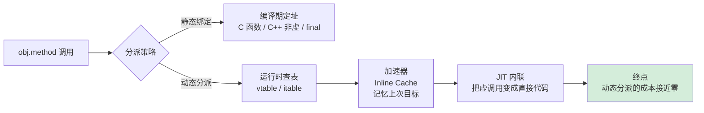

---

## 📖 目录结构

### 1. 访问模型设计哲学
- [1.1 核心设计原则](#11-核心设计原则)
- [1.2 访问模型演进](#12-访问模型演进)
- [1.3 直接访问模型](#13-直接访问模型)
- [1.4 间接访问模型](#14-间接访问模型)
- [1.5 混合访问模型](#15-混合访问模型)
- [1.6 模型决策树](#16-模型决策树)

### 2. 内存访问机制
- [2.1 三级地址模型](#21-三级地址模型)
- [2.2 引用设计机制](#22-引用设计机制)
- [2.3 内存布局设计](#23-内存布局设计)
- [2.4 地址计算原理](#24-地址计算原理)

### 3. 访问权限控制
- [3.1 权限设计哲学](#31-权限设计哲学)
- [3.2 权限级别体系](#32-权限级别体系)
- [3.3 权限实现机制](#33-权限实现机制)
- [3.4 跨语言权限对比](#34-跨语言权限对比)

### 4. 函数调用机制
- [4.1 调用本质分析](#41-调用本质分析)
- [4.2 栈帧设计原理](#42-栈帧设计原理)
- [4.3 虚函数调用机制](#43-虚函数调用机制)
- [4.4 调用性能优化](#44-调用性能优化)

### 5. 内联函数机制
- [5.1 内联设计动机](#51-内联设计动机)
- [5.2 内联实现原理](#52-内联实现原理)
- [5.3 跨语言内联对比](#53-跨语言内联对比)
- [5.4 内联性能分析](#54-内联性能分析)

### 6. 跨语言访问机制
- [6.1 Java访问机制](#61-java访问机制)
- [6.2 C++访问机制](#62-c访问机制)
- [6.3 JavaScript访问机制](#63-javascript访问机制)
- [6.4 访问机制对比总结](#64-访问机制对比总结)


## 1. 访问模型设计哲学

### 1.1 核心设计原则

访问对象的设计哲学基于三大黄金法则：

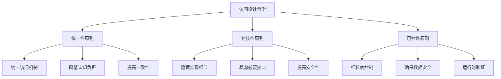

**统一性原则**：所有实体通过统一机制访问，降低认知负担，提高代码一致性。

**封装性原则**：隐藏内部实现，只暴露必要接口，提高安全性和可维护性。

**可控性原则**：提供细粒度访问控制，确保系统安全性和数据完整性。

### 1.2 访问模型演进

访问模型经历了从原始直接到智能优化的演进历程：

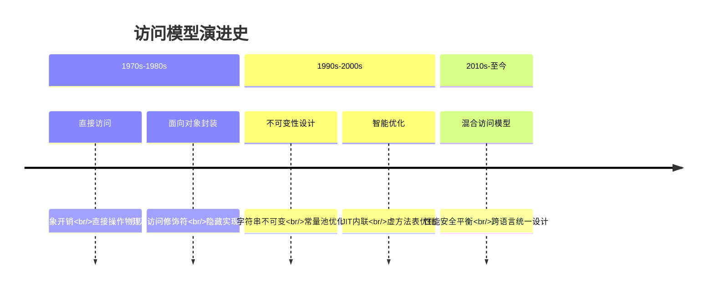

**演进动力**：性能需求驱动直接访问，安全性需求驱动间接访问，现代系统需要两者平衡。

### 1.3 直接访问模型

**核心原理**：直接访问模型追求"零抽象开销"，程序直接操作物理内存地址，无中间层转换。


**设计优势**：
- **性能最优**：CPU直接访问内存，无额外指令开销
- **精确控制**：完全控制内存布局，支持底层系统编程
- **编译器优化**：可进行激进优化（内联、循环展开等）

**设计风险**：
- **安全性低**：缓冲区溢出、悬空指针、内存泄漏
- **错误易发**：指针算术错误、类型转换错误

**适用场景**：系统编程、性能关键型应用、嵌入式系统

```cpp
// 直接访问的本质：零抽象层
int* array = malloc(100 * sizeof(int));
array[50] = 42;  // 直接地址计算：base + 50 * sizeof(int)
```

**CPU视角**：`mov eax, [base + index * 4]` - 直接内存读取，零抽象开销。

### 1.4 间接访问模型

**核心原理**：间接访问模型通过"句柄-对象"分离设计，在访问路径中插入安全检查和管理层。


**访问流程**：
1. **引用检查**：验证引用有效性（null检查）
2. **地址解析**：通过引用表查找实际对象地址
3. **边界检查**：验证访问范围合法性
4. **实际访问**：执行最终内存操作

**设计优势**：
- **内存安全**：自动边界检查、空引用检查
- **自动管理**：垃圾回收、引用计数
- **运行时灵活**：动态类型检查、反射机制

**性能开销**：
```
直接访问：1个CPU周期
间接访问：3-5个CPU周期
- 引用检查：1周期
- 地址解析：1-2周期  
- 边界检查：1周期
- 实际访问：1周期
```

**适用场景**：应用开发、Web服务、安全性要求高的系统

```java
// 间接访问的本质：安全层抽象
public class BankAccount {
    private double balance;  // 私有字段，间接访问
    
    public void withdraw(double amount) {
        // 安全检查层
        if (amount <= 0) throw new IllegalArgumentException();
        if (amount > balance) throw new IllegalArgumentException();
        
        balance -= amount;  // 通过方法间接访问
    }
}
```

### 1.5 混合访问模型

**核心原理**：混合访问模型智能选择访问策略，在不同场景下平衡性能与安全。

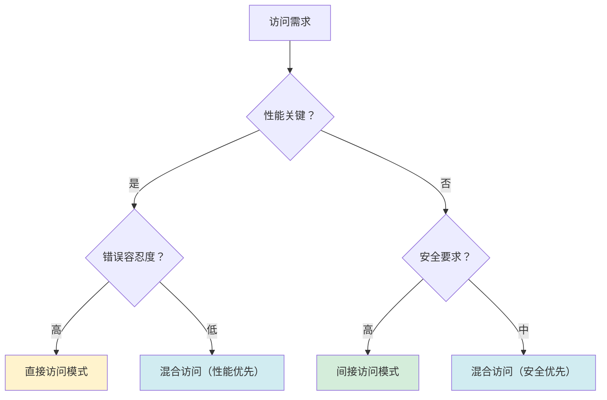

**设计思想**：
- **场景感知**：根据使用场景自动选择最优访问策略
- **分层设计**：提供不同安全级别的访问接口
- **性能可调**：在安全性和性能之间动态平衡

**实现机制**：
```cpp
// 现代智能指针的混合访问设计
template<typename T>
class SmartPointer {
private:
    T* raw_ptr;           // 直接指针（性能）
    ControlBlock* ctrl;  // 控制块（安全）
    
public:
    // 安全访问（完整检查）
    T& safe_access() {
        if (!raw_ptr || ctrl->is_deleted()) {
            throw std::runtime_error("Invalid access");
        }
        return *raw_ptr;
    }
    
    // 性能访问（最小检查）
    T& fast_access() noexcept {
        return *raw_ptr;  // 仅假设指针有效
    }
};
```

**适用场景**：
- **库/框架设计**：为不同用户提供不同访问级别
- **性能敏感应用**：在关键路径使用快速访问，其他路径使用安全访问
- **系统软件**：在底层需要直接访问，上层需要安全访问

### 1.6 模型决策树

**访问模型选择策略**：

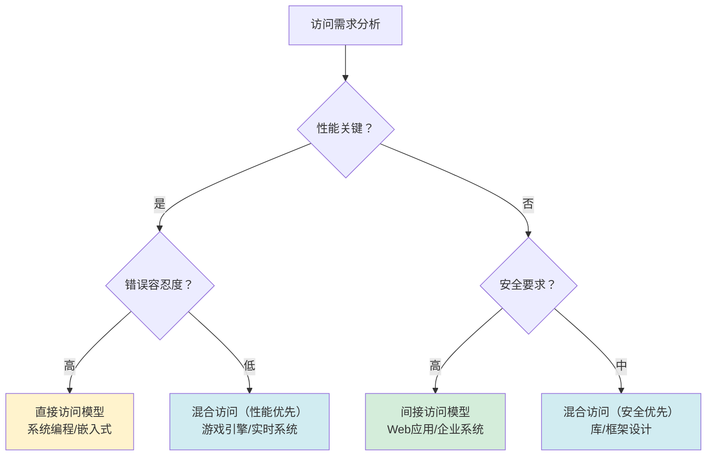

**模型对比分析**：

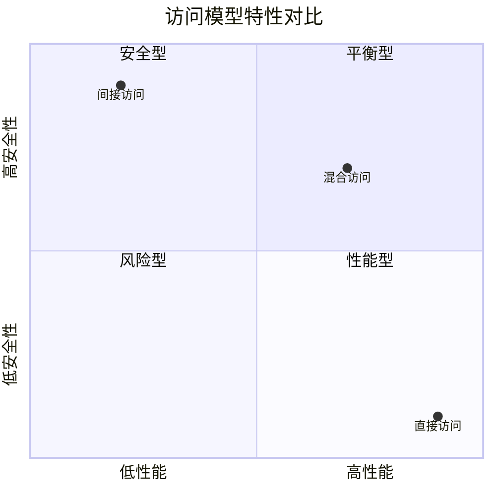

**设计决策要点**：
- **性能优先**：直接访问模型，适合系统编程、嵌入式系统
- **安全优先**：间接访问模型，适合Web应用、企业系统
- **平衡设计**：混合访问模型，适合库/框架、游戏引擎
- **场景驱动**：根据具体应用场景选择最合适的访问策略

## 2. 内存访问机制

### 2.1 三级地址模型

**核心原理**：现代计算机通过三级地址抽象层，将物理硬件复杂性隐藏，为程序提供统一的虚拟内存视图。

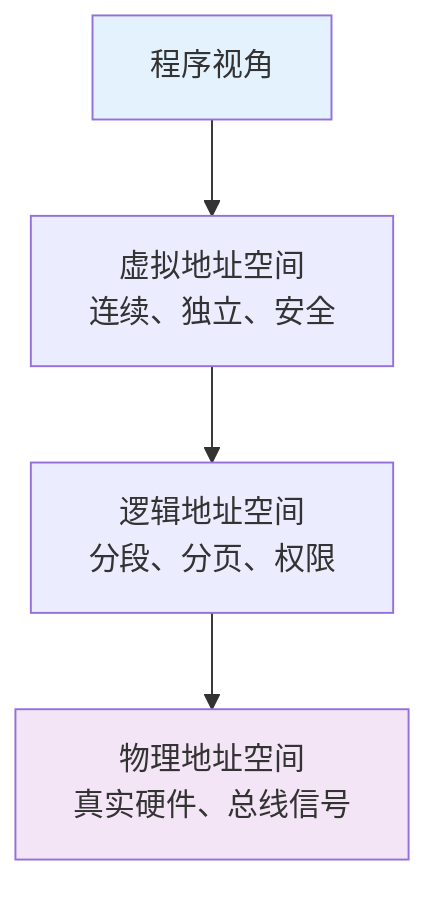

**设计哲学**：
- **抽象分层**：每层解决特定问题，上层无需关心下层细节
- **安全隔离**：虚拟地址空间为每个进程提供独立内存视图
- **硬件抽象**：程序无需关心物理内存布局和硬件特性

**地址转换流程**：
```
虚拟地址 → MMU转换 → 逻辑地址 → 页表查询 → 物理地址
    ↓           ↓           ↓           ↓
程序可见    权限检查    分段分页    硬件访问
```

**设计优势**：
- **内存保护**：每个进程有独立地址空间，防止非法访问
- **内存共享**：不同进程可共享相同物理内存（只读/写时复制）
- **简化编程**：程序看到连续线性地址空间，无需管理物理内存碎片

### 2.2 引用设计机制

**引用类型设计哲学**：通过不同引用强度实现内存管理的灵活性和安全性平衡。

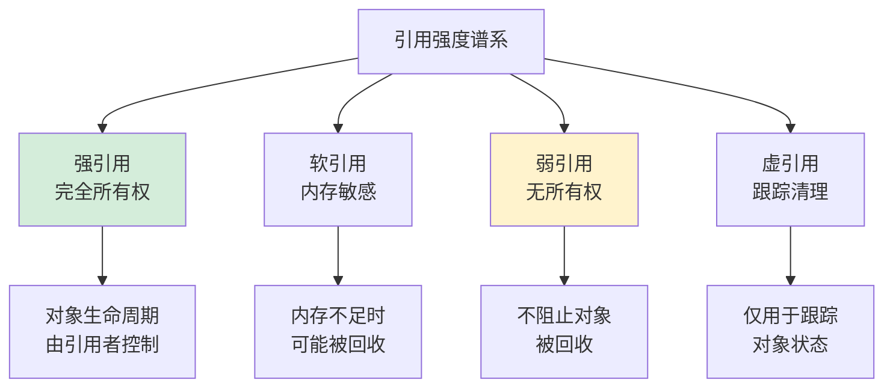

**引用强度对比**：

| 引用类型 | 所有权 | 阻止GC | 使用场景 |
|---------|--------|--------|----------|
| **强引用** | 完全 | 是 | 核心业务对象 |
| **软引用** | 部分 | 内存不足时否 | 缓存、临时数据 |
| **弱引用** | 无 | 否 | 监听器、观察者模式 |
| **虚引用** | 无 | 否 | 资源清理跟踪 |

**设计原理**：
- **生命周期管理**：通过引用强度控制对象存活时间
- **内存优化**：软引用在内存紧张时自动释放，优化内存使用
- **解耦设计**：弱引用避免循环引用，实现对象间松耦合

**跨语言实现**：
- **Java**：`StrongReference`、`SoftReference`、`WeakReference`、`PhantomReference`
- **C++**：`std::shared_ptr`（强引用）、`std::weak_ptr`（弱引用）
- **Python**：引用计数 + 弱引用字典（`weakref` 模块）
- **JavaScript**：自动垃圾回收，`WeakRef`/`WeakMap` 提供弱引用

```cpp
// 引用机制的本质：控制对象生命周期
std::shared_ptr<Object> strong = std::make_shared<Object>();  // 强引用
std::weak_ptr<Object> weak = strong;                          // 弱引用

if (auto locked = weak.lock()) {  // 提升为强引用，安全访问
    locked->doSomething();
}
```

### 2.3 内存布局设计

**核心目标**：在空间效率、访问速度和硬件友好之间取得最佳平衡。

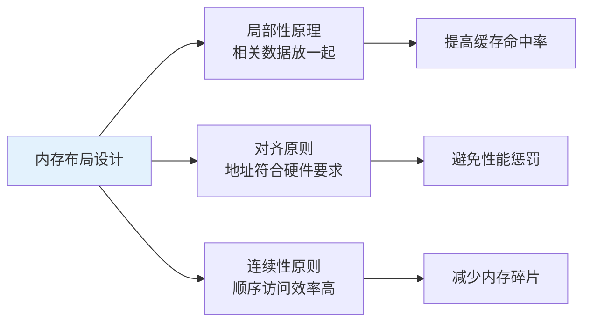

**对象内存布局**：

```
+------------------+ ← 对象起始地址
| 对象头           | ← 类型指针、GC标记、锁信息
+------------------+
| 成员变量1        | ← 按声明顺序或大小排列
+------------------+
| 成员变量2        |
+------------------+
| 填充字节         | ← 内存对齐补齐
+------------------+
```

**关键设计决策**：

1. **对齐与填充**：硬件要求数据地址是特定值的倍数（如 8 字节对齐），编译器插入填充字节满足对齐要求
2. **连续存储**：数组和结构体采用连续内存，便于通过 `基址 + 偏移` 快速定位
3. **对象头设计**：存储类型信息、GC 标记、同步锁，是运行时管理对象的元数据
4. **栈与堆分离**：局部变量在栈（快速、生命周期短），动态对象在堆（灵活、可控生命周期）
5. **指针压缩优化**：64 位 JVM 用 32 位偏移表示对象指针，节省 50% 引用内存

### 2.4 地址计算原理

**核心思想**：通过数学公式将复杂的物理地址抽象为简单的逻辑寻址。

**基础公式**：`目标地址 = 基址 + 偏移量 × 元素大小`


**三种寻址模式**：

| 模式 | 公式 | 典型场景 |
|------|------|---------|
| **绝对寻址** | 直接给出地址 | 全局变量、静态变量 |
| **基址+偏移** | base + offset | 数组、对象成员 |
| **基址+变址×倍率** | base + index × scale | 数组下标访问 |

**设计优势**：
- **统一寻址**：所有内存访问使用相同的计算模型
- **硬件友好**：CPU 提供专用寻址指令（如 x86 的 `[base + index*scale + disp]`）
- **编译优化空间**：常量偏移可在编译期计算完成

```cpp
// 地址计算的本质
struct Point { int x; int y; };  // x 偏移=0, y 偏移=4
Point arr[100];

arr[50].y = 42;
// 编译器生成：mov [arr + 50*8 + 4], 42
//             基址  变址 倍率 偏移
```


## 3. 访问权限控制

### 3.1 权限设计哲学

**核心理念**：基于"最小权限原则"和"纵深防御"的安全设计哲学。

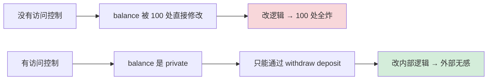

**设计目标层次**：

1. **安全性**：防止未授权访问和恶意操作
2. **封装性**：隐藏实现细节，提供清晰接口
3. **可维护性**：便于重构和扩展
4. **性能平衡**：在安全和性能之间取衡

**本质总结**：访问控制是**通过限制可见性来降低系统复杂度**——对外暴露最小接口（契约），对内保护不变量（正确性）。

### 3.2 权限级别体系

**权限级别金字塔**：

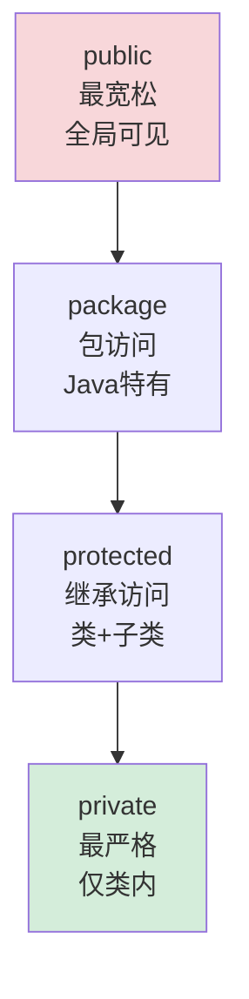

**权限范围对比**：

| 权限 | 类内 | 同包 | 子类 | 全局 | 典型用途 |
|------|------|------|------|------|---------|
| **private** | ✅ | ❌ | ❌ | ❌ | 内部状态、辅助方法 |
| **protected** | ✅ | ✅ | ✅ | ❌ | 模板方法、抽象接口 |
| **package** | ✅ | ✅ | ❌ | ❌ | 包内协作、隐藏实现 |
| **public** | ✅ | ✅ | ✅ | ✅ | 公开 API、外部接口 |

### 3.3 权限实现机制

不同语言选择了不同的权限检查时机，体现出不同的设计哲学：

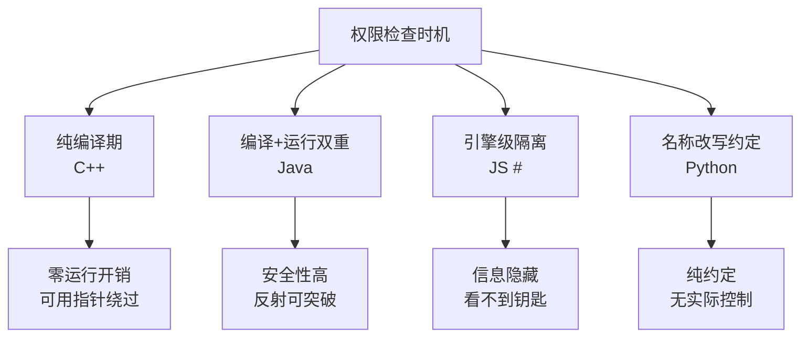

> 1.C++：纯编译期检查，零运行时开销

C++ 的访问控制**完全在编译期完成**，编译后的二进制中没有任何访问权限信息：

```cpp
class Foo {
 private:
    int secret = 42;
};

Foo f;
f.secret;  // 编译错误：'secret' is private

// 但在二进制层面，secret 就是对象偏移量0处的一个int
// 用指针算术可以直接访问（未定义行为，但能"工作"）：
int* p = reinterpret_cast<int*>(&f);
*p;  // 42，绕过了访问控制
```

**编译器的实现**：

```
1. 解析类定义，记录每个成员的访问级别（AST上的标记）
2. 在名称查找（name lookup）阶段，检查访问者的上下文：
   - 当前函数属于哪个类？
   - 当前类与目标类的继承关系？
   - 是否是 friend？
3. 如果访问违规 → 编译错误
4. 如果合法 → 生成与无访问控制完全相同的机器码

→ 运行时开销：零。完全是编译器在做静态分析。
```

friend 的实现也很简单——编译器在检查访问权限时，额外查一下目标类的 friend 列表。

> 2.Java：编译期 + 运行时双重检查

**编译期**：javac 像 C++ 一样做静态检查。

**运行时**：JVM 在以下场景做额外检查——

```
// 反射访问
Field f = Account.class.getDeclaredField("balance");
f.get(account);  // IllegalAccessException（运行时检查）

f.setAccessible(true);  // 关闭检查（Java 9+ 受模块系统限制）
f.get(account);  // 成功
```

**字节码层面**：

```
每个字段/方法在 .class 文件中有 access_flags：

ACC_PUBLIC    = 0x0001
ACC_PRIVATE   = 0x0002
ACC_PROTECTED = 0x0004
ACC_STATIC    = 0x0008
...

JVM 在链接（linking）阶段验证这些标志：
1. 类加载时：检查类的访问权限
2. 方法调用时：检查方法的访问权限
3. 字段访问时：检查字段的访问权限

违规 → 抛出 IllegalAccessError（不是编译错误，是运行时异常）
```

为什么 Java 需要运行时检查？因为 Java 支持**动态加载**——一个类可能在编译时还不存在，无法在编译期完成所有检查。

> 3.JavaScript `#` 私有字段：引擎级隔离

```javascript
class Foo {
    #x = 10;
    getX() { return this.#x; }
}
```

V8 引擎实现：

```
1. #x 不是普通的字符串属性名
2. 引擎为每个类的 #x 生成一个唯一的内部 Symbol（类似UUID）
3. 只有类定义的词法作用域内才知道这个 Symbol
4. 外部代码无法构造这个 Symbol → 无法访问

本质：不是"检查你有没有权限"，而是"你根本不知道钥匙长什么样"
```

这和 C++/Java 的"我知道名字但被拒绝"不同——JS 私有字段是**信息隐藏**而非**访问控制**。

### 3.4 跨语言权限对比

**核心总结**：访问权限的设计原理是**通过限制可见性来降低系统复杂度**。

**各语言设计对比**：

| 语言 | 检查时机 | 安全强度 | 可绕过性 | 实现机制 |
|------|----------|----------|----------|----------|
| **C++** | 编译期 | 低 | 高 (reinterpret_cast) | 名称查找规则 |
| **Java** | 编译+运行 | 高 | 中 (setAccessible) | access_flags 字节码 |
| **JS #** | 引擎级 | 最高 | 零 | 内部 Symbol 隔离 |
| **Python** | 无 | 零 | 零 | 名称改写约定 |

**设计哲学差异**：
- **C++**：信任程序员，性能为上，"不要为你不使用的东西付费"
- **Java**：企业级安全，多重检查，适合大型系统
- **JavaScript**：动态语言的变革，从约定走向引擎级隔离
- **Python**："我们都是成年人"，只靠约定，保持语言简洁

**本质揭示**：本质都是在**"谁能看到什么"这个维度上建立边界**，区别只是边界什么时候、由谁、以多严格的方式去守护。

## 4. 函数调用机制

### 4.1 调用本质分析

**函数调用的本质**：程序控制流的有序转移和状态保护机制。

```mermaid
sequenceDiagram
    participant C as 调用者
    participant S as 栈
    participant F as 被调函数
    
    C->>S: 1. 压入参数
    C->>S: 2. 压入返回地址
    C->>F: 3. 跳转到函数
    F->>S: 4. 创建栈帧
    F->>F: 5. 执行函数体
    F->>S: 6. 销毁栈帧
    F->>C: 7. 返回调用点
    C->>S: 8. 清理参数
```

**设计哲学四原则**：

1. **状态隔离**：每个函数调用有独立执行环境，互不干扰
2. **可恢复性**：调用完成后能精准回到调用点继续执行
3. **传递统一**：标准化的参数传递与返回机制（调用约定）
4. **性能权衡**：在安全性、灵活性和速度之间动态平衡

**生命周期五阶段**：
```
准备阶段 → 调用阶段 → 执行阶段 → 返回阶段 → 清理阶段
   ↓         ↓         ↓         ↓         ↓
参数准备   控制转移   函数执行   结果返回   状态恢复
```

### 4.2 栈帧设计原理

**核心问题**：如何在有限的栈空间中实现无限深度的函数调用？

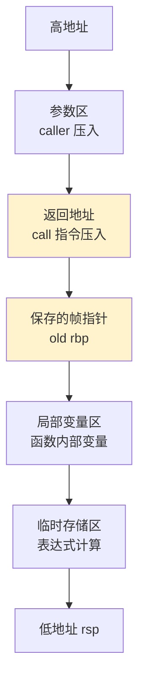

**四大设计原则**：

1. **LIFO 原则**：后进先出，与函数调用嵌套天然契合
2. **状态封装**：每个栈帧包含完整的执行上下文（参数、返回点、局部变量）
3. **地址相对化**：通过 `rbp + offset` 寻址，与栈位置解耦
4. **自动管理**：编译器自动生成 prologue/epilogue 代码，无需手动管理

**栈帧生命周期**（汇编级本质）：

```nasm
; 函数序言 (Prologue)
push rbp           ; 保存调用者的帧指针
mov  rbp, rsp      ; 建立新帧指针
sub  rsp, N        ; 为局部变量预留空间

; ... 函数体 ...

; 函数尾声 (Epilogue)
mov  rsp, rbp      ; 恢复栈指针
pop  rbp           ; 恢复调用者帧指针
ret                ; 跳转回返回地址
```

**栈溢出防护**：操作系统在栈底设置 guard page（保护页），访问时触发页错误，避免静默损坏堆内存。

### 4.3 虚函数调用机制

**核心问题**：编译时不知道具体类型，运行时如何调用正确的函数？

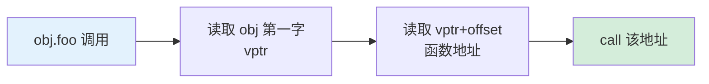

**vtable 机制本质**：

```
对象内存布局：               vtable（类级别共享）：
+--------+                  +---------+
| vptr   | --------------> | foo 地址 |  ← 偏移 0
+--------+                  +---------+
| field1 |                  | bar 地址 |  ← 偏移 8
+--------+                  +---------+
| field2 |                  | baz 地址 |  ← 偏移 16
+--------+                  +---------+
```

**四大设计原则**：
1. **间接调用**：通过函数指针表实现动态绑定
2. **类型携带**：对象内嵌 vptr，永远知道自己是谁
3. **继承兼容**：子类 vtable 前缀与父类一致，多态安全
4. **最小开销**：仅多 1-2 次内存读取 + 间接跳转

**跨语言虚调用对比**：

| 语言 | 实现机制 | 单次开销 | 优化手段 |
|------|---------|---------|---------|
| **C++** | vptr + vtable | 2 次 load + 间接 jump | 去虚化（devirtualization） |
| **Java** | invokevirtual + vtable | 同 C++ | JIT 推测性内联 |
| **Go** | itab 双指针 | 间接 call | 接口缓存 |
| **Swift** | Witness Table | 间接 call | 协议表优化 |
| **JS V8** | Hidden Class + IC | IC 命中=1 次比较 | 单态/多态 IC |

**性能代价**：虚调用比静态调用多 1-2 个周期，最大代价是**不友好于 CPU 分支预测**——目标地址要从内存读取，无法预先准备。

### 4.4 调用性能优化

**调用开销分解**：

```
一次函数调用总开销 = 参数传递 + 控制转移 + 栈帧管理 + 清理返回
            ≈ 1-2      + 1-3     + 4-6     + 1-2
            ≈ 7-13 个 CPU 周期
```

**优化策略全景**：

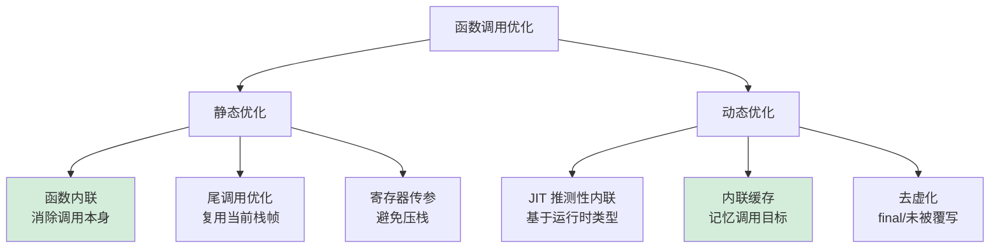

**各优化手段的收益**：

| 优化手段 | 节省周期 | 适用场景 | 实现者 |
|---------|---------|---------|--------|
| **函数内联** | 全部调用开销 | 小函数、热点函数 | 编译器 / JIT |
| **尾调用优化** | 栈帧创建 | 递归函数末尾调用 | 编译器 |
| **寄存器传参** | 参数压栈 | 参数 ≤4（x86）/≤6（x64） | 调用约定 |
| **PGO** | 分支预测优化 | 频繁调用路径 | 编译器 + Profile |

> 内联是其中最强大的优化手段，下一章详细讨论。

## 5. 内联函数机制

### 5.1 内联设计动机

**根本动机**：消除函数调用开销，同时保留函数的抽象能力。

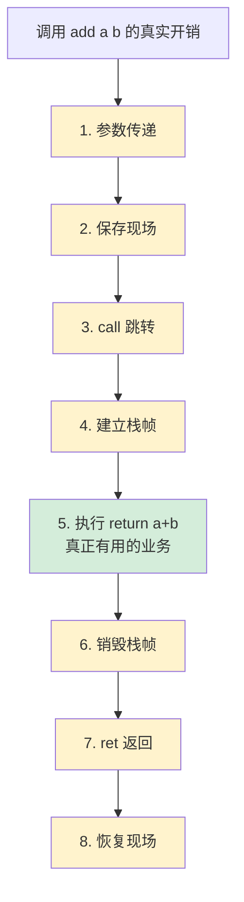

**核心观察**：一次 `add(a, b)` 调用。有用工作 **1 条**指令，调用开销 **7-8 条**指令。

对于**小函数**，调用开销远大于函数本身计算量。内联的核心思想是：**把函数体直接嵌入调用点，消除调用/返回的全部开销**。

### 5.2 内联实现原理

**三大设计价值**：

```mermaid
graph TB
    A[内联的价值链] --> B[性能价值与抽象价值兼得]
    A --> C[函数调用完全消失]
    A --> D[打开后续优化大门]
    
    D --> D1[常量传播]
    D --> D2[死代码消除]
    D --> D3[循环向量化]
    D --> D4[寄存器分配优化]
```

**1）编译器内联的完整流程**：

```
源码:
  inline int square(int x) { return x * x; }
  int b = square(5);

内联展开（IR 中）:
  b = 5 * 5         ← 函数体复制到调用点

常量折叠（后续优化）:
  b = 25            ← 编译期直接算出结果

机器码:
  mov [b], 25       ← 连计算都消失了
```

**2）真正价值：不是省几条指令，是打开优化大门**

```
没有内联时：
void process(int x) {
    int y = transform(x);   ← 编译器不知道 transform 做了什么
    if (y > 0) { ... }      ← 无法判断 y 范围
}

内联 transform 后：
void process(int x) {
    int y = x * 2 + 1;      ← 编译器看到了实现
    if (y > 0) { ... }      ← 如果 x>=0，y 必>0，可消除分支
}
```

**3）编译器决策模型**（成本-收益）：

```mermaid
graph LR
    A[决策模型] --> B[收益]
    A --> C[成本]
    
    B --> B1[消除调用开销]
    B --> B2[暴露优化机会]
    B --> B3[减少寄存器压力]
    
    C --> C1[代码膨胀]
    C --> C2[I-Cache 压力]
    C --> C3[编译时间]
```

决策伪代码：
```
if (函数体 < 10行)        → 几乎总是内联
if (函数体 > 200行)       → 不内联
if (递归函数)              → 不内联或有限展开
if (调用在热路径)         → 倾向内联（PGO 指导）
```

**4）JIT 内联——比静态编译更聪明**

JIT 拥有静态编译器没有的优势：**运行时信息**。

```
animal.speak()  ← 统计运行10000次，9999次是 Cat

JIT 生成推测性内联代码：

  if (animal.class == Cat) {       ← 类型守卫
      // Cat::speak 函数体直接内联（快速路径）
      printf("meow");
  } else {
      animal.speak();  ← 慢速路径：走虚表
  }

→ 如果假设不成立 → 去优化（deoptimize）退回解释执行
→ JIT 能内联虚函数！静态编译器做不到
```

### 5.3 跨语言内联对比

**内联机制跨语言全景**：

| 语言 | 关键字 | 语义 | 实际内联决策者 |
|------|--------|------|----------------|
| **C/C++** | `inline` | 建议 | 编译器（GCC/Clang/MSVC） |
| **C++** | `constexpr` | 编译期求值 | 编译器（必须可内联） |
| **Java** | 无 | - | JIT（HotSpot C2） |
| **JavaScript** | 无 | - | JIT（V8 TurboFan） |
| **Kotlin** | `inline` | **强制** | 编译器（保证内联 Lambda） |
| **Rust** | `#[inline]` | 建议 | LLVM 后端 |
| **Rust** | `#[inline(always)]` | 强制 | LLVM（强制内联） |
| **Go** | 无 | - | Go 编译器自动决策 |

**三大设计哲学**：

```mermaid
flowchart TB
    A[内联哲学] --> B[C++ 学派<br/>程序员建议+编译器决策]
    A --> C[Java/JS 学派<br/>完全交给 JIT]
    A --> D[Kotlin 学派<br/>语义需要才强制]
    
    B --> B1[静态编译可控性强]
    C --> C1[运行时数据更准]
    D --> D1[Lambda 零成本抽象]
```

### 5.4 内联性能分析

**副作用：代码膨胀（Code Bloat）**

```
void bigFunc() { /* 200行代码 */ }

如果被内联到 100 个调用点：
→ 200 × 100 = 20000 行代码膨胀
→ 可执行文件剧增
→ I-Cache 命中率下降
→ 性能反而变差！
```

**内联使用经验法则**：

| 函数体大小 | 内联决策 |
|----------|---------|
| < 10 行（~50 IR 指令） | 几乎总是内联 |
| 10-50 行 | 看调用频率和热点度 |
| > 50 行 | 通常不内联（单调用点除外） |

**内联失败的典型场景**：

```
❌ 递归函数 → 无限展开
❌ 函数指针调用 → 地址不确定
❌ 虚函数（静态编译器） → 类型不确定
❌ 跨翻译单元 → 看不到函数体（LTO 可解决）
```

**本质总结**：内联函数 = **用编译器的力量，让你写函数但不付函数调用的代价**。真正价值不是省几条指令，而是**打破函数边界，给编译器暴露更大的优化视野**。

## 6. 跨语言访问机制

### 6.1 Java访问机制

**核心机制**：Java 通过**句柄（Handle）**或**直接指针（Direct Pointer）**两种方式访问对象，HotSpot 选择了直接指针方式以追求性能。

```mermaid
graph LR
    A[栈上 obj 引用] --> B[堆中对象]
    B --> C[对象头<br/>Klass Pointer]
    C --> D[方法区<br/>类元数据]
    D --> E[vtable<br/>方法入口表]
    
    style A fill:#e3f2fd
    style E fill:#d4edda
```

**两种访问方式对比**：

| 方式 | 访问路径 | 优势 | 劣势 |
|------|---------|------|------|
| **句柄方式** | 引用→句柄池→对象 | GC 友好（移动对象不改引用） | 多一次间接寻址 |
| **直接指针**（HotSpot） | 引用→对象 | 访问快 | GC 移动需更新所有引用 |

**方法调用机制**：

```java
// 字段访问：编译期确定偏移量
account.balance = 100;       // putfield 指令 + 字段偏移
                             // 等价于：[obj_addr + balance_offset] = 100

// 方法调用：通过 vtable 实现多态
animal.speak();              // invokevirtual 指令
                             // 1. 读取 obj 的 Klass Pointer
                             // 2. Klass 中查 vtable
                             // 3. vtable[speak_index] → 实际函数地址
                             // 4. 调用该地址
```

**HotSpot 的优化**：JIT 在热点路径用**类型守卫 + 内联缓存**把动态分派降到接近直接调用的开销。

### 6.2 C++访问机制

**核心机制**：C++ 对象访问的核心是**编译时确定偏移量**，运行时只做地址计算和虚表查询。

```mermaid
graph TB
    A[obj.field 访问] --> A1[编译期: 计算 field 偏移]
    A1 --> A2[运行期: load base+offset]
    
    B[obj.method 调用] --> B1{是否 virtual}
    B1 -->|否| C1[静态分派<br/>编译期定址 call]
    B1 -->|是| C2[动态分派<br/>vptr → vtable → call]
    
    style C1 fill:#d4edda
    style C2 fill:#fff3cd
```

**三大访问机制**：

1. **成员变量访问**：编译期计算字段偏移量
   ```cpp
   struct Foo { int a; double b; };  // a 偏移=0, b 偏移=8
   foo.b = 3.14;
   // 编译为：mov [foo_addr + 8], 3.14
   ```

2. **虚函数调用**：通过对象内嵌的 vptr 找 vtable
   ```cpp
   class Base { virtual void foo(); };
   class Derived : public Base { void foo() override; };
   Base* p = new Derived();
   p->foo();  // vptr → vtable → Derived::foo()
   ```

3. **多重继承**：对象包含多个 vptr，指针转换需调整偏移量（thunk）
   ```cpp
   class A {};  class B {};
   class C : public A, public B {};
   // C 对象布局：[A 子对象 | B 子对象]
   // (B*)c_ptr 需要加上 sizeof(A) 的偏移
   ```

**C++ 设计哲学**："不要为你不使用的东西付费"——非虚函数零开销，虚函数仅为多态付费。

### 6.3 JavaScript访问机制

**核心机制**：JavaScript 对象访问基于 V8 的**隐藏类（Hidden Class / Shape）**和**内联缓存（Inline Cache, IC）**，让动态语言达到接近静态语言的访问效率。

```mermaid
flowchart LR
    A[obj.x 第一次访问] --> B[查找 obj 的 Shape]
    B --> C[Shape 中查 x 的偏移]
    C --> D[读取 obj base+offset]
    D --> E[IC 缓存 Shape+offset]
    
    F[obj.x 后续访问] --> G{Shape 是否相同}
    G -->|是 单态| H[直接用缓存偏移<br/>1 次比较+1 次 load]
    G -->|否 多态| I[退化为字典查找]
    
    style H fill:#d4edda
    style I fill:#fff3cd
```

**三大核心技术**：

1. **隐藏类（Hidden Class）**：V8 为每种对象结构生成一个 Shape，记录属性名→偏移的映射。相同结构的对象共享同一 Shape。

   ```javascript
   const a = { x: 1, y: 2 };  // Shape S0: {x:0, y:8}
   const b = { x: 3, y: 4 };  // 共享 Shape S0
   // 访问 a.x 和 b.x 用相同的偏移
   ```

2. **内联缓存（IC）**：调用点缓存上次访问的 Shape 和偏移：
   - **单态 IC**：所有访问对象 Shape 相同 → 最快路径
   - **多态 IC**：少数几种 Shape → 多次比较
   - **多形 IC**：超过阈值 → 退化为慢速字典查找

3. **原型链查找**：访问不存在的属性时，沿 `__proto__` 链向上查找，这是 JS 最昂贵的访问路径。

**性能陷阱**：动态添加/删除属性会破坏 Shape 共享，导致 IC 失效，这是 JS 性能优化的核心点。

### 6.4 访问机制对比总结

**跨语言访问机制全景对比**：

```mermaid
flowchart TB
    A[访问机制设计谱系] --> B[静态分派<br/>编译期定址]
    A --> C[半静态分派<br/>vtable 查表]
    A --> D[动态分派<br/>运行时学习]
    
    B --> B1[C 函数<br/>C++ 非虚<br/>final / static]
    C --> C1[C++ 虚函数<br/>Java invokevirtual<br/>Swift Witness Table]
    D --> D1[JS Hidden Class+IC<br/>JIT 推测性内联<br/>Self/Smalltalk PIC]
    
    style B1 fill:#d4edda
    style C1 fill:#fff3cd
    style D1 fill:#d1ecf1
```

**核心设计对比表**：

| 维度 | C++ | Java | JavaScript |
|------|-----|------|-----------|
| **字段访问** | 编译期偏移 | 编译期偏移 | Shape + IC |
| **方法分派** | vtable（虚） | invokevirtual + vtable | Hidden Class + IC |
| **类型信息** | RTTI（可选） | Klass Pointer（强制） | Shape（运行时演化） |
| **多态实现** | vptr 内嵌对象 | 同 C++ | 推测性内联 |
| **典型开销** | 1 次间接 load | 1-2 次间接 load | IC 命中=1 次比较 |
| **优化手段** | 去虚化、LTO | JIT 内联、逃逸分析 | TurboFan 推测优化 |

**通用设计灵魂**：

所有 OOP 语言的访问机制都在解决同一个核心矛盾——**多态的灵活 vs 调用的高效**：

```
设计共识 = vtable + Inline Cache
              ↓                ↓
         结构上的快         统计上的快
       （查表代替查找）   （记忆上次结果）
              ↓
       现代 CPU 上的胜利：
       动态分派的成本接近静态调用
```

**三大演进趋势**：

1. **静态化**：能在编译期确定的就在编译期确定（去虚化、final、模板）
2. **预测化**：运行时数据指导优化（PGO、JIT 推测性内联、IC）
3. **分层化**：解释 → 基础编译 → 优化编译 → 去优化的多层架构

---

## 🎯 一句话总结

> **对象和函数的访问机制**，本质是在**多态的灵活**与**调用的高效**之间寻找平衡。
> 所有现代 OOP 语言的答案惊人地一致：**vtable 提供结构上的快，Inline Cache 提供统计上的快，JIT 内联打破虚调用的性能边界**——背后是 CPU 分支预测和缓存的胜利。

## 🔗 延伸阅读

- ← [08.对象创建流程原理](./08.对象创建流程原理.md)：对象是如何被创建的
- → [04.泛型设计灵魂思想](./04.泛型设计灵魂思想.md)：另一种"延迟决定"的设计
- → [10.反射与元编程核心设计](./10.反射与元编程核心设计.md)：访问机制的极致延伸
- → [31.内存模型技术设计](./31.内存模型技术设计.md)：内存访问的底层基础
