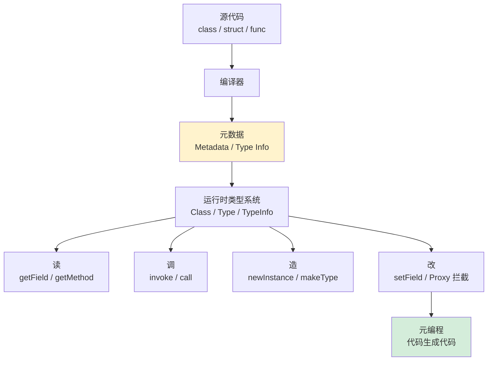
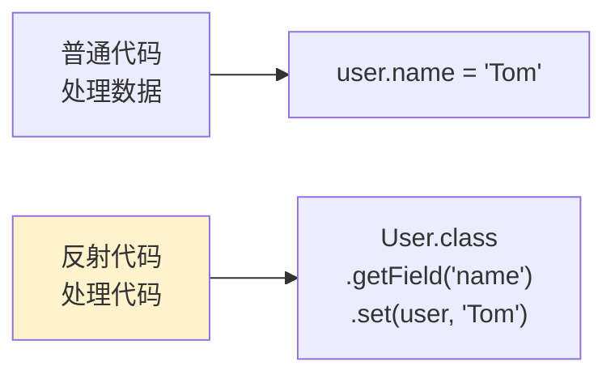
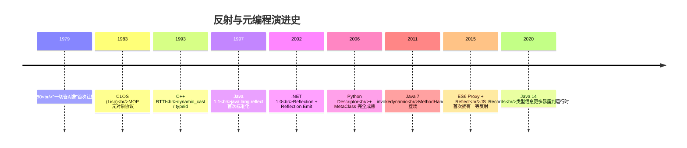
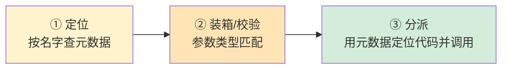
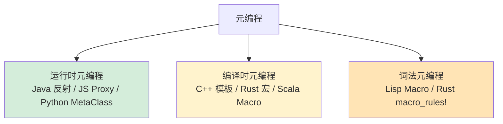

# 10.反射与元编程核心设计

> 📍 **本篇位置**：第 2 卷 · 运行时模型 · 第 4 篇
> 🎯 **核心矛盾**：**编译期的"已知"vs 运行期的"未知"** —— 如何让一个在写代码时"还不存在的类型"，在程序跑起来之后依然能被**读、改、造、调**？
> 🧭 **设计灵魂**：一切反射/元编程，本质都是 **"把语言自己变成语言的数据"** ——让类型系统成为运行时的一等公民（First-class Types）
> 🌐 **跨语言覆盖**：Java(Class + Method + MethodHandle) · C#(Type + Reflection.Emit) · C++(RTTI + 模板元) · Go(reflect 双指针) · Python(`__class__` + `__dict__` + MetaClass) · JavaScript(Proxy + Reflect)
> 🔗 **延伸阅读**：← [09.对象和函数访问原理](./09.对象和函数访问原理.md) · → [04.泛型设计灵魂思想](./04.泛型设计灵魂思想.md) · → [33.内存回收机制设计](./33.内存回收机制设计.md)



---

#### 目录介绍
- [1.根本矛盾：为什么需要反射](#1根本矛盾为什么需要反射)
  - [1.1 一个"类型消失"的痛](#11-一个类型消失的痛)
  - [1.2 反射到底在反射什么](#12-反射到底在反射什么)
  - [1.3 三大真实场景](#13-三大真实场景)
- [2.设计演进：从 RTTI 到 Proxy](#2设计演进从-rtti-到-proxy)
  - [2.1 1990s RTTI 与 typeid](#21-1990s-rtti-与-typeid)
  - [2.2 2000s Java 反射 API](#22-2000s-java-反射-api)
  - [2.3 2010s MethodHandle 与 Invokedynamic](#23-2010s-methodhandle-与-invokedynamic)
  - [2.4 2015+ Proxy 与元对象协议](#24-2015-proxy-与元对象协议)
- [3.核心机制](#3核心机制)
  - [3.1 元数据从哪来](#31-元数据从哪来)
  - [3.2 反射调用的三段式](#32-反射调用的三段式)
  - [3.3 反射为什么慢](#33-反射为什么慢)
  - [3.4 注解/标签如何被读到](#34-注解标签如何被读到)
- [4.跨语言实现对照](#4跨语言实现对照)
  - [4.1 Java：Class + Method + Field](#41-javaclass--method--field)
  - [4.2 C#：Type + Reflection.Emit](#42-ctype--reflectionemit)
  - [4.3 C++：RTTI + 模板元编程](#43-cr rtti--模板元编程)
  - [4.4 Go：reflect 的双指针结构](#44-goreflect-的双指针结构)
  - [4.5 Python：一切皆对象](#45-python一切皆对象)
  - [4.6 JavaScript：Proxy 与 Reflect](#46-javascriptproxy-与-reflect)
- [5.元编程：让代码生成代码](#5元编程让代码生成代码)
  - [5.1 三种元编程风格](#51-三种元编程风格)
  - [5.2 运行时元编程](#52-运行时元编程)
  - [5.3 编译期元编程](#53-编译期元编程)
  - [5.4 宏系统](#54-宏系统)
- [6.共性抽象：统一模型](#6共性抽象统一模型)
  - [6.1 四动词模型 读/改/造/调](#61-四动词模型-读改造调)
  - [6.2 一等类型 First-class Type](#62-一等类型-first-class-type)
- [7.经典陷阱](#7经典陷阱)
  - [7.1 性能陷阱](#71-性能陷阱)
  - [7.2 安全陷阱](#72-安全陷阱)
  - [7.3 泛型擦除陷阱](#73-泛型擦除陷阱)
- [8.一句话总结](#8一句话总结)

---

## 1.根本矛盾：为什么需要反射

### 1.1 一个"类型消失"的痛

写代码的时刻，我们看到的是源码里的 `class User`；但代码被编译成字节码/机器码以后，类型往往只剩**名字**和一些**布局信息**。运行期想再拿到"这个对象有哪些字段"、"这个字段叫什么"、"这个方法的参数是什么类型"——如果没有反射，**这些问题都没有答案**。

举一个具体的痛点：写一个**通用 JSON 序列化器**，它需要接受**任意对象**，把对象的所有字段名 + 值输出成 JSON。如果没有反射：

```java
// 假设没有反射，我们只能这样写
String userToJson(User u) { return "{\"name\":\"" + u.name + "\",\"age\":" + u.age + "}"; }
String orderToJson(Order o) { /* 又写一遍 */ }
// ... 每个类都要手写一遍
```

这显然不可接受。**反射的存在，就是为了让"通用代码处理未知类型"成为可能**——Jackson、Gson、Spring、ORM、依赖注入，背后通通是反射。

### 1.2 反射到底在反射什么

"反射（Reflection）"这个词来自镜子：程序**照镜子看自己**。镜子里是什么？是程序自己的**结构**——类名、字段、方法、注解、继承关系。



普通代码操作**数据**；反射代码操作**代码本身**——这就是为什么反射被归类到"元编程（Meta-Programming）"家族。

### 1.3 三大真实场景

| 场景 | 典型代表 | 为什么非反射不可 |
|---|---|---|
| **序列化/反序列化** | Jackson / Gson / protobuf-java | 框架不知道你会传什么类进来 |
| **依赖注入/IOC** | Spring / Dagger / Guice | 框架要"替你 new 对象并填好依赖" |
| **ORM** | Hibernate / MyBatis / GORM | 要把表字段和类字段自动对映 |
| **测试框架** | JUnit / TestNG / pytest | 要找到带 `@Test` 的方法并调用 |
| **动态代理** | Spring AOP / gRPC Stub | 运行时"凭空生成"实现类 |

---

## 2.设计演进：从 RTTI 到 Proxy



### 2.1 1990s RTTI 与 typeid

C++ 的 RTTI（Run-Time Type Information）是最早、最保守的一种"反射"。它只能做两件小事：

- `typeid(obj)` 拿到一个 `type_info` 对象（只告诉你"是哪个类型"）
- `dynamic_cast<Derived*>(base_ptr)` 做**安全向下转型**

它**拿不到字段**、**拿不到方法**、**不能调用**。因为 C++ 编译后类型信息会被大量擦掉，只保留虚函数表那点点儿。

### 2.2 2000s Java 反射 API

Java 把类信息**完整保存在 .class 文件**里（常量池 + 字段表 + 方法表 + 属性表），运行期由 JVM 载入成一个个 `Class<?>` 对象。于是：

```java
Class<?> c = User.class;
Field f = c.getDeclaredField("name");
f.setAccessible(true);
f.set(user, "Tom");                       // 修改字段
Method m = c.getMethod("greet", String.class);
Object ret = m.invoke(user, "World");      // 调用方法
```

**设计灵魂**：把 `.class` 文件里的元数据，原样映射成 `Class`/`Method`/`Field` 三大类——**让元数据成为可编程的对象**。

### 2.3 2010s MethodHandle 与 Invokedynamic

Java 7 意识到老反射**性能太差**（每次 `invoke` 都要做权限检查、类型装箱），引入了 `MethodHandle`：

```java
MethodHandle h = MethodHandles.lookup()
    .findVirtual(User.class, "greet", MethodType.methodType(String.class, String.class));
String r = (String) h.invokeExact(user, "World");   // 接近直接调用的速度
```

配合 `invokedynamic` 字节码，JVM 可以在**首次调用时绑定**，后续**内联优化**——这是 Lambda、Kotlin 协程、JRuby 的底层基石。

### 2.4 2015+ Proxy 与元对象协议

JavaScript ES6 给出了另一种思路——**不是读元数据，而是拦截操作**：

```javascript
const target = { name: 'Tom' };
const proxy = new Proxy(target, {
  get(obj, prop) {
    console.log(`读取 ${prop}`);
    return Reflect.get(obj, prop);
  },
  set(obj, prop, val) {
    console.log(`写入 ${prop} = ${val}`);
    return Reflect.set(obj, prop, val);
  }
});
proxy.name;            // 日志：读取 name
proxy.name = 'Jerry';  // 日志：写入 name = Jerry
```

Proxy 是**元对象协议（MOP）** 的现代体现——**任何对象操作都可以被程序员接管**。Vue 3 的响应式系统、SolidJS、MobX 就是这样做到"自动追踪依赖"的。

---

## 3.核心机制

### 3.1 元数据从哪来

| 语言 | 元数据载体 | 何时生成 | 运行时完整度 |
|---|---|---|---|
| **Java** | `.class` 文件常量池 + 各 Table | 编译期 | ★★★★★ |
| **C#** | PE 文件的 Metadata Stream | 编译期 | ★★★★★ |
| **Go** | `runtime._type` 结构 + `typelinks` | 编译期 | ★★★★ |
| **Python** | 类对象的 `__dict__` | 运行期 | ★★★★★ |
| **JavaScript** | 对象自身属性 + 原型链 | 运行期 | ★★★★ |
| **C++** | `type_info` + vtable（极少） | 编译期 | ★ |
| **Rust** | `TypeId` + `Any` trait（极少） | 编译期 | ★ |

这也解释了一个常见误解：**"编译型语言就不能有完整反射"——不对**。Java 是编译型，也有完整反射；C++ 和 Rust 反射弱，不是因为"编译"，而是**设计取舍**——它们选择了"零成本抽象"，拒绝为"可能用不到"的元数据付内存代价。

### 3.2 反射调用的三段式

不管哪门语言，反射调用一个方法都走下面这三步：



每一步都比直接调用**多做一次事**：

1. **定位**：`HashMap<String, Method>` 查找
2. **装箱**：基本类型装成 `Integer`/`Double`
3. **分派**：走 `MethodAccessor` 或 JNI

### 3.3 反射为什么慢

```java
// Benchmark（典型数据，JIT 稳定后）
直接调用:         2-3 ns
MethodHandle:     3-5 ns
Method.invoke:    50-200 ns  // 慢 20-60x
```

三大开销源：
- **安全检查**：`setAccessible(true)` 可省一部分
- **参数装箱**：`Object[] args` 让 `int` 变成 `Integer`
- **JIT 失败**：老反射路径难以内联

**优化手段**：
- 反射调用的结果**缓存**为 `Field`/`Method`（不要每次 `getField`）
- 用 `MethodHandle` 替代老反射
- 框架级优化：ASM/ByteBuddy 生成**直接调用的字节码**（Jackson-afterburner、Spring 5 的字节码增强）

### 3.4 注解/标签如何被读到

注解本质上也是**元数据**。Java 注解以 `RUNTIME` 保留策略写进 `.class` 的 `RuntimeVisibleAnnotations` 属性：

```java
@Retention(RetentionPolicy.RUNTIME)
@Target(ElementType.METHOD)
public @interface Test {}

// 框架侧
for (Method m : c.getDeclaredMethods()) {
    if (m.isAnnotationPresent(Test.class)) {
        m.invoke(c.getDeclaredConstructor().newInstance());
    }
}
```

**这就是 JUnit 运行测试的全部秘密**——找到带 `@Test` 的方法，反射调用它。

---

## 4.跨语言实现对照

### 4.1 Java：Class + Method + Field

**三位一体**：每个类都有一个 `Class<?>` 对象；每个字段/方法都有对应 `Field`/`Method`。

```java
public class UserJsonizer {
    public static String toJson(Object obj) throws Exception {
        Class<?> c = obj.getClass();
        StringBuilder sb = new StringBuilder("{");
        Field[] fs = c.getDeclaredFields();
        for (int i = 0; i < fs.length; i++) {
            fs[i].setAccessible(true);
            if (i > 0) sb.append(",");
            sb.append("\"").append(fs[i].getName()).append("\":")
              .append("\"").append(fs[i].get(obj)).append("\"");
        }
        return sb.append("}").toString();
    }
}
```

### 4.2 C#：Type + Reflection.Emit

C# 的反射**比 Java 强**——不仅能读，还能**凭空生成 IL 并执行**：

```csharp
// 动态生成一个加法方法
var dm = new DynamicMethod("Add", typeof(int), new[] { typeof(int), typeof(int) });
var il = dm.GetILGenerator();
il.Emit(OpCodes.Ldarg_0);
il.Emit(OpCodes.Ldarg_1);
il.Emit(OpCodes.Add);
il.Emit(OpCodes.Ret);
var add = (Func<int,int,int>)dm.CreateDelegate(typeof(Func<int,int,int>));
Console.WriteLine(add(2, 3));   // 5
```

Newtonsoft.Json、Entity Framework 的极致性能都靠 `Reflection.Emit`。

### 4.3 C++：RTTI + 模板元编程

C++ 走的是完全相反的路——**把反射放到编译期做**：

```cpp
// 编译期反射（C++20 后还更强）
template<typename T>
void print_size() {
    std::cout << typeid(T).name() << " size = " << sizeof(T) << '\n';
}
print_size<std::string>();   // 编译期就知道名字和大小
```

运行期反射极其有限：
```cpp
Base* b = new Derived();
if (Derived* d = dynamic_cast<Derived*>(b)) { /* 安全转型 */ }
std::cout << typeid(*b).name();     // "Derived"
```

C++26 即将引入**静态反射（P2996）**，这是 C++ 圈子几十年的呼声，会让编译期自省大爆发。

### 4.4 Go：reflect 的双指针结构

Go 的 `interface{}` 内部是 `(type, value)` 双指针：

```go
type eface struct {
    _type *_type       // 指向类型元数据
    data  unsafe.Pointer  // 指向实际数据
}
```

`reflect.TypeOf` / `reflect.ValueOf` 就是把这两个指针取出来给你：

```go
func PrintFields(obj interface{}) {
    v := reflect.ValueOf(obj)
    t := v.Type()
    for i := 0; i < t.NumField(); i++ {
        fmt.Printf("%s = %v\n", t.Field(i).Name, v.Field(i).Interface())
    }
}
```

Go 反射**慢于 Java**（没有 JIT 优化路径），所以**热路径上要避开 reflect**，这是 Go 社区共识（见 `encoding/json` 为什么被 `sonic`、`easyjson` 替代）。

### 4.5 Python：一切皆对象

Python 的哲学极端——**类是对象，方法是对象，模块是对象，一切都是对象，都有 `__dict__`**：

```python
class User:
    def __init__(self, name): self.name = name
    def greet(self): return f"Hi, {self.name}"

u = User("Tom")
# 反射：动词四件套
print(u.__dict__)                  # 读字段：{'name': 'Tom'}
setattr(u, 'age', 18)              # 改字段
method = getattr(u, 'greet')       # 找方法
print(method())                    # 调方法

# 元编程：用 MetaClass 在类创建时注入
class AutoRepr(type):
    def __new__(mcs, name, bases, ns):
        ns['__repr__'] = lambda self: f"{name}({self.__dict__})"
        return super().__new__(mcs, name, bases, ns)

class Point(metaclass=AutoRepr):
    def __init__(self, x, y): self.x, self.y = x, y

print(Point(1, 2))  # Point({'x': 1, 'y': 2})
```

Django ORM、SQLAlchemy、pydantic 的全部魔法都在这里。

### 4.6 JavaScript：Proxy 与 Reflect

JS 的 Proxy 是**行为拦截**式反射：

```javascript
// 实现一个自动校验的对象
const validated = new Proxy({}, {
  set(obj, prop, val) {
    if (prop === 'age' && typeof val !== 'number')
      throw new TypeError('age must be number');
    return Reflect.set(obj, prop, val);
  }
});
validated.age = 18;      // OK
validated.age = "18";    // TypeError
```

Vue 3 响应式、Immer、MobX 都是它的亲儿子。

---

## 5.元编程：让代码生成代码

### 5.1 三种元编程风格



### 5.2 运行时元编程

最灵活但代价高——前文反射即是。**动态代理**是经典应用：

```java
// JDK 动态代理：凭空造一个实现类
Service proxy = (Service) Proxy.newProxyInstance(
    loader,
    new Class[]{Service.class},
    (p, m, args) -> {
        System.out.println("before " + m.getName());
        Object r = m.invoke(realService, args);
        System.out.println("after " + m.getName());
        return r;
    });
```

### 5.3 编译期元编程

C++ 模板元编程（TMP）——图灵完备的"编译期计算"：

```cpp
template<int N> struct Fact { enum { V = N * Fact<N-1>::V }; };
template<> struct Fact<0> { enum { V = 1 }; };
static_assert(Fact<10>::V == 3628800);   // 编译期就算完了
```

Rust 用 `const fn` + 宏把这一套做得更现代：

```rust
const fn fact(n: u64) -> u64 {
    if n == 0 { 1 } else { n * fact(n - 1) }
}
const F10: u64 = fact(10);   // 编译期求值
```

### 5.4 宏系统

Lisp 的 `defmacro` 与 Rust 的 `macro_rules!` / 过程宏，是**把语法树当值**的极致：

```rust
// Rust 过程宏：derive 自动生成实现
#[derive(Debug, Clone, Serialize, Deserialize)]
struct User { name: String, age: u32 }
// 编译器在编译期生成了 4 个 trait 的完整实现代码
```

**serde** 能比 JSON-Java 系快 5 倍的本质原因：**不走运行时反射，靠宏在编译期生成专属代码**。

---

## 6.共性抽象：统一模型

### 6.1 四动词模型 读/改/造/调

不论语言差异有多大，**一切反射 API 都围绕这 4 个动词**：

| 动词 | Java | Python | Go | JS |
|---|---|---|---|---|
| **读** | `Field.get()` | `getattr()` | `Value.Field(i)` | `Reflect.get()` |
| **改** | `Field.set()` | `setattr()` | `Value.Set()` | `Reflect.set()` |
| **造** | `Class.newInstance()` | `cls()` | `reflect.New()` | `Reflect.construct()` |
| **调** | `Method.invoke()` | `method()` | `Value.Call()` | `Reflect.apply()` |

记住这张表，你就握住了**所有语言反射的地图**。

### 6.2 一等类型 First-class Type

真正强大的反射语言满足三个性质——**类型本身是值**：

1. **可赋值**：`let t = User`（Python/Kotlin 可，Java 需包装成 `Class<?>`）
2. **可传参**：函数接受类型做参数
3. **可构造**：运行时凭空造出类型（C# Reflection.Emit，Java ByteBuddy）

一个语言在这三性上得多少分，决定了它做"框架"有多舒服。这就是为什么 Spring 用 Java 写要绕一圈 ASM，而 Spring 迁到 Kotlin 立刻简化一大截——**Kotlin 的 `KClass` 是真·一等类型**。

---

## 7.经典陷阱

### 7.1 性能陷阱

- ❌ 每次都 `getField("name")`：反射查找是 `O(n)` 线性扫描
- ✅ 把 `Field` / `Method` 对象**缓存**下来
- ✅ 热路径用 `MethodHandle` / ByteBuddy 生成直接代码
- ✅ Go 里热路径**完全避开 reflect**，用代码生成（`easyjson`）

### 7.2 安全陷阱

- ❌ `setAccessible(true)` 破坏封装——JDK 17 后模块化强制要 `--add-opens`
- ❌ 反序列化漏洞：Jackson/Fastjson 历史漏洞多出自"反射能造任意类"
  - 举例：`"@type":"com.sun.Evil"` 配合某些 getter → RCE
- ✅ **白名单反序列化**（`ObjectInputFilter`）、`@JsonTypeInfo` 禁用多态默认类

### 7.3 泛型擦除陷阱

```java
List<String> list = new ArrayList<>();
// 运行期反射拿不到 String 这个参数
list.getClass().getGenericSuperclass();  // ParameterizedType but E = Object
```

解决：**TypeToken/TypeReference 匿名子类技巧**

```java
new TypeToken<List<String>>(){}.getType();   // 能拿到 List<String> 完整类型
```

Gson/Jackson 都用这套。底层原理：**匿名子类的泛型参数会保留在父类签名里**——JVM 擦得不干净的小角落被利用了。

---

## 8.一句话总结

> **反射是"程序对自己的观察"，元编程是"程序对自己的改造"——前者让框架成为可能，后者让语言成为乐高。**

四个关键收获：

1. 反射的代价不是"神秘"，是 **查表 + 装箱 + 分派** 三段式的累积开销
2. 一切语言反射 API 都可以用 **"读/改/造/调" 四动词** 归一
3. **编译期元编程（宏/模板） ≠ 运行时反射**，前者零成本、后者灵活但昂贵
4. 注解不过是**一种标记型元数据**，框架读它做事——JUnit、Spring、Jackson 的本质

---

**延伸阅读**：
- ← [09.对象和函数访问原理](./09.对象和函数访问原理.md)：理解了 vtable，反射 `invoke` 的分派原理就一目了然
- → [04.泛型设计灵魂思想](./04.泛型设计灵魂思想.md)：类型擦除正是反射拿不到泛型参数的根因
- → [05.序列化数据的思想](./05.序列化数据的思想.md)：反射是通用序列化器的发动机
- → [33.内存回收机制设计](./33.内存回收机制设计.md)：对象销毁的话题并入 GC 卷，此处不再单列
