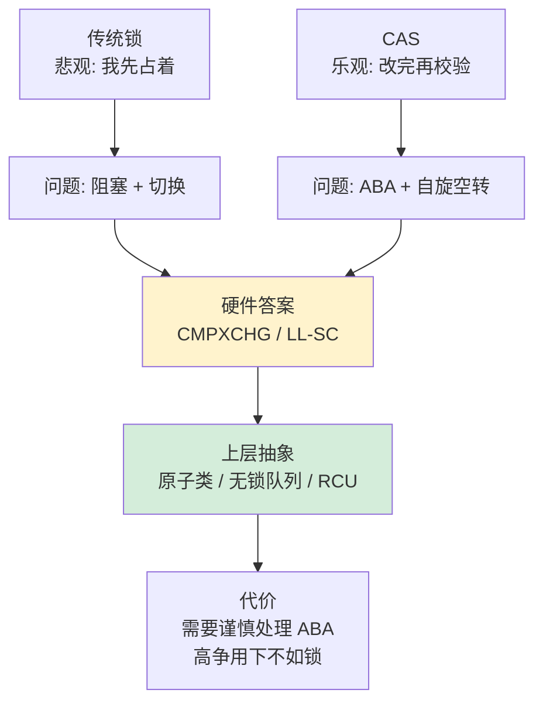
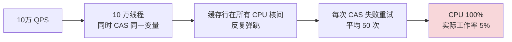
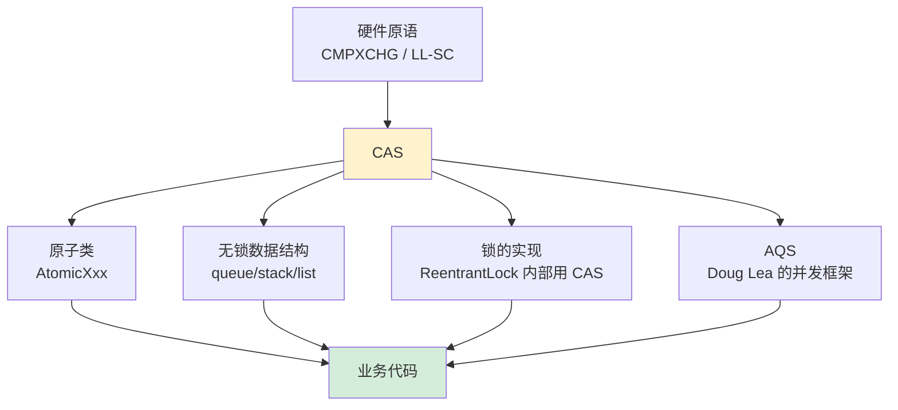
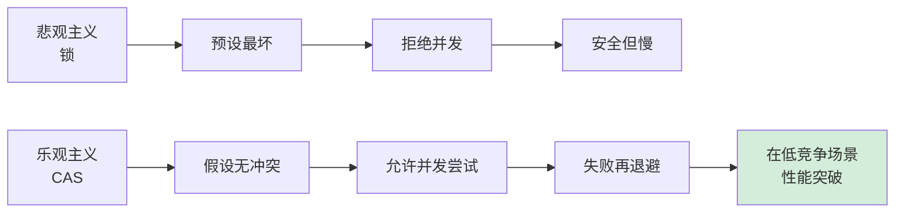

# 20.理解CAS设计和由来

> 📍 **本篇位置**：第 3 卷 · 并发之道 · 第 10 篇（内功篇）
> 🎯 **核心矛盾**：**互斥锁的稳定 vs 阻塞带来的开销** —— CAS 用"乐观+重试"换掉"上锁+睡眠"
> 🧭 **设计灵魂**：CAS = 硬件提供的"**比较并交换**"原子指令；它是**一切无锁数据结构的地基**——从 AtomicInteger 到 ConcurrentHashMap
> 🌐 **跨语言覆盖**：x86(CMPXCHG 指令) · ARM(LDREX/STREX) · Java(Unsafe.compareAndSet) · C++(std::atomic::compare_exchange) · Go(sync/atomic.CompareAndSwap)
> 🔗 **延伸阅读**：← [18.锁核心设计和思想](./18.锁核心设计和思想.md) · → [21.异步和同步的设计](./21.异步和同步的设计.md) · → [25.线程池的设计思想](./25.线程池的设计思想.md)



---

#### 目录介绍
- [1.CAS本质与灵魂](#1cas本质与灵魂)
  - [1.1 CAS哲学思想](#11-cas哲学思想)
  - [1.2 CAS解决的问题](#12-cas解决的问题)
  - [1.3 CAS设计原则](#13-cas设计原则)
  - [1.4 CAS乐观锁思想](#14-cas乐观锁思想)
  - [1.5 CAS核心思想](#15-cas核心思想)
  - [1.6 CAS操作过程](#16-cas操作过程)
  - [1.7 CAS设计思路](#17-cas设计思路)
- [2.CAS硬件基础](#2cas硬件基础)
  - [2.1 原子操作支持](#21-原子操作支持)
  - [2.2 内存一致性模型](#22-内存一致性模型)
  - [2.3 缓存一致性协议](#23-缓存一致性协议)
- [3.CAS经典场景](#3cas经典场景)
  - [3.1 Atomic实现](#31-atomic实现)
  - [3.2 无锁栈的实现](#32-无锁栈的实现)
  - [3.3 ABA问题缘由](#33-aba问题缘由)
  - [3.4 ABA问题解决](#34-aba问题解决)
- [4.CAS性能特征](#4cas性能特征)
  - [4.1 CAS性能优势](#41-cas性能优势)
  - [4.2 CAS性能劣势](#42-cas性能劣势)
  - [4.3 性能优化策略](#43-性能优化策略)
- [6.不同语言实现](#6不同语言实现)
  - [6.1 Java中CAS实现](#61-java中cas实现)
  - [6.2 C++中CAS实现](#62-c中cas实现)
  - [6.3 Go中CAS实现](#63-go中cas实现)
- [7.CAS的局限性](#7cas的局限性)
  - [7.1 ABA问题](#71-aba问题)
  - [7.2 自旋开销](#72-自旋开销)
  - [7.3 单个变量](#73-单个变量)
  - [7.4 内存序问题](#74-内存序问题)
  - [7.5 CAS替代方案](#75-cas替代方案)
- [8.CAS技术总结](#8cas技术总结)
  - [8.1 设计思想总结](#81-设计思想总结)
  - [8.2 核心原理总结](#82-核心原理总结)
  - [8.3 局限性剖析](#83-局限性剖析)


## 1.CAS本质与灵魂

### 1.1 CAS哲学思想

先从一个现实生活的类比开始探索：CAS 所体现的哲学叫什么？

```
场景：一间会议室，三个人都想进去开会

方法一 - “悲观”：
  门上装锁 → 人 A 拿钥匙进去 → 人 B/C 在门外蹲着等
  优点：安全。缺点：人 B/C 什么也做不了，资源浪费
  → 这是传统锁。“预设最坏，接上锁。”

方法二 - “乐观”：
  三人都冲进去 → 进门前问一句“里面还是快才那个状态吗？”
  是 → 进去；否 → 退出重来
  优点：冲突少时、人人都能继续走；缺点：冲突多时、重试獄动
  → 这就是 CAS。“预设没冲突，冲了再谈。”
```

Compare-And-Swap（比较并交换）不仅仅是一个简单的原子操作，它体现了并发编程中一种深刻的设计哲学：**乐观并发控制**。这种哲学的核心在于相信冲突是少数情况，大多数时候操作可以顺利完成，只有在真正发生冲突时才需要重试。

**这个假设昪有条件的——这是 CAS 成败的分水岭**：

| 应用场景 | 冲突频率 | CAS 后果 |
|---------|---------|-----------|
| 状态标记位翻转 | 极低 | 极佳 |
| 计数器加一 | 中 | 一般 |
| 热点账号余额 | 高 | 反不如锁 |
| 上百万线程争同一变量 | 极高 | 灾难（缓存行弹跳） |

**设计灵魂的三个层面：**

1. **原子性保障**：CAS在硬件层面保证了"比较-交换"这个复合操作的原子性，这是并发安全的基石。在 x86 上是 `LOCK CMPXCHG`，由硬件保证总线/缓存被锁住。
2. **无锁化思维**：通过避免传统的互斥锁，CAS实现了真正的无锁并发，消除了锁带来的性能开销和死锁风险。你不需要 OS 帮你调度、不需要进内核、不需要等其他人释放。
3. **失败重试机制**：当CAS操作失败时，通常采用自旋重试的策略，体现了"不放弃"的设计理念。但注意：重试不是免费的，高冲突下重试会烧 CPU。

### 1.2 CAS解决的问题

要看清 CAS 解决的问题，必须先看清**锁为什么不够**。从一个微观场景入手探索：

```
场景：两个线程都要把一个计数器 +1
使用 synchronized 的代价：

  线程 A: 抢锁 → 抢赢 → +1 (耗时 1ns) → 释锁
  线程 B: 抢锁 → 抢输 → 被挂起 → 进入内核等待队列
         → 被最后换出去上下文 → 耗时总计 ~5μs

   计算有效费率： 1ns / 5μs = 0.02%
   99.98% 的时间花在了“抢锁-挂起-恢复”
```

在多线程并发环境中，共享数据的安全访问一直是核心挑战。传统的解决方案依赖于互斥锁，但锁机制带来了诸多问题：

**传统锁机制的局限性：**

- **性能开销**：线程阻塞和唤醒涉及内核态切换，开销巨大。Linux 上一次锁赢可能只要 ~30ns，但一次锁争唤醒要 1-3μs。
- **死锁风险**：多个锁的获取顺序不当可能导致死锁。随代码复杂度增加，锁顺序越难人控制。
- **优先级反转**：低优先级线程持有锁时，高优先级线程被迫等待。火星路径器“火星者号” 1997 年崩溃的原因之一。
- **不可中断性**：线程在等待锁时通常无法响应中断。`synchronized` 不响应 `Thread.interrupt`。

**CAS的革命性突破：** CAS通过硬件级别的原子操作，实现了无锁的并发控制，从根本上避免了上述问题。它将并发控制的复杂性从软件层面下沉到硬件层面，大大简化了并发编程的复杂度。

**但请留意：“避免”不等于“解决”**。CAS 只是把“阻塞”换成了“重试”，在高争抢下，重试也会拖垮性能。后面专门会谈这个话题。

### 1.3 CAS设计原则

**1. 原子性原则**：CAS操作必须在硬件层面保证原子性，不能被其他线程或中断打断。这是CAS能够正确工作的基础前提。

**2. 比较的精确性**：CAS的比较操作必须是精确的位级比较，任何微小的差异都会导致操作失败。这确保了数据的一致性。

**3. 失败的透明性**：当CAS操作失败时，不会对系统状态产生任何副作用，调用者可以安全地重试或采取其他策略。

**4. 性能的可预测性**：CAS操作的性能特征是可预测的，不会因为锁竞争而产生不可预期的延迟。

### 1.4 CAS乐观锁思想

**悲观锁的实现**：synchronized就是一种悲观锁，它假设最坏的情况，认为一个线程修改共享数据的时候其他线程也会修改该数据，因此只在确保其它线程不会造成干扰的情况下执行，会导致其它所有需要锁的线程挂起，等待持有锁的线程释放锁。

**悲观锁的问题分析**

但是，由于在进程挂起和恢复执行过程中存在着很大的开销。当一个线程需要某个资源，但是这个资源的占用时间很短，当线程第一次抢占这个资源时，可能这个资源被占用，如果此时挂起这个线程，可能立刻就发现资源可用，然后又需要花费很长的时间重新抢占锁，时间代价就会非常的高。

**乐观锁的概念**

核心思路就是，每次不加锁而是假设修改数据之前其他线程一定不会修改，如果因为修改过产生冲突就失败就重试，直到成功为止。

在上面的例子中，某个线程可以不让出cpu，而是一直while循环，如果失败就重试，直到成功为止。所以，当数据争用不严重时，乐观锁效果更好。比如CAS就是一种乐观锁思想的应用。

### 1.5 CAS核心思想

能够弄懂atomic包下这些原子操作类的实现原理，就要先明白什么是CAS操作。

CAS操作（又称为无锁操作）是一种乐观锁策略，它假设所有线程访问共享资源的时候不会出现冲突，既然不会出现冲突自然而然就不会阻塞其他线程的操作。因此，线程就不会出现阻塞停顿的状态。

所谓 CAS，表征的是一些列操作的集合，获取当前数值，进行一些运算，利用 CAS 指令试图进行更新。如果当前数值未变，代表没有其他线程进行并发修改，则成功更新。否则，可能出现不同的选择，要么进行重试，要么就返回一个成功或者失败的结果。

那么，如果出现冲突了怎么办？无锁操作是使用CAS(compare and swap)又叫做比较交换来鉴别线程是否出现冲突，出现冲突就重试当前操作直到没有冲突为止。

### 1.6 CAS操作过程

CAS比较交换的过程可以通俗的理解为CAS(V,O,N)，包含三个值分别为：V 内存地址存放的实际值；O 预期的值（旧值）；N 更新的新值。

当V和O相同时，也就是说旧值和内存中实际的值相同表明该值没有被其他线程更改过，即该旧值O就是目前来说最新的值了，自然而然可以将新值N赋值给V。

反之，V和O不相同，表明该值已经被其他线程改过了则该旧值O不是最新版本的值了，所以不能将新值N赋给V，返回V即可。

当多个线程使用CAS操作一个变量是，只有一个线程会成功，并成功更新，其余会失败。失败的线程会重新尝试，当然也可以选择挂起线程。

### 1.7 CAS设计思路

CAS操作通常由硬件提供支持，它可以在不使用锁的情况下实现对共享变量的原子操作。设计CAS的一般设计思路：

第一步：定义共享变量：首先，您需要定义一个共享变量，它将在多个线程之间进行读取和修改。这可以是一个整数、对象引用或其他类型的变量。

第二步：读取共享变量：使用CAS操作之前，需要读取共享变量的当前值。这可以通过直接读取变量的值或使用特定的读取方法来完成。

第三步：比较和交换：使用CAS操作来比较共享变量的当前值与期望值，并在相等时将新值设置为共享变量的值。这个操作是原子的，即在同一时刻只有一个线程能够成功执行。

第四步：处理CAS操作的结果：CAS操作返回一个布尔值，表示操作是否成功。如果操作成功，表示共享变量的值已经被修改为新值；如果操作失败，表示共享变量的值没有被修改。您可以根据返回值来确定是否成功修改了共享变量。

第五步：处理CAS操作失败：如果CAS操作失败，表示有其他线程在您之前修改了共享变量的值。在这种情况下，您可以重新尝试CAS操作，或者采取其他策略，如使用自旋等待、使用锁机制或采用其他并发控制手段。


## 2.CAS硬件基础

CAS的实现需要硬件指令集的支撑

### 2.1 原子操作支持

CAS的实现依赖于现代处理器提供的原子指令支持。不同的处理器架构提供了不同的原子指令，但核心思想是一致的。

**x86/x64架构的实现：**

```assembly
; Intel x86的CMPXCHG指令
; 比较EAX与目标内存位置的值，如果相等则将源操作数写入目标位置
LOCK CMPXCHG [memory], register

; 64位版本
LOCK CMPXCHG [memory], register64
```

**ARM架构的实现：**

```assembly
; ARM的Load-Link/Store-Conditional指令对
LDREX r1, [r0]      ; Load-Exclusive，加载并标记
CMP r1, r2          ; 比较加载的值
BNE fail            ; 如果不相等则跳转到失败处理
STREX r3, r4, [r0]  ; Store-Exclusive，条件存储
CMP r3, #0          ; 检查存储是否成功
BNE retry           ; 如果失败则重试
```

### 2.2 内存一致性模型

CAS操作的正确性依赖于处理器的内存一致性模型。不同的一致性模型对CAS的语义有不同的影响。

**强一致性模型（如x86）：**

- 所有处理器看到的内存操作顺序是一致的
- CAS操作具有全局的原子性
- 实现相对简单，但可能限制性能优化

**弱一致性模型（如ARM）：**

- 不同处理器可能看到不同的内存操作顺序
- 需要显式的内存屏障来保证CAS的正确语义
- 提供更多的性能优化空间，但实现更复杂

### 2.3 缓存一致性协议

在多核处理器系统中，CAS操作的正确性还依赖于缓存一致性协议，如MESI协议。

**MESI协议的四个状态：**

- **Modified（已修改）**：缓存行被修改且只存在于当前缓存中
- **Exclusive（独占）**：缓存行未被修改且只存在于当前缓存中
- **Shared（共享）**：缓存行未被修改且存在于多个缓存中
- **Invalid（无效）**：缓存行无效

**CAS操作的缓存行为：**

```java
// Java中的CAS操作示例
public class CASExample {
    private volatile int value = 0;
    private static final Unsafe unsafe = getUnsafe();
    private static final long valueOffset;
    
    static {
        try {
            valueOffset = unsafe.objectFieldOffset
                (CASExample.class.getDeclaredField("value"));
        } catch (Exception ex) { throw new Error(ex); }
    }
    
    public boolean compareAndSet(int expect, int update) {
        // 底层会触发MESI协议，确保缓存一致性
        return unsafe.compareAndSwapInt(this, valueOffset, expect, update);
    }
}
```

**MESI 状态转移与 CAS 的互动**：

```
CAS 的本质是一个"锁住缓存行 → 检查 → 可能写入 → 释放"的微事务，每次 CAS 都会
触发从其他核获取对应缓存行的独占权。

Core A 要对地址 X 做 CAS：
  Step 1: 发出 Read-For-Ownership (RFO) 请求
  Step 2: Core B 上的缓存行 (Modified 或 Shared) 被迫转为 Invalid
  Step 3: Core A 拿到带主权的缓存行，状态 = Modified
  Step 4: 在本地原子完成比较与写入
  Step 5: 如果 Core C 同时也请求 X，它会等 Core A 释放、重新抢主权
```

这就是"缓存行弹跳"（cache line bouncing）的根源：**多个核争抢同一个原子变量时，缓存行在不同核之间来回反弹**。这是 CAS 性能不是"免费"的主要原因：即使你仅改一个字节，也会付出一整个 64 字节缓存行传输的代价。

**CAS 与内存屏障的另一件事**：

```
x86: LOCK 前缀隐含 full memory barrier
     → CAS 前后的所有读写不会跨越 CAS 重排

ARM: LDREX/STREX 本身不含屏障
     → 需要显式 DMB/DSB 指令
     → std::atomic compare_exchange 默认 seq_cst，
        编译器会加上需要的屏障指令
```

## 3.CAS经典场景
### 3.1 Atomic实现

原子计数器是CAS最直接的应用场景，它展示了CAS如何在无锁情况下实现线程安全的数值操作。

```java
public class AtomicCounter {

    private volatile int count = 0;
    private static final Unsafe unsafe = getUnsafe();
    private static final long countOffset;
    
    static {
        try {
            countOffset = unsafe.objectFieldOffset
                (AtomicCounter.class.getDeclaredField("count"));
        } catch (Exception ex) { throw new Error(ex); }
    }
    
    public int increment() {
        int current;
        int next;
        do {
            current = count;  // 读取当前值
            next = current + 1;  // 计算新值
        } while (!unsafe.compareAndSwapInt(this, countOffset, current, next));
        return next;
    }

    public int get() {
        return count;  // volatile读取，保证可见性
    }
}
```

### 3.2 无锁栈的实现

无锁栈是CAS在数据结构中应用的经典例子，它展示了如何使用CAS实现复杂的并发数据结构。

```java
public class LockFreeStack<T> {
    private volatile Node<T> top;
    private static final Unsafe unsafe = getUnsafe();
    private static final long topOffset;
    
    static {
        try {
            topOffset = unsafe.objectFieldOffset
                (LockFreeStack.class.getDeclaredField("top"));
        } catch (Exception ex) { throw new Error(ex); }
    }
    
    private static class Node<T> {
        final T data;
        volatile Node<T> next;
        
        Node(T data, Node<T> next) {
            this.data = data;
            this.next = next;
        }
    }
    
    public void push(T item) {
        Node<T> newNode = new Node<>(item, null);
        Node<T> currentTop;
        do {
            currentTop = top;
            newNode.next = currentTop;
        } while (!unsafe.compareAndSwapObject(this, topOffset, currentTop, newNode));
    }
    
    public T pop() {
        Node<T> currentTop;
        Node<T> newTop;
        do {
            currentTop = top;
            if (currentTop == null) {
                return null;  // 栈为空
            }
            newTop = currentTop.next;
        } while (!unsafe.compareAndSwapObject(this, topOffset, currentTop, newTop));
        return currentTop.data;
    }
}
```

### 3.3 ABA问题缘由

ABA问题是CAS操作中的一个经典问题，它揭示了CAS在某些场景下的局限性。

ABA问题描述：因为CAS会检查旧值有没有变化，这里存在这样一个有意思的问题。比如一个旧值A变为了成B，然后再变成A，刚好在做CAS时检查发现旧值并没有变化依然为A，但是实际上的确发生了变化。

**ABA问题的本质：**

```java
// 线程1的操作序列
T1: 读取A的值为1
T1: 准备将A从1改为2

// 线程2的操作序列（在T1的CAS操作之前执行）
T2: 将A从1改为3
T2: 将A从3改为1  // A的值又变回了1

// 线程1继续执行
T1: CAS(A, 1, 2) 成功！  // 但实际上A已经被修改过了
```


### 3.4 ABA问题解决

解决方案可以沿袭数据库中常用的乐观锁方式，添加一个版本号可以解决。

核心思路：原来的变化路径A->B->A就变成了1A->2B->3A。

**使用版本号解决ABA问题：**

```java
public class VersionedReference<T> {
    private volatile T reference;
    private volatile int version;
    private static final Unsafe unsafe = getUnsafe();
    private static final long referenceOffset;
    private static final long versionOffset;
    
    static {
        try {
            referenceOffset = unsafe.objectFieldOffset
                (VersionedReference.class.getDeclaredField("reference"));
            versionOffset = unsafe.objectFieldOffset
                (VersionedReference.class.getDeclaredField("version"));
        } catch (Exception ex) { throw new Error(ex); }
    }
    
    public VersionedReference(T reference, int version) {
        this.reference = reference;
        this.version = version;
    }
    
    public boolean compareAndSet(T expectedRef, T newRef, 
                                int expectedVersion, int newVersion) {
        return unsafe.compareAndSwapObject(this, referenceOffset, expectedRef, newRef) &&
               unsafe.compareAndSwapInt(this, versionOffset, expectedVersion, newVersion);
    }
    
    public T getReference() { return reference; }
    public int getVersion() { return version; }
}
```

## 4.CAS性能特征

### 4.1 CAS性能优势

为什么 CAS 会比锁快？从三个角度拆解。

**角度1：路径长度**

```
synchronized 的一次抢锁失败：
  动作序列：CAS 试一次 → 失败 → 调用 OS futex → 入内核、被挂起…
  CPU 周期：~3000-5000周期

CAS 的一次重试：
  动作序列：CAS 失败 → 走循环 → 快重试
  CPU 周期：~30周期
```

**角度2：上下文切换**

锁的抢锁失败 → 线程被挂起 → OS 选另一个线程 → 上下文切换。一次上下文切换要几千 ns，还要热身缓存。而 CAS 失败不会让出 CPU。

**角度3：能在内联实现**

JDK 9 后 `AtomicInteger.incrementAndGet()` 被 JIT 识别为 intrinsic，直接补为一条汇编：

```
x86: lock xadd %eax, (%rdi)    // 一条指令
ARM: ldaxr/stlxr 重试环    // 几条指令
```

与 `synchronized` 代码需要调用进入、检查 monitor 状态、可能调用 OS 抢锁函数不是一个量级的开销。

**量化对比**：以计数器 +1 为例（单线程、无争抢）：

| 实现 | 耗时 | 与 CAS 比 |
|------|------|-----------|
| 裸 ++ | ~0.3ns | 0.04x |
| volatile ++（不原子）| ~1ns | 0.13x |
| **AtomicInteger** | **~7-10ns** | **1x** |
| ReentrantLock | ~30ns | 3-4x |
| synchronized（偏向锁）| ~15ns | 2x |
| synchronized（轻量级）| ~50ns | 5-7x |
| synchronized（重量级）| ~3000ns+ | 300x+ |

**CAS性能优势：**

1. **无上下文切换开销**：线程不会被阻塞，避免了内核态切换。
2. **无死锁风险**：不存在锁的获取和释放，自然避免了死锁。
3. **更好的缓存局部性**：自旋等待时数据保持在缓存中。
4. **可被编译器内联为单指令**，达到理论上限。

### 4.2 CAS性能劣势

表面看上去 CAS 赢面很大，但上面所有数据都隐含一个前提：无争抢。**争抢一变，世界颗覆**。

**思考实验：64 个 CPU 核同时对同一个 `AtomicLong` 加 1**

```
逻辑上：低成本原子加、性能应该很高
现实：
  - 每个核试图修改 → 希望拿到该缓存行的独占权
  - 64 个核轮流"拍抢"该缓存行
  - 缓存行在 64 个核之间不断来回传送（cache line bouncing）
  - 每次 CAS 失败重试几十次才能赢一次
  
  结果：该字段的吞吐量不但没提升，反而随核数增加而下降
```

**CAS性能劣势：**

1. **自旋开销**：高竞争情况下，大量的自旋会浪费CPU资源。极端场景下，CPU 100% 使用率但 0% 吞吐量。
2. **缓存行争抢**：多个线程同时访问同一缓存行会导致缓存失效。这是隐藏的“伪共享”（False Sharing）问题的另一面。
3. **内存带宽消耗**：频繁的CAS操作会增加内存带宽的使用。本质是跨核 cache coherence 流量眨升。
4. **不适合复杂场景**：仅能原子修改一个字，复杂多变量修改需“打包”。
5. **错误可见性考量**：不同语言、不同架构下的 memory order 表现不同，错误难复现。

**与锁的对比在不同争抢下的表现**：

```
争抢度 →     CAS平均耗时        锁平均耗时
无 (1线程)            ~7ns                  ~50ns
低 (2-4线程)          ~30ns                 ~100ns
中 (8-16线程)         ~150ns                ~300ns
高 (32+线程)          ~5μs+ (CAS风暴)    ~1.5μs (锁拍胜)
```

**这是为什么 LongAdder 要取代 AtomicLong 的所有动机**：热点字段上作 CAS 是并发中最隐费的事之一。
### 4.3 性能优化策略

**1. 减少竞争热点**

```java
// 使用分段技术减少竞争
public class SegmentedCounter {
    private final AtomicLong[] segments;
    private final int segmentCount;
    
    public SegmentedCounter(int segmentCount) {
        this.segmentCount = segmentCount;
        this.segments = new AtomicLong[segmentCount];
        for (int i = 0; i < segmentCount; i++) {
            segments[i] = new AtomicLong(0);
        }
    }
    
    public void increment() {
        int segment = Thread.currentThread().hashCode() % segmentCount;
        segments[Math.abs(segment)].incrementAndGet();
    }
    
    public long sum() {
        long total = 0;
        for (AtomicLong segment : segments) {
            total += segment.get();
        }
        return total;
    }
}
```

**2. 使用退避策略**

```java
public class BackoffCAS {
    private volatile int value = 0;
    private static final Unsafe unsafe = getUnsafe();
    private static final long valueOffset;
    
    public boolean compareAndSetWithBackoff(int expect, int update) {
        int backoff = 1;
        while (!unsafe.compareAndSwapInt(this, valueOffset, expect, update)) {
            // 指数退避
            try {
                Thread.sleep(backoff);
                backoff = Math.min(backoff * 2, 1000); // 最大退避1秒
            } catch (InterruptedException e) {
                Thread.currentThread().interrupt();
                return false;
            }
            expect = value; // 重新读取期望值
        }
        return true;
    }
}
```

## 5.CAS 内部实现机制

上一节看到 CAS 在硬件层面依赖锁总线/锁缓存行、依赖 LL/SC。本章走入一层，从“几个原子指令”点出发，看 CAS 如何一步步被包装为能被业务代码使用的原子类与锁。

### 5.1 strong vs weak：为什么要服务于 LL/SC 架构

`std::atomic` 提供了两个版本的 CAS：

```cpp
bool compare_exchange_strong(T& expected, T desired, ...);
bool compare_exchange_weak(T& expected, T desired, ...);
```

```
strong:
  仅在“值不等于 expected”时返回失败
  适合：不需重试循环的场景

weak:
  除了“值不等于 expected”还可能“虚假失败 (spurious failure)”
  原因：在 LL/SC 架构上 STREX 可能被其他中断事件 (中断、上下文切换) 打断独占标记
  适合：已经包于重试循环中的场景，使用 weak 性能更好
```

这是为什么业界“在循环里需使用 weak，不在循环里需使用 strong”的原因。

### 5.2 内存序：CAS 最微妙的 6 个参数

C++ 提供了六种 memory_order，在 CAS 上可以分别指定“成功序”与“失败序”：

```cpp
flag.compare_exchange_strong(
    expected,                        // 期望值
    desired,                         // 新值
    std::memory_order_acq_rel,       // 成功时的内存序
    std::memory_order_acquire        // 失败时的内存序（必须不强于成功序）
);
```

为什么要区分？**成功与失败的同步语义要求不同**：

```
生产者发布场景示例：
  data = ...;                                    // 要发布的数据
  flag.compare_exchange_strong(0, 1,             // 发布 flag = 1
                                memory_order_release,   // 成功：释放语义，保证 data 不会被重排到 CAS 后
                                memory_order_relaxed);  // 失败：只是读了一次值，没发布任何数据，不需同步
```

### 5.3 Java AtomicInteger 的三层调用栈

从业务代码到 CPU 指令的调用链：

```
你的代码:                  AtomicInteger.incrementAndGet()
                                    ↓
JDK实现层:                Unsafe.getAndAddInt(this, offset, 1)
                                    ↓
JVM 本地实现（C++）:    Atomic::add(1, addr)
                                    ↓
JVM 拼装 intrinsic:        被 JIT 识别为“intrinsic”，直接补上
                            x86: lock xadd
                            ARM: ldaxr/stlxr 重试环
                                    ↓
CPU 执行:                 一条或几条原子指令
```

JDK 9 之后，`AtomicInteger.incrementAndGet()` 被 JIT intrinsic 重写为单条 `lock xadd`——**从 Java 到汇编只剩下一条指令**。这是 Java 原子类高性能的根源。

### 5.4 LongAdder：用“分段”解决 CAS 风暴

Java 8 推出 `LongAdder` 取代高争抢场景下的 `AtomicLong`。思路是“分账”：

```
AtomicLong:                       LongAdder:
  ┌─────────────────┐            ┌─────────────────┐
  │   value (全局唯一) │            │ base + cells[N]   │
  └─────────────────┘            │ 每个线程散列到   │
  64 个线程抢同一个字          │ 不同的 cell      │
  → CAS 风暴                       └─────────────────┘
                                  读取时 = base + ∑ cells[i]
```

代价：读取不再是原子的，返回一个弱一致快照。但这在“写多读少”场景（如请求计数）下是可接受的全胜选。

类似思路也出现在：

- C++ Folly 的 `RelaxedConcurrentlyAccessed`
- Linux 内核 `percpu` 计数器
- Go runtime 中每 P (Processor) 有本地计数器

### 5.5 Java 实现层的反响呦联动

看一下 CAS 如何访问 Java 对象内部字段，这会漏授一个很巧妙的设计：

```java
static {
    try {
        valueOffset = unsafe.objectFieldOffset(
            AtomicInteger.class.getDeclaredField("value"));
    } catch (Exception ex) { throw new Error(ex); }
}
```

`objectFieldOffset` 在 JVM 启动时计算字段的存储偏移量，缓存下来以后 CAS 直接用。这个设计让 CAS **不需要在运行期查反射**，只是一次性获取偏移后的快速内存访问：

```
运行时的 CAS 调用：
  unsafe.compareAndSwapInt(this, valueOffset, expect, update)
         ↓
  JIT 展开为：
    addr = (long)this + valueOffset       // 一次加法得到字段地址
    lock cmpxchgl expect, update, [addr]  // 单条原子指令
```

## 6.不同语言实现

### 6.1 Java中CAS实现

Java通过`java.util.concurrent.atomic`包提供了丰富的CAS支持，底层依赖于Unsafe类。

```java
// Java的AtomicInteger实现原理
public class AtomicInteger extends Number implements java.io.Serializable {
    private static final Unsafe unsafe = Unsafe.getUnsafe();
    private static final long valueOffset;
    
    static {
        try {
            valueOffset = unsafe.objectFieldOffset
                (AtomicInteger.class.getDeclaredField("value"));
        } catch (Exception ex) { throw new Error(ex); }
    }
    
    private volatile int value;
    
    public final boolean compareAndSet(int expect, int update) {
        return unsafe.compareAndSwapInt(this, valueOffset, expect, update);
    }
    
    public final int getAndIncrement() {
        return unsafe.getAndAddInt(this, valueOffset, 1);
    }
}
```

**Java CAS的特点：**

- 基于Unsafe类的底层实现
- 提供了丰富的原子类型
- 支持对象引用的CAS操作
- 内存模型保证了CAS的正确语义

### 6.2 C++中CAS实现

C++11引入了`std::atomic`库，提供了标准化的CAS支持。

```cpp
#include <atomic>
#include <thread>
#include <vector>

class AtomicCounter {
private:
    std::atomic<int> count{0};
    
public:
    int increment() {
        int expected = count.load();
        while (!count.compare_exchange_weak(expected, expected + 1)) {
            // compare_exchange_weak可能会虚假失败，需要循环重试
        }
        return expected + 1;
    }
    
    int get() const {
        return count.load();
    }
};

// 使用memory_order控制内存序
class OrderedCounter {
private:
    std::atomic<int> count{0};
    
public:
    int increment() {
        return count.fetch_add(1, std::memory_order_acq_rel) + 1;
    }
    
    bool compareAndSet(int expected, int desired) {
        return count.compare_exchange_strong(expected, desired, 
                                           std::memory_order_acq_rel);
    }
};
```

**C++ CAS的特点：**
- 提供了细粒度的内存序控制
- 区分strong和weak版本的CAS
- 支持自定义的内存序语义
- 与硬件指令的映射更直接

### 6.3 Go中CAS实现


Go语言通过`sync/atomic`包提供CAS支持，设计简洁而高效。

```go
package main

import (
    "sync/atomic"
    "unsafe"
)

type AtomicCounter struct {
    count int64
}

func (c *AtomicCounter) Increment() int64 {
    return atomic.AddInt64(&c.count, 1)
}

func (c *AtomicCounter) CompareAndSwap(old, new int64) bool {
    return atomic.CompareAndSwapInt64(&c.count, old, new)
}

func (c *AtomicCounter) Load() int64 {
    return atomic.LoadInt64(&c.count)
}

// 指针类型的CAS操作
type Node struct {
    value int
    next  *Node
}

type LockFreeStack struct {
    top unsafe.Pointer // *Node
}

func (s *LockFreeStack) Push(value int) {
    newNode := &Node{value: value}
    for {
        top := (*Node)(atomic.LoadPointer(&s.top))
        newNode.next = top
        if atomic.CompareAndSwapPointer(&s.top, 
                                       unsafe.Pointer(top), 
                                       unsafe.Pointer(newNode)) {
            break
        }
    }
}

func (s *LockFreeStack) Pop() (int, bool) {
    for {
        top := (*Node)(atomic.LoadPointer(&s.top))
        if top == nil {
            return 0, false
        }
        if atomic.CompareAndSwapPointer(&s.top, 
                                       unsafe.Pointer(top), 
                                       unsafe.Pointer(top.next)) {
            return top.value, true
        }
    }
}
```

**Go CAS的特点：**

- API设计简洁明了
- 支持指针类型的原子操作
- 内存模型相对简单
- 与goroutine调度器良好集成

## 7.CAS的局限性

### 7.1 ABA问题

如前所述，CAS无法检测到值在操作期间发生的中间变化，这在某些场景下会导致逻辑错误。

**为什么 ABA 在 Java 里并不是那么可怕？**

```
Java: A 被 pop 之后，只要还有其他引用 → GC 不会回收 A
      新的 push 调用 new Node()，拿到的是一个全新地址
      那么 CAS 里 “expected = oldA” 本就不能匹配新 A，ABA 不发生
加诚例外：如果你自己实现了对象池复用 Node（合一个地址反复使用）→ 重现
C/C++: free(A) 后可能立即 malloc 拿到 A 的地址 → ABA 高发
Rust: 借用检查防止悬垂指针，但 unsafe 代码在部分场景仍需要 Hazard Pointer
```

**三种解决思路**：

| 思路 | 典型实现 | 代价 |
|------|---------|------|
| 加版本号 | `AtomicStampedReference`、指针+计数器打包 | 要多护一个字段 |
| 多字 CAS（DCAS/DWCAS）| ARM CASP 、x86 CMPXCHG16B | 需要硬件支持 |
| Hazard Pointer/Epoch | C++ folly、Rust crossbeam | 实现复杂 |

**指针+版本号打包的实际表达**：

```
   |<--- 64 位原子 long --->|
   [ 32 位版本号 | 32 位指针偏移 ]
   每次修改，版本号 +1
   原先的 A → B → A 变为 (1, A) → (2, B) → (3, A)
   CAS(expected=(1,A), new=(2,B)) 在第三步必须失败，因为现在的状态是 (3,A)
```

### 7.2 自旋开销

在高竞争环境下，大量的自旋重试会浪费CPU资源，甚至可能导致性能下降。

自旋等待是否阻塞线程，是否涉及上下文切换？自旋等待可以避免线程阻塞和上下文切换的开销。CPU时间片从一个线程切换到另一个线程时，就会发生上下文切换。

使用CAS时非阻塞同步，也就是说不会将线程挂起，会自旋（无非就是一个死循环）进行下一次尝试，如果这里自旋时间过长对性能是很大的消耗。

大多数应用场景中，确实大部分重试只会发生一次就获得了成功，但是总是有意外情况，所以在有需要的时候，还是要考虑限制自旋的次数，以免过度消耗 CPU。

为了解决自旋等待的性能问题，可以考虑以下几种策略：

1. 策略1自适应自旋：自旋等待的时间可以根据实际情况进行调整。例如，可以根据前一次自旋等待的时间和失败次数来动态调整自旋等待的时间。
2. 策略2限制自旋次数：为了避免无限自旋，可以设置一个最大自旋次数。如果达到最大自旋次数仍然无法成功，可以放弃自旋等待，转而使用其他的并发控制机制，如锁或等待-通知机制。
3. 策略3随机自旋：在自旋等待时，可以引入一定的随机性，以避免多个线程同时自旋等待的情况。例如，可以在自旋等待时引入一个随机的短暂延迟，以使线程的自旋等待时间错开。

### 7.3 单个变量

只能保证单个变量的原子性，CAS操作只能保证单个内存位置的原子性，无法直接支持多个变量的原子更新。

对多个共享变量操作时，循环CAS就无法保证操作的原子性，这个时候就可以用锁，或者有一个取巧的办法，就是把多个变量放在一个对象里来进行CAS操作。

比如有两个共享变量i＝2,j=a，合并一下ij=2a，然后用CAS来操作ij。

从Java1.5开始JDK提供了AtomicReference类来保证引用对象之间的原子性，你可以把多个变量放在一个对象里来进行CAS操作。

### 7.4 内存序问题

在弱内存模型的处理器上，CAS的内存序语义可能不够直观，容易导致微妙的并发错误。

### 7.5 CAS替代方案

**1. 事务内存（Transactional Memory）**

```java
// 概念性的事务内存API
@Transactional
public void transferMoney(Account from, Account to, int amount) {
    from.balance -= amount;  // 这些操作在事务中执行
    to.balance += amount;    // 要么全部成功，要么全部失败
}
```

**2. 无锁数据结构的专门设计**

```java
// 使用hazard pointer技术的无锁队列
public class LockFreeQueue<T> {
    private volatile Node<T> head;
    private volatile Node<T> tail;
    private final HazardPointerManager hpManager;
    
    // 复杂的无锁队列实现，避免了ABA问题
    // 使用hazard pointer管理内存回收
}
```

**3. 混合方案**

```java
// 结合CAS和锁的混合方案
public class HybridCounter {
    private volatile int fastPath = 0;
    private final Object slowPathLock = new Object();
    private int slowPath = 0;
    
    public int increment() {
        // 首先尝试快速路径（CAS）
        int current = fastPath;
        if (compareAndSet(current, current + 1)) {
            return current + 1;
        }
        
        // 快速路径失败，使用慢速路径（锁）
        synchronized (slowPathLock) {
            return ++slowPath;
        }
    }
}
```

## 8.CAS 技术总结

### 8.1 设计思想总结

CAS 是并发领域的“原子弹”。它代表的设计思想可以高度概括为：

```
  “乐观”              “下沉”                  “原子化”
   ↓                  ↓                       ↓
假设不冲突           把同步复杂性              读-改-写三事合为一步
、试了再说           从语言下沉到硬件           原子指令 表达
```

三句话记住 CAS：

1. **CAS 用一条 CPU 指令同时解决了原子性、可见性、有序性**。
2. **它采用乐观试马、失败重试的模式**，调用者需要在业务代码层面接纳重试。
3. **高竞争下 CAS 会退化为严重的缓存行弹跳**，不是万能药。

### 8.2 核心原理总结

```
“CAS = 原子指令 + 乐观重试 + 内存屏障”

x86：
  LOCK CMPXCHG  → 一条原子指令同时含 full barrier

ARM：
  LDXR  → 加载-独占（打上独占标记）
  STXR  → 有条件存储，独占标记丢失则失败
  + DMB → 按需加入屏障
二者都能表达 CAS，但反映了不同 CPU 哲学：CISC下辛、RISC拼装。
```

### 8.3 局限性剖析

隐藏局限性清单：

| 局限 | 本质 | 解法 |
|------|------|------|
| ABA | CAS 只看值不看历史 | 加版本号 / Hazard Pointer / 垃圾回收 |
| CAS 风暴 | 高竞争下重试率高 | 分段计数 (LongAdder) / 退避 / 限流 |
| 单变量限制 | 仅对一个内存位置原子 | 包装为对象引用后 CAS / DCAS / STM |
| 存储回收难 | C/C++/Rust 中 free 不安全 | RCU / Hazard Pointer / Epoch |
| 弱内存序下难推理 | ARM/POWER 不提供全局顺序 | 显式 memory_order 或 seq_cst |
| 调试难 | 重试逻辑 + 并发难复现 | 压力测试 + TLA+ 模型检查 |

局限性不是 CAS 的败笔，而是提醒：**CAS 是业务同步里的一种未底定资源。**它重费不友好、易被误用，高质量的并发代码应该**优先使用语言提供的现成原子类**，只在哪里是到纪手作下才手动使用 CAS。

## 总结：CAS设计的核心价值

CAS作为一种基础的并发原语，其设计价值远超其技术实现本身。它代表了并发编程中的一种重要思维方式：

**1. 乐观并发的哲学**
CAS体现了对并发冲突的乐观态度，这种思维方式在很多场景下都能带来更好的性能。

**2. 硬件与软件的协同**
CAS展示了如何通过硬件和软件的紧密协作来解决复杂的并发问题。

**3. 简单性与强大性的统一**
CAS的接口极其简单，但却能够构建出复杂而高效的并发数据结构。

**4. 性能与正确性的平衡**
CAS在保证正确性的前提下，提供了优秀的性能特征。


### CAS应用场景总结

| 场景 | CAS适用性 | 说明 |
|------|----------|------|
| 计数器/统计 | 非常适合 | 竞争不激烈，CAS成功率高 |
| 标志位/状态 | 非常适合 | 简单的状态转换 |
| 单链表操作 | 适合 | 头部插入/删除 |
| 无锁队列 | 适合 | 高并发场景性能好 |
| 复杂数据结构 | 不太适合 | 需要保护多个变量 |
| 长时间操作 | 不适合 | 自旋浪费CPU |

### CAS与锁的选择指南

**选择CAS的场景：**
- 竞争不激烈，冲突概率低
- 操作简单，执行时间短
- 不需要等待条件满足
- 追求极致性能

**选择锁的场景：**
- 竞争激烈，大量线程同时访问
- 临界区代码执行时间长
- 需要等待条件变量
- 需要保护多个变量的一致性

### CAS在各语言中的实现

**Java**：`java.util.concurrent.atomic` 包，如 `AtomicInteger`、`AtomicReference`

**C++**：`std::atomic<T>` 模板类，`compare_exchange_strong/weak`

**Go**：`sync/atomic` 包，`CompareAndSwapInt32`、`CompareAndSwapPointer`

**Rust**：`std::sync::atomic` 模块，提供各种原子类型和 `compare_exchange` 方法

各语言的CAS实现最终都依赖于CPU提供的原子指令（如x86的CMPXCHG），区别在于上层API的封装和内存序的处理。

## 9.案例驱动：CAS 的实战陷阱

前面把 CAS 的"原理"讲透了。这一章用三个真实案例，把 CAS 的"美丽与陷阱"具象化。

### 9.1 案例：AtomicInteger 在双 11 成为热点

**场景**：阿里某次大促，监控显示某台机器 CPU 100%，但业务 QPS 没有提升。线程栈显示大量线程在 `AtomicLong.incrementAndGet()`：

```java
public class GlobalCounter {
    private static AtomicLong totalRequests = new AtomicLong();

    public static void onRequest() {
        totalRequests.incrementAndGet();   // ❌ 极致竞争
    }
}
```

**事故链条**：



**根因**：CAS 不是"无锁就快"，**高竞争场景下 CAS 风暴比锁更糟**——锁会让线程睡觉，CAS 会让线程燃烧 CPU。

**修复方案**：用 `LongAdder` 替代 `AtomicLong`：

```java
private static LongAdder totalRequests = new LongAdder();

public static void onRequest() {
    totalRequests.increment();   // ✅ 散列到不同 Cell
}

public static long get() {
    return totalRequests.sum();  // 读取时聚合
}
```

**性能对比**（100 线程打 1 亿次）：

| 方案 | 耗时 | 说明 |
|------|------|------|
| synchronized counter++ | 78 秒 | 锁竞争严重 |
| AtomicLong | 18 秒 | CAS 风暴 |
| **LongAdder** | **2 秒** | 分段散列 |

**学到了什么**：

> **"无锁"不等于"无竞争"**。CAS 的瓶颈在缓存行级——多个核改同一个变量，缓存行在 CPU 间反复传输（cache line bouncing）。**当 AtomicXXX 成为热点时，第一反应应该是"换 LongAdder"或"分段计数"，而不是"调优 CAS"**。

### 9.2 案例：ABA 真实事故 —— 无锁栈的悄悄崩溃

**场景**：某高频交易系统的对象池用无锁栈实现，偶发"对象错乱"——栈里出现了不应该存在的对象。

**问题代码**：

```java
public class ObjectPool<T> {
    private volatile Node<T> top;

    public T pop() {
        Node<T> oldTop;
        Node<T> newTop;
        do {
            oldTop = top;
            if (oldTop == null) return null;
            newTop = oldTop.next;       // ① 读 next
        } while (!CAS(top, oldTop, newTop));  // ② CAS
        return oldTop.value;
    }
}
```

**ABA 触发场景**：

```
初始：     top → A → B → C
线程1：    读 oldTop=A, newTop=B（被切走）
线程2：    pop A → 栈变 B→C
线程2：    pop B → 栈变 C
线程2：    push X → 栈变 X→C
线程2：    push A → 栈变 A→X→C  (A被回收复用！)
线程1恢复：CAS(top, A, B) 成功 ❌
            → 栈错误地变成 B → C，X 丢失！
```

**修复方案**：

```java
// 方案1：版本号（AtomicStampedReference）
AtomicStampedReference<Node<T>> top = new AtomicStampedReference<>(null, 0);

public T pop() {
    int[] stampHolder = new int[1];
    Node<T> oldTop;
    Node<T> newTop;
    int oldStamp;
    do {
        oldTop = top.get(stampHolder);
        oldStamp = stampHolder[0];
        if (oldTop == null) return null;
        newTop = oldTop.next;
    } while (!top.compareAndSet(oldTop, newTop, oldStamp, oldStamp + 1));
    return oldTop.value;
}

// 方案2：Hazard Pointer / Epoch-based reclamation（C++/Rust 中常用）
// 方案3：让 GC 处理 —— Java 中 A 不会被立即回收，避免 ABA
```

**学到了什么**：

| 语言 | ABA 风险 | 原因 |
|------|---------|------|
| Java | **较低** | GC 让对象不会立即被复用 |
| C/C++ | **极高** | 显式 free/new，A 可能立刻复用 |
| Rust | 低 | 借用检查器防止悬垂指针 |
| Go | 中 | GC + 但有指针操作 |

**ABA 不是 CAS 的"瑕疵"，而是"乐观假设"的代价**：CAS 只看"值"不看"历史"，加个版本号才能区分"还是原来那个 A"和"新的 A"。

### 9.3 案例：C++ memory_order 选错导致 race

**场景**：某 C++ 高性能服务用 `std::atomic` 实现单生产者单消费者队列，偶发数据错乱。

**问题代码**：

```cpp
struct Slot {
    int data;
    std::atomic<bool> ready{false};
};

Slot slots[N];

// 生产者
void produce(int idx, int value) {
    slots[idx].data = value;
    slots[idx].ready.store(true, std::memory_order_relaxed);  // ❌
}

// 消费者
int consume(int idx) {
    while (!slots[idx].ready.load(std::memory_order_relaxed)) {} // ❌
    return slots[idx].data;
}
```

**根因**：`memory_order_relaxed` 不提供任何同步语义，编译器/CPU 可以**自由重排**：

```
生产者真实执行顺序（重排后）：
  ready.store(true)     ← 先写
  data = value          ← 后写

消费者看到 ready=true 时，data 还没写入！
→ 拿到旧值
```

**修复**：用 release/acquire 语义：

```cpp
// 生产者
slots[idx].data = value;
slots[idx].ready.store(true, std::memory_order_release);  // ✅
//                                  ↑
//      此 store 之前的所有写不会被重排到此 store 之后

// 消费者
while (!slots[idx].ready.load(std::memory_order_acquire)) {}
//                                ↑
//      此 load 之后的所有读不会被重排到此 load 之前
return slots[idx].data;
```

**memory_order 选档指南**：

| 场景 | 推荐 | 性能 |
|------|------|------|
| 计数器（独立操作） | relaxed | 最快 |
| 发布-订阅（生产者→消费者） | release / acquire | 中等 |
| 全序保证（少见） | seq_cst | 最慢但最安全 |

**学到了什么**：

> **C++ 的 memory_order 不是"性能选项"，而是"正确性约定"**——选错就是 race。**新手永远用 seq_cst，高手才用 release/acquire，relaxed 只用于真的独立的计数**。

## 10.CAS 与现代并发原语的关系

### 10.1 CAS 是无锁世界的基石



**关键洞察**：**几乎所有 Java 并发工具都是 CAS 的应用**——`ReentrantLock` 内部用 CAS 抢 state、`ConcurrentHashMap` 用 CAS 替换 bucket、`Semaphore` 用 CAS 减许可——CAS 是它们的"原子根"。

### 10.2 与未来：CAS-2 与多字 CAS

**问题**：传统 CAS 只能原子操作一个变量。如果要原子修改多个变量怎么办？

**当前方案**：

```java
// 把多个变量打包到一个 long 里
class CounterPair {
    AtomicLong packed;  // 高 32 位 = countA, 低 32 位 = countB
    void incrementBoth() {
        long old, next;
        do {
            old = packed.get();
            int a = (int)(old >> 32);
            int b = (int)old;
            next = ((long)(a + 1) << 32) | (b + 1);
        } while (!packed.compareAndSet(old, next));
    }
}
```

**未来方案**：硬件级多字 CAS

```
ARM v8.1+ 提供：
  CASP (Compare And Swap Pair) - 原子比较交换两个寄存器对
  
Intel 提议：
  DCAS (Double CAS) - 原子比较交换两个内存位置（尚未在产品 CPU 中实现）

x86 已有：
  CMPXCHG16B - 原子操作 16 字节
```

**研究方向**：

- **TSX（Transactional Synchronization Extensions）**：让一段代码原子执行（事务内存）
- **多字 LL/SC**：ARM 上的扩展指令
- **Software Transactional Memory（STM）**：Haskell/Clojure 的方案

## 11.设计哲学：CAS 教给我们的三件事

### 11.1 乐观主义在工程中的胜利



**这是一个软件工程的普遍思想**：

- 数据库的乐观锁（version 字段）
- HTTP 的 ETag（条件请求）
- Git 的 merge（先各自改，冲突再解决）
- 区块链的共识（先广播，矿工竞争确认）

**所有"乐观"系统的共同假设**：**冲突是少数，多数情况下不需要协调**。

### 11.2 硬件抽象的下沉

```
1970s: 操作系统提供锁     ← 软件解决
1980s: CPU 提供 CMPXCHG   ← 硬件解决
2000s: 语言提供 atomic    ← 标准化
2020s: 编译器优化 atomic   ← 零开销
```

**软件的复杂问题，最终常常下沉到硬件层用一条指令解决**——这是计算机系统设计的"Layer cake"哲学。

### 11.3 简单接口背后的精密配合

CAS 的接口看似简单：`compareAndSet(expected, new)`。但背后是：

- **CPU 缓存协议**（MESI）保证缓存一致
- **内存屏障**（fence）保证可见性
- **编译器**（barriers）防止指令重排
- **OS 调度**（preempt-disable）保证不被切换打断
- **JIT 优化**（intrinsic）把高级 API 翻译成单条指令

**这就是"简单是复杂的最高境界"**——你只看到一行 `incrementAndGet()`，背后是几十年硬件 + 软件 + 语言的精密配合。

## 12.一句话终极总结

> **CAS 是并发编程的"原子弹"——一条 CPU 指令同时解决了原子性、可见性和有序性，让"乐观并发"在硬件层面成为可能**。
> 但它不是银弹：高竞争下退化为缓存行弹跳风暴，ABA 问题需要版本号补救，多变量场景需要打包或退回锁，弱内存模型下需要小心选 memory_order。CAS 教给我们的不仅是一种技术，更是一种思想——**"假设无冲突 + 失败重试"** 这个模式，在数据库、分布式系统、版本控制等领域都被反复运用。
> **真正掌握 CAS，不是会用 `compareAndSet`，而是知道它什么时候不能用、什么时候比锁更糟、什么时候要换 LongAdder/事务/Hazard Pointer**——这才是从"使用者"到"设计者"的分水岭。
