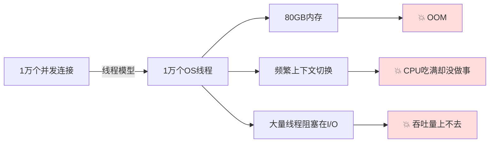
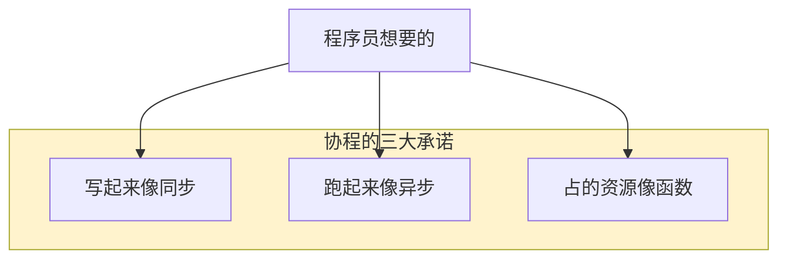
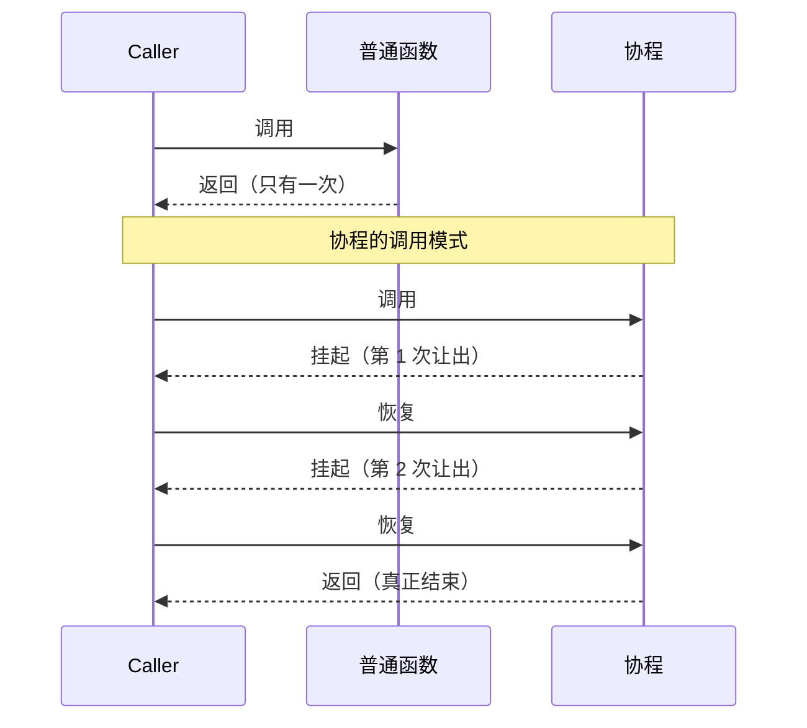
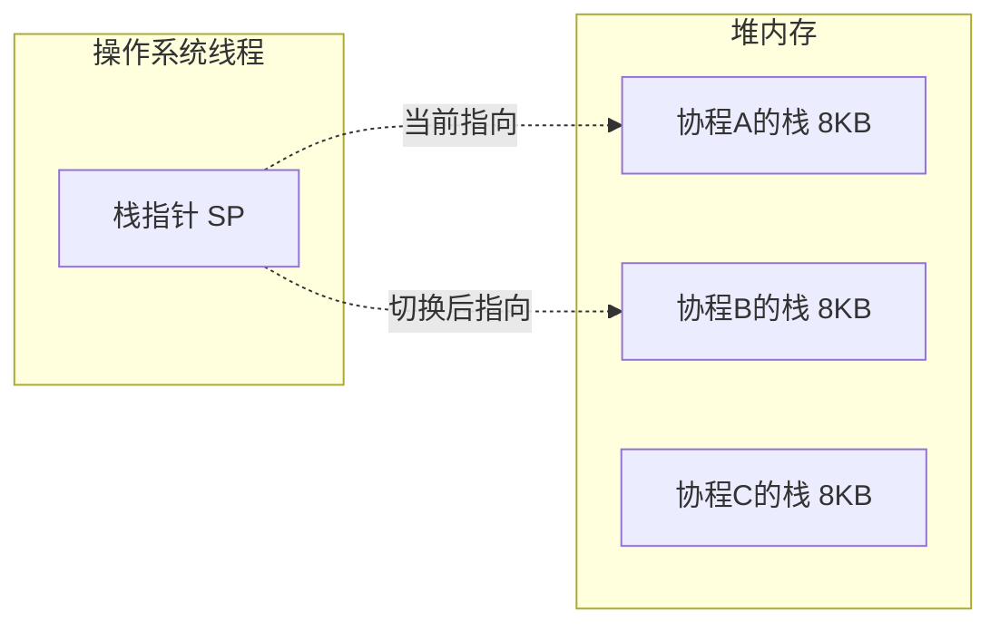
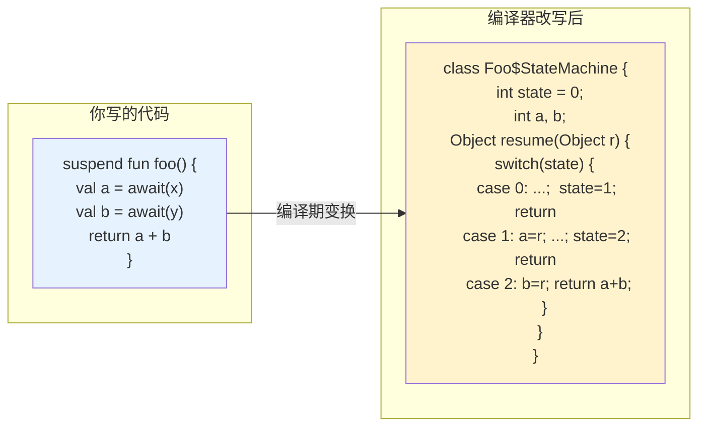
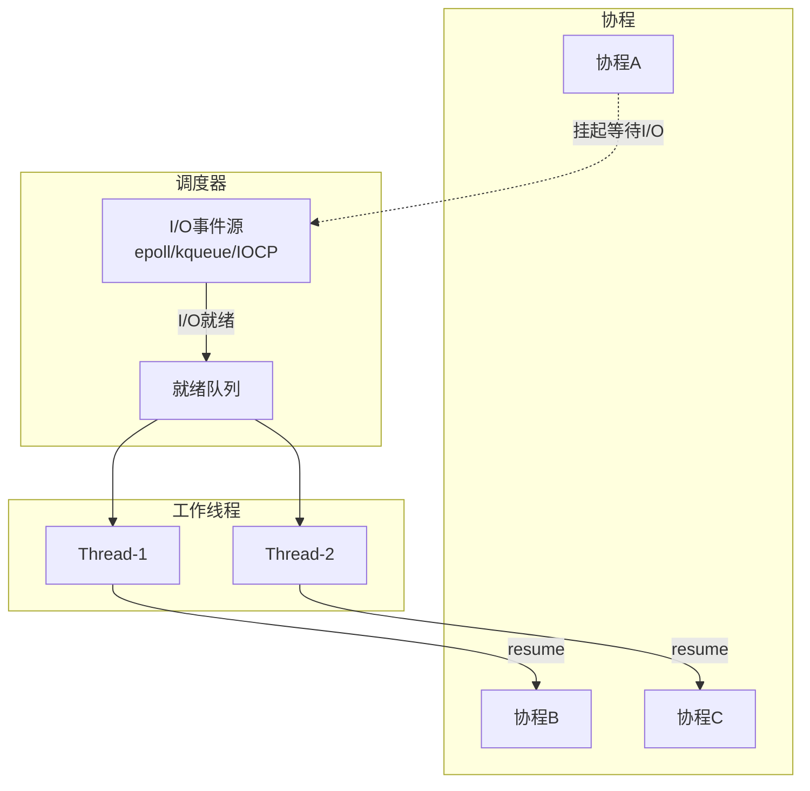
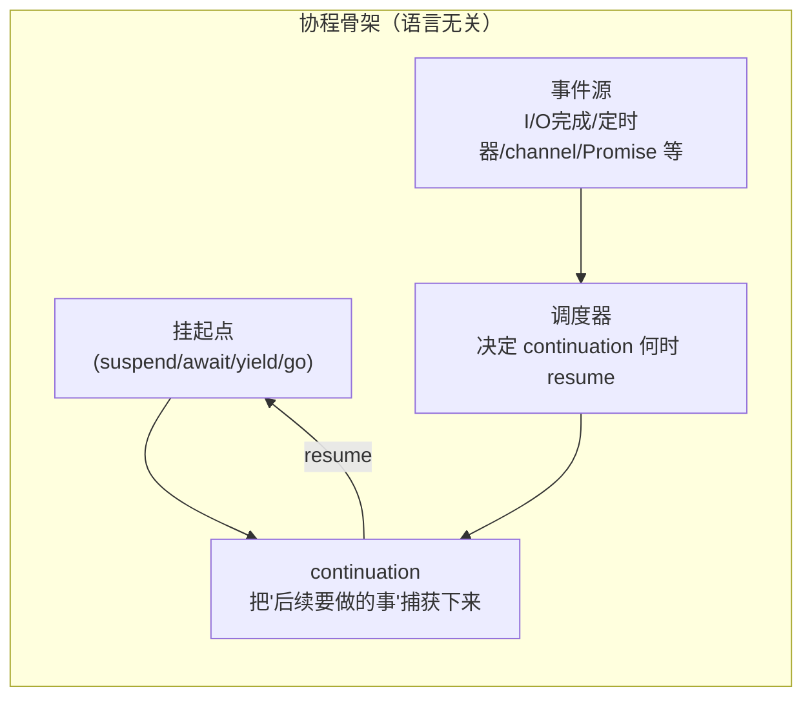

# 23.协程核心设计思想｜从函数到可挂起函数的进化

> 📍 **本篇位置**：第 3 卷 · 并发之道 · 第 13 篇（现代范式之一）
> 🎯 **核心矛盾**：**线程太重 vs 回调反人类** —— 用户空间调度 + 语法变形同时解决两个痛点
> 🧭 **设计灵魂**：协程 = **可挂起的函数**；两大流派（**有栈 Goroutine** / **无栈 async-await**）对应两种工程哲学
> 🌐 **跨语言覆盖**：Go(goroutine 有栈) · Kotlin(suspend 无栈) · Rust(async fn 无栈 + Future) · Python(asyncio) · JavaScript(generator → async/await) · C#(2012 鼻祖)
> 🔗 **延伸阅读**：← [21.异步和同步的设计](./21.异步和同步的设计.md) · → [24.Actor与CSP并发模型](./24.Actor与CSP并发模型.md) · → [25.线程池的设计思想](./25.线程池的设计思想.md)

> **一句话先说清**：协程的本质，是把"一个函数只能从头到尾执行完"这个铁律**打破**——让函数可以在中间主动"暂停"，把自己的执行状态存起来，之后再"恢复"继续跑下去。

#### 目录介绍
- [01.为何要有协程](#01为何要有协程)
  - [1.1 线程模型的三大天花板](#11-线程模型的三大天花板)
  - [1.2 异步回调的"反人类"本质](#12-异步回调的反人类本质)
  - [1.3 协程要解决的根本矛盾](#13-协程要解决的根本矛盾)
- [02.协程的本质](#02协程的本质)
  - [2.1 从"子程序"到"协程"的飞跃](#21-从子程序到协程的飞跃)
  - [2.2 挂起与恢复的机器视角](#22-挂起与恢复的机器视角)
  - [2.3 与线程的关键区别](#23-与线程的关键区别)
  - [2.4 与回调的关键区别](#24-与回调的关键区别)
- [03.两大流派：有栈 vs 无栈](#03两大流派有栈-vs-无栈)
  - [3.1 有栈协程设计原理](#31-有栈协程设计原理)
  - [3.2 无栈协程设计原理](#32-无栈协程设计原理)
  - [3.3 两派优劣对比](#33-两派优劣对比)
  - [3.4 为什么现代语言都转向了无栈](#34-为什么现代语言都转向了无栈)
- [04.协程的实现三件套](#04协程的实现三件套)
  - [4.1 挂起点：suspend point](#41-挂起点suspend-point)
  - [4.2 状态机：CPS 变换](#42-状态机cps-变换)
  - [4.3 调度器：谁来决定何时恢复](#43-调度器谁来决定何时恢复)
- [05.跨语言对比](#05跨语言对比)
  - [5.1 Kotlin 协程：状态机 + Continuation](#51-kotlin-协程状态机--continuation)
  - [5.2 Go goroutine：有栈协程 + GMP 调度](#52-go-goroutine有栈协程--gmp-调度)
  - [5.3 C++20 coroutines：编译器重写函数](#53-c20-coroutines编译器重写函数)
  - [5.4 JavaScript Generator / async-await](#54-javascript-generator--async-await)
  - [5.5 Python asyncio：事件循环驱动的协程](#55-python-asyncio事件循环驱动的协程)
  - [5.6 Swift async-await：结构化并发的入口](#56-swift-async-await结构化并发的入口)
  - [5.7 跨语言横评表](#57-跨语言横评表)
- [06.协程的经典陷阱](#06协程的经典陷阱)
  - [6.1 新手陷阱：async 函数里写阻塞调用](#61-新手陷阱async-函数里写阻塞调用)
  - [6.2 新手陷阱：忘记 await 协程"消失"了](#62-新手陷阱忘记-await-协程消失了)
  - [6.3 老手陷阱：协程泄漏](#63-老手陷阱协程泄漏)
  - [6.4 老手陷阱：上下文丢失（ThreadLocal 失效）](#64-老手陷阱上下文丢失threadlocal-失效)
  - [6.5 性能陷阱：细粒度切换反而更慢](#65-性能陷阱细粒度切换反而更慢)
- [07.共性抽象与未来演进](#07共性抽象与未来演进)
  - [7.1 去掉语法糖后共同的骨架](#71-去掉语法糖后共同的骨架)
  - [7.2 结构化并发：协程的"面向对象"时刻](#72-结构化并发协程的面向对象时刻)
  - [7.3 一句话总结](#73-一句话总结)
  - [7.4 延伸阅读](#74-延伸阅读)

---

## 01.为何要有协程

> 📌 **理解一项技术的第一步，永远是问：它不存在时，工程师在承受什么痛苦？**

### 1.1 线程模型的三大天花板

在协程出现前，应对并发的主力工具是**线程**。但线程有三个绕不开的硬伤：

| 瓶颈 | 具体数字 | 后果 |
|------|---------|------|
| **内存开销大** | 每个线程默认栈 1~8 MB（Linux 默认 8 MB） | 1 万线程 = 80 GB 栈，服务器直接爆 |
| **切换成本高** | 一次内核态线程切换 ≈ 3~10 μs（含寄存器保存 + TLB 刷新） | C10K/C100K 场景下 CPU 几乎全花在切换上 |
| **阻塞浪费严重** | 一个 I/O 阻塞，整个线程停在那儿干等 | 10000 个连接要 10000 个线程常驻 |



这就是著名的 **C10K 问题**（10000 并发连接）——线程模型在这个规模上被物理限制卡死。

### 1.2 异步回调的"反人类"本质

为了绕开线程瓶颈，业界转向了**异步 + 回调**。一个最经典的反面教材（JavaScript 早期）：

```javascript
// 回调地狱 —— 读文件 → 解析 → 写数据库 → 发通知
fs.readFile('a.txt', (err, data) => {
    if (err) return handleError(err);
    parse(data, (err, obj) => {
        if (err) return handleError(err);
        db.save(obj, (err, id) => {
            if (err) return handleError(err);
            notify(id, (err) => {
                if (err) return handleError(err);
                console.log('done!');  // 4 层缩进，每层都要处理错误
            });
        });
    });
});
```

异步回调在**性能上**解决了线程问题（一个事件循环就能处理上万连接），但在**心智上**带来了新灾难：

- 代码缩进逐层加深（Pyramid of Doom）
- 控制流被打散——`if/else/for/try-catch` 全失效
- 错误处理要每一层都写一次
- 调用栈断裂，调试器看到的栈根本不是业务调用路径

### 1.3 协程要解决的根本矛盾

所以在 2010 年代后，一个核心问题被反复提起：

> **能不能"写得像同步代码，跑得像异步代码"？**

协程就是对这个问题的答案。它同时要做到：

1. **语法上**：代码看起来是顺序执行的（`val x = await fetch()`），不写回调；
2. **运行上**：遇到 I/O 不阻塞线程，一个线程能撑上万任务；
3. **内存上**：单个协程只占 KB 级内存，而非线程的 MB 级。



---

## 02.协程的本质

### 2.1 从"子程序"到"协程"的飞跃

先看普通函数（子程序 subroutine）的生命周期：

```text
[调用 → 执行 → 返回] —— 一次性，不可逆，只有一个出口
```

而协程（coroutine）是这样的：

```text
[调用 → 执行 → 挂起 → 恢复 → 执行 → 挂起 → ... → 返回]
                  ↑ 可以多次
```

**关键差异**：协程是可以**从函数中间暂停**，把当前的所有局部变量、执行位置打包保存起来；之后任何时刻都可以"解包"恢复继续跑。



### 2.2 挂起与恢复的机器视角

那"挂起+恢复"在机器层面到底是什么？就是**保存/恢复一段执行现场**。现场包括：

| 组件 | 保存什么 |
|------|---------|
| **程序计数器 PC** | 下次从哪条指令开始跑 |
| **局部变量** | 栈帧里的所有变量值 |
| **操作数栈/寄存器** | 正在计算中的中间值 |
| **调用栈** | （仅有栈协程）嵌套调用的完整链 |

保存到哪？—— **堆**。所以协程的所有状态都不在线程栈上，线程随时可以切换去做别的事。

### 2.3 与线程的关键区别

| 维度 | 线程（Thread） | 协程（Coroutine） |
|------|---------------|-------------------|
| 调度者 | 操作系统内核 | 用户态代码（语言运行时/调度器） |
| 切换成本 | 3~10 μs（陷入内核） | 100~500 ns（一次函数调用级） |
| 栈内存 | 1~8 MB（固定分配） | 2~8 KB（按需增长）或无栈 |
| 切换时机 | 抢占式（时间片耗尽被强制切换） | **协作式**（代码主动 `suspend/await`） |
| 并行能力 | 真并行（多核） | 默认并发（需要调度到多线程才并行） |
| 同步需求 | 必须加锁 | **单线程模型里不用加锁** |

一句话：**线程是 OS 的并发单元，协程是语言的并发单元**。

### 2.4 与回调的关键区别

很多人以为协程=回调的语法糖，这是**半对半错**——对，因为底层仍然是事件驱动；错，因为心智模型天翻地覆：

```text
回调风格（控制权反转，callee 调 caller）：
  我把"后续要做的事"打包给你（闭包），你做完回调我

协程风格（控制权保持，caller 主导）：
  我在这暂停等你，你做完我接着跑
```

编译器/运行时在协程背后做了一件了不起的事：**把同步代码自动翻译成回调**。你写 `val x = await fetch()`，编译器帮你拆成"发起请求 + 注册一个'结果回来后继续跑后面这段代码'的回调"。下一节详细讲这个魔法。

---

## 03.两大流派：有栈 vs 无栈

协程的实现历史上分化出两大阵营，理解这个分野是理解所有主流协程实现的地图。

### 3.1 有栈协程设计原理

**核心思想**：每个协程分配一小块**独立的栈**（通常 2~8 KB，可动态增长），切换时直接**换栈指针（SP）+ 换寄存器**。



**代表实现**：Go goroutine、Lua coroutine、腾讯 libco、云风 coroutine。

**切换伪代码**（x86-64）：

```text
switch(from, to):
    save from.pc, from.sp, from.regs → from 的上下文结构
    load to.pc,   to.sp,   to.regs   ← to   的上下文结构
    jmp  to.pc                        // 回到 to 上次离开的地方
```

就这么几行汇编，就是"挂起+恢复"。

### 3.2 无栈协程设计原理

**核心思想**：不给协程分配独立栈。每个协程被编译器**改写成一个状态机对象**，保存在堆上；切换就是切换这个状态机对象，根本不涉及栈。



**代表实现**：C++20 coroutines、Rust async/await、Kotlin 协程、JS async/await、C# async/await、Python asyncio、Swift async/await——**几乎所有现代语言都选了这条路**。

### 3.3 两派优劣对比

| 维度 | 有栈协程 | 无栈协程 |
|------|---------|---------|
| **内存开销** | 每协程 2~8 KB（栈） | 每协程 ~100 字节（状态机对象） |
| **切换速度** | 需保存/恢复寄存器 | 一次函数调用 |
| **改造成本** | ✅ 任意函数直接切——**完全透明** | ❌ 必须标记 `async/suspend`，污染签名 |
| **栈溢出风险** | 小栈可能溢出，需要动态扩栈机制 | 无栈，不存在 |
| **与 C 库互操作** | ✅ 正常调 C 库 | ❌ 被阻塞调用坑死 |
| **编译器复杂度** | ✅ 运行时搞定 | ❌ 编译器要做 CPS 变换 |
| **调试体验** | 栈完整可看 | 栈被切碎，体验差 |

### 3.4 为什么现代语言都转向了无栈

Go 是典型的有栈派，但 Go 之后诞生的语言（Kotlin、Rust、Swift、C++20）**无一例外选了无栈**。原因：

1. **内存**：10 万协程，有栈要 800 MB，无栈只要 10 MB；
2. **移动端与嵌入式**友好（iOS/Android/IoT 场景内存紧张）；
3. **编译期静态优化**更彻底（可以内联、可以去虚化）；
4. **与 WebAssembly 兼容**——Wasm 没有完整 OS 栈概念，有栈协程难实现。

代价是：**`async` 传染性**（async 函数只能被 async 函数调用），俗称 "function coloring problem"。这是无栈协程的"原罪"。

---

## 04.协程的实现三件套

抛开语言差异，所有协程实现都要提供**三件套**。

### 4.1 挂起点：suspend point

协程不能在任意地方暂停，只能在**被语言标记为"挂起点"**的地方暂停。

| 语言 | 挂起点标记 |
|------|-----------|
| Kotlin | `suspend fun` + 调用另一个 suspend 函数 |
| C++20 | `co_await` / `co_yield` / `co_return` |
| JavaScript/TypeScript | `await`（只能在 `async function` 内） |
| Python | `await`（只能在 `async def` 内） |
| Rust | `.await`（只能在 `async fn` / `async {}` 块内） |
| Swift | `await`（只能在 `async` 函数内） |
| Go | **任意函数**的任意 I/O 调用（有栈派的特权） |

> 🧠 注意到 Go 是唯一"无标记"的——因为它是有栈协程，任意函数都能暂停，不需要编译器特殊处理。

### 4.2 状态机：CPS 变换

这是无栈协程的核心黑魔法——**CPS (Continuation-Passing Style) 变换**。看一个 Kotlin 的例子：

```kotlin
// 你写的代码
suspend fun loadUser(id: Int): User {
    val profile = fetchProfile(id)     // 挂起点1
    val avatar  = fetchAvatar(profile) // 挂起点2
    return User(profile, avatar)
}
```

编译器在背后生成（简化版）：

```java
class LoadUser$StateMachine implements Continuation {
    int    label;     // 当前跑到哪个挂起点了
    Object profile;   // 局部变量被提升到字段
    Object avatar;

    public Object resumeWith(Object result) {
        switch (label) {
            case 0:
                label = 1;
                Object r1 = fetchProfile(id, this);  // 把自己作为 continuation 传下去
                if (r1 == COROUTINE_SUSPENDED) return r1;  // 真挂起了
                result = r1;
                // fallthrough
            case 1:
                profile = result;
                label = 2;
                Object r2 = fetchAvatar(profile, this);
                if (r2 == COROUTINE_SUSPENDED) return r2;
                result = r2;
                // fallthrough
            case 2:
                avatar = result;
                return new User(profile, avatar);
        }
    }
}
```

**所有局部变量被提升为字段、所有挂起点被切分为 case 分支**。每次恢复，从对应的 case 接着跑。这就是无栈协程的本质——**编译器把你的线性代码重写成一台状态机**。

### 4.3 调度器：谁来决定何时恢复

状态机只负责"怎么跑"，**"什么时候跑"由调度器决定**。调度器的主要职责：

- 维护一个或多个**待恢复协程队列**；
- 监听外部事件（I/O 完成、定时器、channel 就绪）；
- 事件到了，把对应协程丢进队列；
- 在工作线程上 `poll` 队列、`resume()` 协程。

不同语言的调度器哲学：

| 语言 | 调度器 | 特点 |
|------|-------|------|
| Go | **GMP**（G 协程、M 线程、P 逻辑处理器） | 运行时内置，工作窃取，抢占式 |
| Kotlin | `CoroutineDispatcher`（Default/IO/Main） | 可插拔，绑定线程池 |
| JS | 单一事件循环 | 浏览器/Node 提供 |
| Rust | **没有！** 由 tokio/async-std 第三方提供 | 解耦运行时 |
| Python | `asyncio` 事件循环 | 单线程为主 |
| Swift | 协作线程池（Cooperative Pool） | 系统级，面向 M:N |



---

## 05.跨语言对比

> 这一节是本篇的**核心差异化**——同一个协程概念，每个语言刻下了自己时代的烙印。

### 5.1 Kotlin 协程：状态机 + Continuation

```kotlin
// 标志：suspend 关键字
suspend fun fetchUser(id: Int): User {
    val profile = fetchProfile(id)   // 挂起
    val friends = fetchFriends(id)   // 挂起
    return User(profile, friends)
}

// 启动
GlobalScope.launch(Dispatchers.IO) {
    val user = fetchUser(1)
    println(user)
}
```

**特点**：
- 无栈 + 编译器 CPS 变换
- `Continuation<T>` 接口是第一等公民，可以当普通对象传递
- 提供**结构化并发**（`coroutineScope / supervisorScope`）——子协程的生命周期受父作用域约束，避免泄漏

### 5.2 Go goroutine：有栈协程 + GMP 调度

```go
// 标志：go 关键字
func fetchUser(id int) User {
    profile := fetchProfile(id)   // 普通同步调用！
    friends := fetchFriends(id)   // I/O 阻塞自动让出
    return User{profile, friends}
}

// 启动
go fetchUser(1)  // 一个 goroutine
```

**特点**：
- 有栈协程，初始栈 2 KB，可动态增长
- **无 async 传染**——任何函数都能被 `go` 起一个协程
- 运行时在所有阻塞系统调用（`read`/`write`/`select`...）里插桩，**偷偷**帮你挂起恢复
- GMP 调度器实现工作窃取 + 1.14 起支持真正的**抢占式调度**（基于信号）

### 5.3 C++20 coroutines：编译器重写函数

```cpp
#include <coroutine>

Task<User> fetchUser(int id) {
    auto profile = co_await fetchProfile(id);
    auto friends = co_await fetchFriends(id);
    co_return User{profile, friends};
}
```

**特点**：
- 无栈
- 极度**泛化**：语言只定义协议（`promise_type` / `awaitable`），**不自带调度器/Task 类型**——都由库实现
- 学习曲线陡峭，但扩展性冠绝群雄
- 主要由 `folly::coro` / `cppcoro` / 各家自研库支撑

### 5.4 JavaScript Generator / async-await

JavaScript 的协程演进恰好就是一部**协程史诗的缩影**：

```javascript
// Step 1: Callback (2010 年前)
fetchProfile(id, (err, profile) => {
    fetchFriends(id, (err, friends) => { ... });
});

// Step 2: Promise (2015/ES6)
fetchProfile(id)
    .then(profile => fetchFriends(id).then(friends => ...));

// Step 3: Generator + co (2015 过渡方案)
function* fetchUser(id) {
    const profile = yield fetchProfile(id);
    const friends = yield fetchFriends(id);
    return { profile, friends };
}

// Step 4: async/await (2017/ES8) ← 现代写法
async function fetchUser(id) {
    const profile = await fetchProfile(id);
    const friends = await fetchFriends(id);
    return { profile, friends };
}
```

**特点**：
- 单线程事件循环，**天然避免竞态**（同一个任务中间不会被切）
- `async` 函数本质是"返回 Promise 的 generator"
- 所有挂起都绑定到 Promise 解析——简单但也受限

### 5.5 Python asyncio：事件循环驱动的协程

```python
import asyncio

async def fetch_user(id):
    profile = await fetch_profile(id)
    friends = await fetch_friends(id)
    return User(profile, friends)

asyncio.run(fetch_user(1))
```

**特点**：
- 无栈
- 由 PEP 492 定义 `async def`，内部仍是 generator 机制
- **GIL 存在**——即便是 asyncio，CPU 密集还是靠多进程
- asyncio 生态碎片化（asyncio vs trio vs curio），是个小教训

### 5.6 Swift async-await：结构化并发的入口

```swift
func fetchUser(id: Int) async throws -> User {
    let profile = try await fetchProfile(id)
    let friends = try await fetchFriends(id)
    return User(profile: profile, friends: friends)
}

// 结构化并发
async let p = fetchProfile(id)  // 并发
async let f = fetchFriends(id)  // 并发
let user = User(profile: try await p, friends: try await f)
```

**特点**：
- 无栈
- 2021 年新加入，**设计上深度融合结构化并发**（Actor/Task/TaskGroup）
- 吸取了前辈教训——默认 Actor 隔离、默认结构化、并发安全在编译期检查

### 5.7 跨语言横评表

| 语言 | 栈类型 | 关键字 | 调度器 | 结构化并发 | 诞生年份 |
|------|-------|-------|--------|------------|----------|
| Go | **有栈** | `go` | 运行时 GMP | ❌（需 errgroup） | 2012 |
| Kotlin | 无栈 | `suspend` | 可插拔 | ✅ | 2018 |
| C++20 | 无栈 | `co_await` | 无（库提供） | ❌（库） | 2020 |
| Rust | 无栈 | `async/.await` | 无（tokio） | ❌（需 scoped） | 2019 |
| JavaScript | 无栈 | `async/await` | 事件循环 | ❌ | 2017 |
| Python | 无栈 | `async/await` | `asyncio` | 部分 (TaskGroup 3.11+) | 2015 |
| Swift | 无栈 | `async/await` | 系统池 | ✅ | 2021 |
| C# | 无栈 | `async/await` | 任务调度器 | ❌ | 2012 |

**一个有意思的规律**：**语言诞生越晚，越倾向于"无栈 + 结构化并发 + 编译期安全"**。协程的发展史就是工程经验不断被语言吸纳的历史。

---

## 06.协程的经典陷阱

### 6.1 新手陷阱：async 函数里写阻塞调用

```kotlin
// ❌ 在协程里调 Thread.sleep() —— 它不会让出协程，会把底层线程也卡住
suspend fun badDelay() {
    Thread.sleep(1000)  // 灾难：整个 Dispatcher 线程被占 1 秒
}

// ✅ 正确写法
suspend fun goodDelay() {
    delay(1000)  // Kotlin 协程版本：挂起协程，释放线程
}
```

**根本原因**：协程"让出"需要调用**协程感知的挂起函数**。普通阻塞 API（`Thread.sleep` / `InputStream.read` / JDBC 同步 API）完全不知道协程存在，会直接卡住底层线程。

> 💡 Go 是唯一的例外——它的运行时在标准库所有阻塞调用里都做了插桩，所以你写 `time.Sleep` 不会卡住其他 goroutine。这是有栈派的又一个"特权"。

### 6.2 新手陷阱：忘记 await 协程"消失"了

```javascript
async function save() { await db.write(); }

async function handler() {
    save();          // ❌ 忘了 await，save 在后台"飘"着
    res.send('ok');  // 这里可能比 save 先完成
}
```

结果：HTTP 响应已发，数据库写可能还没落盘。**没有 await 的 async 调用等于 fire-and-forget**。

各语言对策：

- TypeScript: `@typescript-eslint/no-floating-promises` 规则
- Rust: `#[must_use]` 标记让编译器警告
- Swift: 未 await 的 async 直接**编译错误**

### 6.3 老手陷阱：协程泄漏

```kotlin
// ❌ GlobalScope 里启动的协程，没人管它的生命周期
GlobalScope.launch {
    while (true) {
        delay(1000)
        reportMetrics()
    }
}
// Activity 销毁了，这个协程还在跑 —— 内存泄漏
```

修复：**用结构化作用域**——把协程绑定到一个有生命周期的 Scope 上：

```kotlin
// ✅ 绑定到 Activity 的 lifecycleScope，Activity 销毁自动取消
lifecycleScope.launch {
    while (isActive) {
        delay(1000)
        reportMetrics()
    }
}
```

这是 Kotlin "结构化并发" 最直接的收益——**协程像局部变量一样，有明确的生命周期边界**。

### 6.4 老手陷阱：上下文丢失（ThreadLocal 失效）

协程可能在挂起后**在另一个线程**恢复。如果业务依赖 `ThreadLocal`（比如 MDC 日志追踪、Spring 事务上下文），就会丢：

```text
T1:  → 协程开始 → 写入 MDC.put("traceId", "x")
T1:  → 遇到 await，协程挂起
T2:  → 协程被调度到 T2 恢复 → MDC.get("traceId") = null ❌
```

各语言的解法：

| 语言 | 方案 |
|------|------|
| Kotlin | `CoroutineContext` + `ThreadContextElement`（把 ThreadLocal 包进协程上下文） |
| JS Node | `AsyncLocalStorage`（绑定到异步执行链） |
| .NET C# | `AsyncLocal<T>`（跟随异步流） |
| Go | `context.Context`（显式传递，杜绝隐式依赖） |

Go 的哲学是最硬核的：**根本不支持 goroutine-local**——所有跨调用的状态必须显式 `context.Context` 传递。这避免了所有隐式上下文的坑。

### 6.5 性能陷阱：细粒度切换反而更慢

协程切换虽然比线程便宜 10~100 倍，但**不是免费的**。常见反模式：

```kotlin
// ❌ 给每个元素都起一个协程
list.forEach { item ->
    launch { process(item) }  // 100 万个协程 = 100 万次调度开销
}

// ✅ 批处理 + 有限并发
list.chunked(100).forEach { batch ->
    launch { batch.forEach { process(it) } }
}
```

**记住**：协程适合 **I/O 密集 + 长时间等待**的场景；CPU 密集型不要盲目协程化，性能会倒退。

---

## 07.共性抽象与未来演进

### 7.1 去掉语法糖后共同的骨架

把所有语言的语法砍掉，你会看到同一个骨架：



**这个骨架 = 协程的设计灵魂**。具体语法差异只是"壳"：
- Kotlin 的 `suspend` 是壳，Go 的 `go` 是壳，JS 的 `async` 是壳；
- 真正核心是**"一个可以被捕获的执行续延"**（Continuation / Future / Promise / Task，名字不同，本质一致）。

### 7.2 结构化并发：协程的"面向对象"时刻

如果说 1960s 面向对象给我们带来了"把数据和方法封装到一个边界里"，那么 2020s **结构化并发**给协程带来了"把并发任务封装到一个作用域里"：

```text
      1950s GOTO → 1960s 结构化编程（if/for/函数）
      1990s 指针  → 2000s 面向对象（封装/边界）
      2000s 回调  → 2020s 结构化并发（作用域/边界）
                                 ^^^^^^^^^^^^^^^^^^
                                 我们正在经历的变革
```

**核心原则**：子协程的生命周期必须包含于父作用域之内——父作用域结束前，所有子协程要么完成，要么被取消。这让并发代码具备了局部变量级别的**可推理性**。

代表实现：
- **Kotlin**：`coroutineScope { ... }` / `supervisorScope { ... }`
- **Swift**：`async let` / `TaskGroup`
- **Java 21+**：`StructuredTaskScope`（JEP 453）
- **Python 3.11+**：`TaskGroup`

这是协程发展至今最重要的"范式级"进步。

### 7.3 一句话总结

> **协程是把"被挂起的执行状态"变成一等公民——之后所有创新，都是围绕"如何安全地让这个一等公民流动"。**

三大承诺再回顾：

| 承诺 | 兑现机制 |
|------|---------|
| 写起来像同步 | 编译器 CPS 变换 / 有栈协程栈切换 |
| 跑起来像异步 | 调度器 + 事件源（epoll/kqueue/IOCP） |
| 占的资源像函数 | 状态机对象 100B / 有栈协程 2-8KB |

### 7.4 延伸阅读

本专栏内紧密相关的篇章：

- [19.并发上下文切换原理](./19.并发上下文切换原理.md) —— 线程切换的代价，是理解协程省钱的前提
- [21.异步和同步的设计](./21.异步和同步的设计.md) —— 从回调到 async/await 的演进
- [22.单线程模型的思想](./22.单线程模型的思想.md) —— 协程为什么天然无锁
- [25.线程池的设计思想](./25.线程池的设计思想.md) —— 协程最终跑在哪——线程池
- [12.线程通信设计思想](./12.线程通信设计思想.md) —— channel 作为协程间通信的灵魂

进一步阅读推荐：

- [Structured Concurrency - Nathaniel Smith](https://vorpus.org/blog/notes-on-structured-concurrency-or-go-statement-considered-harmful/)（结构化并发的开山论文）
- [Go Scheduler: Ms, Ps, Gs - Kavya](https://github.com/golang/go/blob/master/src/runtime/proc.go)（Go GMP 源码）
- [Coroutines: A Programming Methodology - Knuth, 1968](https://dl.acm.org/doi/10.1145/363347.363366)（协程概念的原始起源）
- JEP 453: Structured Concurrency（Java 结构化并发提案）

---

> 📌 **下一篇预告**：`24.Actor与CSP并发模型` —— 既然协程这么好，为什么 Erlang 和 Go 还要各走一条"共享状态 vs 消息传递"的路？
