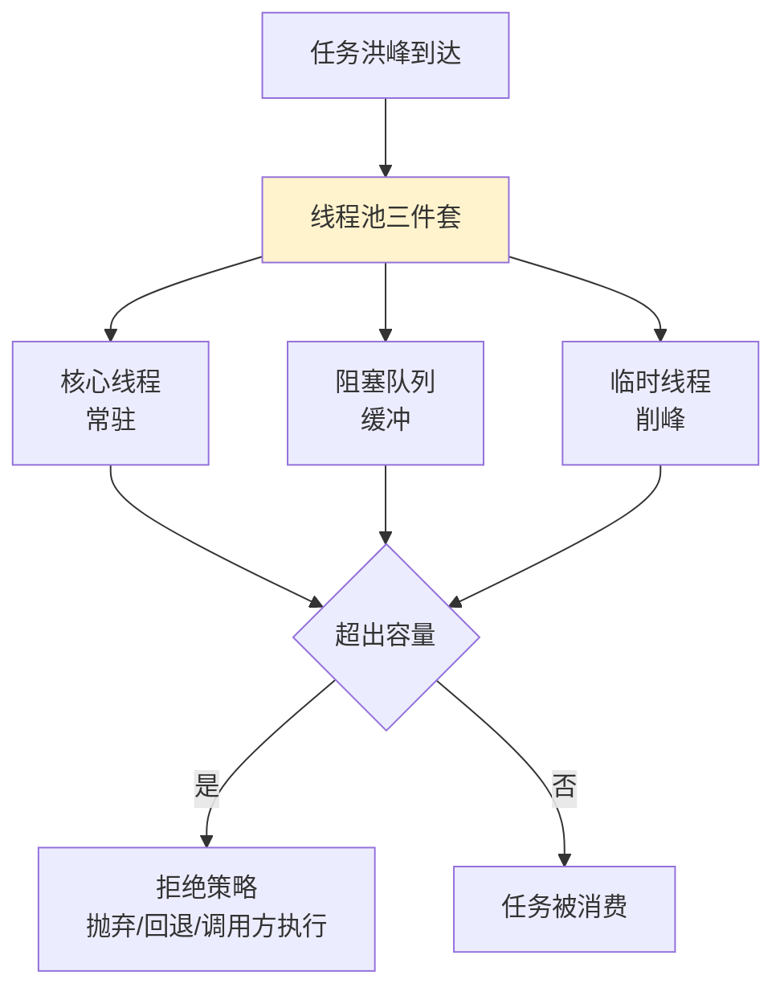
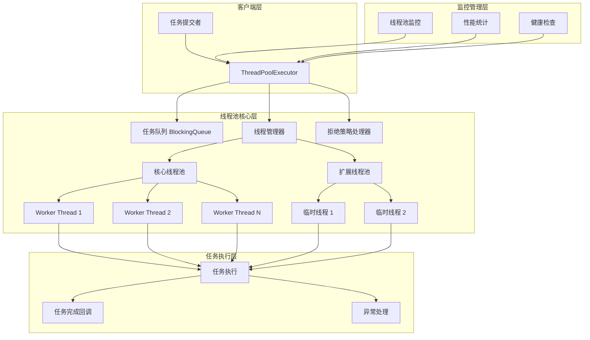
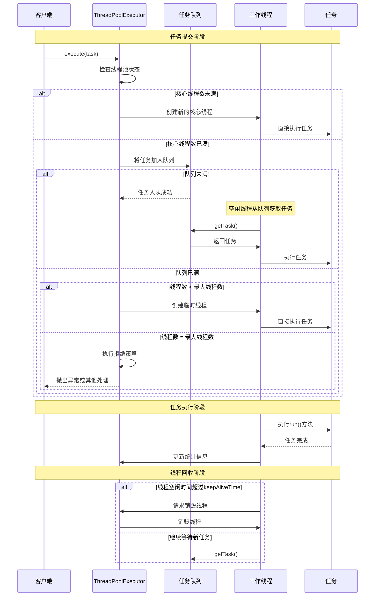
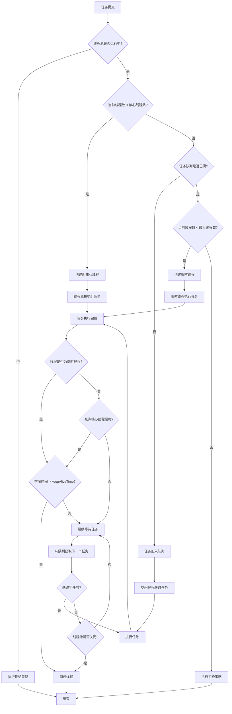
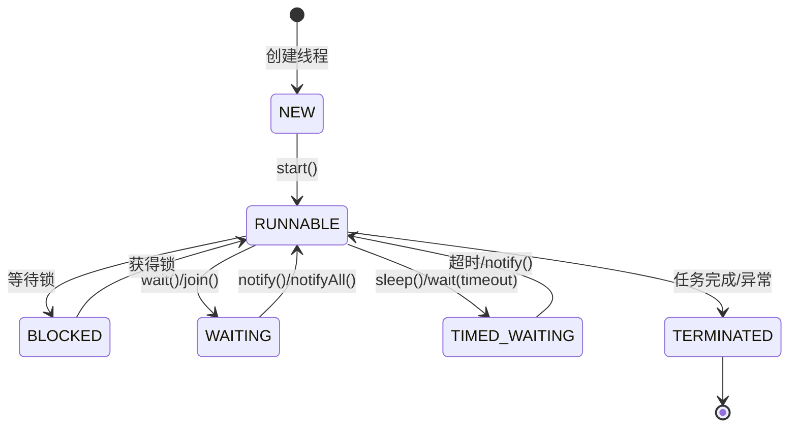
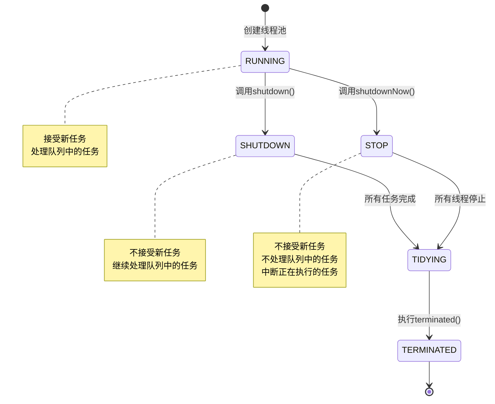
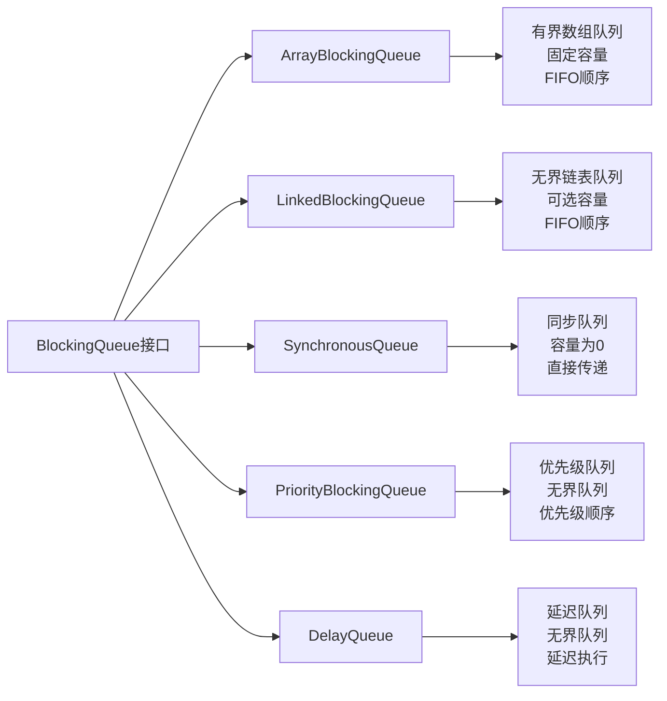

# 25.线程池的设计思想

> 📍 **本篇位置**：第 3 卷 · 并发之道 · 第 15 篇（落地三部曲之一）
> 🎯 **核心矛盾**：**线程的创建开销 vs 任务的短平快** —— 用"池"解决"一次性"的浪费
> 🧭 **设计灵魂**：线程池 = **对象池 + 任务队列 + 调度策略**；它是"**生产者-消费者**"模式在并发工程里最重要的一次具象化
> 🌐 **跨语言覆盖**：Java(ThreadPoolExecutor 七参数) · C++(手写 + std::thread + queue) · Python(concurrent.futures) · Go(goroutine 自带无需显式池) · C#(ThreadPool + Task)
> 🔗 **延伸阅读**：← [19.并发上下文切换原理](./19.并发上下文切换原理.md) · → [26.线程池使用技巧](./26.线程池使用技巧.md) · → [27.线程池设计核心原理](./27.线程池设计核心原理.md)



---

#### 目录介绍
- [01.池化思想探索](#01池化思想探索)
  - [1.1 什么是池化思想](#11-什么是池化思想)
  - [1.2 池化的优势](#12-池化的优势)
  - [1.3 池化具体体现](#13-池化具体体现)
  - [1.4 一般池的场景](#14-一般池的场景)
  - [1.5 线程池核心设计](#15-线程池核心设计)
- [02.线程池设计框架](#02线程池设计框架)
  - [2.1 核心原理和架构](#21-核心原理和架构)
  - [2.2 线程复用思想](#22-线程复用思想)
  - [2.3 要有任务队列](#23-要有任务队列)
  - [2.4 合理资源管理](#24-合理资源管理)
  - [2.5 任务调度思想](#25-任务调度思想)
  - [2.6 线程池状态图](#26-线程池状态图)
- [03.线程池工作流程](#03线程池工作流程)
  - [3.1 提交线程任务](#31-提交线程任务)
  - [3.2 判断核心线程数](#32-判断核心线程数)
  - [3.3 判断任务队列](#33-判断任务队列)
  - [3.4 判断最大线程数](#34-判断最大线程数)
  - [3.5 开始执行任务](#35-开始执行任务)
  - [3.6 线程回收处理](#36-线程回收处理)
  - [3.7 执行流程图](#37-执行流程图)
- [04.线程复用设计](#04线程复用设计)
  - [4.1 线程复用原理](#41-线程复用原理)
  - [4.2 线程生命周期管理](#42-线程生命周期管理)
  - [4.3 线程复用实现示例](#43-线程复用实现示例)
  - [4.4 核心线程设计](#44-核心线程设计)
- [05.线程池管理设计](#05线程池管理设计)
  - [5.1 线程池状态管理](#51-线程池状态管理)
  - [5.2 线程池参数配置](#52-线程池参数配置)
  - [5.3 线程池管理策略](#53-线程池管理策略)
- [06.任务队列设计](#06任务队列设计)
  - [6.1 队列类型对比](#61-队列类型对比)
  - [6.2 队列类型](#62-队列类型)
  - [6.3 队列选择策略](#63-队列选择策略)
- [07.任务调度与设计](#07任务调度与设计)
  - [7.1 任务提交过程](#71-任务提交过程)
  - [7.2 任务调度策略](#72-任务调度策略)
  - [7.3 拒绝策略](#73-拒绝策略)
- [08.添加线程任务](#08添加线程任务)
  - [8.1 任务提交接口](#81-任务提交接口)
  - [8.2 任务封装](#82-任务封装)
  - [8.3 任务提交示例](#83-任务提交示例)
- [09.线程回收机制](#09线程回收机制)
  - [9.1 线程回收时机](#91-线程回收时机)
  - [9.2 线程回收实现](#92-线程回收实现)
  - [9.3 线程回收示例](#93-线程回收示例)


## 01.池化思想探索

### 1.1 什么是池化思想

池化思想是一种常见的资源管理技术，其核心是预先创建并维护一组可重用的资源，以便在需要时快速分配，使用完毕后并不立即销毁，而是放回池中等待下一次使用。

这种思想广泛应用于各种资源管理，如数据库连接池、内存池、线程池等。

### 1.2 池化的优势

降低资源创建销毁的开销：频繁创建和销毁线程（或其它资源）会导致系统性能下降，池化通过复用线程降低开销。

提高响应速度：任务到达时，池中已有线程可立即执行，无需等待线程创建。

可控制资源使用：通过限制池中资源数量，防止资源过度使用导致系统崩溃。

统一管理：便于对资源进行监控、调优和统计。

### 1.3 池化具体体现

线程池通过维护一定数量的线程，避免为每个任务都创建新线程，从而减少系统开销。

### 1.4 一般池的场景

对这种频繁需要创建和销毁的对象保存在一个对象池中。每次用到该对象时，就取对象池空闲的对象，并对它进行初始化操作，从而提高框架的性能。这种对象池的设计核心代码如下所示

```java
//采用一般意义上池化资源的设计方法
public class SimplePool<T> implements Pool<T> {
    // 获取空闲线程
    T acquire() {
    }
    // 释放线程
    void release(T t){
    }
}
class Test{
    public void test() {
        //期望的使用
        SimplePool<Thread> pool = new SimplePool<>();
        //使用
        Thread t1 = pool.acquire();
        //传入Runnable对象
        t1.execute(()->{
          //具体业务逻辑
        });
        //释放
        pool.release(t1);
    }
}
```

为什么线程池没有采用一般意义上池化资源的设计方法呢？

如果线程池采用一般意义上池化资源的设计方法，你可以来思考一下，假设我们获取到一个空闲线程 T1，然后该如何使用 T1 呢？

你期望的可能是这样：通过调用 T1 的 execute() 方法，传入一个 Runnable 对象来执行具体业务逻辑，就像通过构造函数 Thread(Runnable target) 创建线程一样。

可惜的是，你翻遍 Thread 对象的所有方法，都不存在类似 execute(Runnable target) 这样的公共方法。

### 1.5 线程池核心设计

那线程池该如何设计呢？目前业界线程池的设计，普遍采用的都是生产者 - 消费者模式。线程池的使用方是生产者，线程池本身是消费者。

在线程池中，线程池本身可以被视为生产者，它负责创建和管理线程资源。任务（或工作单元）可以被视为生产者生产的产品，线程池中的线程则是消费者，负责消费这些任务并执行相应的操作。

线程池通过任务队列来接收和存储任务，线程从队列中获取任务并执行，这种过程类似于消费者从队列中获取产品并进行消费。

虽然线程池本身不是严格的消费者和生产者模式，但线程池的工作机制和任务调度方式与消费者和生产者模式有一定的相似之处。线程池通过管理线程资源和任务队列，实现了任务的生产和消费过程，提高了系统的效率和性能。

## 02.线程池设计框架

线程池的抽象架构模型，这种分层架构实现了关注点分离，每层负责特定的职责，通过标准接口协作。 一个完整的线程池包含以下核心抽象层：

```text
┌─────────────────────────────────────────────────────────────┐
│                   应用层接口 (Application Layer)              │
├─────────────────────────────────────────────────────────────┤
│  submit() ─────── execute() ─────── invoke() ─────── schedule() │
└─────────────────────────────────────────────────────────────┘
│
┌─────────────────────────────────────────────────────────────┐
│                 任务调度层 (Scheduling Layer)                 │
├─────────────────────────────────────────────────────────────┤
│  任务队列 ─────── 拒绝策略 ─────── 饱和策略 ─────── 优先级调度      │
└─────────────────────────────────────────────────────────────┘
│
┌─────────────────────────────────────────────────────────────┐
│                 线程管理层 (Thread Management Layer)           │
├─────────────────────────────────────────────────────────────┤
│  线程创建 ─────── 线程回收 ─────── 空闲管理 ─────── 异常处理        │
└─────────────────────────────────────────────────────────────┘
│
┌─────────────────────────────────────────────────────────────┐
│                 资源监控层 (Monitoring Layer)                 │
├─────────────────────────────────────────────────────────────┤
│  指标收集 ─────── 状态追踪 ─────── 性能分析 ─────── 动态调优        │
└─────────────────────────────────────────────────────────────┘
```

### 2.1 核心原理和架构

线程池是一种管理和复用线程的机制，旨在提高多线程程序的性能和资源利用率。其核心原理是通过预先创建一定数量的线程，并将任务分配到这些线程中执行，从而避免频繁创建和销毁线程的开销。




### 2.2 线程复用思想

问题：频繁创建和销毁线程会消耗大量系统资源，降低程序性能。

解决方案：线程池预先创建一组线程，任务到来时直接复用这些线程，避免重复创建和销毁。

线程复用的实现：

1. 预先创建线程：在初始化时创建一组线程，并使其处于等待状态。
2. 任务分配：当任务到来时，将任务分配给空闲线程执行。
3. 线程回收：线程执行完任务后，不销毁，而是重新进入空闲状态，等待下一个任务。

### 2.3 要有任务队列

问题：当任务数量超过线程池的处理能力时，需要一种机制来缓冲任务。

解决方案：线程池使用任务队列（如阻塞队列）来存储待执行的任务，确保任务不会丢失。

### 2.4 合理资源管理

问题：线程数量过多会消耗大量系统资源，甚至导致系统崩溃。

解决方案：线程池通过限制线程数量（核心线程数、最大线程数）和任务队列大小，合理管理系统资源。

### 2.5 任务调度思想

问题：如何高效地将任务分配给线程执行。

解决方案：线程池根据任务队列的状态和线程的可用性，动态调度任务。

## 03.线程池工作流程

线程池的工作流程一般是这样的：

1. 初始化线程池：创建一组线程。
2. 提交任务：当调用 execute() 或 submit() 方法提交任务时，线程池会检查当前线程数是否小于核心线程数。
3. 任务入队：如果线程数已达到核心线程数，则将任务放入任务队列中等待执行。
4. 拒绝任务：如果任务队列已满且线程数已达到最大线程数，则根据拒绝策略处理新提交的任务。
5. 任务执行完：线程执行完任务后，返回空闲状态，等待下一个任务。
6. 线程回收：当线程池关闭时，销毁所有线程。

任务提交与执行时序图




### 3.1 提交线程任务

提交任务：调用 execute() 或 submit() 方法提交任务。

### 3.2 判断核心线程数

判断核心线程数：
如果当前线程数小于核心线程数，创建新线程执行任务。
否则，将任务加入任务队列。

### 3.3 判断任务队列

判断任务队列：
如果任务队列未满，将任务加入队列。
否则，判断当前线程数是否小于最大线程数。

### 3.4 判断最大线程数

判断最大线程数：
如果当前线程数小于最大线程数，创建新线程执行任务。
否则，执行拒绝策略。

### 3.5 开始执行任务

任务执行：线程从任务队列中获取任务并执行。

### 3.6 线程回收处理

线程回收：非核心线程在空闲时间超过 keepAliveTime 后被回收。

### 3.7 执行流程图



## 04.线程复用设计

### 4.1 线程复用原理

线程复用的核心是让线程在执行完一个任务后不退出，而是继续执行下一个任务。这通过一个循环结构实现，线程不断从任务队列中获取任务并执行。

线程复用的核心是将线程创建成本分摊到多个任务执行周期。其理论基础是线程上下文切换成本远低于进程创建成本。

### 4.2 线程生命周期管理

创建：线程池初始化时创建一定数量的线程（核心线程），这些线程处于等待任务状态。
运行：线程从任务队列中获取任务并执行。
等待：当任务队列为空时，线程进入等待状态（通过条件变量或锁机制）。
销毁：当线程池决定减少线程数量时，某些线程会被终止。线程池可以设置线程的空闲时间，超过该时间没有任务执行则销毁线程（非核心线程）。



一个可复用的线程包含完整的状态转换：

```text
创建(CREATED) → 就绪(READY) ↔ 运行(RUNNING) ↔ 等待(WAITING) 
               ↘ 终止(TERMINATED)
```

复用线程的关键是避免进入终止状态，在任务完成后回到就绪状态等待新任务。

### 4.3 线程复用实现示例

以下是一个简单的线程复用示例（C++伪代码）：

```cpp
class WorkerThread {
private:
    ThreadPool* pool;
    bool running;
public:
    void run() {
        while (running) {
            Task task = pool->getTask(); // 从任务队列获取任务，如果队列为空则阻塞
            if (task) {
                task.execute();
            }
        }
    }
    void stop() { running = false; }
};
```

### 4.4 核心线程设计

**疑惑**：核心线程和非核心线程在代码层面有什么区别？是不是有两种不同的Thread对象？

**答疑**：核心线程和非核心线程在代码层面**没有任何区别**！它们是同一种Worker对象。"核心"与"非核心"仅仅是一个**计数上的概念**——当线程池决定回收空闲线程时，会判断当前线程数是否超过corePoolSize，超过的部分在空闲keepAliveTime后被回收。

```java
// getTask()中的关键逻辑（简化版）
private Runnable getTask() {
    for (;;) {
        int wc = workerCountOf(ctl.get());
        
        // 关键判断：当前线程数 > 核心线程数？
        boolean timed = wc > corePoolSize;
        
        // timed=true: 用poll(keepAliveTime)，超时返回null → 线程退出
        // timed=false: 用take()，永远等待 → 核心线程不退出
        Runnable r = timed ? 
            workQueue.poll(keepAliveTime, TimeUnit.NANOSECONDS) :
            workQueue.take();
        
        if (r != null) return r;
        // r==null说明超时了 → 这个线程被当作"非核心线程"回收
        return null;
    }
}
```

**本质**：哪个线程是"核心"哪个是"非核心"，取决于被回收那一刻的线程总数，而不是线程创建时的身份。这是一个非常优雅的设计——不需要给线程打标签，只需要在回收时做数量判断。

核心线程也可以被回收，通过设置`allowCoreThreadTimeOut(true)`，所有线程在空闲超时后都会退出。这在低负载时能进一步节省资源。

## 05.线程池管理设计

### 5.1 线程池状态管理

线程池状态图



线程池通常有以下状态：

| 状态 | 值 | 描述                          |
|------|----|-----------------------------|
| RUNNING | -1 | 接受新任务并处理队列中的任务，正常处理任务             |
| SHUTDOWN | 0 | 不接受新任务，但会处理队列中的任务           |
| STOP | 1 | 不接受新任务，不处理队列中的任务，并中断正在执行的任务 |
| TIDYING | 2 | 所有任务已终止，工作线程数为0             |
| TERMINATED | 3 | terminated()方法已完成           |


### 5.2 线程池参数配置

核心线程数（corePoolSize）：线程池维护的最小线程数量，即使它们处于空闲状态。
最大线程数（maximumPoolSize）：线程池允许的最大线程数量。
任务队列（workQueue）：用于保存等待执行的任务的阻塞队列。
线程工厂（threadFactory）：用于创建新线程。
拒绝策略（rejectedExecutionHandler）：当任务队列已满且线程数达到最大值时，如何处理新任务。

```java
public class ThreadPoolConfig {
    // 核心线程数：始终保持活跃的线程数量
    private int corePoolSize;
    
    // 最大线程数：线程池允许的最大线程数量
    private int maximumPoolSize;
    
    // 线程空闲时间：非核心线程的最大空闲时间
    private long keepAliveTime;
    
    // 时间单位
    private TimeUnit unit;
    
    // 任务队列：存储待执行任务的队列
    private BlockingQueue<Runnable> workQueue;
    
    // 线程工厂：用于创建新线程
    private ThreadFactory threadFactory;
    
    // 拒绝策略：当任务无法执行时的处理策略
    private RejectedExecutionHandler handler;
}
```

| 应用场景 | 核心线程数 | 最大线程数 | 队列类型 | 队列大小 |
|----------|------------|------------|----------|----------|
| CPU密集型 | CPU核心数 | CPU核心数+1 | LinkedBlockingQueue | 无界 |
| IO密集型 | 2*CPU核心数 | 4*CPU核心数 | ArrayBlockingQueue | 1000-5000 |
| 混合型 | CPU核心数+1 | 2*CPU核心数 | LinkedBlockingQueue | 2000-10000 |
| 高并发短任务 | 10-50 | 100-200 | SynchronousQueue | 0 |


### 5.3 线程池管理策略

线程创建策略：当任务数小于核心线程数时，创建新线程（即使有空闲线程）；当任务数大于核心线程数且任务队列已满时，创建新线程直到达到最大线程数。
线程销毁策略：当线程空闲时间超过设定的keepAliveTime，且当前线程数大于核心线程数时，销毁该线程。

## 06.任务队列设计

### 6.1 队列类型对比

任务队列用于保存等待执行的任务。当线程池中的线程都在忙碌时，新任务会被放入队列中等待。



### 6.2 队列类型

无界队列：如LinkedBlockingQueue（无界），可以不断添加任务，但可能导致内存溢出。
有界队列：如ArrayBlockingQueue（有界），当队列满时，根据拒绝策略处理新任务。
同步移交队列：如SynchronousQueue，它不存储元素，每个插入操作必须等待另一个线程的移除操作。


### 6.3 队列选择策略

无界队列适用于任务提交速度不快于线程处理速度的场景，避免任务被拒绝。

有界队列可以防止资源耗尽，但需要设置合适的队列大小和拒绝策略。


| 队列类型 | 适用场景 | 优点 | 缺点 |
|----------|----------|------|------|
| ArrayBlockingQueue | 有界缓冲，防止内存溢出 | 内存占用可控 | 容量固定，可能阻塞 |
| LinkedBlockingQueue | 高吞吐量场景 | 吞吐量高 | 可能导致内存溢出 |
| SynchronousQueue | 直接传递，快速响应 | 响应速度快 | 需要足够多的线程 |
| PriorityBlockingQueue | 任务有优先级要求 | 支持优先级 | 排序开销 |


## 07.任务调度与设计


### 7.1 任务提交过程

如果当前线程数小于核心线程数，创建新线程执行任务。
如果当前线程数大于等于核心线程数，将任务放入任务队列。
如果任务队列已满，且当前线程数小于最大线程数，创建新线程执行任务。
如果任务队列已满，且当前线程数等于最大线程数，根据拒绝策略处理任务。

### 7.2 任务调度策略
直接提交：使用同步移交队列，任务直接交给线程执行，如果没有空闲线程则创建新线程（直到达到最大线程数）。
队列提交：使用无界或有界队列，任务先入队，由线程从队列中取出执行。

### 7.3 拒绝策略

当线程池和队列都饱和时，采用以下策略之一：

| 策略 | 行为 | 适用场景 | 优缺点 |
|------|------|----------|--------|
| AbortPolicy | 抛出RejectedExecutionException | 需要感知任务被拒绝 | 默认策略，简单直接 |
| CallerRunsPolicy | 调用者线程执行任务 | 降低任务提交速度 | 提供降级机制，但可能阻塞调用者 |
| DiscardPolicy | 静默丢弃任务 | 任务丢失可接受 | 简单，但任务会丢失 |
| DiscardOldestPolicy | 丢弃最老的任务 | 新任务优先级更高 | 保证新任务执行，但老任务丢失 |


## 08.添加线程任务
### 8.1 任务提交接口

线程池提供submit或execute方法用于提交任务。


### 8.2 任务封装

任务通常被封装为Runnable或Callable对象。Callable可以返回结果或抛出异常，而Runnable没有返回值。

### 8.3 任务提交示例

```java
// Java示例
ExecutorService executor = Executors.newFixedThreadPool(5);
Future<String> future = executor.submit(new Callable<String>() {
    public String call() {
        return "任务结果";
    }
});
String result = future.get(); // 获取结果
```

## 09.线程回收机制
### 9.1 线程回收时机

当线程空闲时间超过keepAliveTime，且当前线程数大于核心线程数时，该线程会被终止。

当线程池关闭时，所有线程会被中断。

### 9.2 线程回收实现

线程池通过维护线程的空闲时间，当超过keepAliveTime时，线程会从任务队列获取任务时超时，然后线程退出。

### 9.3 线程回收示例

```java
public void runWorker(Worker w) {
    Thread wt = Thread.currentThread();
    Runnable task = w.firstTask;
    w.firstTask = null;
    while (task != null || (task = getTask()) != null) {
        // 执行任务
        task.run();
        task = null;
    }
    // 如果没有任务，线程退出
}

private Runnable getTask() {
    boolean timed = allowCoreThreadTimeOut || wc > corePoolSize;
    try {
        Runnable r = timed ? workQueue.poll(keepAliveTime, TimeUnit.NANOSECONDS) : workQueue.take();
        if (r != null) return r;
    } catch (InterruptedException retry) {
        // 处理中断
    }
}
```


### 9.4 线程池监控设计

线程池在生产环境中需要完善的监控机制，确保运行状态可观测：

**核心监控指标**

| 指标 | 含义 | 告警阈值参考 |
|------|------|-------------|
| activeCount | 当前活跃线程数 | 接近maximumPoolSize |
| poolSize | 当前线程池大小 | 异常增长 |
| queueSize | 等待队列长度 | 超过容量的80% |
| completedTaskCount | 已完成任务数 | 增长停滞 |
| rejectedCount | 拒绝任务数 | 大于0 |

**监控实现方案**

```java
public class ThreadPoolMonitor {
    private final ThreadPoolExecutor executor;
    
    public void printStats() {
        System.out.println("活跃线程: " + executor.getActiveCount());
        System.out.println("池大小: " + executor.getPoolSize());
        System.out.println("队列长度: " + executor.getQueue().size());
        System.out.println("完成任务: " + executor.getCompletedTaskCount());
    }
}
```

### 9.5 线程池设计总结

**线程池的核心价值**

1. **资源复用**：避免频繁创建销毁线程的开销
2. **流量控制**：通过队列和最大线程数限制并发量
3. **统一管理**：集中管理线程的生命周期

**设计原则**

- 根据任务类型（CPU密集/IO密集）选择合适的线程数
- 选择合适的队列类型和容量
- 配置合理的拒绝策略
- 不同业务使用独立的线程池，实现故障隔离
- 完善监控和告警，及时发现异常

**常见陷阱**

- 使用无界队列导致OOM
- 线程池过大导致上下文切换开销
- 共用线程池导致业务互相影响
- 忽略异常处理导致任务静默失败

## 10.跨语言设计哲学抹出

线程池看似是个“全语言都一样”的东西，但其实不同语言的实现哲学差别巨大。

### 10.1 Java：7 参数设计的哲学

```java
new ThreadPoolExecutor(
    corePoolSize,           // 1、核心线程数
    maximumPoolSize,        // 2、最大线程数
    keepAliveTime,          // 3、超时时间
    TimeUnit.SECONDS,       // 4、超时单位
    workQueue,              // 5、任务队列
    threadFactory,          // 6、线程工厂
    rejectedHandler         // 7、拒绝策略
);
```

**Java 的哲学是“允许各种组合、主动权交给应用者”**。七个参数能组合出几十种线程池表现：

```
corePoolSize=N、maxPoolSize=N、无界队列      → FixedThreadPool
corePoolSize=0、maxPoolSize=∞、SynchronousQueue → CachedThreadPool
corePoolSize=N、maxPoolSize=N、DelayQueue        → ScheduledThreadPool
```

这三个 Executors 工厂方法其实是几个参数组合的快捷方式。**阿里 Java 开发设限禁用这些快捷方法**——原因是它们的某些默认参数会雷（如 LinkedBlockingQueue 默认是无界、CachedThreadPool 的 max 是 Integer.MAX_VALUE）。

### 10.2 Go：为什么不需要线程池？

```go
// Go 中不需要线程池、直接起 goroutine
for task := range tasks {
    go process(task)   // 100 万任务、100 万 goroutine、有质量
}
```

**Go 的哲学是“goroutine 本身就是“什这”“**：

```
  goroutine 初始栈 2KB、动态增长         → 100万 goroutine 仅几 GB
  GMP 调度器抽象 G/M/P、在用户态调度     → 选择以上下文切换什不出
  调度器本身就是“线程池 + 任务队列”   → 不需业务层再加一层
```

但 Go 仍然在某些场景需要“goroutine 池”：

```go
// 场景：限制并发起 100 万 goroutine 有错，需要 worker pool
sem := make(chan struct{}, 100)   // 并发限 100
for task := range tasks {
    sem <- struct{}{}              // 获取名额
    go func(t Task) {
        defer func() { <-sem }()   // 释放名额
        process(t)
    }(task)
}
```

**这不是线程池，是“信号量限并”**——Go 用 channel 实现了过去要用线程池才能做的事。

### 10.3 Python：GIL 下的两种“线程池”

```python
# CPU 密集 → 进程池
from concurrent.futures import ProcessPoolExecutor
with ProcessPoolExecutor(max_workers=8) as executor:
    results = executor.map(heavy_compute, tasks)

# IO 密集 → 线程池
from concurrent.futures import ThreadPoolExecutor
with ThreadPoolExecutor(max_workers=20) as executor:
    results = executor.map(http_request, urls)
```

**Python 独有现象**：GIL 使得多线程不能同时跳进越进。所以 CPU 密集任务用 ThreadPool 纯习快、需要 ProcessPoolExecutor。这是 Java/Go/C# 都不需要考虑的问题。

### 10.4 C#/.NET：Task + ThreadPool的类别设计

```csharp
// .NET 使用者几乎不直接报线程池、报 Task
await Task.Run(() => HeavyCompute());
await Task.WhenAll(urls.Select(url => HttpClient.GetAsync(url)));
```

**.NET 的哲学是“Task 是使用者接口、ThreadPool 是运行时隐藏”**：

```
Task        ←— 使用者面向
  ↓
TaskScheduler  ←— 选择怎么调度
ThreadPool   ←— 运行时责任、使用者不需中接调它
```

这是最高抽象、也是最“低发错”的设计——使用者不能选错 “FixedThreadPool vs CachedThreadPool” 的问题。

### 10.5 跨语言设计哲学表

| 语言 | 是否需要显式线程池 | 并发单位 | 调度器位置 | 设计哲学 |
|------|----------------|---------|-----------|---------|
| **Java** | 是 | OS 线程 | 应用层 | 使用者选参数、高面付出 |
| **C#** | 含蓄（Task） | OS 线程 | 运行时 | 隐藏、使用者看 Task |
| **Go** | 不需要 | goroutine | 运行时（GMP）| 并发是语言一等公民 |
| **Python** | 是（且需区分进程/线程）| OS 线程 | 应用层 | GIL 下的补偿 |
| **JavaScript** | 不需要 | 事件循环 | 运行时 | 单线程 + IO 多路复用 |
| **Rust** | 是（tokio Runtime） | 任务 | 库 | 零成本抽象 |

**这是个三层设计选择谱**：应用层、运行时、语言。越上面、使用者越轻松；越下面、使用者越需要理解。

## 11.经典陷阱与事故复盘

线程池是“看似简单、用错事故不断”的经典。这里集中应对五个生产事故级的陷阱。

### 11.1 事故①｜Executors.newFixedThreadPool 导致 OOM

**事故场景**：某互联网公司的订单服务用 `Executors.newFixedThreadPool(50)` 接收订单，双儑2000并发量突增、处理不过来、队列发股骨贴、JVM OOM。

```java
// 看 Executors.newFixedThreadPool 的实现
public static ExecutorService newFixedThreadPool(int nThreads) {
    return new ThreadPoolExecutor(nThreads, nThreads, 0L, MILLISECONDS,
        new LinkedBlockingQueue<Runnable>());   // 默认容量为 Integer.MAX_VALUE！
}
```

**根因**：LinkedBlockingQueue 默认容量是 21亿、实际上是无界队列。任务涌入倍于处理速度、队列不受控地增长 → 占充堆内存 → OOM。

**对策**：遵守阿里规范、**永远使用 `new ThreadPoolExecutor()` 原始构造函数**，明确指定有界队列：

```java
// ✅ 明确限制
new ThreadPoolExecutor(50, 100, 60L, SECONDS,
    new ArrayBlockingQueue<>(1000),     // 明确容量
    new ThreadFactoryBuilder()
        .setNameFormat("order-%d").build(),
    new ThreadPoolExecutor.CallerRunsPolicy());   // 拒绝后调用者跑、反压初【业务层】
```

### 11.2 事故②｜共用线程池导致死锁

**事故场景**：某金融公司、主服务提交任务 A 到公共线程池、A 里面又提交任务 B 到同一个线程池并 `.get()` 等候 B。高峰期、线程池状态被 A 員工占完、所有 B 任务在队列里、A 在等 B、服务脱锐。

```java
// ❌ 卸另套提交同一线程池、且同步等代
Future<B> b = pool.submit(() -> taskB());
pool.submit(() -> {
    Future<C> c = pool.submit(() -> taskC());   // 递归提交
c.get();   // 等 c 运行、但 c 还在队列里、发生死锁
});
```

**根因**：线程池什是个“有限资源”。在“同一个线程池里递归提交 + 同步等待”是带别默认的死锁三能。

**对策**：

- 不同业务使用独立线程池、避免互相影响；
- 避免“提交 + 同步等待”模式、使用 `CompletableFuture.thenCompose` 等同步提交；
- 测试 + 压测装 ` 纯同步 组合。

### 11.3 事故③｜任务异常被吞掉

```java
// ❌ 调 submit、异常被包装到 Future、你不调 future.get() 就永远看不见
executor.submit(() -> {
    throw new RuntimeException("隐藏错误");
});
// 某亩事故：后台任务全静默失败、告警不出、不动事故
```

**根因**：`submit` 返回 Future、异常被起设调进里、你不调 `.get()` 你什都不知道。这与 CompletableFuture 的隐藏错误事故同源。

**对策**：使用 `execute` 代替 `submit`（错误会被 UncaughtExceptionHandler 捕获）、或包装一层 try/catch：

```java
executor.execute(() -> {
    try { actualWork(); } 
    catch (Exception e) { log.error("任务失败", e); metrics.fail(); }
});
```

### 11.4 事故④｜ThreadLocal 不清理导致股型泄露

```java
// ❌ ThreadLocal 不清理 + 线程池复用 = 股型泄露
static ThreadLocal<UserContext> CURRENT_USER = new ThreadLocal<>();

executor.execute(() -> {
    CURRENT_USER.set(new UserContext("Alice"));
    doWork();
    // 未 remove！线程下一个任务 set Bob 前、CURRENT_USER 仍然是 Alice
    // 更严重的是：Alice 对象不被 GC、股型泄露
});
```

**根因**：线程复用！不清理 ThreadLocal 会跳不同任务。**生产环境会表现为 Old Gen 永不释放、Full GC 频繁**。

**对策**：使用 `try/finally` 重类释放 ThreadLocal、或使用 InheritableThreadLocal、或者 TransmittableThreadLocal（阿里开源）。

### 11.5 事故⑤｜CallerRunsPolicy 反后锁主线程

**事故场景**：服务类中报着拒绝策略 = CallerRunsPolicy、认为 “调用者跑” 是反压。但调用者是 Tomcat 处理请求的线程、这颗被锁在业务逻辑上、后面全部请求被压。

**根因**：CallerRunsPolicy 的本质是“把拒绝价付出去调用者”——调用者是谁决定这个策略是否适用：

```
调用者是 Tomcat 请求线程      → 不适用！会护全部请求
调用者是定时任务线程           → 不适用！会鞞后面定时
调用者是主线程独立的 worker  → 适用、是反压的理想赏赏
```

**对策**：默认使用 `AbortPolicy` + 反压上报、或自定义拒绝策略：

```java
new RejectedExecutionHandler() {
    @Override
    public void rejectedExecution(Runnable r, ThreadPoolExecutor e) {
        log.warn("任务被拒、走降级策略");
        metrics.rejected();
        try { fallbackQueue.offer(r, 100, MILLISECONDS); }   // 动态滑量
        catch (InterruptedException ie) { Thread.currentThread().interrupt(); }
    }
};
```

## 12.一句话总结

> **线程池本质上是“生产者-消费者”模式在资源有限下的商资代哲学提供一个可控、可观测、可恢复的并发边界。**

三层认知：

```
表层抽象：二句话 —— "预创建一批线程、任务来了调起调起"
中层抽象：三件套 —— "核心线程 + 任务队列 + 临时线程 + 拒绝策略"
底层抽象：五该屁 —— "不同业务隔离、有界队列保护、任务压友反压、友控未被吞掉、运行可视化"
```

终极建议：

- **拒用 Executors 快捷方法**——使用原始构造函数、所有参数明确；
- **业务隔离**——不同业务独立线程池、故障不互挫；
- **必须可观测**——同机抹出 activeCount/queueSize/rejectedCount、超过阈值报警；
- **考虑虚拟线程**——JDK 21+ 的 Loom 让 "一任务一线程" 成为丰胶完、线程池未来在陶合型场景中逐步退出主要应用。

---

## 📎 延伸阅读

- **前一篇**：[24.Actor与CSP并发模型](./24.Actor与CSP并发模型.md)（并发范式之边界）
- **并发同漎**：[19.并发上下文切换原理](./19.并发上下文切换原理.md)（为什么资源复用能节省如此高的开销）
- **设计思想**：[23.协程核心设计思想](./23.协程核心设计思想.md)（虚拟线程与协程不让十万任务不需为“池”）
- **期能考虑**：[12.线程通信设计思想](./12.线程通信设计思想.md)（为什么任务队列是同步起点）


