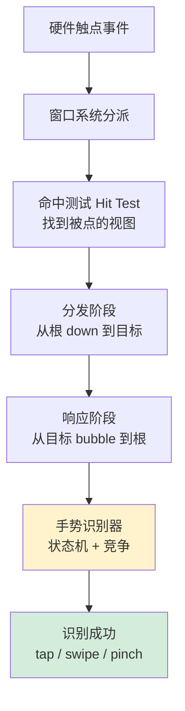
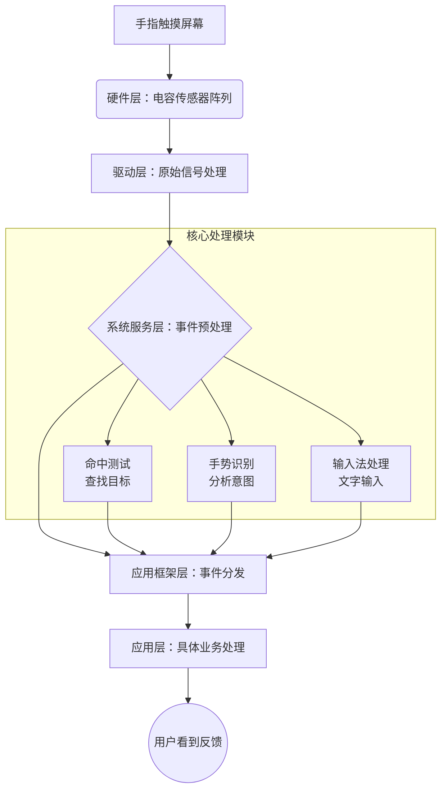
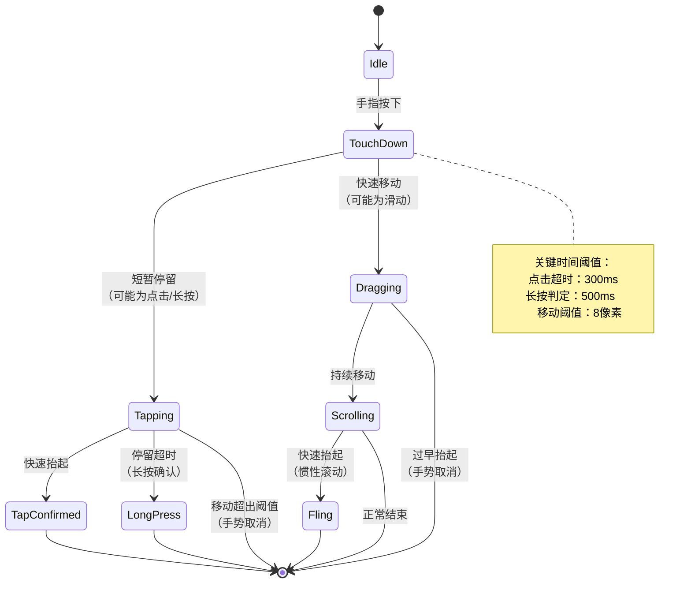
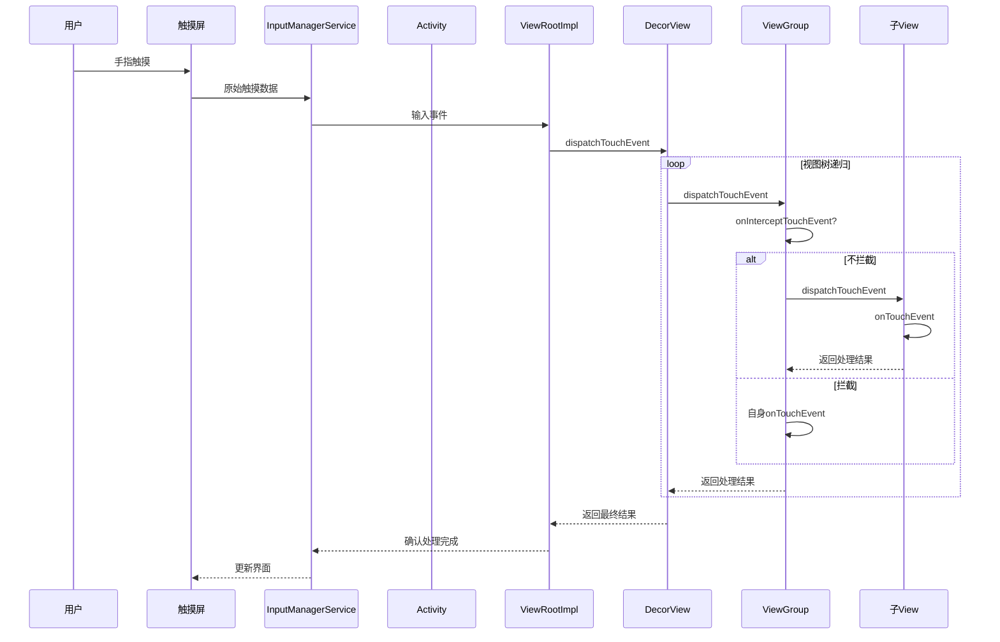
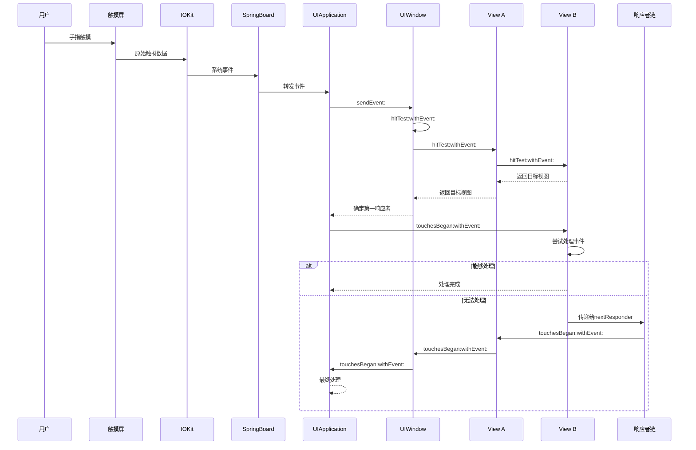

# 42.手势事件设计灵魂

> 📍 **本篇位置**：第 5 卷 · 系统交互 · 第 3 篇
> 🎯 **核心矛盾**：**底层 touch 点流 vs 业务语义手势** —— 一个 tap / swipe / pinch 背后要从几十个触点序列里"识别"
> 🧭 **设计灵魂**：事件两阶段——**分发（从根向下找目标）+ 响应（从目标向上冒泡）**；识别器 GestureRecognizer 是"状态机 + 竞争决策"的教科书案例
> 🌐 **跨语言覆盖**：Android(dispatchTouchEvent → onInterceptTouchEvent → onTouchEvent) · iOS(Hit Test + UIGestureRecognizer + Responder Chain) · Web(capture / target / bubble) · Flutter(Listener + GestureDetector) · Qt(event filter)
> 🔗 **延伸阅读**：← [41.消息机制设计思想](./41.消息机制设计思想.md) · ← [40.窗口核心设计思想](./40.窗口核心设计思想.md)



---

#### 目录介绍
- [01.为何要手势事件](#01为何要手势事件)
  - [1.1 思考一个问题](#11-思考一个问题)
  - [1.2 核心深层需求](#12-核心深层需求)
  - [1.3 分层处理流程](#13-分层处理流程)
  - [1.4 问题思考](#14-问题思考)
- [02.手势事件总架构](#02手势事件总架构)
  - [2.1 手势核心思想](#21-手势核心思想)
  - [2.2 事件元素设计](#22-事件元素设计)
  - [2.3 事件传递设计](#23-事件传递设计)
  - [2.4 事件响应设计](#24-事件响应设计)
- [03.手势事件元素](#03手势事件元素)
  - [3.1 触摸事件](#31-触摸事件)
  - [3.2 事件序列思想](#32-事件序列思想)
  - [3.3 理解事件序列](#33-理解事件序列)
  - [3.4 手势分类体系](#34-手势分类体系)
  - [3.5 事件元素设计](#35-事件元素设计)
  - [3.6 点击还是长按](#36-点击还是长按)
- [04.手势事件传递](#04手势事件传递)
  - [4.1 事件传递思路](#41-事件传递思路)
  - [4.2 事件流程架构](#42-事件流程架构)
  - [4.3 事件如何分发](#43-事件如何分发)
  - [4.4 事件如何拦截](#44-事件如何拦截)
- [05.手势事件处理](#05手势事件处理)
  - [5.1 事件处理思路](#51-事件处理思路)
  - [5.2 事件处理策略](#52-事件处理策略)
  - [5.3 设计哲学分析](#53-设计哲学分析)


## 01.为何要有手势事件

### 1.1 思考一个问题

试想一下假如你是一台手机，当有人触摸了屏幕之后，你需要找到他具体触摸了什么东西，他可能触摸是一个按钮，或一个列表，也有可能是一个一不小心的误触，你会设计一个怎么样的机制和系统来处理呢？

假如有两个按钮重叠了，或者遇到在滚动列表上需要拖动某个按钮的情况，你设计的机制能正常的运作嘛？

### 1.2 核心深层需求

理解设计动机：为什么事件处理要这么复杂？不这样设计会有什么问题？

掌握设计原则：在面临类似系统设计时，应该遵循哪些核心原则？

抽象共通规律：抛开Android/iOS的差异，什么是所有触摸系统必须解决的共性问题？

先回归到“第一性原理”思考：触摸处理到底要解决什么？作为一台手机，我面临的核心挑战是：

1. 不确定性：触摸点可能落在任何地方，可能是按钮、空白区域、甚至多个重叠的控件。多个重叠控件，是那个控件消费事件？
2. 实时性：用户期待即时反馈，处理必须高效（16ms内完成）。
3. 意图判断：要区分是精确点击、双击、滑动、长按还是误触。如何设计手指按下，抬起，移动等？
4. 资源有限：不能为每个触摸都全屏扫描，需要优化。

### 1.3 分层处理流程

硬件→驱动→系统→应用。每一层解决不同层次的问题，像漏斗一样逐步收敛。硬件层负责“发生了什么”，驱动层负责“在哪里”，系统层负责“是谁的”，应用层负责“该怎么办”。

系统顶层架构：分层处理流水线。就像工厂的流水线，每个环节各司其职。



### 1.4 问题思考

在Android，iOS中，都有手势识别设计和处理逻辑。如何理解手势识别设计核心思想，手势识别中包含事件元素，事件传递，事件响应。

1.如何设计事件元素，比如有点击，双击，长按，滑动等各种不同事件元素，其核心设计思想是什么？
2.事件传递过程中，在父布局元素和子布局元素中，事件是如何分发的，事件是如何拦截的，事件传递的核心设计核心思路？
3.在事件响应中，谁来响应事件，响应事件链是什么样的，最终响应事件的处理流程是什么？

## 02.手势事件总架构

### 2.1 手势核心思想

手势识别的核心思想是将原始的触摸事件（如按下、移动、抬起等）转换成更高级的语义事件（如点击、双击、长按、滑动等）。这样，开发者可以更专注于业务逻辑，而不必处理复杂的原始事件流。

### 2.2 事件元素设计

事件元素设计（如点击、双击、长按、滑动等）。设计思想：事件元素的设计基于对原始事件序列的抽象和模式识别。每个手势事件都有其特定的时间、空间特征。例如：

1. 点击：短时间内按下并抬起，且移动范围很小。
2. 双击：在短时间内发生两次点击，且两次点击时间间隔在一定范围内，位置相近。
3. 长按：按下后保持一段时间不移动，然后抬起。
4. 滑动：按下后移动一定距离，且速度达到一定阈值。

原理：通过定义一组规则（如时间阈值、距离阈值）来识别手势。通常使用状态机来跟踪手势的不同阶段。

### 2.3 事件传递设计

事件传递的核心思想：事件从根节点开始，沿着视图层次结构向下传递，直到找到最合适的视图来处理事件。如果这个视图不处理，事件会向上回溯，让父视图尝试处理。

事件拦截：在传递过程中，父视图可以拦截事件，阻止它向子视图传递，由父视图处理。

### 2.4 事件响应设计

响应者：通常是最内层的视图（或控件）有优先权响应事件。如果它不处理，则交给父视图，依次向上，直到有视图处理或者到达根视图。

事件响应链：是一个由视图组成的链，事件沿着这个链传递，直到被处理或丢弃。

## 03.手势事件元素

### 3.1 触摸事件

一个典型的事件序列包括以下事件：

```text
ACTION_DOWN：手指按下屏幕，序列开始
ACTION_MOVE：手指在屏幕上移动（可能发生多次）
ACTION_UP：手指离开屏幕，序列结束
ACTION_CANCEL：序列被取消（如父视图拦截了事件）
```

为什么要把事件封装成一个对象，比如Android中的`MotionEvent`？

1. 统一事件表示：将触摸事件封装成一个对象，便于传递和处理。
2. 携带丰富信息：MotionEvent不仅包含事件类型，还有坐标、压力、接触面积、时间戳等信息。
3. 支持多点触控：通过指针索引（pointer index）和指针ID（pointer id）来区分多个手指。
4. 高效事件传递：Android系统需要将事件分发给正确的视图，MotionEvent提供了事件传递机制的基础。

MotionEvent 的核心设计目标，统一抽象层设计，为上层应用提供硬件无关的、标准化的触摸事件接口

```java
// MotionEvent 的统一抽象
public final class MotionEvent implements Parcelable {
    // 核心坐标信息（已转换到应用坐标系）
    private float mX;                    // 当前触点X坐标
    private float mY;                    // 当前触点Y坐标
    private float mRawX;                 // 原始屏幕坐标X
    private float mRawY;                 // 原始屏幕坐标Y
    
    // 时间信息
    private long mDownTime;             // 按下时间（序列开始）
    private long mEventTime;            // 当前事件时间
    
    // 动作类型
    private int mAction;                // 主动作类型
    private int mActionIndex;           // 动作索引（多点触控）
    
    // 触点信息数组（支持多点）
    private PointerProperties[] mPointerProperties;  // 触点属性
    private PointerCoords[] mPointerCoords;           // 触点坐标
    
    // 历史数据（用于轨迹追踪）
    private int mHistorySize;           // 历史事件数量
    private long[] mEventTimeHistory;   // 历史时间戳
    private PointerCoords[] mHistoricalData; // 历史坐标
}
```

性能与内存的平衡设计，触摸事件频率高达 60-120Hz，需要高效的内存管理。这里使用到了缓存池技术。

```java
// MotionEvent 对象池设计（减少GC压力）
public final class MotionEvent {
    private static final int MAX_RECYCLED = 10;
    private static final Object sRecyclerLock = new Object();
    private static MotionEvent sRecycler;  // 对象池链表头
    
    // 对象复用机制
    public static MotionEvent obtain(long downTime, long eventTime, int action, 
                                    float x, float y, int metaState) {
        MotionEvent ev;
        synchronized (sRecyclerLock) {
            ev = sRecycler;
            if (ev != null) {
                sRecycler = ev.mNext;
            }
        }
        
        if (ev == null) {
            ev = new MotionEvent();  // 创建新对象
        } else {
            ev.mRecycled = false;
        }
        
        // 初始化对象数据
        ev.initialize(...);
        return ev;
    }
    
    // 回收对象
    public void recycle() {
        if (mRecycled) return;
        
        // 清理敏感数据
        mPointerIds = null;
        mPointerCoords = null;
        
        synchronized (sRecyclerLock) {
            if (sRecyclerCount < MAX_RECYCLED) {
                mNext = sRecycler;
                sRecycler = this;
                sRecyclerCount++;
                mRecycled = true;
            }
        }
    }
}
```

### 3.2 事件序列思想

什么是事件序列？可以将其理解为 **用户一次完整的触摸操作流程**。

举例来说，用户单击按钮、用户滑动屏幕、用户长按屏幕中某个UI元素等等，都属于该范畴。

每一次我们触摸屏幕，都会产生一连串的触摸事件(`MotionEvent`)，这些一连串的触摸事件合起来就是一个触摸事件序列。

事件序列确实可以理解为**用户一次完整的触摸操作流程**，但它不仅仅是一个简单的操作记录，而是一个**有状态的、有时序的、有语义的交互单元**。

### 3.3 理解事件序列

事件分发的本质原理就是递归，对此简单的实现方式是：**每接收一个新的事件，都需要进行一次递归才能找到对应消费事件的View，并依次向上返回事件分发的结果**。

思考一下：以每个触摸事件作为最基本的单元，都对`View`树进行一次遍历递归？这对性能的影响显而易见，因此这种设计是有改进空间的。

将 **事件序列** 作为最基本的单元进行处理则更为合适。

首先，设计者根据用户的行为对MotionEvent中添加了一个Action的属性以描述该事件的行为：DOWN，MOVE，UP，其他Action事件……

针对用户的一次触摸操作，必然对应了一个事件序列，从用户手指接触屏幕，到移动手指，再到抬起手指 ——单个事件序列必然包含ACTION_DOWN、ACTION_MOVE ... ACTION_MOVE、ACTION_UP 等多个事件，这其中ACTION_MOVE的数量不确定，ACTION_DOWN和ACTION_UP的数量则为1。

任何事件列都是以DOWN事件开始，UP事件结束，中间有无数的MOVE事件，如下图：

```
事件序列时间线：
  手指触碰      手指滑动                   手指抬起
    │             │  │  │  │  │             │
    ▼             ▼  ▼  ▼  ▼  ▼             ▼
 ACTION_DOWN → MOVE MOVE MOVE MOVE MOVE → ACTION_UP
    │                                       │
    └──────── 完整的一次触摸事件序列 ─────────┘
```


### 3.4 手势分类体系

Android设计哲学：

```java
// 基于监听器模式的通用设计
public interface OnGestureListener {
    boolean onDown(MotionEvent e);                    // 按下确认
    void onShowPress(MotionEvent e);                 // 长按前提示
    boolean onSingleTapUp(MotionEvent e);            // 单击抬起
    // ... 更多手势回调
}
```

iOS设计哲学：

```objc
// 基于Target-Action的响应链设计
@protocol UIGestureRecognizerDelegate <NSObject>
- (BOOL)gestureRecognizerShouldBegin:(UIGestureRecognizer *)gestureRecognizer;
- (BOOL)gestureRecognizer:(UIGestureRecognizer *)gestureRecognizer 
       shouldReceiveTouch:(UITouch *)touch;
@end
```

### 3.5 事件元素设计

在 iOS 中，UIGestureRecognizer 是一个用于处理用户手势的抽象基类。手势类型(他们都继承自UIGestureRecognizer，而UIGestureRecognizer继承自NSObject)

```objc
UIPanGestureRecognizer（拖动）
UIPinchGestureRecognizer（捏合）
UIRotationGestureRecognizer（旋转）
UITapGestureRecognizer（点按）
UILongPressGestureRecognizer（长按）
UISwipeGestureRecognizer（轻扫）
```

#### 点击（Tap）事件设计

设计思想：平衡响应速度与误操作防护

```java
public class TapDesign {
    // 时间阈值：区分单击与长按
    private static final int TAP_TIMEOUT = 100;    // 毫秒
    private static final int LONG_PRESS_TIMEOUT = 500;
    
    // 空间容差：允许的操作误差
    private static final float TOUCH_SLOP = 8;      // 像素
    
    // 状态机设计
    enum TapState { IDLE, PRESSED, TAP_CONFIRMED }
}
```

iOS实现原理：

```objc
// UITapGestureRecognizer 核心逻辑
@implementation UITapGestureRecognizer {
    NSTimeInterval _maxTapDuration;     // 最大点击时长
    NSInteger _numberOfTapsRequired;    // 点击次数要求
    NSInteger _numberOfTouchesRequired; // 手指数要求
    CGPoint _startPoint;                // 起始位置
    CFTimeInterval _startTime;          // 开始时间
}
```

### 3.6 点击还是长按

简单点击和复杂手势的设计思路上，都遵循着相似的基本原则。通过时间和空间阈值作为区分不同手势的基本依据，从而准确解读用户的触摸意图。

两者最根本的设计思想都是状态机。系统不会只根据一个触摸点就做出判断，而是会追踪整个触摸事件序列（从手指按下、移动到抬起），根据一系列条件（如时间、移动距离）在不同状态间转换，最终确定用户意图。



> Android 的设计思路：基于事件流的判断

Android 的处理更底层，它像一条传送带，将原始的触摸事件（MotionEvent）传递给视图，由视图或手势识别器（GestureDetector）根据事件流的历史信息来实时判断。

时间阈值（Timing Thresholds）：

1. TAP_TIMEOUT（约100ms）：区分点击和长按的初步界限。如果按压时间超过此值，则可能不是单击。
2. LONG_PRESS_TIMEOUT（约500ms）：长按确认的时间点。
3. DOUBLE_TAP_TIMEOUT（约300ms）：两次点击的最大间隔时间。

空间阈值（Slop）：

1. TouchSlop：系统认为的最小滑动距离（通常8-20像素）。如果手指移动距离超过此值，则认定为滑动，取消点击或长按的识别。

> iOS 的设计思路：基于手势识别器（Gesture Recognizer）的抽象

iOS 的设计更高级和抽象。它将每种手势封装成一个独立的、状态化的对象 UIGestureRecognizer。识别工作由这些对象完成，视图只需关心识别结果。

手势识别器状态：

1. 每个识别器都有自己的状态机（如 .possible, .began, .ended等），内部封装了判断逻辑。

依赖关系（Dependency）：

1. 这是解决手势冲突的关键。例如，为了让单击和双击共存，可以建立一种依赖关系。

## 04.手势事件传递

移动平台采用视图树（View Tree）作为事件传递的基础数据结构，事件从根节点开始，沿着树形结构向下传递。

Android： 基于“冒泡”机制的询问式分发。（问：你要不要处理？）Android 的事件传递围绕三个核心方法：dispatchTouchEvent、onInterceptTouchEvent和 onTouchEvent。

iOS： 基于“响应链”机制的指派式传递。（找：你就是处理者！）iOS 的事件传递基于 命中测试（Hit-Testing）和 响应者链（Responder Chain）。

### 4.1 事件传递思路

> Android事件传递体系，核心设计思想：责任链模式 + 拦截机制

```java
// Android事件传递伪代码
public boolean dispatchTouchEvent(MotionEvent event) {
    boolean handled = false;
    
    // 1. 安全检查
    if (onFilterTouchEventForSafety(event)) {
        return false;
    }
    
    // 2. 拦截检查
    final boolean intercepted;
    if (event.getAction() == MotionEvent.ACTION_DOWN || mFirstTouchTarget != null) {
        // 允许拦截
        intercepted = onInterceptTouchEvent(event);
    } else {
        // 后续事件默认拦截
        intercepted = true;
    }
    
    // 3. 分发逻辑
    if (!intercepted && !canceled) {
        // 向子视图分发。遍历所有子View
        for (View child in childrenReverseOrder) {
            if (child.isReceiveEvent(event)) {
                // 将事件分发给子View
                handled = child.dispatchTouchEvent(event);
                if (handled) {
                    // 如果子View处理了，循环终止，不再分发给其他子View
                    mFirstTouchTarget = child;  // 记录处理者
                    break;
                }
            }
        }
    }
    
    // 4. 自身处理（如果没有子视图处理）
    if (mFirstTouchTarget == null) {
        handled = onTouchEvent(event);
    }
    
    return handled;
}
```

决策点：onInterceptTouchEvent是父容器抢夺事件的关键。

回溯：如果所有子 View 都不处理，事件会沿着视图树向上冒泡，依次调用父容器的 onTouchEvent。

> iOS事件传递体系。核心设计思想：响应者链 + 命中测试

```objc
// iOS事件传递核心逻辑
- (UIView *)hitTest:(CGPoint)point withEvent:(UIEvent *)event {
    // 1. 基础条件检查
    if (self.hidden || self.alpha <= 0.01 || !self.userInteractionEnabled) {
        return nil;
    }
    
    // 2. 点是否在视图范围内
    if ([self pointInside:point withEvent:event]) {
        // 3. 从后向前遍历子视图（最上层的视图优先）
        for (UIView *subview in [self.subviews reverseObjectEnumerator]) {
            CGPoint convertedPoint = [subview convertPoint:point fromView:self];
            UIView *hitView = [subview hitTest:convertedPoint withEvent:event];
            
            if (hitView) {
                return hitView;  // 找到合适的响应视图
            }
        }
        
        // 4. 没有子视图处理，自身处理
        return self;
    }
    
    return nil;
}
```

### 4.2 事件流程架构

Android 事件流程传递时序图



iOS 事件流程传递时序图



### 4.3 事件如何分发

Android 和 iOS 的事件分发机制虽然目标一致——将触摸事件准确传递给正确的响应者——但设计思路却截然不同。我们可以用两个生动的比喻来理解：

1. Android 像一场“自顶向下的民主投票”：事件从顶层开始，层层向下询问每一个子 View：“你要处理这个事件吗？” 如果没人要，就自己处理。
2. iOS 像一支“自底而上的军事化队伍”：事件发生后，先精准定位最前线的士兵（第一响应者）。如果他处理不了，就沿指挥链（响应者链）逐级向上汇报。

> Android 事件分发：冒泡与拦截模型

Android 的分发流程围绕三个核心方法：dispatchTouchEvent、onInterceptTouchEvent和 onTouchEvent。其核心是责任链模式。

1. 传递方向：自上而下。事件从最外层的 Activity、Window、DecorView 开始，一层一层向内传递，直到最内层的子 View。
2. 决策机制：拦截：父容器（ViewGroup）拥有至高无上的 拦截权(onInterceptTouchEvent)。它可以在事件传递的任何时刻决定“截胡”，阻止事件继续向子 View 传递，转而自己处理。这是 Android 事件分发的核心控制手段。
3. 典型场景：ScrollView嵌套 Button。当手指按下后轻微移动，ScrollView的 onInterceptTouchEvent判断移动距离超过滑动阈值，就会返回 true进行拦截。后续的 MOVE事件将直接交给 ScrollView处理以实现滚动，Button将不会收到这些事件，并会收到一个 ACTION_CANCEL。
4. 回溯机制：冒泡：如果事件一直传递到最内层的子 View，但没有任何 View 的 onTouchEvent返回 true（表示消费），那么事件会沿着原来的路径自下而上地“冒泡”，依次调用父容器的 onTouchEvent。
5. 性能优化：目标缓存：当一个 ACTION_DOWN事件被某个子 View 消费后，系统会缓存这个 View 为 mFirstTouchTarget。后续的 ACTION_MOVE、ACTION_UP等事件将直接分发给这个缓存的目标，而不会再次进行完整的视图树遍历，极大地提高了效率。

> iOS 的分发流程基于两个核心概念：命中测试（Hit-Testing）和 响应者链（Responder Chain）。其核心是响应者链模式。

寻找第一响应者：自下而上的命中测试：与 Android 相反，iOS 的第一步是自下而上地寻找事件处理者。它从根视图（UIWindow）开始，递归地调用每个视图的 hitTest:withEvent:方法。这个方法内部会：

1. 检查自身是否可交互（userInteractionEnabled、isHidden、alpha）。
2. 检查触摸点是否在自己范围内（pointInside:withEvent:）。
3. 逆序（从最后添加的子视图开始，即视觉上最顶层的视图）遍历子视图，重复此过程。
4. 最终，返回最深层的、包含触摸点且可交互的视图作为第一响应者（First Responder）。

传递机制：响应者链：如果第一响应者（例如一个 UIView）不处理事件，事件不会“冒泡”给父视图的某个方法，而是传递给它的 nextResponder。nextResponder构成了一个响应者链，其典型顺序为：

1. UIView -> 父UIView -> ... -> UIViewController -> UIWindow -> UIApplication -> AppDelegate
2. 设计精髓：每个响应者只关心自己能否处理，不能处理就交给“链上的下一个”。这是一种更松散、更灵活的耦合方式。

### 4.4 事件如何拦截

**Android：父容器拥有“霸权”，主动拦截**。其设计思想是 “拦截（Interception）”。事件传递的路径是预设好的，但父容器有至高无上的权力在传递途中“截获”事件流，停止向下分发，自己处理。

> 第一种方式：关键机制：ViewGroup.onInterceptTouchEvent(MotionEvent event)方法

作用：这是 父容器的专属权利。在事件分发给子 View 之前，父容器会调用此方法询问自己：“我要不要拦截这个事件序列？”

返回值：

true：拦截。事件不会继续向子 View 传递，后续的 MOVE、UP等事件会直接交给父容器的 onTouchEvent方法处理。子 View 会收到一个 ACTION_CANCEL事件。

false：不拦截。事件继续向下传递。

> 第二种方式：子 View 的反抗：requestDisallowInterceptTouchEvent

子 View 可以通过调用 getParent().requestDisallowInterceptTouchEvent(true)来请求父容器不要拦截。这在类似 ViewPager内嵌 ListView的场景中非常有用。

```java
// 子View内部，当检测到水平滑动时，请求父ViewPager不要拦截
@Override
public boolean onTouchEvent(MotionEvent event) {
    switch (event.getActionMasked()) {
        case MotionEvent.ACTION_DOWN:
            // 按下时，请求父容器不要拦截
            getParent().requestDisallowInterceptTouchEvent(true);
            break;
        case MotionEvent.ACTION_MOVE:
            if (isHorizontalScroll(event)) {
                // 如果是水平滑动，继续阻止父容器拦截
                getParent().requestDisallowInterceptTouchEvent(true);
            } else {
                // 如果是垂直滑动，允许父容器拦截（以便它处理滚动）
                getParent().requestDisallowInterceptTouchEvent(false);
            }
            break;
    }
    return true;
}
```

场景比喻：就像公司里的项目经理（父容器） 接到一个任务（触摸事件）。他有权决定是自己处理（拦截），还是把任务派给下属（子 View）。如果他发现这个任务更适合自己处理（比如判定为滚动），他就会说“这个任务我接了”（返回 true），并通知下属“原来的任务取消了”（发送 ACTION_CANCEL）。

**iOS：响应者平等“协商”，优先级决定**。其设计思想是 “响应链（Responder Chain）” 和 “优先级（Priority）”。事件首先会传递给最合适的视图（第一响应者），如果它不处理，事件会沿着响应链向上传递，由链上的响应者们根据优先级规则“协商”谁来处理。


## 05.手势事件响应

### 5.1 事件处理思路

> Android：基于"状态判断"的指令式处理

思想：在控件的 onTouchEvent()中，通过分析 MotionEvent序列，手动判断手势意图

特点：命令式编程，开发者完全控制识别逻辑

> iOS：基于"识别器"的声明式处理。

思想：为控件附加预定义的手势识别器，系统自动识别后回调

特点：声明式编程，关注"是什么"而非"如何识别"

### 5.2 事件处理策略

Android 要求开发者在控件内部扮演侦探角色，分析触摸事件流，推断用户意图。举一个简单例子，如何判断并处理点击事件，处理点击事件。代码如下所示：

```java
@Override
public boolean onTouchEvent(MotionEvent event) {
    switch (event.getActionMasked()) {
        case MotionEvent.ACTION_DOWN:
            // 记录按下位置和时间
            startX = event.getX();
            startY = event.getY();
            isPressed = true;
            isLongPressTriggered = false;
            
            // 发送延迟消息检测长按
            postDelayed(longPressRunnable, LONG_PRESS_TIMEOUT);
            return true;
            
        case MotionEvent.ACTION_MOVE:
            if (!isPressed) break;
            
            // 计算移动距离
            float dx = Math.abs(event.getX() - startX);
            float dy = Math.abs(event.getY() - startY);
            
            // 判断1：移动距离超过阈值，取消点击状态
            if (dx > TOUCH_SLOP || dy > TOUCH_SLOP) {
                removeCallbacks(longPressRunnable);
                isPressed = false;
                invalidate(); // 重绘取消按压状态
            }
            break;
            
        case MotionEvent.ACTION_UP:
            removeCallbacks(longPressRunnable);
            
            // 判断2：在按压状态且未触发长按，才是点击
            if (isPressed && !isLongPressTriggered) {
                performClick(); // 触发点击
            }
            
            isPressed = false;
            invalidate();
            break;
            
        case MotionEvent.ACTION_CANCEL:
            removeCallbacks(longPressRunnable);
            isPressed = false;
            invalidate();
            break;
    }
    return true;
}
```

Android 设计思想总结：

1. 手动状态管理：开发者需要维护按压、拖拽等状态变量
2. 阈值判断：通过距离、时间阈值区分不同手势
3. 细粒度控制：可以精确控制识别的每个环节
4. 代码量较大：但灵活性极高，适合复杂自定义手势

iOS：识别器的声明式处理。iOS 将常见手势封装成独立组件，开发者只需配置而无需关心识别过程。

```swift
class CustomButton: UIView {
    override init(frame: CGRect) {
        super.init(frame: frame)
        setupGestures()
    }
    
    required init?(coder: NSCoder) {
        super.init(coder: coder)
        setupGestures()
    }
    
    private func setupGestures() {
        // 1. 点击手势 - 声明式配置
        let tapGesture = UITapGestureRecognizer(target: self, action: #selector(handleTap))
        tapGesture.numberOfTapsRequired = 1
        self.addGestureRecognizer(tapGesture)
        
        // 2. 长按手势 - 声明式配置
        let longPressGesture = UILongPressGestureRecognizer(target: self, action: #selector(handleLongPress))
        longPressGesture.minimumPressDuration = 0.5 // 长按时间阈值
        longPressGesture.allowableMovement = 10    // 允许移动范围
        self.addGestureRecognizer(longPressGesture)
        
        // 3. 解决手势冲突：长按失败后才识别点击
        tapGesture.require(toFail: longPressGesture)
    }
    
    @objc private func handleTap(_ gesture: UITapGestureRecognizer) {
        // 系统已识别出点击，直接处理业务逻辑
        if gesture.state == .ended {
            print("点击触发")
            // 处理点击业务...
        }
    }
    
    @objc private func handleLongPress(_ gesture: UILongPressGestureRecognizer) {
        // 根据手势状态处理
        switch gesture.state {
        case .began:
            print("长按开始")
            // 显示按压效果...
        case .changed:
            // 长按中移动手指
            let translation = gesture.location(in: self)
            print("长按移动: \(translation)")
        case .ended, .cancelled:
            print("长按结束")
            // 触发长按业务...
        default: break
        }
    }
}
```


**iOS 设计思想总结**：

- **声明式配置**：通过设置属性（`numberOfTapsRequired`、`minimumPressDuration`）定义手势
- **状态驱动**：识别器内部维护状态机（`.possible` → `.began` → `.changed` → `.ended`）
- **自动识别**：系统处理复杂的数学计算和模式识别
- **冲突解决**：通过依赖关系（`require(toFail:)`）和代理方法解决手势冲突


### 5.3 设计哲学分析

| 维度 | Android（指令式） | iOS（声明式） |
|------|------------------|---------------|
| **开发者角色** | **手势侦探**：分析证据，推理结论 | **手势导演**：配置演员，等待表演 |
| **代码焦点** | **"如何识别"**：距离计算、时间判断、状态管理 | **"识别什么"**：手势类型、参数配置、回调处理 |
| **控制粒度** | **细粒度**：可控制识别的每个细节 | **粗粒度**：关注识别结果，不关心中间过程 |
| **学习曲线** | **陡峭**：需理解触摸事件流和数学计算 | **平缓**：简单配置即可实现常见手势 |


### 5.4 手势事件设计的核心启示

**分层解耦**

手势系统的设计体现了经典的分层架构思想：

- **硬件层**：触摸屏将物理接触转换为电信号
- **驱动层**：将电信号转换为标准化的触摸事件数据
- **系统层**：事件分发和路由，决定事件传递路径
- **应用层**：手势识别和业务响应

每一层只关注自己的职责，通过标准接口与相邻层交互。

**责任链模式**

事件传递过程本质上是一个责任链：事件从顶层容器向下传递（分发），到达目标视图后向上回传（响应）。这种设计允许任何层级的视图都可以拦截和处理事件。

**状态机思想**

手势识别器的核心是一个状态机，通过状态转移来识别不同的手势类型。这种设计使得复杂的手势识别逻辑变得清晰可控。


