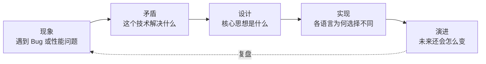
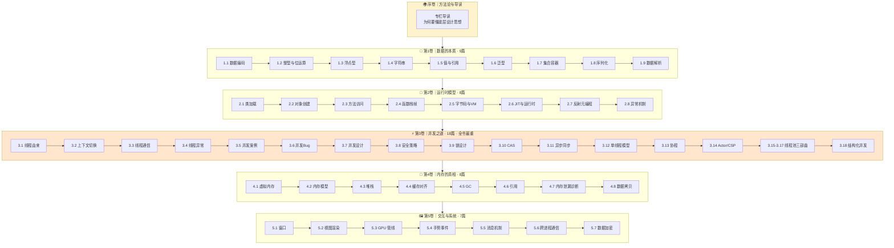

# 程序编程原理｜跨语言底层设计思想

> **一本给"语言之上的程序员"写的书——看见设计，而不是语法**。
>
> 看到 Java 的 `ConcurrentHashMap`、Go 的 `sync.Map`、C++ 的 `concurrent_hash_map`，能在脑中浮现它们背后**同一个"分段锁"的设计灵魂**。

---

## 📌 课程推荐｜你为什么需要这个专栏

```
😣 现实：写了 5 年代码、面试时被问"synchronized 锁升级"，
      会用但说不清原理，被定级压低一档；
      工作中遇到 Full GC、OOM、手势失灵、内存泄漏，
      只能 Stack Overflow 抄方案，却永远不知道根因。

🎯 转折：你欠缺的不是"知识点"，而是"看见设计的能力"——
      能从"会用 synchronized"上升到"我知道它解决什么矛盾"，
      能从"知道有 GC"上升到"我能预测三色标记在 STW 时的行为"，
      能从"会用 RecyclerView"上升到"我知道事件分发为什么会被父类抢走"。

🚀 本专栏：50+ 篇，5 卷 + 序卷，从硬件指令到现代异步范式，
      让你在面试、架构、定位疑难杂症时，
      永远能说出别人说不出的"为什么"。
```

> **如果你想从"高级开发"上升到"资深 / 架构"，这本专栏就是为你写的**。

---

## 🌟 课程差异化｜与市面其他专栏的本质区别

市面上 95% 的底层文章都是"Java 并发"、"C++ 内存"、"JS 事件循环"——**单语言、讲 API、背八股**。本专栏不一样：

| 维度 | 一般专栏 | 本专栏 |
|------|---------|--------|
| **语言视角** | 锁定单一语言（Java / Go / C++） | **跨 5+ 语言对比**：Java / Kotlin / C++ / Rust / Go / JS / Swift / Python |
| **教学方式** | API 列举 + 用法举例 | **从矛盾出发**：每篇先讲"工程界遇到了什么痛"，再讲设计 |
| **历史维度** | 直接讲"现在是这样" | **时间轴还原**：1970s → 1990s → 2010s → 现在，让你看见**为什么是这样** |
| **结论方式** | 直接给答案 | **探索式叙事**：先现象 → 再矛盾 → 再尝试方案 → 再权衡 → 再演进 |
| **认知深度** | 知其然 | **知其所以然**——每个三级标题都是一次"为什么"的追问 |
| **真实案例** | 教材式举例 | **真实工作事故**引入：从一次"按钮点不动"的事故讲到事件分发整个链路 |
| **配图密度** | 文字为主 | **每篇 3-10 张 mermaid + 时序图 + 状态机图** |

### 三大独家承诺

| 承诺 | 含义 | 落地方式 |
|------|------|---------|
| **① 跨语言对比** | 至少对比 Java / C++ / JavaScript / Kotlin / Go 中 **3 种以上**实现 | 每篇都有"跨语言对比表" |
| **② 只问矛盾** | 不背 API，**只讲"这个设计解决了什么矛盾"** | 每篇开头必有"根本矛盾"段落 |
| **③ 看演进史** | 让你看见"**为什么是这样**" 而不是"**它就是这样**" | 每篇都有时间轴 |

---

## 📖 课程说明｜怎么写、怎么读、怎么落地

### 写作规范｜每篇都遵守的"九段式"

这是专栏"系列感"的来源——每篇文章都按这个结构写：

```text
📖 统一篇章结构
━━━━━━━━━━━━━━━━━━━━━━━━━━━━━━━━━━━━━
0️⃣  §00 真实事故引入
      用 1-2 个真实工作事故 / 终端问题引入，让读者立刻有"代入感"
      引出灵魂三问 + 五个递进追问 + 探索路径

1️⃣  §01 根本矛盾与历史
      这个技术诞生前，工程界遇到了什么具体的痛
      时间轴：1970 → 2000 → 现在

2️⃣  §02-§05 核心机制 + 跨语言/跨平台实现
      至少 3+ 种语言或平台的对比
      每个三级标题都是一次"为什么"的追问

3️⃣  §06 跨平台/跨语言对照
      Java / C++ / Go / Rust / JS / Swift 的横向对比

4️⃣  §07 经典陷阱与生产级反模式
      新手坑 + 老手坑（共 7 大陷阱）

5️⃣  §08 一句话总结 + 延伸阅读
      三层认知阶梯 + 七字真言
      链接到本专栏其他篇章，形成内链网络
━━━━━━━━━━━━━━━━━━━━━━━━━━━━━━━━━━━━━
```

### 贯穿全书的思维方法



**理解矛盾 → 理解设计 → 理解实现 → 理解演进**——这是一条贯穿 50+ 篇的思维闭环。

---

## 🗺 覆盖的内容｜一张图看清全部



### 内容覆盖维度统计

| 维度 | 覆盖度 |
|------|--------|
| 编程语言 | Java / Kotlin / C++ / Rust / Go / JavaScript / Swift / Python（**8 种**） |
| 操作系统 | Linux / Windows / macOS / Android / iOS（**5 大平台**） |
| 时间跨度 | 1968（鼠标） → 2007（iPhone）→ 2018（Kotlin协程）→ 2023（Java结构化并发）（**半世纪+**） |
| 抽象层级 | 硬件指令（CAS/MESI）→ OS 调度 → 语言 VM → 框架范式（**四层贯通**） |
| 并发模型 | 线程 / 协程 / Actor / CSP / 单线程事件循环 / 结构化并发（**6 大范式**） |

---

## 📚 课程分卷与目录介绍｜5 卷 + 序卷 · 50+ 篇

### 🌍 序卷｜方法论与导读 · [📁 进入](00.序卷方法论导读/)

> 不教知识，先教看世界的方法。决定后续 5 卷的吸收效率。

| 文档 | 核心问题 |
|------|---------|
| [专栏的导读和绪论](00.序卷方法论导读/专栏的导读和绪论.md) | 为什么"看见设计"比"会用 API"更值钱 |
| [全专栏内容介绍](00.序卷方法论导读/全专栏地图与索引) | 5 卷 50 篇全景式索引与学习路径 |

---

### 🔢 第 1 卷｜数据的本质（万物起源） · [📁 进入](01.第1卷数据的本质/) · 9 篇

> 计算机如何用有限的位表示无限的信息——一切设计的起点。

| 序号 | 文档 | 核心矛盾 |
|------|------|---------|
| 1.1 | [数据编码设计原理](01.第1卷数据的本质/1.1.数据编码设计原理.md) | 全人类文字如何在 0/1 上达成共识 |
| 1.2 | [整型与位运算原理](01.第1卷数据的本质/1.2.整型与位运算原理.md) | 二进制补码的几何美学 |
| 1.3 | [浮点型数据设计灵魂](01.第1卷数据的本质/1.3.浮点数据设计灵魂) | 为何 0.1+0.2≠0.3 |
| 1.4 | [字符串设计的灵魂](01.第1卷数据的本质/1.4.字符串设计的灵魂.md) | 为何字符串要不可变 |
| 1.5 | [值型变量和引用](01.第1卷数据的本质/1.5.值型变量和引用.md) | 值传递、引用传递的本质 |
| 1.6 | [泛型设计灵魂思想](01.第1卷数据的本质/1.6.泛型设计灵魂思想.md) | 类型擦除 vs 单态化 |
| 1.7 | [集合与容器设计原理](01.第1卷数据的本质/1.7.集合与容器设计原理.md) | 数组、链表、哈希、树的统一抽象 |
| 1.8 | [序列化数据的思想](01.第1卷数据的本质/1.8.序列化数据的思想.md) | JSON / Protobuf / XML 的取舍 |
| 1.9 | [数据解析设计思想](01.第1卷数据的本质/1.9.数据解析设计思想.md) | 解析器为何能差出 100 倍 |

---

### 🧬 第 2 卷｜运行时模型（从类到对象） · [📁 进入](02.第2卷运行时模型/) · 8 篇

> 程序运行时究竟发生了什么？

| 序号 | 文档 | 核心矛盾 |
|------|------|---------|
| 2.1 | [类的加载核心原理](02.第2卷运行时模型/2.1.类的加载核心原理.md) | 双亲委派为何而生 |
| 2.2 | [对象创建流程原理](02.第2卷运行时模型/2.2.对象创建流程原理.md) | new 一个对象到底发生多少步 |
| 2.3 | [对象和函数访问原理](02.第2卷运行时模型/2.3.对象和函数访问原理.md) | vtable / itable / 静态分派 |
| 2.4 | [函数调用栈与栈帧设计](02.第2卷运行时模型/2.4.函数调用栈与栈帧设计.md) | 栈帧的物理布局与调用约定 |
| 2.5 | [字节码与虚拟机执行原理](02.第2卷运行时模型/2.5.字节码与虚拟机执行原理.md) | 解释 vs 编译，VM 的执行引擎 |
| 2.6 | [JIT 与运行时优化](02.第2卷运行时模型/2.6.JIT与运行时优化.md) | C2 / Graal 凭什么能"超过 C++" |
| 2.7 | [反射与元编程核心设计](02.第2卷运行时模型/2.7.反射与元编程核心设计.md) | 反射 / Emit / Proxy 的共同本质 |
| 2.8 | [异常机制设计原理](02.第2卷运行时模型/2.8.异常机制设计原理.md) | 异常从硬件中断到语言层 |

---

### ⚡ 第 3 卷｜并发之道（最硬核模块） · [📁 进入](03.第3卷并发之道/) · 18 篇

> 专栏分量最重的一卷。从硬件原子指令到结构化并发，把并发编程半个世纪的进化史完整走一遍。

#### 🌱 起源篇

| 序号 | 文档 | 核心矛盾 |
|------|------|---------|
| 3.1 | [线程前世今生探索](03.第3卷并发之道/3.1.线程前世今生探索.md) | 进程不够用？1:1 / N:1 / M:N 演进 |
| 3.2 | [并发上下文切换原理](03.第3卷并发之道/3.2.并发上下文切换原理.md) | 进程 / 线程 / 协程的代价差异 |
| 3.3 | [线程通信设计思想](03.第3卷并发之道/3.3.线程通信设计思想.md) | 共享内存 vs 消息传递 |
| 3.4 | [线程异常设计原理](03.第3卷并发之道/3.4.线程异常设计原理.md) | 异常从硬件中断到语言层 |
| 3.5 | [多线程并发经典案例](03.第3卷并发之道/3.5.多线程并发经典案例.md) | 售票问题揭示的竞态 |

#### 🔥 矛盾篇

| 序号 | 文档 | 核心矛盾 |
|------|------|---------|
| 3.6 | [并发 Bug 源头由来](03.第3卷并发之道/3.6.并发Bug源头由来.md) | 可见性 / 原子性 / 有序性 |
| 3.7 | [并发编程设计思想](03.第3卷并发之道/3.7.并发编程设计思想.md) | 分工 / 同步 / 互斥三大命题 |
| 3.8 | [并发编程安全设计](03.第3卷并发之道/3.8.并发编程安全设计.md) | 不可变 / TLS / 读写分离 / 无锁 |
| 3.9 | [锁核心设计和思想](03.第3卷并发之道/3.9.锁核心设计和思想.md) | LOCK# 到锁升级的完整链路 |
| 3.10 | [理解 CAS 设计由来](03.第3卷并发之道/3.10.理解CAS设计由来.md) | 从哲学到硬件，CAS 与 ABA |

#### 🚀 范式篇

| 序号 | 文档 | 核心矛盾 |
|------|------|---------|
| 3.11 | [异步和同步的设计](03.第3卷并发之道/3.11.异步和同步的设计.md) | 同步 → 多线程 → 回调 → async/await |
| 3.12 | [单线程模型的思想](03.第3卷并发之道/3.12.单线程模型的思想.md) | 单线程为何反而高并发 |
| 3.13 | [协程核心设计思想](03.第3卷并发之道/3.13.协程核心设计思想.md) | 挂起/恢复 + 有栈 vs 无栈 |
| 3.14 | [Actor 与 CSP 并发模型](03.第3卷并发之道/3.14.Actor与CSP并发模型.md) | Erlang Actor vs Go channel |

#### 🏊 池化篇

| 序号 | 文档 | 核心矛盾 |
|------|------|---------|
| 3.15 | [线程池的设计思想](03.第3卷并发之道/3.15.线程池的设计思想.md) | 池化思想：生产者-消费者 |
| 3.16 | [线程池设计核心原理](03.第3卷并发之道/3.16.线程池设计核心原理.md) | ctl 变量、状态机、Worker 模型 |
| 3.17 | [线程池使用技巧](03.第3卷并发之道/3.17.线程池使用技巧.md) | 7 大参数调优实战 |
| 3.18 | [结构化并发设计思想](03.第3卷并发之道/3.18.结构化并发设计思想.md) | Kotlin / Swift / Java 21 / Trio |

---

### 💾 第 4 卷｜内存的真相 · [📁 进入](04.第4卷内存的真相/) · 8 篇

> 从虚拟内存到垃圾回收——理解程序运行的物理基础。

| 序号 | 文档 | 核心矛盾 |
|------|------|---------|
| 4.1 | [虚拟内存与地址空间](04.第4卷内存的真相/4.1.虚拟内存与地址空间.md) | MMU / 页表 / TLB / COW —— 现代内存的根本骨架 |
| 4.2 | [内存模型技术设计](04.第4卷内存的真相/4.2.内存模型技术设计.md) | 冯·诺依曼到现代 JMM 的演进 |
| 4.3 | [堆和栈内存的设计](04.第4卷内存的真相/4.3.堆和栈内存的设计.md) | 栈帧、malloc、glibc chunk/bin |
| 4.4 | [内存对齐与缓存局部性](04.第4卷内存的真相/4.4.内存对齐与缓存局部性.md) | Cache Line / Padding / 伪共享 |
| 4.5 | [内存回收机制设计](04.第4卷内存的真相/4.5.内存回收机制设计.md) | 标记清除 → 分代 → ZGC |
| 4.6 | [多种引用技术设计](04.第4卷内存的真相/4.6.多种引用技术设计.md) | 强 / 软 / 弱 / 虚引用 |
| 4.7 | [内存泄漏与诊断原理](04.第4卷内存的真相/4.7.内存泄漏与诊断原理.md) | GC Roots / 支配树 / Heap Dump / Profiler |
| 4.8 | [数据拷贝设计原理](04.第4卷内存的真相/4.8.数据拷贝设计原理.md) | 浅 / 深 / Copy-on-Write |

---

### 🖼 第 5 卷｜交互与系统 · [📁 进入](05.第5卷交互与系统/) · 7 篇

> 从硬件触点到屏幕像素——用户交互背后的事件驱动架构。

| 序号 | 文档 | 核心矛盾 |
|------|------|---------|
| 5.1 | [窗口核心设计思想](05.第5卷交互与系统/5.1.窗口核心设计思想.md) | 矩形 + 事件 + 坐标系 |
| 5.2 | [视图加载渲染设计](05.第5卷交互与系统/5.2.视图加载渲染设计.md) | measure / layout / draw 三阶段 |
| 5.3 | [图形渲染管线原理](05.第5卷交互与系统/5.3.图形渲染管线原理.md) | GPU 流水线 / VSync / 合成器 / Skia |
| 5.4 | [手势事件设计灵魂](05.第5卷交互与系统/5.4.手势事件设计灵魂.md) | 触点流 → 状态机 → 手势语义 |
| 5.5 | [消息机制设计思想](05.第5卷交互与系统/5.5.消息机制设计思想.md) | Handler / Looper / MessageQueue |
| 5.6 | [跨进程通信设计](05.第5卷交互与系统/5.6.跨进程通信设计.md) | 进程隔离 vs 协作通信·管道/shm/Binder |
| 5.7 | [数据加密和解密](05.第5卷交互与系统/5.7.数据加密和解密.md) | 对称 / 非对称 / 哈希 |

---

## 🛤 三条阅读路径

选一条适合你的路径，而不是从头啃到尾：

### 🟢 新手路径｜建立整体观（10 篇）

```
专栏导读 → 1.1 数据编码 → 1.4 字符串 → 2.1 类加载
        → 3.1 线程由来 → 3.7 并发设计 → 3.12 单线程模型
        → 3.15 线程池 → 4.1 虚拟内存 → 5.5 消息机制
```

### 🟡 进阶路径｜深入核心矛盾（12 篇）

```
1.6 泛型 → 2.3 方法分派 → 2.6 JIT → 3.9 锁设计
       → 3.10 CAS → 3.11 异步同步 → 3.13 协程 → 3.14 Actor/CSP
       → 3.18 结构化并发 → 4.5 GC → 4.6 引用类型 → 5.4 手势事件
```

### 🔴 面试冲刺｜高频必考（10 篇）

```
1.5 值与引用 ｜ 1.6 泛型 ｜ 3.6 并发 Bug ｜ 3.7 并发设计
3.8 并发安全 ｜ 3.9 锁升级 ｜ 3.10 CAS/ABA ｜ 3.16 线程池原理
4.5 GC 演进 ｜ 4.6 四种引用
```

---

## 🎁 你能学到什么｜读完这个专栏的 10 项收益

读完 50+ 篇之后，你将拥有以下能力：

### 🧠 认知层（思维方式）

1. **看见矛盾的能力**：拿到一个新框架（不论是 Tokio、Akka、Vert.x），能在 5 分钟内说出它解决了什么矛盾、抛弃了什么 trade-off。
2. **跨语言抽象的能力**：学一门新语言时，不再被语法吓住——你知道"它的并发原语对应 Java 的什么、内存模型对应 C++ 的什么"。
3. **看见演进的能力**：能预判一项技术的下一步——为什么 GC 会朝着 ZGC / Shenandoah 进化？为什么协程取代了回调？

### 🛠 工程层（落地能力）

4. **定位疑难杂症的能力**：再遇到 OOM / Full GC / 死锁 / ANR，不再 Stack Overflow 撞运气，而是能从根因出发推导。
5. **架构设计的能力**：能从矛盾出发选型——什么场景该用 Actor、什么场景该用 CSP、什么场景该用结构化并发？
6. **写出"不出事"代码的能力**：你写的并发代码、内存敏感代码、事件驱动代码，会比同事少 90% 的隐患。

### 🎤 表达层（输出能力）

7. **面试的能力**：当面试官问"synchronized 锁升级"，你能从硬件 LOCK# 讲到 mark word 再讲到偏向锁优化历史，把面试官讲服。
8. **晋升答辩的能力**：技术分享时，你能讲出"为什么这么设计"，而不只是"我做了什么"——这是 P7→P8 的核心区别。
9. **指导新人的能力**：能用 1 分钟讲清楚一个底层概念，让新人快速建立心智模型。

### 🚀 长期层（不被淘汰的能力）

10. **抗时间淘汰的能力**：API、框架、语言会过时，但**矛盾不会**——这本专栏教你的是 50 年都不会失效的认知。

---

## 🧑‍💻 适合人群｜这个专栏写给谁

### ✅ 强烈推荐

| 人群 | 适合理由 |
|------|---------|
| **3-8 年的应用层开发者** | 你已经会用 API，正卡在"懂原理"这一关——本专栏就是为你写的 |
| **准备一线大厂面试的求职者** | 50+ 篇 8 成内容是大厂高频考点，但讲法比八股文深 10 倍 |
| **从 Java/Android 转 Go/Rust 的工程师** | 跨语言对比让你不用重新学一遍底层 |
| **希望从高级开发晋升资深 / 架构的人** | "看见设计"是 P7→P8 的核心能力 |
| **大学高年级 / 研究生** | 学校教离散原理，本专栏教这些原理在工业界的真实样子 |
| **技术博客作者 / 讲师** | 大量真实事故案例 + 跨语言对比，是写作的金矿 |

### ⚠️ 谨慎选择

| 人群 | 谨慎理由 |
|------|---------|
| **完全的编程新手（< 1 年）** | 推荐先掌握至少一门语言的基础再来读 |
| **只想要"代码片段，复制粘贴"的读者** | 本专栏强调"理解 > 速成"，不适合短期速成场景 |
| **算法竞赛选手** | 本专栏不讲算法，讲的是工程设计 |

---

## 📮 学习节奏建议

```
🐢 慢读型：每天 30 分钟，每周 2 篇 → 6 个月读完
🚶 标准型：每天 1 小时，每周 3 篇 → 4 个月读完
🏃 突击型：每天 3 小时，每周 7 篇 → 7 周读完（不推荐，吸收率低）
```

> **强烈建议**：每读完一篇，**立刻回到自己最近的项目**，找一段相关代码对照——
> 这个动作能让你的吸收效率提升 5 倍。

---

## 🎯 相关资源

- 💻 **配套源码**：每篇文章中的代码案例都是可运行的
- 💬 **答疑交流**：欢迎 Issue / PR 提问
- ⭐ **收藏方式**：建议 Star 本仓库 + 收藏目录页，方便追更

---

**这不是一本能让你"明天就升职加薪"的书，但它会让你 5 年后回头看时，庆幸自己当年读过。**

> 写下这本书，是因为我自己工作十年里走过太多弯路——希望它能帮你少走一些。
