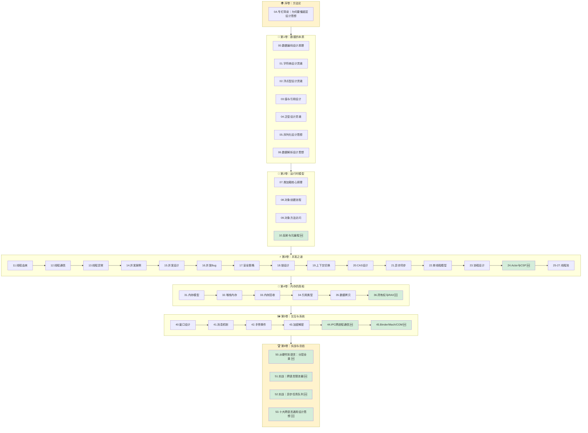
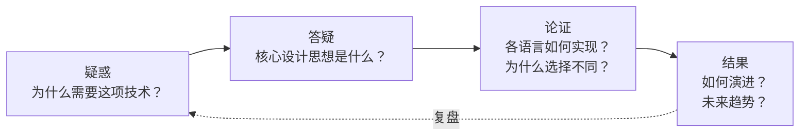

# 程序编程原理｜跨语言底层设计思想

> 一本给"语言之上的程序员"写的书——**看见设计，而不是语法**。
>
> 看见 Java 里的 `ConcurrentHashMap`、Go 里的 `sync.Map`、C++ 里的 `concurrent_hash_map`，能想到它们背后是**同一个"分段锁"的设计灵魂**。

---

## 🎯 专栏差异化：三大承诺

市面上 95% 的底层文章都是"Java 并发"、"C++ 内存"、"JS 事件循环"——**单语言、讲 API、背八股**。

本专栏不一样，每一篇都做到：

| 承诺 | 含义 | 落地方式 |
|------|------|---------|
| **① 跨语言对比** | 至少对比 Java / C++ / JavaScript / Kotlin / Go 中的 **3 种以上**实现 | 每篇都有"跨语言对比表" |
| **② 只问矛盾** | 不背 API，**只讲"这个设计解决了什么矛盾"** | 每篇开头必有"根本矛盾"段落 |
| **③ 看演进史** | 从 1970s → 2000s → 现在，**让你看见"为什么是这样"** 而不是"它就是这样" | 每篇都有时间轴 |

---

## 🧭 专栏全景图（6 卷 · 50+ 篇）



> 🆕 = 规划新增； 无标记 = 已有或半成文。

---

## 📖 三条阅读路径

选一条适合你的路径，而不是从头啃到尾：

### 🟢 新手路径｜建立整体观（10 篇）

先拿到"整个专栏的骨架"，不陷入细节：

```
0A 导读 → 00 数据编码 → 01 字符串 → 07 类加载
      → 11 线程由来 → 15 并发设计 → 22 单线程模型
      → 25 线程池 → 31 内存模型 → 41 消息机制
```

### 🟡 进阶路径｜深入核心矛盾（12 篇）

已经会用，想知道"为什么这么设计"：

```
04 泛型 → 09 方法分派 → 18 锁设计 → 19 上下文切换
      → 20 CAS → 21 异步同步 → 23 协程 → 24 Actor/CSP
      → 33 GC → 34 引用类型 → 36 所有权/RAII → 50 分层全景
```

### 🔴 面试冲刺｜高频必考（10 篇）

短期突击，覆盖一线大厂高频考点：

```
03 值与引用 ｜ 04 泛型 ｜ 15 并发三大核心 ｜ 16 并发三大Bug
17 并发安全 ｜ 18 锁升级 ｜ 20 CAS/ABA ｜ 27 线程池原理
33 GC 演进 ｜ 34 四种引用
```

---

## ✍️ 写作规范｜每篇都遵守的 7 段式

这是专栏"系列感"的来源——每篇文章都按这个结构写：

```text
📖 统一篇章结构
━━━━━━━━━━━━━━━━━━━━━━━━━━━━━━━━━━━━━
1️⃣  开篇一图胜千言
      用 Mermaid / 时间轴立刻说清"这篇要解决什么"

2️⃣  §1 根本矛盾
      这个技术诞生前，工程界遇到了什么具体痛？

3️⃣  §2 设计演进
      时间轴式：1970 → 2000 → 现在
      每一步在解决上一步的什么问题？

4️⃣  §3-§4 核心机制 + 跨语言实现
      至少 Java + C++ + JavaScript 三种实现对比

5️⃣  §5 共性抽象
      去掉语言语法后，共同的"设计骨架"是什么？

6️⃣  §6 经典陷阱
      新手踩坑 + 老手踩坑

7️⃣  §7 一句话总结 + 延伸阅读
      链接到本专栏其他篇章，形成内链网络
━━━━━━━━━━━━━━━━━━━━━━━━━━━━━━━━━━━━━
```

---

## 🧠 贯穿全系列的思维方法



**理解矛盾 → 理解设计 → 理解实现 → 理解演进**——这是一条闭环。

---

## 📚 完整目录

### 🌍 序卷｜方法论

| 序号 | 文档 | 核心问题 |
|------|------|---------|
| 0A | [专栏导读：为何要懂底层设计思想](./00.专栏的导读和绪论) | 语法迭代这么快，为什么还要学"老底层"？ |

### 🔢 第 1 卷｜数据的本质（万物起源）

理解计算机如何用有限的位表示无限的信息——一切设计的起点。

| 序号 | 文档 | 核心问题 |
|------|------|---------|
| 00 | 数据编码设计原理 | ASCII/Unicode/UTF-8 如何统一人类所有文字？ |
| 01 | 字符串设计的灵魂 | 为何字符串要设计成不可变？常量池的本质？ |
| 02 | 浮点型数据设计灵魂 | 为何 `0.1+0.2≠0.3`？IEEE754 的工程妥协 |
| 03 | 值型变量和引用 | 值传递和引用传递的本质区别是什么？ |
| 04 | 泛型设计灵魂思想 | 类型擦除 vs 单态化，各语言为何选择不同？ |
| 05 | 序列化数据的思想 | JSON/ProtoBuf/XML 各自解决什么问题？ |
| 06 | 数据解析设计思想 | 解析器的设计哲学，性能与可读性的取舍 |

### 🧬 第 2 卷｜运行时模型（从类到对象）

从类到对象，从加载到访问——理解运行时的核心机制。

| 序号 | 文档 | 核心问题 |
|------|------|---------|
| 07 | 类的加载核心原理 | 双亲委派为何而生？类加载的五个阶段做了什么？ |
| 08 | 对象创建流程原理 | 对象在内存中长什么样？对象头为何这样设计？ |
| 09 | 对象和函数访问原理 | 直接指针 vs 句柄访问，谁更快？为什么？ |
| 🆕 10 | 反射与元编程核心设计 | Java 反射 / C# Emit / JS Proxy / Python `__class__` 的共同本质 |

### ⚡ 第 3 卷｜并发之道（最硬核模块）

从线程的诞生到并发编程的所有核心设计——专栏分量最重的一卷。

| 序号 | 文档 | 核心问题 |
|------|------|---------|
| 11 | 线程前世今生探索 | 线程为何被发明？1:1/N:1/M:N 模型的演进 |
| 12 | 线程通信设计思想 | 共享内存 vs 消息传递，各自的硬件基础？ |
| 13 | 线程异常设计原理 | 异常从硬件中断到语言层面经历了什么？ |
| 14 | 多线程并发经典案例 | 经典售票问题揭示的竞态条件本质 |
| 15 | 并发编程设计思想 | 分工 → 同步 → 互斥，并发编程的三大核心 |
| 16 | 并发 Bug 源头由来 | 可见性、原子性、有序性——三大 Bug 根源 |
| 17 | 并发编程安全设计 | 不可变、TLS、读写分离、无锁——四大安全策略 |
| 18 | 锁核心设计和思想 | 从硬件原子指令到 Java 锁升级的完整链路 |
| 19 | 并发上下文切换原理 | 进程 / 线程 / 协程切换的代价差异及根因 |
| 20 | 理解 CAS 设计和由来 | 从哲学到硬件，CAS 的 ABA 问题与解法 |
| 21 | 异步和同步的设计 | 同步 → 多线程 → 回调 → async/await 的演进 |
| 22 | 单线程模型的思想 | 单线程为何能高并发？事件循环的精妙设计 |
| 23 | 协程核心设计思想 | "挂起/恢复"的机器本质；有栈 vs 无栈的根本抉择 |
| 🆕 24 | Actor 与 CSP 并发模型 | Erlang/Akka 的 Actor vs Go channel 的 CSP |
| 25 | 线程池的设计思想 | 池化思想的本质，生产者-消费者模型 |
| 26 | 线程池使用技巧 | ThreadPoolExecutor 参数调优实战 |
| 27 | 线程池设计核心原理 | Executor 框架、ctl 变量、状态机设计 |
| 🆕 28 | [结构化并发设计思想](./28.结构化并发设计思想.md) | Kotlin / Swift / Java 21 / Trio 的范式革命——让并发任务回归"大括号" |

### 💾 第 4 卷｜内存的真相

从内存模型到垃圾回收——理解程序运行的物理基础。

| 序号 | 文档 | 核心问题 |
|------|------|---------|
| 31 | 内存模型技术设计 | 冯·诺依曼到现代内存模型的演进 |
| 32 | 堆和栈内存的设计 | 栈帧、malloc 内部实现、glibc 的 chunk/bin 设计 |
| 33 | 内存回收机制设计 | GC 算法演进：标记清除 → 复制 → 整理 → 分代 |
| 34 | 多种引用技术设计 | 强/软/弱/虚引用，所有权语义的跨语言对比 |
| 35 | 数据拷贝设计原理 | 浅拷贝/深拷贝/懒拷贝的设计哲学 |
| 🆕 36 | 所有权与 RAII 对比 | Rust `Ownership` vs C++ RAII vs Swift ARC |

### 🖼 第 5 卷｜交互与系统

从窗口系统到跨进程通信——用户交互背后的事件驱动架构。

| 序号 | 文档 | 核心问题 |
|------|------|---------|
| 40 | 窗口核心设计思想 | 为什么是矩形、事件、坐标系——窗口系统的本质 |
| 41 | 消息机制设计思想 | Handler/Looper/MessageQueue 的架构精髓 |
| 42 | 手势事件设计灵魂 | 事件分发 / 拦截机制的状态机设计 |
| 43 | 加密解密设计思想 | 对称 / 非对称 / 哈希的跨语言实现对比 |
| 🆕 44 | IPC 跨进程通信原理 | 管道 / 共享内存 / 消息队列 / 套接字 |
| 🆕 45 | Binder 与 Mach 与 COM | Android/iOS/Windows 三大 RPC 机制对比 |

### 🏆 第 6 卷｜实战与总结

把前面 40+ 篇串起来，落到"怎么用"。

| 序号 | 文档 | 核心问题 |
|------|------|---------|
| 🆕 50 | 从硬件到语言：分层全景图 | 一张大图把整本专栏串起来 |
| 🆕 51 | 实战｜跨语言限流器设计 | 并发 + 原子 + 时间窗口的综合实战 |
| 🆕 52 | 实战｜异步任务队列设计 | 线程池 + 消息机制 + 序列化的综合实战 |
| 🆕 53 | 十大跨语言通用设计思想总结 | 读完这本书你得到了什么 |

---

## 🧑‍💻 适合人群

- 想突破"会用但不理解原理"瓶颈的**资深开发者**
- 准备技术面试、需要深入理解底层设计的**求职者**
- 对跨语言技术对比感兴趣的**全栈工程师**
- 希望提升系统设计能力的**架构师**

---

## 📮 专栏节奏

- 🔴 **P0 进行中**：补全残缺篇（23 协程 ✅ / 40 窗口）
- 🟡 **P1 近期**：新增 24 Actor-CSP、36 所有权、10 反射元编程
- 🟢 **P2 远期**：第 6 卷实战 + 总结（50-53）

> 专栏会持续更新，建议 Star/收藏目录页，方便追更。
