# 01.通用架构设计方案
#### 目录介绍
- [01.为何做架构设计](#01为何做架构设计)
  - [1.1 解决核心问题](#11-解决核心问题)
  - [1.2 开发遇到问题](#12-开发遇到问题)
  - [1.3 架构设计的价值](#13-架构设计的价值)
  - [1.4 架构的必要性](#14-架构的必要性)
  - [1.5 架构设计出发点](#15-架构设计出发点)
- [02.架构核心思想](#02架构核心思想)
  - [2.1 架构基本原则](#21-架构基本原则)
  - [2.2 分层思想](#22-分层思想)
  - [2.3 模块化思想](#23-模块化思想)
  - [2.4 架构思维模型](#24-架构思维模型)
- [03.架构通用能力](#03架构通用能力)
  - [3.1 通用架构分层模型](#31-通用架构分层模型)
  - [3.2 跨平台通用架构](#32-跨平台通用架构)
  - [3.3 架构分层原则](#33-架构分层原则)
- [04.三种架构模式](#04三种架构模式)
  - [4.1 架构演变过程](#41-架构演变过程)
  - [4.2 三种架构对比](#42-三种架构对比)
- [05.MVC架构设计](#05mvc架构设计)
  - [5.1 MVC核心概念](#51-mvc核心概念)
  - [5.2 MVC案例代码](#52-mvc案例代码)
  - [5.3 通俗理解MVC](#53-通俗理解mvc)
  - [5.4 MVC时序图](#54-mvc时序图)
  - [5.5 MVC优缺点分析](#55-mvc优缺点分析)
- [06.MVP架构设计](#06mvp架构设计)
  - [6.1 MVP核心概念](#61-mvp核心概念)
  - [6.2 MVP案例代码](#62-mvp案例代码)
  - [6.3 MVP时序图](#63-mvp时序图)
  - [6.4 MVP优缺点分析](#64-mvp优缺点分析)
- [07.MVVM架构设计](#07mvvm架构设计)
  - [7.1 MVVM核心概念](#71-mvvm核心概念)
  - [7.2 MVVM案例代码](#72-mvvm案例代码)
  - [7.3 MVVM时序图](#73-mvvm时序图)
  - [7.4 MVVM优缺点分析](#74-mvvm优缺点分析)
- [08.架构最佳实践](#08架构最佳实践)
  - [8.1 设计原则清单](#81-设计原则清单)
  - [8.2 架构演进策略](#82-架构演进策略)
  - [8.3 常见的陷阱](#83-常见的陷阱)
  - [8.4 关键考虑因素](#84-关键考虑因素)
- [09.架构设计实践](#09架构设计实践)
  - [9.1 微前端架构](#91-微前端架构)
  - [9.2 组件化架构](#92-组件化架构)
  - [9.3 状态管理架构](#93-状态管理架构)
- [10.总结与建议](#10总结与建议)
  - [10.1 架构核心要点](#101-架构核心要点)
  - [10.2 架构选择建议](#102-架构选择建议)
  - [10.3 架构发展趋势](#103-架构发展趋势)
  - [10.4 架构黄金法则](#104-架构黄金法则)
  - [10.5 架构实施路径](#105-架构实施路径)


## 01.为何做架构设计

### 1.1 解决核心问题

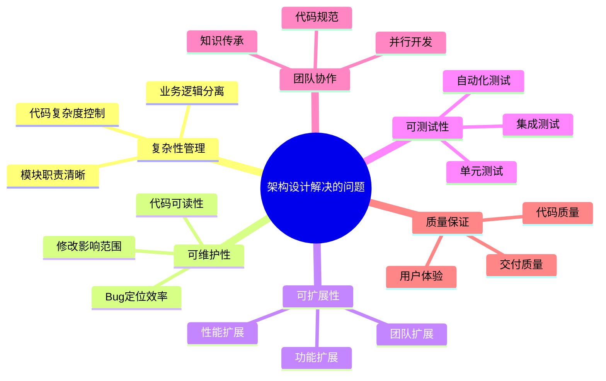

### 1.2 开发遇到问题

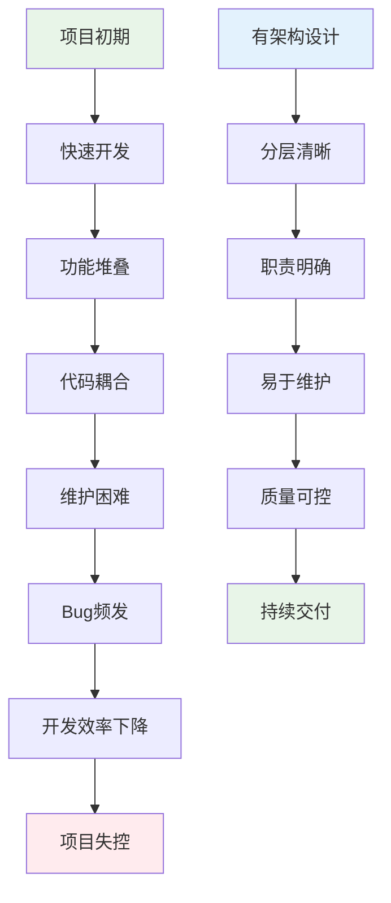

### 1.3 架构设计的价值

| 维度 | 无架构设计 | 有架构设计 | 价值体现 |
|------|------------|------------|----------|
| **开发效率** | 初期快，后期慢 | 初期慢，后期快 | 长期效率提升 |
| **代码质量** | 难以保证 | 质量可控 | 减少技术债务 |
| **团队协作** | 混乱无序 | 规范有序 | 提升协作效率 |
| **维护成本** | 越来越高 | 相对稳定 | 降低维护成本 |
| **扩展能力** | 困难重重 | 相对容易 | 支持业务发展 |

### 1.4 架构的必要性

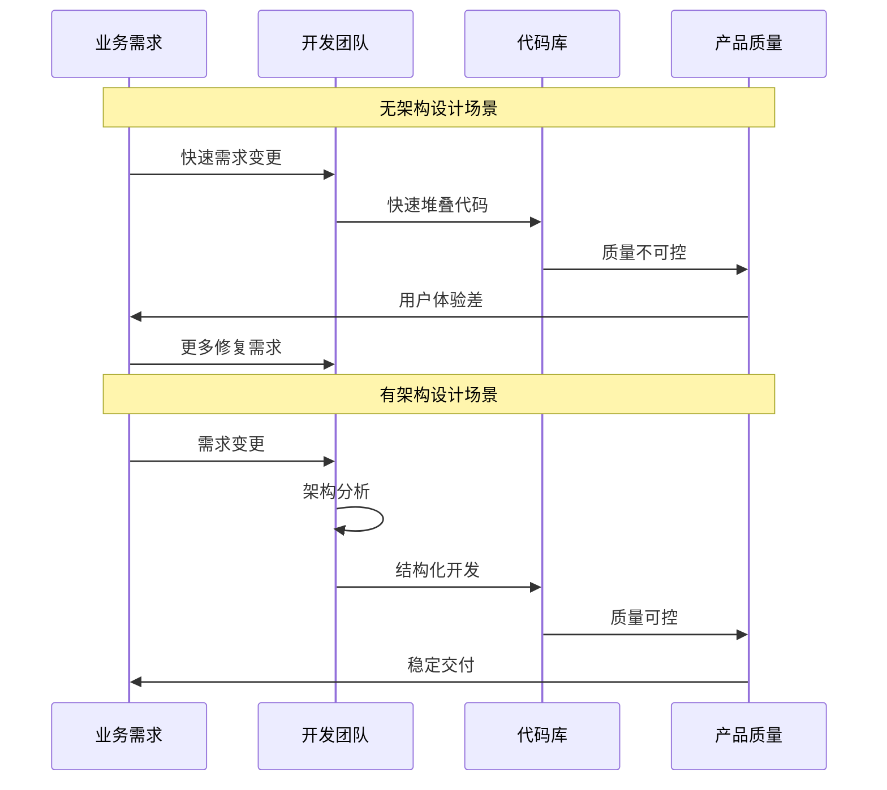

### 1.5 架构设计出发点

思考一下为何要做架构，做架构目的是什么

举个例子，MVP特别流行，MVP的好处就是降低耦合，降低后续维护成本，但事实上，用了MVP后，代码极度膨胀，新增了很多类，代码可读性也差，读代码在一大堆presenter中迷失，想想，这样做维护成本是否真的降低了？

移动端架构 = 业务架构（模块化/组件化） + 技术架构（分层）

提高程序性能和可扩展性，降低后续的维护成本；架构设计的目标是解决当前项目的痛点，如果当前项目没有痛点，那就先别进行架构设计了。

架构设计要以实用为目的，架构设计有一些基本原则

1、合适优于领先。适合自己当前业务的就好，不要总想搞领先的架构；

2、简单优于复杂。架构设计也是一样，越简单的架构越牛逼；

3、演进优于一步到位，架构设计优先解决当下的问题。

这三个原则也是有优先级的，具体是：**合适优于先进 > 演化优于一步到位 > 简单优于复杂**。合适也就是适应当前需要是首位的，连当前需求都满足不了谈不到其他，然后不断演进，最后精简代码。

## 02.架构核心思想

### 2.1 架构基本原则

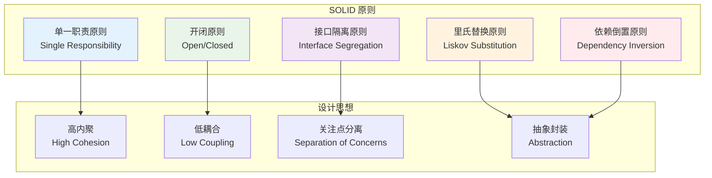

### 2.2 分层思想

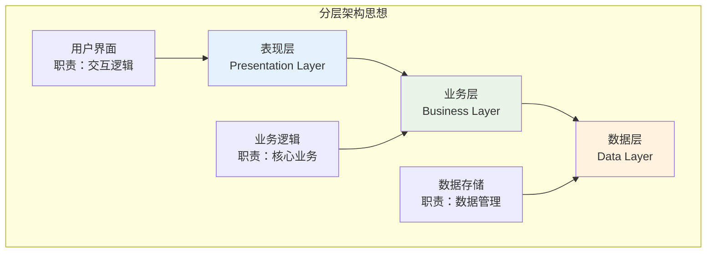

### 2.3 模块化思想

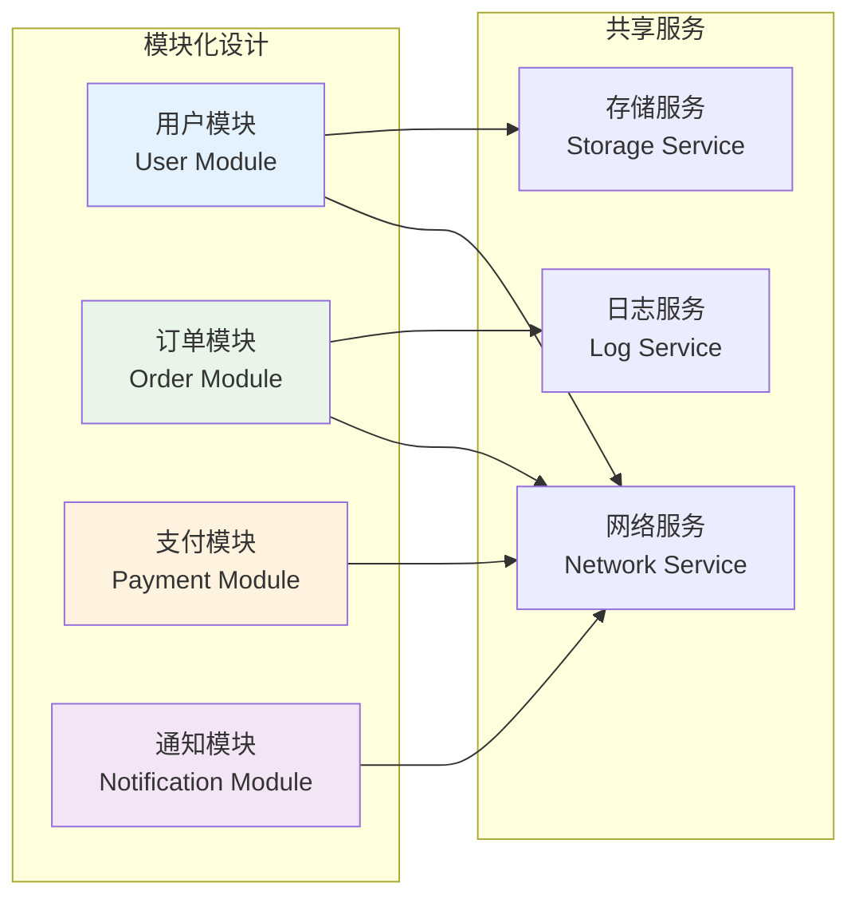

### 2.4 架构思维模型

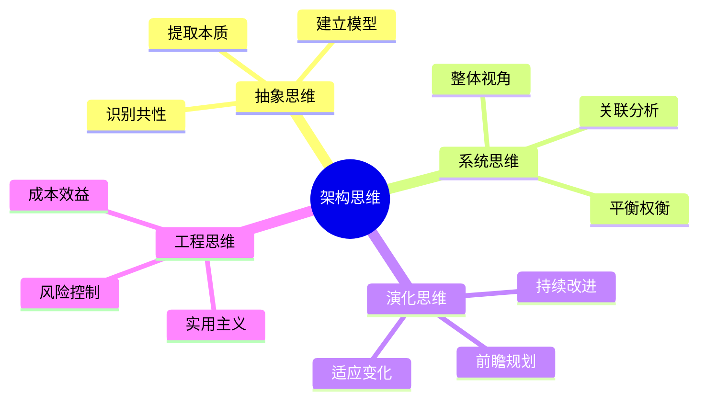

## 03.架构通用能力

### 3.1 通用架构分层模型

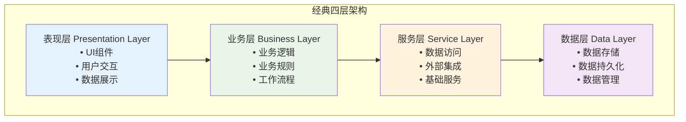

### 3.2 跨平台通用架构

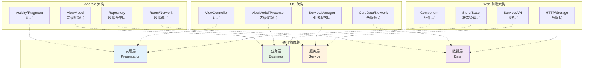

### 3.3 架构分层原则

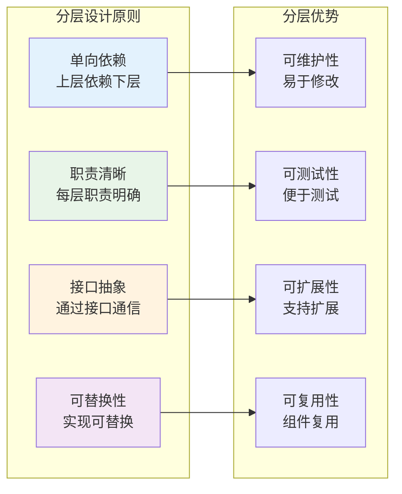

## 04.三种架构模式

### 4.1 架构演变过程

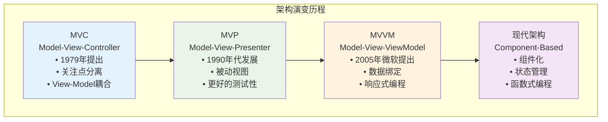

### 4.2 三种架构对比

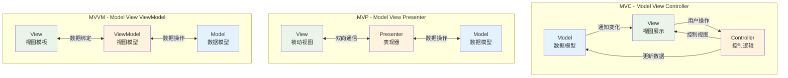

## 05.MVC架构设计

### 5.1 MVC核心概念

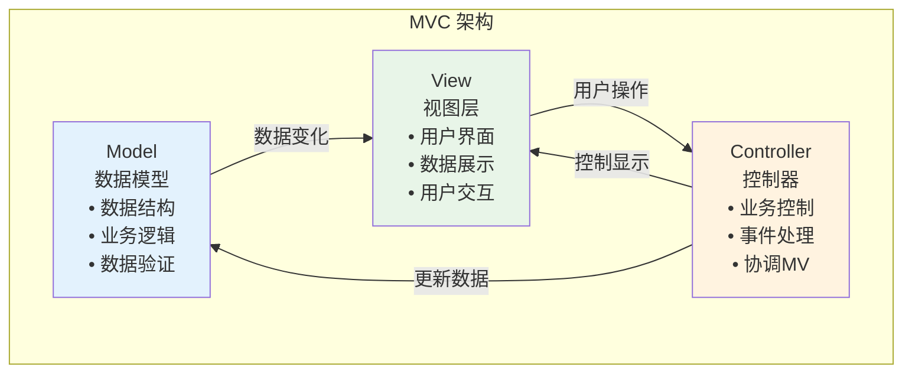

### 5.2 MVC案例代码

**1.xml作为view层，控制能力实在太弱**

你想去动态的改变一个页面的背景，或者动态的隐藏/显示一个按钮，这些都没办法在xml中做，只能把代码写在activity中，造成了activity既是controller层，又是view层的这样一个窘境。

**2.view层和model层是相互可知的**

这意味着两层之间存在耦合，耦合对于一个大型程序来说是非常致命的，因为这表示开发，测试，维护都需要花大量的精力。

**3.Activity并不是一个标准的MVC模式中的Controller**

它的首要职责是加载应用的布局和初始化用户界面，并接受并处理来自用户的操作请求，进而作出响应。随着界面及其逻辑的复杂度不断提升，Activity类的职责不断增加，以致变得庞大臃肿。

所以的逻辑都在activity里面。完美的体现了MVC的两大缺点：View对Model的依赖，会导致View也包含了业务逻辑；Controller会变得很厚很复杂。

### 5.3 通俗理解MVC

当用户触发事件的时候：view层会发送指令到controller层，接着controller去通知model层更新数据，model层更新完数据以后直接显示在view层上，这就是MVC的工作原理。

具体到Android上是怎么样一个情况呢？

1. 大家都知道一个Android工程有什么对吧，有java的class文件，有res文件夹，里面是各种资源，还有类似manifest文件等等。
2. 对于原生的Android项目来说，layout.xml里面的xml文件就对应于MVC的view层，里面都是一些view的布局代码 
3. 各种java中bean，还有一些类似repository类就对应于model层 
4. 至于controller层嘛，当然就是各种activity咯。

大家可以试着套用我上面说的MVC的工作原理是理解。

比如你的界面有一个按钮，按下这个按钮去网络上下载一个文件，这个按钮是view层的，是使用xml来写的，而那些和网络连接相关的代码写在其他类里，比如你可以写一个专门的networkHelper类，这个就是model层，那怎么连接这两层呢？是通过button.setOnClickListener()这个函数，这个函数就写在了activity中，对应于controller层。是不是很清晰。

### 5.4 MVC时序图

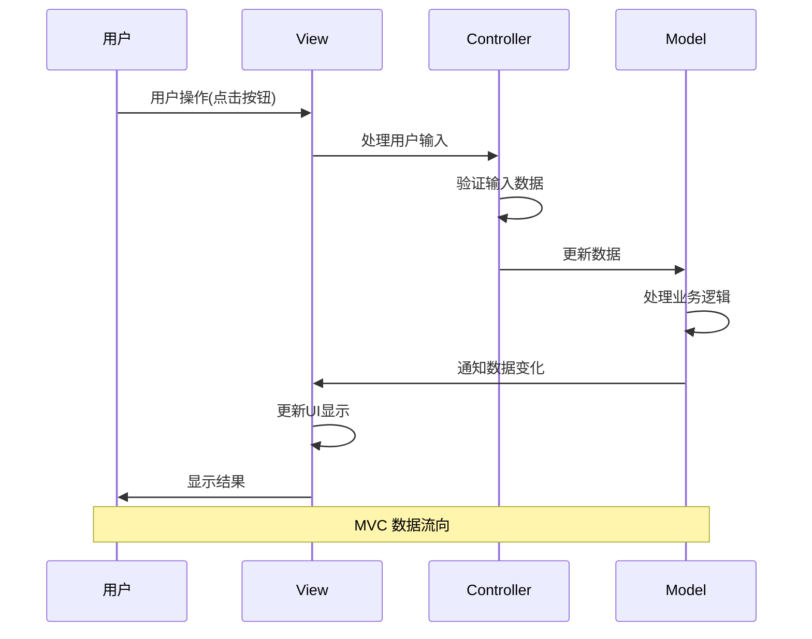

### 5.5 MVC优缺点分析

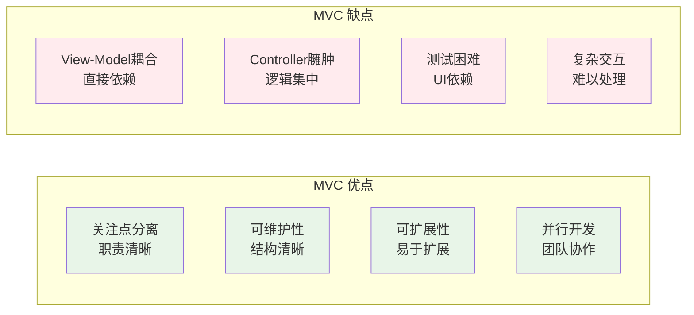

## 06.MVP架构设计

### 6.1 MVP核心概念

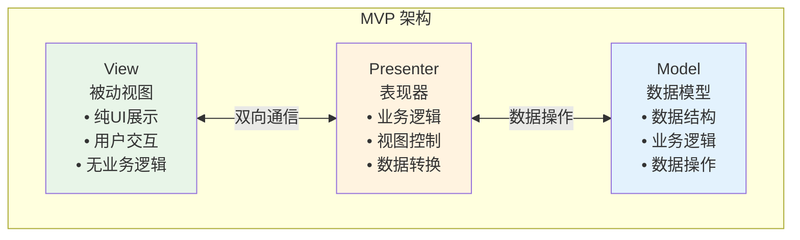

### 6.2 MVP案例代码


### 6.3 MVP时序图

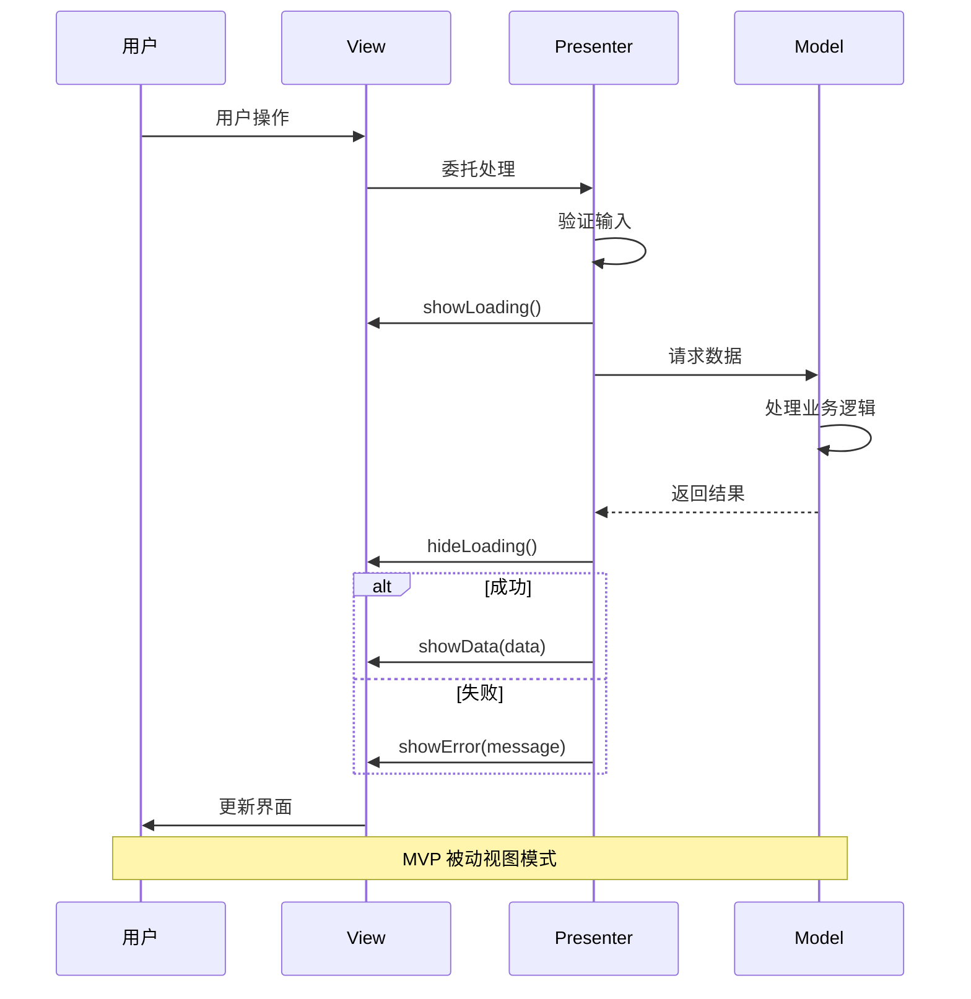

### 6.4 MVP优缺点分析

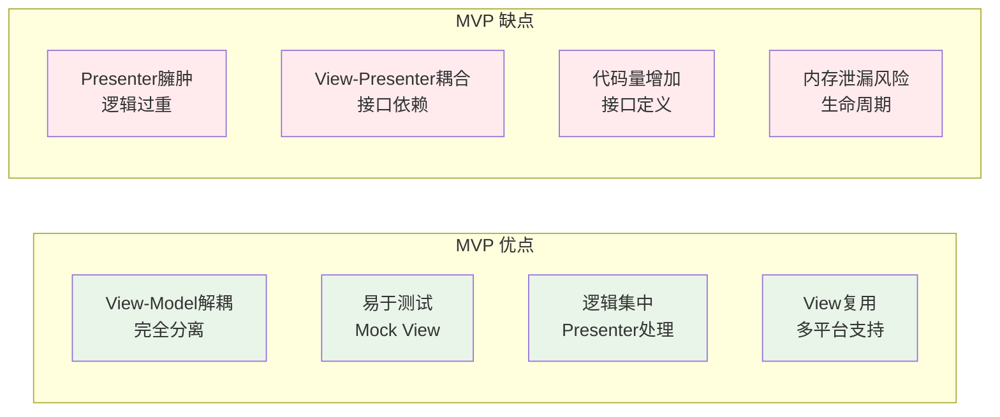

## 07.MVVM架构设计

### 7.1 MVVM核心概念

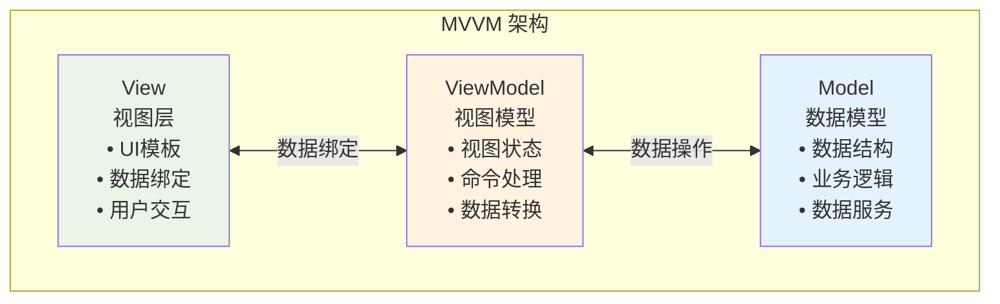

### 7.2 MVVM案例代码


### 7.3 MVVM时序图

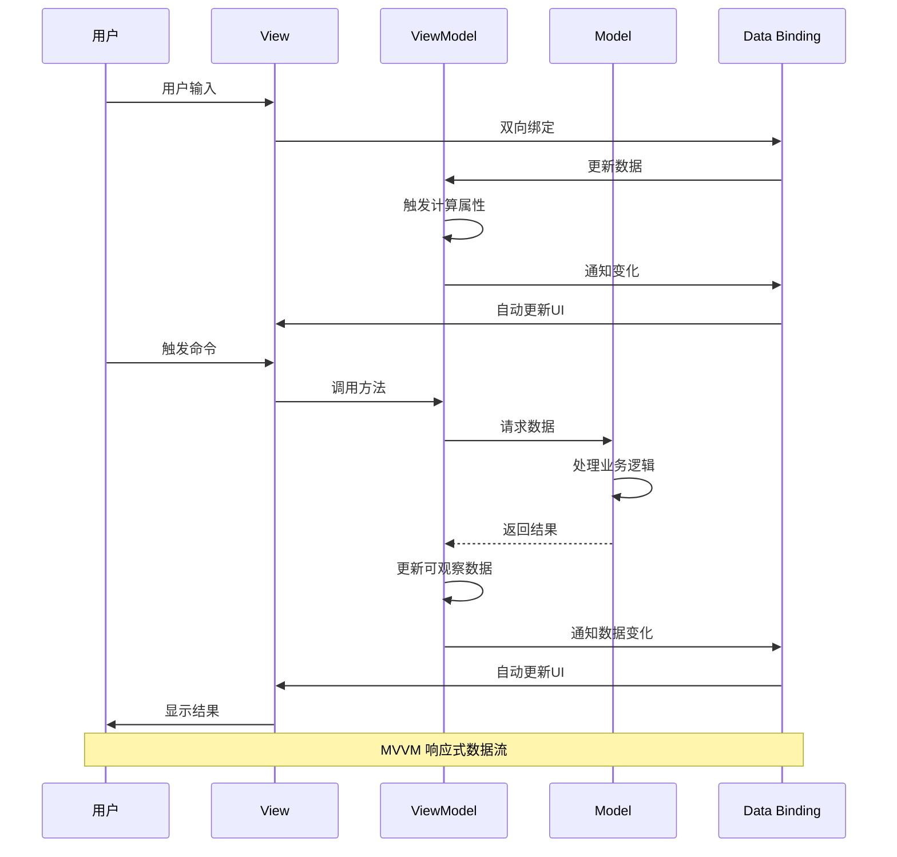

### 7.4 MVVM优缺点分析

```mermaid
graph LR
    subgraph "MVVM 优点"
        A1[数据绑定<br/>自动同步]
        A2[声明式UI<br/>简化开发]
        A3[易于测试<br/>ViewModel独立]
        A4[响应式编程<br/>状态管理]
    end
    
    subgraph "MVVM 缺点"
        B1[学习成本<br/>概念复杂]
        B2[调试困难<br/>绑定隐藏]
        B3[性能开销<br/>监听机制]
        B4[过度绑定<br/>内存泄漏]
    end
    
    style A1 fill:#e8f5e8
    style A2 fill:#e8f5e8
    style A3 fill:#e8f5e8
    style A4 fill:#e8f5e8
    
    style B1 fill:#ffebee
    style B2 fill:#ffebee
    style B3 fill:#ffebee
    style B4 fill:#ffebee
```

## 08.架构最佳实践

### 8.1 设计原则清单

```mermaid
graph LR
    subgraph "设计检查清单"
        A[单一职责<br/>✓ 每个组件职责明确<br/>✓ 避免功能混杂]
        B[开闭原则<br/>✓ 对扩展开放<br/>✓ 对修改封闭]
        C[依赖倒置<br/>✓ 依赖抽象<br/>✓ 不依赖具体实现]
        D[接口隔离<br/>✓ 接口最小化<br/>✓ 避免臃肿接口]
    end
    
    style A fill:#e8f5e8
    style B fill:#e8f5e8
    style C fill:#e8f5e8
    style D fill:#e8f5e8
```


### 8.2 架构演进策略

```mermaid
sequenceDiagram
    participant Current as 当前架构
    participant Analysis as 架构分析
    participant Design as 新架构设计
    participant Migration as 迁移策略
    participant Implementation as 实施
    
    Current->>Analysis: 识别问题
    Analysis->>Analysis: 评估现状
    Analysis->>Design: 设计新架构
    Design->>Migration: 制定迁移计划
    Migration->>Implementation: 渐进式迁移
    Implementation->>Current: 架构升级
    
    Note over Current,Implementation: 持续改进循环
```


### 8.3 常见的陷阱

```mermaid
mindmap
  root((架构设计陷阱))
    过度设计
      过早优化
      复杂抽象
      不必要的层次
    欠缺设计
      没有规划
      临时方案
      技术债务
    技术选型
      盲目跟风
      不考虑场景
      忽视团队能力
    边界不清
      职责混乱
      耦合严重
      难以维护
```

### 8.4 关键考虑因素

```mermaid
graph TB
    subgraph "业务因素"
        B1[业务复杂度<br/>Business Complexity]
        B2[变化频率<br/>Change Frequency]
        B3[扩展需求<br/>Scalability Requirements]
        B4[性能要求<br/>Performance Requirements]
    end
    
    subgraph "技术因素"
        T1[技术栈选择<br/>Technology Stack]
        T2[团队技能<br/>Team Skills]
        T3[开发周期<br/>Development Timeline]
        T4[维护成本<br/>Maintenance Cost]
    end
    
    subgraph "架构决策"
        A[Architecture Decision]
    end
    
    B1 --> A
    B2 --> A
    B3 --> A
    B4 --> A
    T1 --> A
    T2 --> A
    T3 --> A
    T4 --> A
    
    style A fill:#fff3e0
```

## 09.架构设计实践

### 9.1 微前端架构

```mermaid
graph TB
    subgraph "微前端架构"
        Shell[主应用 Shell<br/>• 路由管理<br/>• 应用加载<br/>• 共享资源]
        
        App1[用户管理应用<br/>• 独立开发<br/>• 独立部署<br/>• 技术栈自由]
        
        App2[订单管理应用<br/>• 独立团队<br/>• 独立发布<br/>• 业务解耦]
        
        App3[支付应用<br/>• 安全隔离<br/>• 专业团队<br/>• 高可用]
        
        Shared[共享服务<br/>• 通用组件<br/>• 工具函数<br/>• 样式规范]
    end
    
    Shell --> App1
    Shell --> App2
    Shell --> App3
    App1 --> Shared
    App2 --> Shared
    App3 --> Shared
    
    style Shell fill:#e3f2fd
    style Shared fill:#f3e5f5
```

### 9.2 组件化架构

```mermaid
graph TB
    subgraph "组件化架构层次"
        Page[页面层<br/>Page Components<br/>• 业务页面<br/>• 路由组件<br/>• 页面逻辑]
        
        Business[业务组件层<br/>Business Components<br/>• 业务逻辑<br/>• 数据处理<br/>• 状态管理]
        
        UI[UI组件层<br/>UI Components<br/>• 纯展示组件<br/>• 交互组件<br/>• 样式组件]
        
        Base[基础组件层<br/>Base Components<br/>• 原子组件<br/>• 工具组件<br/>• 第三方封装]
    end
    
    Page --> Business
    Business --> UI
    UI --> Base
    
    style Page fill:#e3f2fd
    style Business fill:#e8f5e8
    style UI fill:#fff3e0
    style Base fill:#f3e5f5
```

### 9.3 状态管理架构

```mermaid
graph LR
    subgraph "状态管理模式"
        Component[组件<br/>Component]
        LocalState[本地状态<br/>Local State]
        GlobalState[全局状态<br/>Global State]
        ServerState[服务端状态<br/>Server State]
        
        Actions[动作<br/>Actions]
        Reducers[处理器<br/>Reducers]
        Effects[副作用<br/>Effects]
        
        Component --> LocalState
        Component --> Actions
        Actions --> Reducers
        Actions --> Effects
        Reducers --> GlobalState
        Effects --> ServerState
        GlobalState --> Component
        ServerState --> Component
    end
    
    style Component fill:#e3f2fd
    style GlobalState fill:#e8f5e8
    style ServerState fill:#fff3e0
```

## 10.总结与建议

### 10.1 架构核心要点

```mermaid
mindmap
  root((架构设计要点))
    业务驱动
      理解业务需求
      识别核心问题
      平衡技术与业务
    渐进演进
      从简单开始
      持续重构
      适应变化
    团队协作
      统一认知
      规范约定
      知识共享
    质量保证
      代码质量
      架构质量
      交付质量
```

### 10.2 架构选择建议

### 10.3 架构发展趋势

```mermaid
timeline
    title 架构设计发展趋势
    
    section 过去
        单体架构 : 简单直接
                : 部署容易
                : 扩展困难
    
    section 现在
        微服务架构 : 服务拆分
                  : 独立部署
                  : 复杂度增加
        
        组件化架构 : 前端组件化
                  : 可复用性
                  : 状态管理
    
    section 未来
        Serverless : 函数计算
                   : 按需付费
                   : 运维简化
        
        边缘计算 : 就近处理
                : 低延迟
                : 分布式架构
```

### 10.4 架构黄金法则

1. **业务优先** - 架构服务于业务，不要为了技术而技术
2. **渐进演进** - 从简单开始，随着业务发展逐步演进
3. **团队匹配** - 架构复杂度要与团队能力匹配
4. **持续改进** - 架构不是一成不变的，要持续优化
5. **文档先行** - 好的架构需要好的文档支撑

### 10.5 架构实施路径

```mermaid
graph LR
    A[需求分析] --> B[架构设计]
    B --> C[技术选型]
    C --> D[原型验证]
    D --> E[团队培训]
    E --> F[分步实施]
    F --> G[持续优化]
    G --> A
    
    style A fill:#e3f2fd
    style D fill:#fff3e0
    style G fill:#e8f5e8
```


