# 组件化项目实践
#### 目录介绍
- [01.为何要做组件化](#01为何要做组件化)
  - [1.1 业务背景介绍](#11-业务背景介绍)
  - [1.2 组件化的价值](#12-组件化的价值)
  - [1.3 组件化概念](#13-组件化概念)
  - [1.4 模块化和组件化](#14-模块化和组件化)
  - [1.5 组件化目标](#15-组件化目标)
- [02.核心解决的问题](#02核心解决的问题)
  - [2.1 核心问题域](#21-核心问题域)
  - [2.2 组件化改造阻力](#22-组件化改造阻力)
  - [2.3 问题解决架构图](#23-问题解决架构图)
- [03.项目演进过程](#03项目演进过程)
  - [3.1 演进路径](#31-演进路径)
  - [3.2 演进架构对比](#32-演进架构对比)
  - [3.3 渐进式迁移流程](#33-渐进式迁移流程)
- [04.考虑关键问题](#04考虑关键问题)
  - [4.1 代码解耦原则](#41-代码解耦原则)
  - [4.2 解耦架构图](#42-解耦架构图)
  - [4.3 组件间通信对比](#43-组件间通信对比)
  - [4.4 通信架构设计](#44-通信架构设计)
  - [4.5 组件生命周期](#45-组件生命周期)
- [05.组件化架构设计](#05组件化架构设计)
  - [5.1 整体架构设计](#51-整体架构设计)
  - [5.2 组件分层策略](#52-组件分层策略)
  - [5.3 组件依赖关系](#53-组件依赖关系)
  - [5.4 组件拆分策略](#54-组件拆分策略)
- [06.组件化交互设计](#06组件化交互设计)
  - [6.1 看交互案例](#61-看交互案例)
  - [6.2 通信架构总览](#62-通信架构总览)
  - [6.3 通信方式详解](#63-通信方式详解)
  - [6.4 数据共享机制](#64-数据共享机制) 
- [07.组件化避坑指南](#07组件化避坑指南)
  - [7.1 问题分类](#71-问题分类)
  - [7.2 问题解决矩阵](#72-问题解决矩阵)
  - [7.3 最佳实践](#73-最佳实践)
  - [7.4 质量保障](#74-质量保障)
  - [7.5 监控体系设计](#75-监控体系设计)
  - [7.6 迁移路线图](#76-迁移路线图)


## 01.为何要做组件化

### 1.1 业务背景介绍

随着移动应用和Web应用的快速发展，项目规模不断扩大，传统的单体应用架构面临诸多挑战：

- **代码规模膨胀**：单个项目代码量动辄几十万行，维护困难
- **团队协作复杂**：多团队并行开发时，代码冲突频繁
- **编译时间过长**：全量编译耗时严重影响开发效率
- **技术债务累积**：模块间耦合严重，重构成本高
- **复用性差**：相似功能在不同项目中重复开发
- **维护代码成本**：稍微一改动可能就牵一发而动全身，改个小的功能点就需要回归测试

### 1.2 组件化的价值

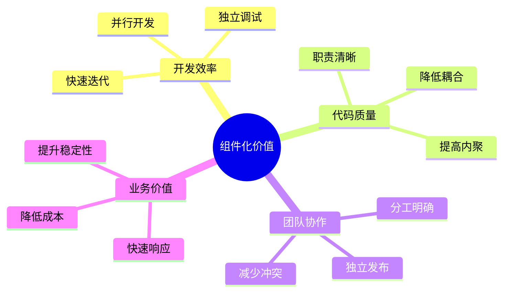

### 1.3 组件化概念

什么是组件化呢？组件化是基于组件可重用的目的上，将一个大的软件系统按照分离关注点的形式，拆分成多个独立的组件，做到更少的耦合和更高的内聚。

### 1.4 模块化和组件化

简单来说，组件化相比模块化粒度更小，两者的本质思想都是一致的，都是把大往小的方向拆分，都是为了复用和解耦，只不过模块化更加侧重于业务功能的划分，偏向于复用，组件化更加侧重于单一功能的内聚，偏向于解耦。

### 1.5 组件化目标

对组件化层次划分：需要结构清晰，拆分粒度符合设计规范。方便迁移，按需加载。针对业务庞大，每个人员可以负责自己独立的业务组件……

可以做到技术沉淀：比如针对功能组件，服务组件，还有基础组件，可以沉淀出来做成中台公共库。方便维护，在多个APP中可以复用组件。

## 02.核心解决的问题

### 2.1 核心问题域

| 问题类别 | 具体问题 | 组件化解决方案 |
|---------|---------|---------------|
| **开发效率** | 编译时间长、调试困难 | 独立编译、独立调试 |
| **代码质量** | 耦合严重、职责不清 | 明确边界、单一职责 |
| **团队协作** | 代码冲突、并行困难 | 独立仓库、独立发布 |
| **业务复用** | 重复开发、维护成本高 | 组件复用、统一维护 |
| **技术演进** | 技术栈升级困难 | 渐进式升级、技术隔离 |

### 2.2 组件化改造阻力

**商业化项目稳定性保证**：商业化项目，很强调稳定性。有些项目做了很多年，不敢轻易改动，害怕组件化改造会带来不可估量的影响和线上bug。

**不同层人看待技术角度不同**：公司领导层和一线程序员存在对技术不同想法。开发想着如何用一些新技术去改造项目提升自己技术能力；领导想着技术是偏下游，确保稳定性，如何提升业务收益。

**改造收益比较难衡量**：改造项目对程序员来说，提高了架构设计能力，能够有一些技术上沉淀。但是对于公司，考虑好具体的收益再做改造决定吧，

### 2.3 问题解决架构图

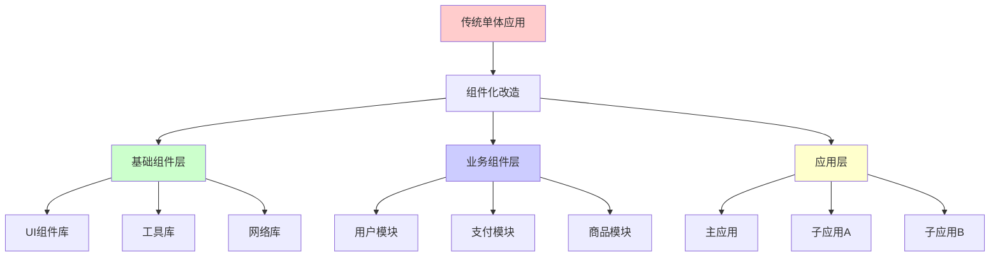

## 03.项目演进过程

### 3.1 演进路径

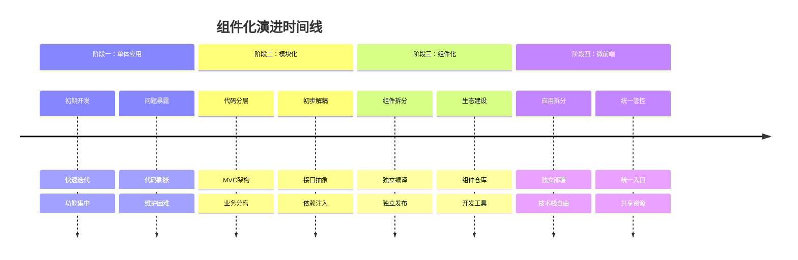

### 3.2 演进架构对比

#### 单体应用

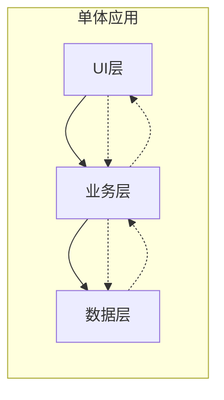

#### 模块化应用

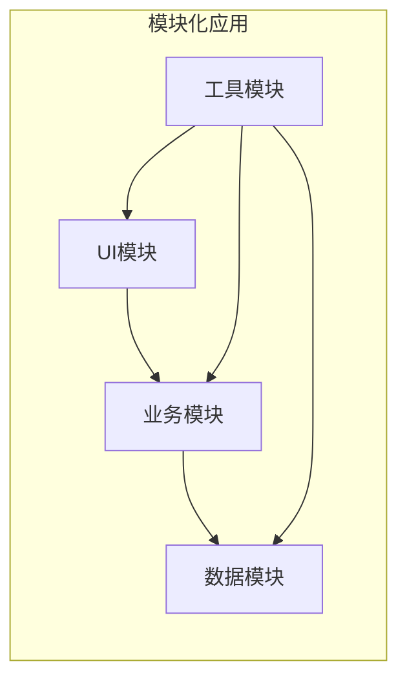

#### 组件化应用

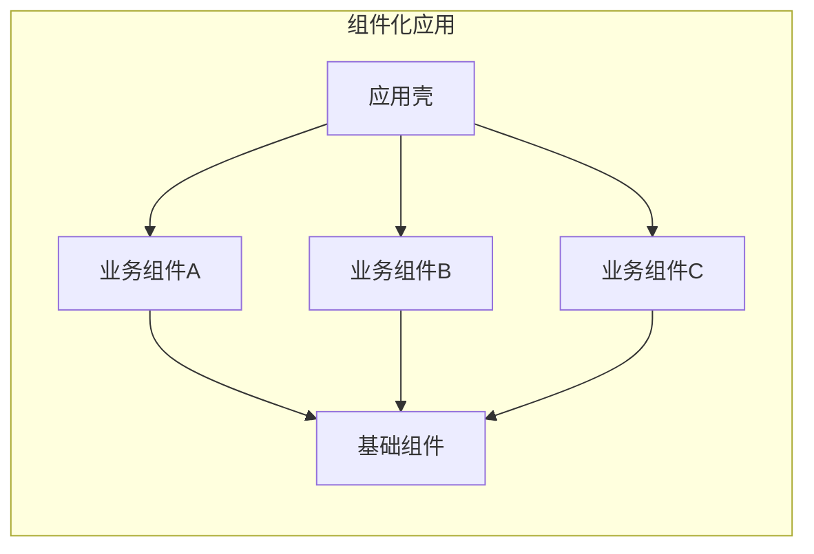

### 3.3 渐进式迁移流程

## 04.考虑关键问题

考虑的问题：分而治之，并行开发，一切皆组件。要实现组件化，无论采用什么样的技术方式，需要考虑以下方面问题：

- 代码解耦：对已存在的项目进行模块拆分，模块分为两种类型，一种是作为依赖库对外提供；另一种是业务组件模块，专门处理业务逻辑等功能，这些业务组件模块最终负责组装项目。
- 组件间通信：页面跳转可以使用路由；业务组件业务调用可以采用SPI或者接口反射
- 组件生命周期：组件是否可以做到按需、动态使用、因此就会涉及到组件加载、卸载等管理问题。
- 集成调试：在开发阶段如何做到按需编译组件？一次调试中可能有一两个组件参与集成，这样编译时间就会大大降低，提高开发效率。
- 告别结构臃肿：让各个业务变得相对独立，业务组件在组件模式下可以独立开发，而在集成模式下又可以变为AAR包集成到“APP壳工程”中，组成一个完整功能的 APP。

### 4.1 代码解耦原则

- **单一职责原则**：每个组件只负责一个特定功能
- **依赖倒置原则**：依赖抽象而非具体实现
- **接口隔离原则**：接口应该小而专一
- **开闭原则**：对扩展开放，对修改关闭

### 4.2 解耦架构图

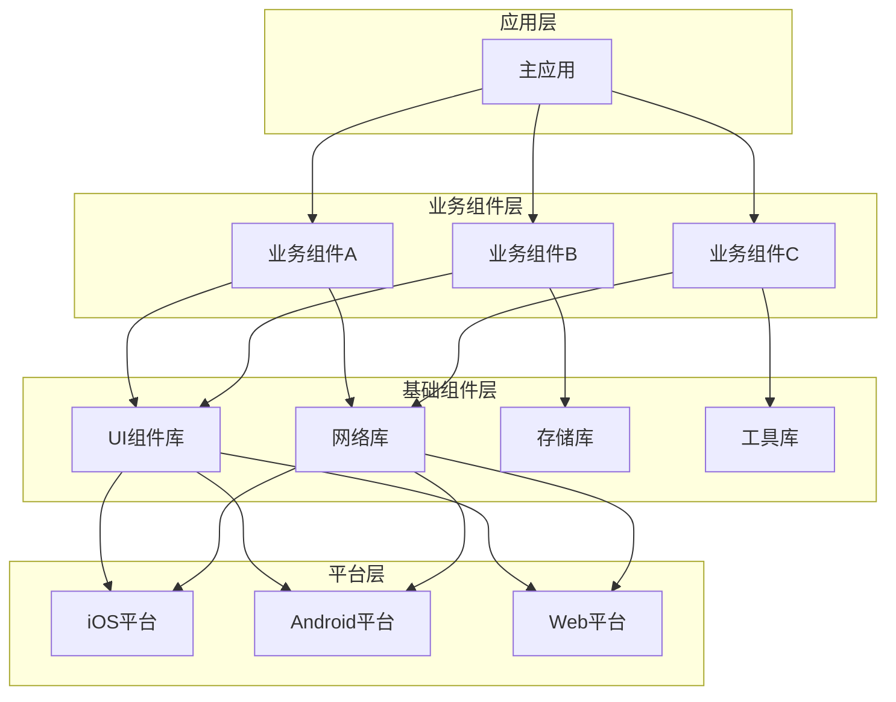

### 4.3 组件间通信对比

| 通信方式 | 适用场景 | 优点 | 缺点 |
|---------|---------|------|------|
| **直接调用** | 同步操作、强依赖 | 简单直接、性能好 | 耦合度高 |
| **事件总线** | 异步通知、松耦合 | 解耦彻底、扩展性好 | 调试困难、性能开销 |
| **依赖注入** | 接口调用、可测试 | 可测试性强、灵活 | 配置复杂 |
| **消息队列** | 异步处理、高并发 | 可靠性高、可扩展 | 复杂度高、延迟 |

### 4.4 通信架构设计

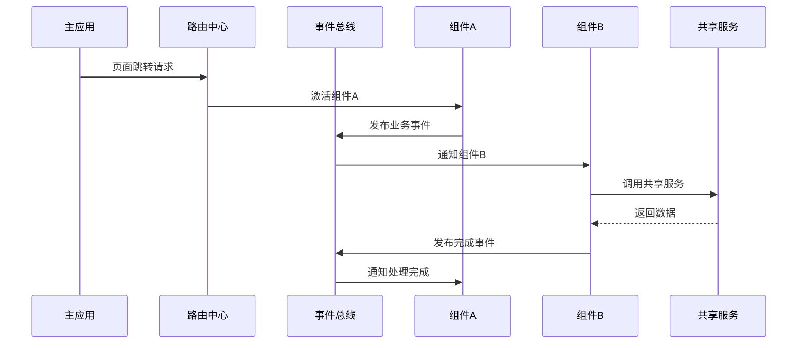

### 4.5 组件生命周期

> 生命周期管理

```typescript
interface ComponentLifecycle {
  // 组件加载
  onLoad(): Promise<void>;
  // 组件初始化
  onInit(): Promise<void>;
  // 组件激活
  onActive(): void;
  // 组件暂停
  onInactive(): void;
  // 组件销毁
  onDestroy(): void;
  // 错误处理
  onError(error: Error): void;
}
```

## 05.组件化架构设计

### 5.1 整体架构设计

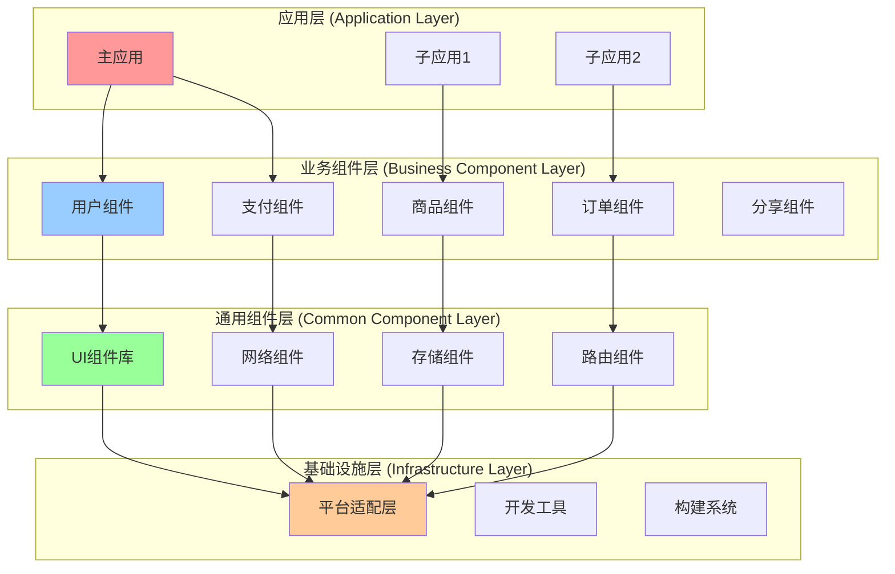

这样拆分的目的：架构分层将模块化带来的网状依赖结构改造成树状依赖结构(上层依赖下层)，降低了依赖的复杂度，保障各层之间的依赖不劣化。

### 5.2 组件分层策略

分层架构，技术人员定义了每一层组件的依赖规范。

| 层级 | 职责 | 特点 | 示例              |
|------|------|------|-----------------|
| **应用层** | 业务流程编排、页面组装 | 薄层、组合性 | 主应用、微应用         |
| **业务组件层** | 具体业务逻辑实现 | 领域相关、可复用 | 用户模块、支付模块、登陆模块、视频模块 |
| **通用组件层** | 跨业务的通用能力 | 业务无关、高复用 | UI库、网络库、相机采集库   |
| **基础设施层** | 平台能力、开发工具 | 平台相关、稳定 | 构建工具、平台适配、各种工具  |

主要是以防止不合理的循环依赖，保证整体依赖不劣化。在分层依赖规范中，高层可以依赖低层、实现可以依赖接口，接口层没有依赖，且优先以前向声明为主。

### 5.3 组件依赖关系

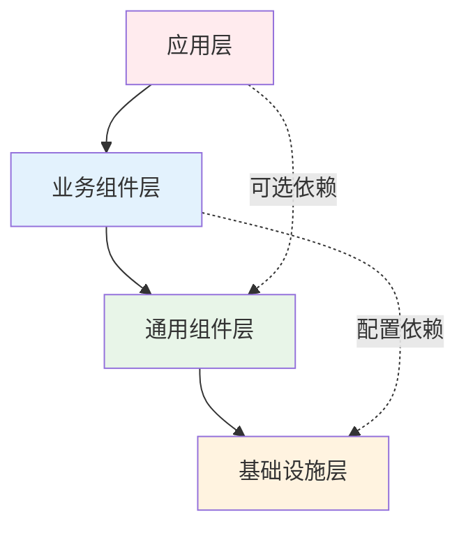


### 5.4 组件拆分策略

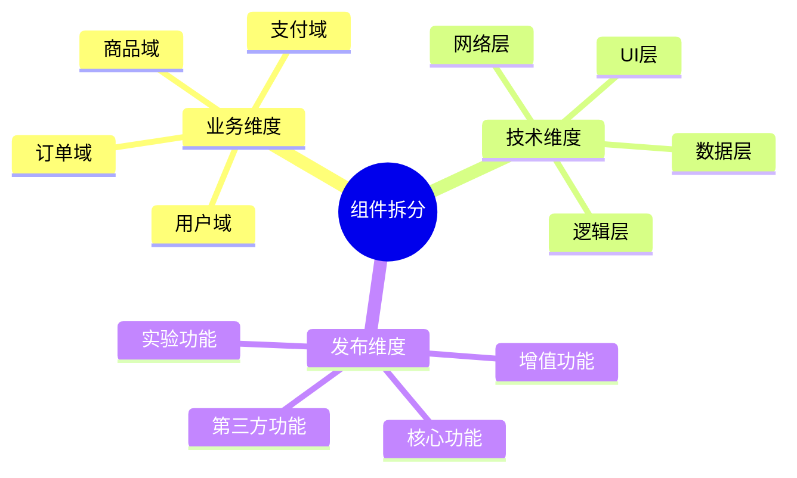

拆分决策树

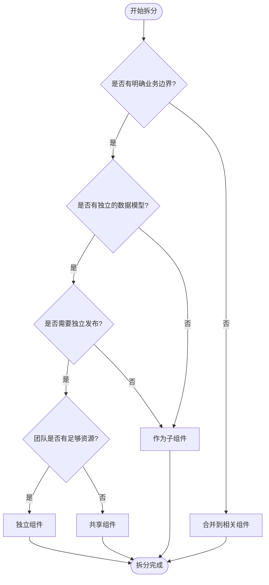

## 06.组件化交互设计

### 6.1 看交互案例

不同模块业务调用场景【针对平级组件而言】

A 首页模块，B 设备模块需要调用 C 个人中心模块某一个功能(比如选择用户功能)；C 模块又要调用A 模块中版本更新业务

有哪些方式可以实现业务通信

- 方案1：A 模块直接依赖 C 模块，然后直接调用即可，这样不友好，破坏了组件的隔离。
- 方案2：接口 + 实现类 + 反射。在A，B，C都依赖的接口层定义接口，在各自自己模块写实现类，利用反射的方式调用。注意避免反射混淆了类名！
- 方案3：SPI(还是通过接口依赖方式去通信)，其实实质还是反射，用起来非常顺手。

### 6.2 通信架构总览

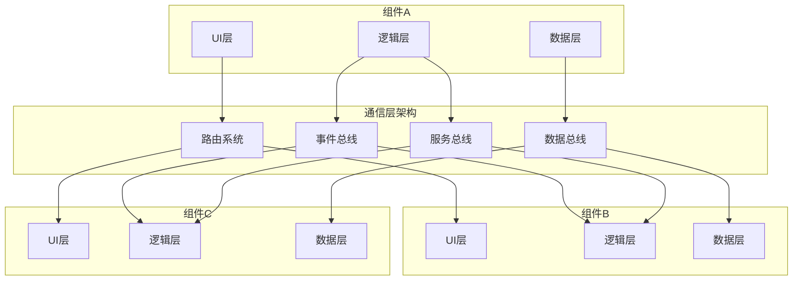


### 6.3 通信方式详解


#### 路由通信

```typescript
// 路由配置
interface RouteConfig {
  path: string;
  component: string;
  params?: Record<string, any>;
  meta?: Record<string, any>;
}

// 路由跳转
class Router {
  navigate(path: string, params?: any): Promise<void>;
  replace(path: string, params?: any): Promise<void>;
  goBack(): void;
  getCurrentRoute(): RouteConfig;
}
```

#### 事件通信时序图

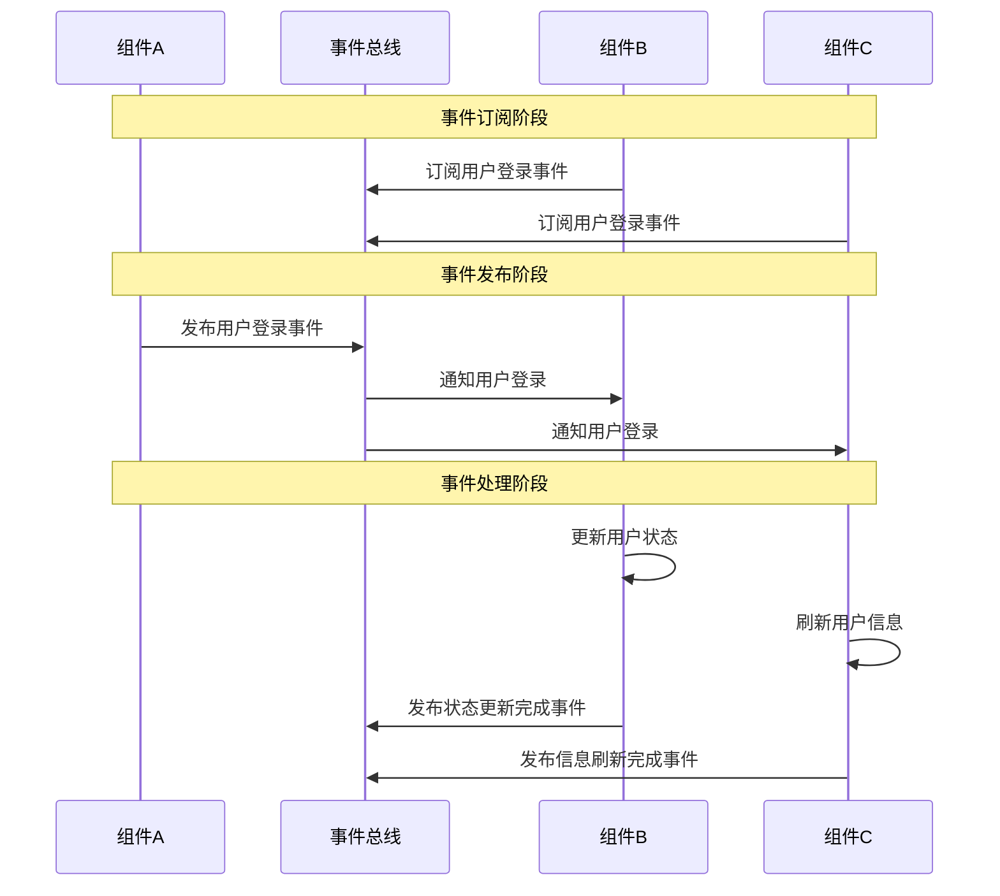

#### 服务通信

```typescript
// 服务接口定义
interface UserService {
  getUserInfo(userId: string): Promise<UserInfo>;
  updateUserInfo(userInfo: UserInfo): Promise<void>;
  logout(): Promise<void>;
}

// 服务注册与发现
class ServiceRegistry {
  register<T>(name: string, service: T): void;
  resolve<T>(name: string): T;
  unregister(name: string): void;
}
```


### 6.4 数据共享机制

## 07.组件化避坑指南

### 7.1 问题分类

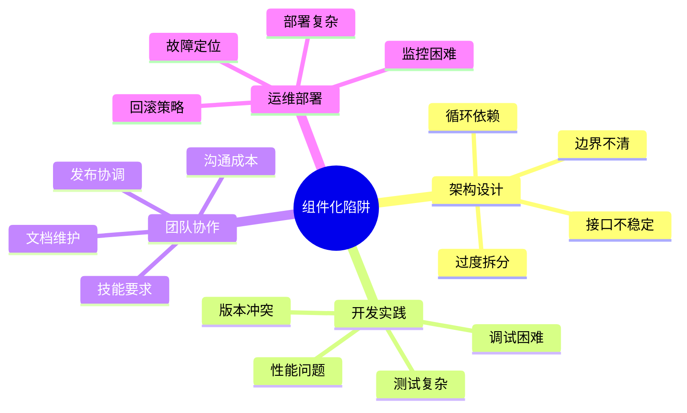

### 7.2 问题解决矩阵

| 问题类型 | 具体问题 | 解决方案 | 预防措施 |
|---------|---------|---------|---------|
| **过度拆分** | 组件粒度过细 | 合并相关组件 | 制定拆分标准 |
| **循环依赖** | 组件间相互依赖 | 引入中间层 | 依赖关系检查 |
| **版本冲突** | 依赖版本不一致 | 统一版本管理 | 版本锁定机制 |
| **性能问题** | 加载时间过长 | 懒加载、预加载 | 性能监控 |
| **调试困难** | 跨组件调试复杂 | 统一调试工具 | 日志标准化 |

### 7.3 最佳实践
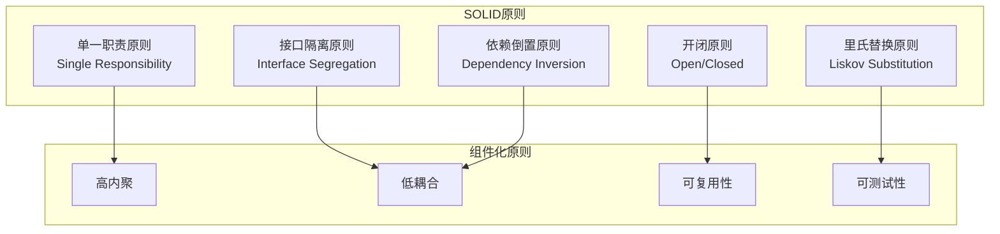

### 7.5 监控体系设计

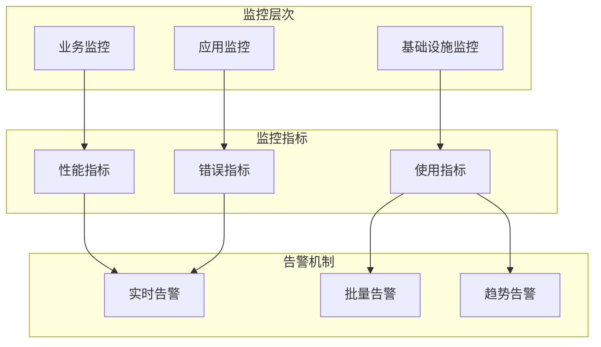

### 7.6 迁移路线图

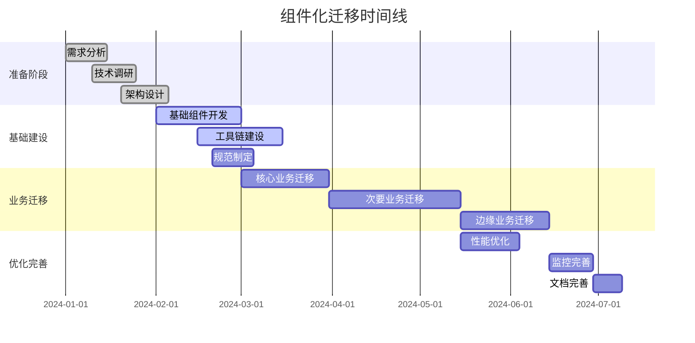


