# 缓存设计技术思想
#### 目录介绍
- [1.缓存核心思想](#1缓存核心思想)
  - [1.1 缓存基本概念](#11-缓存基本概念)
  - [1.2 缓存方案思考](#12-缓存方案思考)
  - [1.3 不同端的应用](#13-不同端的应用)
  - [1.4 缓存性能原理](#14-缓存性能原理)
- [2.缓存类型分类](#2缓存类型分类)
  - [2.1 存储介质分类](#21-存储介质分类)
  - [2.2 常见存储方案](#22-常见存储方案)
  - [2.3 多级缓存架构](#23-多级缓存架构)
  - [2.4 访问模式分类](#24-访问模式分类)
  - [2.5 部署方式分类](#25-部署方式分类)
- [3.缓存使用场景](#3缓存使用场景)
  - [3.1 主要解决问题](#31-主要解决问题)
  - [3.2 Web缓存场景](#32-web缓存场景)
  - [3.3 移动应用场景](#33-移动应用场景)
  - [3.4 后端服务缓存](#34-后端服务缓存)
- [4.缓存设计思想](#4缓存设计思想)
  - [4.1 通用缓存思路](#41-通用缓存思路)
  - [4.2 缓存策略设计](#42-缓存策略设计)
  - [4.3 缓存容量设计](#43-缓存容量设计)
  - [4.4 缓存失效策略](#44-缓存失效策略)
  - [4.5 缓存淘汰算法](#45-缓存淘汰算法)
  - [4.6 缓存阀值处理](#46-缓存阀值处理)
  - [4.7 缓存设计原则](#47-缓存设计原则)
- [5.K-V框架设计](#5k-v框架设计)
  - [5.1 K-V框架背景](#51-k-v框架背景)
  - [5.2 K-V框架设计](#52-k-v框架设计)
  - [5.3 兼容不同缓存](#53-兼容不同缓存)
- 6.常见缓存库解读
  - 6.1 SqlLite
  - 6.2 LruCache
  - 6.3 MMKV
  - 6.4 mmap原理
- [6.LRU缓存原理](#6lru缓存原理)
  - [6.1 LRU算法思想](#61-lru算法思想)
  - [6.2 LRU数据结构设计](#62-lru数据结构设计)
  - [6.3 LRU操作流程](#63-lru操作流程)
  - [6.4 LRU实现代码](#64-lru实现代码)
  - [6.5 LFU算法设计](#65-lfu算法设计)
- [7.通用缓存策略](#7通用缓存策略)
  - [7.1 过期策略分类](#71-过期策略分类)
  - [7.2 TTL设计模式](#72-ttl设计模式)
  - [7.3 淘汰策略对比](#73-淘汰策略对比)
  - [7.4 分层架构设计](#74-分层架构设计)
  - [7.5 分层缓存数据流](#75-分层缓存数据流)


## 01.缓存核心思想

> 缓存（Cache）是计算机系统中最古老也是最有效的性能优化手段之一。从CPU硬件层面的L1/L2/L3缓存，到操作系统的页缓存，再到应用层的Redis、Memcached，乃至浏览器的HTTP缓存，缓存思想几乎贯穿了整个计算机体系结构。本章节将从最基础的概念出发，逐步展开缓存的核心思想，帮助读者建立对缓存技术的整体认知。

### 1.1 缓存基本概念

缓存是一种用空间换时间的技术，通过将频繁访问的数据存储在访问速度更快的存储介质中，减少计算或IO开销，从而显著提高系统性能。

从更深层次来看，缓存的存在依赖于两个基本前提：**数据访问速度的层级差异** 和 **数据访问的局部性原理**。前者意味着不同存储介质的访问速度差距巨大（例如内存比硬盘快约10万倍），这才让"用快的存储替代慢的存储"具备可行性；后者意味着程序对数据的访问并非完全随机，而是存在明显的"热点"特征，少数数据被频繁访问，这才让"缓存少量数据就能加速大量请求"成为现实。这两个前提共同构成了缓存能够生效的理论基础。

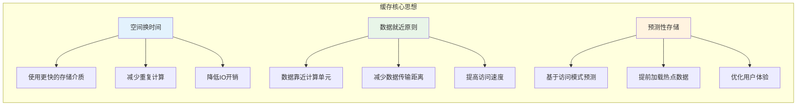

### 1.2 缓存方案思考

在深入研究任何一种缓存方案之前，最有价值的事情不是急着学API，而是带着一组本质问题去考察它。下面这几个问题，几乎可以作为评估任何缓存方案的"试金石"，也能帮助我们在选型时不被表象迷惑。

- 问题1：各种缓存方案，分别是如何保证数据安全的，其内部使用到了哪些锁？由于引入锁，给效率上带来了什么影响？
- 问题2：各种缓存方案，进程不安全是否会导致数据丢失，如何处理数据丢失情况？如何处理脏数据，其原理大概是什么？
- 问题3：各种缓存方案使用场景是什么？有什么缺陷，为了解决缺陷做了些什么？比如sp存在缺陷的替代方案是DataStore，为何这样？
- 问题4：各种缓存方案，他们的缓存效率是怎样的？如何对比？接入该库后，如何做数据迁移，如何覆盖操作？

带着这些问题去阅读源码或对比方案，你会发现每一个看似简单的"K-V存储"，其背后都隐藏着大量精妙的设计权衡。例如SharedPreferences为何在 commit 时会引入 ANR、MMKV为何选择 mmap 而不是普通文件IO、DataStore为何强制使用协程异步API——这些设计决策的背后，正是上述问题的具体回答。

### 1.3 不同端的应用

缓存并不局限于某一个技术栈或某一类系统，而是在前端、后端、移动端、基础设施层都广泛存在。理解"缓存在不同端的差异化形态"，能够帮助我们在跨端协作的项目中（例如全栈应用、移动端+服务端配合的产品）做出更全局的优化决策。下面通过一张图，俯瞰各端的缓存类型：

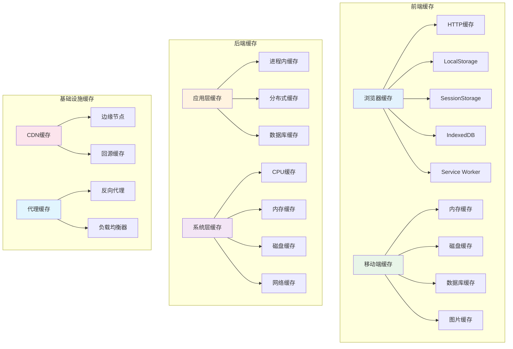

### 1.4 缓存性能原理

缓存之所以能够大幅提升性能，本质源于不同存储介质之间惊人的速度差异。下面这张图展示了从CPU寄存器到网络访问的完整速度梯度——理解这个梯度，是理解缓存价值的关键起点。

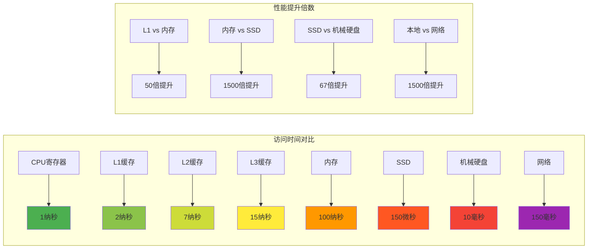

从图中可以看到，相邻两个层级之间的速度差距并非线性增长，而是数量级的跃迁：内存比SSD快约1500倍，SSD又比机械硬盘快约67倍。这种"金字塔型"的速度结构，决定了缓存设计的两条核心原则——**尽量让请求落在更上层的存储**，以及**当上层容量不足时，让最有价值的数据驻留在上层**。后续章节中讨论的LRU、LFU等淘汰算法，本质上都是在回答"哪些数据值得驻留在更快的存储里"这一问题。

## 02.缓存类型分类

> 在系统设计中，理解"有哪些类型的缓存"是做好选型的前提。缓存可以从多个维度进行分类——存储介质、访问模式、部署方式、数据生命周期等等。每一种分类视角都对应着一种不同的应用场景。本章节将从最直观的"存储介质"维度切入，逐步扩展到访问模式、部署架构等更高层的分类。

### 2.1 存储介质分类

比较常见的是内存缓存以及磁盘缓存。1.内存缓存，这里的内存主要指的存储器缓存；2.磁盘缓存，这里主要指的是外部存储器，手机的话指的就是存储卡。

内存缓存：通过预先消耗应用的一点内存来存储数据，便可快速的为应用中的组件提供数据，是一种典型的以空间换时间的策略。

磁盘缓存：读取磁盘文件要比直接从内存缓存中读取要慢一些，而且需要在一个UI主线程外的线程中进行，因为磁盘的读取速度是不能够保证的，磁盘文件缓存显然也是一种以空间换时间的策略。

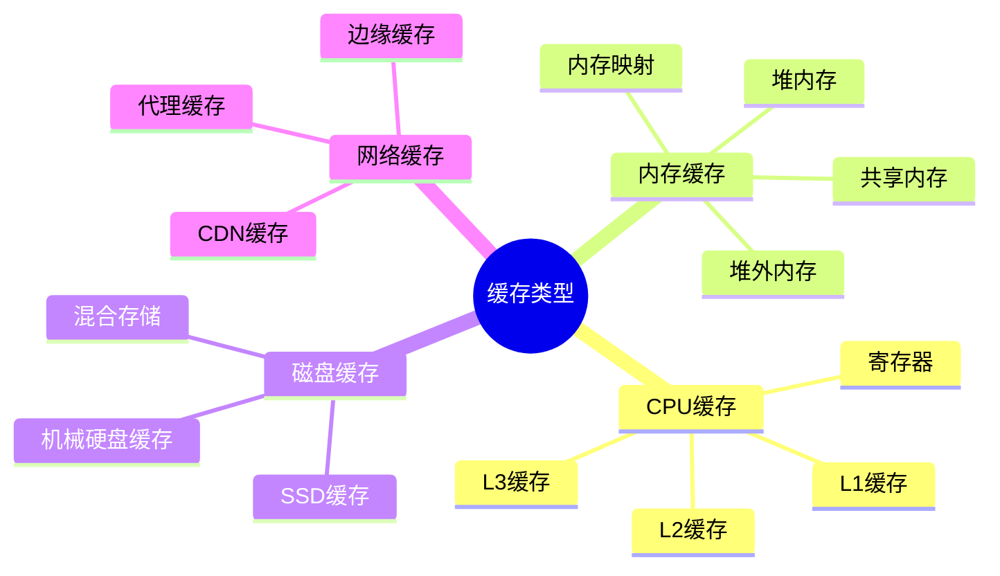

### 2.2 常见存储方案

内存缓存：存储在内存中，如果对象销毁则内存也会跟随销毁。如果是静态对象，那么进程杀死后内存会销毁。

- Map：内存缓存，一般用HashMap存储一些数据，主要存储一些临时的对象
- LruCache：内存淘汰缓存，内部使用LinkedHashMap，会淘汰最长时间未使用的对象

磁盘缓存：后台应用有可能会被杀死，那么相应的内存缓存对象也会被销毁。当你的应用重新回到前台显示时，你需要用到缓存数据时，这个时候可以用磁盘缓存。

- SharedPreferences：轻量级磁盘存储，一般存储配置属性，线程安全。建议不要存储大数据，不支持跨进程！
- MMKV：腾讯开源存储库，内部采用mmap。
- DiskLruCache：磁盘淘汰缓存，写入数据到file文件
- SqlLite：移动端轻量级数据库。主要是用来对象持久化存储。
- DataStore：旨在替代原有的 SharedPreferences，支持SharedPreferences数据的迁移
- Room/Realm/GreenDao：支持大型或复杂数据集


### 2.3 多级缓存架构

单一层级的缓存往往难以同时满足"快"和"大"两个相互矛盾的需求——内存够快但容量小，磁盘容量大但速度慢。多级缓存架构正是为了解决这一矛盾而生：通过将多种存储介质组合起来，让数据按"热度"分布在不同层级，越热的数据越靠近CPU，越冷的数据越靠近持久化存储。这种思想在硬件、操作系统、数据库、应用层都有体现，是工程设计中"分而治之"思想的典范。

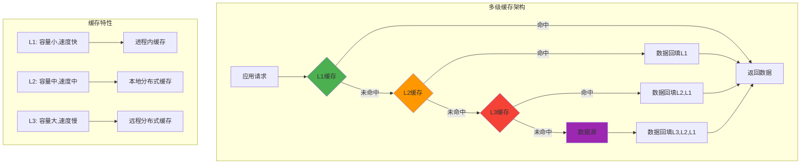

### 2.4 访问模式分类

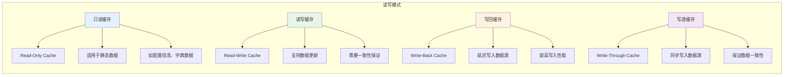

### 2.5 部署方式分类

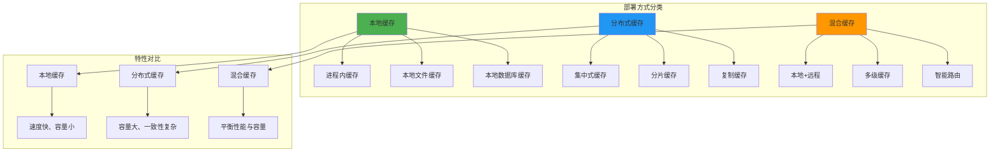

## 3.缓存使用场景

### 3.1 主要解决问题

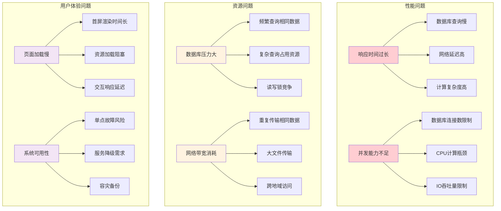

### 3.2 Web缓存场景

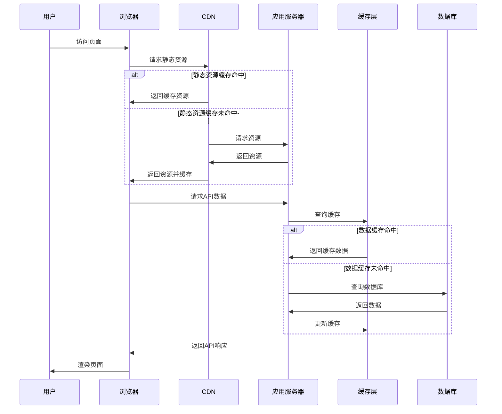

### 3.3 移动应用场景

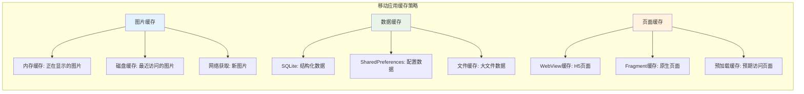

### 3.4 后端服务缓存

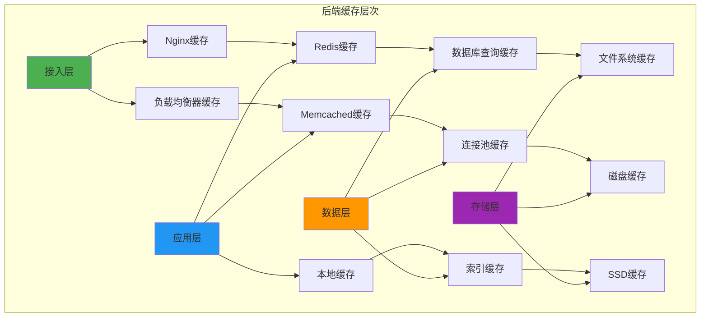

## 4.缓存设计思想

### 4.1 通用缓存思路

> 通用缓存的设计思路主要包括以下几个方面

1. 缓存策略选择：选择适当的缓存策略是通用缓存设计的重要一步。常见的缓存策略包括最近最少使用（LRU）、最近最久未使用（LRU-K）、先进先出（FIFO）等。根据具体应用场景和需求，选择合适的缓存策略来平衡缓存的命中率和缓存空间的利用效率。
2. 缓存容量管理：通用缓存需要考虑缓存容量的管理，以避免缓存溢出或过度占用内存。可以设置缓存容量上限，并采用合适的替换策略来管理缓存中的数据，以保持缓存的有效性。
3. 数据一致性：在多线程或分布式环境下，通用缓存需要考虑数据一致性的问题。合理的缓存设计应该保证数据在缓存中的一致性，避免脏数据或数据不一致的情况发生。可以采用锁机制、缓存失效策略或一致性协议等方法来实现数据一致性。
4. 缓存预热：为了提高缓存的命中率，通用缓存可以采用缓存预热的策略。在系统启动或负载较低的时候，提前加载热门数据到缓存中，以减少后续请求的响应时间。
5. 缓存失效策略：通用缓存需要考虑缓存数据的有效期，避免过期数据的使用。可以采用基于时间的失效策略或基于数据变更的失效策略，以确保缓存中的数据始终是最新的。
6. 性能监控与调优：通用缓存设计需要进行性能监控和调优，以确保缓存的性能和效率。可以监控缓存的命中率、缓存访问时间等指标，并根据实际情况进行调整和优化。

### 4.2 缓存策略设计

**缓存的核心思想主要是什么呢**

一般来说，缓存核心步骤主要包含缓存的添加、获取和删除这三类操作。那么为什么还要删除缓存呢？不管是内存缓存还是硬盘缓存，它们的缓存大小都是有限的。

当缓存满了之后，再想其添加缓存，这个时候就需要删除一些旧的缓存并添加新的缓存。这个跟线程池满了以后的线程处理策略相似！

**缓存的常见的策略有那些**

- FIFO(first in first out)：先进先出策略，相似队列。
- LFU(less frequently used)：最少使用策略，`RecyclerView`的缓存采用了此策略。
- LRU(least recently used)：最近最少使用策略，`Glide`在进行内存缓存的时候采用了此策略。

### 4.3 缓存容量设计

缓存容量，就是缓存的大小。每一种缓存，总会有一个最大的容量，到达这个限度以后，那么就须要进行缓存清理了框架。这个时候就需要删除一些旧的缓存并添加新的缓存。

使用是计数or计量，那么思考一下如何理解 计数 or 计量 ？

- 使用计数策略：1、Message 消息对象池：最多缓存 50 个对象；2、OkHttp 连接池：默认最多缓存 5 个空闲连接；3、数据库连接池
- 使用计量策略：1、图片内存缓存；2、位图池内存缓存

### 4.4 缓存失效策略

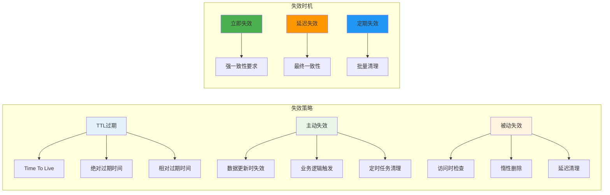

### 4.5 缓存淘汰算法

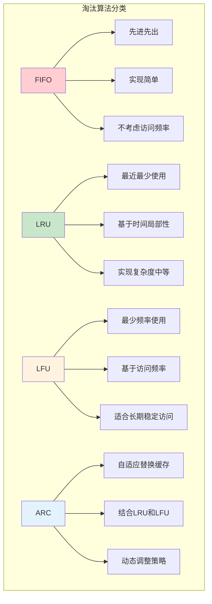

### 4.6 缓存阀值处理

- 淘汰一个最早的节点就足够吗？以Lru缓存为案例做分析……
  - 标准的 LRU 策略中，每次添加数据时最多只会淘汰一个数据，但在 LRU 内存缓存中，只淘汰一个数据单元往往并不够。
  - 例如在使用 “计量” 的内存图片缓存中，在加入一个大图片后，只淘汰一个图片数据有可能依然达不到最大缓存容量限制。
- 那么在LRUCache该如何做呢？
  - 在复用 LinkedHashMap 实现 LRU 内存缓存时，前文提到的 LinkedHashMap#removeEldestEntry() 淘汰判断接口可能就不够看了，因为它每次最多只能淘汰一个数据单元。
- LruCache是如何解决这个问题
  - 这个地方就需要重写LruCache中的sizeOf()方法，然后拿到key和value对象计算其内存大小。


### 4.7 缓存设计原则

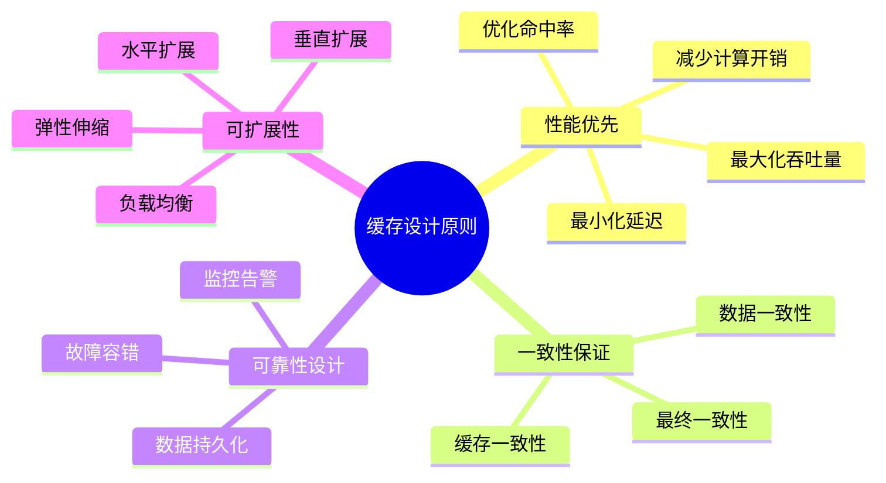

## 5.K-V框架设计

### 5.1 K-V框架背景

项目中很多地方使用缓存方案 

有的用`sp`，有的用`mmkv`，有的用`lru`，有的用`DataStore`，有的用`sqlite`，如何打造通用api切换操作不同存储方案？

缓存方案众多，且各自使用场景有差异，如何选择合适的缓存方式？

针对不同场景选择什么缓存方式，同时思考如何替换之前老的存储方案，而不用花费很大的时间成本！

### 5.2 K-V框架设计

思考一个K-V框架的设计：

- 问题1-线程安全：使用K-V存储一般会在多线程环境中执行，因此框架有必要保证多线程并发安全，并且优化并发效率；
- 问题2-内存缓存：由于磁盘 IO 操作是耗时操作，因此框架有必要在业务层和磁盘文件之间增加一层内存缓存；
- 问题3-事务：由于磁盘 IO 操作是耗时操作，因此框架有必要将支持多次磁盘 IO 操作聚合为一次磁盘写回事务，减少访问磁盘次数；
- 问题4-事务串行化：由于程序可能由多个线程发起写回事务，因此框架有必要保证事务之间的事务串行化，避免先执行的事务覆盖后执行的事务；
- 问题5-异步或同步写回：由于磁盘 IO 是耗时操作，因此框架有必要支持后台线程异步写回；有时候又要求数据读写是同步的；
- 问题6-增量更新：由于磁盘文件内容可能很大，因此修改 K-V 时有必要支持局部修改，而不是全量覆盖修改；
- 问题7-变更回调：由于业务层可能有监听 K-V 变更的需求，因此框架有必要支持变更回调监听，并且防止出现内存泄漏；
- 问题8-多进程：由于程序可能有多进程需求，那么框架如何保证多进程数据同步？
- 问题9-可用性：由于程序运行中存在不可控的异常和 Crash，因此框架有必要尽可能保证系统可用性，尽量保证系统在遇到异常后的数据完整性；
- **问题10-高效性：性能永远是要考虑的问题，解析、读取、写入和序列化的性能如何提高和权衡**；
- 问题11-安全性：如果程序需要存储敏感数据，如何保证数据完整性和保密性；
- 问题12-数据迁移：如果项目中存在旧框架，如何将数据从旧框架迁移至新框架，并且保证可靠性；
- 问题13-研发体验：是否模板代码冗长，是否容易出错。各种K—V框架使用体验如何？

### 5.3 兼容不同缓存

如何兼容不同缓存，定义通用的存储接口

- 不同的存储方案，由于api不一样，所以难以切换操作。要是想兼容不同存储方案切换，就必须自己制定一个通用缓存接口。
- 定义接口，然后各个不同存储方案实现接口，重写抽象方法。调用的时候，获取接口对象调用api，这样就可以统一Api
- 定义一个接口，这个接口有什么呢？主要是存和取各种基础类型数据，比如saveInt/readInt；saveString/readString等通用抽象方法


## 5.LRU缓存原理

在LruCache的源码中，关于LruCache有这样的一段介绍：

cache对象通过一个强引用来访问内容。每次当一个item被访问到的时候，这个item就会被移动到一个队列的队首。当一个item被添加到已经满了的队列时，这个队列的队尾的item就会被移除。

### 5.1 LRU算法思想

LRU是近期最少使用的算法，它的核心思想是当缓存满时，会优先淘汰那些近期最少使用的缓存对象。

```mermaid
graph LR
    subgraph "LRU核心思想"
        A[时间局部性原理] --> A1[最近访问的数据]
        A --> A2[很可能再次被访问]
        
        B[淘汰策略] --> B1[淘汰最久未使用的数据]
        B --> B2[为新数据腾出空间]
        
        C[数据结构] --> C1[双向链表 + 哈希表]
        C --> C2[O(1)时间复杂度]
    end
    
    style A fill:#e3f2fd
    style B fill:#e8f5e8
    style C fill:#fff3e0
```

采用LRU算法的缓存有两种：LrhCache和DiskLruCache，分别用于实现内存缓存和硬盘缓存，其核心思想都是LRU缓存算法。


LruCache使用是计数or计量，针对计数策略使用Lru仅仅只统计缓存单元的个数，针对计量则要复杂一点。

### 5.2 LRU数据结构设计

```mermaid
graph TB
    subgraph "LRU Cache结构"
        A[HashMap] --> A1[key -> Node映射]
        A --> A2[O(1)查找时间]
        
        B[双向链表] --> B1[维护访问顺序]
        B --> B2[头部: 最近访问]
        B --> B3[尾部: 最久未访问]
        
        C[Node节点] --> C1[key: 键值]
        C --> C2[value: 数据值]
        C --> C3[prev: 前驱指针]
        C --> C4[next: 后继指针]
    end
    
    A1 --> C
    B1 --> C
    
    style A fill:#4caf50
    style B fill:#2196f3
    style C fill:#ff9800
```

### 5.3 LRU操作流程

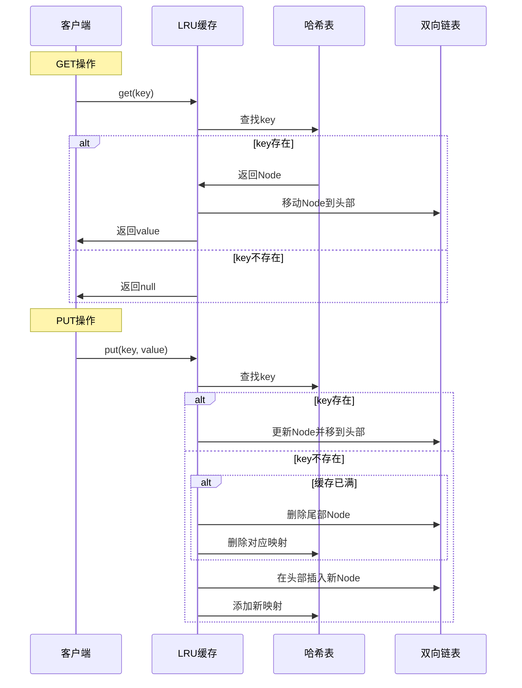

### 5.4 LRU实现代码

```cpp
class LRUCache {
private:
    struct Node {
        int key, value;
        Node* prev;
        Node* next;
        Node(int k = 0, int v = 0) : key(k), value(v), prev(nullptr), next(nullptr) {}
    };
    
    unordered_map<int, Node*> cache;
    Node* head;
    Node* tail;
    int capacity;
    
    void addToHead(Node* node) {
        node->prev = head;
        node->next = head->next;
        head->next->prev = node;
        head->next = node;
    }
    
    void removeNode(Node* node) {
        node->prev->next = node->next;
        node->next->prev = node->prev;
    }
    
    void moveToHead(Node* node) {
        removeNode(node);
        addToHead(node);
    }
    
    Node* removeTail() {
        Node* lastNode = tail->prev;
        removeNode(lastNode);
        return lastNode;
    }
    
public:
    LRUCache(int capacity) : capacity(capacity) {
        head = new Node();
        tail = new Node();
        head->next = tail;
        tail->prev = head;
    }
    
    int get(int key) {
        auto it = cache.find(key);
        if (it == cache.end()) {
            return -1;
        }
        
        Node* node = it->second;
        moveToHead(node);
        return node->value;
    }
    
    void put(int key, int value) {
        auto it = cache.find(key);
        
        if (it != cache.end()) {
            Node* node = it->second;
            node->value = value;
            moveToHead(node);
        } else {
            Node* newNode = new Node(key, value);
            
            if (cache.size() >= capacity) {
                Node* tail_node = removeTail();
                cache.erase(tail_node->key);
                delete tail_node;
            }
            
            cache[key] = newNode;
            addToHead(newNode);
        }
    }
};
```

### 5.5 LFU算法设计

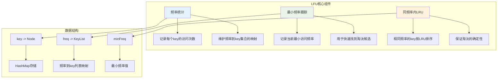

## 6.通用缓存策略

### 6.1 过期策略分类

说一个使用场景：比如你准备做WebView的资源拦截缓存，针对模版页面，为了提交加载速度。会缓存css，js，图片等资源到本地。那么如何选择存储方案，如何处理过期问题？

思考一下该问题：比如WebView缓存方案是数据库存储，db文件。针对缓存数据，猜想思路可能是Lru策略，或者标记时间清除过期文件。

那么缓存过期处理的策略有哪些

- 定时过期：每个设置过期时间的key都需要创建⼀个定时器，到过期时间就会立即清除。
- 惰性过期：只有当访问⼀个 key 时，才会判断该key是否已过期，过期则清除。
- 定期过期：每隔⼀定的时间，会扫描⼀定数量的数据库的 expires 字典中⼀定数量的key（是随机的）， 并 清除其中已过期的key 。
- 分桶策略：定期过期的优化，将过期时间点相近的 key 放在⼀起，按时间扫描分桶。

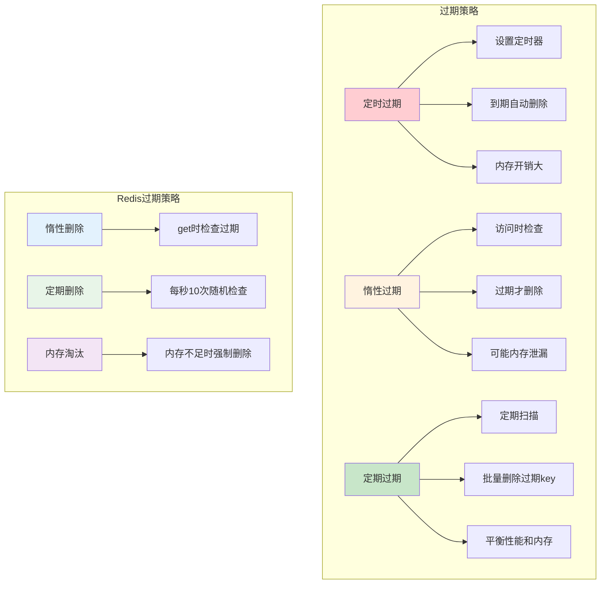

### 6.2 TTL设计模式

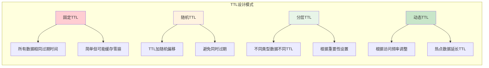

### 6.3 淘汰策略对比


### 6.4 分层架构设计

```mermaid
graph TB
    subgraph "分层缓存架构"
        A[L1: 进程内缓存] --> A1[容量: 小]
        A --> A2[速度: 极快]
        A --> A3[一致性: 弱]
        
        B[L2: 本地缓存] --> B1[容量: 中]
        B --> B2[速度: 快]
        B --> B3[一致性: 中]
        
        C[L3: 分布式缓存] --> C1[容量: 大]
        C --> C2[速度: 中]
        C --> C3[一致性: 强]
        
        D[L4: 数据源] --> D1[容量: 最大]
        D --> D2[速度: 慢]
        D --> D3[一致性: 最强]
    end
    
    A --> B
    B --> C
    C --> D
    
    style A fill:#4caf50
    style B fill:#8bc34a
    style C fill:#cddc39
    style D fill:#ffeb3b
```

### 6.5 分层缓存数据流

```mermaid
sequenceDiagram
    participant App as 应用
    participant L1 as L1缓存
    participant L2 as L2缓存
    participant L3 as L3缓存
    participant DB as 数据库
    
    App->>L1: 查询数据
    
    alt L1命中
        L1->>App: 返回数据
    else L1未命中
        L1->>L2: 查询L2
        
        alt L2命中
            L2->>L1: 返回数据并更新L1
            L1->>App: 返回数据
        else L2未命中
            L2->>L3: 查询L3
            
            alt L3命中
                L3->>L2: 返回数据并更新L2
                L2->>L1: 更新L1
                L1->>App: 返回数据
            else L3未命中
                L3->>DB: 查询数据库
                DB->>L3: 返回数据并更新L3
                L3->>L2: 更新L2
                L2->>L1: 更新L1
                L1->>App: 返回数据
            end
        end
    end
```

## 7. 缓存设计哲学与权衡

### 7.1 缓存设计哲学

#### 7.1.1 核心设计理念

```mermaid
mindmap
  root((缓存设计哲学))
    简单性原则
      KISS原则
      避免过度设计
      易于理解和维护
      降低复杂度
    性能优先
      响应时间最小化
      吞吐量最大化
      资源利用率优化
      用户体验提升
    可靠性保证
      数据一致性
      故障容错
      优雅降级
      监控告警
    可扩展性
      水平扩展能力
      垂直扩展能力
      弹性伸缩
      未来需求适应
    成本效益
      开发成本
      运维成本
      硬件成本
      机会成本
```

#### 7.1.2 设计权衡矩阵

```mermaid
graph TB
    subgraph "缓存设计权衡"
        A[性能 vs 一致性] --> A1[强一致性牺牲性能]
        A --> A2[高性能可能数据不一致]
        
        B[容量 vs 成本] --> B1[大容量高成本]
        B --> B2[成本控制限制容量]
        
        C[复杂度 vs 效果] --> C1[复杂算法效果好]
        C --> C2[简单方案易维护]
        
        D[可用性 vs 一致性] --> D1[高可用可能数据不一致]
        D --> D2[强一致性可能影响可用性]
    end
    
    subgraph "权衡策略"
        E[业务优先级] --> E1[根据业务重要性选择]
        F[分层设计] --> F1[不同层级不同策略]
        G[动态调整] --> G1[根据运行时状态调整]
        H[监控反馈] --> H1[基于监控数据优化]
    end
    
    A --> E
    B --> F
    C --> G
    D --> H
    
    style A fill:#ffcdd2
    style B fill:#fff3e0
    style C fill:#f3e5f5
    style D fill:#fce4ec
    style E fill:#c8e6c9
    style F fill:#c8e6c9
    style G fill:#c8e6c9
    style H fill:#c8e6c9
```

### 7.2 实际应用中的权衡

#### 7.2.1 电商系统缓存权衡

```mermaid
graph LR
    subgraph "电商系统缓存策略"
        A[商品信息] --> A1[读多写少]
        A --> A2[可接受短暂不一致]
        A --> A3[使用TTL + 异步更新]
        
        B[库存信息] --> B1[读写频繁]
        B --> B2[强一致性要求]
        B --> B3[使用分布式锁 + 短TTL]
        
        C[用户会话] --> C1[读写频繁]
        C --> C2[可用性优先]
        C --> C3[使用本地缓存 + 复制]
        
        D[订单信息] --> D1[写多读少]
        D --> D2[强一致性要求]
        D --> D3[直接操作数据库]
    end
    
    style A fill:#c8e6c9
    style B fill:#fff3e0
    style C fill:#e3f2fd
    style D fill:#ffcdd2
```

#### 7.2.2 社交媒体缓存权衡

```mermaid
graph TD
    subgraph "社交媒体缓存策略"
        A[用户动态] --> A1[时效性要求高]
        A --> A2[可接受最终一致性]
        A --> A3[多级缓存 + 推拉结合]
        
        B[热门内容] --> B1[访问量巨大]
        B --> B2[读多写少]
        B --> B3[CDN + 长TTL]
        
        C[用户关系] --> C1[变化频率低]
        C --> C2[一致性要求中等]
        C --> C3[本地缓存 + 定期同步]
        
        D[实时消息] --> D1[实时性要求极高]
        D --> D2[可用性优先]
        D --> D3[内存队列 + 持久化]
    end
    
    style A fill:#e8f5e8
    style B fill:#e3f2fd
    style C fill:#fff3e0
    style D fill:#f3e5f5
```

### 7.3 缓存反模式与最佳实践

#### 7.3.1 常见反模式

```mermaid
graph LR
    subgraph "缓存反模式"
        A[缓存穿透] --> A1[查询不存在的数据]
        A --> A2[绕过缓存直击数据库]
        A --> A3[解决: 布隆过滤器/空值缓存]
        
        B[缓存雪崩] --> B1[大量缓存同时失效]
        B --> B2[数据库压力激增]
        B --> B3[解决: 随机TTL/熔断机制]
        
        C[缓存击穿] --> C1[热点数据过期]
        C --> C2[并发请求击穿缓存]
        C --> C3[解决: 分布式锁/预加载]
        
        D[缓存污染] --> D1[低频数据占用缓存]
        D --> D2[影响缓存命中率]
        D --> D3[解决: 智能淘汰算法]
    end
    
    style A fill:#ffcdd2
    style B fill:#ffcdd2
    style C fill:#ffcdd2
    style D fill:#ffcdd2
```

#### 7.3.2 最佳实践总结

```mermaid
graph TD
    subgraph "缓存最佳实践"
        A[设计阶段] --> A1[明确缓存目标]
        A --> A2[选择合适的缓存类型]
        A --> A3[设计合理的key结构]
        A --> A4[规划容量和TTL]
        
        B[实现阶段] --> B1[实现缓存预热]
        B --> B2[处理缓存穿透]
        B --> B3[避免缓存雪崩]
        B --> B4[保证数据一致性]
        
        C[运维阶段] --> C1[监控缓存指标]
        C --> C2[定期性能调优]
        C --> C3[容量规划调整]
        C --> C4[故障应急处理]
        
        D[优化阶段] --> D1[分析访问模式]
        D --> D2[优化缓存策略]
        D --> D3[调整淘汰算法]
        D --> D4[升级缓存架构]
    end
    
    style A fill:#e3f2fd
    style B fill:#e8f5e8
    style C fill:#fff3e0
    style D fill:#f3e5f5
```

---

## 8. 局部性原理与分层实现

### 8.1 局部性原理详解

#### 8.1.1 局部性原理基础

```mermaid
graph TB
    subgraph "局部性原理"
        A[时间局部性] --> A1[最近访问的数据]
        A --> A2[很可能再次被访问]
        A --> A3[基础: 程序执行的循环性]
        
        B[空间局部性] --> B1[相邻的数据]
        B --> B2[很可能被一起访问]
        B --> B3[基础: 数据结构的连续性]
        
        C[顺序局部性] --> C1[按顺序访问的数据]
        C --> C2[下一个数据很可能被访问]
        C --> C3[基础: 程序执行的顺序性]
    end
    
    subgraph "缓存有效性原因"
        D[程序行为特征] --> D1[80/20法则]
        D --> D2[热点数据集中]
        D --> D3[访问模式可预测]
        
        E[数据访问模式] --> E1[循环访问]
        E --> E2[批量访问]
        E --> E3[关联访问]
    end
    
    A --> D
    B --> E
    C --> E
    
    style A fill:#e3f2fd
    style B fill:#e8f5e8
    style C fill:#fff3e0
    style D fill:#4caf50
    style E fill:#4caf50
```

#### 8.1.2 局部性原理在不同场景的体现

```mermaid
graph LR
    subgraph "Web应用局部性"
        A[用户行为] --> A1[浏览相关页面]
        A --> A2[重复访问收藏页面]
        A --> A3[按时间顺序浏览]
        
        B[数据访问] --> B1[用户信息频繁查询]
        B --> B2[相关商品一起展示]
        B --> B3[热门内容集中访问]
    end
    
    subgraph "数据库局部性"
        C[查询模式] --> C1[相同条件重复查询]
        C --> C2[关联表连接查询]
        C --> C3[范围查询连续数据]
        
        D[索引访问] --> D1[B+树顺序访问]
        D --> D2[热点索引页面]
        D --> D3[相邻记录批量读取]
    end
    
    style A fill:#e3f2fd
    style B fill:#e8f5e8
    style C fill:#fff3e0
    style D fill:#f3e5f5
```

### 8.2 分层缓存实现

#### 8.2.1 CPU缓存层次

```mermaid
graph TB
    subgraph "CPU缓存层次结构"
        A[CPU核心] --> B[L1缓存]
        B --> C[L2缓存]
        C --> D[L3缓存]
        D --> E[主内存]
        
        F[L1特性] --> F1[容量: 32KB-64KB]
        F --> F2[延迟: 1-2周期]
        F --> F3[带宽: 最高]
        
        G[L2特性] --> G1[容量: 256KB-1MB]
        G --> G2[延迟: 3-7周期]
        G --> G3[带宽: 高]
        
        H[L3特性] --> H1[容量: 8MB-32MB]
        H --> H2[延迟: 15-30周期]
        H --> H3[带宽: 中]
        
        I[内存特性] --> I1[容量: GB级别]
        I --> I2[延迟: 100-300周期]
        I --> I3[带宽: 低]
    end
    
    B --> F
    C --> G
    D --> H
    E --> I
    
    style B fill:#4caf50
    style C fill:#8bc34a
    style D fill:#cddc39
    style E fill:#ffeb3b
```

#### 8.2.2 应用层分层缓存

```mermaid
graph TB
    subgraph "应用层分层缓存架构"
        A[浏览器缓存] --> A1[内存缓存: 当前页面资源]
        A --> A2[磁盘缓存: 历史访问资源]
        A --> A3[HTTP缓存: 协议层缓存]
        
        B[CDN缓存] --> B1[边缘节点: 用户就近访问]
        B --> B2[区域节点: 区域热点内容]
        B --> B3[中心节点: 全局内容分发]
        
        C[应用服务缓存] --> C1[进程内缓存: 热点数据]
        C --> C2[本地缓存: 共享数据]
        C --> C3[分布式缓存: 集群共享]
        
        D[数据库缓存] --> D1[查询缓存: SQL结果]
        D --> D2[缓冲池: 数据页面]
        D --> D3[索引缓存: 索引页面]
    end
    
    A --> B
    B --> C
    C --> D
    
    style A fill:#e3f2fd
    style B fill:#e8f5e8
    style C fill:#fff3e0
    style D fill:#f3e5f5
```

### 8.3 缓存预取策略

#### 8.3.1 预取算法

```mermaid
graph LR
    subgraph "预取策略"
        A[顺序预取] --> A1[检测顺序访问模式]
        A --> A2[预取后续数据块]
        A --> A3[适用于流式数据]
        
        B[关联预取] --> B1[分析数据访问关联性]
        B --> B2[预取相关数据]
        B --> B3[适用于图数据结构]
        
        C[时间预取] --> C1[基于时间模式预测]
        C --> C2[在访问高峰前预取]
        C --> C3[适用于周期性访问]
        
        D[机器学习预取] --> D1[训练访问模式模型]
        D --> D2[智能预测下次访问]
        D --> D3[适用于复杂场景]
    end
    
    style A fill:#e3f2fd
    style B fill:#e8f5e8
    style C fill:#fff3e0
    style D fill:#f3e5f5
```

#### 8.3.2 预取实现流程

```mermaid
sequenceDiagram
    participant App as 应用
    participant Cache as 缓存层
    participant Predictor as 预取器
    participant DataSource as 数据源
    
    App->>Cache: 访问数据A
    Cache->>Predictor: 记录访问模式
    Predictor->>Predictor: 分析访问模式
    
    alt 检测到模式
        Predictor->>Cache: 预测需要数据B
        Cache->>DataSource: 异步预取数据B
        DataSource->>Cache: 返回数据B
        Cache->>Cache: 存储预取数据
    end
    
    App->>Cache: 访问数据B
    Cache->>App: 命中预取数据，快速返回
    
    Note over Predictor: 持续学习和优化预取策略
```

### 8.4 缓存性能优化

#### 8.4.1 性能优化策略

```mermaid
graph TD
    subgraph "缓存性能优化"
        A[命中率优化] --> A1[优化淘汰算法]
        A --> A2[调整缓存容量]
        A --> A3[改进预取策略]
        A --> A4[优化数据分布]
        
        B[延迟优化] --> B1[减少网络跳数]
        B --> B2[优化序列化]
        B --> B3[使用连接池]
        B --> B4[批量操作]
        
        C[吞吐量优化] --> C1[并发访问优化]
        C --> C2[读写分离]
        C --> C3[分片策略]
        C --> C4[异步处理]
        
        D[内存优化] --> D1[压缩存储]
        D --> D2[对象池化]
        D --> D3[内存映射]
        D --> D4[垃圾回收优化]
    end
    
    style A fill:#4caf50
    style B fill:#2196f3
    style C fill:#ff9800
    style D fill:#9c27b0
```

#### 8.4.2 性能监控指标

```mermaid
graph LR
    subgraph "关键性能指标"
        A[命中率指标] --> A1[缓存命中率]
        A --> A2[各层命中率]
        A --> A3[热点数据命中率]
        
        B[延迟指标] --> B1[平均响应时间]
        B --> B2[P99响应时间]
        B --> B3[网络延迟]
        
        C[吞吐量指标] --> C1[QPS/TPS]
        C --> C2[并发连接数]
        C --> C3[带宽利用率]
        
        D[资源指标] --> D1[内存使用率]
        D --> D2[CPU使用率]
        D --> D3[网络使用率]
    end
    
    subgraph "监控工具"
        E[Prometheus] --> E1[指标收集]
        F[Grafana] --> F1[可视化展示]
        G[ELK Stack] --> G1[日志分析]
        H[APM工具] --> H1[性能追踪]
    end
    
    A --> E
    B --> F
    C --> G
    D --> H
    
    style A fill:#4caf50
    style B fill:#2196f3
    style C fill:#ff9800
    style D fill:#9c27b0
```

---

## 总结

### 核心要点回顾

1. **缓存本质**：用空间换时间，基于局部性原理提升系统性能
2. **分层设计**：从CPU缓存到应用缓存的多层次架构
3. **策略选择**：根据业务特点选择合适的缓存策略和算法
4. **权衡考虑**：在性能、一致性、成本之间找到最佳平衡点
5. **持续优化**：基于监控数据不断调优缓存配置和策略

### 缓存设计决策树

```mermaid
graph TD
    A[开始设计缓存] --> B{数据访问特征}
    
    B -->|读多写少| C[考虑缓存]
    B -->|写多读少| D[谨慎使用缓存]
    B -->|读写均衡| E[评估缓存收益]
    
    C --> F{一致性要求}
    F -->|强一致性| G[Write-Through + 短TTL]
    F -->|最终一致性| H[Cache-Aside + 长TTL]
    F -->|弱一致性| I[Write-Behind + 异步更新]
    
    E --> J{性能要求}
    J -->|高性能| K[多级缓存]
    J -->|一般性能| L[单级缓存]
    
    D --> M[直接访问数据源]
    
    G --> N[选择缓存类型]
    H --> N
    I --> N
    K --> N
    L --> N
    
    N --> O{部署方式}
    O -->|单机| P[本地缓存]
    O -->|分布式| Q[分布式缓存]
    O -->|混合| R[多级缓存]
    
    P --> S[实施监控]
    Q --> S
    R --> S
    M --> S
    
    style C fill:#c8e6c9
    style G fill:#4caf50
    style H fill:#8bc34a
    style I fill:#cddc39
    style K fill:#2196f3
    style L fill:#03a9f4
```

### 最佳实践总结

```mermaid
graph LR
    subgraph "缓存设计最佳实践"
        A[设计原则] --> A1[简单性优先]
        A --> A2[性能导向]
        A --> A3[可观测性]
        A --> A4[渐进式优化]
        
        B[实现要点] --> B1[合理的TTL设置]
        B --> B2[有效的淘汰策略]
        B --> B3[完善的监控体系]
        B --> B4[优雅的降级机制]
        
        C[运维关键] --> C1[容量规划]
        C --> C2[性能调优]
        C --> C3[故障处理]
        C --> C4[版本升级]
    end
    
    style A fill:#e3f2fd
    style B fill:#e8f5e8
    style C fill:#fff3e0
```

通过深入理解缓存的设计原理和实现策略，我们可以构建高效、可靠的缓存系统，显著提升应用性能和用户体验。缓存设计是一个需要持续优化的过程，需要根据业务发展和技术演进不断调整和完善。


### 2.5 存储方案的不足
- 存储方案SharedPreferences的不足
  - 1.SP用内存层用HashMap保存，磁盘层则是用的XML文件保存。每次更改，都需要将整个HashMap序列化为XML格式的报文然后整个写入文件。
  - 2.SP读写文件不是类型安全的，且没有发出错误信号的机制，缺少事务性API
  - 3.commit() / apply()操作可能会造成ANR问题
- 存储方案MMKV的不足
  - 1.没有类型信息，不支持getAll。由于没有记录类型信息，MMKV无法自动反序列化，也就无法实现getAll接口。
  - 2.需要引入so，增加包体积：引入MMKV需要增加的体积还是不少的。
  - 3.文件只增不减：MMKV的扩容策略还是比较激进的，而且扩容之后不会主动trim size。
- 存储方案DataStore的不足
  - 1.只是提供异步API，没有提供同步API方法。在进行大量同步存储的时候，使用runBlocking同步数据可能会卡顿。
  - 2.对主线程执行同步 I/O 操作可能会导致 ANR 或界面卡顿。可以通过从 DataStore 异步预加载数据来减少这些问题。

### 3.1 Sp存储原理分析
- SharedPreferences，它是一个轻量级的存储类，特别适合用于保存软件配置参数。
  - 轻量级，以键值对的方式进行存储。采用的是xml文件形式存储在本地，程序卸载后会也会一并被清除，不会残留信息。线程安全的。
- 它有一些弊端如下所示
  - 对文件IO读取，因此在IO上的瓶颈是个大问题，因为在每次进行get和commit时都要将数据从内存写入到文件中，或从文件中读取。
  - 多线程场景下效率较低，在get操作时，会锁定SharedPreferences对象，互斥其他操作，而当put，commit时，则会锁定Editor对象，使用写入锁进行互斥，在这种情况下，效率会降低。
  - 不支持跨进程通讯，由于每次都会把整个文件加载到内存中，不建议存储大的文件内容，比如大json。
- 有一些使用上的建议如下
  - 建议不要存储较大数据；频繁修改的数据修改后统一提交而不是修改过后马上提交；在跨进程通讯中不去使用；键值对不宜过多
- 读写操作性能分析
  - 第一次通过`Context.getSharedPreferences()`进行初始化时，对`xml`文件进行一次读取，并将文件内所有内容（即所有的键值对）缓到内存的一个`Map`中，接下来所有的读操作，只需要从这个`Map`中取就可以


### 3.2 MMKV存储原理分析
- 早期微信的需求
  - 微信聊天对话内容中的特殊字符所导致的程序崩溃是一类很常见、也很需要快速解决的问题；而哪些字符会导致程序崩溃，是无法预知的。
  - 只能等用户手机上的微信崩溃之后，再利用类似时光倒流的回溯行为，看看上次软件崩溃的最后一瞬间，用户收到或者发出了什么消息，再用这些消息中的文字去尝试复现发生过的崩溃，最终试出有问题的字符，然后针对性解决。
- 该需求对应的技术考量
  - 考量1：把聊天页面的显示文字写到手机磁盘里，才能在程序崩溃、重新启动之后，通过读取文件的方式来查看。但这种方式涉及到io流读写，且消息多会有性能问题。
  - 考量2：App程序都崩溃了，如何保证要存储的内容，都写入到磁盘中呢？
  - 考量3：保存聊天内容到磁盘的行为，这个做成同步还是异步呢？如果是异步，如何保证聊天消息的时序性？
  - 考量4：如何存储数据是同步行为，针对群里聊天这么多消息，如何才能避免卡顿呢？
  - 考量5：存储数据放到主线程中，用户在群聊天页面猛滑消息，如何爆发性集中式对磁盘写入数据？
- MMKV存储框架介绍
  - MMKV 是基于 mmap 内存映射的 key-value 组件，底层序列化/反序列化使用 protobuf 实现，性能高，稳定性强。
- MMKV设计的原理
  - 内存准备：通过 mmap 内存映射文件，提供一段可供随时写入的内存块，App 只管往里面写数据，由操作系统负责将内存回写到文件，不必担心 crash 导致数据丢失。
  - 数据组织：数据序列化方面我们选用 protobuf 协议，pb 在性能和空间占用上都有不错的表现。
  - 写入优化：考虑到主要使用场景是频繁地进行写入更新，需要有增量更新的能力。考虑将增量 kv 对象序列化后，append 到内存末尾。
  - 空间增长：使用 append 实现增量更新带来了一个新的问题，就是不断 append 的话，文件大小会增长得不可控。需要在性能和空间上做个折中。
- MMKV诞生的背景
  - 针对该业务，高频率，同步，大量数据写入磁盘的需求。不管用sp，还是store，还是disk，还是数据库，只要在主线程同步写入磁盘，会很卡。
  - 解决方案就是：使用内存映射mmap的底层方法，相当于系统为指定文件开辟专用内存空间，内存数据的改动会自动同步到文件里。
  - **用浅显的话说：MMKV就是实现用「写入内存」的方式来实现「写入磁盘」的目标。内存的速度多快呀，耗时几乎可以忽略，这样就把写磁盘造成卡顿的问题解决了**。


### 3.4 DiskLru原理分析
- DiskLruCache 用于实现存储设备缓存，即磁盘缓存，它通过将缓存对象写入文件系统从而实现缓存的效果。
  - DiskLruCache最大的特点就是持久化存储，所有的缓存以文件的形式存在。在用户进入APP时，它根据日志文件将DiskLruCache恢复到用户上次退出时的情况，日志文件journal保存每个文件的下载、访问和移除的信息，在恢复缓存时逐行读取日志并检查文件来恢复缓存。
- DiskLruCache缓存基础原理流程图
  - 
  - 关于DiskLruCache更多的原理解读，可以看：[AppLruDisk](https://github.com/yangchong211/YCCommonLib/tree/master/AppLruDisk)


### 3.5 DataStore分析
- 为何会有DataStore
  - DataStore 被创造出来的目标就是替代 Sp，而它解决的 SharedPreferences 最大的问题有两点：一是性能问题，二是回调问题。
- DataStore优势是异步Api
  - DataStore 的主要优势之一是异步API，所以本身并未提供同步API调用，但实际上可能不一定始终能将周围的代码更改为异步代码。
- 提出一个问题和思考
  - 如果使用现有代码库采用同步磁盘 I/O，或者您的依赖项不提供异步API，那么如何将DataStore存储数据改成同步调用？
- 使用阻塞式协程消除异步差异
  - 使用 runBlocking() 从 DataStore 同步读取数据。runBlocking()会运行一个新的协程并阻塞当前线程直到内部逻辑完成，所以尽量避免在UI线程调用。
- 频繁使用阻塞式协程会有问题吗
  - 要注意的一点是，不用在初始读取时调用runBlocking，会阻塞当前执行的线程，因为初始读取会有较多的IO操作，耗时较长。
  - 更为推荐的做法则是先异步读取到内存后，后续有需要可直接从内存中拿，而非运行同步代码阻塞式获取。


### 3.8 使用缓存注意点
- 在使用内存缓存的时候须要注意防止内存泄露，使用磁盘缓存的时候注意确保缓存的时效性
- 针对SharedPreferences使用建议有：
  - 因为 SharedPreferences 虽然是全量更新的模式，但只要把保存的数据用合适的逻辑拆分到多个不同的文件里，全量更新并不会对性能造成太大的拖累。
  - 它设计初衷是轻量级，建议当存储文件中key-value数据超过30个，如果超过30个（这个只是一个假设），则开辟一个新的文件进行存储。建议不同业务模块的数据分文件存储……
- 针对MMKV使用建议有：
  - 如果项目中有高频率，同步存储数据，使用MMKV更加友好。
- 针对DataStore使用建议有：
  - 建议在初始化的时候，使用全局上下文Context给DataStore设置存储路径。
- 针对LruCache缓存使用建议：
  - 如果你使用“计量”淘汰策略，需要重写 SystemLruCache#sizeOf() 测量缓存单元的内存占用量，否则缓存单元的大小默认视为 1，相当于 maxSize 表示的是最大缓存数量。


### 3.9 各种数据存储文件
- SharedPreferences 存储文件格式如下所示
    ``` xml
    <?xml version='1.0' encoding='utf-8' standalone='yes' ?>
    <map>
        <string name="name">杨充</string>
        <int name="age" value="28" />
        <boolean name="married" value="true" />
    </map>
    ```
- MMKV 存储文件格式如下所示
  - MMKV的存储结构，分了两个文件，一个数据文件，一个校验文件crc结尾。大概如下所示：
  - 
  - 
  - 这种设计最直接问题就是占用空间变大了很多，举一个例子，只存储了一个字段，但是为了方便MMAP映射，磁盘直接占用了8k的存储。
- LruDiskCache 存储文件格式如下所示
  - 
- DataStore 存储文件格式如下所示
  - 


### 4.2 打造通用缓存Api
- 通用缓存Api设计思路：
  - 通用一套api + 不同接口实现 + 代理类 + 工厂模型
- 定义缓存的通用API接口，这里省略部分代码
    ``` kotlin
    interface ICacheable {
        fun saveXxx(key: String, value: Int)
        fun readXxx(key: String, default: Int = 0): Int
        fun removeKey(key: String)
        fun totalSize(): Long
        fun clearData()
    }
    ```
- 基于接口而非实现编程的设计思想
  - 将接口和实现相分离，封装不稳定的实现，暴露稳定的接口。上游系统面向接口而非实现编程，不依赖不稳定的实现细节，这样当实现发生变化的时候，上游系统的代码基本上不需要做改动，以此来降低耦合性，提高扩展性。


### 4.3 切换不同缓存方式
- 传入不同类型方便创建不同存储方式
  - 隐藏存储方案创建具体细节，开发者只需要关心所需产品对应的工厂，无须关心创建细节，甚至无须知道具体存储方案的类名。需要符合开闭原则
- 那么具体该怎么实现呢？
  - 看到下面代码是不是有种很熟悉的感觉，没错，正是使用了工厂模式，灵活切换不同的缓存方式。但针对应用层调用api却感知不到影响。
    ``` java
    public static ICacheable getCacheImpl(Context context, @CacheConstants.CacheType int type) {
        if (type == CacheConstants.CacheType.TYPE_DISK) {
            return DiskFactory.create().createCache(context);
        } else if (type == CacheConstants.CacheType.TYPE_LRU) {
            return LruCacheFactory.create().createCache(context);
        } else if (type == CacheConstants.CacheType.TYPE_MEMORY) {
            return MemoryFactory.create().createCache(context);
        } else if (type == CacheConstants.CacheType.TYPE_MMKV) {
            return MmkvFactory.create().createCache(context);
        } else if (type == CacheConstants.CacheType.TYPE_SP) {
            return SpFactory.create().createCache(context);
        } else if (type == CacheConstants.CacheType.TYPE_STORE) {
            return StoreFactory.create().createCache(context);
        } else {
            return MmkvFactory.create().createCache(context);
        }
    }
    ```


### 4.5 缓存阀值处理


### 4.6 缓存的线程安全性
- 为何要强调缓存方案线程安全性
  - 缓存虽好，用起来很快捷方便，但在使用过程中，大家一定要注意数据更新和线程安全，不要出现脏数据。
- 针对LruCache中使用LinkedHashMap读写不安全情况
  - 保证LruCache的线程安全，在put，get等核心方法中，添加synchronized锁。这里主要是synchronized (this){ put操作 }
- 针对DiskLruCache读写不安全的情况
  - DiskLruCache 管理多个 Entry（key-values），因此锁粒度应该是 Entry 级别的。
  - get 和 edit 方法都是同步方法，保证内部的 Entry Map 的安全访问，是保证线程安全的第一步。


### 4.7 缓存数据的迁移
- 如何将Sp数据迁移到DataStore
  - 通过属性委托的方式创建DataStore，基于已有的SharedPreferences文件进行创建DataStore。将sp文件名，以参数的形式传入preferencesDataStore，DataStore会自动将该文件中的数据进行转换。
    ```
    val Context.dataStore: DataStore<Preferences> by preferencesDataStore(
        name = "user_info",
        produceMigrations = { context ->
            listOf(SharedPreferencesMigration(context, "sp_file_name"))
        })
    ```
- 如何将sp数据迁移到MMKV
  - MMKV 提供了 importFromSharedPreferences() 函数，可以比较方便地迁移数据过来。
  - MMKV 还额外实现了一遍 SharedPreferences、SharedPreferences.Editor 这两个 interface。
    ``` java
    MMKV preferences = MMKV.mmkvWithID("myData");
    // 迁移旧数据
    {
        SharedPreferences old_man = getSharedPreferences("myData", MODE_PRIVATE);
        preferences.importFromSharedPreferences(old_man);
        old_man.edit().clear().commit();
    }
    ```
- 思考一下，MMKV框架实现了sp的两个接口，即磨平了数据迁移差异性
  - 那么使用这个方式，借鉴该思路，你能否尝试用该方法，去实现LruDiskCache方案的sp数据一键迁移。


### 4.8 缓存数据加密
- 思考一下，如果让你去设计数据的加密，你该怎么做？
  - 具体可以参考MMKV的数据加密过程。


### 4.9 缓存效率的对比
- 测试数据
  - 测试写入和读取。注意分别使用不同的方式，测试存储或获取相同的数据(数据为int类型数字，还有String类型长字符串)。然后查看耗时时间的长短……
- 比较对象
  - SharePreferences/DataStore/MMKV/LruDisk/Room。使用华为手机测试
- 测试数据案例1
  - 
  - 
  - 在主线程中测试数据，同步耗时时间(主线程还有其他的耗时)跟异步场景有较大差别。
- 测试数据案例2
  - 
  - 测试1000组长字符串数据，MMKV 就不具备优势了，反而成了耗时最久的；而这时候的冠军就成了 DataStore，并且是遥遥领先。
- 最后思考说明
  - 从最终的数据来看，这几种方案都不是很慢。虽然这半秒左右的主线程耗时看起来很可怕，但是要知道这是 1000 次连续写入的耗时。
  - 而在真正写程序的时候，怎么会一次性做 1000 次的长字符串的写入？所以真正在项目中的键值对写入的耗时，不管你选哪个方案，都会比这份测试结果的耗时少得多的，都少到了可以忽略的程度，这是关键。


### 6.5 异常设计说明
- DataStore初始化遇到的坑
  - 遇到问题：不能将DataStore初始化代码写到Activity里面去，否则重复进入Activity并使用Preferences DataStore时，会尝试去创建一个同名的.preferences_pb文件。
  - 问题分析：SingleProcessDataStore#check(!activeFiles.contains(it))，该方法会检查如果判断到activeFiles里已经有该文件，直接抛异常，即不允许重复创建。
  - 如何解决：在项目中只在顶层调用一次 preferencesDataStore 方法，这样可以更轻松地将 DataStore 保留为单例。
- MMKV遇到的坑说明
  - MMKV 是有数据损坏的概率的，MMKV 的 GitHub wiki 页面显示，微信的 iOS 版平均每天有 70 万次的数据校验不通过（即数据损坏）。


### 6.6 兼容性设计
- MMKV数据迁移比较难
  - MMKV都是按字节进行存储的，实际写入文件把类型擦除了，这也是MMKV不支持getAll的原因，虽然说getAll用的不多问题不大，但是MMKV因此就不具备导出和迁移的能力。
  - 比较好的方案是每次存储，多用一个字节来存储数据类型，这样占用的空间也不会大很多，但是具备了更好的可扩展性。


### 6.7 自测性设计
- MMKV不太方便查看数据和解析数据
  - 官方目前支持了5个平台，Android、iOS、Win、MacOS、python，但是没有提供解析数据的工具，数据文件和crc都是字节码，除了中文能看出一些内容，直接查看还是存在大量乱码。
  - 比如线上出了问题，把用户的存储文件捞上来，还得替换到系统目录里，通过代码断点去看，这也太不方便了。
- Sp，FastSp，DiskCache，Store等支持查看文件解析数据
  - 傻瓜式的查看缓存文件，操作缓存文件。具体看该库：[MonitorFileLib磁盘查看工具](https://github.com/yangchong211/YCAndroidTool/tree/master/MonitorFileLib)


