# 缓存设计技术思想
#### 目录介绍
- [1.缓存核心思想](#1缓存核心思想)
  - [1.1 缓存基本概念](#11-缓存基本概念)
  - [1.2 缓存方案思考](#12-缓存方案思考)
  - [1.3 不同端的应用](#13-不同端的应用)
  - [1.4 缓存性能原理](#14-缓存性能原理)
- [2.缓存类型分类](#2缓存类型分类)
  - [2.1 存储介质分类](#21-存储介质分类)
  - [2.2 常见存储方案](#22-常见存储方案)
  - [2.3 多级缓存架构](#23-多级缓存架构)
  - [2.4 访问模式分类](#24-访问模式分类)
  - [2.5 部署方式分类](#25-部署方式分类)
- [3.缓存使用场景](#3缓存使用场景)
  - [3.1 主要解决问题](#31-主要解决问题)
  - [3.2 Web缓存场景](#32-web缓存场景)
  - [3.3 移动应用场景](#33-移动应用场景)
  - [3.4 后端服务缓存](#34-后端服务缓存)
- [4.缓存设计思想](#4缓存设计思想)
  - [4.1 通用缓存思路](#41-通用缓存思路)
  - [4.2 缓存策略设计](#42-缓存策略设计)
  - [4.3 缓存容量设计](#43-缓存容量设计)
  - [4.4 缓存失效策略](#44-缓存失效策略)
  - [4.5 缓存淘汰算法](#45-缓存淘汰算法)
  - [4.6 缓存阀值处理](#46-缓存阀值处理)
  - [4.7 缓存设计原则](#47-缓存设计原则)
- [5.K-V框架设计](#5k-v框架设计)
  - [5.1 K-V框架背景](#51-k-v框架背景)
  - [5.2 K-V框架设计](#52-k-v框架设计)
  - [5.3 兼容不同缓存](#53-兼容不同缓存)
- 6.缓存方式考量
  - 6.1 内存缓存
  - 6.2 文件缓存
  - 6.3 mmap映射缓存
    - 6.3.1 什么是 mmap
    - 6.3.2 mmap 的核心原理
    - 6.3.3 mmap 相比传统文件 IO 的优势
    - 6.3.4 mmap 的局限性
    - 6.3.5 mmap 在缓存场景的典型应用
    - 6.3.6 三种缓存方式综合对比
- [6.LRU缓存原理](#6lru缓存原理)
  - [6.1 LRU算法思想](#61-lru算法思想)
  - [6.2 LRU数据结构设计](#62-lru数据结构设计)
  - [6.3 LRU操作流程](#63-lru操作流程)
  - [6.4 LRU实现代码](#64-lru实现代码)
  - [6.5 LFU算法设计](#65-lfu算法设计)
- [7.通用缓存策略](#7通用缓存策略)
  - [7.1 过期策略分类](#71-过期策略分类)
  - [7.2 TTL设计模式](#72-ttl设计模式)
  - [7.3 淘汰策略对比](#73-淘汰策略对比)
  - [7.4 分层架构设计](#74-分层架构设计)
  - [7.5 分层缓存数据流](#75-分层缓存数据流)
- 8.缓存设计哲学与权衡
  - 8.1 缓存设计哲学
  - 8.2 实际应用中的权衡
  - 8.3 缓存反模式与最佳实践
- 9.局部性原理与分层
  - 9.1 局部性原理详解
  - 9.2 分层缓存实现
  - 9.3 缓存预取策略
  - 9.4 缓存性能优化
- 10.重点讲MMKV设计
  - 10.1 MMKV 的设计背景
  - 10.2 MMKV 的核心架构
  - 10.3 mmap 在 MMKV 中的具体应用
  - 10.4 MMKV 的序列化设计
  - 10.5 MMKV 的并发与多进程设计
  - 10.6 MMKV 的可靠性设计
  - 10.7 MMKV 与 SP/DataStore 的全方位对比
  - 10.8 从 MMKV 学到的工程方法论


## 01.缓存核心思想

缓存（Cache）是计算机系统中最古老也是最有效的性能优化手段之一。从CPU硬件层面的L1/L2/L3缓存，到操作系统的页缓存，再到应用层的Redis、Memcached，乃至浏览器的HTTP缓存，缓存思想几乎贯穿了整个计算机体系结构。

### 1.1 缓存基本概念

缓存是一种用空间换时间的技术，通过将频繁访问的数据存储在访问速度更快的存储介质中，减少计算或IO开销，从而显著提高系统性能。

从更深层次来看，缓存的存在依赖于两个基本前提：**数据访问速度的层级差异** 和 **数据访问的局部性原理**。

前者意味着不同存储介质的访问速度差距巨大（例如内存比硬盘快约10万倍），这才让"用快的存储替代慢的存储"具备可行性；后者意味着程序对数据的访问并非完全随机，而是存在明显的"热点"特征，少数数据被频繁访问，这才让"缓存少量数据就能加速大量请求"成为现实。这两个前提共同构成了缓存能够生效的理论基础。

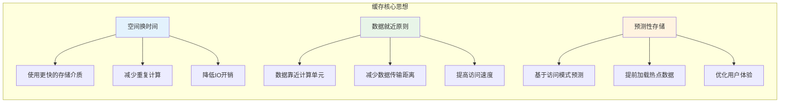

### 1.2 缓存方案思考

在深入研究任何一种缓存方案之前，最有价值的事情不是急着学API，而是带着一组本质问题去考察它。下面这几个问题，几乎可以作为评估任何缓存方案的"试金石"，也能帮助我们在选型时不被表象迷惑。

- 问题1：各种缓存方案，分别是如何保证数据安全的，其内部使用到了哪些锁？由于引入锁，给效率上带来了什么影响？
- 问题2：各种缓存方案，进程不安全是否会导致数据丢失，如何处理数据丢失情况？如何处理脏数据，其原理大概是什么？
- 问题3：各种缓存方案使用场景是什么？有什么缺陷，为了解决缺陷做了些什么？比如sp存在缺陷的替代方案是DataStore，为何这样？
- 问题4：各种缓存方案，他们的缓存效率是怎样的？如何对比？接入该库后，如何做数据迁移，如何覆盖操作？

带着这些问题去阅读源码或对比方案，你会发现每一个看似简单的"K-V存储"，其背后都隐藏着大量精妙的设计权衡。

例如SharedPreferences为何在 commit 时会引入 ANR、MMKV为何选择 mmap 而不是普通文件IO、DataStore为何强制使用协程异步API——这些设计决策的背后，正是上述问题的具体回答。

### 1.3 不同端的应用

缓存并不局限于某一个技术栈或某一类系统，而是在前端、后端、移动端、基础设施层都广泛存在。理解"缓存在不同端的差异化形态"，能够帮助我们在跨端协作的项目中（例如全栈应用、移动端+服务端配合的产品）做出更全局的优化决策。下面通过一张图，俯瞰各端的缓存类型：

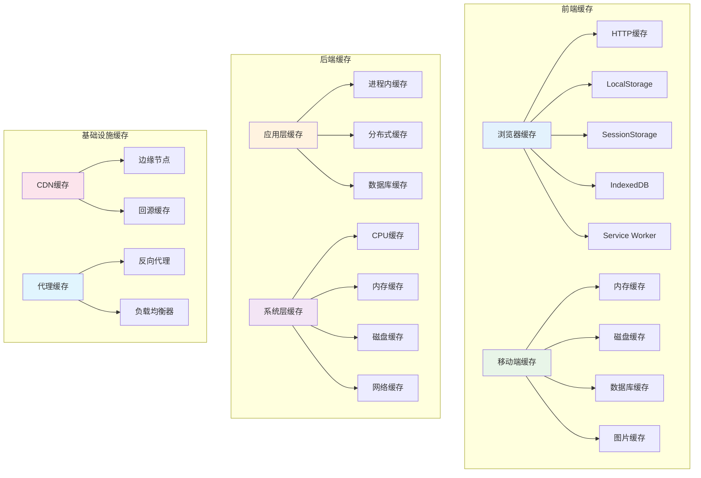

### 1.4 缓存性能原理

缓存之所以能够大幅提升性能，本质源于不同存储介质之间惊人的速度差异。下面这张图展示了从CPU寄存器到网络访问的完整速度梯度——理解这个梯度，是理解缓存价值的关键起点。

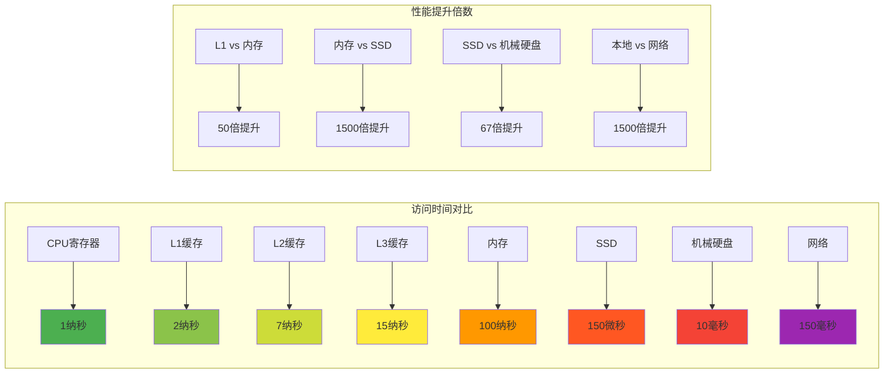

从图中可以看到，相邻两个层级之间的速度差距并非线性增长，而是数量级的跃迁：内存比SSD快约1500倍，SSD又比机械硬盘快约67倍。这种"金字塔型"的速度结构，决定了缓存设计的两条核心原则——**尽量让请求落在更上层的存储**，以及**当上层容量不足时，让最有价值的数据驻留在上层**。后续章节中讨论的LRU、LFU等淘汰算法，本质上都是在回答"哪些数据值得驻留在更快的存储里"这一问题。

## 02.缓存类型分类

> 在系统设计中，理解"有哪些类型的缓存"是做好选型的前提。缓存可以从多个维度进行分类——存储介质、访问模式、部署方式、数据生命周期等等。每一种分类视角都对应着一种不同的应用场景。本章节将从最直观的"存储介质"维度切入，逐步扩展到访问模式、部署架构等更高层的分类。

### 2.1 存储介质分类

比较常见的是内存缓存以及磁盘缓存。1.内存缓存，这里的内存主要指的存储器缓存；2.磁盘缓存，这里主要指的是外部存储器，手机的话指的就是存储卡。

内存缓存：通过预先消耗应用的一点内存来存储数据，便可快速的为应用中的组件提供数据，是一种典型的以空间换时间的策略。

磁盘缓存：读取磁盘文件要比直接从内存缓存中读取要慢一些，而且需要在一个UI主线程外的线程中进行，因为磁盘的读取速度是不能够保证的，磁盘文件缓存显然也是一种以空间换时间的策略。

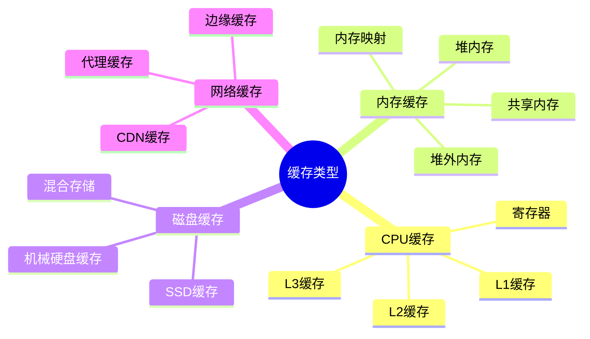

### 2.2 常见存储方案

内存缓存：存储在内存中，如果对象销毁则内存也会跟随销毁。如果是静态对象，那么进程杀死后内存会销毁。

- Map：内存缓存，一般用HashMap存储一些数据，主要存储一些临时的对象
- LruCache：内存淘汰缓存，内部使用LinkedHashMap，会淘汰最长时间未使用的对象

磁盘缓存：后台应用有可能会被杀死，那么相应的内存缓存对象也会被销毁。当你的应用重新回到前台显示时，你需要用到缓存数据时，这个时候可以用磁盘缓存。

- SharedPreferences：轻量级磁盘存储，一般存储配置属性，线程安全。建议不要存储大数据，不支持跨进程！
- MMKV：腾讯开源存储库，内部采用mmap。
- DiskLruCache：磁盘淘汰缓存，写入数据到file文件
- SqlLite：移动端轻量级数据库。主要是用来对象持久化存储。
- DataStore：旨在替代原有的 SharedPreferences，支持SharedPreferences数据的迁移
- Room/Realm/GreenDao：支持大型或复杂数据集


### 2.3 多级缓存架构

单一层级的缓存往往难以同时满足"快"和"大"两个相互矛盾的需求——内存够快但容量小，磁盘容量大但速度慢。多级缓存架构正是为了解决这一矛盾而生：通过将多种存储介质组合起来，让数据按"热度"分布在不同层级，越热的数据越靠近CPU，越冷的数据越靠近持久化存储。这种思想在硬件、操作系统、数据库、应用层都有体现，是工程设计中"分而治之"思想的典范。

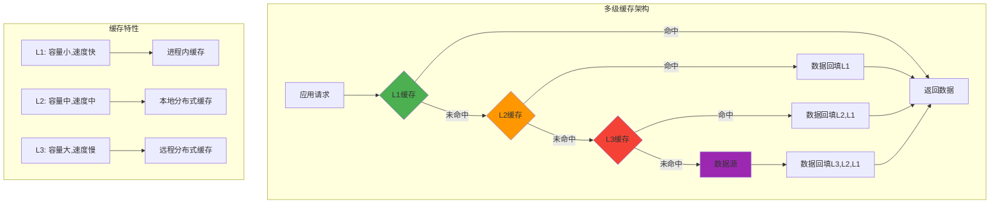

### 2.4 访问模式分类

按照"读"和"写"的关系来划分，缓存又可以分成只读缓存、读写缓存、写回缓存、写透缓存等几种典型模式。这种划分的核心意义在于——**不同的读写模式对应着不同的一致性保证和性能开销**。例如写透模式下数据强一致但写入慢，写回模式下数据弱一致但写入快。理解这些模式，是后续讨论缓存一致性问题的基础。

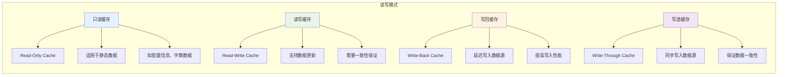

### 2.5 部署方式分类

如果说前面的分类讨论的是"缓存放在哪里"，那么部署方式分类讨论的就是"缓存如何在多机环境下分布"。这一维度直接决定了缓存系统的可扩展性、可用性和一致性策略。在单机时代，本地缓存就足以解决问题；在分布式时代，缓存如何在节点之间共享、如何避免单点故障、如何在一致性和性能之间取舍，成为架构设计的核心问题之一。

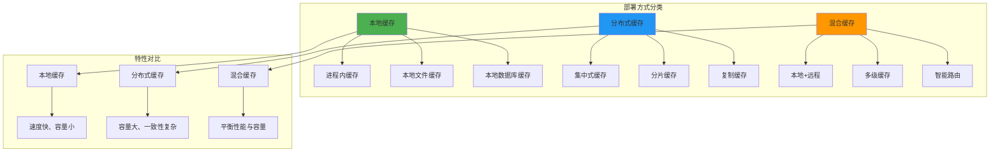

## 3.缓存使用场景

> 知道了缓存的分类，还需要明白缓存在真实业务中究竟解决了哪些问题、适合用在什么场景。"缓存不是银弹"——盲目引入缓存可能不仅没有收益，反而会引入数据一致性、缓存穿透、缓存雪崩等新问题。本章节通过具体场景，帮助读者建立"何时该用缓存、为什么用缓存、用了缓存要注意什么"的判断力。

### 3.1 主要解决问题

缓存技术诞生的根源，是为了解决系统在高并发、大数据量场景下面临的一系列性能与资源问题。这些问题通常分为三大类：性能问题（响应慢、并发低）、资源问题（数据库压力、带宽紧张）和用户体验问题（加载慢、可用性差）。下面这张图梳理了缓存所要应对的典型问题谱系：

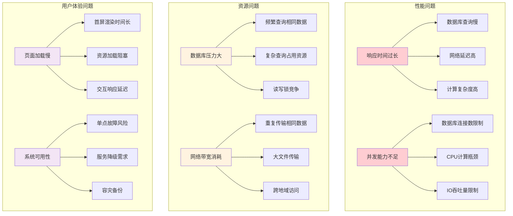

### 3.2 Web缓存场景

Web场景是最早大规模应用缓存技术的领域之一。从浏览器到CDN，再到应用服务器和数据库，整个Web请求链路中遍布着各种缓存层。一次完整的Web请求究竟会经过哪些缓存？数据在缓存命中和未命中时分别走怎样的路径？下面通过一个时序图来直观展示：

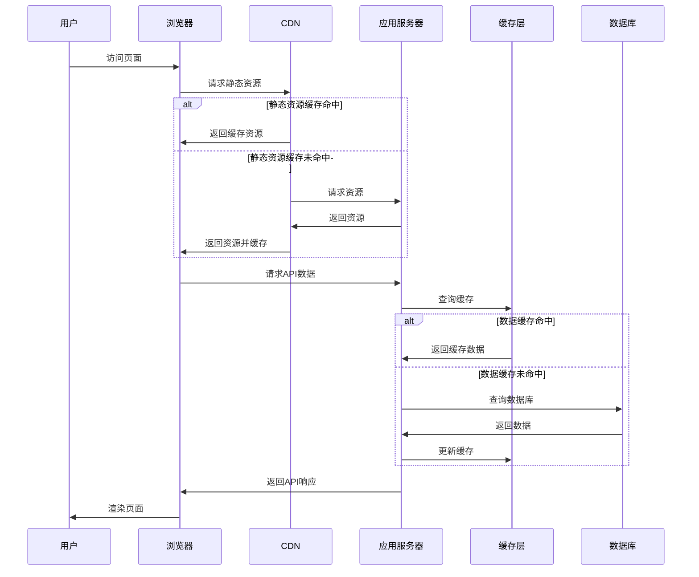

### 3.3 移动应用场景

移动端的缓存设计有其独特的约束：内存极为有限、存储空间宝贵、网络环境多变、用户对启动速度和流畅度极度敏感。这些约束使得移动端的缓存设计必须更加精细。常见的图片缓存（如Glide、Fresco）、数据缓存（如Room、MMKV）、页面缓存（如WebView离线包）都是移动端工程实践中不可或缺的能力。

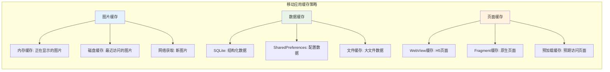

### 3.4 后端服务缓存

后端服务的缓存层次远比前端复杂——从接入层的Nginx缓存，到应用层的Redis、Memcached，再到数据层的查询缓存、连接池，最后到存储层的文件系统缓存，每一层都承担着不同的角色。这种"层层拦截"的设计思想，本质上是为了在请求到达最慢的存储介质（如机械硬盘、远程数据库）之前，尽可能在更快的层级被处理掉。

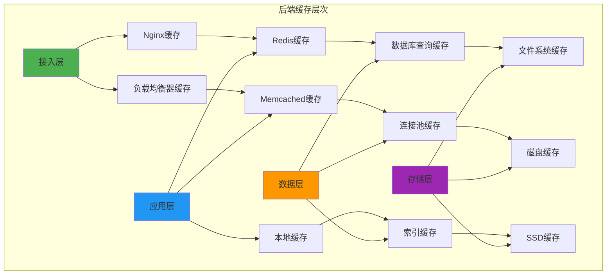

## 4.缓存设计思想

> 一个高质量的缓存系统，绝不仅仅是"把数据放到内存里"这么简单。它需要在策略选择、容量管理、失效机制、淘汰算法、阈值处理等多个维度做出周密的设计。本章节将从工程实践的视角，系统梳理缓存设计中需要考虑的核心问题，帮助读者建立起完整的缓存设计方法论。

### 4.1 通用缓存思路

> 通用缓存的设计思路主要包括以下几个方面

1. 缓存策略选择：选择适当的缓存策略是通用缓存设计的重要一步。常见的缓存策略包括最近最少使用（LRU）、最近最久未使用（LRU-K）、先进先出（FIFO）等。根据具体应用场景和需求，选择合适的缓存策略来平衡缓存的命中率和缓存空间的利用效率。
2. 缓存容量管理：通用缓存需要考虑缓存容量的管理，以避免缓存溢出或过度占用内存。可以设置缓存容量上限，并采用合适的替换策略来管理缓存中的数据，以保持缓存的有效性。
3. 数据一致性：在多线程或分布式环境下，通用缓存需要考虑数据一致性的问题。合理的缓存设计应该保证数据在缓存中的一致性，避免脏数据或数据不一致的情况发生。可以采用锁机制、缓存失效策略或一致性协议等方法来实现数据一致性。
4. 缓存预热：为了提高缓存的命中率，通用缓存可以采用缓存预热的策略。在系统启动或负载较低的时候，提前加载热门数据到缓存中，以减少后续请求的响应时间。
5. 缓存失效策略：通用缓存需要考虑缓存数据的有效期，避免过期数据的使用。可以采用基于时间的失效策略或基于数据变更的失效策略，以确保缓存中的数据始终是最新的。
6. 性能监控与调优：通用缓存设计需要进行性能监控和调优，以确保缓存的性能和效率。可以监控缓存的命中率、缓存访问时间等指标，并根据实际情况进行调整和优化。

### 4.2 缓存策略设计

如果把缓存比作一个"有限容量的容器"，那么策略设计要解决的就是"容器满了怎么办"和"容器里的东西怎么管理"这两个本质问题。下面从核心思想出发，逐步展开常见策略。

**缓存的核心思想主要是什么呢**

一般来说，缓存核心步骤主要包含缓存的添加、获取和删除这三类操作。那么为什么还要删除缓存呢？不管是内存缓存还是硬盘缓存，它们的缓存大小都是有限的。

当缓存满了之后，再想其添加缓存，这个时候就需要删除一些旧的缓存并添加新的缓存。这个跟线程池满了以后的线程处理策略相似！

**缓存的常见的策略有那些**

- FIFO(first in first out)：先进先出策略，相似队列。
- LFU(less frequently used)：最少使用策略，`RecyclerView`的缓存采用了此策略。
- LRU(least recently used)：最近最少使用策略，`Glide`在进行内存缓存的时候采用了此策略。

### 4.3 缓存容量设计

缓存容量，就是缓存的大小。每一种缓存，总会有一个最大的容量，到达这个限度以后，那么就须要进行缓存清理了框架。这个时候就需要删除一些旧的缓存并添加新的缓存。

容量设计看似简单，实则蕴含着深刻的工程权衡。容量设得太小，命中率上不去，缓存形同虚设；容量设得太大，则会挤占应用其他模块的资源，甚至引发OOM。因此，容量的本质是一个"边际收益递减"的优化问题——当容量增加到一定程度后，每多缓存一个单元能带来的命中率提升会越来越小。

使用是计数or计量，那么思考一下如何理解 计数 or 计量 ？

- 使用计数策略：1、Message 消息对象池：最多缓存 50 个对象；2、OkHttp 连接池：默认最多缓存 5 个空闲连接；3、数据库连接池
- 使用计量策略：1、图片内存缓存；2、位图池内存缓存

**计数 vs 计量的本质区别**：计数策略适用于"每个缓存单元大小相近"的场景（如对象池、连接池），用"个数"做约束既简单又直观；计量策略适用于"每个缓存单元大小差异巨大"的场景（如图片缓存，一张缩略图几KB而一张大图可能几MB），用"字节数"做约束才能真正控制内存占用。这背后体现的是工程设计中的一个普遍原则——**度量单位要与被度量对象的特性匹配**。

### 4.4 缓存失效策略

失效策略要回答的问题是："缓存里的数据什么时候应该被认为是无效的、需要重新从数据源加载？"这个问题看似简单，但答案直接关系到缓存的一致性强度和系统的复杂度。失效策略大致可以分成主动失效（数据变更时立即清除缓存）和被动失效（缓存到期或被访问时检测）两大类，前者一致性强但实现复杂，后者实现简单但存在数据不一致窗口。

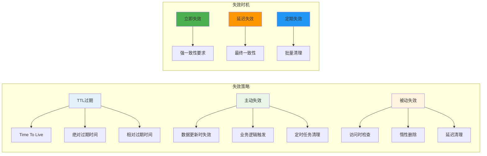

### 4.5 缓存淘汰算法

淘汰算法是缓存设计中最核心的算法问题之一。当缓存容量已满、需要为新数据腾出空间时，"淘汰谁"就成了一个关键决策。一个好的淘汰算法应该尽可能保留"未来还会被访问"的数据，淘汰"未来不太会被访问"的数据——但由于无法预知未来，算法只能基于历史访问行为做出推断。FIFO、LRU、LFU、ARC等算法，正是基于不同推断假设而设计的。

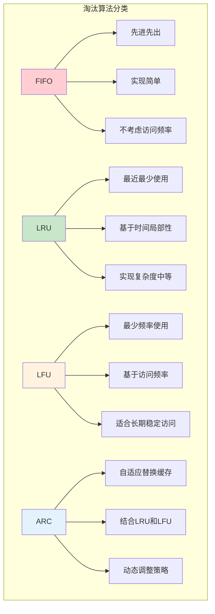

### 4.6 缓存阀值处理

阈值处理是淘汰算法在实际工程中落地时遇到的一个具体问题——当一次写入的数据非常大（例如插入一张超大图片）时，"淘汰一个旧数据"可能远远不够，需要连续淘汰多个旧数据才能腾出足够空间。这看似是一个细节问题，但若处理不当，就会导致缓存超出阈值、间接引发OOM。下面以LruCache为例展开讨论：

- 淘汰一个最早的节点就足够吗？以Lru缓存为案例做分析……
  - 标准的 LRU 策略中，每次添加数据时最多只会淘汰一个数据，但在 LRU 内存缓存中，只淘汰一个数据单元往往并不够。
  - 例如在使用 "计量" 的内存图片缓存中，在加入一个大图片后，只淘汰一个图片数据有可能依然达不到最大缓存容量限制。
- 那么在LRUCache该如何做呢？
  - 在复用 LinkedHashMap 实现 LRU 内存缓存时，前文提到的 LinkedHashMap#removeEldestEntry() 淘汰判断接口可能就不够看了，因为它每次最多只能淘汰一个数据单元。
- LruCache是如何解决这个问题
  - 这个地方就需要重写LruCache中的sizeOf()方法，然后拿到key和value对象计算其内存大小。

从这个例子可以看出，**好的工程实现往往需要对算法的标准定义做出灵活的扩展**。Android的LruCache并没有完全照搬"每次淘汰一个"的标准LRU，而是根据"计量"场景的实际需求，演化出"循环淘汰直到满足容量约束"的策略。这种"算法+工程"结合的思维方式，正是优秀框架设计者的核心能力。


### 4.7 缓存设计原则

汇总前面讨论的各种细节，可以提炼出缓存设计的几条核心原则：性能优先、一致性保证、可靠性设计、可扩展性。这四条原则之间并非完全独立，往往需要在设计时做出取舍——例如追求强一致性可能会牺牲一定的性能，追求高可用性可能会引入一定的数据冗余。优秀的缓存设计，本质上是在这些原则之间找到适合当前业务场景的平衡点。

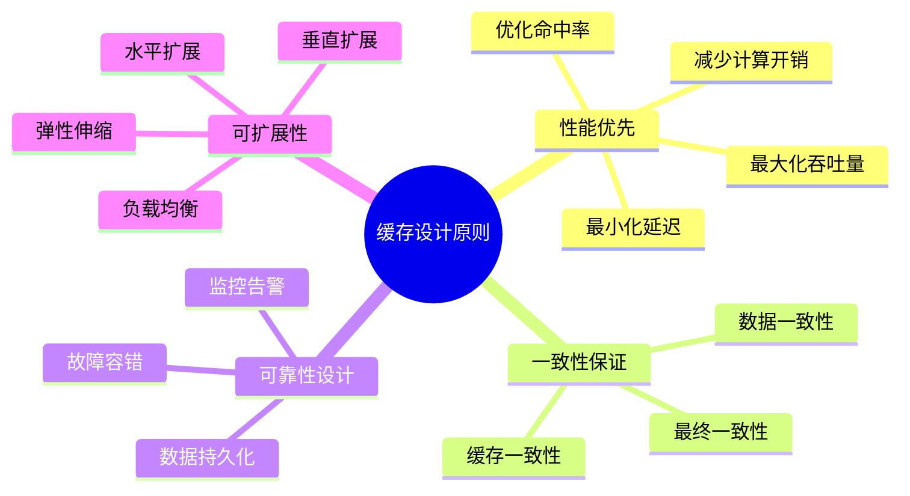

## 5.K-V框架设计

> K-V（Key-Value）存储是缓存方案中最常见的形态。本章节将以"如果让你来设计一个K-V框架，你会考虑哪些问题"为切入点，深入剖析K-V框架背后的设计思考。这种"自顶向下"的思考方式，比直接学习现成框架的API更能帮助我们建立工程思维。

### 5.1 K-V框架背景

项目中很多地方使用缓存方案 

有的用`sp`，有的用`mmkv`，有的用`lru`，有的用`DataStore`，有的用`sqlite`，如何打造通用api切换操作不同存储方案？

缓存方案众多，且各自使用场景有差异，如何选择合适的缓存方式？

针对不同场景选择什么缓存方式，同时思考如何替换之前老的存储方案，而不用花费很大的时间成本！

### 5.2 K-V框架设计

设计一个完整的K-V框架，远比想象中复杂。下面这13个问题，几乎覆盖了一个生产级K-V框架需要考虑的所有维度。每一个问题的答案，都对应着一个具体的设计决策——是用锁还是用CAS？是同步写还是异步写？是全量覆盖还是增量更新？这些决策共同塑造了一个框架的特性边界。

思考一个K-V框架的设计：

- 问题1-线程安全：使用K-V存储一般会在多线程环境中执行，因此框架有必要保证多线程并发安全，并且优化并发效率；
- 问题2-内存缓存：由于磁盘 IO 操作是耗时操作，因此框架有必要在业务层和磁盘文件之间增加一层内存缓存；
- 问题3-事务：由于磁盘 IO 操作是耗时操作，因此框架有必要将支持多次磁盘 IO 操作聚合为一次磁盘写回事务，减少访问磁盘次数；
- 问题4-事务串行化：由于程序可能由多个线程发起写回事务，因此框架有必要保证事务之间的事务串行化，避免先执行的事务覆盖后执行的事务；
- 问题5-异步或同步写回：由于磁盘 IO 是耗时操作，因此框架有必要支持后台线程异步写回；有时候又要求数据读写是同步的；
- 问题6-增量更新：由于磁盘文件内容可能很大，因此修改 K-V 时有必要支持局部修改，而不是全量覆盖修改；
- 问题7-变更回调：由于业务层可能有监听 K-V 变更的需求，因此框架有必要支持变更回调监听，并且防止出现内存泄漏；
- 问题8-多进程：由于程序可能有多进程需求，那么框架如何保证多进程数据同步？
- 问题9-可用性：由于程序运行中存在不可控的异常和 Crash，因此框架有必要尽可能保证系统可用性，尽量保证系统在遇到异常后的数据完整性；
- **问题10-高效性：性能永远是要考虑的问题，解析、读取、写入和序列化的性能如何提高和权衡**；
- 问题11-安全性：如果程序需要存储敏感数据，如何保证数据完整性和保密性；
- 问题12-数据迁移：如果项目中存在旧框架，如何将数据从旧框架迁移至新框架，并且保证可靠性；
- 问题13-研发体验：是否模板代码冗长，是否容易出错。各种K—V框架使用体验如何？

### 5.3 兼容不同缓存

在大型项目中，往往同时存在多种缓存方案——历史项目可能用SP，新模块可能用MMKV，特定场景可能用DataStore。如何让上层业务代码屏蔽这些差异，做到"切换方案而不改业务代码"？答案就是：基于面向接口编程的思想，定义统一的缓存抽象。

如何兼容不同缓存，定义通用的存储接口

- 不同的存储方案，由于api不一样，所以难以切换操作。要是想兼容不同存储方案切换，就必须自己制定一个通用缓存接口。
- 定义接口，然后各个不同存储方案实现接口，重写抽象方法。调用的时候，获取接口对象调用api，这样就可以统一Api
- 定义一个接口，这个接口有什么呢？主要是存和取各种基础类型数据，比如saveInt/readInt；saveString/readString等通用抽象方法


## 6.缓存方式考量

> 在前面的章节中，我们已经讨论了缓存的设计思想、淘汰算法、通用 K-V 框架的工程化方法。但要真正落地一个缓存系统，最终绕不开一个最朴素的问题——**缓存的数据到底放在哪里？** 是放在进程内存里、放在普通文件里、还是放在 mmap 映射的内存区域里？这三种方式，恰恰对应着移动端缓存技术演进的三个关键阶段：从早期 HashMap、LruCache 的纯内存缓存，到 SharedPreferences、SQLite 的文件缓存，再到 MMKV、Protobuf DataStore 的 mmap 缓存。理解这三种缓存方式的内在差异，是后续选择具体框架（如 MMKV）的前提。

### 6.1 内存缓存

#### 6.1.1 内存缓存的本质

内存缓存的本质，就是**把数据以对象（或对象图）的形式直接保存在进程的堆内存（Heap）或栈内存中**，整个生命周期与进程一致。一旦进程被杀死，所有内存中的数据都会随之消失。这种"易失性"既是它的缺点，也是它能够做到极致性能的根源——因为不需要任何序列化、不需要任何 IO，读写就是普通的对象引用操作，时间复杂度可以做到 O(1)。

从更深的视角看，内存缓存其实就是 CPU 缓存哲学在应用层的延续：**离计算越近，访问越快**。CPU 不是直接访问主内存，而是通过 L1/L2/L3 多级缓存；同样地，应用程序也不应该每次都去访问磁盘或网络，而应该在堆内存里维护一份"工作集"。

#### 6.1.2 常见的内存缓存形式

在 Android/Java 生态中，内存缓存的典型实现可以分成三类，它们的设计取舍各有不同：

- **HashMap / ConcurrentHashMap**：最基础的 K-V 内存容器。HashMap 不保证线程安全，适合单线程或外部加锁的场景；ConcurrentHashMap 通过分段锁（JDK 7）或 CAS+synchronized（JDK 8）保证并发安全。它们都没有容量上限，所以**只适合存储数量可控的对象**（如配置项、单例数据），否则会有 OOM 风险。
- **LruCache**：在 LinkedHashMap 基础上封装的有界缓存，引入了 LRU 淘汰策略和 sizeOf 计量能力。这是 Android 平台最常用的内存缓存方案，从 Glide 的 BitmapPool 到 OkHttp 的 ResponseCache，背后都能看到 LruCache 的身影。
- **对象池（Object Pool）**：用于复用昂贵对象（如 Bitmap、网络连接、线程）。它和普通缓存的区别是：**对象池关注"复用"而非"查询"**——你不通过 key 取一个特定对象，而是从池中借一个空闲对象出来用，用完归还。Message.obtain()、OkHttp 的 ConnectionPool 都是这种模式。

#### 6.1.3 内存缓存的优势与代价

内存缓存的优势非常突出：**纳秒级访问速度、零序列化开销、API 极简**。但它的代价同样不可忽视——首先，**进程一死数据就没了**，意味着不能用它存储需要持久化的状态；其次，**内存是稀缺资源**，特别是在移动端，单个 App 的可用堆内存往往只有几百 MB，过度缓存会挤占业务模块的内存，甚至引发 OOM；最后，**内存缓存天然不支持跨进程共享**，多进程场景下每个进程都得维护一份自己的缓存。

#### 6.1.4 内存缓存适用场景

综合上面的优劣分析，可以总结出内存缓存最适合的几类场景：

- **生命周期与进程一致的临时数据**：比如当前用户信息、当前页面的 ViewModel 状态。
- **加速磁盘/网络访问的二级缓存**：比如 Glide 中"内存缓存→磁盘缓存→网络"的三级结构里的最上层。
- **频繁读写但不需要持久化的对象**：比如热点配置、解析后的对象图。

记住一个判断口诀——**"如果数据丢了你不在乎，那就放内存；如果数据丢了用户会投诉，那就要落盘"**。

### 6.2 文件缓存

#### 6.2.1 文件缓存的本质

文件缓存的本质，是**通过操作系统的文件 IO 接口（open/read/write/close）将数据持久化到磁盘**。和内存缓存最大的区别在于——**数据可以跨进程、跨重启地保留**。但代价是每次读写都要经过用户态↔内核态的切换、系统调用的开销，以及最终的磁盘 IO，性能比内存缓存慢几个数量级。

文件缓存背后涉及的机制远比表面看起来复杂。一次普通的 write() 调用，数据并不会立刻落到磁盘上，而是先写入内核的 Page Cache，由内核异步 flush 到磁盘；read() 调用也会优先从 Page Cache 读取，没有命中才真正读磁盘。这种"操作系统层面的缓存"机制，对应用是透明的，但深刻影响着我们对"文件 IO 性能"的判断——**第一次读慢、之后读都很快**，这恰恰就是 Page Cache 在背后默默工作。

#### 6.2.2 常见的文件缓存形式

按照存储格式和组织方式，文件缓存可以分成几种典型形态：

- **结构化文本文件**：典型代表是 SharedPreferences 的 XML 文件、配置中心的 JSON 文件。优点是人类可读、便于调试；缺点是序列化/反序列化开销大、每次都要全量解析整个文件。
- **二进制文件 + 自定义协议**：典型代表是 DiskLruCache。它将每个 K-V 单独存为一个磁盘文件，并通过一个 journal 日志文件记录所有操作。这种设计提供了类事务的语义和断电恢复能力。
- **嵌入式数据库**：典型代表是 SQLite、Realm、Room。它们提供了类 SQL 的查询能力、ACID 事务和索引，适合存储**结构化、关系性、需要复杂查询**的数据。
- **基于 Protobuf 的强 schema 文件**：典型代表是 DataStore (Proto)。它通过 Protobuf 提供了类型安全和兼容性保证，是结构化文本文件的现代化继任者。

#### 6.2.3 SharedPreferences 的文件缓存机制剖析

SharedPreferences 是文件缓存中最具教学意义的反面案例，理解了它的"坑"，就理解了文件缓存的核心痛点。它的工作流程大致如下：

1. **首次访问**：通过 `Context.getSharedPreferences()` 时，会一次性读取整个 XML 文件，解析成 HashMap 缓存在内存中。
2. **读取**：所有 get 操作直接从内存 HashMap 读，不再访问磁盘。
3. **写入**：每次 put 后调用 commit() 或 apply()，都会**将整个 HashMap 全量序列化为 XML 写回文件**，而非增量更新。

这个流程暴露了文件缓存的几个典型问题——**全量写入放大了 IO 开销、解析成本与文件大小成正比、commit 的同步写入会阻塞主线程**。这些问题不是 SharedPreferences 的特例，而是"基于普通文件 IO 的缓存"的通病，正是这些问题的存在，催生了 mmap 映射缓存这一类新方案。

#### 6.2.4 文件缓存的优势与代价

| 维度 | 文件缓存 |
|------|---------|
| 持久性 | 强（可跨进程、跨重启） |
| 性能 | 中（受磁盘 IO 速度制约） |
| 容量 | 大（磁盘空间通常远大于内存） |
| 复杂度 | 中高（需处理并发、事务、损坏恢复） |
| 适用场景 | 用户配置、登录态、离线数据、日志 |

#### 6.2.5 文件缓存的最佳实践

要写好一个文件缓存，至少需要考虑下面几点：

- **批量写入**：避免每修改一个字段就 flush 一次，应当聚合多次修改为一次写入。
- **异步写**：尽量不要在主线程做磁盘 IO，使用后台线程或协程。
- **校验与恢复**：增加 CRC 校验或 magic number，能在文件损坏时及时发现并恢复到上一个有效版本。
- **增量更新**：如果文件较大，应当支持局部修改而非全量覆盖（这正是 MMKV 相比 SP 的核心优化之一）。

### 6.3 mmap映射缓存

#### 6.3.1 什么是 mmap

mmap（memory map，内存映射文件）是 Linux/Unix 提供的一种高级文件 IO 机制。它通过 `mmap()` 系统调用，**将一个文件（或文件的一部分）直接映射到进程的虚拟地址空间**，使得文件内容可以像普通内存一样被读写——不需要 read/write 系统调用，不需要 buffer 拷贝，所有的同步工作都由操作系统的虚拟内存管理（VMM）和 Page Cache 自动完成。

简单来说，mmap 让"文件"和"内存"之间的边界变得模糊：**你写内存，操作系统负责把数据落到文件；你读内存，操作系统负责把文件加载进来**。这种"零拷贝"的访问模式，正是 mmap 性能远超普通文件 IO 的根本原因。

#### 6.3.2 mmap 的核心原理

要真正理解 mmap，需要先理解几个关键概念：

- **虚拟内存与物理内存**：现代操作系统对每个进程都呈现一个独立的、连续的虚拟地址空间，由 MMU 通过页表映射到实际的物理内存页。
- **缺页中断（Page Fault）**：当进程访问一个尚未加载到物理内存的虚拟页时，会触发缺页中断，操作系统会自动从磁盘读取对应的文件内容到物理内存，并更新页表。
- **写回策略**：mmap 区域的修改不会立刻同步到磁盘，而是由内核根据脏页比例、时间间隔等策略异步写回。也可以通过 `msync()` 主动触发同步。

mmap 的整个工作流程可以概括为下面这张图：

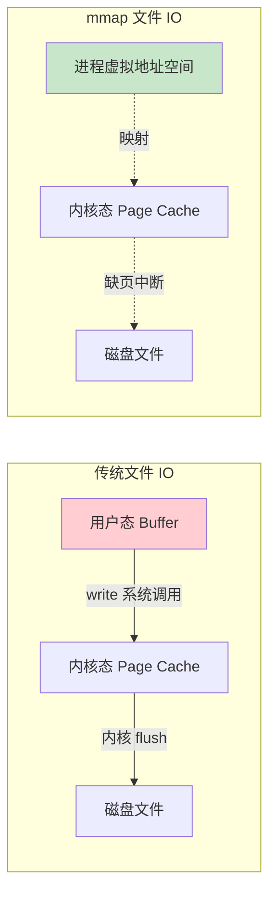

可以看到，**传统 IO 多了一次"用户态 Buffer ↔ 内核 Page Cache"的拷贝**，而 mmap 让用户态直接访问到了内核的 Page Cache，省掉了这次拷贝。

#### 6.3.3 mmap 相比传统文件 IO 的优势

mmap 的优势主要体现在以下几个方面：

- **零拷贝（Zero-Copy）**：减少了一次内存拷贝，IO 路径更短。
- **按需加载（Demand Paging）**：通过缺页中断机制，只把实际访问的页加载到内存，对大文件极为友好——比如映射一个 100MB 的文件，只读其中 1KB，物理内存中也只会驻留对应的几页。
- **天然支持随机访问**：你可以用指针直接跳到文件任意位置，不需要 lseek。
- **天然支持跨进程共享**：多个进程映射同一个文件时，可以通过共享页面实现高效的 IPC。
- **崩溃安全性更高**：即使进程突然崩溃，已经写入 mmap 区域的数据，由于是内核来负责 flush，大概率能保留到磁盘上——这正是 MMKV 选择 mmap 的核心原因之一。

#### 6.3.4 mmap 的局限性

mmap 并非银弹，它也有几个不容忽视的局限：

- **不适合频繁顺序读写小文件**：mmap 的开销主要在建立映射本身（malloc 虚拟地址、缺页中断），对于一次性小文件操作，普通 IO 反而更快。
- **不适合超大文件**：32 位系统上虚拟地址空间有限（约 3GB），无法映射超过此大小的文件。
- **数据同步存在窗口**：写到 mmap 区域并不等于写到磁盘，机器掉电时可能丢失尚未 flush 的数据。需要靠 msync 或其他机制保证一致性。
- **接口偏底层**：直接使用 mmap 需要处理对齐、大小、生命周期等细节，不如普通 IO 直观。

#### 6.3.5 mmap 在缓存场景的典型应用

在缓存领域，mmap 已经被广泛应用于几个典型场景：

- **MMKV**：腾讯开源的键值存储，基于 mmap + protobuf，是 SharedPreferences 的高性能替代方案。
- **Bitcask（Riak 存储引擎）**：基于 mmap 的高性能 K-V 存储引擎。
- **LevelDB / RocksDB 的 SSTable 读取**：通过 mmap 映射 SSTable 文件，实现高效随机查询。
- **Lucene 的索引文件读取**：使用 MMapDirectory 加速索引访问。

下一章我们就会以 MMKV 为例，深入剖析"基于 mmap 设计一个工业级 K-V 缓存"的全部细节。

#### 6.3.6 三种缓存方式综合对比

最后，我们用一张表格综合对比内存缓存、文件缓存、mmap 缓存这三种方式：

| 维度 | 内存缓存 | 文件缓存 | mmap 缓存 |
|------|---------|---------|-----------|
| 持久化 | 否 | 是 | 是 |
| 读写性能 | 极快（纳秒级） | 慢（毫秒级） | 快（接近内存） |
| 容量上限 | 受堆内存限制 | 受磁盘空间限制 | 受虚拟地址空间限制 |
| 跨进程共享 | 不支持 | 支持（需加锁） | 天然支持 |
| 崩溃安全 | 数据全部丢失 | 取决于是否 flush | 大部分能保留 |
| 实现复杂度 | 低 | 中 | 中高 |
| 典型代表 | LruCache、HashMap | SP、SQLite、DiskLruCache | MMKV、LevelDB |

可以看出，**mmap 缓存几乎在所有维度都优于普通文件缓存**，唯一的成本是实现复杂度更高。这也正是 MMKV 这类基于 mmap 的方案能够崛起、并逐步取代 SharedPreferences 的根本原因。

## 5.LRU缓存原理

> LRU（Least Recently Used）是工程中应用最广泛的淘汰算法之一，几乎所有的成熟缓存框架都内置了LRU实现。本章节将从算法思想、数据结构、操作流程到具体代码，层层深入地剖析LRU的工作原理，并对比介绍另一种重要的淘汰算法LFU。

在LruCache的源码中，关于LruCache有这样的一段介绍：

cache对象通过一个强引用来访问内容。每次当一个item被访问到的时候，这个item就会被移动到一个队列的队首。当一个item被添加到已经满了的队列时，这个队列的队尾的item就会被移除。

### 5.1 LRU算法思想

LRU是近期最少使用的算法，它的核心思想是当缓存满时，会优先淘汰那些近期最少使用的缓存对象。

```mermaid
graph LR
    subgraph "LRU核心思想"
        A[时间局部性原理] --> A1[最近访问的数据]
        A --> A2[很可能再次被访问]
        
        B[淘汰策略] --> B1[淘汰最久未使用的数据]
        B --> B2[为新数据腾出空间]
        
        C[数据结构] --> C1[双向链表 + 哈希表]
        C --> C2[O(1)时间复杂度]
    end
    
    style A fill:#e3f2fd
    style B fill:#e8f5e8
    style C fill:#fff3e0
```

采用LRU算法的缓存有两种：LrhCache和DiskLruCache，分别用于实现内存缓存和硬盘缓存，其核心思想都是LRU缓存算法。


LruCache使用是计数or计量，针对计数策略使用Lru仅仅只统计缓存单元的个数，针对计量则要复杂一点。

### 5.2 LRU数据结构设计

LRU之所以能够在工程中广泛应用，关键在于它能用极简的数据结构实现 O(1) 的查找、插入和删除操作。这背后的核心技巧，是"哈希表+双向链表"的组合——哈希表负责 O(1) 查找节点位置，双向链表负责 O(1) 维护访问顺序。两种结构相互配合，缺一不可。这种"组合多种基础数据结构来达到目标性能"的思路，是算法设计中非常典型的模式。

```mermaid
graph TB
    subgraph "LRU Cache结构"
        A[HashMap] --> A1[key -> Node映射]
        A --> A2[O(1)查找时间]
        
        B[双向链表] --> B1[维护访问顺序]
        B --> B2[头部: 最近访问]
        B --> B3[尾部: 最久未访问]
        
        C[Node节点] --> C1[key: 键值]
        C --> C2[value: 数据值]
        C --> C3[prev: 前驱指针]
        C --> C4[next: 后继指针]
    end
    
    A1 --> C
    B1 --> C
    
    style A fill:#4caf50
    style B fill:#2196f3
    style C fill:#ff9800
```

### 5.3 LRU操作流程

理解了数据结构后，再看具体的操作流程就会非常清晰。LRU 的两个核心操作是 GET 和 PUT，每次操作都会触发"链表节点的位置调整"。GET 命中时把节点移到头部、PUT 时若已满则淘汰尾节点——这两条规则就足以保证整个链表始终维持着"按最近访问时间排序"的不变量（invariant）。

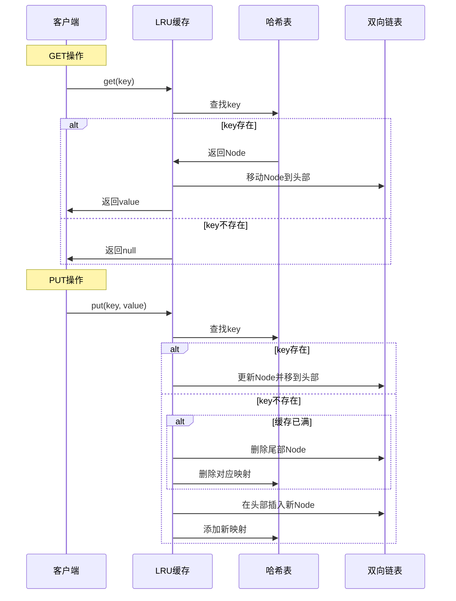

### 5.4 LRU实现代码

下面给出一份典型的 LRU Cache C++ 实现。代码中采用了一个常见的工程技巧——**虚拟头尾节点（dummy head/tail）**。引入两个不存储数据的哨兵节点后，链表的所有插入和删除操作都可以避免边界判断（无需特判"链表为空"或"操作首尾节点"），使代码更简洁、更不易出错。

```cpp
class LRUCache {
private:
    struct Node {
        int key, value;
        Node* prev;
        Node* next;
        Node(int k = 0, int v = 0) : key(k), value(v), prev(nullptr), next(nullptr) {}
    };
    
    unordered_map<int, Node*> cache;
    Node* head;
    Node* tail;
    int capacity;
    
    void addToHead(Node* node) {
        node->prev = head;
        node->next = head->next;
        head->next->prev = node;
        head->next = node;
    }
    
    void removeNode(Node* node) {
        node->prev->next = node->next;
        node->next->prev = node->prev;
    }
    
    void moveToHead(Node* node) {
        removeNode(node);
        addToHead(node);
    }
    
    Node* removeTail() {
        Node* lastNode = tail->prev;
        removeNode(lastNode);
        return lastNode;
    }
    
public:
    LRUCache(int capacity) : capacity(capacity) {
        head = new Node();
        tail = new Node();
        head->next = tail;
        tail->prev = head;
    }
    
    int get(int key) {
        auto it = cache.find(key);
        if (it == cache.end()) {
            return -1;
        }
        
        Node* node = it->second;
        moveToHead(node);
        return node->value;
    }
    
    void put(int key, int value) {
        auto it = cache.find(key);
        
        if (it != cache.end()) {
            Node* node = it->second;
            node->value = value;
            moveToHead(node);
        } else {
            Node* newNode = new Node(key, value);
            
            if (cache.size() >= capacity) {
                Node* tail_node = removeTail();
                cache.erase(tail_node->key);
                delete tail_node;
            }
            
            cache[key] = newNode;
            addToHead(newNode);
        }
    }
};
```

### 5.5 LFU算法设计

LRU 关注"最近"，而 LFU（Least Frequently Used）关注"频率"——它假设访问频率高的数据未来更可能被访问。这一假设在某些场景下比 LRU 更合理，例如热点数据相对稳定的内容分发场景。但 LFU 的实现比 LRU 复杂得多，需要同时维护"频率统计"、"最小频率追踪"、"同频率内的 LRU 顺序"等多个结构，才能在 O(1) 时间内完成所有操作。下面通过一张图直观展示其内部组件：

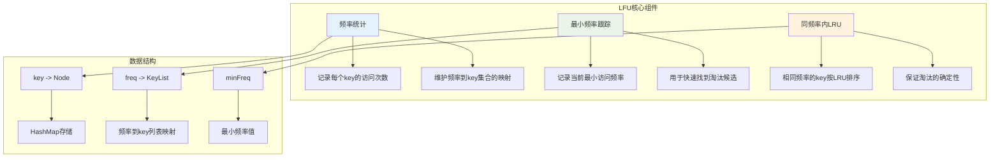

## 6.通用缓存策略

> 不同的缓存场景需要匹配不同的策略——是用固定 TTL 还是动态 TTL？是单层缓存还是多层缓存？是惰性删除还是定期删除？本章节聚焦于通用缓存策略层面的设计，特别是过期处理、TTL 设计、分层架构等工程化问题，帮助读者掌握"策略匹配场景"的设计思维。

### 6.1 过期策略分类

说一个使用场景：比如你准备做WebView的资源拦截缓存，针对模版页面，为了提交加载速度。会缓存css，js，图片等资源到本地。那么如何选择存储方案，如何处理过期问题？

思考一下该问题：比如WebView缓存方案是数据库存储，db文件。针对缓存数据，猜想思路可能是Lru策略，或者标记时间清除过期文件。

那么缓存过期处理的策略有哪些

- 定时过期：每个设置过期时间的key都需要创建⼀个定时器，到过期时间就会立即清除。
- 惰性过期：只有当访问⼀个 key 时，才会判断该key是否已过期，过期则清除。
- 定期过期：每隔⼀定的时间，会扫描⼀定数量的数据库的 expires 字典中⼀定数量的key（是随机的）， 并 清除其中已过期的key 。
- 分桶策略：定期过期的优化，将过期时间点相近的 key 放在⼀起，按时间扫描分桶。

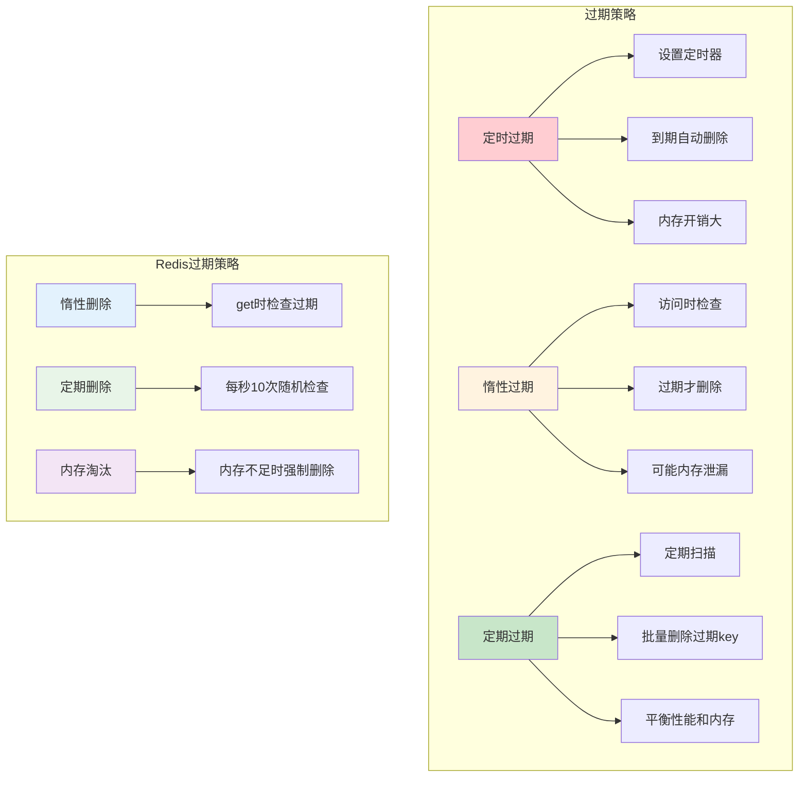

### 6.2 TTL设计模式

TTL（Time To Live，存活时间）是过期策略中最核心的参数。看似只是设置一个超时秒数，实则蕴含丰富的设计模式——固定 TTL 简单但易引发缓存雪崩，随机 TTL 能错峰失效但不利于精确控制，分层 TTL 能按重要性区分但增加管理复杂度，动态 TTL 最智能但实现成本最高。理解这些模式的优劣势，才能根据业务特点做出合理选型。

```mermaid
graph LR
    subgraph "TTL设计模式"
        A[固定TTL] --> A1[所有数据相同过期时间]
        A --> A2[简单但可能缓存雪崩]
        
        B[随机TTL] --> B1[TTL加随机偏移]
        B --> B2[避免同时过期]
        
        C[分层TTL] --> C1[不同类型数据不同TTL]
        C --> C2[根据重要性设置]
        
        D[动态TTL] --> D1[根据访问频率调整]
        D --> D2[热点数据延长TTL]
    end
    
    style A fill:#ffcdd2
    style B fill:#fff3e0
    style C fill:#e8f5e8
    style D fill:#c8e6c9
```

### 6.3 淘汰策略对比

不同的淘汰策略适用于不同的访问模式。下表从多个维度对常见策略做一个直观对比，方便在实际选型时参考：

| 策略 | 实现复杂度 | 时间复杂度 | 适用场景 | 主要缺点 |
|------|-----------|-----------|---------|---------|
| FIFO | 低 | O(1) | 访问模式无明显热点 | 不考虑访问频率，命中率低 |
| LRU | 中 | O(1) | 时间局部性明显 | 偶发的批量扫描会污染缓存 |
| LFU | 高 | O(1) | 长期稳定的热点访问 | 新数据不易"翻身"，难适应变化 |
| ARC | 高 | O(1) | 访问模式动态变化 | 实现复杂度高，调参困难 |
| LRU-K | 中高 | O(1) | 需要避免偶发访问污染 | 需要维护历史访问队列 |

实际工程中，并不存在"绝对最优"的淘汰策略，关键是要**根据业务的访问模式做出选择**。例如对于Glide这类图片缓存场景，LRU就足够好用；而对于CDN这种长期稳定热点的场景，LFU或其变种往往效果更佳。

### 6.4 分层架构设计

分层缓存架构是大型系统中最常见的缓存模式。它的设计哲学非常符合"边际效益递减"规律——越靠近请求方的层，速度越快、容量越小、成本越高；越靠近数据源的层，速度越慢、容量越大、成本越低。通过合理分层，让大部分请求在最贴近请求方的层就能被处理，从而极大降低对后端存储的压力。

```mermaid
graph TB
    subgraph "分层缓存架构"
        A[L1: 进程内缓存] --> A1[容量: 小]
        A --> A2[速度: 极快]
        A --> A3[一致性: 弱]
        
        B[L2: 本地缓存] --> B1[容量: 中]
        B --> B2[速度: 快]
        B --> B3[一致性: 中]
        
        C[L3: 分布式缓存] --> C1[容量: 大]
        C --> C2[速度: 中]
        C --> C3[一致性: 强]
        
        D[L4: 数据源] --> D1[容量: 最大]
        D --> D2[速度: 慢]
        D --> D3[一致性: 最强]
    end
    
    A --> B
    B --> C
    C --> D
    
    style A fill:#4caf50
    style B fill:#8bc34a
    style C fill:#cddc39
    style D fill:#ffeb3b
```

### 6.5 分层缓存数据流

理解了分层架构的静态结构，再看动态的数据流就能更深入地体会其工作机制。一次完整的查询请求，会按照"L1 → L2 → L3 → 数据源"的顺序逐层下探，命中即返回；任何一层未命中并最终从下层加载到数据后，会**逐层回填上层缓存**——这种"读穿透+回填"的模式，让热点数据自然而然地"上浮"到最快的层级。

```mermaid
sequenceDiagram
    participant App as 应用
    participant L1 as L1缓存
    participant L2 as L2缓存
    participant L3 as L3缓存
    participant DB as 数据库
    
    App->>L1: 查询数据
    
    alt L1命中
        L1->>App: 返回数据
    else L1未命中
        L1->>L2: 查询L2
        
        alt L2命中
            L2->>L1: 返回数据并更新L1
            L1->>App: 返回数据
        else L2未命中
            L2->>L3: 查询L3
            
            alt L3命中
                L3->>L2: 返回数据并更新L2
                L2->>L1: 更新L1
                L1->>App: 返回数据
            else L3未命中
                L3->>DB: 查询数据库
                DB->>L3: 返回数据并更新L3
                L3->>L2: 更新L2
                L2->>L1: 更新L1
                L1->>App: 返回数据
            end
        end
    end
```

## 7. 缓存设计哲学与权衡

> 走到这里，我们已经掌握了大量缓存技术的"招式"。但真正决定一个工程师水平上限的，并非掌握多少招式，而是能否在复杂场景下做出合适的权衡。本章节跳出具体技术细节，回到缓存设计的哲学层面，讨论"性能 vs 一致性"、"容量 vs 成本"、"复杂度 vs 效果"等永恒话题，并结合电商、社交媒体等典型业务场景给出实战经验。

### 7.1 缓存设计哲学

#### 7.1.1 核心设计理念

```mermaid
mindmap
  root((缓存设计哲学))
    简单性原则
      KISS原则
      避免过度设计
      易于理解和维护
      降低复杂度
    性能优先
      响应时间最小化
      吞吐量最大化
      资源利用率优化
      用户体验提升
    可靠性保证
      数据一致性
      故障容错
      优雅降级
      监控告警
    可扩展性
      水平扩展能力
      垂直扩展能力
      弹性伸缩
      未来需求适应
    成本效益
      开发成本
      运维成本
      硬件成本
      机会成本
```

#### 7.1.2 设计权衡矩阵

```mermaid
graph TB
    subgraph "缓存设计权衡"
        A[性能 vs 一致性] --> A1[强一致性牺牲性能]
        A --> A2[高性能可能数据不一致]
        
        B[容量 vs 成本] --> B1[大容量高成本]
        B --> B2[成本控制限制容量]
        
        C[复杂度 vs 效果] --> C1[复杂算法效果好]
        C --> C2[简单方案易维护]
        
        D[可用性 vs 一致性] --> D1[高可用可能数据不一致]
        D --> D2[强一致性可能影响可用性]
    end
    
    subgraph "权衡策略"
        E[业务优先级] --> E1[根据业务重要性选择]
        F[分层设计] --> F1[不同层级不同策略]
        G[动态调整] --> G1[根据运行时状态调整]
        H[监控反馈] --> H1[基于监控数据优化]
    end
    
    A --> E
    B --> F
    C --> G
    D --> H
    
    style A fill:#ffcdd2
    style B fill:#fff3e0
    style C fill:#f3e5f5
    style D fill:#fce4ec
    style E fill:#c8e6c9
    style F fill:#c8e6c9
    style G fill:#c8e6c9
    style H fill:#c8e6c9
```

### 7.2 实际应用中的权衡

设计哲学若不能落到具体业务场景，就只是纸上谈兵。下面以电商系统和社交媒体两个典型业务为例，看不同业务特征下缓存策略的差异化设计。读者也可以由此触类旁通，将这种"业务特征→缓存策略"的映射思维用到自己的项目中。

#### 7.2.1 电商系统缓存权衡

```mermaid
graph LR
    subgraph "电商系统缓存策略"
        A[商品信息] --> A1[读多写少]
        A --> A2[可接受短暂不一致]
        A --> A3[使用TTL + 异步更新]
        
        B[库存信息] --> B1[读写频繁]
        B --> B2[强一致性要求]
        B --> B3[使用分布式锁 + 短TTL]
        
        C[用户会话] --> C1[读写频繁]
        C --> C2[可用性优先]
        C --> C3[使用本地缓存 + 复制]
        
        D[订单信息] --> D1[写多读少]
        D --> D2[强一致性要求]
        D --> D3[直接操作数据库]
    end
    
    style A fill:#c8e6c9
    style B fill:#fff3e0
    style C fill:#e3f2fd
    style D fill:#ffcdd2
```

#### 7.2.2 社交媒体缓存权衡

```mermaid
graph TD
    subgraph "社交媒体缓存策略"
        A[用户动态] --> A1[时效性要求高]
        A --> A2[可接受最终一致性]
        A --> A3[多级缓存 + 推拉结合]
        
        B[热门内容] --> B1[访问量巨大]
        B --> B2[读多写少]
        B --> B3[CDN + 长TTL]
        
        C[用户关系] --> C1[变化频率低]
        C --> C2[一致性要求中等]
        C --> C3[本地缓存 + 定期同步]
        
        D[实时消息] --> D1[实时性要求极高]
        D --> D2[可用性优先]
        D --> D3[内存队列 + 持久化]
    end
    
    style A fill:#e8f5e8
    style B fill:#e3f2fd
    style C fill:#fff3e0
    style D fill:#f3e5f5
```

### 7.3 缓存反模式与最佳实践

谈完了"应该怎么做"，更应该看看"千万不能怎么做"。缓存领域有几个"经典坑"——缓存穿透、缓存雪崩、缓存击穿、缓存污染——这四大反模式几乎每一个做过中大型项目的工程师都遇到过。理解这些反模式的成因和解决方案，能帮我们在未来的设计中提前规避风险。

#### 7.3.1 常见反模式

```mermaid
graph LR
    subgraph "缓存反模式"
        A[缓存穿透] --> A1[查询不存在的数据]
        A --> A2[绕过缓存直击数据库]
        A --> A3[解决: 布隆过滤器/空值缓存]
        
        B[缓存雪崩] --> B1[大量缓存同时失效]
        B --> B2[数据库压力激增]
        B --> B3[解决: 随机TTL/熔断机制]
        
        C[缓存击穿] --> C1[热点数据过期]
        C --> C2[并发请求击穿缓存]
        C --> C3[解决: 分布式锁/预加载]
        
        D[缓存污染] --> D1[低频数据占用缓存]
        D --> D2[影响缓存命中率]
        D --> D3[解决: 智能淘汰算法]
    end
    
    style A fill:#ffcdd2
    style B fill:#ffcdd2
    style C fill:#ffcdd2
    style D fill:#ffcdd2
```

#### 7.3.2 最佳实践总结

```mermaid
graph TD
    subgraph "缓存最佳实践"
        A[设计阶段] --> A1[明确缓存目标]
        A --> A2[选择合适的缓存类型]
        A --> A3[设计合理的key结构]
        A --> A4[规划容量和TTL]
        
        B[实现阶段] --> B1[实现缓存预热]
        B --> B2[处理缓存穿透]
        B --> B3[避免缓存雪崩]
        B --> B4[保证数据一致性]
        
        C[运维阶段] --> C1[监控缓存指标]
        C --> C2[定期性能调优]
        C --> C3[容量规划调整]
        C --> C4[故障应急处理]
        
        D[优化阶段] --> D1[分析访问模式]
        D --> D2[优化缓存策略]
        D --> D3[调整淘汰算法]
        D --> D4[升级缓存架构]
    end
    
    style A fill:#e3f2fd
    style B fill:#e8f5e8
    style C fill:#fff3e0
    style D fill:#f3e5f5
```

---

## 8. 局部性原理与分层实现

> 缓存为什么能生效？这个问题的根本答案，藏在计算机科学中一个最基础也最深刻的概念里——**局部性原理**。本章节从局部性原理出发，自顶向下地讨论它如何在 CPU 缓存、应用层缓存、CDN 等不同层次中得到体现，并进一步介绍预取策略、性能优化等高级话题。

### 8.1 局部性原理详解

#### 8.1.1 局部性原理基础

```mermaid
graph TB
    subgraph "局部性原理"
        A[时间局部性] --> A1[最近访问的数据]
        A --> A2[很可能再次被访问]
        A --> A3[基础: 程序执行的循环性]
        
        B[空间局部性] --> B1[相邻的数据]
        B --> B2[很可能被一起访问]
        B --> B3[基础: 数据结构的连续性]
        
        C[顺序局部性] --> C1[按顺序访问的数据]
        C --> C2[下一个数据很可能被访问]
        C --> C3[基础: 程序执行的顺序性]
    end
    
    subgraph "缓存有效性原因"
        D[程序行为特征] --> D1[80/20法则]
        D --> D2[热点数据集中]
        D --> D3[访问模式可预测]
        
        E[数据访问模式] --> E1[循环访问]
        E --> E2[批量访问]
        E --> E3[关联访问]
    end
    
    A --> D
    B --> E
    C --> E
    
    style A fill:#e3f2fd
    style B fill:#e8f5e8
    style C fill:#fff3e0
    style D fill:#4caf50
    style E fill:#4caf50
```

#### 8.1.2 局部性原理在不同场景的体现

```mermaid
graph LR
    subgraph "Web应用局部性"
        A[用户行为] --> A1[浏览相关页面]
        A --> A2[重复访问收藏页面]
        A --> A3[按时间顺序浏览]
        
        B[数据访问] --> B1[用户信息频繁查询]
        B --> B2[相关商品一起展示]
        B --> B3[热门内容集中访问]
    end
    
    subgraph "数据库局部性"
        C[查询模式] --> C1[相同条件重复查询]
        C --> C2[关联表连接查询]
        C --> C3[范围查询连续数据]
        
        D[索引访问] --> D1[B+树顺序访问]
        D --> D2[热点索引页面]
        D --> D3[相邻记录批量读取]
    end
    
    style A fill:#e3f2fd
    style B fill:#e8f5e8
    style C fill:#fff3e0
    style D fill:#f3e5f5
```

### 8.2 分层缓存实现

局部性原理在硬件层面被发挥到了极致——CPU 的 L1/L2/L3 缓存就是教科书级的分层缓存设计。理解了硬件层的分层思想，再看应用层的分层缓存（浏览器→CDN→应用→数据库）就会发现：**它们遵循的是同一套设计哲学，只是在不同的尺度上展开**。这种"思想跨层级复用"的现象，正是计算机科学优雅之处的体现。

#### 8.2.1 CPU缓存层次

```mermaid
graph TB
    subgraph "CPU缓存层次结构"
        A[CPU核心] --> B[L1缓存]
        B --> C[L2缓存]
        C --> D[L3缓存]
        D --> E[主内存]
        
        F[L1特性] --> F1[容量: 32KB-64KB]
        F --> F2[延迟: 1-2周期]
        F --> F3[带宽: 最高]
        
        G[L2特性] --> G1[容量: 256KB-1MB]
        G --> G2[延迟: 3-7周期]
        G --> G3[带宽: 高]
        
        H[L3特性] --> H1[容量: 8MB-32MB]
        H --> H2[延迟: 15-30周期]
        H --> H3[带宽: 中]
        
        I[内存特性] --> I1[容量: GB级别]
        I --> I2[延迟: 100-300周期]
        I --> I3[带宽: 低]
    end
    
    B --> F
    C --> G
    D --> H
    E --> I
    
    style B fill:#4caf50
    style C fill:#8bc34a
    style D fill:#cddc39
    style E fill:#ffeb3b
```

#### 8.2.2 应用层分层缓存

```mermaid
graph TB
    subgraph "应用层分层缓存架构"
        A[浏览器缓存] --> A1[内存缓存: 当前页面资源]
        A --> A2[磁盘缓存: 历史访问资源]
        A --> A3[HTTP缓存: 协议层缓存]
        
        B[CDN缓存] --> B1[边缘节点: 用户就近访问]
        B --> B2[区域节点: 区域热点内容]
        B --> B3[中心节点: 全局内容分发]
        
        C[应用服务缓存] --> C1[进程内缓存: 热点数据]
        C --> C2[本地缓存: 共享数据]
        C --> C3[分布式缓存: 集群共享]
        
        D[数据库缓存] --> D1[查询缓存: SQL结果]
        D --> D2[缓冲池: 数据页面]
        D --> D3[索引缓存: 索引页面]
    end
    
    A --> B
    B --> C
    C --> D
    
    style A fill:#e3f2fd
    style B fill:#e8f5e8
    style C fill:#fff3e0
    style D fill:#f3e5f5
```

### 8.3 缓存预取策略

如果说传统缓存是"数据来了就缓存起来"的被动模式，那么预取（Prefetch）就是"还没请求就提前加载"的主动模式。预取的本质是利用历史访问模式去预测未来访问行为，是局部性原理的进一步深化和应用。从顺序预取、关联预取，到基于机器学习的智能预取，预取策略的演化本身也是一部微缩的"AI in System"发展史。

#### 8.3.1 预取算法

```mermaid
graph LR
    subgraph "预取策略"
        A[顺序预取] --> A1[检测顺序访问模式]
        A --> A2[预取后续数据块]
        A --> A3[适用于流式数据]
        
        B[关联预取] --> B1[分析数据访问关联性]
        B --> B2[预取相关数据]
        B --> B3[适用于图数据结构]
        
        C[时间预取] --> C1[基于时间模式预测]
        C --> C2[在访问高峰前预取]
        C --> C3[适用于周期性访问]
        
        D[机器学习预取] --> D1[训练访问模式模型]
        D --> D2[智能预测下次访问]
        D --> D3[适用于复杂场景]
    end
    
    style A fill:#e3f2fd
    style B fill:#e8f5e8
    style C fill:#fff3e0
    style D fill:#f3e5f5
```

#### 8.3.2 预取实现流程

```mermaid
sequenceDiagram
    participant App as 应用
    participant Cache as 缓存层
    participant Predictor as 预取器
    participant DataSource as 数据源
    
    App->>Cache: 访问数据A
    Cache->>Predictor: 记录访问模式
    Predictor->>Predictor: 分析访问模式
    
    alt 检测到模式
        Predictor->>Cache: 预测需要数据B
        Cache->>DataSource: 异步预取数据B
        DataSource->>Cache: 返回数据B
        Cache->>Cache: 存储预取数据
    end
    
    App->>Cache: 访问数据B
    Cache->>App: 命中预取数据，快速返回
    
    Note over Predictor: 持续学习和优化预取策略
```

### 8.4 缓存性能优化

缓存系统上线只是开始，持续的性能优化才是常态。性能优化的核心抓手有四个维度：**命中率、延迟、吞吐量、内存占用**。任何一项优化都需要数据驱动——没有监控就没有优化的方向，没有指标就无法验证优化的效果。下面分别从优化策略和监控指标两方面展开。

```mermaid
graph TD
    subgraph "缓存性能优化"
        A[命中率优化] --> A1[优化淘汰算法]
        A --> A2[调整缓存容量]
        A --> A3[改进预取策略]
        A --> A4[优化数据分布]
        
        B[延迟优化] --> B1[减少网络跳数]
        B --> B2[优化序列化]
        B --> B3[使用连接池]
        B --> B4[批量操作]
        
        C[吞吐量优化] --> C1[并发访问优化]
        C --> C2[读写分离]
        C --> C3[分片策略]
        C --> C4[异步处理]
        
        D[内存优化] --> D1[压缩存储]
        D --> D2[对象池化]
        D --> D3[内存映射]
        D --> D4[垃圾回收优化]
    end
    
    style A fill:#4caf50
    style B fill:#2196f3
    style C fill:#ff9800
    style D fill:#9c27b0
```


## 10.重点讲MMKV设计

MMKV 是腾讯于 2018 年开源的一款高性能键值存储组件，最初为微信团队解决 SharedPreferences 的性能与稳定性问题而设计，如今已成为 Android、iOS、Flutter、Win/Mac 等多平台的主流 K-V 方案。它的设计几乎是对前面所有章节内容的一次综合实践——融合了 mmap 的零拷贝、Protobuf 的紧凑序列化、增量更新的写入优化、CRC 的损坏检测，以及面向多进程的文件锁机制。本章节将以"为什么这样设计"为主线，自顶向下剖析 MMKV 的核心实现，帮助读者把前面学到的所有理论真正内化成工程能力。

### 10.1 MMKV 的设计背景

#### 10.1.1 为什么微信需要重新设计一套 K-V

要理解 MMKV 的价值，必须先理解它解决的"原始痛点"。微信作为月活十亿级的超级 App，对存储组件有几个极端的诉求：

- **极致的稳定性**：哪怕进程异常崩溃，已写入的数据也不能丢失。
- **极致的性能**：核心路径上的存储读写不能阻塞主线程，更不能引发 ANR。
- **复杂的多进程协作**：微信由多个进程组成（Main/Push/Tools 等），它们之间需要共享部分配置和状态。
- **大规模存储能力**：从消息状态到登录态、从 AB 实验配置到日志开关，需要存储的 K-V 项目数量极多。

而当时唯一可用的 SP 方案，几乎在每一项上都暴露了问题——commit() 阻塞主线程引发 ANR、apply() 异步但仍然全量写入、不支持多进程、解析整个 XML 文件的耗时与文件大小成正比。这些问题用任何"修补"方式都无法根治，必须从底层重新设计。

#### 10.1.2 MMKV 的设计目标

基于上面的痛点，MMKV 的设计目标可以归纳为四个关键词——**快、稳、小、省**：

- **快**：读写性能要远超 SP，做到接近内存访问的速度。
- **稳**：任何异常情况下数据都不会丢失或损坏，损坏后能自动恢复。
- **小**：存储格式紧凑，二进制 protobuf 远比 XML 节省空间。
- **省**：避免全量写入，每次只追加增量内容，最大限度减少 IO 开销。

这四个目标看似互相矛盾——要快就难稳，要小就难省。MMKV 的设计巧妙之处，就在于通过 mmap + 增量追加 + Protobuf + CRC 这一组组合拳，同时满足了这些诉求。

### 10.2 MMKV 的核心架构

#### 10.2.1 整体架构图

下面这张图勾勒了 MMKV 的整体结构，建议读者带着"每个组件解决什么问题"的视角去观察：

```mermaid
graph TB
    subgraph "应用层"
        A[业务代码 putString/getString]
    end

    subgraph "MMKV Java/Kotlin 层"
        B[MMKV 实例缓存]
        C[Native 调用桥接]
    end

    subgraph "MMKV Native 层（C++）"
        D[内存 KV 字典]
        E[Protobuf 编码/解码]
        F[CRC 校验]
        G[文件锁与多进程同步]
    end

    subgraph "操作系统层"
        H[mmap 映射区域]
        I[磁盘文件 .mmkv]
        J[CRC 文件 .mmkv.crc]
    end

    A --> B --> C --> D
    D <--> E
    D --> F
    D --> G
    D <--> H
    H <-.缺页/flush.-> I
    F --> J

    style A fill:#e3f2fd
    style D fill:#c8e6c9
    style H fill:#fff3e0
    style I fill:#f3e5f5
```

可以看出 MMKV 实际上是一个"内存 KV 字典 + mmap 文件"的双层结构——**所有读操作都直接命中内存字典，所有写操作既更新内存字典又追加到 mmap 区域**，从而做到读写都极快。

#### 10.2.2 关键文件结构

MMKV 在磁盘上为每个实例维护两个文件：

- **数据文件（如 `mmkv_default`）**：存储所有 K-V 数据，文件头记录有效数据长度，文件体是一系列追加写入的 protobuf 序列化条目。
- **CRC 校验文件（如 `mmkv_default.crc`）**：存储数据文件的 CRC 校验值、文件大小、加密信息等元数据，用于损坏检测和恢复。

这种"数据文件 + 元数据文件"分离的设计，让 CRC 的更新可以独立于数据写入，避免每次写入都要把整个数据文件重新校验一遍。

### 10.3 mmap 在 MMKV 中的具体应用

#### 10.3.1 为什么选择 mmap

回顾第 6.3 节我们对 mmap 的讨论，可以列出 MMKV 选择 mmap 的几个核心理由：

- **零拷贝带来的写入性能**：写到 mmap 区域几乎等同于写内存，速度比 write() 系统调用快一个数量级。
- **崩溃安全**：操作系统接管了 mmap 区域到磁盘的同步，**即使应用进程被 kill，已经写入 mmap 的数据也大概率能由内核 flush 到磁盘**。这是 SP 这类用户态写入方案完全做不到的。
- **天然支持多进程共享**：多个进程映射同一个文件，可以通过共享内存页面实现高效 IPC。

#### 10.3.2 mmap 的初始化流程

MMKV 在打开一个实例时，大致流程如下：

1. 通过 `open()` 打开数据文件，若不存在则创建。
2. 调用 `ftruncate()` 将文件扩展到一个合适的初始大小（默认 4KB，与一个内存页对齐）。
3. 调用 `mmap()` 将文件映射到进程虚拟地址空间，得到一个内存指针。
4. 解析文件头（前 4 字节）得到有效数据长度 `actualSize`。
5. 从 mmap 区域偏移 4 字节处开始，逐条 protobuf 反序列化所有 K-V，加载到内存字典。
6. 后续所有读写操作直接基于内存字典与 mmap 区域。

这里有一个很重要的细节——**整个文件的初次加载，得益于 mmap 的按需缺页加载机制，并不会真的把全部数据立刻读进内存**。只有真正访问到的页才会被加载，对大文件特别友好。

#### 10.3.3 写入：增量追加的设计

MMKV 写入的核心策略是**增量追加（Append-Only）** ——新写入的 K-V 不会覆盖文件中原有的位置，而是直接追加到文件末尾。这样做的好处是：

- 写入是顺序写，比随机写快。
- 不需要"先找到旧位置再覆盖"，省掉了查找开销。
- 同 key 多次写入时，后写的会覆盖先读到的（解析时按顺序加载，后者覆盖前者）。

代价当然也有——**文件会持续膨胀，旧版本的 K-V 还残留在文件中**。这就引出了下一个话题：扩容与整理。

#### 10.3.4 扩容：trim 与重写策略

当追加导致文件即将写满时，MMKV 会执行如下流程：

1. 根据当前内存字典中**真实有效**的 K-V 重新计算所需空间。
2. 如果有效数据小于当前文件大小的一半，触发 **重写（rewrite）** ——把内存字典里的所有有效 K-V 重新整理后写回文件，丢弃所有过期版本。
3. 如果有效数据已经接近文件大小，触发 **扩容** ——通过 `ftruncate()` 将文件扩大一倍（或按需扩展），并重新 mmap。

这种"先重写、再扩容"的策略，本质上是延迟了 GC 时机，避免了每次写入都做整理的开销。这种思路与 LevelDB 的 Compaction、JVM 的标记-整理 GC 在设计哲学上完全一致——**把昂贵操作集中起来，分摊到长时间窗口里**。

### 10.4 MMKV 的序列化设计

#### 10.4.1 为什么选择 Protobuf

MMKV 使用 **Protobuf 的 wire format** 来序列化 K-V，但并非完整使用 Protobuf 库。这个选择有几个深层原因：

- **紧凑性**：Protobuf 的 varint 编码对小整数特别高效（1 字节即可表示 0-127），相比 XML/JSON 节省大量空间。
- **可变长字段天然支持**：每个字段都带长度前缀，无需固定 schema 即可解析。
- **跨平台兼容**：iOS、Android、Win/Mac 各端都能用同一份格式。

#### 10.4.2 K-V 的存储格式

每个 K-V 在磁盘上的存储格式大致如下：

```
[key_length(varint)] [key_bytes] [value_length(varint)] [value_bytes]
```

注意——**MMKV 不存储类型信息**！这意味着同一个 key 可以先存 int 后存 string，类型擦除。这个设计的好处是格式极简、空间极省；坏处是不支持 getAll()、不支持自动类型推断，调试时需要工具辅助。

这也回应了第 9.1 节关于"MMKV 的不足"中提到的"无法实现 getAll"问题——它不是没人想做，而是**底层格式从一开始就放弃了类型信息以换取性能**，这是一个不可逆的设计取舍。

### 10.5 MMKV 的并发与多进程设计

#### 10.5.1 单进程内的线程安全

MMKV 在 Native 层使用 `pthread_mutex` 来保护内存字典与 mmap 写入。所有的 set/get 都需要先获取锁。由于内存字典操作非常快，锁的持有时间极短，并发性能远好于 SharedPreferences 的"全局 synchronized"。

#### 10.5.2 多进程的同步机制

多进程是 MMKV 的杀手锏特性。它通过两层机制保证多进程一致性：

- **文件锁（flock / fcntl）**：进程在写入时获取文件互斥锁，避免多进程同时写同一区域。
- **内存重新加载**：每次读取前，对比 mmap 文件头记录的 `actualSize` 和上次记录的值——如果发现变化，说明其他进程写入了新数据，重新解析增量部分加载到本进程内存字典中。

这种"文件锁 + 增量同步"的组合，让多进程访问几乎做到了透明——业务代码无需关心是单进程还是多进程，调用方式完全一致。

### 10.6 MMKV 的可靠性设计

#### 10.6.1 CRC 校验机制

MMKV 在 `.crc` 文件中保存数据文件的 CRC32 校验值。每次打开实例时，会先校验数据文件是否损坏：

- 校验通过：正常加载。
- 校验失败：尝试逐条解析数据文件中的 K-V，跳过损坏的条目，恢复尽可能多的有效数据。

这套机制让 MMKV 即便在文件损坏的情况下也能"部分恢复"，而不是一损俱损。这一点对线上稳定性极为关键——根据微信团队公开的数据，iOS 端每天 70 万次的数据校验失败中，绝大多数都通过这套机制恢复了。

#### 10.6.2 加密支持

MMKV 支持基于 AES CFB-128 的流式加密。加密的设计有两个关键点：

- **流式加密**：可以边写边加密，无需一次性加载全部数据。
- **每个 KV 独立加密**：避免一处损坏影响全文件的解密。

加密对性能的影响在 5%-15% 区间，对大多数业务可接受。需要注意的是——**加密 key 必须妥善保管**，否则数据将永久无法恢复。

### 10.7 MMKV 与 SP/DataStore 的全方位对比

最后用一张表总结 MMKV 相比 SP 与 DataStore 的差异，帮助读者做技术选型：

| 维度 | SharedPreferences | DataStore (Preferences) | MMKV |
|------|------------------|------------------------|------|
| 存储格式 | XML 文本 | Protobuf 二进制 | Protobuf 二进制 + mmap |
| 写入方式 | 全量覆盖 | 全量覆盖 | 增量追加 |
| 读性能 | 中（首次解析全文件） | 中 | 极快（mmap 直读） |
| 写性能 | 慢（整文件序列化） | 慢（异步但仍全量） | 极快（追加） |
| 是否阻塞主线程 | commit 会阻塞 | 强制异步不阻塞 | 不阻塞 |
| 多进程支持 | 不支持 | 不支持（同进程多实例） | 原生支持 |
| 崩溃安全 | 弱 | 中 | 强（mmap 由内核 flush） |
| 类型安全 | 弱 | 强（Proto schema） | 弱（无类型信息） |
| 是否支持 getAll | 支持 | 支持 | 不支持 |
| 包体积影响 | 0（系统自带） | 中 | 较大（需 so） |

可以看出，**没有一个方案在所有维度都最优**，选型应当基于业务的具体需求：

- **追求极致性能、有多进程需求** → MMKV
- **追求类型安全、官方推荐** → DataStore
- **遗留项目、零配置成本** → SharedPreferences

### 10.8 从 MMKV 学到的工程方法论

如果跳出 MMKV 本身，从更高层次看它的设计，可以提炼出几条普适的工程方法论——这些经验远比记住具体 API 重要：

1. **善用操作系统机制**：mmap、文件锁、Page Cache 这些底层机制是几十年来计算机科学家智慧的结晶，远比应用层的"重复造轮子"高效，**用好它们就是巨大的杠杆**。
2. **延迟昂贵操作**：增量追加 + 延迟整理（rewrite）的设计哲学，与 LSM-Tree、JVM GC、文件系统的 journaling 思想异曲同工——**把昂贵操作集中、分摊到长时间窗口**。
3. **取舍即设计**：MMKV 放弃了类型信息和 getAll 能力，换来了存储紧凑和写入性能。**优秀的设计不是"什么都要"，而是"敢于放弃"**。
4. **可靠性是一等公民**：CRC 校验、损坏恢复、文件锁——这些"非功能需求"才是区分玩具和工业级框架的真正分水岭。
5. **数据驱动的优化**：MMKV 的设计完全是为了解决 SP 在微信线上暴露的真实问题。**没有真实的负载场景做参照，再炫酷的设计都可能是过度优化**。

至此，我们完成了从缓存通用思想到 MMKV 具体实践的完整闭环。希望读者在掌握 MMKV 的同时，也能把背后的工程思维运用到自己的项目中。

