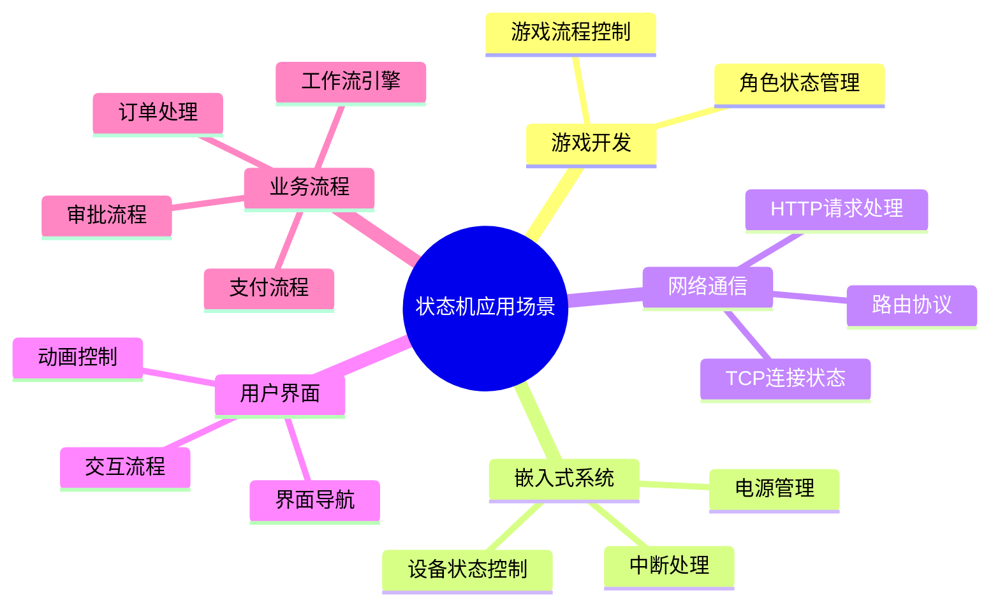

#### 目录介绍
- 01.状态机应用场景
  - 1.1 应用领域分布
- 02.如何解决上面问题
- 03.为什么设计状态机
- 04.状态机核心思想
  - 4.1 核心思想机制
  - 4.2 状态机核心要素

## 01.状态机应用场景

### 1.1 应用领域分布

## 04.状态机核心思想

### 4.1 核心思想机制

状态机的核心思想非常直观：在任何时刻，程序（或它的一部分）都处于一个且仅一个预定义的“状态”中。它的行为取决于当前状态，而状态的改变则由发生的事件来触发。

### 4.2 状态机核心要素

状态机的几个核心要素：

1. 有限状态：系统所有可能的情况被精确定义为有限个数的“状态”（如状态A、状态B）。这是系统行为的“模式”。
2. 事件：来自外部或内部的“事件”（如事件X、事件Y)是触发状态迁移的输入信号。
3. 转移：定义在特定状态下，响应某个事件，并可能满足特定条件时，系统将执行一个动作并迁移到新的状态（或保持原状态）。
4. 动作：状态转移发生时可以伴随一个可执行的动作。

