#### 目录介绍
- 01.状态机应用场景
  - 1.1 应用领域分布
  - 1.2 游戏角色状态机
  - 1.3 订单处理状态机
- 02.什么是状态机
  - 2.1 状态机定义
  - 2.2 状态机分类
  - 2.3 状态机数学定义
  - 2.4 状态机基本概念
- 03.主要解决问题
  - 3.1 复杂性管理问题
  - 3.2 并发控制问题
  - 3.3 业务流程控制
- 04.为何设计状态机
  - 4.1 设计动机
  - 4.2 传统VS状态机
  - 4.3 状态机价值
- 04.状态机核心思想
  - 4.1 核心思想机制
  - 4.2 状态机核心要素

## 01.状态机应用场景

### 1.1 应用领域分布

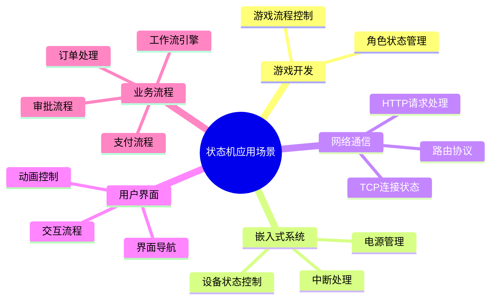

### 1.2 游戏角色状态机

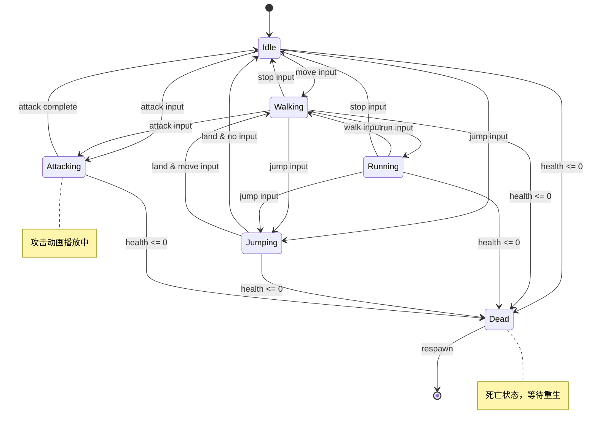

### 1.3 订单处理状态机

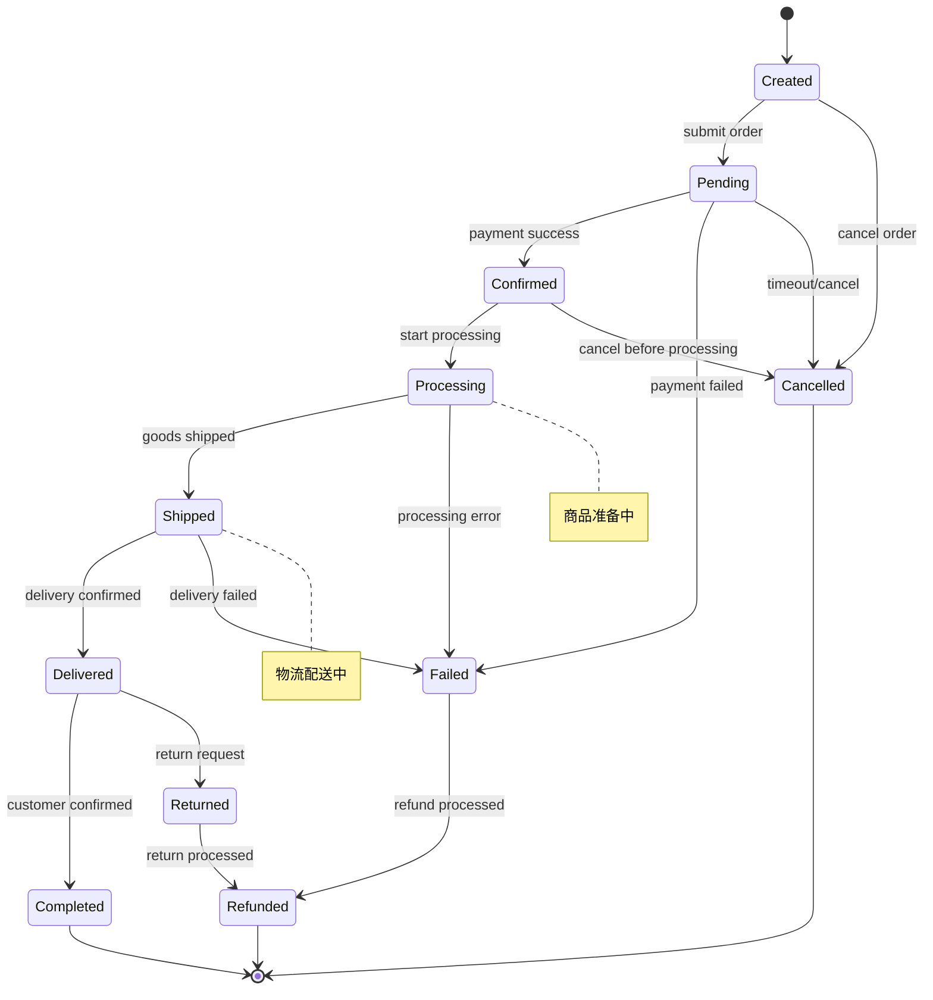

## 02.什么是状态机

### 2.1 状态机定义

状态机（State Machine）是一种数学模型，用于描述系统在不同状态之间的转换行为。它是一种抽象的计算模型，能够精确描述系统在任意时刻的状态以及状态之间的转换条件。

### 2.2 状态机分类

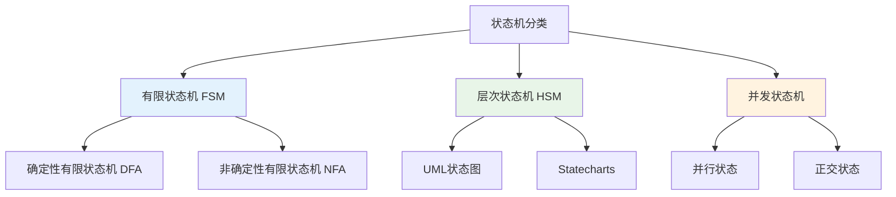

### 2.3 状态机数学定义

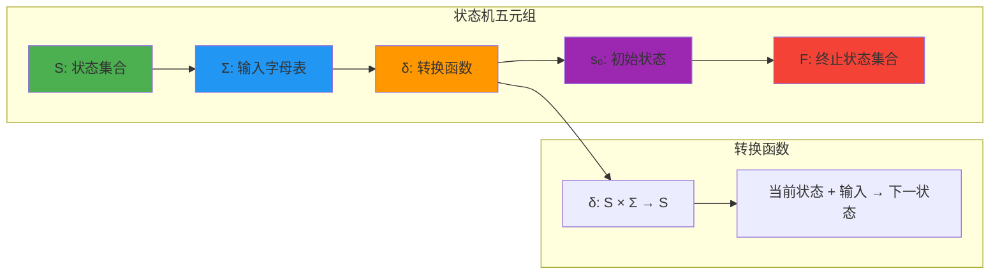

### 2.4 状态机基本概念

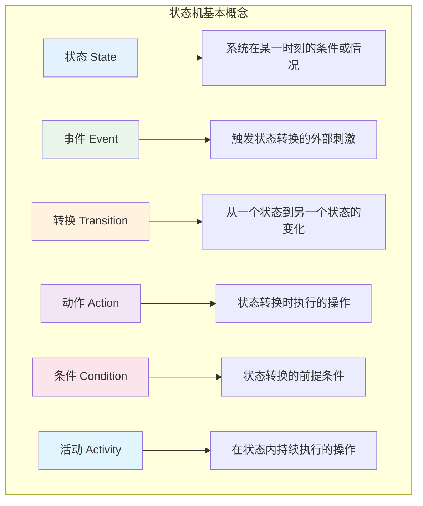

## 03.主要解决问题

### 3.1 复杂性管理问题

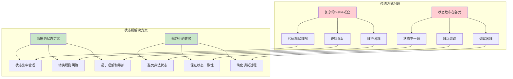

### 3.2 并发控制问题

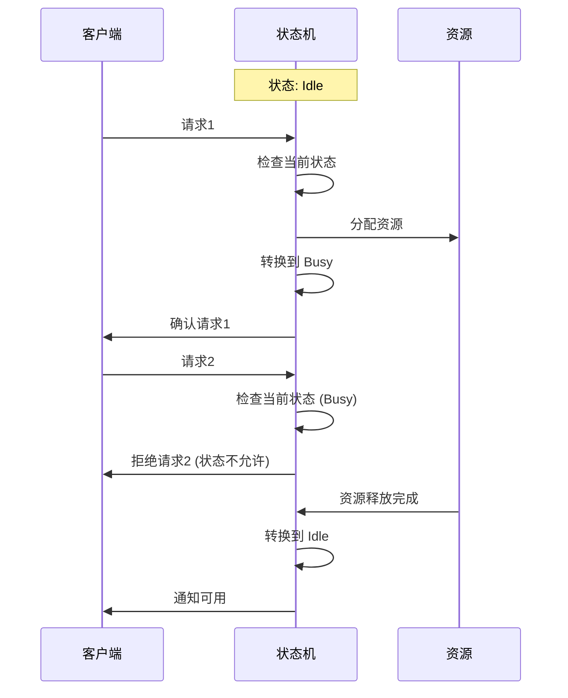

### 3.3 业务流程控制

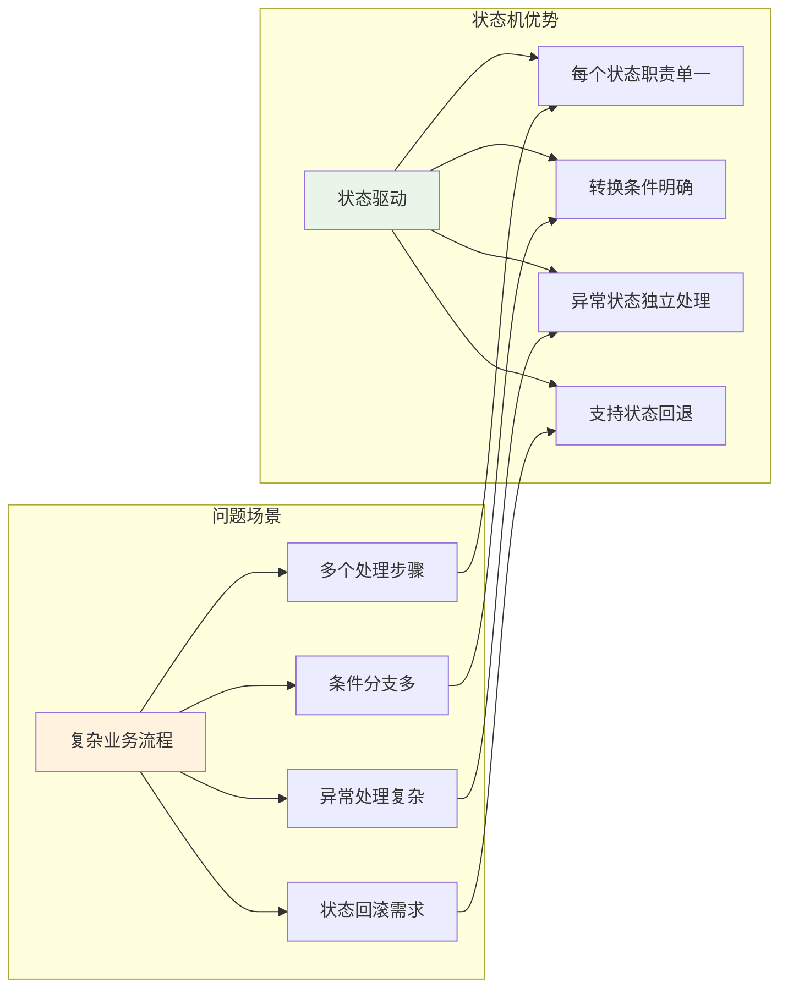

## 04.为何设计状态机

### 4.1 设计动机

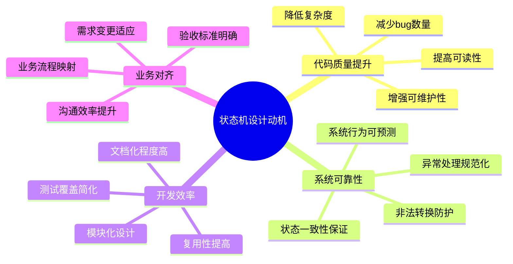

### 4.2 传统VS状态机

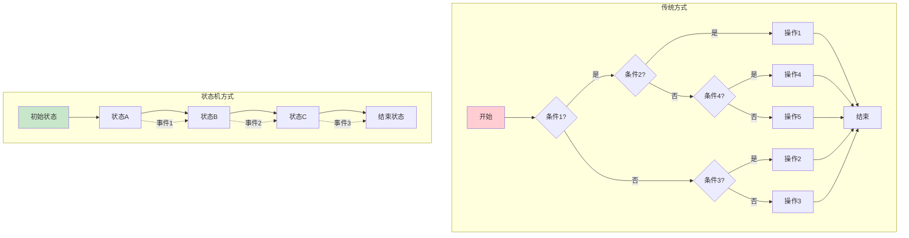

### 4.3 状态机价值

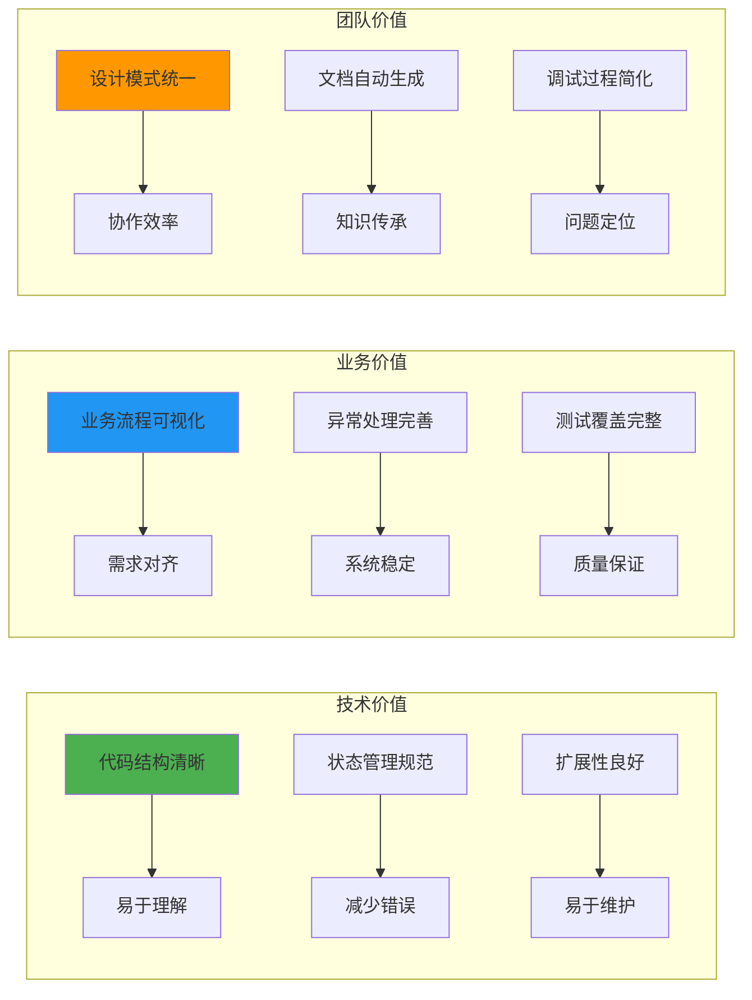

## 04.状态机核心思想

### 4.1 核心思想机制

状态机的核心思想非常直观：在任何时刻，程序（或它的一部分）都处于一个且仅一个预定义的“状态”中。它的行为取决于当前状态，而状态的改变则由发生的事件来触发。

### 4.2 状态机核心要素

状态机的几个核心要素：

1. 有限状态：系统所有可能的情况被精确定义为有限个数的“状态”（如状态A、状态B）。这是系统行为的“模式”。
2. 事件：来自外部或内部的“事件”（如事件X、事件Y)是触发状态迁移的输入信号。
3. 转移：定义在特定状态下，响应某个事件，并可能满足特定条件时，系统将执行一个动作并迁移到新的状态（或保持原状态）。
4. 动作：状态转移发生时可以伴随一个可执行的动作。

