# 路由库方案设计技术文档

## 目录

1. [概述](#概述)
2. [路由系统核心概念](#路由系统核心概念)
3. [跨平台路由架构设计](#跨平台路由架构设计)
4. [Android路由实现方案](#android路由实现方案)
5. [iOS路由实现方案](#ios路由实现方案)
6. [Web路由实现方案](#web路由实现方案)
7. [统一路由库设计](#统一路由库设计)
8. [路由中间件系统](#路由中间件系统)
9. [路由安全与权限控制](#路由安全与权限控制)
10. [性能优化策略](#性能优化策略)
11. [路由调试与监控](#路由调试与监控)
12. [最佳实践与案例](#最佳实践与案例)
13. [总结](#总结)

---

## 概述

路由系统是现代应用程序架构中的核心组件，负责管理应用内的页面跳转、状态管理和导航逻辑。本技术文档将深入分析跨平台路由库的设计原理、实现方案和最佳实践。

### 路由系统价值

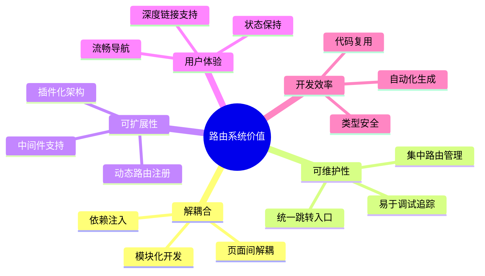

### 路由系统特点对比

| 特性 | Android | iOS | Web |
|------|---------|-----|-----|
| **导航方式** | Intent/Fragment | UINavigationController | History API |
| **状态管理** | Bundle/ViewModel | UserDefaults/Core Data | URL/LocalStorage |
| **深度链接** | Deep Link/App Link | Universal Link | URL路由 |
| **动画支持** | Transition/Animation | UIView Animation | CSS Transition |
| **生命周期** | Activity/Fragment | ViewController | Component |
| **参数传递** | Intent Extra/Bundle | Segue/Property | Query String/State |

---

## 路由系统核心概念

### 1. 路由系统架构

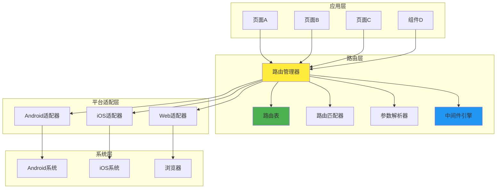

### 2. 路由生命周期

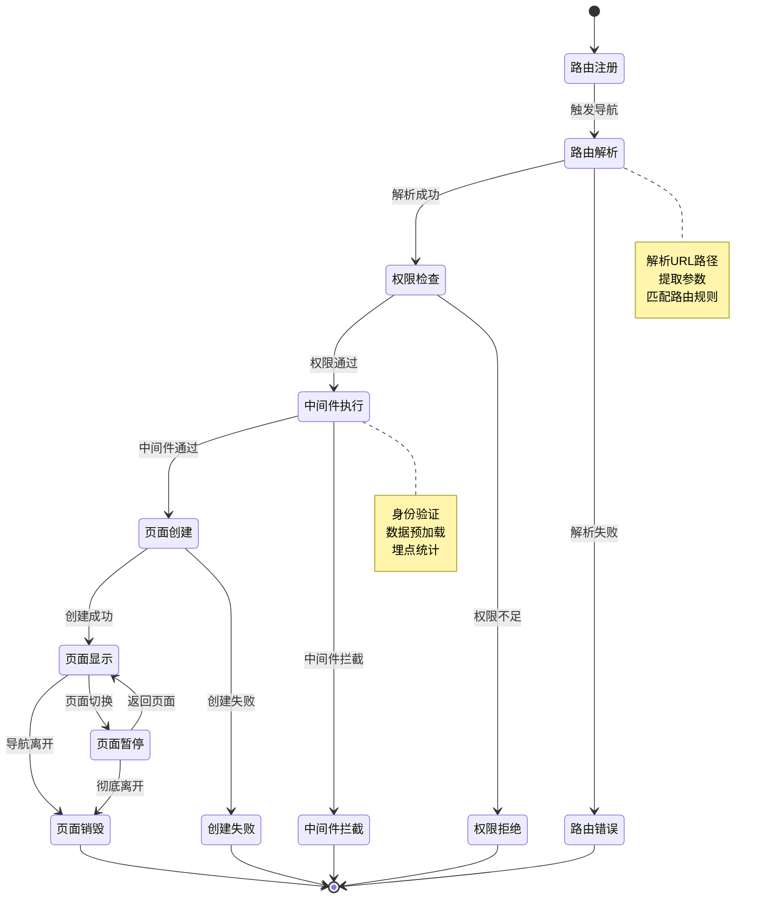

### 3. 路由匹配算法

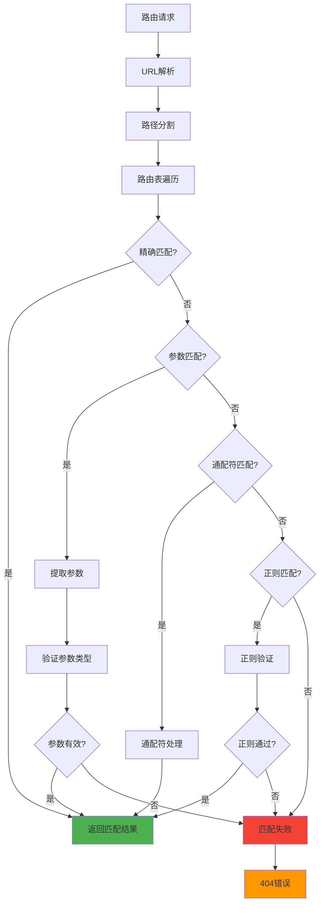

---

## 跨平台路由架构设计

### 1. 统一路由接口设计

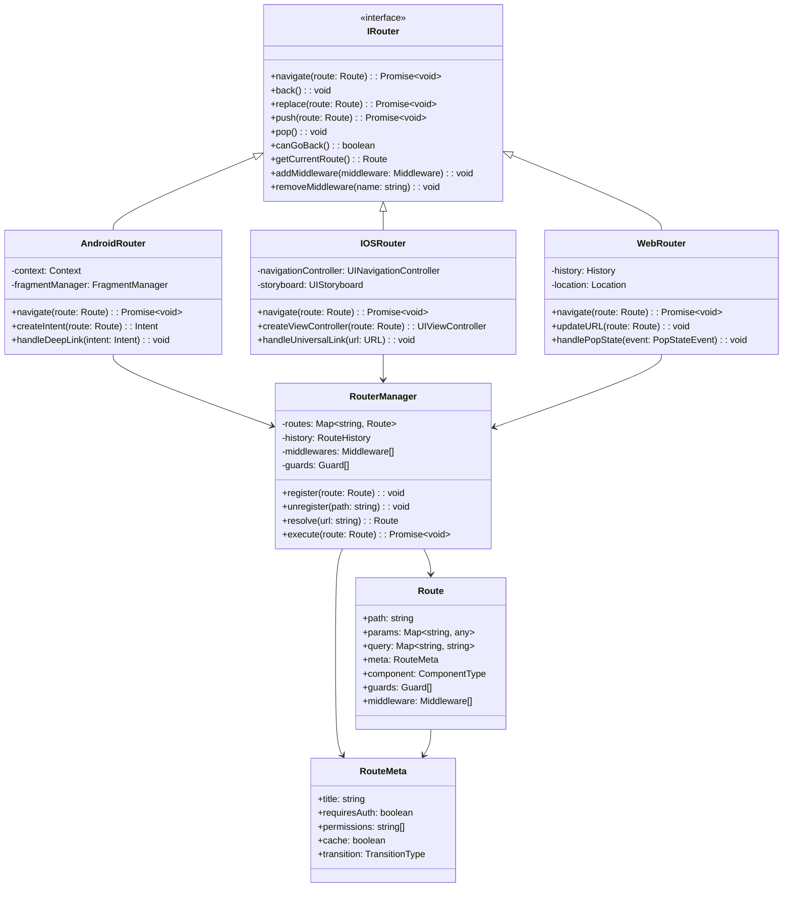

### 2. 路由配置系统

```typescript
// 统一路由配置接口
interface RouteConfig {
  path: string;
  name: string;
  component: ComponentType;
  meta?: RouteMeta;
  children?: RouteConfig[];
  beforeEnter?: RouteGuard[];
  afterEnter?: RouteHook[];
  beforeLeave?: RouteGuard[];
  afterLeave?: RouteHook[];
}

// 路由元信息
interface RouteMeta {
  title?: string;
  requiresAuth?: boolean;
  permissions?: string[];
  cache?: boolean;
  keepAlive?: boolean;
  transition?: TransitionConfig;
  analytics?: AnalyticsConfig;
}

// 路由守卫
interface RouteGuard {
  name: string;
  execute: (to: Route, from: Route) => Promise<boolean | string>;
}

// 路由中间件
interface Middleware {
  name: string;
  priority: number;
  execute: (context: RouteContext, next: () => void) => void;
}

// 路由上下文
interface RouteContext {
  route: Route;
  params: Record<string, any>;
  query: Record<string, string>;
  meta: RouteMeta;
  platform: Platform;
  user?: User;
}
```

### 3. 路由注册与管理

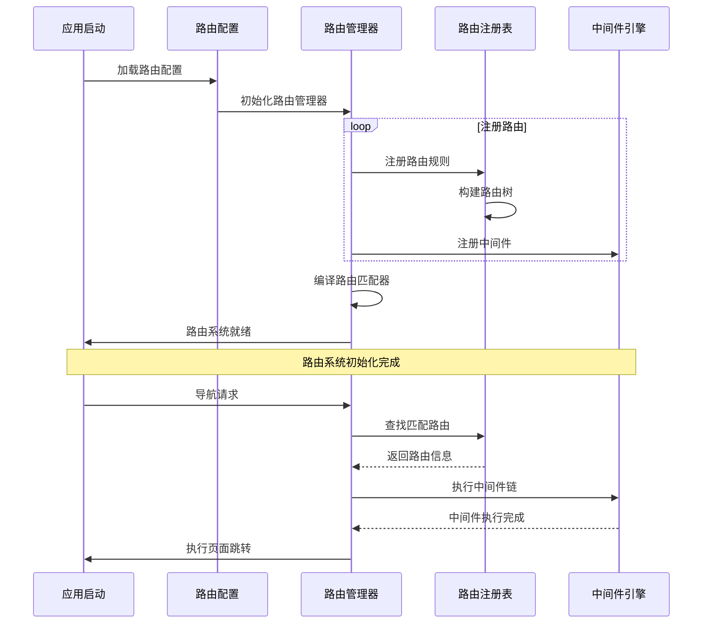

---

## Android路由实现方案

### 1. Android路由架构

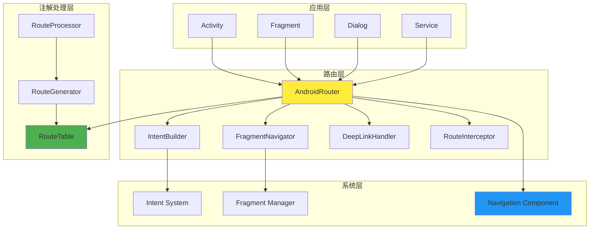

### 2. Android路由核心实现

```kotlin
// 路由注解定义
@Target(AnnotationTarget.CLASS)
@Retention(AnnotationRetention.BINARY)
annotation class Route(
    val path: String,
    val name: String = "",
    val description: String = "",
    val extras: Array<String> = []
)

// Android路由管理器
class AndroidRouter private constructor() : IRouter {
    
    companion object {
        @JvmStatic
        val instance: AndroidRouter by lazy { AndroidRouter() }
    }
    
    private val routeTable = mutableMapOf<String, RouteInfo>()
    private val interceptors = mutableListOf<RouteInterceptor>()
    private val middlewares = mutableListOf<Middleware>()
    
    // 路由注册
    fun register(path: String, clazz: Class<*>, meta: RouteMeta? = null) {
        val routeInfo = RouteInfo(
            path = path,
            destination = clazz,
            meta = meta ?: RouteMeta()
        )
        routeTable[path] = routeInfo
    }
    
    // 导航实现
    override suspend fun navigate(route: Route): Unit = withContext(Dispatchers.Main) {
        try {
            // 1. 路由解析
            val routeInfo = resolveRoute(route.path)
                ?: throw RouteNotFoundException("Route not found: ${route.path}")
            
            // 2. 执行拦截器
            val interceptResult = executeInterceptors(route, routeInfo)
            if (!interceptResult.allowed) {
                handleInterceptResult(interceptResult)
                return@withContext
            }
            
            // 3. 执行中间件
            executeMiddlewares(route) {
                // 4. 执行实际导航
                performNavigation(route, routeInfo)
            }
            
        } catch (e: Exception) {
            handleNavigationError(e, route)
        }
    }
    
    // 创建Intent
    private fun createIntent(context: Context, route: Route, routeInfo: RouteInfo): Intent {
        val intent = Intent(context, routeInfo.destination)
        
        // 设置基本参数
        route.params.forEach { (key, value) ->
            when (value) {
                is String -> intent.putExtra(key, value)
                is Int -> intent.putExtra(key, value)
                is Boolean -> intent.putExtra(key, value)
                is Serializable -> intent.putExtra(key, value)
                is Parcelable -> intent.putExtra(key, value)
                else -> intent.putExtra(key, value.toString())
            }
        }
        
        return intent
    }
    
    // 深度链接处理
    fun handleDeepLink(intent: Intent): Boolean {
        val uri = intent.data ?: return false
        
        try {
            val route = parseDeepLink(uri)
            GlobalScope.launch {
                navigate(route)
            }
            return true
        } catch (e: Exception) {
            Log.e("AndroidRouter", "Failed to handle deep link: $uri", e)
            return false
        }
    }
}

// 使用示例
@Route(path = "/user/profile", name = "用户资料")
class UserProfileActivity : AppCompatActivity() {
    
    @RouteParam(name = "userId", required = true)
    private var userId: String = ""
    
    override fun onCreate(savedInstanceState: Bundle?) {
        super.onCreate(savedInstanceState)
        
        // 自动注入路由参数
        RouterUtils.injectParams(this, intent)
        
        setContentView(R.layout.activity_user_profile)
        loadUserProfile(userId)
    }
}
```

---

## iOS路由实现方案

### 1. iOS路由架构

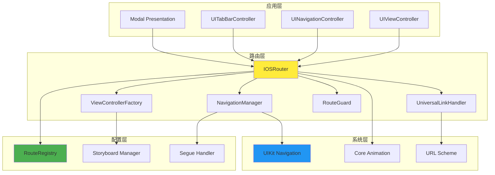

### 2. iOS路由核心实现

```swift
// 路由协议定义
protocol Router {
    func navigate(to route: Route, animated: Bool, completion: ((Bool) -> Void)?)
    func back(animated: Bool)
    func replace(with route: Route, animated: Bool, completion: ((Bool) -> Void)?)
    func present(route: Route, animated: Bool, completion: (() -> Void)?)
    func dismiss(animated: Bool, completion: (() -> Void)?)
}

// iOS路由管理器
class IOSRouter: Router {
    
    static let shared = IOSRouter()
    
    private var routeRegistry: [String: RouteInfo] = [:]
    private var middlewares: [Middleware] = []
    private var guards: [RouteGuard] = []
    private weak var rootNavigationController: UINavigationController?
    
    // 导航实现
    func navigate(to route: Route, animated: Bool = true, completion: ((Bool) -> Void)? = nil) {
        DispatchQueue.main.async { [weak self] in
            self?.performNavigation(route: route, animated: animated, completion: completion)
        }
    }
    
    private func performNavigation(route: Route, animated: Bool, completion: ((Bool) -> Void)?) {
        guard let routeInfo = routeRegistry[route.path] else {
            print("Route not found: \(route.path)")
            completion?(false)
            return
        }
        
        // 执行路由守卫
        let guardResult = executeGuards(route: route, routeInfo: routeInfo)
        guard guardResult.allowed else {
            handleGuardResult(guardResult)
            completion?(false)
            return
        }
        
        // 执行中间件
        executeMiddlewares(route: route) { [weak self] in
            self?.createAndPresentViewController(route: route, routeInfo: routeInfo, animated: animated, completion: completion)
        }
    }
    
    // Universal Link处理
    func handleUniversalLink(_ url: URL) -> Bool {
        do {
            let route = try parseUniversalLink(url)
            navigate(to: route)
            return true
        } catch {
            print("Failed to handle universal link: \(url), error: \(error)")
            return false
        }
    }
}

// 使用示例
class UserProfileViewController: UIViewController {
    
    var userId: String = ""
    var tab: String = "info"
    
    override func viewDidLoad() {
        super.viewDidLoad()
        
        setupUI()
        loadUserData()
    }
    
    private func loadUserData() {
        print("Loading user data for userId: \(userId), tab: \(tab)")
    }
}
```

---

## Web路由实现方案

### 1. Web路由架构

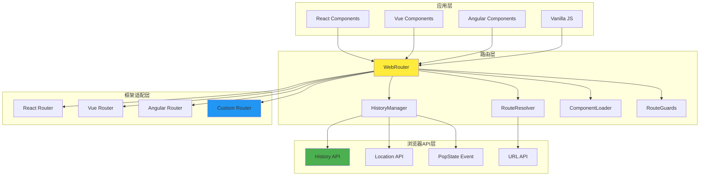

### 2. Web路由核心实现

```typescript
// Web路由管理器实现
class WebRouterImpl implements WebRouter {
  private listeners: Set<RouteChangeCallback> = new Set();
  private location: Location;
  private routes: Map<string, RouteConfig> = new Map();
  private guards: RouteGuard[] = [];
  private middlewares: Middleware[] = [];
  
  constructor() {
    this.location = this.createLocation(window.location);
    this.setupEventListeners();
  }
  
  // 导航到指定路径
  navigate(path: string, state?: any): void {
    this.push(path, state);
  }
  
  // 推入新的历史记录
  push(path: string, state?: any): void {
    const location = this.createLocationFromPath(path, state);
    
    history.pushState(state, '', path);
    this.updateLocation(location, Action.PUSH);
  }
  
  // 处理浏览器后退/前进
  private handlePopState(event: PopStateEvent): void {
    const location = this.createLocation(window.location);
    this.updateLocation(location, Action.POP);
  }
  
  // 执行路由守卫
  private async executeRouteGuards(
    from: Location, 
    to: Location, 
    action: Action
  ): Promise<boolean> {
    const fromRoute = this.matchRoute(from.pathname);
    const toRoute = this.matchRoute(to.pathname);
    
    // 执行离开守卫
    if (fromRoute?.beforeLeave) {
      for (const guard of fromRoute.beforeLeave) {
        const result = await guard.execute(to, from);
        if (result !== true) {
          if (typeof result === 'string') {
            this.navigate(result);
          }
          return false;
        }
      }
    }
    
    return true;
  }
}

// React路由组件
const Route: React.FC<RouteProps> = ({ path, component: Component, exact, children }) => {
  const router = useRouter();
  const location = useLocation();
  
  const match = useMemo(() => {
    return matchPath(location.pathname, { path, exact });
  }, [location.pathname, path, exact]);
  
  if (!match) {
    return null;
  }
  
  if (children) {
    return <>{children}</>;
  }
  
  return <Component {...match.params} />;
};
```

---

## 统一路由库设计

### 1. 跨平台路由抽象

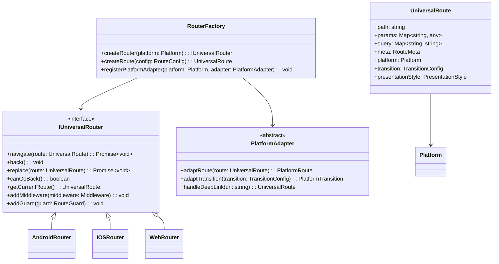

---

## 路由中间件系统

### 1. 中间件架构

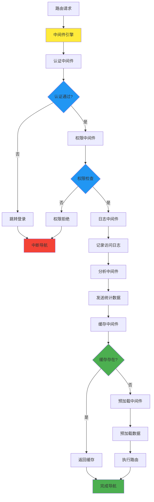

---

## 路由安全与权限控制

### 1. 安全架构

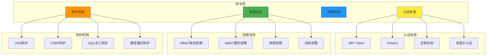

---

## 性能优化策略

### 1. 路由性能优化

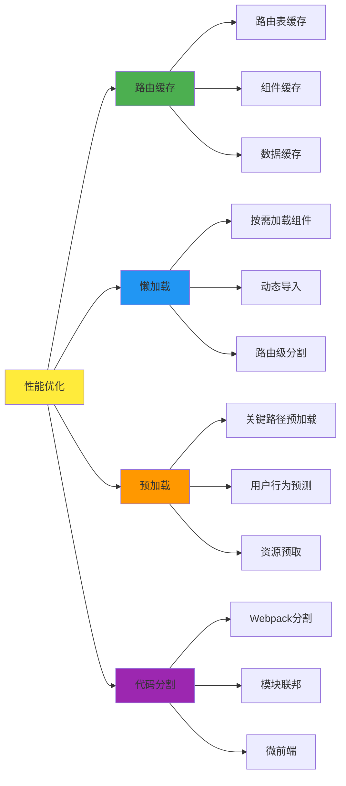

### 2. 性能监控指标

| 指标 | 描述 | 目标值 | 监控方法 |
|------|------|--------|----------|
| **路由解析时间** | 从请求到匹配完成 | < 10ms | Performance API |
| **页面加载时间** | 组件创建到渲染完成 | < 200ms | 生命周期钩子 |
| **内存使用** | 路由缓存占用内存 | < 50MB | Memory API |
| **缓存命中率** | 路由缓存命中比例 | > 80% | 自定义统计 |
| **错误率** | 路由导航失败比例 | < 1% | 错误监控 |

---

## 路由调试与监控

### 1. 调试工具架构

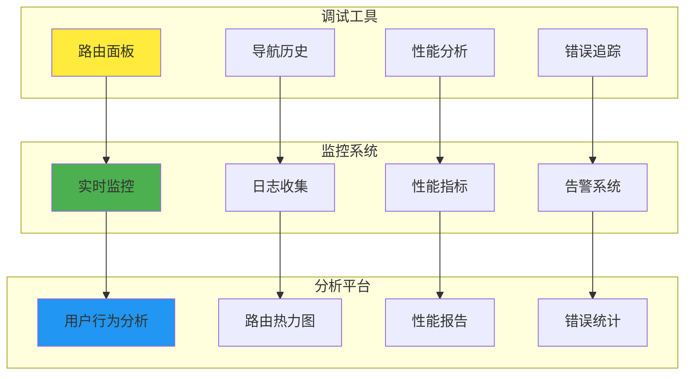

---

## 最佳实践与案例

### 1. 路由设计原则

1. **单一职责原则**
  - 每个路由只负责一个页面或功能
  - 避免路由承担过多责任

2. **开闭原则**
  - 对扩展开放，对修改关闭
  - 通过中间件和插件扩展功能

3. **依赖倒置原则**
  - 依赖抽象而非具体实现
  - 使用接口定义路由契约

4. **接口隔离原则**
  - 提供最小化的接口
  - 避免强制依赖不需要的功能

### 2. 常见问题与解决方案

| 问题 | 原因 | 解决方案 |
|------|------|----------|
| **路由冲突** | 路径匹配规则重叠 | 使用精确匹配，调整路由顺序 |
| **内存泄漏** | 组件未正确销毁 | 实现生命周期管理，清理监听器 |
| **深度链接失效** | URL解析错误 | 完善URL解析逻辑，添加容错处理 |
| **权限检查失效** | 中间件执行顺序错误 | 调整中间件优先级，确保安全检查优先 |
| **性能问题** | 路由表过大 | 实现路由懒加载，优化匹配算法 |

---

## 总结

本技术文档详细介绍了跨平台路由库的设计与实现方案，涵盖了以下核心内容：

### 主要成果

1. **统一架构设计**
  - 提供了跨平台的统一路由接口
  - 实现了平台适配器模式
  - 支持插件化扩展

2. **完整实现方案**
  - Android平台基于Intent和Fragment的路由实现
  - iOS平台基于UINavigationController的路由实现
  - Web平台基于History API的路由实现

3. **高级功能支持**
  - 中间件系统支持认证、权限、日志等功能
  - 安全机制防护XSS、CSRF等攻击
  - 性能优化策略提升用户体验

4. **开发工具链**
  - 调试工具支持实时监控和问题排查
  - 性能分析工具优化路由性能
  - 最佳实践指导规范开发

### 技术价值

- **提升开发效率**：统一的API减少学习成本
- **保证代码质量**：完善的类型定义和错误处理
- **增强用户体验**：流畅的导航和快速的页面加载
- **降低维护成本**：模块化设计便于扩展和维护

### 应用前景

该路由库方案可广泛应用于：
- 大型企业级应用的导航管理
- 跨平台应用的统一路由解决方案
- 微前端架构的路由协调
- 移动应用的深度链接处理

通过本方案的实施，可以构建出高性能、高可用、易维护的现代化路由系统，为用户提供优秀的导航体验。