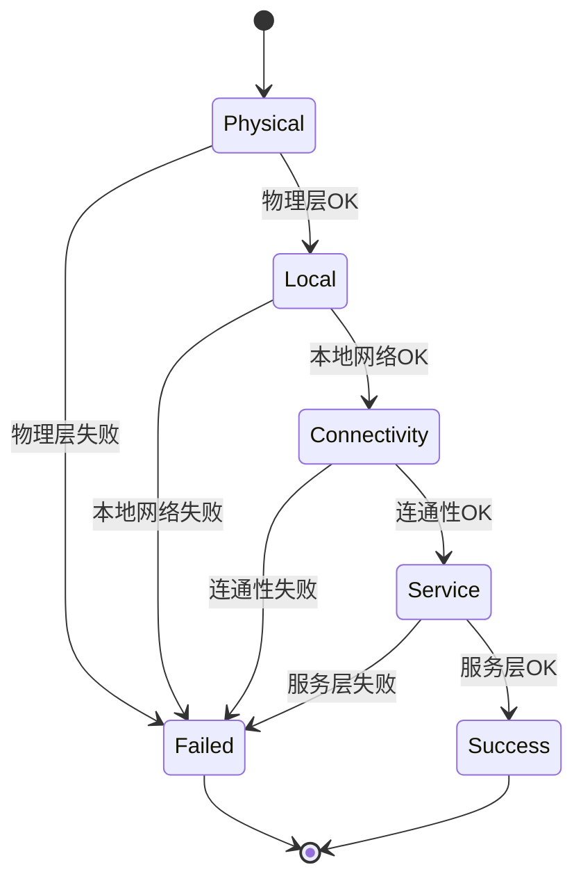

# 网络检测
#### 目录介绍
- 1.整体概述介绍
  - 1.1 项目背景说明
  - 1.2 要做什么分析
- 2.一些概念熟悉
  - 2.1 网络检测背景
  - 2.2 网络故障根因
- 3.网络类型说明
  - 3.1 网络类型分类
  - 3.2 Wi-Fi
  - 3.3 以太网
  - 3.4 移动网络
- 4.整体架构设计
  - 4.1 核心设计思路
  - 4.2 核心设计目标
  - 4.3 核心接口设计
- 5.网络状态设计
  - 5.1 物理层检测
  - 5.2 本地网络检测
  - 5.3 连通性检测
  - 5.4 服务检测
- 6.网络状态实践


## 2.一些概念熟悉

### 2.1 网络检测背景

针对分层网络检测中的各种异常情况，提供具体的问题诊断和解决建议，帮助用户快速定位和修复网络问题。

IoT设备在实际部署中经常遇到网络连接问题，传统的网络诊断方法往往只能给出"网络不通"的结果，无法精确定位问题层级。本方案设计了一套分层网络检测系统，能够快速定位网络故障的具体位置，为运维和用户提供精准的问题诊断。

- **精准定位**：将网络问题定位到具体层级，避免盲目排查
- **快速诊断**：自动化检测流程，减少人工介入时间
- **详细报告**：提供完整的检测结果和配置信息
- **异步支持**：支持非阻塞检测，不影响主业务流程

### 2.2 网络故障根因

网络连接失败的可能原因层级：

```text
┌─────────────────────────────────┐
│ 应用层：服务不可用、协议错误      │
├─────────────────────────────────┤
│ 传输层：端口被占用、连接超时      │
├─────────────────────────────────┤
│ 网络层：路由配置错误、IP冲突      │
├─────────────────────────────────┤
│ 数据链路层：MAC地址冲突、交换机故障│
├─────────────────────────────────┤
│ 物理层：网卡故障、驱动异常、线缆断开│ ← 最底层，影响所有上层
└─────────────────────────────────┘
```

**关键认知**：如果物理层有问题，所有上层的网络功能都无法正常工作。因此，物理层检测是网络诊断的**必要前提**。

## 3.查询网络设置

### 3.1 网络类型分类

```cpp
enum class NetworkType {
  kNone = 10000,      // 无网络
  kCellular = 10001,  // 蜂窝网络，4G网络
  kWifi = 10002,      // WiFi
  kEthernet = 10003,  // 以太网
  kOther = 10004,     // 其他
};

enum class NetworkConnectState {
  kDisconnected = 0,  // 断开连接
  kConnecting = 1,    // 连接中
  kConnected = 2,     // 已连接
  kUnknown = 99,      // 未知状态
};
```

## 4.整体架构设计

### 4.1 核心设计思路

```shell
开始检测
    ↓
1.物理层检测 → 失败 → 返回物理层错误
    ↓ 成功
2.本地网络检测 → 失败 → 返回本地网络错误  
    ↓ 成功
3.连通性检测 → 失败 → 返回连通性错误
    ↓ 成功
4.服务端检测 → 失败 → 返回服务端错误
    ↓ 成功
检测完成，返回成功结果
```

### 4.2 核心设计目标

- **分层检测**：按照网络协议栈从底层到应用层逐步检测
- **快速失败**：一旦某层检测失败，立即返回错误，避免无效检测
- **简单实用**：保持接口简洁，易于理解和使用
- **详细诊断**：提供具体的错误信息和网络状态详情
- **核心目标**：这里针对每一层网络异常，给出具体原因，然后给前场弄个排查和解决方案手册！


### 4.3 核心接口实现

```cpp
class NetworkDetector {
public:
    enum class DetectionLevel {
        kPhysical,      // 物理层检测
        kLocal,         // 本地网络检测  
        kConnectivity,  // 连通性检测
        kService        // 服务检测
    };
    
    struct DetectionResult {
        bool success;
        DetectionLevel level;
        std::string error_message;
        std::map<std::string, std::string> details;
    };
    
    // 执行完整网络检测
    static DetectionResult PerformFullDetection();
    
    // 分层检测方法
    static DetectionResult CheckPhysicalLayer();
    static DetectionResult CheckLocalNetwork();
    static DetectionResult CheckConnectivity();
    static DetectionResult CheckServiceReachability();
    
    // 异步检测
    static void PerformDetectionAsync(std::function<void(DetectionResult)> callback);

private:
    // 辅助方法
    static bool TestHostReachability(const std::string& host, int timeout_sec = 5);
    static std::string GetNetworkInterfaceInfo(const std::string& interface);
};
```

检测流程示例图



## 5.网络状态设计

当前系统提供的功能

- `NetworkMonitorService` - 网络状态监控服务
- `NetworkInfo` - 网络类型和连接状态管理
- `SystemInterface::GetNetworkInfo()` - 获取网络详细信息
- `SystemInterface::IsNetworkInterfaceUp()` - 检查接口状态


### 5.1 物理层检测

**检测目标**：验证网络硬件和基础配置

**检测内容**：

- 常见网络接口状态检查 (eth0, wlan0, enp0s3, wlp2s0)
- 接口IP地址获取
- 网卡UP/DOWN状态记录

### 5.2 本地网络检测

**检测目标**：验证本地网络配置正确性

**检测内容**：

- 默认网关配置检查
- DNS服务器配置验证
- 路由表基础配置确认

### 5.3 连通性检测

**检测目标**：验证网络连通性和DNS解析

**检测策略**：

```cpp
bool PingHost(const std::string& host, int timeout_ms) {
    // 使用系统ping命令
    // 支持超时控制
}

bool CheckDNSResolution(const std::string& hostname) {
    // 使用 getaddrinfo() 系统调用
    // 验证域名解析功能
}
```

**检测内容**：

- 网关连通性测试 (ping gateway)
- 外网连通性测试 (ping 8.8.8.8, 114.114.114.114)
- DNS解析功能验证 (resolve baidu.com, google.com)

### 5.4 服务检测

**检测目标**：验证业务服务可达性

**检测方法**：
```cpp
bool TestHTTPConnection(const std::string& url, int timeout_ms) {
    // 使用项目HttpRequest类
    // 发送HTTP健康检查请求
    // 验证状态码 200-399
}
```

**检测内容**：
- 业务服务HTTP连接测试
- 服务主机基础连通性验证
- 完整业务链路可用性确认


