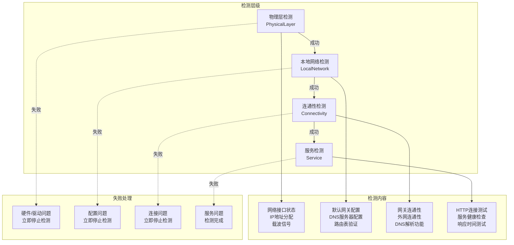
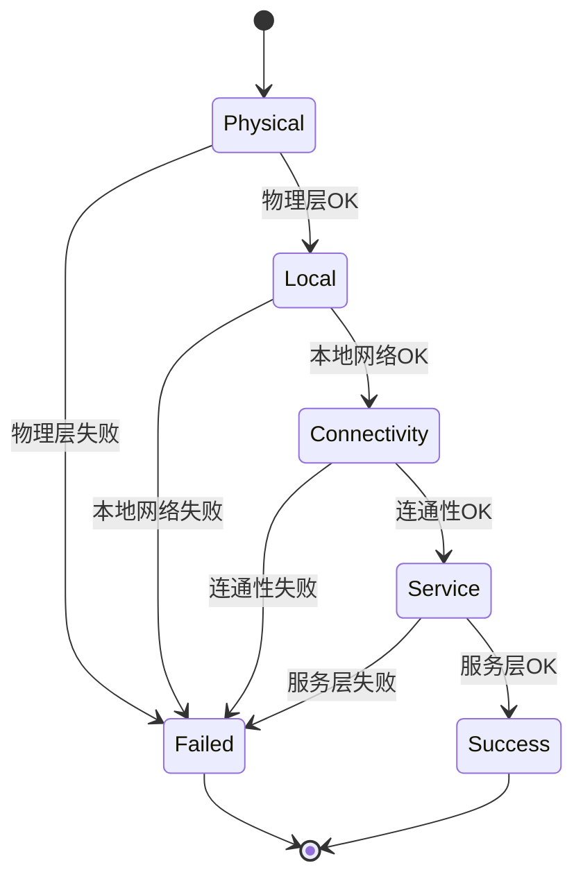
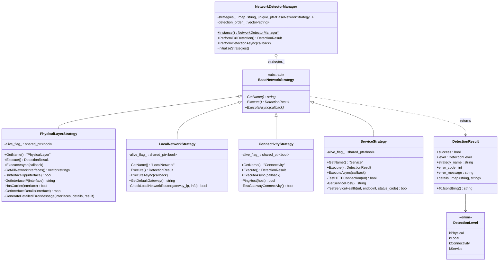

# 网络检测
#### 目录介绍
- 1.整体概述介绍
  - 1.1 项目背景
  - 1.2 设计目标
  - 1.3 核心思想
  - 1.4 分层模型
  - 1.5 设计原理
  - 1.6 检测流程
- 2.检测什么内容
  - 2.1 物理层能力
  - 2.2 本地层能力
  - 2.3 连通层能力
  - 2.4 服务层能力
  - 2.5 私有化环境
- 4.整体架构设计
  - 4.1 核心设计思路
  - 4.2 策略基类接口
  - 4.3 统一结果结构
  - 4.4 核心接口设计
  - 4.5 依赖关系
  - 4.6 类架构设计
- 5.网络状态实践
  - 5.1 物理层实践
  - 5.2 本地网络实践
  - 5.3 连通性实践
  - 5.4 服务层实践
  - 5.5 错误码设计
- 6.网络检测运维
  - 6.1 物理层运维
  - 6.2 本地网络运维
  - 6.3 连通性运维
  - 6.4 服务层运维


## 1.整体概述介绍

### 1.1 项目背景

IoT设备部署在客户现场（大部分为私有化环境），网络问题是现场运维最常遇到的故障。

硬件通点：IoT设备在实际部署中经常遇到网络连接问题，传统的网络诊断方法往往只能给出"网络不通"的结果，无法精确定位问题层级。

解决方案：设计了一套分层网络检测系统，能够快速定位网络故障的具体位置，为运维和用户提供精准的问题诊断。

传统方式依赖运维人员逐步排查，效率低、要求高。本方案通过设备自身进行网络自检，将专业的网络排障流程自动化，一键检测即可精准定位网络故障层级和具体原因。

### 1.2 设计目标

| 目标 | 说明 |
|------|------|
| **精准定位** | 通过分层检测，定位故障出在哪一层（物理/本地/连通/服务） |
| **零依赖** | 底层检测完全基于Linux内核提供的sysfs/procfs，不依赖外部工具 |
| **私有化适配** | 不依赖公网连通性，适应私有化客户的隔离网络环境 |
| **快速反馈** | 串行分层、遇错即停，最快路径返回故障原因 |
| **可扩展** | 策略模式架构，新增检测层只需继承基类并注册 |
| **运维友好** | 统一错误码体系 + 结构化JSON诊断信息，支持远程排障 |

### 1.3 核心思想

借鉴 **OSI网络分层模型的排障思路**——从最底层的物理连接开始，逐层向上验证。底层故障必然导致上层不可用，因此遇到某一层失败立即返回，避免无效检测和误导性错误信息。

类比网络工程师的排障思路：

```
网线插好了吗？ → 接口亮灯吗？ → 拿到IP了吗？ → 网关通吗？ → 服务器通吗？
```

### 1.4 四层分层模型

```
┌─────────────────────────────────────────────────────────────┐
│                     第4层：Service（服务层）                  │
│              验证业务服务是否可达、API是否正常                │
│              HTTP GET /license + 基础HTTP连通性              │
├─────────────────────────────────────────────────────────────┤
│                     第3层：Connectivity（连通层）             │
│              验证局域网基础连通性                             │
│              Ping 默认网关                                   │
├─────────────────────────────────────────────────────────────┤
│                     第2层：LocalNetwork（本地网络层）         │
│              验证网络配置是否正确                             │
│              默认网关 + 本地路由表                            │
├─────────────────────────────────────────────────────────────┤
│                     第1层：Physical（物理层）                 │
│              验证硬件连接和接口状态                           │
│              接口枚举 + UP/DOWN + IP + 载波信号               │
└─────────────────────────────────────────────────────────────┘
```

设计原理：

- 逐层检测：从底层到高层依次检测，遇到失败立即停止，避免盲目排查
- 快速失败：避免在低层级问题上浪费时间进行高层级检测，减少人工介入时间
- 问题隔离：每层检测独立，便于精确定位问题根因

### 1.5 设计原理

| 层级 | 对应OSI层 | 检测维度 | 故障含义 |
|------|-----------|----------|----------|
| Physical | L1物理层 + L2数据链路层 | 硬件连接状态 | 网线/WiFi/网卡物理问题 |
| LocalNetwork | L3网络层（本地配置） | 路由与网关配置 | DHCP/静态配置问题 |
| Connectivity | L3网络层（连通性） | 数据包转发能力 | 交换机/路由器/ARP问题 |
| Service | L4传输层 + L7应用层 | 业务服务可达性 | DNS/防火墙/服务端问题 |

"遇错即停"串行策略

```
PhysicalLayer ──Pass──> LocalNetwork ──Pass──> Connectivity ──Pass──> Service ──Pass──> ✅ Network OK
      │                      │                      │                    │
      └─Fail──> ❌ 10011~15  └─Fail──> ❌ 10021~23  └─Fail──> ❌ 10031~32 └─Fail──> ❌ 10041~44
```

**为什么要"遇错即停"？**

| 场景 | 不分层的问题 | 分层后的效果 |
|------|-------------|-------------|
| 网线没插 | 报"服务不可达"，运维人员去查服务器 | 报"有线接口无载波信号(10014)"，运维人员检查网线 |
| 没拿到IP | 报"网关不可达"，运维人员去查路由器 | 报"接口激活但无IP(10013)"，运维人员检查DHCP |
| 网关配置错误 | 报"服务不可达"，运维人员去查DNS | 报"无默认网关(10021)"，运维人员检查IP配置 |

### 1.6 检测流程



## 2.检测什么内容

### 2.1 物理层能力

**检测目标**：验证网络硬件和基础配置

**检测内容**：

- 1.网络接口：主要是有线网络接口，无线网络接口。常见网络接口状态检查 (eth0, wlan0, enp0s3, wlp2s0)。
- 2.接口IP地址获取：确认接口是否获得了有效的IP地址。
- 3.网卡UP/DOWN状态记录：UP表示接口已激活，可以收发数据；DOWN表示接口未激活，无法通信。

### 2.2 本地层能力

**检测目标**：验证本地网络配置正确性

**检测内容**：

- 1.默认网关配置检查：检查默认网关，验证设备是否配置了有效的默认路由。
- 2.路由表基础配置确认：验证网络配置的有效性，验证设备能否与同网段设备通信，确保本地网络路由正确。

### 2.3 连通层能力

**检测目标**：验证网络连通性和DNS解析

**检测内容**：

- 1.网关连通性测试 (ping gateway)：网关可达，主要是确认局域网内的基础连通性。
- 2.外网连通性测试 (ping 8.8.8.8, 114.114.114.114)。外网可达，主要是确认外网的连通性。
- 3.DNS解析功能验证 (resolve baidu.com, google.com)。DNS服务正常工作，能够将域名解析为IP地址，主要是确认域名解析功能正常。

### 2.4 服务层能力

**检测目标**：验证业务服务可达性

**检测内容**：

- 1.业务服务HTTP连接测试：
- 2.服务主机基础连通性验证：
- 3.完整业务链路可用性确认：

### 2.5 私有化环境

```text
私有化连通性检测 (PrivateConnectivityStrategy)
├── 环境识别 (Environment Detection)
├── 内网网关连通性 (Internal Gateway)
├── 内网DNS服务器连通性 (Internal DNS)
├── 内网关键服务连通性 (Internal Services)
├── 代理服务器连通性 (Proxy Connectivity)
├── 通过代理的外网连通性 (External via Proxy)
└── 内网域名解析 (Internal DNS Resolution)
```

## 3.查询网络设置

### 3.1 网络类型分类

```cpp
enum class NetworkType {
  kNone = 10000,      // 无网络
  kCellular = 10001,  // 蜂窝网络，4G网络
  kWifi = 10002,      // WiFi
  kEthernet = 10003,  // 以太网
  kOther = 10004,     // 其他
};

enum class NetworkConnectState {
  kDisconnected = 0,  // 断开连接
  kConnecting = 1,    // 连接中
  kConnected = 2,     // 已连接
  kUnknown = 99,      // 未知状态
};
```

## 4.整体架构设计

### 4.1 核心设计思路

```shell
开始检测
    ↓
1.物理层检测 → 失败 → 返回物理层错误
    ↓ 成功
2.本地网络检测 → 失败 → 返回本地网络错误  
    ↓ 成功
3.连通性检测 → 失败 → 返回连通性错误
    ↓ 成功
4.服务端检测 → 失败 → 返回服务端错误
    ↓ 成功
检测完成，返回成功结果
```

顺序检测原则

```text
物理层检测   → 本地网络检测   → 连通性检测   →   服务检测
   ↓              ↓              ↓            ↓
失败停止        失败停止        失败停止         完成
   ↓              ↓              ↓            ↓
 硬件问题        配置问题        连接问题      服务问题
```

### 4.2 策略基类接口

```cpp
class BaseNetworkStrategy {
public:
    virtual ~BaseNetworkStrategy() = default;
    virtual std::string GetName() const = 0;                                          // 策略标识
    virtual DetectionResult Execute() = 0;                                            // 同步执行
    virtual void ExecuteAsync(std::function<void(const DetectionResult&)> callback) = 0; // 异步执行
};
```

**设计思考**：

- `GetName()` 返回字符串而非枚举，方便日志输出和map索引
- 同时提供同步/异步接口：同步用于串行检测流程中，异步用于单独使用某一层时
- 纯虚析构默认实现，子类无需显式声明

### 4.3 统一结果结构

```cpp
struct DetectionResult {
    bool success = false;                           // 是否通过
    DetectionLevel level = DetectionLevel::kPhysical; // 所属层级
    std::string strategy_name;                      // 策略名（日志定位用）
    int error_code = 0;                             // 统一错误码
    std::string error_message;                      // 可读错误描述（展示在UI上）
    std::map<std::string, std::string> details;     // 结构化诊断数据
    std::string ToJsonString() const;               // JSON序列化
};
```

**设计思考**：

- `error_message` 是面向UI的简短描述（英文，适配屏幕宽度）
- `details` 是面向运维/日志的完整诊断信息，key-value结构方便解析
- `ToJsonString()` 基于nlohmann/json实现，格式化输出方便日志阅读


### 4.4 核心接口设计

```cpp
class NetworkDetector {
public:
    enum class DetectionLevel {
        kPhysical,      // 物理层检测
        kLocal,         // 本地网络检测  
        kConnectivity,  // 连通性检测
        kService        // 服务检测
    };
    
    struct DetectionResult {
        bool success;
        DetectionLevel level;
        std::string error_message;
        std::map<std::string, std::string> details;
    };
    
    // 执行完整网络检测
    static DetectionResult PerformFullDetection();
    
    // 分层检测方法
    static DetectionResult CheckPhysicalLayer();
    static DetectionResult CheckLocalNetwork();
    static DetectionResult CheckConnectivity();
    static DetectionResult CheckServiceReachability();
    
    // 异步检测
    static void PerformDetectionAsync(std::function<void(DetectionResult)> callback);

private:
    // 辅助方法
    static bool TestHostReachability(const std::string& host, int timeout_sec = 5);
    static std::string GetNetworkInterfaceInfo(const std::string& interface);
};
```

检测流程示例图



### 4.5 依赖关系

```
NetworkDetectorManager
    ├── PhysicalLayerStrategy
    │       └── SystemInterface::IsNetworkInterfaceUp()  → 读取 /sys/class/net/{iface}/operstate
    │       └── getifaddrs() (POSIX)                     → 枚举接口、获取IP
    │       └── /sys/class/net/{iface}/carrier            → 载波信号
    │
    ├── LocalNetworkStrategy
    │       └── /proc/net/route                           → 内核路由表
    │
    ├── ConnectivityStrategy
    │       └── /proc/net/route                           → 获取网关IP
    │       └── system("ping -c 1 -W 3")                  → ICMP ping
    │
    └── ServiceStrategy
            └── Network::GetIotDeviceHost()               → 业务域名配置
            └── HttpRequest (cpr库封装)                    → HTTP GET请求
```

职责分离，每个层级只关注自己的检测范围：

```cpp
// 物理层：只关注接口和IP
class PhysicalLayerStrategy {
    bool IsInterfaceUp(const std::string& interface);
    std::string GetInterfaceIP(const std::string& interface);
};

// 本地配置层：只关注网络配置
class LocalNetworkStrategy {
    std::string GetDefaultGateway();
    std::vector<std::string> GetDNSServers();
};
```

### 4.6 类架构设计



## 5.网络状态实践

### 5.1 物理层检测

**检测目标**：确认网络硬件连接是否正常——网口有没有、亮不亮、有没有拿到IP。

**检测项清单**

| 序号 | 检测项 | API/数据源 | 原理 |
|------|--------|-----------|------|
| 1 | 枚举网络接口 | `getifaddrs()` | POSIX标准API，遍历内核维护的网络接口列表，跳过loopback(`IFF_LOOPBACK`) |
| 2 | 接口UP/DOWN状态 | `/sys/class/net/{iface}/operstate` | Linux sysfs虚拟文件系统，内核实时更新接口操作状态 |
| 3 | IP地址分配 | `getifaddrs()` + `inet_ntop()` | 从接口地址链表中筛选 `AF_INET`(IPv4) 条目 |
| 4 | 载波信号 | `/sys/class/net/{iface}/carrier` | 以太网物理层载波检测，`1`=有信号(网线已连接)，`0`=无信号 |

**执行逻辑**

```
GetAllNetworkInterfaces()  ← getifaddrs()枚举，set去重，过滤loopback
    │
    ├── for each interface:
    │     ├── GetInterfaceDetails()
    │     │     ├── IsInterfaceUp()     → operstate == "up"?
    │     │     ├── GetInterfaceIP()    → AF_INET地址
    │     │     └── HasCarrier()        → carrier文件（仅eth/enp）
    │     │
    │     └── if UP && IP有效 → found_active = true
    │
    ├── found_active == true  → success, "Physical layer OK"
    │
    └── found_active == false → GenerateDetailedErrorMessage()
          ├── 全不存在     → ERR_PHYSICAL_NO_INTERFACE (10011)
          ├── 有线无载波   → ERR_PHYSICAL_CARRIER (10014)
          ├── 全DOWN       → ERR_PHYSICAL_INTERFACE_DOWN (10012)
          └── UP但无IP     → ERR_PHYSICAL_NO_IP (10013)
```

**关键实现细节**

1. 接口去重：`getifaddrs()` 对同一接口可能返回多条记录（IPv4一条、IPv6一条、链路层一条），使用 `std::set` 按接口名去重。
2. 载波检测仅限有线：只对 `eth` 或 `enp` 前缀的接口检测载波。无线接口的 `carrier` 文件含义不同（关联而非物理连接），不适用。
3. 错误优先级顺序：`无接口 > 有线无载波 > 接口DOWN > UP无IP`。这个顺序遵循从物理到逻辑的排查思路。


### 5.2 本地网络检测


**检测目标**：确认网络配置（网关、路由）是否正确——设备知不知道数据往哪里发。

**检测项清单**

| 序号 | 检测项 | API/数据源 | 原理 |
|------|--------|-----------|------|
| 1 | 默认网关 | `/proc/net/route`（dest=00000000的条目） | Linux procfs提供的内核路由表视图 |
| 2 | 本地网络路由 | `/proc/net/route`（gateway=00000000的直连路由） | 验证本地网段路由是否存在 |

**`/proc/net/route` 文件格式解析**

```
Iface   Destination  Gateway   Flags  RefCnt  Use  Metric  Mask       MTU  Window  IRTT
eth0    00000000     0109A8C0  0003   0       0    0       00000000   0    0       0
eth0    0009A8C0     00000000  0001   0       0    0       00FFFFFF   0    0       0
eth0    0109A8C0     00000000  0005   0       0    0       FFFFFFFF   0    0       0
```

**地址编码**：十六进制、小端字节序。`0109A8C0` 表示 `C0.A8.09.01` = `192.168.9.1`。

代码中直接将十六进制值赋给 `in_addr.s_addr`（本身就是网络字节序=大端），而 `stoul` 解析出的值在x86上是小端。但由于 `/proc/net/route` 中的地址已经是小端存储格式（与x86内存布局一致），所以直接赋值给 `s_addr` 后，`inet_ntop()` 能正确解读。

**路由过滤规则**

```cpp
// CheckLocalNetworkRoute() 过滤逻辑
if (dest == "00000000") continue;                    // 跳过默认路由
if (gateway != "00000000") continue;                 // 只要直连路由
if (dest_ip == "127.0.0.0") should_filter = true;   // 过滤回环
if (cidr == 32 && dest_ip == gateway_ip) should_filter = true;  // 过滤网关主机路由
```

**为什么过滤网关主机路由？** 内核在配置默认网关时会自动生成一条 `/32` 的主机路由指向网关IP。这不是用户配置的网段路由，而是内核为了ARP解析网关而自动添加的，不应算作有效的本地网络路由。

**CIDR计算**

```cpp
int cidr = 0;
unsigned long mask_bits = mask_addr;
while (mask_bits) {
    cidr += mask_bits & 1;
    mask_bits >>= 1;
}
```

逐位统计掩码中1的数量。`00FFFFFF`(=`0x00FFFFFF`) → 二进制24个1 → `/24`。

### 5.3 连通性检测

**检测目标**： 验证局域网基础连通性——数据包能不能到达网关。

**检测项清单**

| 序号 | 检测项 | API/数据源 | 原理 |
|------|--------|-----------|------|
| 1 | Ping网关 | `system("ping -c 1 -W 3 {gateway}")` | 发送ICMP Echo Request，等待Echo Reply |

**执行逻辑**

```
TestGatewayConnectivity()
    ├── 从 /proc/net/route 获取默认网关IP（独立读取，不依赖第2层结果）
    ├── gateway为空 → return false
    └── PingHost(gateway)
          ├── system("ping -c 1 -W 3 {ip} > /dev/null 2>&1")
          └── WEXITSTATUS(result) == 0 → 可达
```

**关键设计决策**

**只Ping网关，不Ping外网**：注释明确标注"因为大部分是私有化客户，不做ping外网的测试"。私有化部署环境多数无法访问公网，ping外网只会产生误报。

**参数选择**：
- `-c 1`：只发1个包，减少检测耗时
- `-W 3`：3秒超时，平衡响应速度与网络延迟容忍

**独立获取网关**：第3层再次从 `/proc/net/route` 读取网关IP，不复用第2层结果。每层自包含，降低层间耦合。

### 5.4 服务检测

**检测目标**:验证业务服务端是否可达、API响应是否正常。

**检测项清单**

| 序号 | 检测项 | API/数据源 | 原理 |
|------|--------|-----------|------|
| 1 | 获取业务域名 | `Network::GetIotDeviceHost()` | 从设备配置中获取业务服务器地址 |
| 2 | 健康检查 | HTTP GET `{host}/license`，5s超时 | 请求服务端健康接口，解析JSON中的`code`字段 |
| 3 | 基础HTTP连通 | HTTP GET `{host}`，5s超时 | 退化测试，判断HTTP层面是否可达 |

**两级降级探测**

```
GetServiceHost()
    │
    ├── empty → ERR_SERVICE_NO_HOST (10041)
    │
    ▼
TestServiceHealth(host + "/license")  ← 第一级：业务健康检查
    │
    ├── HTTP 2xx + JSON解析成功 → ✅ Success
    │     └── 记录 health_endpoint、status_code
    │
    └── 失败 ↓
          │
          ▼
    TestHTTPConnection(host)  ← 第二级：基础HTTP连通性
          │
          ├── HTTP 2xx → ERR_SERVICE_API_FAILED_HEALTH (10042)
          │     含义：域名可达，HTTP通，但业务API异常
          │     附带：health_status_code（业务错误码）
          │
          └── 失败 → ERR_SERVICE_UNREACHABLE (10043)
                含义：HTTP完全不可达（DNS解析失败/连接超时/防火墙拦截）
```

**设计思考**：两级降级的核心价值在于区分"网络不通"和"服务本身有问题"。如果基础HTTP能通但API返回异常，说明网络没问题，是服务端的问题，运维方向完全不同。

### 5.5 错误码设计

```
错误码结构：1 00 X Y

  1    ── 固定前缀（网络检测模块）
  00   ── 保留位
  X    ── 层级编号
           1 = 物理层
           2 = 本地网络层
           3 = 连通层
           4 = 服务层
  Y    ── 层内具体错误序号（1~5）
           末尾的5通常保留给catch异常兜底
```

设计思想

1. **分段编码**：看错误码前三位就知道是哪一层出了问题（`100xx`=物理, `100xx`=本地...），无需查表
2. **层内递进**：同一层内序号从1开始递增，按问题严重程度或排查顺序排列
3. **兜底异常**：每层末尾保留一个 `CATCH_EXCEPTION` 码，处理未预见的异常情况
4. **UI友好**：错误码配合简短英文 `error_message`，适配嵌入式设备的小屏幕显示

## 6.网络检测运维

### 6.1 物理层运维

> 1.网络接口：主要是有线网络接口，无线网络接口。常见网络接口状态检查 (eth0, wlan0, enp0s3, wlp2s0)。

- 有线网络接口：**eth0, eth1**：传统以太网接口命名；**enp0s3, enp1s0**：新命名规则（基于PCI总线位置）。
- 无线网络接口：**wlan0, wlan1**：传统WiFi接口命名；**wlp2s0, wlp3s0**：新命名规则的WiFi接口

检查系统中是否存在指定的网络接口命令。检测目标->确认网络接口是否被系统识别并激活。

```bash
# 方法1：检查/sys/class/net目录
ls /sys/class/net/
# 方法2：使用ip命令
ip link show
# 方法3：检查特定接口是否存在
test -d /sys/class/net/eth0 && echo "eth0 exists" || echo "eth0 not found"
```

> 2.接口IP地址获取：确认接口是否获得了有效的IP地址。

**地址类型**：

- **192.168.x.x**：私有网络地址（家庭/办公室）
- **10.x.x.x**：企业内网地址
- **172.16-31.x.x**：中型网络地址
- **169.254.x.x**：自动分配地址（通常表示DHCP失败）

确认接口是否获得了有效的IP地址，命令如下所示：

```bash
# 方法1：使用ip命令。提取IPv4地址
ip addr show eth0 | grep "inet " | awk '{print $2}' | cut -d'/' -f1
# 方法2：使用ifconfig命令。提取IP地址
ifconfig eth0 | grep "inet " | awk '{print $2}'
```

> 3.网卡UP/DOWN状态记录：UP表示接口已激活，可以收发数据；DOWN表示接口未激活，无法通信。

```bash
# 方法1：读取flags文件。读取接口flags
cat /sys/class/net/eth0/flags
# 方法2：使用ip命令。检查状态（查找"UP"关键字）
ip link show eth0 | grep -q "state UP" && echo "UP" || echo "DOWN"
# 方法3：使用ifconfig命令。检查UP状态
ifconfig eth0 | grep -q "UP" && echo "UP" || echo "DOWN"
```

### 6.2 本地网络运维

> 1.检查系统是否配置了默认网关，这是访问外网的基础。

```bash
# 方法1：读取/proc/net/route文件。查看路由表文件
cat /proc/net/route
# 方法2：使用ip命令
# 获取默认路由
ip route show default
# 提取网关IP
ip route show default | awk '/default/ {print $3}'
# 方法3：使用route命令。提取默认网关
route -n | awk '$1=="0.0.0.0" {print $2}'
```

> 2.检查系统DNS配置，确保域名解析功能正常。

```bash
# 方法1：读取/etc/resolv.conf
# 查看DNS配置
cat /etc/resolv.conf
# 提取DNS服务器
grep "^nameserver" /etc/resolv.conf | awk '{print $2}'
# 方法2：systemd-resolved配置
# 查看systemd-resolved运行时配置
cat /run/systemd/resolve/resolv.conf
# 使用resolvectl命令
resolvectl status | grep "DNS Servers:" | head -1
# 方法3：NetworkManager配置。查看NetworkManager DNS配置
nmcli dev show | grep IP4.DNS
```

> 3.检查本地网络路由配置，确保设备能够与同网段设备通信。

```bash
# 方法1：解析/proc/net/route文件。查看完整路由表
cat /proc/net/route
# 方法2：使用ip命令。
# 显示所有路由
ip route show
# 显示本地网络路由（排除默认路由）
ip route show | grep -v default
# 显示直连路由
ip route show | grep -E "dev.*scope link"
# 方法3：使用route命令
# 显示路由表
route -n
# 显示本地网络路由
route -n | awk '$1!="0.0.0.0" && $2=="0.0.0.0" {print $1"/"$3" dev "$8}'
```

### 6.3 连通性运维

> 1.测试设备是否能够与默认网关通信。

```bash
# 步骤1：查看默认网关
# 查看默认网关地址
ip route | grep default
# 或者使用route命令
route -n | grep "^0.0.0.0"
# 步骤2：测试网关连通性
# 假设网关是192.168.1.1，替换为实际网关地址
ping -c 3 192.168.1.1
# 快速测试（1次ping，3秒超时）
ping -c 1 -W 3 192.168.1.1
# 步骤3: 检测结果
# 自动获取网关并测试（一行命令）
ping -c 1 -W 3 $(ip route | grep default | awk '{print $3}' | head -1)
```

### 6.4 服务层运维

> 1.验证服务器是否可达，能否建立基本的HTTP连接。

```bash
# 方法1：使用curl测试HTTP连接
# 基本HTTP连接测试
curl -I --connect-timeout 5 https://device.gz-ty.palm.tencent.com
# 方法2：使用wget测试
# 使用wget测试连接
wget --timeout=5 --tries=1 --spider https://device.gz-ty.palm.tencent.com
# 检查返回状态
echo $?  # 0表示成功，非0表示失败
# 快速HTTP连接测试
curl -s --connect-timeout 5 https://device.gz-ty.palm.tencent.com > /dev/null && echo "✅ HTTP连接成功" || echo "❌ HTTP连接失败"
```

> 2.测试服务的健康检查端点，验证服务内部状态。

```bash
# 步骤1：测试标准健康检查端点
# 测试 /health 端点
curl -I --connect-timeout 3 https://device.gz-ty.palm.tencent.com/xxx
# 查看响应内容
curl -s --connect-timeout 3 https://device.gz-ty.palm.tencent.com/xxx
```bash
# 快速健康检查测试
curl -s --connect-timeout 3 https://device.gz-ty.palm.tencent.com/xxx > /dev/null 2>&1 && echo "✅ 健康检查通过" || echo "❌ 健康检查失败"
```


