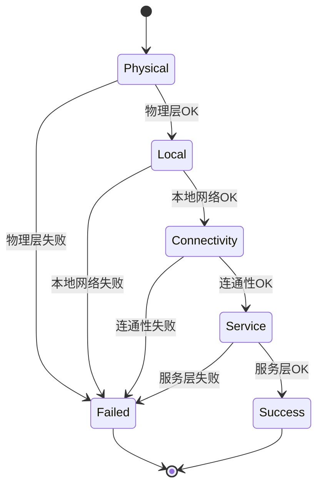

# 网络检测
#### 目录介绍
- 1.整体概述介绍
  - 1.1 项目背景说明
  - 1.2 分层检测架构
- 2.检测什么内容
  - 2.1 物理层能力
  - 2.2 本地层能力
  - 2.3 连通层能力
  - 2.4 服务层能力
- 4.整体架构设计
  - 4.1 核心设计思路
  - 4.2 核心设计目标
  - 4.3 核心接口设计
  - 4.4 分层抽象思想
  - 4.5 核心类层次结构
- 5.网络状态设计
  - 5.1 物理层检测
  - 5.2 本地网络检测
  - 5.3 连通性检测
  - 5.4 服务检测
- 6.网络状态实践
  - 6.1 物理层检测
  - 6.2 本地网络检测
  - 6.3 连通性检测
  - 6.4 服务检测


## 1.整体概述介绍

### 1.1 项目背景说明

产品背景：设计操作码，扫码识别之后，可以检测网络，从而排查出具体网络问题。

硬件通点：IoT设备在实际部署中经常遇到网络连接问题，传统的网络诊断方法往往只能给出"网络不通"的结果，无法精确定位问题层级。

解决方案：设计了一套分层网络检测系统，能够快速定位网络故障的具体位置，为运维和用户提供精准的问题诊断。

### 1.2 分层检测架构

网络连接失败的可能原因层级：

```text
┌─────────────────────────────────┐
│ 应用层：服务不可用、协议错误      │
├─────────────────────────────────┤
│ 传输层：端口被占用、连接超时      │
├─────────────────────────────────┤
│ 网络层：路由配置错误、IP冲突      │
├─────────────────────────────────┤
│ 数据链路层：MAC地址冲突、交换机故障│
├─────────────────────────────────┤
│ 物理层：网卡故障、驱动异常、线缆断开│ 
└─────────────────────────────────┘
```

设计原理：

- 逐层检测：从底层到高层依次检测，遇到失败立即停止，避免盲目排查
- 快速失败：避免在低层级问题上浪费时间进行高层级检测，减少人工介入时间
- 问题隔离：每层检测独立，便于精确定位问题根因

## 2.检测什么内容

### 2.1 网络检测背景

针对分层网络检测中的各种异常情况，提供具体的问题诊断和解决建议，帮助用户快速定位和修复网络问题。


## 3.查询网络设置

### 3.1 网络类型分类

```cpp
enum class NetworkType {
  kNone = 10000,      // 无网络
  kCellular = 10001,  // 蜂窝网络，4G网络
  kWifi = 10002,      // WiFi
  kEthernet = 10003,  // 以太网
  kOther = 10004,     // 其他
};

enum class NetworkConnectState {
  kDisconnected = 0,  // 断开连接
  kConnecting = 1,    // 连接中
  kConnected = 2,     // 已连接
  kUnknown = 99,      // 未知状态
};
```

## 4.整体架构设计

### 4.1 核心设计思路

```shell
开始检测
    ↓
1.物理层检测 → 失败 → 返回物理层错误
    ↓ 成功
2.本地网络检测 → 失败 → 返回本地网络错误  
    ↓ 成功
3.连通性检测 → 失败 → 返回连通性错误
    ↓ 成功
4.服务端检测 → 失败 → 返回服务端错误
    ↓ 成功
检测完成，返回成功结果
```

顺序检测原则

```text
物理层检测   → 本地网络检测   → 连通性检测   →   服务检测
   ↓              ↓              ↓            ↓
失败停止        失败停止        失败停止         完成
   ↓              ↓              ↓            ↓
 硬件问题        配置问题        连接问题      服务问题
```

### 4.2 核心设计目标

- **分层检测**：按照网络协议栈从底层到应用层逐步检测
- **快速失败**：一旦某层检测失败，立即返回错误，避免无效检测
- **简单实用**：保持接口简洁，易于理解和使用
- **详细诊断**：提供具体的错误信息和网络状态详情
- **核心目标**：这里针对每一层网络异常，给出具体原因，然后给前场弄个排查和解决方案手册！

### 4.3 核心接口实现

```cpp
class NetworkDetector {
public:
    enum class DetectionLevel {
        kPhysical,      // 物理层检测
        kLocal,         // 本地网络检测  
        kConnectivity,  // 连通性检测
        kService        // 服务检测
    };
    
    struct DetectionResult {
        bool success;
        DetectionLevel level;
        std::string error_message;
        std::map<std::string, std::string> details;
    };
    
    // 执行完整网络检测
    static DetectionResult PerformFullDetection();
    
    // 分层检测方法
    static DetectionResult CheckPhysicalLayer();
    static DetectionResult CheckLocalNetwork();
    static DetectionResult CheckConnectivity();
    static DetectionResult CheckServiceReachability();
    
    // 异步检测
    static void PerformDetectionAsync(std::function<void(DetectionResult)> callback);

private:
    // 辅助方法
    static bool TestHostReachability(const std::string& host, int timeout_sec = 5);
    static std::string GetNetworkInterfaceInfo(const std::string& interface);
};
```

检测流程示例图



### 4.4 分层抽象思想

复杂的网络问题被分解为四个独立的层级：

- **物理层**：硬件和驱动层面的问题
- **配置层**：系统网络配置问题
- **连通层**：网络连接和路由问题
- **服务层**：应用服务可达性问题

职责分离，每个层级只关注自己的检测范围：

```cpp
// 物理层：只关注接口和IP
class PhysicalLayerStrategy {
    bool IsInterfaceUp(const std::string& interface);
    std::string GetInterfaceIP(const std::string& interface);
};

// 本地配置层：只关注网络配置
class LocalNetworkStrategy {
    std::string GetDefaultGateway();
    std::vector<std::string> GetDNSServers();
};
```

### 4.5 核心类层次结构

```
BaseNetworkStrategy (抽象基类)
├── PhysicalLayerStrategy (物理层检测)
├── LocalNetworkStrategy (本地网络检测)
├── ConnectivityStrategy (连通性检测)
└── ServiceStrategy (服务检测)

NetworkDetectorManager (管理器)
├── DetectionResult (管理器结果类型)
├── DetectionLevel (检测层级枚举)
└── strategies_ (策略映射)

DetectionResult (策略结果类型)
├── success (检测是否成功)
├── strategy_name (策略名称)
├── error_message (错误信息)
└── details (详细信息)
```

## 5.网络状态设计

当前系统提供的功能

- `NetworkMonitorService` - 网络状态监控服务
- `NetworkInfo` - 网络类型和连接状态管理
- `SystemInterface::GetNetworkInfo()` - 获取网络详细信息
- `SystemInterface::IsNetworkInterfaceUp()` - 检查接口状态


### 5.1 物理层检测

**检测目标**：验证网络硬件和基础配置

**检测内容**：

- 1.网络接口：主要是有线网络接口，无线网络接口。常见网络接口状态检查 (eth0, wlan0, enp0s3, wlp2s0)
- 2.接口IP地址获取：确认接口是否获得了有效的IP地址
- 3.网卡UP/DOWN状态记录：UP表示接口已激活，可以收发数据；DOWN表示接口未激活，无法通信。

### 5.2 本地网络检测

**检测目标**：验证本地网络配置正确性

**检测内容**：

- 默认网关配置检查
- DNS服务器配置验证
- 路由表基础配置确认

### 5.3 连通性检测

**检测目标**：验证网络连通性和DNS解析

**检测策略**：

```cpp
bool PingHost(const std::string& host, int timeout_ms) {
    // 使用系统ping命令
    // 支持超时控制
}

bool CheckDNSResolution(const std::string& hostname) {
    // 使用 getaddrinfo() 系统调用
    // 验证域名解析功能
}
```

**检测内容**：

- 网关连通性测试 (ping gateway)
- 外网连通性测试 (ping 8.8.8.8, 114.114.114.114)
- DNS解析功能验证 (resolve baidu.com, google.com)

### 5.4 服务检测

**检测目标**：验证业务服务可达性

**检测方法**：
```cpp
bool TestHTTPConnection(const std::string& url, int timeout_ms) {
    // 使用项目HttpRequest类
    // 发送HTTP健康检查请求
    // 验证状态码 200-399
}
```

**检测内容**：
- 业务服务HTTP连接测试
- 服务主机基础连通性验证
- 完整业务链路可用性确认


## 6.网络状态实践

### 6.1 物理层检测

> 网络接口：主要是有线网络接口，无线网络接口。常见网络接口状态检查 (eth0, wlan0, enp0s3, wlp2s0)

- 有线网络接口：**eth0, eth1**：传统以太网接口命名；**enp0s3, enp1s0**：新命名规则（基于PCI总线位置）。
- 无线网络接口：**wlan0, wlan1**：传统WiFi接口命名；**wlp2s0, wlp3s0**：新命名规则的WiFi接口

检查系统中是否存在指定的网络接口命令：

```bash
# 方法1：检查/sys/class/net目录
ls /sys/class/net/
# 方法2：使用ip命令
ip link show
# 方法3：检查特定接口是否存在
test -d /sys/class/net/eth0 && echo "eth0 exists" || echo "eth0 not found"
```

**检测目标**：确认网络接口是否被系统识别并激活。

```cpp
bool IsInterfaceUp(const std::string& interface_name) {
    // 读取 /sys/class/net/{interface}/flags 文件
    // 检查 IFF_UP 标志位（0x1）
}
```

**检测逻辑**：

1. 检查接口目录是否存在：`/sys/class/net/eth0/`
2. 读取接口状态标志：`/sys/class/net/eth0/flags`
3. 解析十六进制标志位，检查IFF_UP位

**状态含义**：UP表示接口已激活，可以收发数据；DOWN表示接口未激活，无法通信。

```bash
# 方法1：读取flags文件。读取接口flags
cat /sys/class/net/eth0/flags
# 方法2：使用ip命令。检查状态（查找"UP"关键字）
ip link show eth0 | grep -q "state UP" && echo "UP" || echo "DOWN"
# 方法3：使用ifconfig命令。检查UP状态
ifconfig eth0 | grep -q "UP" && echo "UP" || echo "DOWN"
```

下面是结果：

```bash
[root@o2:/]# cat /sys/class/net/eth0/flags
0x9003
[root@o2:/]# ip link show eth0
2: eth0: <BROADCAST,MULTICAST,DYNAMIC,UP,LOWER_UP> mtu 1500 qdisc mq state UP mode DEFAULT group default qlen 1000
    link/ether e0:c0:d1:4e:70:75 brd ff:ff:ff:ff:ff:ff
[root@o2:/]# ip link show eth0 | grep -q "state UP" && echo "UP" || echo "DOWN"
UP
[root@o2:/]# ifconfig eth0 | grep -q "UP" && echo "UP" || echo "DOWN"
UP
```

> 2.接口IP地址获取：确认接口是否获得了有效的IP地址

**技术实现**：

```cpp
std::string GetInterfaceIP(const std::string& interface_name) {
    // 使用 getifaddrs() 系统调用
    // 遍历所有网络接口，提取IPv4地址
}
```

**检测逻辑**：

1. 调用系统API获取所有接口信息
2. 筛选目标接口的IPv4地址
3. 验证IP地址有效性（非0.0.0.0）

**地址类型**：

- **192.168.x.x**：私有网络地址（家庭/办公室）
- **10.x.x.x**：企业内网地址
- **172.16-31.x.x**：中型网络地址
- **169.254.x.x**：自动分配地址（通常表示DHCP失败）

确认接口是否获得了有效的IP地址，命令如下所示：

```bash
# 方法1：使用ip命令。提取IPv4地址
ip addr show eth0 | grep "inet " | awk '{print $2}' | cut -d'/' -f1
# 方法2：使用ifconfig命令。提取IP地址
ifconfig eth0 | grep "inet " | awk '{print $2}'
```

运维排查：

1. 有线网络检查：网线两端连接牢固，网线无明显损坏，交换机/路由器正常工作（指示灯亮），尝试更换网线，尝试更换网口
2. 无线网络检查：WiFi功能已开启，在WiFi覆盖范围内，路由器正常工作，尝试连接其他WiFi网络(比如自己手机热点)

实际情况：

1. 场景：设备突然无法上网，之前工作正常
  - 重启设备，关机30秒后重新开机
  - 检查物理连接。有线：重新插拔网线两端；无线：检查WiFi开关状态
  - 重启网络设备。重启路由器/交换机
  - 观察指示灯变化。记录重启前后的指示灯状态
  - **成功标志**：设备指示灯恢复正常，可以正常上网

### 6.2 本地网络检测


检查系统是否配置了默认网关，这是访问外网的基础。

```bash
# 方法1：读取/proc/net/route文件。查看路由表文件
cat /proc/net/route
# 方法2：使用ip命令
# 获取默认路由
ip route show default
# 提取网关IP
ip route show default | awk '/default/ {print $3}'
# 方法3：使用route命令。提取默认网关
route -n | awk '$1=="0.0.0.0" {print $2}'
```

检查系统DNS配置，确保域名解析功能正常。

```bash
# 方法1：读取/etc/resolv.conf
# 查看DNS配置
cat /etc/resolv.conf
# 提取DNS服务器
grep "^nameserver" /etc/resolv.conf | awk '{print $2}'
# 方法2：systemd-resolved配置
# 查看systemd-resolved运行时配置
cat /run/systemd/resolve/resolv.conf
# 使用resolvectl命令
resolvectl status | grep "DNS Servers:" | head -1
# 方法3：NetworkManager配置。查看NetworkManager DNS配置
nmcli dev show | grep IP4.DNS
```

检查本地网络路由配置，确保设备能够与同网段设备通信。

```bash
# 方法1：解析/proc/net/route文件。查看完整路由表
cat /proc/net/route
# 方法2：使用ip命令。
# 显示所有路由
ip route show
# 显示本地网络路由（排除默认路由）
ip route show | grep -v default
# 显示直连路由
ip route show | grep -E "dev.*scope link"
# 方法3：使用route命令
# 显示路由表
route -n
# 显示本地网络路由
route -n | awk '$1!="0.0.0.0" && $2=="0.0.0.0" {print $1"/"$3" dev "$8}'
```

### 6.3 连通性检测

测试设备是否能够与默认网关通信，这是访问外网的第一步。

```bash
# 步骤1：查看默认网关
# 查看默认网关地址
ip route | grep default
# 或者使用route命令
route -n | grep "^0.0.0.0"
# 步骤2：测试网关连通性
# 假设网关是192.168.1.1，替换为实际网关地址
ping -c 3 192.168.1.1
# 快速测试（1次ping，3秒超时）
ping -c 1 -W 3 192.168.1.1
# 步骤3: 检测结果
# 自动获取网关并测试（一行命令）
ping -c 1 -W 3 $(ip route | grep default | awk '{print $3}' | head -1)
```

测试设备是否能够访问互联网上的公共服务器。

```bash
# 方法1：ping公共DNS服务器
# 测试Google DNS
ping -c 3 8.8.8.8
# 测试114 DNS
ping -c 3 114.114.114.114
# 方法2：测试多个主机（逐个尝试）
```bash
# 如果第一个失败，尝试第二个
ping -c 1 -W 3 8.8.8.8 || ping -c 1 -W 3 114.114.114.114 || ping -c 1 -W 3 1.1.1.1
# 方法3：HTTP连接测试
# 测试HTTP连接
curl -s --connect-timeout 5 http://www.baidu.com > /dev/null && echo "HTTP连接成功" || echo "HTTP连接失败"
# 测试HTTPS连接
curl -s --connect-timeout 5 https://www.baidu.com > /dev/null && echo "HTTPS连接成功" || echo "HTTPS连接失败"
# 快速外网连通性测试
ping -c 1 -W 3 8.8.8.8 && echo "✅ 外网连通" || echo "❌ 外网不通"
```

测试DNS解析功能是否正常工作。

```bash
# 步骤1：检查DNS配置
# 查看DNS服务器配置。这个不可用
cat /etc/resolv.conf | grep nameserver
# 步骤2：测试域名解析
# 测试百度域名解析
nslookup www.baidu.com
# 测试QQ域名解析
nslookup www.qq.com
# 快速DNS解析测试
nslookup www.baidu.com > /dev/null 2>&1 && echo "✅ DNS解析正常" || echo "❌ DNS解析失败"
```


### 6.4 服务检测

验证服务器是否可达，能否建立基本的HTTP连接。


```bash
# 方法1：使用curl测试HTTP连接
# 基本HTTP连接测试
curl -I --connect-timeout 5 https://device.gz-ty.palm.tencent.com
# 方法2：使用wget测试
# 使用wget测试连接
wget --timeout=5 --tries=1 --spider https://device.gz-ty.palm.tencent.com
# 检查返回状态
echo $?  # 0表示成功，非0表示失败
# 快速HTTP连接测试
curl -s --connect-timeout 5 https://device.gz-ty.palm.tencent.com > /dev/null && echo "✅ HTTP连接成功" || echo "❌ HTTP连接失败"
```

测试服务的健康检查端点，验证服务内部状态。

```bash
# 步骤1：测试标准健康检查端点
# 测试 /health 端点
curl -I --connect-timeout 3 https://device.gz-ty.palm.tencent.com/xxx
# 查看响应内容
curl -s --connect-timeout 3 https://device.gz-ty.palm.tencent.com/xxx
```bash
# 快速健康检查测试
curl -s --connect-timeout 3 https://device.gz-ty.palm.tencent.com/xxx > /dev/null 2>&1 && echo "✅ 健康检查通过" || echo "❌ 健康检查失败"
```


