# 状态机设计的思想
#### 目录介绍
- [1.什么是状态机](#1什么是状态机)
  - [1.1 一句话概括](#11-一句话概括)
  - [1.2 订单状态机](#12-订单状态机)
  - [1.3 状态机定义](#13-状态机定义)
  - [1.4 状态机类型](#14-状态机类型)
  - [1.5 状态机数学定义](#15-状态机数学定义)
  - [1.6 状态机流程](#16-状态机流程)
- [2.来看一个案例](#2来看一个案例)
  - [2.1 业务的需求](#21-业务的需求)
  - [2.2 无状态机实现](#22-无状态机实现)
  - [2.3 有状态机实现](#23-有状态机实现)
  - [2.4 代码结构对比](#24-代码结构对比)
  - [2.5 对比和总结](#25-对比和总结)
  - [2.6 核心思想机制](#26-核心思想机制)
  - [2.7 核心设计理念](#27-核心设计理念)
  - [2.8 状态机哲学](#28-状态机哲学)
  - [2.9 状态机设计原则](#29-状态机设计原则)
- [3.状态机的场景](#3状态机的场景)
  - [3.1 应用领域分布](#31-应用领域分布)
  - [3.2 订单处理系统](#32-订单处理系统)
  - [3.3 游戏开发](#33-游戏开发)
  - [3.4 工作流引擎](#34-工作流引擎)
  - [3.5 物流系统](#35-物流系统)
- [4.主要解决问题](#4主要解决问题)
  - [4.1 复杂性管理问题](#41-复杂性管理问题)
  - [4.2 业务流程控制](#42-业务流程控制)
- [5.为何设计状态机](#5为何设计状态机)
  - [5.1 设计的动机](#51-设计的动机)
  - [5.2 传统VS状态机](#52-传统vs状态机)
  - [5.3 状态机价值](#53-状态机价值)
- [06.状态机核心要素](#06状态机核心要素)
  - [6.1 状态机组成要素](#61-状态机组成要素)
  - [6.2 状态生命周期](#62-状态生命周期)
  - [6.3 事件处理机制](#63-事件处理机制)
- [07.状态机核心原理](#07状态机核心原理)
  - [7.1 状态转换原理](#71-状态转换原理)
  - [7.2 状态机执行模型](#72-状态机执行模型)
  - [7.3 层次状态机原理](#73-层次状态机原理)
- [08.状态机案例](#08状态机案例)
  - [8.1 状态机基础框架](#81-状态机基础框架)
  - [8.2 具体状态实现](#82-具体状态实现)
  - [8.3 使用示例](#83-使用示例)
  - [8.4 测试效果](#84-测试效果)
  - [8.5 高级状态机特性](#85-高级状态机特性)
  - [8.6 状态机UML图](#86-状态机uml图)
- [09.问题与弊端](#09问题与弊端)
  - [9.1 常见问题分析](#91-常见问题分析)
  - [9.2 状态爆炸问题](#92-状态爆炸问题)
  - [9.3 性能开销分析](#93-性能开销分析)
  - [9.4 设计陷阱](#94-设计陷阱)
  - [9.5 调试与测试挑战](#95-调试与测试挑战)
  - [9.6 适用性评估](#96-适用性评估)
  - [9.7 最佳实践建议](#97-最佳实践建议)
- [10.总结和分析](#10总结和分析)
  - [10.1 核心要点回顾](#101-核心要点回顾)
  - [10.2 使用决策矩阵](#102-使用决策矩阵)


## 1.什么是状态机

### 1.1 一句话概括

状态机（State Machine）是一种数学模型，用于描述系统在不同状态之间的转换行为。它是一种抽象的计算模型，能够精确描述系统在任意时刻的状态以及状态之间的转换条件。

状态机就是一个“智能开关”，它根据当前的状态和输入，按照预定的规则决定下一步该做什么。它把复杂的行为分解成简单的状态和规则，让系统更清晰、更可控。

### 1.2 订单状态机

想象一下，你在网上买了一件商品，订单会经历多个状态，比如：

1. **待支付**：你刚下单，但还没付钱。
2. **已支付**：你付了钱，商家准备发货。
3. **已发货**：商家把商品寄出了，正在运输中。
4. **已收货**：你收到了商品。
5. **已完成**：你确认收货，订单完成。
6. **已取消**：你取消了订单。

这些状态之间的切换是由你的操作（输入）触发的，比如付款、取消订单、确认收货等。

订单状态机就是一个“智能流程管理器”，它根据订单的当前状态和你的操作，决定订单的下一个状态。比如：

- 你支付了钱，订单从“待支付”变成“已支付”。
- 你取消了订单，订单变成“已取消”。

### 1.3 状态机定义

状态机是一种数学模型，用于描述系统在不同状态之间的行为。它由以下核心组件构成：

1. **状态（State）**：系统当前所处的“模式”或“情况”。订单的当前阶段，比如“待支付”、“已支付”等。
2. **事件（Event）**：触发状态变化的输入或动作。比如“支付”、“取消订单”、“确认收货”等。
3. **转换（Transition）**：状态之间的切换规则，从一个状态到另一个状态的变化。比如“支付”事件会将订单从“待支付”切换到“已支付”。
4. **动作（Action）**：在状态转换时执行的操作。比如发送发货通知、更新库存等。

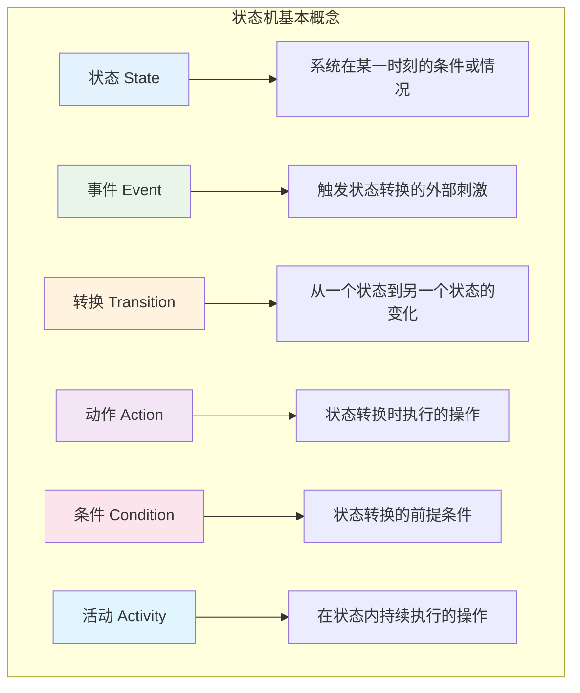
```mermaid
graph TB
    subgraph "状态机基本概念"
        A[状态 State] --> A1[系统在某一时刻的条件或情况]
        B[事件 Event] --> B1[触发状态转换的外部刺激]
        C[转换 Transition] --> C1[从一个状态到另一个状态的变化]
        D[动作 Action] --> D1[状态转换时执行的操作]
        E[条件 Condition] --> E1[状态转换的前提条件]
        F[活动 Activity] --> F1[在状态内持续执行的操作]
    end
    
    style A fill:#e3f2fd
    style B fill:#e8f5e8
    style C fill:#fff3e0
    style D fill:#f3e5f5
    style E fill:#fce4ec
    style F fill:#e1f5fe
```

### 1.4 状态机类型

状态机主要分为两类：

1. **有限状态机（Finite State Machine, FSM）**： 系统状态的数量是有限的。例如，交通信号灯的状态（红、黄、绿）。
2. **无限状态机（Infinite State Machine）**：系统状态的数量是无限的。例如，计数器的状态（理论上可以无限增加）。

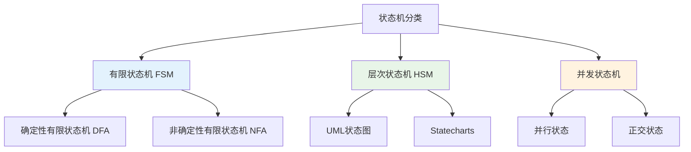
```mermaid
graph TD
    A[状态机分类] --> B[有限状态机 FSM]
    A --> C[层次状态机 HSM]
    A --> D[并发状态机]
    
    B --> B1[确定性有限状态机 DFA]
    B --> B2[非确定性有限状态机 NFA]
    
    C --> C1[UML状态图]
    C --> C2[Statecharts]
    
    D --> D1[并行状态]
    D --> D2[正交状态]
    
    style B fill:#e3f2fd
    style C fill:#e8f5e8
    style D fill:#fff3e0
```

### 1.5 状态机数学定义

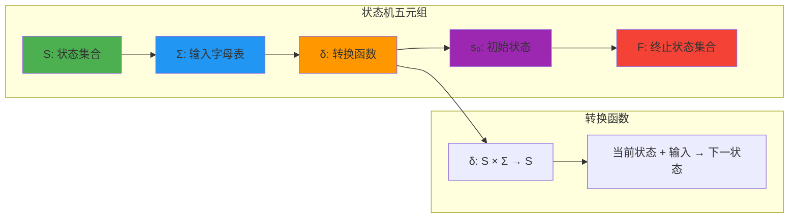
```mermaid
graph LR
    subgraph "状态机五元组"
        A[S: 状态集合] --> B[Σ: 输入字母表]
        B --> C[δ: 转换函数]
        C --> D[s₀: 初始状态]
        D --> E[F: 终止状态集合]
    end
    
    subgraph "转换函数"
        F[δ: S × Σ → S]
        G[当前状态 + 输入 → 下一状态]
    end
    
    C --> F
    F --> G
    
    style A fill:#4caf50
    style B fill:#2196f3
    style C fill:#ff9800
    style D fill:#9c27b0
    style E fill:#f44336
```

### 1.6 状态机流程

**订单状态机的完整流程**

1. **初始状态：待支付**
  - **事件**：用户支付。
  - **转换**：待支付 → 已支付。
  - **动作**：更新状态为“已支付”，发送支付成功通知。

2. **状态：已支付**
  - **事件**：商家发货。
  - **转换**：已支付 → 已发货。
  - **动作**：更新状态为“已发货”，发送发货通知。

3. **状态：已发货**
  - **事件**：用户确认收货。
  - **转换**：已发货 → 已收货。
  - **动作**：更新状态为“已收货”，发送确认收货通知。

4. **状态：已收货**
  - **事件**：用户确认订单完成。
  - **转换**：已收货 → 已完成。
  - **动作**：更新状态为“已完成”，记录交易完成。

5. **状态：已取消**
  - **事件**：用户取消订单，或支付超时。
  - **转换**：待支付 → 已取消。
  - **动作**：更新状态为“已取消”，释放库存。


## 2.来看一个案例

### 2.1 业务的需求

场景：订单有多个状态，包括：待支付、已支付、已发货、已收货、已完成、已取消。

订单状态转换规则：

```text
待支付 -> 已支付（支付）
已支付 -> 已发货（发货）
已发货 -> 已收货（确认收货）
已收货 -> 已完成（完成订单）
待支付 -> 已取消（取消订单）
已支付 -> 已取消（取消订单，需退款）
```

### 2.2 无状态机实现

```java
/**
 * 不使用状态机的订单服务
 * 问题：大量if-else判断，状态逻辑分散，难以维护和扩展
 */
public class SimpleOrderServiceWithoutStateMachine {

    public enum OrderStatus {
        PENDING, PAID, SHIPPED, RECEIVED, COMPLETED, CANCELLED
    }

    static class Order {
        private String orderId;
        private OrderStatus status;
        private double amount;

        public Order(String orderId, double amount) {
            this.orderId = orderId;
            this.amount = amount;
            this.status = OrderStatus.PENDING;
        }

        // getters and setters
        public String getOrderId() { return orderId; }
        public OrderStatus getStatus() { return status; }
        public void setStatus(OrderStatus status) { this.status = status; }
        public double getAmount() { return amount; }
    }

    public class OrderService {
        /**
         * 支付订单 - 充满if-else的实现
         */
        public boolean payOrder(Order order, double amount) {
            // 状态检查逻辑分散在各个方法中
            if (order.getStatus() != OrderStatus.PENDING) {
                System.out.println("订单状态不是待支付，无法支付");
                return false;
            }
            if (amount < order.getAmount()) {
                System.out.println("支付金额不足");
                return false;
            }
            // 业务逻辑处理
            System.out.println("处理支付...");
            order.setStatus(OrderStatus.PAID);
            System.out.println("支付成功，状态: " + order.getStatus());
            return true;
        }

        /**
         * 发货订单 - 重复的状态检查模式
         */
        public boolean shipOrder(Order order) {
            if (order.getStatus() != OrderStatus.PAID) {
                System.out.println("订单状态不是已支付，无法发货");
                return false;
            }
            System.out.println("处理发货...");
            order.setStatus(OrderStatus.SHIPPED);
            System.out.println("发货成功，状态: " + order.getStatus());
            return true;
        }

        /**
         * 取消订单 - 复杂的多状态处理逻辑
         */
        public boolean cancelOrder(Order order) {
            OrderStatus currentStatus = order.getStatus();
            // 根据不同状态执行不同逻辑 - 状态转换逻辑分散
            if (currentStatus == OrderStatus.PENDING) {
                System.out.println("取消待支付订单");
                order.setStatus(OrderStatus.CANCELLED);
                return true;
            } else if (currentStatus == OrderStatus.PAID) {
                System.out.println("取消已支付订单，需要退款");
                // 退款逻辑
                order.setStatus(OrderStatus.CANCELLED);
                return true;
            } else if (currentStatus == OrderStatus.SHIPPED) {
                System.out.println("取消已发货订单，需要拦截物流");
                // 拦截物流逻辑
                order.setStatus(OrderStatus.CANCELLED);
                return true;
            } else {
                System.out.println("当前状态不能取消: " + currentStatus);
                return false;
            }
        }

        /**
         * 确认收货
         */
        public boolean confirmReceipt(Order order) {
            if (order.getStatus() != OrderStatus.SHIPPED) {
                System.out.println("订单状态不是已发货，无法确认收货");
                return false;
            }
            System.out.println("确认收货...");
            order.setStatus(OrderStatus.RECEIVED);
            System.out.println("确认收货成功，状态: " + order.getStatus());
            return true;
        }
    }

    public static void main(String[] args) {
        SimpleOrderServiceWithoutStateMachine demo = new SimpleOrderServiceWithoutStateMachine();
        OrderService service = demo.new OrderService();
        System.out.println("=== 不使用状态机的订单服务 ===");
        // 创建订单
        Order order = new Order("ORDER001", 100.0);
        System.out.println("创建订单，初始状态: " + order.getStatus());
        // 正常流程
        service.payOrder(order, 100.0);
        service.shipOrder(order);
        // 尝试非法操作：已发货状态下支付
        System.out.println("\n尝试非法操作：");
        service.payOrder(order, 100.0);  // 应该失败
        service.confirmReceipt(order);
        System.out.println("\n最终状态: " + order.getStatus());
    }
}
```

无状态机版本的问题分析：

1. 代码重复：每个方法都有相同的空值检查和状态检查
2. 逻辑分散：状态转换规则分散在各个方法中
3. 难以扩展：新增状态或操作需要修改多个方法
4. 容易出错：条件判断复杂，容易遗漏边界情况
5. 难以测试：每个方法都有一堆前置条件

### 2.3 有状态机实现

#### 2.3.1 状态 (States)设计

订单的状态是订单当前所处的阶段，包括：

- **待支付**：订单已创建，但用户还未支付。
- **已支付**：用户已支付，商家准备发货。
- **已发货**：商家已发货，商品在运输中。
- **已收货**：用户已收到商品。
- **已完成**：用户确认收货，订单完成。
- **已取消**：订单被取消。

```java
public enum OrderState {
    PENDING,       // 待支付 - 初始状态
    PAID,          // 已支付 - 中间状态
    SHIPPED,       // 已发货 - 中间状态  
    RECEIVED,      // 已收货 - 中间状态
    COMPLETED,     // 已完成 - 终态
    CANCELLED      // 已取消 - 终态
}
```

**状态分类：**

- **初始状态**：`PENDING` - 订单创建时的默认状态
- **中间状态**：`PAID`, `SHIPPED`, `RECEIVED` - 可以继续转换的状态
- **终态**：`COMPLETED`, `CANCELLED` - 不能再转换的最终状态

**状态特征：**

- 每个状态代表订单在业务流程中的一个阶段
- 状态是互斥的，订单在任意时刻只能处于一个状态
- 状态具有业务含义，反映订单的当前处理阶段


#### 2.3.2 事件 (Events)设计

事件是触发状态变化的用户操作或系统行为，包括：

- **支付**：用户完成支付。
- **发货**：商家发货。
- **收货**：用户确认收到商品。
- **取消**：用户或商家取消订单。
- **超时**：支付超时，订单自动取消。

```java
public enum OrderEvent {
    PAY,            // 支付事件 - 触发支付流程
    SHIP,           // 发货事件 - 触发发货流程
    CANCEL,         // 取消事件 - 触发取消流程
    CONFIRM_RECEIPT,// 确认收货事件 - 触发收货确认
    COMPLETE        // 完成事件 - 触发订单完成
}
```

**事件特征：**

- 事件是触发状态转换的外部刺激
- 事件通常对应用户操作或系统触发的业务动作
- 同一个事件在不同状态下可能产生不同的转换结果
- 事件是瞬时的，不持久存在

#### 2.3.3 转换 (Transitions)设计

转换是状态之间的切换规则，由事件触发。例如：

- **待支付 → 已支付**：用户支付了订单。
- **待支付 → 已取消**：用户取消了订单，或支付超时。
- **已支付 → 已发货**：商家发货。
- **已发货 → 已收货**：用户确认收货。
- **已收货 → 已完成**：用户确认订单完成。

转换规则在 `getNextState()` 方法中定义：

```java
private OrderState getNextState(OrderState currentState, OrderEvent event) {
    switch (currentState) {
        case PENDING:
            if (event == OrderEvent.PAY) return OrderState.PAID;        // PENDING + PAY → PAID
            if (event == OrderEvent.CANCEL) return OrderState.CANCELLED; // PENDING + CANCEL → CANCELLED
            break;
            
        case PAID:
            if (event == OrderEvent.SHIP) return OrderState.SHIPPED;     // PAID + SHIP → SHIPPED
            if (event == OrderEvent.CANCEL) return OrderState.CANCELLED; // PAID + CANCEL → CANCELLED
            break;
            
        case SHIPPED:
            if (event == OrderEvent.CONFIRM_RECEIPT) return OrderState.RECEIVED; // SHIPPED + CONFIRM_RECEIPT → RECEIVED
            if (event == OrderEvent.CANCEL) return OrderState.CANCELLED;         // SHIPPED + CANCEL → CANCELLED
            break;
            
        case RECEIVED:
            if (event == OrderEvent.COMPLETE) return OrderState.COMPLETED; // RECEIVED + COMPLETE → COMPLETED
            break;
            
        case COMPLETED:
        case CANCELLED:
            // 终态，不允许转换
            break;
    }
    return null; // 不支持的转换
}
```

**转换规则表：**

| 当前状态 | 事件 | 目标状态 | 说明 |
|---------|------|---------|------|
| PENDING | PAY | PAID | 待支付→已支付 |
| PENDING | CANCEL | CANCELLED | 待支付→已取消 |
| PAID | SHIP | SHIPPED | 已支付→已发货 |
| PAID | CANCEL | CANCELLED | 已支付→已取消 |
| SHIPPED | CONFIRM_RECEIPT | RECEIVED | 已发货→已收货 |
| SHIPPED | CANCEL | CANCELLED | 已发货→已取消 |
| RECEIVED | COMPLETE | COMPLETED | 已收货→已完成 |
| COMPLETED | - | - | 终态，无转换 |
| CANCELLED | - | - | 终态，无转换 |

**转换特征：**

- 转换是有条件的：只有特定的 (状态,事件) 组合才能触发转换
- 转换是确定性的：相同的 (状态,事件) 组合总是产生相同的结果
- 非法转换会被拒绝：不在转换表中的组合返回null

#### 2.3.4 动作 (Actions)设计

动作是在状态转换时执行的具体操作，例如：

- **支付成功**：更新订单状态为“已支付”，并发送支付成功通知。
- **发货**：更新订单状态为“已发货”，并发送发货通知。
- **取消订单**：更新订单状态为“已取消”，并释放库存。
- **确认收货**：更新订单状态为“已收货”，并发送确认收货通知。
- **订单完成**：更新订单状态为“已完成”，并记录交易完成。

动作在 `executeBusinessLogic()` 方法中定义：

```java
private boolean executeBusinessLogic(OrderState from, OrderEvent event, OrderState to) {
    switch (event) {
        case PAY:
            System.out.println("执行支付逻辑...");
            // 实际业务：调用支付接口、扣减库存、发送通知等
            return true;
            
        case SHIP:
            System.out.println("执行发货逻辑...");
            // 实际业务：创建物流单、更新库存、发送发货通知等
            return true;
            
        case CANCEL:
            System.out.println("执行取消逻辑...");
            // 根据当前状态执行不同的取消逻辑
            if (from == OrderState.PAID || from == OrderState.SHIPPED) {
                System.out.println("处理退款...");
                // 实际业务：退款处理、恢复库存等
            }
            return true;
            
        case CONFIRM_RECEIPT:
            System.out.println("执行确认收货逻辑...");
            // 实际业务：更新物流状态、启动自动确认计时器等
            return true;
            
        case COMPLETE:
            System.out.println("执行完成订单逻辑...");
            // 实际业务：发放积分、生成评价入口、归档订单等
            return true;
            
        default:
            return false;
    }
}
```

**动作类型：**

- **进入动作**：状态转换时执行的业务逻辑
- **条件动作**：根据源状态执行不同逻辑（如取消时的退款处理）
- **副作用**：打印日志、发送通知、更新数据库等


#### 2.3.5 状态机运行环境

状态机运行环境 (State Machine Context)设计

```java
static class OrderStateMachine {
    private Order order;  // 状态机上下文数据
    
    public OrderStateMachine(Order order) {
        this.order = order;
    }
    
    // 状态机的核心运行方法
    public boolean trigger(OrderEvent event) {
        OrderState currentState = order.getStatus();
        OrderState newState = getNextState(currentState, event);
        
        if (newState == null) {
            System.out.println("不支持的状态转换: " + currentState + " -> " + event);
            return false;
        }
        
        // 执行转换前的业务逻辑
        if (executeBusinessLogic(currentState, event, newState)) {
            order.setStatus(newState);  // 更新状态
            System.out.println("状态转换: " + currentState + " -> " + newState);
            return true;
        }
        
        return false;
    }
}
```

运行环境特征

- **状态存储**：Order对象存储当前状态
- **事件处理**：trigger()方法统一处理所有事件
- **转换控制**：getNextState()控制状态转换逻辑
- **业务执行**：executeBusinessLogic()执行业务动作
- **错误处理**：非法转换的统一处理机制

```java
/**
 * 使用状态机的订单服务实现
 * 特点：状态转换逻辑集中，代码清晰，易于扩展
 */
public class SimpleOrderServiceWithStateMachine {

    // 1. 定义状态枚举
    public enum OrderState {
        PENDING, PAID, SHIPPED, RECEIVED, COMPLETED, CANCELLED
    }

    // 2. 定义事件枚举
    public enum OrderEvent {
        PAY, SHIP, CANCEL, CONFIRM_RECEIPT, COMPLETE
    }

    static class Order {
        private String orderId;
        private OrderState status;
        private double amount;

        public Order(String orderId, double amount) {
            this.orderId = orderId;
            this.amount = amount;
            this.status = OrderState.PENDING;
        }

        // getters and setters
        public String getOrderId() { return orderId; }
        public OrderState getStatus() { return status; }
        public void setStatus(OrderState status) { this.status = status; }
        public double getAmount() { return amount; }
    }

    /**
     * 状态机核心 - 所有状态转换逻辑集中在这里
     */
    static class OrderStateMachine {
        private Order order;

        public OrderStateMachine(Order order) {
            this.order = order;
        }

        /**
         * 触发事件，执行状态转换
         * 核心优势：统一的状态转换入口
         */
        public boolean trigger(OrderEvent event) {
            OrderState currentState = order.getStatus();
            OrderState newState = getNextState(currentState, event);
            if (newState == null) {
                System.out.println("不支持的状态转换: " + currentState + " -> " + event);
                return false;
            }
            // 执行转换前的业务逻辑
            if (executeBusinessLogic(currentState, event, newState)) {
                order.setStatus(newState);
                System.out.println("状态转换: " + currentState + " -> " + newState);
                return true;
            }
            return false;
        }

        /**
         * 状态转换规则 - 集中定义所有转换规则
         * 优势：一目了然，易于维护
         */
        private OrderState getNextState(OrderState currentState, OrderEvent event) {
            switch (currentState) {
                case PENDING:
                    if (event == OrderEvent.PAY) return OrderState.PAID;
                    if (event == OrderEvent.CANCEL) return OrderState.CANCELLED;
                    break;
                case PAID:
                    if (event == OrderEvent.SHIP) return OrderState.SHIPPED;
                    if (event == OrderEvent.CANCEL) return OrderState.CANCELLED;
                    break;
                case SHIPPED:
                    if (event == OrderEvent.CONFIRM_RECEIPT) return OrderState.RECEIVED;
                    if (event == OrderEvent.CANCEL) return OrderState.CANCELLED;
                    break;
                case RECEIVED:
                    if (event == OrderEvent.COMPLETE) return OrderState.COMPLETED;
                    break;
                case COMPLETED:
                case CANCELLED:
                    // 终态，不允许转换
                    break;
            }
            return null; // 不支持的转换
        }

        /**
         * 执行业务逻辑 - 根据状态转换执行相应的业务操作
         */
        private boolean executeBusinessLogic(OrderState from, OrderEvent event, OrderState to) {
            switch (event) {
                case PAY:
                    System.out.println("执行支付逻辑...");
                    return true;
                case SHIP:
                    System.out.println("执行发货逻辑...");
                    return true;
                case CANCEL:
                    System.out.println("执行取消逻辑...");
                    // 根据当前状态执行不同的取消逻辑
                    if (from == OrderState.PAID || from == OrderState.SHIPPED) {
                        System.out.println("处理退款...");
                    }
                    return true;
                case CONFIRM_RECEIPT:
                    System.out.println("执行确认收货逻辑...");
                    return true;
                case COMPLETE:
                    System.out.println("执行完成订单逻辑...");
                    return true;
                default:
                    return false;
            }
        }
    }

    public class OrderService {

        /**
         * 支付订单 - 简洁的实现，只需触发事件
         */
        public boolean payOrder(Order order, double amount) {
            if (amount < order.getAmount()) {
                System.out.println("支付金额不足");
                return false;
            }
            OrderStateMachine stateMachine = new OrderStateMachine(order);
            return stateMachine.trigger(OrderEvent.PAY);
        }

        /**
         * 发货订单 - 简洁的实现
         */
        public boolean shipOrder(Order order) {
            OrderStateMachine stateMachine = new OrderStateMachine(order);
            return stateMachine.trigger(OrderEvent.SHIP);
        }

        /**
         * 取消订单 - 简洁的实现，状态机自动处理复杂逻辑
         */
        public boolean cancelOrder(Order order) {
            OrderStateMachine stateMachine = new OrderStateMachine(order);
            return stateMachine.trigger(OrderEvent.CANCEL);
        }

        /**
         * 确认收货 - 简洁的实现
         */
        public boolean confirmReceipt(Order order) {
            OrderStateMachine stateMachine = new OrderStateMachine(order);
            return stateMachine.trigger(OrderEvent.CONFIRM_RECEIPT);
        }

        /**
         * 完成订单 - 简洁的实现
         */
        public boolean completeOrder(Order order) {
            OrderStateMachine stateMachine = new OrderStateMachine(order);
            return stateMachine.trigger(OrderEvent.COMPLETE);
        }
    }

    public static void main(String[] args) {
        SimpleOrderServiceWithStateMachine demo = new SimpleOrderServiceWithStateMachine();
        OrderService service = demo.new OrderService();
        System.out.println("=== 使用状态机的订单服务 ===");
        // 创建订单
        Order order = new Order("ORDER001", 100.0);
        System.out.println("创建订单，初始状态: " + order.getStatus());
        // 正常流程
        service.payOrder(order, 100.0);
        service.shipOrder(order);
        // 尝试非法操作：已发货状态下支付
        System.out.println("\n尝试非法操作：");
        service.payOrder(order, 100.0);  // 状态机自动拒绝
        service.confirmReceipt(order);
        service.completeOrder(order);
        System.out.println("\n最终状态: " + order.getStatus());
    }
}
```

状态机运行流程

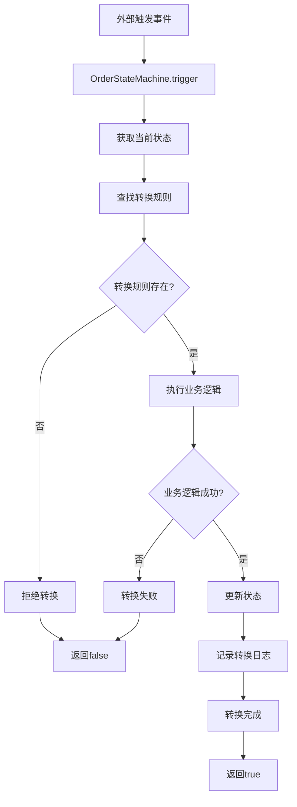
```mermaid
graph TD
    A[外部触发事件] --> B[OrderStateMachine.trigger]
    B --> C[获取当前状态]
    C --> D[查找转换规则]
    D --> E{转换规则存在?}
    E -->|否| F[拒绝转换]
    E -->|是| G[执行业务逻辑]
    G --> H{业务逻辑成功?}
    H -->|否| I[转换失败]
    H -->|是| J[更新状态]
    J --> K[记录转换日志]
    K --> L[转换完成]
    
    F --> M[返回false]
    I --> M
    L --> N[返回true]
```

状态转换图

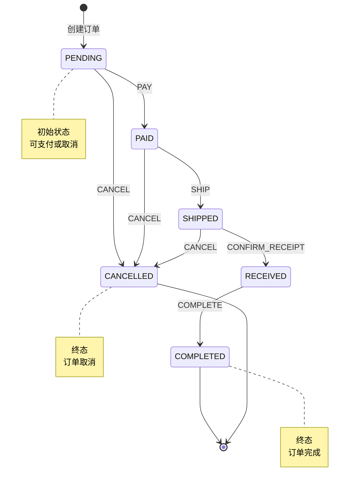
```mermaid
stateDiagram-v2
    [*] --> PENDING : 创建订单
    
    PENDING --> PAID : PAY
    PENDING --> CANCELLED : CANCEL
    
    PAID --> SHIPPED : SHIP
    PAID --> CANCELLED : CANCEL
    
    SHIPPED --> RECEIVED : CONFIRM_RECEIPT
    SHIPPED --> CANCELLED : CANCEL
    
    RECEIVED --> COMPLETED : COMPLETE
    
    COMPLETED --> [*]
    CANCELLED --> [*]
    
    note right of PENDING
        初始状态
        可支付或取消
    end note
    
    note right of COMPLETED
        终态
        订单完成
    end note
    
    note right of CANCELLED
        终态
        订单取消
    end note
```

### 2.4 代码结构对比

不使用状态机的问题

```java
// 每个方法都要重复检查状态
public boolean payOrder(Order order, double amount) {
    if (order.getStatus() != OrderStatus.PENDING) {  // 状态检查分散
        System.out.println("订单状态不是待支付，无法支付");
        return false;
    }
    // 业务逻辑...
}

public boolean cancelOrder(Order order) {
    OrderStatus currentStatus = order.getStatus();
    
    // 复杂的if-else逻辑，状态转换规则分散
    if (currentStatus == OrderStatus.PENDING) {
        // 处理逻辑1
    } else if (currentStatus == OrderStatus.PAID) {
        // 处理逻辑2
    } else if (currentStatus == OrderStatus.SHIPPED) {
        // 处理逻辑3
    } else {
        return false;
    }
}
```

使用状态机的优势

```java
// 状态转换规则集中定义
private OrderState getNextState(OrderState currentState, OrderEvent event) {
    switch (currentState) {
        case PENDING:
            if (event == OrderEvent.PAY) return OrderState.PAID;
            if (event == OrderEvent.CANCEL) return OrderState.CANCELLED;
            break;
        // 所有转换规则一目了然
    }
}

// 业务方法变得简洁
public boolean payOrder(Order order, double amount) {
    OrderStateMachine stateMachine = new OrderStateMachine(order);
    return stateMachine.trigger(OrderEvent.PAY);  // 只需触发事件
}
```

维护性对比

| 方面 | 不使用状态机 | 使用状态机 |
|------|-------------|-----------|
| **状态检查** | 分散在各个方法中 | 集中在状态机中 |
| **转换规则** | 散布在if-else中 | 统一在转换表中 |
| **新增状态** | 需要修改多个方法 | 只需修改转换规则 |
| **调试难度** | 需要跟踪多个方法 | 状态转换路径清晰 |
| **测试复杂度** | 需要测试每个方法的状态检查 | 只需测试状态机转换 |


### 2.5 对比和总结

| **特性**            | **不使用状态机**                     | **使用状态机**                     |
|---------------------|------------------------------------|------------------------------------|
| **代码复杂度**       | 简单，但扩展后复杂度增加             | 初始较复杂，但扩展容易             |
| **可读性**           | 状态转换逻辑分散，可读性差           | 状态转换逻辑集中，可读性高         |
| **扩展性**           | 扩展新状态需要修改现有代码           | 扩展新状态只需添加新类             |
| **维护性**           | 修改一个状态可能影响其他逻辑         | 每个状态独立，维护方便             |
| **适用场景**         | 状态数量少且固定的简单场景           | 状态数量多或可能变化的复杂场景     |

### 2.6 核心思想机制

状态机的核心思想非常直观：在任何时刻，程序（或它的一部分）都处于一个且仅一个预定义的“状态”中。它的行为取决于当前状态，而状态的改变则由发生的事件来触发。

### 2.7 核心设计理念

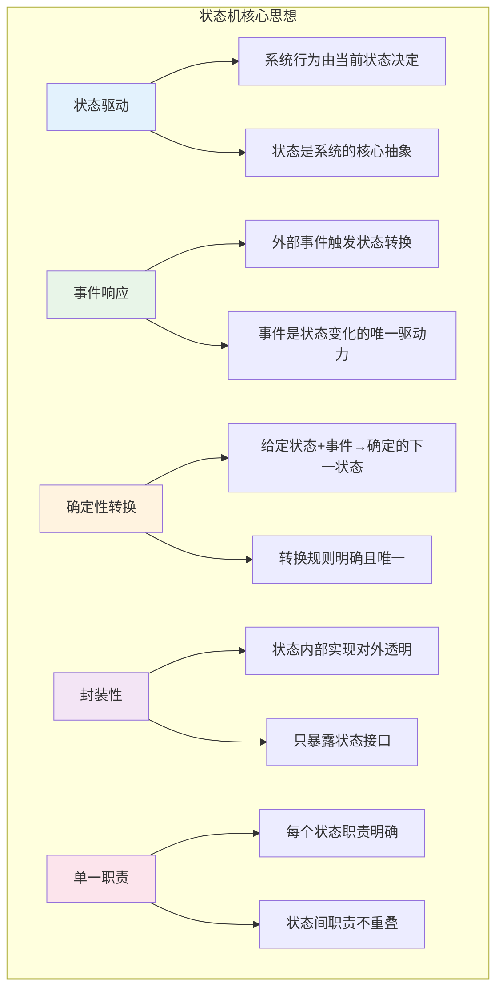
```mermaid
graph TD
    subgraph "状态机核心思想"
        A[状态驱动] --> A1[系统行为由当前状态决定]
        A --> A2[状态是系统的核心抽象]
        
        B[事件响应] --> B1[外部事件触发状态转换]
        B --> B2[事件是状态变化的唯一驱动力]
        
        C[确定性转换] --> C1[给定状态+事件→确定的下一状态]
        C --> C2[转换规则明确且唯一]
        
        D[封装性] --> D1[状态内部实现对外透明]
        D --> D2[只暴露状态接口]
        
        E[单一职责] --> E1[每个状态职责明确]
        E --> E2[状态间职责不重叠]
    end
    
    style A fill:#e3f2fd
    style B fill:#e8f5e8
    style C fill:#fff3e0
    style D fill:#f3e5f5
    style E fill:#fce4ec
```

### 2.8 状态机哲学

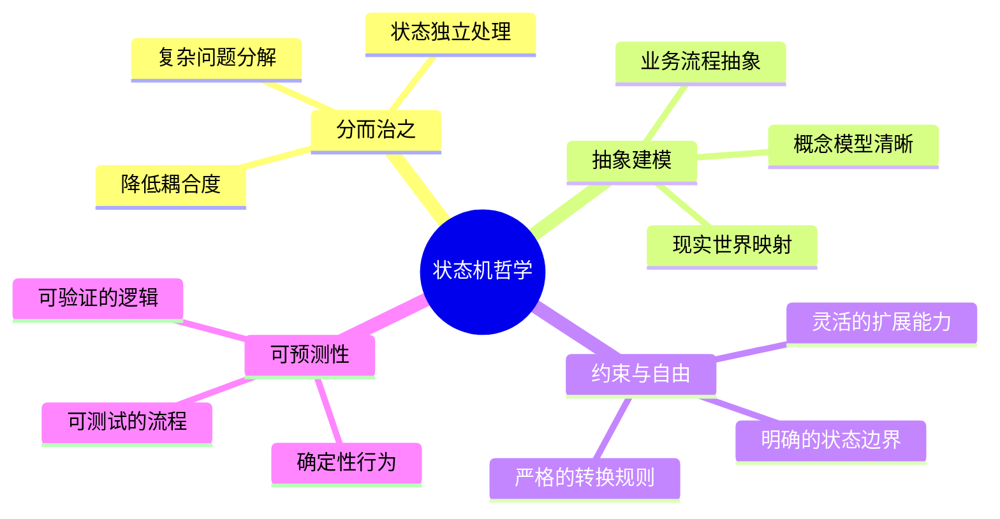
```mermaid
mindmap
  root((状态机哲学))
    分而治之
      复杂问题分解
      状态独立处理
      降低耦合度
    抽象建模
      现实世界映射
      业务流程抽象
      概念模型清晰
    约束与自由
      严格的转换规则
      明确的状态边界
      灵活的扩展能力
    可预测性
      确定性行为
      可验证的逻辑
      可测试的流程
```

### 2.9 状态机设计原则

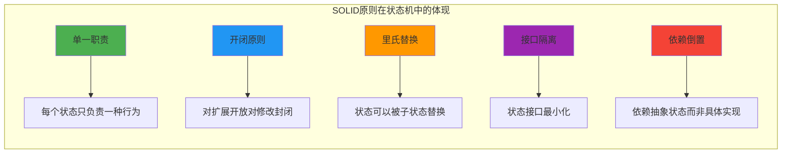
```mermaid
graph LR
    subgraph "SOLID原则在状态机中的体现"
        A[单一职责] --> A1[每个状态只负责一种行为]
        B[开闭原则] --> B1[对扩展开放对修改封闭]
        C[里氏替换] --> C1[状态可以被子状态替换]
        D[接口隔离] --> D1[状态接口最小化]
        E[依赖倒置] --> E1[依赖抽象状态而非具体实现]
    end
    
    style A fill:#4caf50
    style B fill:#2196f3
    style C fill:#ff9800
    style D fill:#9c27b0
    style E fill:#f44336
```

## 3.状态机应用场景

### 3.1 应用领域分布

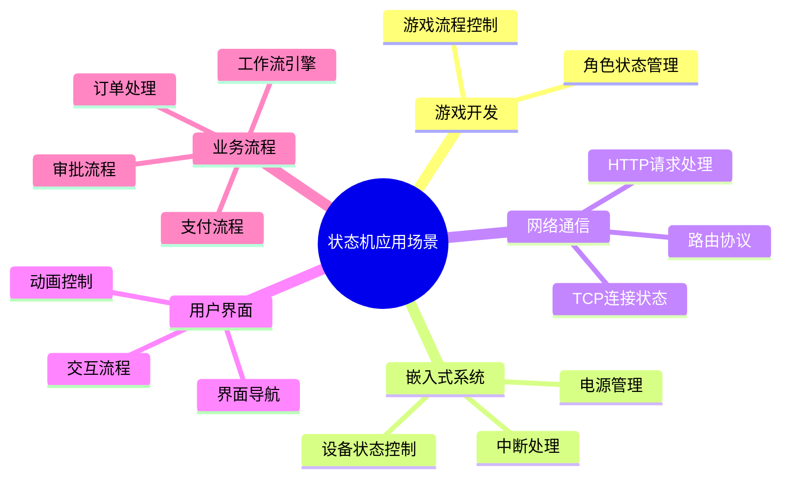
```mermaid
mindmap
  root((状态机应用场景))
    游戏开发
      角色状态管理
      游戏流程控制
    嵌入式系统
      设备状态控制
      中断处理
      电源管理
    网络通信
      TCP连接状态
      HTTP请求处理
      路由协议
    用户界面
      界面导航
      动画控制
      交互流程
    业务流程
      订单处理
      工作流引擎
      审批流程
      支付流程
```

### 3.2 订单处理系统

- **场景描述**：
  订单从创建到完成会经历多个状态（如待支付、已支付、已发货、已收货、已完成、已取消等）。
- **状态机的作用**：
  明确状态转换规则，确保订单状态只能按照预定义的流程进行转换。
- **实际案例**：
  电商平台（如淘宝、京东）的订单管理系统。

### 3.3 游戏开发

- **场景描述**：
  游戏中的角色或对象通常有多种状态（如待机、移动、攻击、死亡等）。
- **状态机的作用**：
  管理角色状态及其转换逻辑，确保游戏逻辑清晰且易于扩展。
- **实际案例**：
  角色扮演游戏（RPG）中的角色状态管理，如《魔兽世界》中的角色行为状态。

### 3.4 工作流引擎

- **场景描述**：
  业务流程通常包含多个步骤（如审批、执行、完成等），每个步骤对应一个状态。
- **状态机的作用**：
  管理流程状态及其转换，确保流程按照预定义的规则执行。
- **实际案例**：
  企业内部的审批系统（如请假审批、报销审批）。

### 3.5 物流系统

- **场景描述**：
  物流订单通常包含多个状态（如待发货、运输中、已签收、已退回等）。
- **状态机的作用**：
  管理物流状态及其转换，确保物流流程正确执行。
- **实际案例**：
  快递物流跟踪系统（如顺丰快递）。

## 4.主要解决问题

### 4.1 复杂性管理问题

传统方式问题

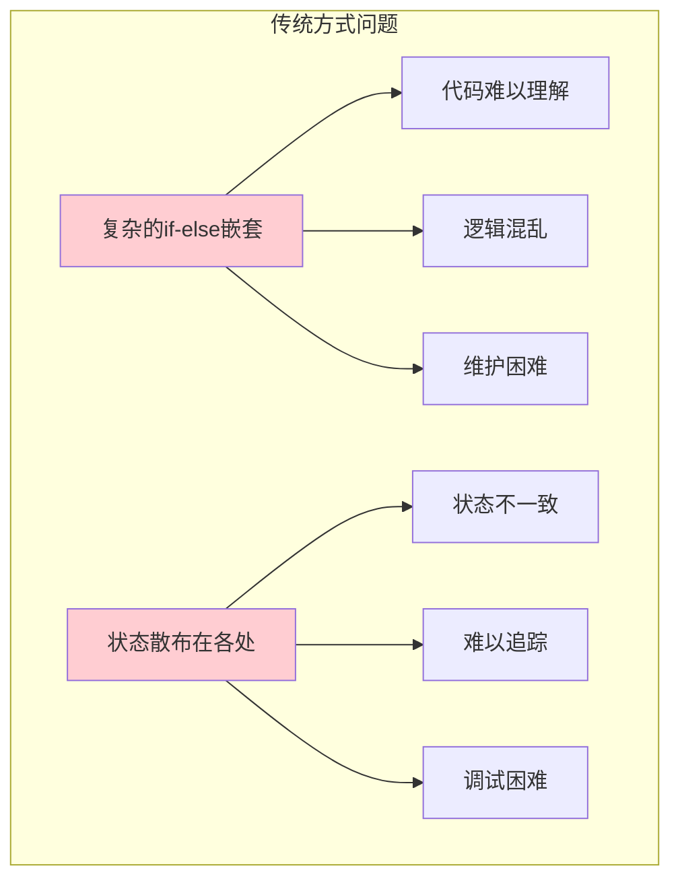
```mermaid
graph TD
    subgraph "传统方式问题"
        A[复杂的if-else嵌套] --> A1[代码难以理解]
        A --> A2[逻辑混乱]
        A --> A3[维护困难]
        
        B[状态散布在各处] --> B1[状态不一致]
        B --> B2[难以追踪]
        B --> B3[调试困难]
    end
    
    style A fill:#ffcdd2
    style B fill:#ffcdd2
```

状态机解决方案

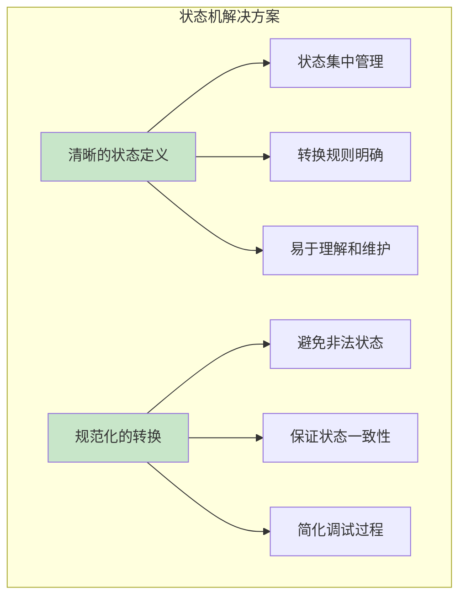
```mermaid
graph TD
    subgraph "状态机解决方案"
        C[清晰的状态定义] --> C1[状态集中管理]
        C --> C2[转换规则明确]
        C --> C3[易于理解和维护]
        
        D[规范化的转换] --> D1[避免非法状态]
        D --> D2[保证状态一致性]
        D --> D3[简化调试过程]
    end
    
    style C fill:#c8e6c9
    style D fill:#c8e6c9
```

### 4.2 业务流程控制

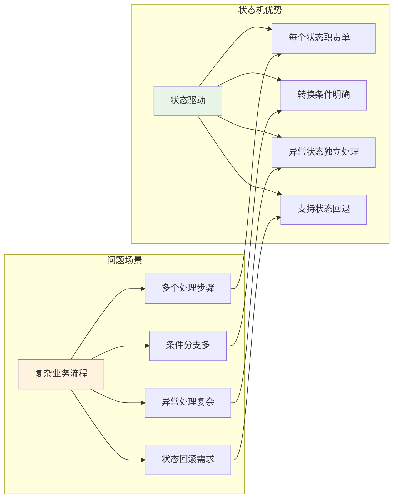
```mermaid
graph LR
    subgraph "问题场景"
        A[复杂业务流程] --> A1[多个处理步骤]
        A --> A2[条件分支多]
        A --> A3[异常处理复杂]
        A --> A4[状态回滚需求]
    end
    
    subgraph "状态机优势"
        B[状态驱动] --> B1[每个状态职责单一]
        B --> B2[转换条件明确]
        B --> B3[异常状态独立处理]
        B --> B4[支持状态回退]
    end
    
    A1 --> B1
    A2 --> B2
    A3 --> B3
    A4 --> B4
    
    style A fill:#fff3e0
    style B fill:#e8f5e8
```

## 5.为何设计状态机

### 5.1 设计的动机

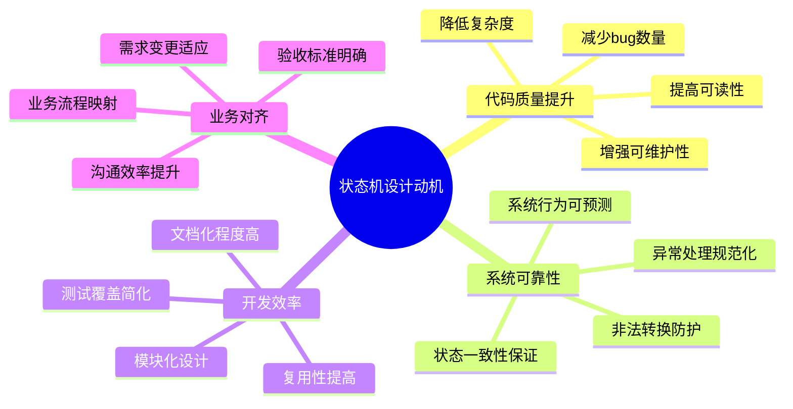
```mermaid
mindmap
  root((状态机设计动机))
    代码质量提升
      降低复杂度
      提高可读性
      增强可维护性
      减少bug数量
    系统可靠性
      状态一致性保证
      非法转换防护
      异常处理规范化
      系统行为可预测
    开发效率
      模块化设计
      复用性提高
      测试覆盖简化
      文档化程度高
    业务对齐
      业务流程映射
      需求变更适应
      沟通效率提升
      验收标准明确
```

### 5.2 传统VS状态机

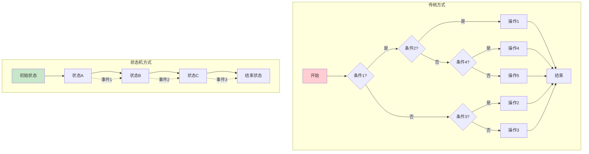
```mermaid
graph TB
    subgraph "传统方式"
        A[开始] --> B{条件1?}
        B -->|是| C{条件2?}
        B -->|否| D{条件3?}
        C -->|是| E[操作1]
        C -->|否| F{条件4?}
        D -->|是| G[操作2]
        D -->|否| H[操作3]
        F -->|是| I[操作4]
        F -->|否| J[操作5]
        E --> K[结束]
        G --> K
        H --> K
        I --> K
        J --> K
    end
    
    subgraph "状态机方式"
        L[初始状态] --> M[状态A]
        M --> N[状态B]
        N --> O[状态C]
        O --> P[结束状态]
        
        M -.事件1.-> N
        N -.事件2.-> O
        O -.事件3.-> P
    end
    
    style A fill:#ffcdd2
    style L fill:#c8e6c9
```

### 5.3 状态机价值

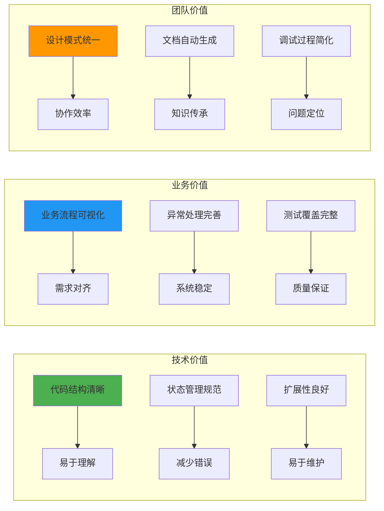
```mermaid
graph LR
    subgraph "技术价值"
        A[代码结构清晰] --> A1[易于理解]
        B[状态管理规范] --> B1[减少错误]
        C[扩展性良好] --> C1[易于维护]
    end
    
    subgraph "业务价值"
        D[业务流程可视化] --> D1[需求对齐]
        E[异常处理完善] --> E1[系统稳定]
        F[测试覆盖完整] --> F1[质量保证]
    end
    
    subgraph "团队价值"
        G[设计模式统一] --> G1[协作效率]
        H[文档自动生成] --> H1[知识传承]
        I[调试过程简化] --> I1[问题定位]
    end
    
    style A fill:#4caf50
    style D fill:#2196f3
    style G fill:#ff9800
```

## 06.状态机核心要素

### 6.1 状态机组成要素

状态机的几个核心要素：

1. 状态：系统所有可能的情况被精确定义为有限个数的“状态”（如状态A、状态B）。这是系统行为的“模式”。
2. 事件：来自外部或内部的“事件”（如事件X、事件Y)是触发状态迁移的输入信号。
3. 转移：定义在特定状态下，响应某个事件，并可能满足特定条件时，系统将执行一个动作并迁移到新的状态（或保持原状态）。
4. 动作：状态转移发生时可以伴随一个可执行的动作。

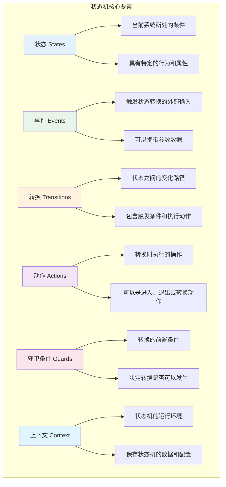
```mermaid
graph TB
    subgraph "状态机核心要素"
        A[状态 States] --> A1[当前系统所处的条件]
        A --> A2[具有特定的行为和属性]
        
        B[事件 Events] --> B1[触发状态转换的外部输入]
        B --> B2[可以携带参数数据]
        
        C[转换 Transitions] --> C1[状态之间的变化路径]
        C --> C2[包含触发条件和执行动作]
        
        D[动作 Actions] --> D1[转换时执行的操作]
        D --> D2[可以是进入、退出或转换动作]
        
        E[守卫条件 Guards] --> E1[转换的前置条件]
        E --> E2[决定转换是否可以发生]
        
        F[上下文 Context] --> F1[状态机的运行环境]
        F --> F2[保存状态机的数据和配置]
    end
    
    style A fill:#e3f2fd
    style B fill:#e8f5e8
    style C fill:#fff3e0
    style D fill:#f3e5f5
    style E fill:#fce4ec
    style F fill:#e1f5fe
```

### 6.2 状态生命周期

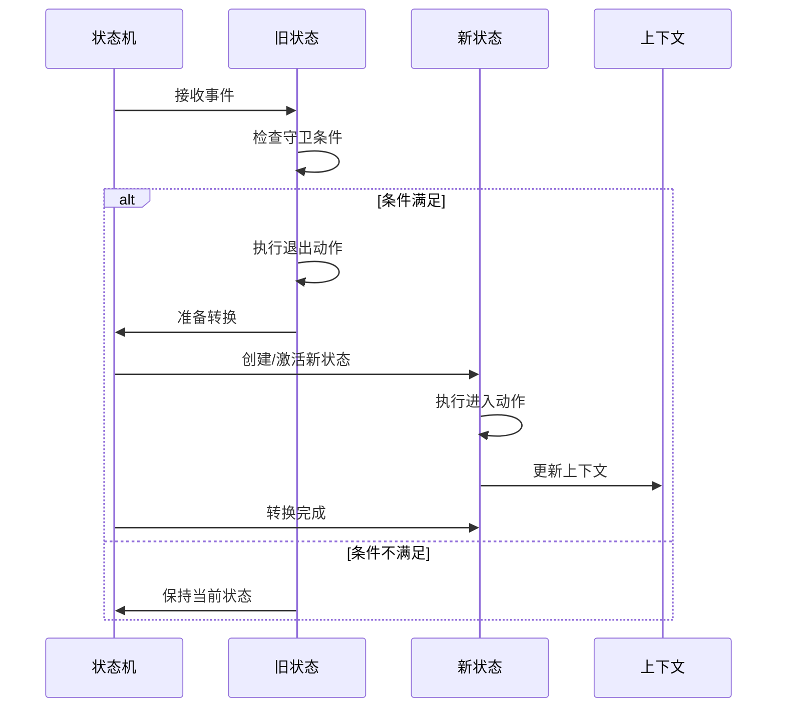
```mermaid
sequenceDiagram
    participant SM as 状态机
    participant OldState as 旧状态
    participant NewState as 新状态
    participant Context as 上下文
    
    SM->>OldState: 接收事件
    OldState->>OldState: 检查守卫条件
    
    alt 条件满足
        OldState->>OldState: 执行退出动作
        OldState->>SM: 准备转换
        SM->>NewState: 创建/激活新状态
        NewState->>NewState: 执行进入动作
        NewState->>Context: 更新上下文
        SM->>NewState: 转换完成
    else 条件不满足
        OldState->>SM: 保持当前状态
    end
```

### 6.3 事件处理机制

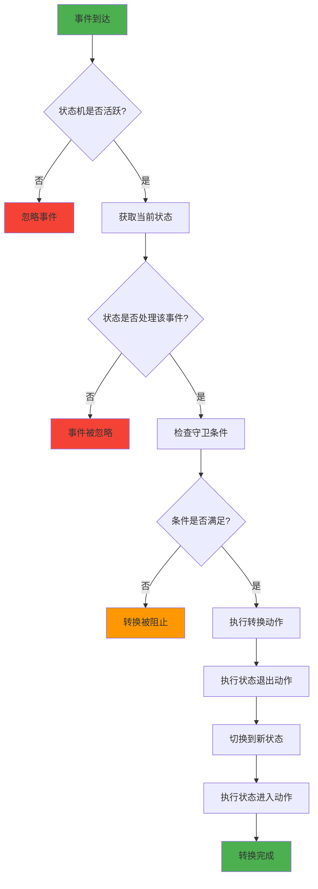
```mermaid
graph TD
    A[事件到达] --> B{状态机是否活跃?}
    B -->|否| C[忽略事件]
    B -->|是| D[获取当前状态]
    
    D --> E{状态是否处理该事件?}
    E -->|否| F[事件被忽略]
    E -->|是| G[检查守卫条件]
    
    G --> H{条件是否满足?}
    H -->|否| I[转换被阻止]
    H -->|是| J[执行转换动作]
    
    J --> K[执行状态退出动作]
    K --> L[切换到新状态]
    L --> M[执行状态进入动作]
    M --> N[转换完成]
    
    style A fill:#4caf50
    style N fill:#4caf50
    style C fill:#f44336
    style F fill:#f44336
    style I fill:#ff9800
```

## 07.状态机核心原理

### 7.1 状态转换原理

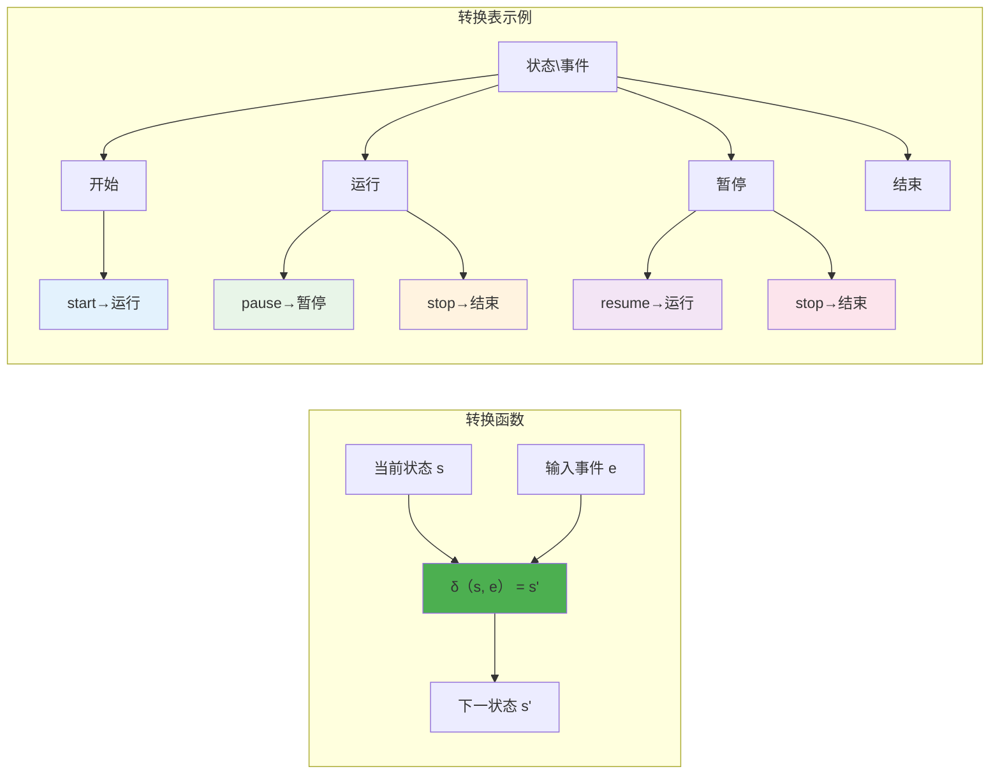
```mermaid
graph LR
    subgraph "转换函数"
        A[δ（s, e） = s'] 
        B[当前状态 s]
        C[输入事件 e]
        D[下一状态 s']
        
        B --> A
        C --> A
        A --> D
    end
    
    subgraph "转换表示例"
        E[状态\事件] --> F[开始]
        E --> G[运行]
        E --> H[暂停]
        E --> I[结束]
        
        F --> F1[start→运行]
        G --> G1[pause→暂停]
        G --> G2[stop→结束]
        H --> H1[resume→运行]
        H --> H2[stop→结束]
    end
    
    style A fill:#4caf50
    style F1 fill:#e3f2fd
    style G1 fill:#e8f5e8
    style G2 fill:#fff3e0
    style H1 fill:#f3e5f5
    style H2 fill:#fce4ec
```

### 7.2 状态机执行模型

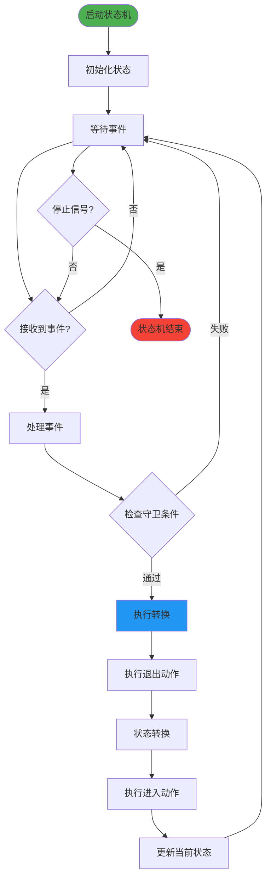
```mermaid
flowchart TD
    Start([启动状态机]) --> Init[初始化状态]
    Init --> Wait[等待事件]
    
    Wait --> Event{接收到事件?}
    Event -->|是| Process[处理事件]
    Event -->|否| Wait
    
    Process --> Guard{检查守卫条件}
    Guard -->|通过| Execute[执行转换]
    Guard -->|失败| Wait
    
    Execute --> ExitAction[执行退出动作]
    ExitAction --> Transition[状态转换]
    Transition --> EnterAction[执行进入动作]
    EnterAction --> Update[更新当前状态]
    Update --> Wait
    
    Wait --> Stop{停止信号?}
    Stop -->|是| End([状态机结束])
    Stop -->|否| Event
    
    style Start fill:#4caf50
    style End fill:#f44336
    style Execute fill:#2196f3
```

### 7.3 层次状态机原理

```mermaid
stateDiagram-v2
    state "设备控制" as Device {
        state "电源管理" as Power {
            [*] --> PowerOff
            PowerOff --> PowerOn: 开机
            PowerOn --> PowerOff: 关机
            PowerOn --> Standby: 待机
            Standby --> PowerOn: 唤醒
        }
        
        state "工作模式" as Work {
            [*] --> Normal
            Normal --> HighPerf: 高性能模式
            Normal --> PowerSave: 节能模式
            HighPerf --> Normal: 恢复正常
            PowerSave --> Normal: 恢复正常
        } 
    }
    
    note right of Power: 父状态：设备控制
    note right of Work: 子状态可以并发执行
```

## 08.状态机案例

### 8.1 状态机基础框架

```cpp
#include <iostream>
#include <memory>
#include <unordered_map>
#include <functional>

// 前向声明
class StateMachine;
class State;

// 事件基类
class Event {
public:
    virtual ~Event() = default;
    virtual std::string getName() const = 0;
};

// 具体事件类
class StartEvent : public Event {
public:
    std::string getName() const override { return "StartEvent"; }
};

class StopEvent : public Event {
public:
    std::string getName() const override { return "StopEvent"; }
};

class PauseEvent : public Event {
public:
    std::string getName() const override { return "PauseEvent"; }
};

class ResumeEvent : public Event {
public:
    std::string getName() const override { return "ResumeEvent"; }
};

// 状态基类
class State {
public:
    virtual ~State() = default;
    virtual std::string getName() const = 0;
    virtual void onEnter(StateMachine* sm) {}
    virtual void onExit(StateMachine* sm) {}
    virtual std::shared_ptr<State> handleEvent(
        StateMachine* sm, 
        const Event& event
    ) = 0;
};

// 状态机类
class StateMachine {
private:
    std::shared_ptr<State> currentState_;
    std::unordered_map<std::string, std::shared_ptr<State>> states_;
    
public:
    StateMachine() = default;
    
    // 添加状态
    void addState(const std::string& name, std::shared_ptr<State> state) {
        states_[name] = state;
    }
    
    // 设置初始状态
    void setInitialState(const std::string& stateName) {
        auto it = states_.find(stateName);
        if (it != states_.end()) {
            currentState_ = it->second;
            currentState_->onEnter(this);
            std::cout << "状态机启动，初始状态: " << currentState_->getName() << std::endl;
        }
    }
    
    // 处理事件
    void handleEvent(const Event& event) {
        if (!currentState_) {
            std::cout << "错误: 状态机未初始化" << std::endl;
            return;
        }
        
        std::cout << "当前状态: " << currentState_->getName() 
                  << ", 接收事件: " << event.getName() << std::endl;
        
        auto nextState = currentState_->handleEvent(this, event);
        
        if (nextState && nextState != currentState_) {
            // 执行状态转换
            currentState_->onExit(this);
            std::cout << "状态转换: " << currentState_->getName() 
                      << " -> " << nextState->getName() << std::endl;
            currentState_ = nextState;
            currentState_->onEnter(this);
        }
    }
    
    // 获取当前状态
    std::string getCurrentStateName() const {
        return currentState_ ? currentState_->getName() : "None";
    }
    
    // 获取状态
    std::shared_ptr<State> getState(const std::string& name) {
        auto it = states_.find(name);
        return (it != states_.end()) ? it->second : nullptr;
    }
};
```

### 8.2 具体状态实现

```cpp
// 空闲状态
class IdleState : public State {
public:
    std::string getName() const override { return "Idle"; }
    
    void onEnter(StateMachine* sm) override {
        std::cout << "进入空闲状态 - 系统准备就绪" << std::endl;
    }
    
    void onExit(StateMachine* sm) override {
        std::cout << "退出空闲状态" << std::endl;
    }
    
    std::shared_ptr<State> handleEvent(StateMachine* sm, const Event& event) override {
        if (event.getName() == "StartEvent") {
            return sm->getState("Running");
        }
        std::cout << "空闲状态忽略事件: " << event.getName() << std::endl;
        return nullptr;
    }
};

// 运行状态
class RunningState : public State {
public:
    std::string getName() const override { return "Running"; }
    
    void onEnter(StateMachine* sm) override {
        std::cout << "进入运行状态 - 开始执行任务" << std::endl;
    }
    
    void onExit(StateMachine* sm) override {
        std::cout << "退出运行状态 - 停止执行任务" << std::endl;
    }
    
    std::shared_ptr<State> handleEvent(StateMachine* sm, const Event& event) override {
        if (event.getName() == "PauseEvent") {
            return sm->getState("Paused");
        } else if (event.getName() == "StopEvent") {
            return sm->getState("Idle");
        }
        std::cout << "运行状态忽略事件: " << event.getName() << std::endl;
        return nullptr;
    }
};

// 暂停状态
class PausedState : public State {
public:
    std::string getName() const override { return "Paused"; }
    
    void onEnter(StateMachine* sm) override {
        std::cout << "进入暂停状态 - 任务已暂停" << std::endl;
    }
    
    void onExit(StateMachine* sm) override {
        std::cout << "退出暂停状态" << std::endl;
    }
    
    std::shared_ptr<State> handleEvent(StateMachine* sm, const Event& event) override {
        if (event.getName() == "ResumeEvent") {
            return sm->getState("Running");
        } else if (event.getName() == "StopEvent") {
            return sm->getState("Idle");
        }
        std::cout << "暂停状态忽略事件: " << event.getName() << std::endl;
        return nullptr;
    }
};
```

### 8.3 使用示例

```cpp
// 使用示例
int main() {
    // 创建状态机
    StateMachine sm;
    
    // 创建状态实例
    auto idleState = std::make_shared<IdleState>();
    auto runningState = std::make_shared<RunningState>();
    auto pausedState = std::make_shared<PausedState>();
    
    // 添加状态到状态机
    sm.addState("Idle", idleState);
    sm.addState("Running", runningState);
    sm.addState("Paused", pausedState);
    
    // 设置初始状态
    sm.setInitialState("Idle");
    
    std::cout << "\n=== 状态机测试开始 ===" << std::endl;
    
    // 测试状态转换
    std::cout << "\n1. 启动任务:" << std::endl;
    sm.handleEvent(StartEvent());
    
    std::cout << "\n2. 暂停任务:" << std::endl;
    sm.handleEvent(PauseEvent());
    
    std::cout << "\n3. 恢复任务:" << std::endl;
    sm.handleEvent(ResumeEvent());
    
    std::cout << "\n4. 停止任务:" << std::endl;
    sm.handleEvent(StopEvent());
    
    std::cout << "\n5. 尝试无效操作 (在空闲状态暂停):" << std::endl;
    sm.handleEvent(PauseEvent());
    
    std::cout << "\n=== 状态机测试结束 ===" << std::endl;
    std::cout << "最终状态: " << sm.getCurrentStateName() << std::endl;
    
    return 0;
}
```

### 8.4 测试效果

初始化任务——>启动任务

```text
当前状态: Idle, 接收事件: StartEvent
退出空闲状态
状态转换: Idle -> Running
进入运行状态 - 开始执行任务
状态机状态: Running
```

启动任务——>暂停任务:

```text
当前状态: Running, 接收事件: PauseEvent
退出运行状态 - 停止执行任务
状态转换: Running -> Paused
进入暂停状态 - 任务已暂停
状态机状态: Paused
```

暂停任务——>恢复任务：

```text
当前状态: Paused, 接收事件: ResumeEvent
退出暂停状态
状态转换: Paused -> Running
进入运行状态 - 开始执行任务
状态机状态: Running
```

恢复任务——>停止任务:

```text
当前状态: Running, 接收事件: StopEvent
退出运行状态 - 停止执行任务
状态转换: Running -> Idle
进入空闲状态 - 系统准备就绪
状态机状态: Idle
```

停止任务——>恢复任务:

```text
当前状态: Idle, 接收事件: ResumeEvent
空闲状态忽略事件: ResumeEvent
状态机状态: Idle
```

### 8.5 高级状态机特性

```cpp
// 带守卫条件的状态机
class GuardedStateMachine : public StateMachine {
private:
    std::unordered_map<std::string, std::function<bool()>> guards_;
    
public:
    // 添加守卫条件
    void addGuard(const std::string& name, std::function<bool()> guard) {
        guards_[name] = guard;
    }
    
    // 检查守卫条件
    bool checkGuard(const std::string& guardName) {
        auto it = guards_.find(guardName);
        return (it != guards_.end()) ? it->second() : true;
    }
};

// 带数据的事件
class DataEvent : public Event {
private:
    std::string data_;
    
public:
    DataEvent(const std::string& data) : data_(data) {}
    std::string getName() const override { return "DataEvent"; }
    std::string getData() const { return data_; }
};

// 状态机工厂
class StateMachineFactory {
public:
    static std::unique_ptr<StateMachine> createTaskStateMachine() {
        auto sm = std::make_unique<StateMachine>();
        
        sm->addState("Idle", std::make_shared<IdleState>());
        sm->addState("Running", std::make_shared<RunningState>());
        sm->addState("Paused", std::make_shared<PausedState>());
        
        return sm;
    }
};
```

### 8.6 状态机UML图

```mermaid
classDiagram
    class Event {
        <<abstract>>
        +getName() string
    }
    
    class State {
        <<abstract>>
        +getName() string
        +onEnter(StateMachine* sm)
        +onExit(StateMachine* sm)
        +handleEvent(StateMachine* sm, Event& event) State*
    }
    
    class StateMachine {
        -currentState: State*
        -states: map~string, State*~
        +addState(name: string, state: State*)
        +setInitialState(stateName: string)
        +handleEvent(event: Event&)
        +getCurrentStateName() string
    }
    
    class IdleState {
        +getName() string
        +onEnter(StateMachine* sm)
        +onExit(StateMachine* sm)
        +handleEvent(StateMachine* sm, Event& event) State*
    }
    
    class RunningState {
        +getName() string
        +onEnter(StateMachine* sm)
        +onExit(StateMachine* sm)
        +handleEvent(StateMachine* sm, Event& event) State*
    }
    
    class PausedState {
        +getName() string
        +onEnter(StateMachine* sm)
        +onExit(StateMachine* sm)
        +handleEvent(StateMachine* sm, Event& event) State*
    }
    
    class StartEvent {
        +getName() string
    }
    
    class StopEvent {
        +getName() string
    }
    
    class PauseEvent {
        +getName() string
    }
    
    class ResumeEvent {
        +getName() string
    }
    
    Event <|-- StartEvent
    Event <|-- StopEvent
    Event <|-- PauseEvent
    Event <|-- ResumeEvent
    
    State <|-- IdleState
    State <|-- RunningState
    State <|-- PausedState
    
    StateMachine --> State : contains
    StateMachine --> Event : processes
```

## 09.问题与弊端

### 9.1 常见问题分析

```mermaid
mindmap
  root((状态机问题))
    复杂性问题
      状态爆炸
      转换复杂
      维护困难
      理解成本高
    性能问题
      内存开销
      转换开销
      事件处理延迟
      并发性能
    设计问题
      过度设计
      状态粒度
      职责划分
      接口设计
    实现问题
      代码冗余
      错误处理
      调试困难
      测试复杂
```

### 9.2 状态爆炸问题

```mermaid
graph TD
    subgraph "状态爆炸示例"
        A[用户登录状态机] --> B[未登录]
        A --> C[登录中]
        A --> D[已登录]
        A --> E[登录失败]
        
        F[权限状态机] --> G[无权限]
        F --> H[读权限]
        F --> I[写权限]
        F --> J[管理权限]
        
        K[网络状态机] --> L[离线]
        K --> M[连接中]
        K --> N[在线]
        K --> O[网络错误]
    end
    
    subgraph "组合状态数量"
        P[总状态数 = 4 × 4 × 4 = 64个状态]
        Q[转换数量呈指数增长]
        R[维护成本急剧上升]
    end
    
    style P fill:#ffcdd2
    style Q fill:#ffcdd2
    style R fill:#ffcdd2
```

### 9.3 性能开销分析

### 9.4 设计陷阱

```mermaid
graph TD
    subgraph "常见设计陷阱"
        A[过度设计] --> A1[状态过于细粒度]
        A --> A2[不必要的状态]
        A --> A3[复杂的层次结构]
        
        B[职责混乱] --> B1[状态职责重叠]
        B --> B2[业务逻辑泄漏]
        B --> B3[状态间强耦合]
        
        C[扩展性差] --> C1[硬编码转换]
        C --> C2[缺乏抽象层]
        C --> C3[配置不灵活]
    end
    
    subgraph "解决方案"
        D[合理设计] --> D1[状态粒度适中]
        D --> D2[职责单一明确]
        D --> D3[层次结构简单]
        
        E[良好抽象] --> E1[接口设计清晰]
        E --> E2[依赖注入]
        E --> E3[配置外部化]
    end
    
    A1 --> D1
    A2 --> D2
    A3 --> D3
    B1 --> E1
    B2 --> E2
    B3 --> E3
    
    style A fill:#ffcdd2
    style B fill:#ffcdd2
    style C fill:#ffcdd2
    style D fill:#c8e6c9
    style E fill:#c8e6c9
```

### 9.5 调试与测试挑战

```mermaid
sequenceDiagram
    participant Dev as 开发者
    participant SM as 状态机
    participant Debug as 调试器
    participant Test as 测试框架
    
    Note over Dev: 发现状态机bug
    
    Dev->>SM: 设置断点
    SM->>Debug: 状态转换过程复杂
    Debug->>Dev: 难以跟踪状态变化
    
    Dev->>Test: 编写测试用例
    Test->>SM: 状态组合数量庞大
    SM->>Test: 测试覆盖率难以保证
    Test->>Dev: 测试用例维护困难
    
    Note over Dev: 需要专门的调试和测试工具
```

### 9.6 适用性评估

```mermaid
graph LR
    subgraph "适合使用状态机"
        A[明确的状态转换] --> A1[业务流程清晰]
        B[有限的状态数量] --> B1[状态可枚举]
        C[复杂的条件逻辑] --> C1[if-else过于复杂]
        D[需要状态持久化] --> D1[状态需要保存]
    end
    
    subgraph "不适合使用状态机"
        E[简单的线性流程] --> E1[顺序执行即可]
        F[状态数量巨大] --> F1[状态爆炸风险]
        G[频繁的状态变化] --> G1[性能开销过大]
        H[状态边界模糊] --> H1[难以明确定义]
    end
    
    style A fill:#c8e6c9
    style B fill:#c8e6c9
    style C fill:#c8e6c9
    style D fill:#c8e6c9
    style E fill:#ffcdd2
    style F fill:#ffcdd2
    style G fill:#ffcdd2
    style H fill:#ffcdd2
```

### 9.7 最佳实践建议

```mermaid
graph TD
    subgraph "状态机最佳实践"
        A[设计阶段] --> A1[明确状态边界]
        A --> A2[保持状态简单]
        A --> A3[避免深层嵌套]
        
        B[实现阶段] --> B1[使用设计模式]
        B --> B2[提供调试接口]
        B --> B3[支持状态序列化]
        
        C[测试阶段] --> C1[状态覆盖测试]
        C --> C2[转换路径测试]
        C --> C3[异常情况测试]
        
        D[维护阶段] --> D1[文档及时更新]
        D --> D2[监控状态分布]
        D --> D3[性能定期评估]
    end
    
    style A fill:#e3f2fd
    style B fill:#e8f5e8
    style C fill:#fff3e0
    style D fill:#f3e5f5
```

## 10.总结和分析

### 10.1 核心要点回顾

1. **应用场景广泛**：从游戏开发到业务流程，从网络协议到用户界面
2. **解决复杂性问题**：将复杂的条件逻辑转换为清晰的状态转换
3. **设计思想明确**：状态驱动、事件响应、确定性转换
4. **实现相对简单**：基于面向对象的设计模式，易于理解和实现
5. **存在固有问题**：状态爆炸、性能开销、设计复杂度

### 10.2 使用决策矩阵

```mermaid
graph LR
    subgraph "状态机使用决策"
        A{业务复杂度} -->|高| B{状态数量}
        A -->|低| C[考虑简单方案]
        
        B -->|适中| D{性能要求}
        B -->|过多| E[考虑其他方案]
        
        D -->|一般| F[推荐使用状态机]
        D -->|极高| G[谨慎评估]
        
        C --> H[线性流程/简单条件]
        E --> I[分层设计/微服务]
        F --> J[标准状态机实现]
        G --> K[优化后的状态机]
    end
    
    style F fill:#c8e6c9
    style J fill:#c8e6c9
    style K fill:#fff3e0
    style H fill:#ffcdd2
    style I fill:#ffcdd2
```


