# 状态机机制技术方案

## 目录
- [1. 状态机主要应用场景](#1-状态机主要应用场景)
- [2. 什么是状态机](#2-什么是状态机)
- [3. 状态机主要解决什么问题](#3-状态机主要解决什么问题)
- [4. 为什么设计状态机](#4-为什么设计状态机)
- [5. 状态机核心思想](#5-状态机核心思想)
- [6. 状态机核心要素](#6-状态机核心要素)
- [7. 状态机核心原理](#7-状态机核心原理)
- [8. C++状态机实现示例](#8-c状态机实现示例)
- [9. 状态机问题与弊端](#9-状态机问题与弊端)

---

## 1. 状态机应用场景

### 1.1 应用领域分布


### 1.2 典型应用案例

#### 1.2.1 TCP连接状态机

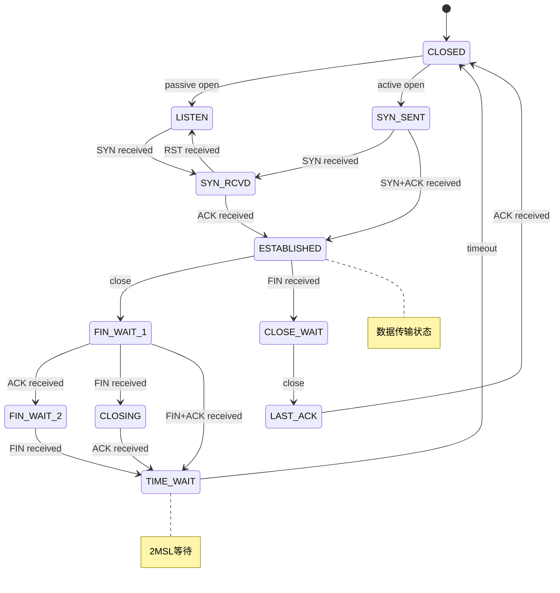
```mermaid
stateDiagram-v2
    [*] --> CLOSED
    CLOSED --> LISTEN: passive open
    CLOSED --> SYN_SENT: active open
    
    LISTEN --> SYN_RCVD: SYN received
    SYN_SENT --> SYN_RCVD: SYN received
    SYN_SENT --> ESTABLISHED: SYN+ACK received
    
    SYN_RCVD --> ESTABLISHED: ACK received
    SYN_RCVD --> LISTEN: RST received
    
    ESTABLISHED --> FIN_WAIT_1: close
    ESTABLISHED --> CLOSE_WAIT: FIN received
    
    FIN_WAIT_1 --> FIN_WAIT_2: ACK received
    FIN_WAIT_1 --> CLOSING: FIN received
    FIN_WAIT_1 --> TIME_WAIT: FIN+ACK received
    
    FIN_WAIT_2 --> TIME_WAIT: FIN received
    CLOSING --> TIME_WAIT: ACK received
    
    CLOSE_WAIT --> LAST_ACK: close
    LAST_ACK --> CLOSED: ACK received
    
    TIME_WAIT --> CLOSED: timeout
    
    note right of ESTABLISHED: 数据传输状态
    note right of TIME_WAIT: 2MSL等待
```

#### 1.2.2 游戏角色状态机

#### 1.2.3 订单处理状态机

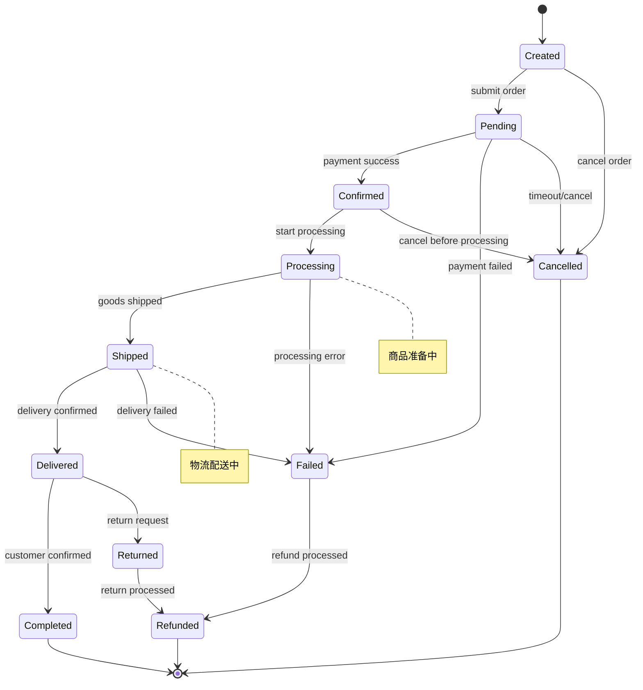
```mermaid
stateDiagram-v2
    [*] --> Created
    
    Created --> Pending: submit order
    Created --> Cancelled: cancel order
    
    Pending --> Confirmed: payment success
    Pending --> Failed: payment failed
    Pending --> Cancelled: timeout/cancel
    
    Confirmed --> Processing: start processing
    Confirmed --> Cancelled: cancel before processing
    
    Processing --> Shipped: goods shipped
    Processing --> Failed: processing error
    
    Shipped --> Delivered: delivery confirmed
    Shipped --> Failed: delivery failed
    
    Delivered --> Completed: customer confirmed
    Delivered --> Returned: return request
    
    Failed --> Refunded: refund processed
    Returned --> Refunded: return processed
    
    Completed --> [*]
    Refunded --> [*]
    Cancelled --> [*]
    
    note right of Processing: 商品准备中
    note right of Shipped: 物流配送中
```

---

## 2. 什么是状态机

### 2.1 状态机定义

状态机（State Machine）是一种数学模型，用于描述系统在不同状态之间的转换行为。它是一种抽象的计算模型，能够精确描述系统在任意时刻的状态以及状态之间的转换条件。

### 2.2 状态机分类

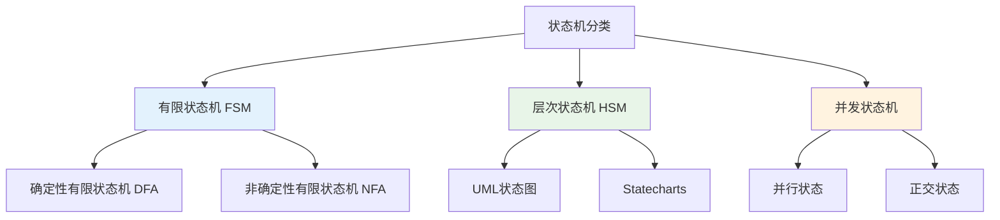
```mermaid
graph TD
    A[状态机分类] --> B[有限状态机 FSM]
    A --> C[层次状态机 HSM]
    A --> D[并发状态机]
    
    B --> B1[确定性有限状态机 DFA]
    B --> B2[非确定性有限状态机 NFA]
    
    C --> C1[UML状态图]
    C --> C2[Statecharts]
    
    D --> D1[并行状态]
    D --> D2[正交状态]
    
    style B fill:#e3f2fd
    style C fill:#e8f5e8
    style D fill:#fff3e0
```

### 2.3 状态机数学定义

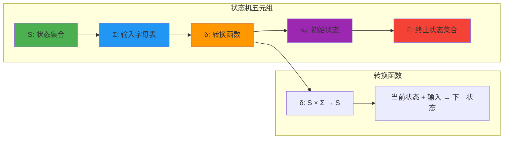
```mermaid
graph LR
    subgraph "状态机五元组"
        A[S: 状态集合] --> B[Σ: 输入字母表]
        B --> C[δ: 转换函数]
        C --> D[s₀: 初始状态]
        D --> E[F: 终止状态集合]
    end
    
    subgraph "转换函数"
        F[δ: S × Σ → S]
        G[当前状态 + 输入 → 下一状态]
    end
    
    C --> F
    F --> G
    
    style A fill:#4caf50
    style B fill:#2196f3
    style C fill:#ff9800
    style D fill:#9c27b0
    style E fill:#f44336
```

### 2.4 状态机基本概念

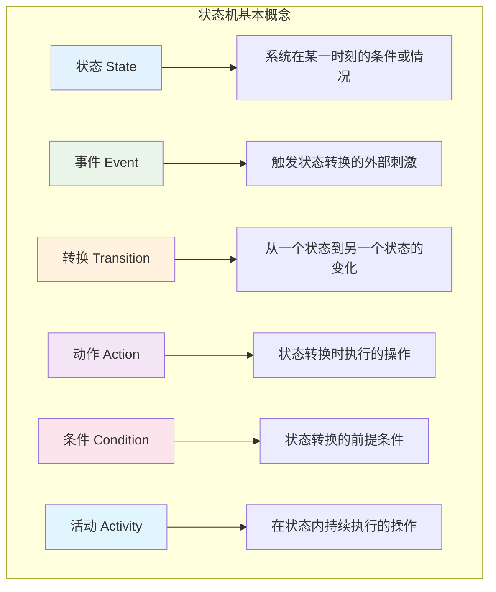
```mermaid
graph TB
    subgraph "状态机基本概念"
        A[状态 State] --> A1[系统在某一时刻的条件或情况]
        B[事件 Event] --> B1[触发状态转换的外部刺激]
        C[转换 Transition] --> C1[从一个状态到另一个状态的变化]
        D[动作 Action] --> D1[状态转换时执行的操作]
        E[条件 Condition] --> E1[状态转换的前提条件]
        F[活动 Activity] --> F1[在状态内持续执行的操作]
    end
    
    style A fill:#e3f2fd
    style B fill:#e8f5e8
    style C fill:#fff3e0
    style D fill:#f3e5f5
    style E fill:#fce4ec
    style F fill:#e1f5fe
```

---

## 3. 状态机主要解决什么问题

### 3.1 复杂性管理问题

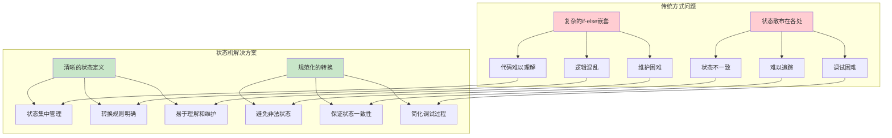
```mermaid
graph TD
    subgraph "传统方式问题"
        A[复杂的if-else嵌套] --> A1[代码难以理解]
        A --> A2[逻辑混乱]
        A --> A3[维护困难]
        
        B[状态散布在各处] --> B1[状态不一致]
        B --> B2[难以追踪]
        B --> B3[调试困难]
    end
    
    subgraph "状态机解决方案"
        C[清晰的状态定义] --> C1[状态集中管理]
        C --> C2[转换规则明确]
        C --> C3[易于理解和维护]
        
        D[规范化的转换] --> D1[避免非法状态]
        D --> D2[保证状态一致性]
        D --> D3[简化调试过程]
    end
    
    A1 --> C1
    A2 --> C2
    A3 --> C3
    B1 --> D1
    B2 --> D2
    B3 --> D3
    
    style A fill:#ffcdd2
    style B fill:#ffcdd2
    style C fill:#c8e6c9
    style D fill:#c8e6c9
```

### 3.2 并发控制问题

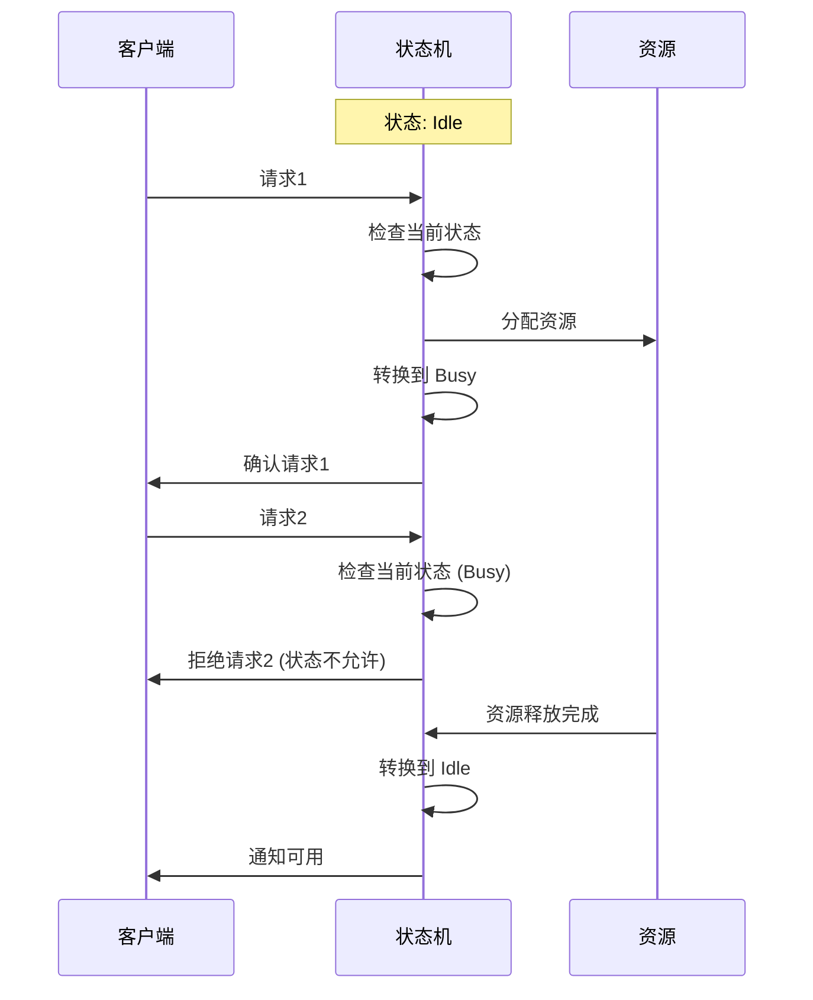
```mermaid
sequenceDiagram
    participant Client as 客户端
    participant SM as 状态机
    participant Resource as 资源
    
    Note over SM: 状态: Idle
    
    Client->>SM: 请求1
    SM->>SM: 检查当前状态
    SM->>Resource: 分配资源
    SM->>SM: 转换到 Busy
    SM->>Client: 确认请求1
    
    Client->>SM: 请求2
    SM->>SM: 检查当前状态 (Busy)
    SM->>Client: 拒绝请求2 (状态不允许)
    
    Resource->>SM: 资源释放完成
    SM->>SM: 转换到 Idle
    SM->>Client: 通知可用
```

### 3.3 业务流程控制问题

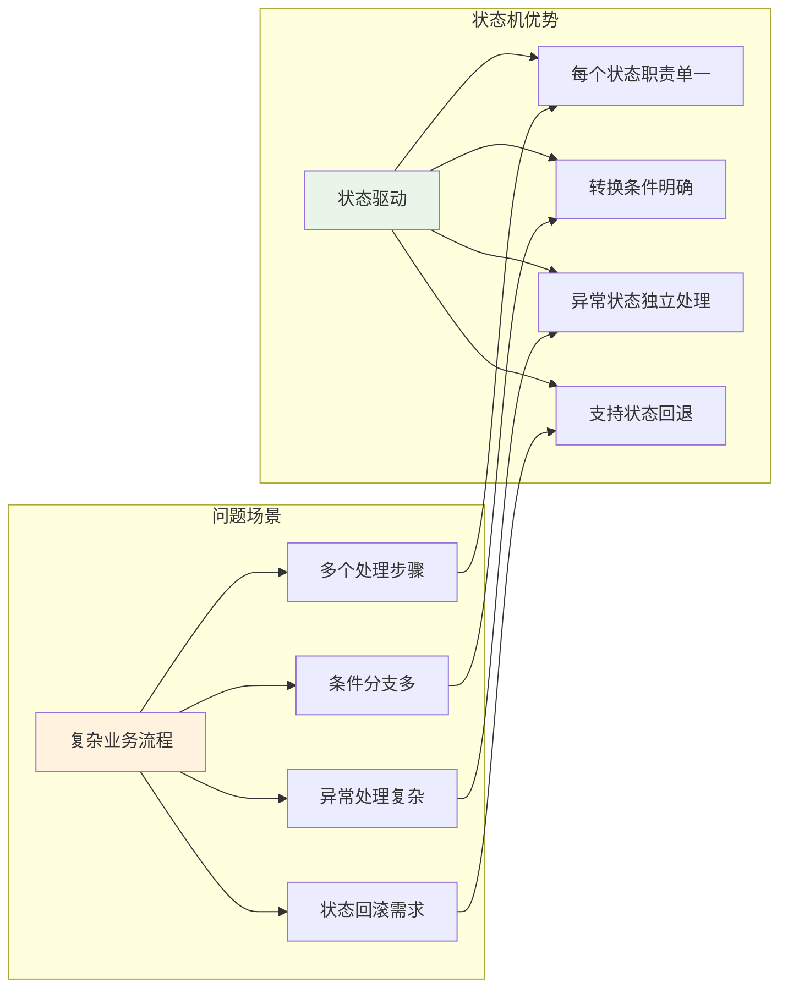
```mermaid
graph LR
    subgraph "问题场景"
        A[复杂业务流程] --> A1[多个处理步骤]
        A --> A2[条件分支多]
        A --> A3[异常处理复杂]
        A --> A4[状态回滚需求]
    end
    
    subgraph "状态机优势"
        B[状态驱动] --> B1[每个状态职责单一]
        B --> B2[转换条件明确]
        B --> B3[异常状态独立处理]
        B --> B4[支持状态回退]
    end
    
    A1 --> B1
    A2 --> B2
    A3 --> B3
    A4 --> B4
    
    style A fill:#fff3e0
    style B fill:#e8f5e8
```

---

## 4. 为什么设计状态机

### 4.1 设计动机

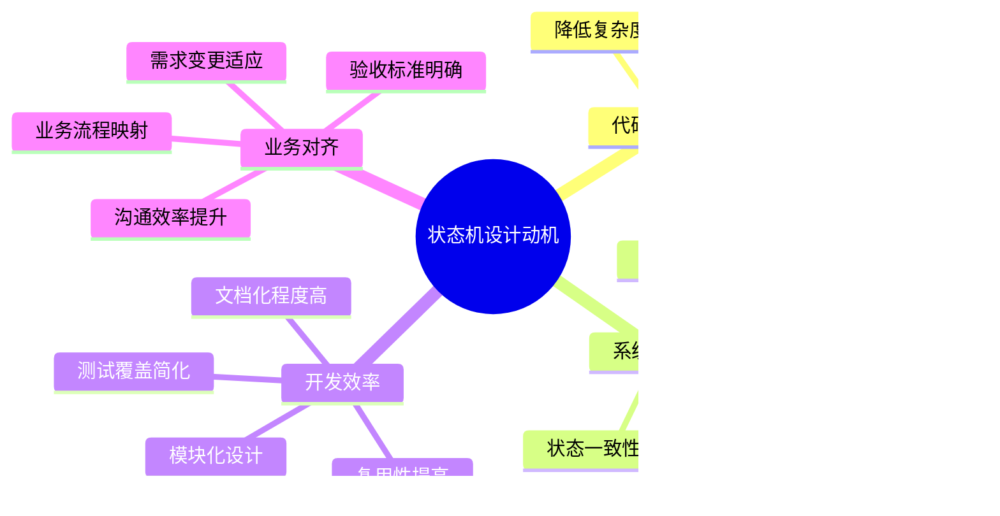
```mermaid
mindmap
  root((状态机设计动机))
    代码质量提升
      降低复杂度
      提高可读性
      增强可维护性
      减少bug数量
    系统可靠性
      状态一致性保证
      非法转换防护
      异常处理规范化
      系统行为可预测
    开发效率
      模块化设计
      复用性提高
      测试覆盖简化
      文档化程度高
    业务对齐
      业务流程映射
      需求变更适应
      沟通效率提升
      验收标准明确
```

### 4.2 传统方式 vs 状态机方式

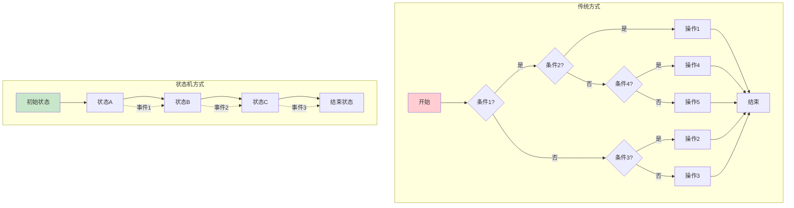
```mermaid
graph TB
    subgraph "传统方式"
        A[开始] --> B{条件1?}
        B -->|是| C{条件2?}
        B -->|否| D{条件3?}
        C -->|是| E[操作1]
        C -->|否| F{条件4?}
        D -->|是| G[操作2]
        D -->|否| H[操作3]
        F -->|是| I[操作4]
        F -->|否| J[操作5]
        E --> K[结束]
        G --> K
        H --> K
        I --> K
        J --> K
    end
    
    subgraph "状态机方式"
        L[初始状态] --> M[状态A]
        M --> N[状态B]
        N --> O[状态C]
        O --> P[结束状态]
        
        M -.事件1.-> N
        N -.事件2.-> O
        O -.事件3.-> P
    end
    
    style A fill:#ffcdd2
    style L fill:#c8e6c9
```

### 4.3 状态机带来的价值

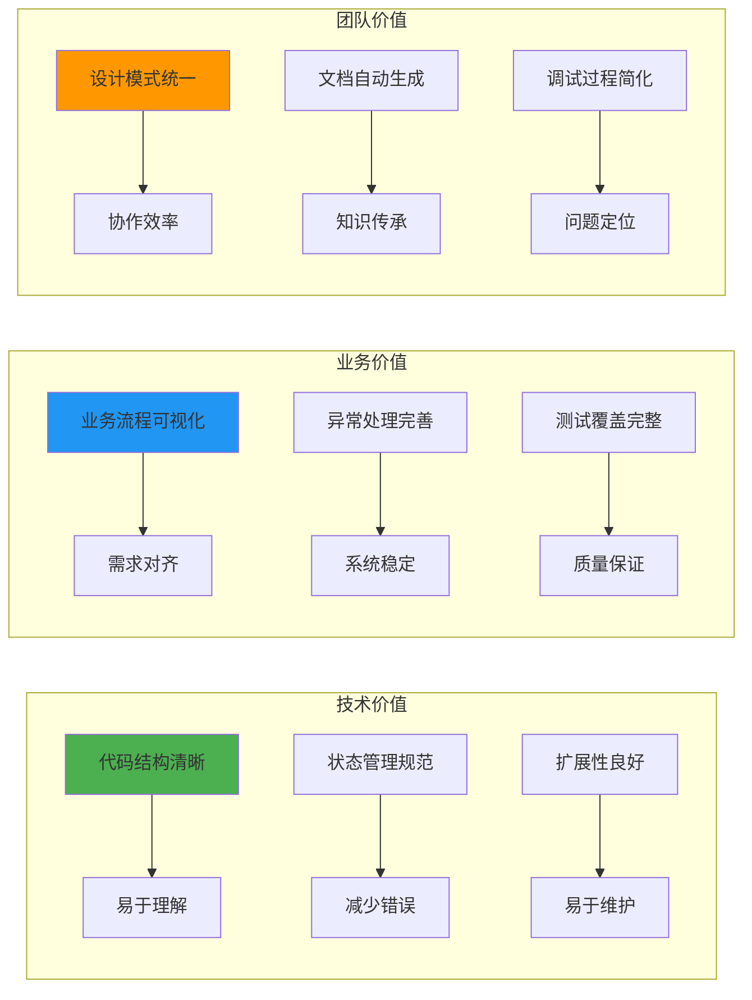
```mermaid
graph LR
    subgraph "技术价值"
        A[代码结构清晰] --> A1[易于理解]
        B[状态管理规范] --> B1[减少错误]
        C[扩展性良好] --> C1[易于维护]
    end
    
    subgraph "业务价值"
        D[业务流程可视化] --> D1[需求对齐]
        E[异常处理完善] --> E1[系统稳定]
        F[测试覆盖完整] --> F1[质量保证]
    end
    
    subgraph "团队价值"
        G[设计模式统一] --> G1[协作效率]
        H[文档自动生成] --> H1[知识传承]
        I[调试过程简化] --> I1[问题定位]
    end
    
    style A fill:#4caf50
    style D fill:#2196f3
    style G fill:#ff9800
```

---

## 5. 状态机核心思想

### 5.1 核心设计理念

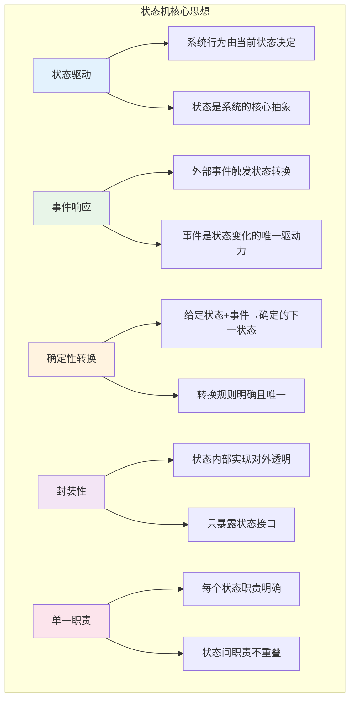
```mermaid
graph TD
    subgraph "状态机核心思想"
        A[状态驱动] --> A1[系统行为由当前状态决定]
        A --> A2[状态是系统的核心抽象]
        
        B[事件响应] --> B1[外部事件触发状态转换]
        B --> B2[事件是状态变化的唯一驱动力]
        
        C[确定性转换] --> C1[给定状态+事件→确定的下一状态]
        C --> C2[转换规则明确且唯一]
        
        D[封装性] --> D1[状态内部实现对外透明]
        D --> D2[只暴露状态接口]
        
        E[单一职责] --> E1[每个状态职责明确]
        E --> E2[状态间职责不重叠]
    end
    
    style A fill:#e3f2fd
    style B fill:#e8f5e8
    style C fill:#fff3e0
    style D fill:#f3e5f5
    style E fill:#fce4ec
```

### 5.2 状态机哲学

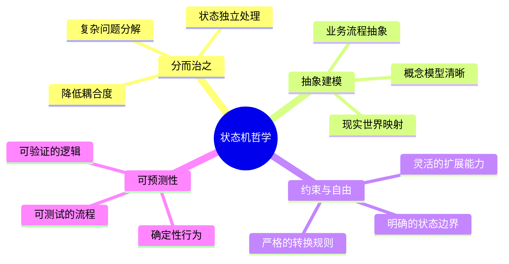
```mermaid
mindmap
  root((状态机哲学))
    分而治之
      复杂问题分解
      状态独立处理
      降低耦合度
    抽象建模
      现实世界映射
      业务流程抽象
      概念模型清晰
    约束与自由
      严格的转换规则
      明确的状态边界
      灵活的扩展能力
    可预测性
      确定性行为
      可验证的逻辑
      可测试的流程
```

### 5.3 状态机设计原则

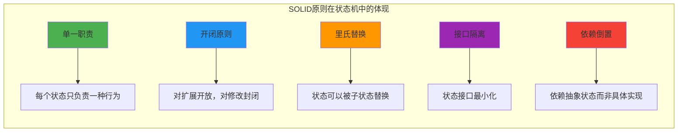
```mermaid
graph LR
    subgraph "SOLID原则在状态机中的体现"
        A[单一职责] --> A1[每个状态只负责一种行为]
        B[开闭原则] --> B1[对扩展开放，对修改封闭]
        C[里氏替换] --> C1[状态可以被子状态替换]
        D[接口隔离] --> D1[状态接口最小化]
        E[依赖倒置] --> E1[依赖抽象状态而非具体实现]
    end
    
    style A fill:#4caf50
    style B fill:#2196f3
    style C fill:#ff9800
    style D fill:#9c27b0
    style E fill:#f44336
```

---

## 6. 状态机核心要素

### 6.1 状态机组成要素

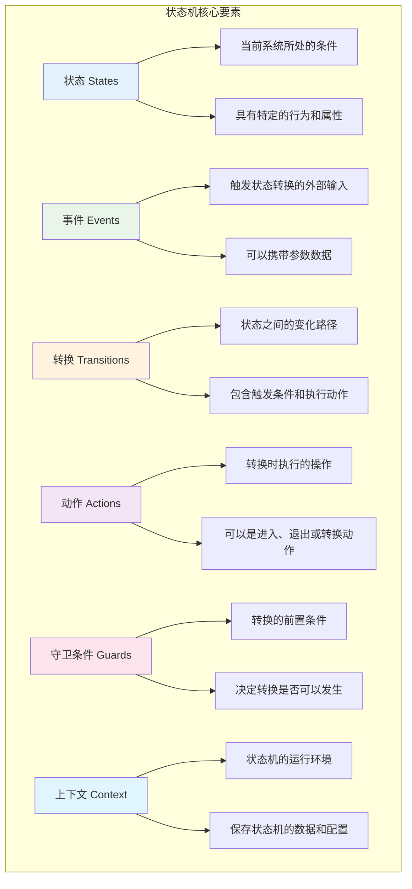
```mermaid
graph TB
    subgraph "状态机核心要素"
        A[状态 States] --> A1[当前系统所处的条件]
        A --> A2[具有特定的行为和属性]
        
        B[事件 Events] --> B1[触发状态转换的外部输入]
        B --> B2[可以携带参数数据]
        
        C[转换 Transitions] --> C1[状态之间的变化路径]
        C --> C2[包含触发条件和执行动作]
        
        D[动作 Actions] --> D1[转换时执行的操作]
        D --> D2[可以是进入、退出或转换动作]
        
        E[守卫条件 Guards] --> E1[转换的前置条件]
        E --> E2[决定转换是否可以发生]
        
        F[上下文 Context] --> F1[状态机的运行环境]
        F --> F2[保存状态机的数据和配置]
    end
    
    style A fill:#e3f2fd
    style B fill:#e8f5e8
    style C fill:#fff3e0
    style D fill:#f3e5f5
    style E fill:#fce4ec
    style F fill:#e1f5fe
```

### 6.2 状态的生命周期

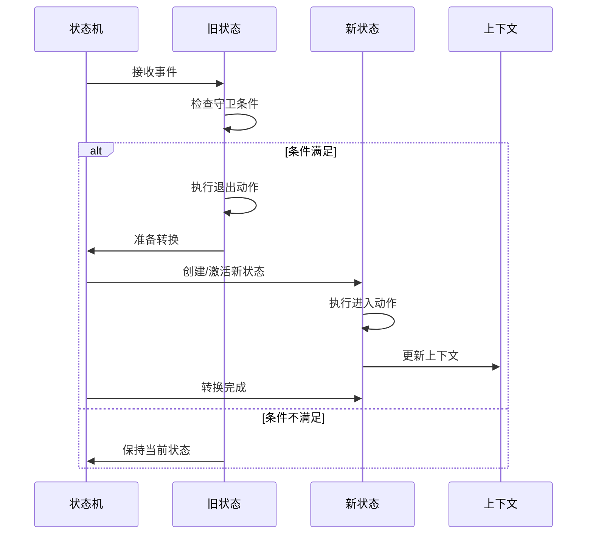
```mermaid
sequenceDiagram
    participant SM as 状态机
    participant OldState as 旧状态
    participant NewState as 新状态
    participant Context as 上下文
    
    SM->>OldState: 接收事件
    OldState->>OldState: 检查守卫条件
    
    alt 条件满足
        OldState->>OldState: 执行退出动作
        OldState->>SM: 准备转换
        SM->>NewState: 创建/激活新状态
        NewState->>NewState: 执行进入动作
        NewState->>Context: 更新上下文
        SM->>NewState: 转换完成
    else 条件不满足
        OldState->>SM: 保持当前状态
    end
```

### 6.3 事件处理机制

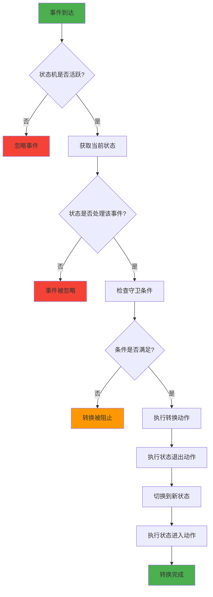
```mermaid
graph TD
    A[事件到达] --> B{状态机是否活跃?}
    B -->|否| C[忽略事件]
    B -->|是| D[获取当前状态]
    
    D --> E{状态是否处理该事件?}
    E -->|否| F[事件被忽略]
    E -->|是| G[检查守卫条件]
    
    G --> H{条件是否满足?}
    H -->|否| I[转换被阻止]
    H -->|是| J[执行转换动作]
    
    J --> K[执行状态退出动作]
    K --> L[切换到新状态]
    L --> M[执行状态进入动作]
    M --> N[转换完成]
    
    style A fill:#4caf50
    style N fill:#4caf50
    style C fill:#f44336
    style F fill:#f44336
    style I fill:#ff9800
```

---

## 7. 状态机核心原理

### 7.1 状态转换原理

```mermaid
graph LR
    subgraph "转换函数"
        A[δ(s, e) = s'] 
        B[当前状态 s]
        C[输入事件 e]
        D[下一状态 s']
        
        B --> A
        C --> A
        A --> D
    end
    
    subgraph "转换表示例"
        E[状态\事件] --> F[开始]
        E --> G[运行]
        E --> H[暂停]
        E --> I[结束]
        
        F --> F1[start→运行]
        G --> G1[pause→暂停]
        G --> G2[stop→结束]
        H --> H1[resume→运行]
        H --> H2[stop→结束]
    end
    
    style A fill:#4caf50
    style F1 fill:#e3f2fd
    style G1 fill:#e8f5e8
    style G2 fill:#fff3e0
    style H1 fill:#f3e5f5
    style H2 fill:#fce4ec
```

### 7.2 状态机执行模型

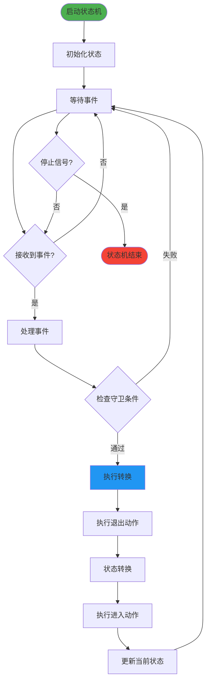
```mermaid
flowchart TD
    Start([启动状态机]) --> Init[初始化状态]
    Init --> Wait[等待事件]
    
    Wait --> Event{接收到事件?}
    Event -->|是| Process[处理事件]
    Event -->|否| Wait
    
    Process --> Guard{检查守卫条件}
    Guard -->|通过| Execute[执行转换]
    Guard -->|失败| Wait
    
    Execute --> ExitAction[执行退出动作]
    ExitAction --> Transition[状态转换]
    Transition --> EnterAction[执行进入动作]
    EnterAction --> Update[更新当前状态]
    Update --> Wait
    
    Wait --> Stop{停止信号?}
    Stop -->|是| End([状态机结束])
    Stop -->|否| Event
    
    style Start fill:#4caf50
    style End fill:#f44336
    style Execute fill:#2196f3
```

### 7.3 层次状态机原理

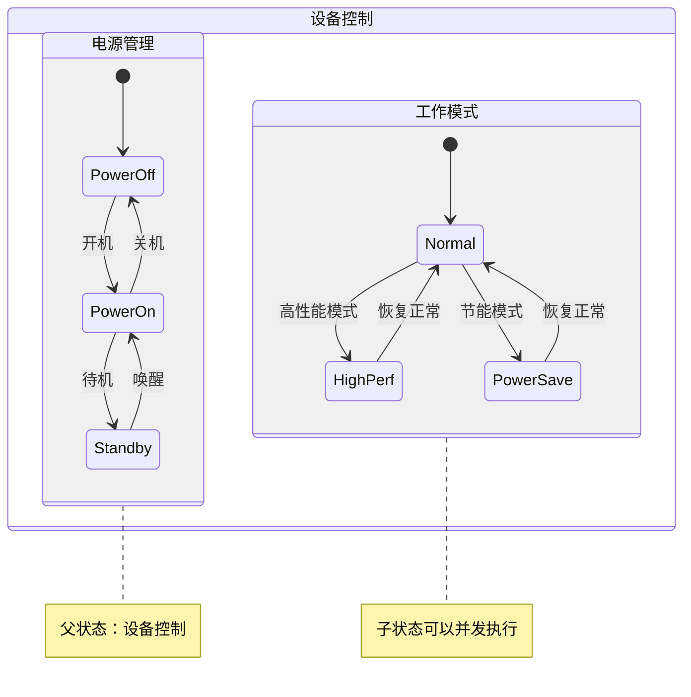
```mermaid
stateDiagram-v2
    state "设备控制" as Device {
        state "电源管理" as Power {
            [*] --> PowerOff
            PowerOff --> PowerOn: 开机
            PowerOn --> PowerOff: 关机
            PowerOn --> Standby: 待机
            Standby --> PowerOn: 唤醒
        }
        
        state "工作模式" as Work {
            [*] --> Normal
            Normal --> HighPerf: 高性能模式
            Normal --> PowerSave: 节能模式
            HighPerf --> Normal: 恢复正常
            PowerSave --> Normal: 恢复正常
        }
    }
    
    note right of Power: 父状态：设备控制
    note right of Work: 子状态可以并发执行
```

---

## 8. C++状态机实现示例

### 8.1 简单状态机基础框架

```cpp
#include <iostream>
#include <memory>
#include <unordered_map>
#include <functional>

// 前向声明
class StateMachine;
class State;

// 事件基类
class Event {
public:
    virtual ~Event() = default;
    virtual std::string getName() const = 0;
};

// 具体事件类
class StartEvent : public Event {
public:
    std::string getName() const override { return "StartEvent"; }
};

class StopEvent : public Event {
public:
    std::string getName() const override { return "StopEvent"; }
};

class PauseEvent : public Event {
public:
    std::string getName() const override { return "PauseEvent"; }
};

class ResumeEvent : public Event {
public:
    std::string getName() const override { return "ResumeEvent"; }
};

// 状态基类
class State {
public:
    virtual ~State() = default;
    virtual std::string getName() const = 0;
    virtual void onEnter(StateMachine* sm) {}
    virtual void onExit(StateMachine* sm) {}
    virtual std::shared_ptr<State> handleEvent(
        StateMachine* sm, 
        const Event& event
    ) = 0;
};

// 状态机类
class StateMachine {
private:
    std::shared_ptr<State> currentState_;
    std::unordered_map<std::string, std::shared_ptr<State>> states_;
    
public:
    StateMachine() = default;
    
    // 添加状态
    void addState(const std::string& name, std::shared_ptr<State> state) {
        states_[name] = state;
    }
    
    // 设置初始状态
    void setInitialState(const std::string& stateName) {
        auto it = states_.find(stateName);
        if (it != states_.end()) {
            currentState_ = it->second;
            currentState_->onEnter(this);
            std::cout << "状态机启动，初始状态: " << currentState_->getName() << std::endl;
        }
    }
    
    // 处理事件
    void handleEvent(const Event& event) {
        if (!currentState_) {
            std::cout << "错误: 状态机未初始化" << std::endl;
            return;
        }
        
        std::cout << "当前状态: " << currentState_->getName() 
                  << ", 接收事件: " << event.getName() << std::endl;
        
        auto nextState = currentState_->handleEvent(this, event);
        
        if (nextState && nextState != currentState_) {
            // 执行状态转换
            currentState_->onExit(this);
            std::cout << "状态转换: " << currentState_->getName() 
                      << " -> " << nextState->getName() << std::endl;
            currentState_ = nextState;
            currentState_->onEnter(this);
        }
    }
    
    // 获取当前状态
    std::string getCurrentStateName() const {
        return currentState_ ? currentState_->getName() : "None";
    }
    
    // 获取状态
    std::shared_ptr<State> getState(const std::string& name) {
        auto it = states_.find(name);
        return (it != states_.end()) ? it->second : nullptr;
    }
};
```

### 8.2 具体状态实现

```cpp
// 空闲状态
class IdleState : public State {
public:
    std::string getName() const override { return "Idle"; }
    
    void onEnter(StateMachine* sm) override {
        std::cout << "进入空闲状态 - 系统准备就绪" << std::endl;
    }
    
    void onExit(StateMachine* sm) override {
        std::cout << "退出空闲状态" << std::endl;
    }
    
    std::shared_ptr<State> handleEvent(StateMachine* sm, const Event& event) override {
        if (event.getName() == "StartEvent") {
            return sm->getState("Running");
        }
        std::cout << "空闲状态忽略事件: " << event.getName() << std::endl;
        return nullptr;
    }
};

// 运行状态
class RunningState : public State {
public:
    std::string getName() const override { return "Running"; }
    
    void onEnter(StateMachine* sm) override {
        std::cout << "进入运行状态 - 开始执行任务" << std::endl;
    }
    
    void onExit(StateMachine* sm) override {
        std::cout << "退出运行状态 - 停止执行任务" << std::endl;
    }
    
    std::shared_ptr<State> handleEvent(StateMachine* sm, const Event& event) override {
        if (event.getName() == "PauseEvent") {
            return sm->getState("Paused");
        } else if (event.getName() == "StopEvent") {
            return sm->getState("Idle");
        }
        std::cout << "运行状态忽略事件: " << event.getName() << std::endl;
        return nullptr;
    }
};

// 暂停状态
class PausedState : public State {
public:
    std::string getName() const override { return "Paused"; }
    
    void onEnter(StateMachine* sm) override {
        std::cout << "进入暂停状态 - 任务已暂停" << std::endl;
    }
    
    void onExit(StateMachine* sm) override {
        std::cout << "退出暂停状态" << std::endl;
    }
    
    std::shared_ptr<State> handleEvent(StateMachine* sm, const Event& event) override {
        if (event.getName() == "ResumeEvent") {
            return sm->getState("Running");
        } else if (event.getName() == "StopEvent") {
            return sm->getState("Idle");
        }
        std::cout << "暂停状态忽略事件: " << event.getName() << std::endl;
        return nullptr;
    }
};
```

### 8.3 使用示例

```cpp
// 使用示例
int main() {
    // 创建状态机
    StateMachine sm;
    
    // 创建状态实例
    auto idleState = std::make_shared<IdleState>();
    auto runningState = std::make_shared<RunningState>();
    auto pausedState = std::make_shared<PausedState>();
    
    // 添加状态到状态机
    sm.addState("Idle", idleState);
    sm.addState("Running", runningState);
    sm.addState("Paused", pausedState);
    
    // 设置初始状态
    sm.setInitialState("Idle");
    
    std::cout << "\n=== 状态机测试开始 ===" << std::endl;
    
    // 测试状态转换
    std::cout << "\n1. 启动任务:" << std::endl;
    sm.handleEvent(StartEvent());
    
    std::cout << "\n2. 暂停任务:" << std::endl;
    sm.handleEvent(PauseEvent());
    
    std::cout << "\n3. 恢复任务:" << std::endl;
    sm.handleEvent(ResumeEvent());
    
    std::cout << "\n4. 停止任务:" << std::endl;
    sm.handleEvent(StopEvent());
    
    std::cout << "\n5. 尝试无效操作 (在空闲状态暂停):" << std::endl;
    sm.handleEvent(PauseEvent());
    
    std::cout << "\n=== 状态机测试结束 ===" << std::endl;
    std::cout << "最终状态: " << sm.getCurrentStateName() << std::endl;
    
    return 0;
}
```

### 8.4 高级状态机特性

```cpp
// 带守卫条件的状态机
class GuardedStateMachine : public StateMachine {
private:
    std::unordered_map<std::string, std::function<bool()>> guards_;
    
public:
    // 添加守卫条件
    void addGuard(const std::string& name, std::function<bool()> guard) {
        guards_[name] = guard;
    }
    
    // 检查守卫条件
    bool checkGuard(const std::string& guardName) {
        auto it = guards_.find(guardName);
        return (it != guards_.end()) ? it->second() : true;
    }
};

// 带数据的事件
class DataEvent : public Event {
private:
    std::string data_;
    
public:
    DataEvent(const std::string& data) : data_(data) {}
    std::string getName() const override { return "DataEvent"; }
    std::string getData() const { return data_; }
};

// 状态机工厂
class StateMachineFactory {
public:
    static std::unique_ptr<StateMachine> createTaskStateMachine() {
        auto sm = std::make_unique<StateMachine>();
        
        sm->addState("Idle", std::make_shared<IdleState>());
        sm->addState("Running", std::make_shared<RunningState>());
        sm->addState("Paused", std::make_shared<PausedState>());
        
        return sm;
    }
};
```

### 8.5 状态机UML图

```mermaid
classDiagram
    class Event {
        <<abstract>>
        +getName() string
    }
    
    class State {
        <<abstract>>
        +getName() string
        +onEnter(StateMachine* sm)
        +onExit(StateMachine* sm)
        +handleEvent(StateMachine* sm, Event& event) State*
    }
    
    class StateMachine {
        -currentState: State*
        -states: map~string, State*~
        +addState(name: string, state: State*)
        +setInitialState(stateName: string)
        +handleEvent(event: Event&)
        +getCurrentStateName() string
    }
    
    class IdleState {
        +getName() string
        +onEnter(StateMachine* sm)
        +onExit(StateMachine* sm)
        +handleEvent(StateMachine* sm, Event& event) State*
    }
    
    class RunningState {
        +getName() string
        +onEnter(StateMachine* sm)
        +onExit(StateMachine* sm)
        +handleEvent(StateMachine* sm, Event& event) State*
    }
    
    class PausedState {
        +getName() string
        +onEnter(StateMachine* sm)
        +onExit(StateMachine* sm)
        +handleEvent(StateMachine* sm, Event& event) State*
    }
    
    class StartEvent {
        +getName() string
    }
    
    class StopEvent {
        +getName() string
    }
    
    class PauseEvent {
        +getName() string
    }
    
    class ResumeEvent {
        +getName() string
    }
    
    Event <|-- StartEvent
    Event <|-- StopEvent
    Event <|-- PauseEvent
    Event <|-- ResumeEvent
    
    State <|-- IdleState
    State <|-- RunningState
    State <|-- PausedState
    
    StateMachine --> State : contains
    StateMachine --> Event : processes
```

---

## 9. 状态机问题与弊端

### 9.1 常见问题分析

```mermaid
mindmap
  root((状态机问题))
    复杂性问题
      状态爆炸
      转换复杂
      维护困难
      理解成本高
    性能问题
      内存开销
      转换开销
      事件处理延迟
      并发性能
    设计问题
      过度设计
      状态粒度
      职责划分
      接口设计
    实现问题
      代码冗余
      错误处理
      调试困难
      测试复杂
```

### 9.2 状态爆炸问题

```mermaid
graph TD
    subgraph "状态爆炸示例"
        A[用户登录状态机] --> B[未登录]
        A --> C[登录中]
        A --> D[已登录]
        A --> E[登录失败]
        
        F[权限状态机] --> G[无权限]
        F --> H[读权限]
        F --> I[写权限]
        F --> J[管理权限]
        
        K[网络状态机] --> L[离线]
        K --> M[连接中]
        K --> N[在线]
        K --> O[网络错误]
    end
    
    subgraph "组合状态数量"
        P[总状态数 = 4 × 4 × 4 = 64个状态]
        Q[转换数量呈指数增长]
        R[维护成本急剧上升]
    end
    
    style P fill:#ffcdd2
    style Q fill:#ffcdd2
    style R fill:#ffcdd2
```

### 9.3 性能开销分析

```mermaid
graph LR
    subgraph "性能开销来源"
        A[内存开销] --> A1[状态对象存储]
        A --> A2[转换表存储]
        A --> A3[事件队列缓存]
        
        B[CPU开销] --> B1[状态查找]
        B --> B2[条件检查]
        B --> B3[动作执行]
        
        C[I/O开销] --> C1[状态持久化]
        C --> C2[日志记录]
        C --> C3[网络通信]
    end
    
    subgraph "优化策略"
        D[内存优化] --> D1[状态池化]
        D --> D2[延迟加载]
        
        E[CPU优化] --> E1[查找表优化]
        E --> E2[条件预计算]
        
        F[I/O优化] --> F1[批量操作]
        F --> F2[异步处理]
    end
    
    A1 --> D1
    A2 --> D2
    B1 --> E1
    B2 --> E2
    C1 --> F1
    C2 --> F2
    
    style A fill:#ffcdd2
    style B fill:#fff3e0
    style C fill:#f3e5f5
    style D fill:#c8e6c9
    style E fill:#c8e6c9
    style F fill:#c8e6c9
```

### 9.4 设计陷阱

```mermaid
graph TD
    subgraph "常见设计陷阱"
        A[过度设计] --> A1[状态过于细粒度]
        A --> A2[不必要的状态]
        A --> A3[复杂的层次结构]
        
        B[职责混乱] --> B1[状态职责重叠]
        B --> B2[业务逻辑泄漏]
        B --> B3[状态间强耦合]
        
        C[扩展性差] --> C1[硬编码转换]
        C --> C2[缺乏抽象层]
        C --> C3[配置不灵活]
    end
    
    subgraph "解决方案"
        D[合理设计] --> D1[状态粒度适中]
        D --> D2[职责单一明确]
        D --> D3[层次结构简单]
        
        E[良好抽象] --> E1[接口设计清晰]
        E --> E2[依赖注入]
        E --> E3[配置外部化]
    end
    
    A1 --> D1
    A2 --> D2
    A3 --> D3
    B1 --> E1
    B2 --> E2
    B3 --> E3
    
    style A fill:#ffcdd2
    style B fill:#ffcdd2
    style C fill:#ffcdd2
    style D fill:#c8e6c9
    style E fill:#c8e6c9
```

### 9.5 调试与测试挑战

```mermaid
sequenceDiagram
    participant Dev as 开发者
    participant SM as 状态机
    participant Debug as 调试器
    participant Test as 测试框架
    
    Note over Dev: 发现状态机bug
    
    Dev->>SM: 设置断点
    SM->>Debug: 状态转换过程复杂
    Debug->>Dev: 难以跟踪状态变化
    
    Dev->>Test: 编写测试用例
    Test->>SM: 状态组合数量庞大
    SM->>Test: 测试覆盖率难以保证
    Test->>Dev: 测试用例维护困难
    
    Note over Dev: 需要专门的调试和测试工具
```

### 9.6 适用性评估

```mermaid
graph LR
    subgraph "适合使用状态机"
        A[明确的状态转换] --> A1[业务流程清晰]
        B[有限的状态数量] --> B1[状态可枚举]
        C[复杂的条件逻辑] --> C1[if-else过于复杂]
        D[需要状态持久化] --> D1[状态需要保存]
    end
    
    subgraph "不适合使用状态机"
        E[简单的线性流程] --> E1[顺序执行即可]
        F[状态数量巨大] --> F1[状态爆炸风险]
        G[频繁的状态变化] --> G1[性能开销过大]
        H[状态边界模糊] --> H1[难以明确定义]
    end
    
    style A fill:#c8e6c9
    style B fill:#c8e6c9
    style C fill:#c8e6c9
    style D fill:#c8e6c9
    style E fill:#ffcdd2
    style F fill:#ffcdd2
    style G fill:#ffcdd2
    style H fill:#ffcdd2
```

### 9.7 最佳实践建议

```mermaid
graph TD
    subgraph "状态机最佳实践"
        A[设计阶段] --> A1[明确状态边界]
        A --> A2[保持状态简单]
        A --> A3[避免深层嵌套]
        
        B[实现阶段] --> B1[使用设计模式]
        B --> B2[提供调试接口]
        B --> B3[支持状态序列化]
        
        C[测试阶段] --> C1[状态覆盖测试]
        C --> C2[转换路径测试]
        C --> C3[异常情况测试]
        
        D[维护阶段] --> D1[文档及时更新]
        D --> D2[监控状态分布]
        D --> D3[性能定期评估]
    end
    
    style A fill:#e3f2fd
    style B fill:#e8f5e8
    style C fill:#fff3e0
    style D fill:#f3e5f5
```

---

## 总结

### 核心要点回顾

1. **应用场景广泛**：从游戏开发到业务流程，从网络协议到用户界面
2. **解决复杂性问题**：将复杂的条件逻辑转换为清晰的状态转换
3. **设计思想明确**：状态驱动、事件响应、确定性转换
4. **实现相对简单**：基于面向对象的设计模式，易于理解和实现
5. **存在固有问题**：状态爆炸、性能开销、设计复杂度

### 使用决策矩阵

```mermaid
graph LR
    subgraph "状态机使用决策"
        A{业务复杂度} -->|高| B{状态数量}
        A -->|低| C[考虑简单方案]
        
        B -->|适中| D{性能要求}
        B -->|过多| E[考虑其他方案]
        
        D -->|一般| F[推荐使用状态机]
        D -->|极高| G[谨慎评估]
        
        C --> H[线性流程/简单条件]
        E --> I[分层设计/微服务]
        F --> J[标准状态机实现]
        G --> K[优化后的状态机]
    end
    
    style F fill:#c8e6c9
    style J fill:#c8e6c9
    style K fill:#fff3e0
    style H fill:#ffcdd2
    style I fill:#ffcdd2
```

状态机是一个强大的设计工具，但需要在合适的场景下正确使用。通过理解其核心原理、掌握实现技巧、避免常见陷阱，可以充分发挥状态机在软件设计中的价值。