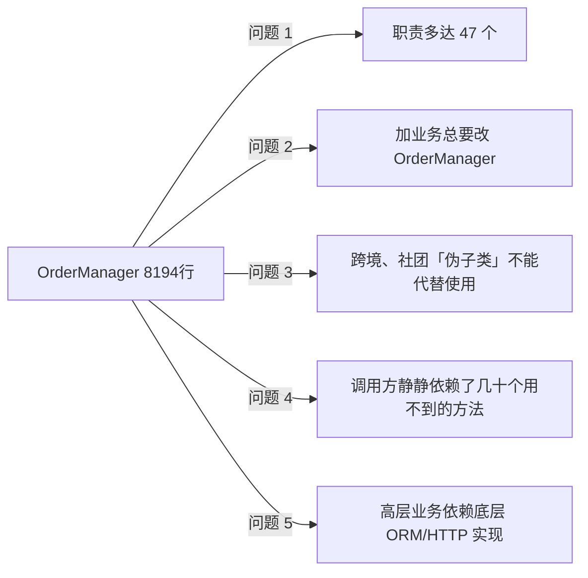
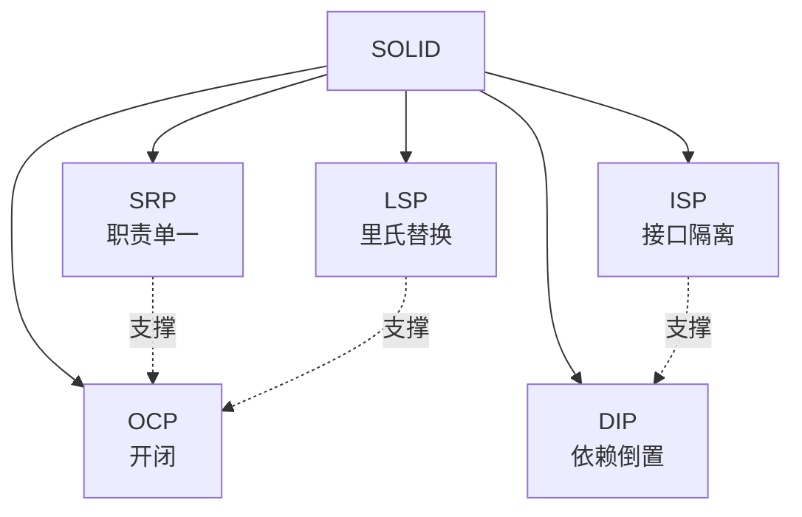
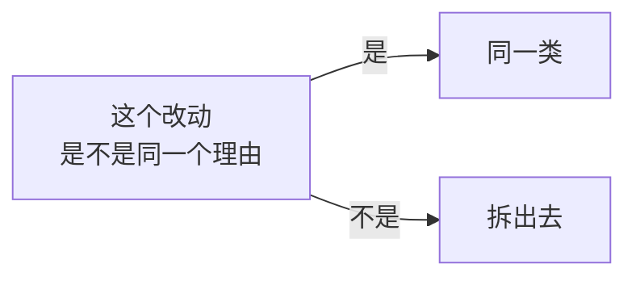
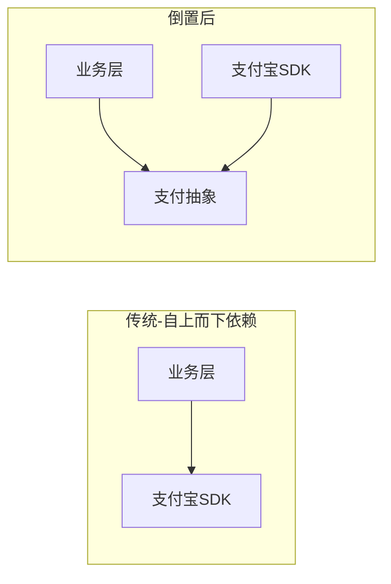
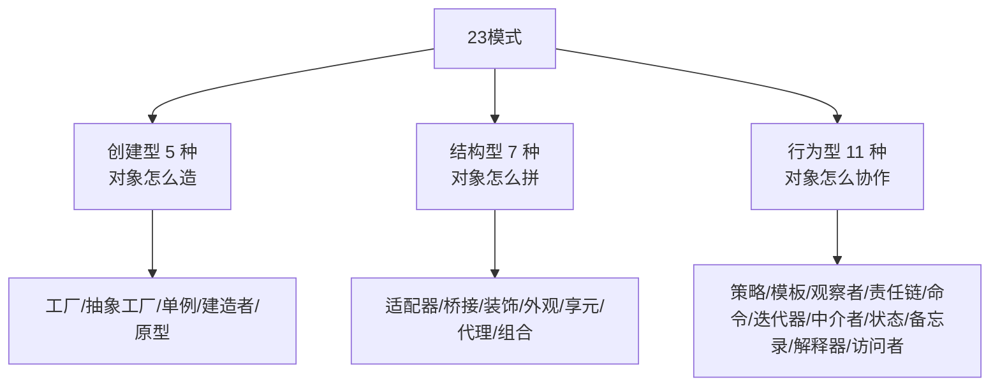

# 第一卷第6章：设计原则全景图

#### 目录介绍
- [1.先回答上篇思考题](#1先回答上篇思考题)
  - [1.1 上篇遗留三道题](#11-上篇遗留三道题)
  - [1.2 8000行上帝类现场](#12-8000行上帝类现场)
  - [1.3 五次重构全头处](#13-五次重构全头处)
  - [1.4 灵魂五连问](#14-灵魂五连问)
- [2.从砖到房子](#2从砖到房子)
  - [2.1 已有的砖](#21-已有的砖)
  - [2.2 缺什么](#22-缺什么)
  - [2.3 SOLID 总览](#23-solid-总览)
- [3.单一职责 SRP](#3单一职责-srp)
  - [3.1 一句话理解](#31-一句话理解)
  - [3.2 反例与正例](#32-反例与正例)
  - [3.3 边界判断](#33-边界判断)
- [4.开闭原则 OCP](#4开闭原则-ocp)
  - [4.1 一句话理解](#41-一句话理解)
  - [4.2 案例对照](#42-案例对照)
  - [4.3 实现路径](#43-实现路径)
- [5.里氏替换 LSP](#5里氏替换-lsp)
  - [5.1 一句话理解](#51-一句话理解)
  - [5.2 经典反例](#52-经典反例)
  - [5.3 契约不变](#53-契约不变)
- [6.接口隔离 ISP](#6接口隔离-isp)
  - [6.1 一句话理解](#61-一句话理解)
  - [6.2 胖接口拆解](#62-胖接口拆解)
  - [6.3 与 SRP 的差异](#63-与-srp-的差异)
- [7.依赖倒置 DIP](#7依赖倒置-dip)
  - [7.1 一句话理解](#71-一句话理解)
  - [7.2 倒置的方向](#72-倒置的方向)
  - [7.3 IoC 与 DI](#73-ioc-与-di)
- [8.原则与模式](#8原则与模式)
  - [8.1 原则是骨](#81-原则是骨)
  - [8.2 模式是肉](#82-模式是肉)
  - [8.3 23 种模式分类](#83-23-种模式分类)
- [9.总结与下一步](#9总结与下一步)
- [10.综合实战案例](#10综合实战案例)
  - [10.1 订单总馆需求变迁](#101-订单总馆需求变迁)
  - [10.2 不用原则的崩塌路径](#102-不用原则的崩塌路径)
  - [10.3 五条原则逐个介入](#103-五条原则逐个介入)
  - [9.4 类图与原则映射](#94-类图与原则映射)
  - [9.5 留下三道思考题](#95-留下三道思考题)
- [10.认知跃迁总结](#10认知跃迁总结)

---

## 1.先回答上篇思考题

### 1.1 上篇遗留三道题

上一篇 [05.多用组合和少继承](05.多用组合和少继承.md) 末尾留下了三道题：

- 🟢 `List<Capability>` vs `Map<Class, Capability>` vs `Set` 差别？
- 🟡 运行期动态加能力与不变量怎么平衡？
- 🔴 `product.is(Shippable.class)` 这种类型检查是不是设计问题？

| 题 | 本篇答案 |
|---|---|
| 🟢 | `List`=有序可重复（适合中间件链）、`Set`=不允许重复能力、`Map<Class,Capability>`=以类型为主键快查（适合本例）。**都能跑，但语义完全不同** |
| 🟡 | 「不变量」不是「字段不变」，是「业务规则始终成立」。动态加能力 → 产生新的不可变 `Product` 快照，原实例不动 |
| 🔴 | 是设计问题！`is(...)` 是「多态的退化」。本篇§04 LSP 会告诉你：避免 `instanceof` 是 LSP 的隱性要求 |

三道题同时指向本篇的主题：**如何从「可以这样写」走到「该这样写」**——这正是 SOLID 的职责。

### 1.2 8000行上帝类现场

某中台企业系统 `OrderManager.java`：

```
2019-08  init: OrderManager 247 行
2020-04  +推送逻辑、+退款逻辑 → 1132 行
2020-12  +发票、+争议、+邀请返佣 → 2891 行
2021-09  +跨境、+多货币 → 4760 行
2022-08  +会员体系、+积分 → 6204 行
2023-11  +带货主播抽佣、+社区团购 → 8194 行 ← 谁也不敢动
```

它看上去违反了「单一职责」——但你能一眼看出它**到底违反了 SOLID 里哪几条**吗？详细联调后，答案是【同时违反了五条】：



这种「五条原则同时违反」的上帝类，**为什么会出现？**不是工程师不努力，是在「代码越东辣、越不敢动」的状况下，选择「加个 if-else 还能发版」是本能。**这种本能选择之所以能出现，就是因为背后没有 SOLID 这件「骨架」在约束肣体生长**。

本篇的意义：让你从今天开始，身上背五条反躺肣背心。

### 1.3 五次重构全头处

面对 8000 行上帝类，某团队连动 5 次重构，每次都仅能提起1条原则。这反过来成为了本篇的「介绍顺序」：

- 重构 1：拆 47 个职责为独立服务 → SRP生效，代码量从 8000 降到 5500
- 重构 2：抽象出「业务能力」插拔点 → OCP生效，加 1 个业务只加 1 个插件
- 重构 3：为「跨境」「社团」等「伪子类」重设并保证可替换 → LSP生效
- 重构 4：给调用方以「只要能力」的接口，别塮事以万能接口 → ISP 生效
- 重构 5：反转高低层依赖、引入 IoC 容器 → DIP 生效

最后这五条原则不是「五个独立眼镜」，是「五股同时拉着的肣体」。什么叫「同时拉着」？就是：SRP 不是为了拆小是为了代码能遵守 OCP，潜变后 ISP 才能遵守，LSP 保证不拆坏，DIP 为五条提供装配。**五条原则互为因果**。

### 1.4 灵魂五连问

```
Q1 ── SOLID 那么各是什么关系？依顺序还是同时生效？
       └─→ §01.3 / §10 原则互为因果
Q2 ── SRP 的「一」到底多「一」？
       └─→ §02.3 边界判断Q3 ── OCP 中「对修改关闭」是不是谈什么都不能动？
       └─→ §03.3 实现路径
Q4 ── LSP 的“可替换”是只考编译能过么？
       └─→ §04 契约不变Q5 ── 为什么 23 种设计模式本质上都是「原则的结晶」？
       └─→ §07 原则与模式
```

---

## 2.从砖到房子

### 2.1 已有的砖

走过前五篇，你已经掌握：

- 对象与过程的范式之别（01）
- 四大特性的原理与落地（02）
- 接口与抽象类的取舍（03）
- 面向接口而非实现（04）
- 多用组合少用继承（05）

这些是**砖**——单点技能。

### 2.2 缺什么

砌墙还需要**图纸**：什么样的代码算"好"？什么样的拆分是"合理"？什么时候加一个抽象层是"过度设计"？


设计原则是**判断尺**：写代码时随时拿来对照，发现"违反"就提示重构。

### 2.3 SOLID 总览

| 缩写 | 全称 | 一句话 |
|------|------|--------|
| **S** | Single Responsibility | 一个类只做一件事 |
| **O** | Open/Closed | 对扩展开放，对修改关闭 |
| **L** | Liskov Substitution | 子类必须能替换父类 |
| **I** | Interface Segregation | 接口要小而专 |
| **D** | Dependency Inversion | 依赖抽象，不依赖具体 |



---

## 3.单一职责 SRP

### 7.1 一句话理解

> 一个类应当只有一个引起它变化的理由。

"变化的理由"通常对应**一个角色/一种业务方向**：财务部门改不动技术部门的代码。

### 3.2 反例与正例

```java
// ❌ Order 类既算钱又发邮件又写库
class Order {
    Money total() { /* 计算 */ }
    void save() { /* 写库 */ }
    void sendConfirmEmail() { /* 发邮件 */ }
}

// ✓ 拆成三个职责
class Order { Money total() { /* … */ } }
class OrderRepository { void save(Order o) { /* … */ } }
class EmailNotifier { void sendConfirm(Order o) { /* … */ } }
```

任意改一个，**编译只动一处**——这就是 SRP 的工程价值。

### 3.3 边界判断

不要走极端——不是"一个类一个方法"。判断边界的实操技巧：



例子：`Order.calcDiscount` 和 `Order.calcTax` 都是为"算钱"服务 → 同一类；
`Order.save`（持久化）和 `Order.calcTax`（业务）→ 分属基础设施与领域，应拆。

---

## 4.开闭原则 OCP

### 7.1 一句话理解

> 对扩展开放，对修改关闭。

新增功能 → **加新代码**，不改旧码。

### 3.2 案例对照

回到 04 篇的支付例子：

```java
// ❌ 违反 OCP
void pay(String channel) {
    if ("alipay".equals(channel)) /* … */
    else if ("wechat".equals(channel)) /* … */
}

// ✓ 满足 OCP
void pay(PaymentGateway g, Order o) { g.pay(o); }
```

加 PayPal → 加一个 `PaypalGateway`，**`pay` 函数零改动**。

### 3.3 实现路径

OCP 不是凭空实现的，需要前面所有招式协力：

```mermaid
flowchart LR
    SRP --> 拆出独立扩展点
    LSP --> 子类安全替换
    DIP --> 依赖抽象不依赖具体
    抽象 + 多态 --> OCP[OCP<br/>扩展开放<br/>修改关闭]
```

---

## 5.里氏替换 LSP

### 7.1 一句话理解

> 凡是基类能用的地方，子类必须能用，且行为不会令使用方惊讶。

### 5.2 经典反例

```java
// 鸵鸟继承 Bird，但 fly() 抛异常
class Ostrich extends Bird {
    @Override public void fly() { throw new UnsupportedOperationException(); }
}

void migrate(Bird bird) { bird.fly(); }   // 拿到 Ostrich → 崩溃
```

子类**违背了父类的契约**。修复方式：让 `fly()` 不在父类（参考 05 篇用接口拆能力）。

### 5.3 契约不变

LSP 的核心是**契约不变性**：

| 契约 | 子类约束 |
|------|----------|
| 前置条件 | 不能更严 |
| 后置条件 | 不能更松 |
| 不变量 | 必须保持 |
| 异常 | 不能抛父类未声明的 |

违反任意一条，子类就不再是"合法替代品"，OCP 也就守不住——所以 **LSP 是 OCP 的安全前提**。

---

## 6.接口隔离 ISP

### 7.1 一句话理解

> 客户端不应该被迫依赖它不使用的方法。

### 6.2 胖接口拆解

```java
// ❌ 一个胖接口什么都管
interface UserService {
    void register(User u);
    void login(String u, String p);
    void exportToExcel();
    void sendMarketingEmail();
}
// 客户端只想登录，却被迫看到导出/营销
```

```java
// ✓ 拆成多个小接口
interface UserAuth      { void register(User u); void login(String u, String p); }
interface UserExporter  { void exportToExcel(); }
interface MarketingMail { void sendMarketingEmail(); }
```

### 6.3 与 SRP 的差异

| 原则 | 着眼点 |
|------|--------|
| SRP | **类**只承担一种变化原因 |
| ISP | **接口**只服务于一类客户 |

二者经常被混淆——SRP 看实现，ISP 看契约，是同一思想在不同侧的体现。

---

## 7.依赖倒置 DIP

### 7.1 一句话理解

> 高层模块不应依赖低层模块；二者都应依赖抽象。
> 抽象不应依赖细节；细节应依赖抽象。

### 6.2 倒置的方向



依赖箭头被"倒过来"——业务**不再被 SDK 牵着走**，反而是 SDK 来适配业务定义的抽象。

### 6.3 IoC 与 DI

DIP 在工程上的落地是 **IoC（控制反转）+ DI（依赖注入）**：

```java
// ❌ 类自己 new 依赖
class CheckoutService {
    private AlipayGateway gateway = new AlipayGateway();
}

// ✓ 依赖通过构造注入
class CheckoutService {
    private final PaymentGateway gateway;
    CheckoutService(PaymentGateway gateway) { this.gateway = gateway; }
}
```

Spring/Dagger/Guice 等容器把"装配"职责从业务类剥离，**业务类只声明"我需要什么"，谁给 由容器决定**——这就是 IoC 的字面含义。

---

## 8.原则与模式

### 8.1 原则是骨

SOLID 给了你"判断方向"的尺子，但没告诉你**具体怎么写**。

### 8.2 模式是肉

23 种设计模式正是**SOLID 的具体落地剧本**：

| 模式 | 服务的原则 |
|------|------------|
| 工厂方法 | OCP、DIP |
| 策略模式 | OCP（替代 if-else）|
| 装饰者模式 | OCP、LSP |
| 适配器 | DIP（适配老接口）|
| 模板方法 | OCP（钩子）|
| 观察者 | OCP（事件解耦）|

### 8.3 23 种模式分类



| 类别 | 关注点 | 代表案例 |
|------|--------|----------|
| 创建型 | 解耦"创建"与"使用" | 工厂、建造者 |
| 结构型 | 类与对象的组合关系 | 装饰、代理 |
| 行为型 | 对象间的协作模式 | 策略、观察者 |

---

## 9.总结与下一步


**面向对象设计的全景**：从语言特性 → 通用原则 → 落地模式 → 架构思想，每一层都解决前一层无法回答的问题。

| 阶段 | 解决 |
|------|------|
| 特性 | 怎么写对象 |
| 原则 | 怎么写得"好" |
| 模式 | 已知场景的最佳实践 |
| 架构 | 大规模系统的整体协作 |

---

## 10.综合实战案例

> 主线收束接点——05 篇我们拼出了商品能力体系，本篇要为「订单总馆」加装 SOLID 五条马马。

### 10.1 订单总馆需求变迁

还记得 01 篇那个订单系统吗？三年后，需求变成了这样：

```
- 接入 5 种支付渠道（接入、动态插拔）
- 接入 4 种营销活动（可叠加）
- 下发 3 家快递（可拓展）
- 代码量增长为初版 30 倍
- 需领域事件推送、发 BI
- 跨境订单需报关、财务检查
- 遇黑五需抔升结货能力 100 倍
```

代码能不崩吗？**要看是否遵守 SOLID**。

### 10.2 不用原则的崩塌路径

「不遵守」版很快变成开篇的「8000 行上帝类」。详细路径：

| 进度点 | 现象 | 违反 |
|---|---|---|
| Day 30 | `OrderService` 1500 行，出现 17 个 `if (channel == "alipay")` | OCP / SRP |
| Day 90 | 「虚拟订单」丢进同一个服务、他们不需要发货但也不得不实现 `ship()` 招表 | LSP |
| Day 180 | `OrderService` 同时抱 `MybatisMapper` `HttpClient` `KafkaProducer` | DIP |
| Day 365 | 接口 `IOrderManager` 包括 47 个方法、Mock 要写 47 个 `null` | ISP |

### 10.3 五条原则逐个介入

**第 1 步·SRP**——拆子域服务：

```java
class OrderQueryService { ... }    // 查询
class OrderPlaceService { ... }    // 下单
class OrderRefundService { ... }   // 退款
class OrderShipService { ... }     // 发货
class OrderEventPublisher { ... }  // 领域事件
class OrderBiSink { ... }          // BI 上报
```

**第 2 步·OCP**——拆出中间件插拔点：

```java
public interface OrderInterceptor {
    void preHandle(Order order, Context ctx);
    void postHandle(Order order, Result r, Context ctx);
}
class FinComplianceInterceptor   implements OrderInterceptor { ... }
class MarketingInterceptor       implements OrderInterceptor { ... }
class CrossBorderTaxInterceptor  implements OrderInterceptor { ... }
class MetricsInterceptor         implements OrderInterceptor { ... }
```

**第 3 步·LSP**——为「虚拟订单」重设子类：

```java
// 错误示范：VirtualOrder.ship() throws UnsupportedException ——违反 LSP
// 正确示范：
abstract class Order {
    abstract boolean needShipping();
    Optional<ShipResult> tryShip() {
        return needShipping() ? Optional.of(doShip()) : Optional.empty();
    }
}
```

**第 4 步·ISP**——拆肥接口为能力接口：

```java
public interface OrderQuery   { ... }
public interface OrderPlace   { ... }
public interface OrderRefund  { ... }
public interface OrderShip    { ... }
// 调用方只依赖自己需要的
```

**第 5 步·DIP**——高层仅依赖抽象：

```java
// domain 包
public interface OrderRepo  { Order load(OrderId id); void save(Order o); }
public interface PaymentGateway { ... }

// infra 包
class MybatisOrderRepo implements OrderRepo { ... }
class AlipayGateway    implements PaymentGateway { ... }
// 高层看到的依然是 domain 包里的接口
```

### 10.4 类图与原则映射

```mermaid
flowchart TB
    subgraph 领域层[领域层 only-interface]
        OS[OrderPlaceService]
        PG[<<interface>><br/>PaymentGateway]
        OR[<<interface>><br/>OrderRepo]
    end
    subgraph 基础设施[基础设施]
        AG[AlipayGateway]
        WG[WechatGateway]
        MR[MybatisOrderRepo]
    end
    OS --> PG
    OS --> OR
    PG <|.. AG
    PG <|.. WG
    OR <|.. MR
```

这张图上身肣 5 条原则同时生效：

- **SRP**：每个服务只负责一个子域
- **OCP**：加一家支付？只加一个实现类
- **LSP**：所有 `PaymentGateway` 实现都能互换
- **ISP**：领域层不包含以什么能力以外的方法
- **DIP**：领域层不依赖以 ORM/HTTP/SDK 在内的底层

### 10.5 留下三道思考题

> 答案在第 07 篇开头揭晓。

- **🟢 易**：上面架构中，我把 `OrderRepo` 接口放在了 domain 包、`MybatisOrderRepo` 实现放在 infra 包。交换位置（接口放 infra、实现放 domain）这件事身是否依然“能跑”？会违反 SOLID 中的哪一条？
- **🟡 中**：「跨境订单」需要 `extends ThirdPartySdkBase`。这跳跟 04 篇现场一样 ——你会选择「领域层引入 SDK 概念」还是「领域层实体透过中转适配」？为什么？
- **🔴 难**：本项目中 **SOLID** 在 8000 行上帝类上同时出错。如果要制定一个 CR 检查清单让 5 条原则能被机械发现、你会怎么设计？提示：类型列、包依赖检查、代码位置。

---

## 11.认知跃迁总结

回到开篇的 8000 行 `OrderManager`。如果从项目第一天起就被 SOLID 五条马马同时拉住马是事、它不可能长到 8000 行。它只会逐渐分裂、仅仅生长为一棵体系、而不是一坛腐股。1句话：

> **SOLID 不是面试题，是你代码上限的堆高。五条同时拉住，系统才能随需求生长不崩。**

但“五条原则”本身也会被滥用、误用、过度设计。这正是下一篇 [07.SOLID原则案例汇](07.SOLID原则案例汇.md) 要带你走进的「现场现场」：看它们在真实项目里被怎么用股、怎么被误叫、何时该刻意不遵守。
