# 07.SOLID原则案例汇

#### 目录介绍
- [00.一次SOLID争吵](#00一次solid争吵)
  - [0.1 团队三年之痛](#01-团队三年之痛)
  - [0.2 五次反转排查](#02-五次反转排查)
  - [0.3 灵魂五连问](#03-灵魂五连问)
- [01.SRP真相揭秘](#01srp真相揭秘)
  - [1.1 一个职责的边界](#11-一个职责的边界)
  - [1.2 滥用现场扫描](#12-滥用现场扫描)
  - [1.3 重构前后对比](#13-重构前后对比)
  - [1.4 误用反模式](#14-误用反模式)
- [02.OCP扩展真意](#02ocp扩展真意)
  - [2.1 修改与扩展之分](#21-修改与扩展之分)
  - [2.2 真实演化案例](#22-真实演化案例)
  - [2.3 扩展点设计](#23-扩展点设计)
  - [2.4 过度设计陷阱](#24-过度设计陷阱)
- [03.LSP契约深挖](#03lsp契约深挖)
  - [3.1 子类型规则](#31-子类型规则)
  - [3.2 矩形正方形悖论](#32-矩形正方形悖论)
  - [3.3 契约前后置](#33-契约前后置)
  - [3.4 真实事故复盘](#34-真实事故复盘)
- [04.ISP接口隔离](#04isp接口隔离)
  - [4.1 胖接口的成本](#41-胖接口的成本)
  - [4.2 拆分的判据](#42-拆分的判据)
  - [4.3 与SRP差异](#43-与srp差异)
  - [4.4 拆过头的代价](#44-拆过头的代价)
- [05.DIP依赖倒置](#05dip依赖倒置)
  - [5.1 倒置的方向](#51-倒置的方向)
  - [5.2 IoC容器原理](#52-ioc容器原理)
  - [5.3 字节码织入](#53-字节码织入)
  - [5.4 何时不要倒置](#54-何时不要倒置)
- [06.SOLID关系图](#06solid关系图)
  - [6.1 五原则相互依赖](#61-五原则相互依赖)
  - [6.2 与设计模式的映射](#62-与设计模式的映射)
- [07.综合案例实战](#07综合案例实战)
  - [7.1 风控接入需求](#71-风控接入需求)
  - [7.2 不用SOLID翻车](#72-不用solid翻车)
  - [7.3 SOLID演化版](#73-solid演化版)
  - [7.4 类图与时序](#74-类图与时序)
  - [7.5 留下三道思考题](#75-留下三道思考题)
- [08.总结与下一篇](#08总结与下一篇)

---

> 本篇是「面向对象设计」系列第 07 篇。  
> 上一篇 [06.设计原则全景图](./06.设计原则的全景图) 把 SOLID 五条原则一次性铺出来。  
> 但工程师面对的不是定义，而是**滥用、误用、过度设计**——本篇就把每条原则的真实战场翻给你看。

---

## 00.一次SOLID争吵

### 0.1 团队三年之痛

2023 年 4 月，某金融中台团队做 Code Review。一段 700 行的 `RiskCheckProcessor` 长出了**三重 if 嵌套 + 9 个魔法字符串**。会议室里 5 个工程师吵了 40 分钟：

```
A 工程师：「这违反 SRP，做了风控判断+落库+发消息」
B 工程师：「不，违反的是 OCP，新加渠道得改这块代码」
C 工程师：「哪儿都没违反，就是写得有点长」
D 工程师：「拆开吧」
Tech Lead：「拆完万一线上炸了谁背?——下周再说」
```

「下周再说」之后的三年，这段代码长到了 **3142 行**。其间每一次 PR 都被 Reviewer 留下「**此处违反 SOLID**」的评论，但**究竟违反哪一条，没人说得清**。最后变成谁都不敢碰的禁区——**SOLID 反而成了团队不前进的借口**。

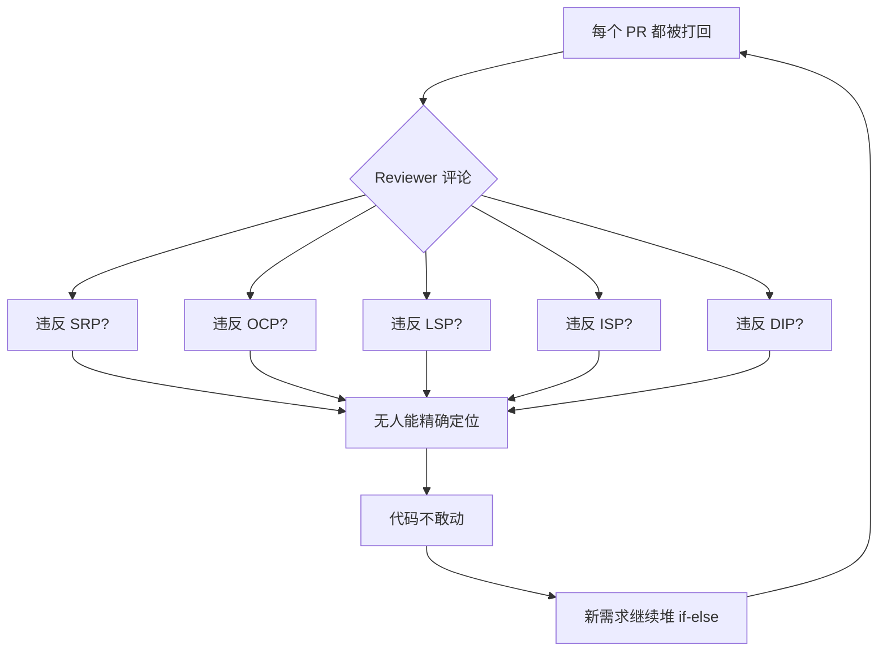

> 真正的麻烦不在「该不该遵守 SOLID」，而在「**面对一段烂代码，工程师能否 30 秒内说清违反了哪一条**」。本篇要解决的就是这个**精确诊断能力**。

### 0.2 五次反转排查

我们把当时 700 行的代码逐步剥洋葱，看「真正的根因」是什么：

- **反转 1：以为是 SRP**——把发消息、落库各拆出去后，**核心 `risk()` 仍然 400 行**，问题没解决。SRP 不是答案。
- **反转 2：以为是 OCP**——但产品反馈未来**不会**新增风控渠道（业务已稳定 2 年），扩展点是空中楼阁。OCP 也不是。
- **反转 3：以为是 LSP**——查代码：根本没有继承体系，全是平铺过程式调用。LSP 不适用。
- **反转 4：以为是 ISP**——但调用方就一个 `OrderService`，没有「胖接口受害者」。ISP 也不是。
- **反转 5：真正的根因是 DIP 缺失**——`RiskCheckProcessor` 直接 `new MysqlConnection`、`new HttpClient`、`new KafkaProducer`。一切实现细节都钉死在这个类里，于是任何「拆」都拆不动——动一个分支就要动数据库、动消息、动 HTTP，**没有哪条原则能"先"被遵守**，因为底下没有抽象层托住。

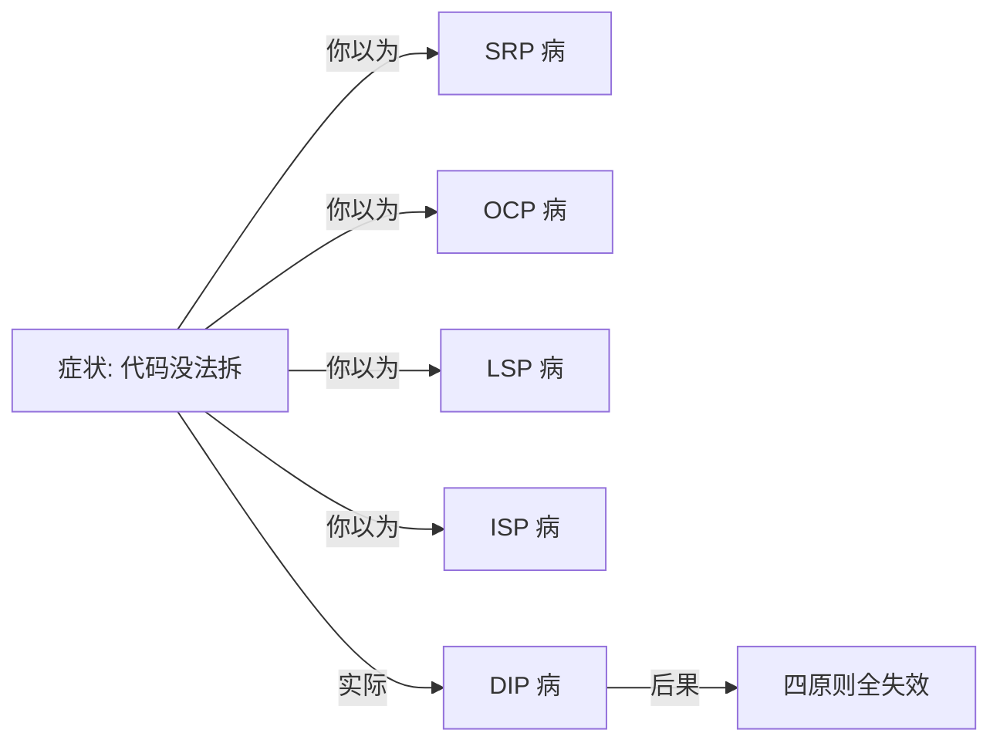

**这个故事的真正寓意**：SOLID 五条原则**不是平行罗列**，它们之间有**承载关系**。**DIP 是地基**，没有 DIP，其他四条都建在沙上——这是上一篇 06 §10 「认知跃迁」的工程印证。

### 0.3 灵魂五连问

```
Q1 ── SOLID 究竟解决什么问题?为什么不直接说"写好代码"?
       └─→ §06.1 五原则是熵增的对抗
Q2 ── 五条原则有先后吗?
       └─→ §06.1 因果关系图
Q3 ── 它们之间是否有冲突?
       └─→ §01.4 / §04.4 / §05.4 三处冲突现场
Q4 ── 何时该"刻意不遵守"SOLID?
       └─→ §02.4 / §05.4 反 OCP / 反 DIP 的合理边界
Q5 ── 为什么 99% 工程师只在面试时讨论 SOLID?
       └─→ §07 综合实战——把 SOLID 装回到肌肉记忆
```

---

## 01.SRP真相揭秘

### 1.1 一个职责的边界

教科书定义：「一个类应当只有一个引起它变化的原因」。但「**一个原因**」到底是几个原因？看这段代码：

```java
public class Invoice {
    public BigDecimal computeTotal()    { ... }   // 计算总金额
    public BigDecimal computeTax()      { ... }   // 计算税
    public void       sendToCustomer()  { ... }   // 发邮件
    public void       saveToDb()        { ... }   // 入库
    public String     toJson()          { ... }   // 序列化
}
```

直觉上——「不行，5 个职责」。但**这是错的诊断**。SRP 真正问的是「**变化的方向**」：

| 方法 | 谁会请求修改它? |
|---|---|
| `computeTotal()` | 业务/财务 |
| `computeTax()` | 业务/财务（税法） |
| `sendToCustomer()` | 运营/邮件模板组 |
| `saveToDb()` | DBA/架构组 |
| `toJson()` | API 网关/对接方 |

**5 个方法 = 5 个不同的 stakeholder**——这才是 SRP 真正违反的地方。Robert Martin 在《Clean Architecture》里换了说法：

> **一个模块应当只对一个 actor 负责。**

「actor」是一群有共同变更动机的人。**职责的边界 = 变更动机的边界**。

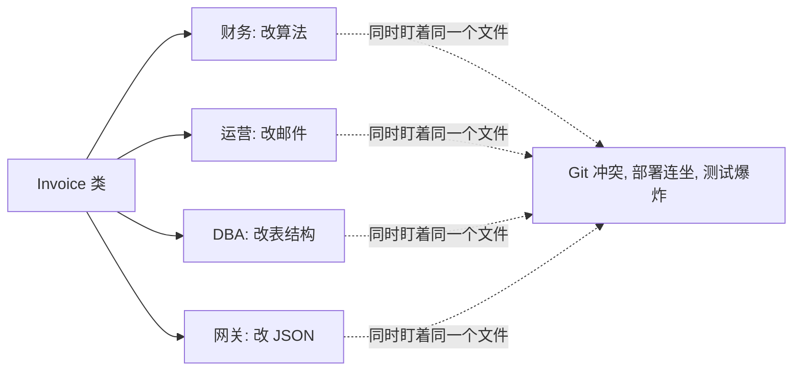

### 1.2 滥用现场扫描

下面三段代码，**先自己判断**：违反 SRP 吗？

**【A 段】**
```java
public class OrderValidator {
    public ValidationResult check(Order order) {
        if (order.amount().compareTo(BigDecimal.ZERO) <= 0) return Invalid("amount");
        if (order.items().isEmpty())                       return Invalid("items");
        if (order.user() == null)                          return Invalid("user");
        return Valid();
    }
}
```
表面有 3 个 if，**实际上只有 1 个 actor——业务规则方**。**不违反**。

**【B 段】**
```java
public class UserService {
    public User register(...)      { ... }
    public User login(...)         { ... }
    public Avatar uploadAvatar(...) { ... } // 含图片裁剪、CDN 上传、缩略图生成
}
```
看起来都是「用户操作」。**实际**：`uploadAvatar` 改动频率属于「图片处理团队」，与「身份团队」是两个 actor。**违反**。

**【C 段】**
```java
public class ReportService {
    public Report build(Date d)    { ... }   // SQL 聚合 + 业务规则
    public void   email(Report r)  { ... }   // 模板渲染 + SMTP
    public void   archive(Report r){ ... }   // 写到 S3
}
```
三个动词分别属于：**报表统计团队、运营团队、运维团队**。三个 actor，**严重违反**。

> 自我诊断的关键问句：「**如果同一份代码被三个不同的 actor 同时要求改，他们会不会打架?**」如果会，就违反 SRP。

### 1.3 重构前后对比

把 C 段重构：

```java
// 第 1 步：按 actor 拆类
public class ReportBuilder  { public Report build(Date d) { ... } }
public class ReportMailer   { public void email(Report r)  { ... } }
public class ReportArchiver { public void archive(Report r){ ... } }

// 第 2 步：在更上层用「门面」组装(Facade)
public class ReportFacade {
    public ReportFacade(ReportBuilder b, ReportMailer m, ReportArchiver a) { ... }
    public void runDailyReport(Date d) {
        var r = builder.build(d);
        mailer.email(r);
        archiver.archive(r);
    }
}
```

> 关键变化：**Git 冲突域物理隔离**——三个 actor 现在各自维护自己的文件，**改动互不打扰**，又能在 Facade 协作。这是 SRP 最直接的工程红利。

### 1.4 误用反模式

但 SRP 也有**滥用症**——「贫血神族」：

```java
// 反面教材：拆得太碎
class OrderId        { String value; }
class OrderAmount    { BigDecimal value; }
class OrderItemList  { List<Item> items; }
class OrderUser      { User user; }
class OrderState     { Status state; }
class Order          { OrderId id; OrderAmount amt; OrderItemList items; OrderUser user; OrderState state; }
```

每个类只包一个字段，没有任何行为。**SRP 是手段不是目的**。判断标准：拆出来的类**是否有自己的 invariant（不变量）需要守护**？如果没有，就退回去。

> **SRP 的极端是 Anemic（贫血），过度遵守反而违背了 OOP 的本意。**SRP 要回答的不是「字段拆不拆」，而是「**变更动机是否同构**」。

---

## 02.OCP扩展真意

### 2.1 修改与扩展之分

OCP 的两个动词「**对扩展开放、对修改关闭**」最容易被误读。看 git diff：

**「修改」型变更**：
```diff
- if (channel.equals("alipay")) { return alipay(); }
+ if (channel.equals("alipay")) { return alipay(); }
+ if (channel.equals("wechat")) { return wechat(); }
```
原来的代码被**改动了一行以上**，引发回归测试。

**「扩展」型变更**：
```diff
+ @Component class WechatPay implements PayMethod { ... }
```
原代码**一行不动**，只是新增了一个类。Spring 在装配时自动把它纳入。

> OCP 真正的标准：**「面对新需求，原有的代码是否需要打开 IDE 的现有文件?」如果不需要，就达到了 OCP**。

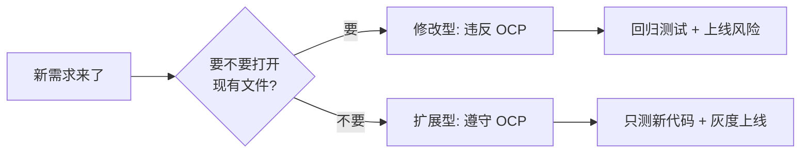

### 2.2 真实演化案例

某支付系统从 1 种支付演化到 7 种的真实路径——下面是 4 次大版本各自的 commit diff 行数：

| 版本 | 新增渠道 | 修改文件数 | OCP 状态 |
|---|---|---|---|
| v1.0 | 支付宝 | 创建文件 | 起点 |
| v2.0 | + 微信 | **改动 1 个核心文件**，加 `else if` | ❌ 违反 |
| v2.1 | 重构：抽 `PayMethod` 接口 | 改动 1 个核心文件（最后一次） | 转折点 |
| v3.0 | + 银联 | **新增 1 个文件** | ✅ 遵守 |
| v4.0 | + Apple Pay | **新增 1 个文件** | ✅ 遵守 |
| v5.0 | + PayPal、Stripe、银行卡 | 新增 3 个文件 | ✅ 遵守 |

**v2.1 是关键转折点**。它本身是一次 SRP/OCP 双违反的**回头修复**——但回头一次以后，后续 5 个迭代再没有动过核心文件。

**重构成本**：1 人 3 天。**节省成本**：5 次迭代 × 3 天测试回归 = 15 天。**ROI = 5 倍**。

### 2.3 扩展点设计

OCP 不是「**所有地方都要预留扩展点**」，而是「**在该开的地方开**」。怎么判断？

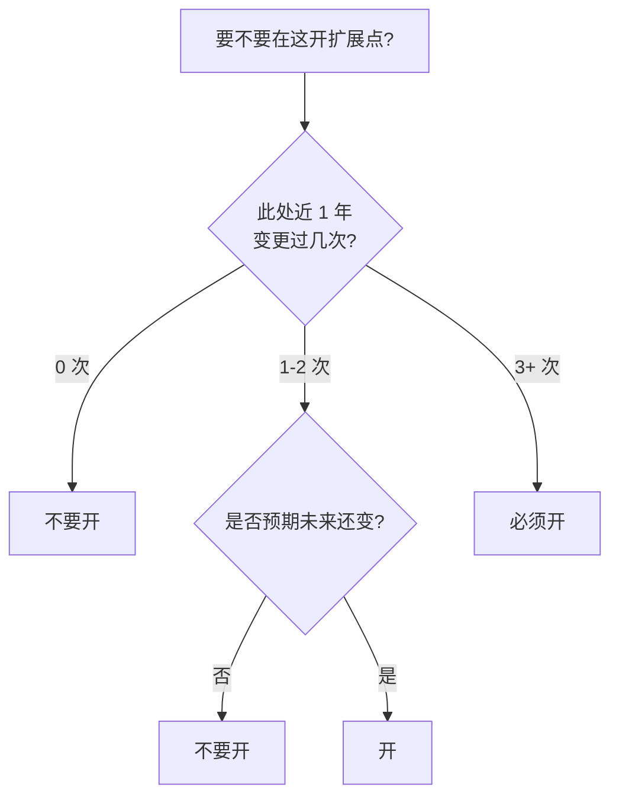

**三个真实信号**：

1. **过去信号**：git log 里此处改动 ≥ 3 次。
2. **现在信号**：PM/产品文档明确说「未来还要接 X」。
3. **未来信号**：该处对接的是**外部第三方**（外部就是变化源）。

满足任一，就值得开。否则就是「YAGNI 反模式」——见 §2.4。

### 2.4 过度设计陷阱

最常见的「过度 OCP」长这样：

```java
public interface UsernameValidator { boolean valid(String s); }
@Component class DefaultUsernameValidator implements UsernameValidator { ... }
@Component class UserRegisterService {
    @Autowired UsernameValidator validator;   // 永远只有一个实现
}
```

**问题**：`UsernameValidator` 接口三年来只有一个实现。这个接口**没有保护任何变化**，只增加了：
- 阅读成本（多跳一层 IDE）
- 测试成本（mock 设置）
- 包结构复杂度

> **YAGNI（You Aren't Gonna Need It）**：在没有「过去/现在/未来」三个信号之一时，**预留扩展点 = 浪费**。

OCP 要遵守，但**只在该遵守的地方**。这正是 §0.3 Q4 的答案：**何时刻意不遵守? ——答：在没有变化源的地方**。

---

## 03.LSP契约深挖

### 3.1 子类型规则

Barbara Liskov 1987 年原话很数学：

> 若 S 是 T 的子类型，则 T 类型对象在程序中能被替换为 S 类型对象，且不影响程序的正确性。

**「正确性」**才是关键。子类型能不能用作父类型，**不是看编译器**（编译器只看签名），**是看行为契约**。

```java
abstract class Bird { abstract void fly(); }
class Sparrow extends Bird { void fly() { ... } }
class Penguin extends Bird { void fly() { throw new Unsupported(); } } // ← 违反 LSP
```

`Penguin` 编译能过，但运行时会爆炸。LSP 防的就是这种「**编译期通过、运行期违约**」。

### 3.2 矩形正方形悖论

最著名的 LSP 反例：

```java
class Rectangle { int w, h; void setW(int w) { this.w = w; } void setH(int h) { this.h = h; } }
class Square extends Rectangle {
    @Override void setW(int w) { super.setW(w); super.setH(w); }
    @Override void setH(int h) { super.setH(h); super.setW(h); }
}
```

逻辑上「正方形是矩形」，但调用方写：

```java
void resize(Rectangle r) {
    r.setW(5); r.setH(10);
    assert r.area() == 50;   // ← Square 实例会让 area = 100
}
```

**LSP 失败的数学根源**：
- 矩形的**契约**：`setW(w); setH(h)` 后，`width=w 且 height=h`。
- 正方形的**重写**：破坏了「`setW` 不改 `height`」这条**后置条件**。

> **LSP 不是讲类型层级的"是不是"，是讲行为契约的"能不能替换"。**

### 3.3 契约前后置

LSP 的三条机械可校验规则（来自 Bertrand Meyer 的「契约式编程」）：

| 契约部分 | 子类规则 |
|---|---|
| **前置条件**（Precondition） | 不能加强（接受输入要更宽松） |
| **后置条件**（Postcondition） | 不能削弱（保证输出要更严格） |
| **不变量**（Invariant） | 不能破坏（必须维持） |

```java
class Account {
    /** 前置: amount > 0 ; 后置: balance 增加 amount */
    public void deposit(BigDecimal amount) { ... }
}
class FrozenAccount extends Account {
    @Override public void deposit(BigDecimal amt) {
        // 加强前置条件: "且账户必须不冻结"
        // ← 违反 LSP! 调用方不知道还要查 frozen 状态
    }
}
```

修复办法：把「frozen」**升格为前置条件**写在父类里，或者干脆不让 `FrozenAccount` 继承 `Account`——而用**组合**：「`Account` 有一个 `state` 字段」。

### 3.4 真实事故复盘

某分布式 KV 存储有 `Storage` 接口：

```java
interface Storage {
    /** 后置: get(k) 返回最近一次 put(k, v) 的 v */
    void put(String k, byte[] v);
    byte[] get(String k);
}
class MemoryStorage   implements Storage { ... }   // 强一致
class RedisStorage    implements Storage { ... }   // 主从异步, 可能读到旧值
```

调用方写：

```java
storage.put("session:" + sid, sessionData);
// 100ms 后另一个请求
byte[] data = storage.get("session:" + sid);   // RedisStorage 偶尔读到 null!
```

**RedisStorage 削弱了后置条件**（最终一致而非强一致）。事故表现：用户登录后偶尔被踢出。**修复办法不是改 Redis**，而是把接口契约重写为：

```java
interface Storage {
    /** 后置: 在最终一致的窗口期(<= 1s)内, get(k) 返回最近一次 put(k, v) 的 v */
    ...
}
```

**契约写宽**，让所有实现都能满足。**调用方就被强制按"最终一致"的假设写代码**——再也不会踩这个坑。

> LSP 治理事故的方法论：**契约要写在最弱的实现能满足的水位上**。

---

## 04.ISP接口隔离

### 4.1 胖接口的成本

```java
interface UserService {
    User get(String id);
    User register(...);
    void changePassword(...);
    void uploadAvatar(...);
    void exportData(...);     // GDPR 需求
    void deleteAccount(...);  // GDPR 需求
    void grantAdminRole(...); // 后台管理
    ... 47 个方法 ...
}
```

调用方有：
- `LoginController`：只用 `get` + `register` + `changePassword`
- `AvatarController`：只用 `uploadAvatar`
- `AdminController`：只用 `grantAdminRole`

但他们**全员依赖 `UserService` 整个接口**。后果：

| 问题 | 解释 |
|---|---|
| Mock 编写难 | 测试 LoginController 要 mock 47 个方法 |
| 重编译扩散 | 加一个 GDPR 方法，所有 Controller 重新编译 |
| 代码搜索噪声 | 改 `uploadAvatar`，IDE 报「47 处引用」, 实际只有 1 处真用 |

### 4.2 拆分的判据

**ISP 的金科玉律**：**按调用方的实际依赖差异**拆，不按方法多寡拆。

```java
interface UserAuth     { User get(...); User register(...); void changePassword(...); }
interface UserProfile  { void uploadAvatar(...); }
interface UserGdpr     { void exportData(...); void deleteAccount(...); }
interface UserAdmin    { void grantAdminRole(...); }

class UserServiceImpl implements UserAuth, UserProfile, UserGdpr, UserAdmin { ... }
```

**实现类**仍然是一个（避免 §4.4 的拆过头），但**对调用方暴露的视图**按照「角色」分割。

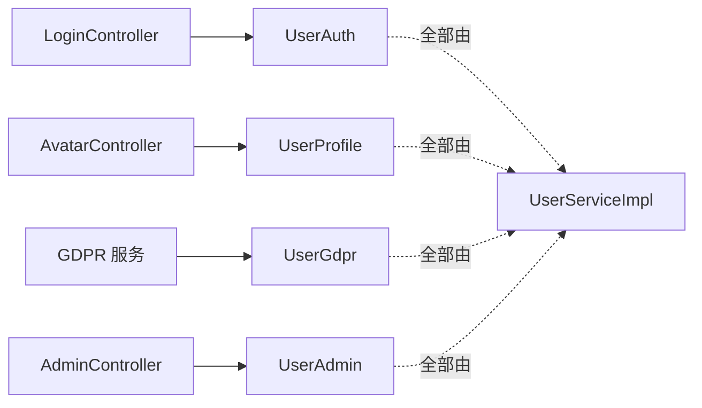

### 4.3 与SRP差异

很多人混淆 SRP 与 ISP。区别：

| 维度 | SRP | ISP |
|---|---|---|
| 看的东西 | **类**的职责 | **接口**的客户端视图 |
| 边界依据 | actor 分组 | caller 用法分组 |
| 拆分对象 | 类拆成多个类 | 接口拆成多个接口（实现可以仍是一个） |
| 检验问题 | "几个 actor 想改这个类?" | "几种 caller 看这个接口的不同子集?" |

> **SRP 是「写代码的人」视角，ISP 是「用代码的人」视角。同一个类可以 SRP 通过、ISP 失败——比如 `UserServiceImpl` 只服务一个 actor（用户中心团队），但暴露 47 个方法给 4 类 caller**。

### 4.4 拆过头的代价

```java
// 反面教材：1 个方法 1 个接口
interface CanRegister { User register(...); }
interface CanLogin    { User login(...); }
interface CanLogout   { void logout(...); }
interface CanChangePwd{ void changePassword(...); }
... 47 个 ...
```

每个 Controller 要 `@Autowired` 5+ 个接口，构造方法变成 100 行。**拆得太散，Caller 要重新组装这些「功能微粒」**——实际上又把胖接口的复杂度**转嫁给了 Caller**。

判据：**拆到「一个 caller 用一个接口」就停**。再细分就是过度。

---

## 05.DIP依赖倒置

### 5.1 倒置的方向

最直观的解释：

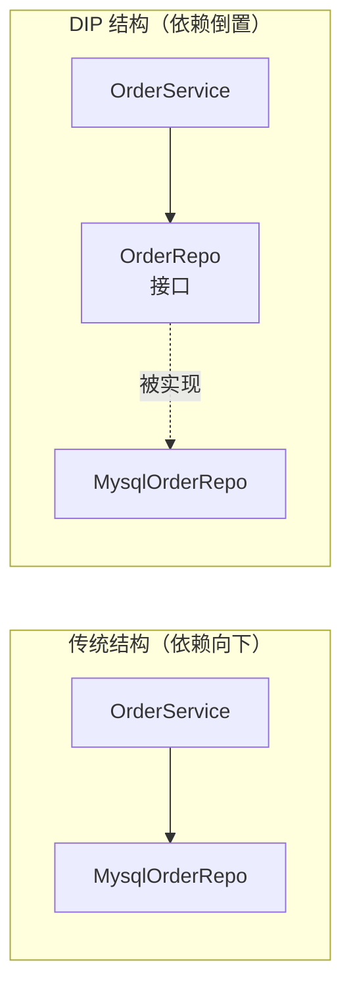

「倒置」二字的精髓：**接口的所有权属于高层（OrderService 所在的 domain 包），实现属于低层（infra 包）**。物理上：

- 接口文件路径：`com.mall.domain.OrderRepo`
- 实现文件路径：`com.mall.infra.MysqlOrderRepo`

**包依赖箭头从 infra → domain**——而不是反过来。这就是「倒置」一词的字面意义。

### 5.2 IoC容器原理

DIP 在静态层只是约定，**运行时**还需要一个「装配者」把接口和实现连起来。这就是 IoC 容器。Spring 的最简化原理：

```java
public class MiniContainer {
    Map<Class<?>, Object> beans = new HashMap<>();

    public void register(Class<?> iface, Object impl) { beans.put(iface, impl); }

    public <T> T resolve(Class<T> iface) { return (T) beans.get(iface); }

    public <T> T autowire(Class<T> clazz) {
        Constructor<?> ctor = clazz.getDeclaredConstructors()[0];
        Object[] args = Arrays.stream(ctor.getParameterTypes())
                              .map(this::resolve).toArray();
        return (T) ctor.newInstance(args);
    }
}
// 装配
container.register(OrderRepo.class, new MysqlOrderRepo(dataSource));
OrderService svc = container.autowire(OrderServiceImpl.class);   // 接口依赖被自动注入
```

20 行代码就把 Spring 核心机制讲完了。Spring 多出来的是**生命周期管理、AOP、scope 控制、循环依赖检测**——但 DIP 装配本质就这么简单。

### 5.3 字节码织入

DIP 还有更隐蔽的实现路径：**AOP 代理**。Spring 给 `OrderService` 加 `@Transactional` 时不是修改源码，而是用 CGLIB 在**类加载时**生成子类：

```
原 class:        OrderService
加载后实际跑的:  OrderService$$EnhancerByCGLIB$$abc123
                ↓ 子类的 placeOrder 长这样
                public Order placeOrder(...) {
                    txManager.begin();
                    try { result = super.placeOrder(...); txManager.commit(); }
                    catch (Throwable t) { txManager.rollback(); throw t; }
                    return result;
                }
```

这是「**反向控制（IoC）**」的字节码层物理表达——你以为自己在调 `OrderService`，运行时调的是它的代理。这种**控制权的反转**就是 DIP 在动态层的体现。

### 5.4 何时不要倒置

DIP 也有反例：

| 场景 | 是否需要 DIP | 原因 |
|---|---|---|
| 业务层依赖 ORM/HTTP/Cache | ✅ 必须 | 这些是「外部不稳定边界」 |
| 工具类依赖 `String/Math/Collections` | ❌ 不需要 | 标准库稳定，倒置只会增加复杂度 |
| 算法库依赖数据结构 | ❌ 不需要 | 内聚高、性能敏感、抽象增加间接层开销 |
| Controller 依赖 Service | ✅ 倾向需要 | Service 实现可能切换（比如本地/远程） |
| Service 内部的 helper 方法 | ❌ 不需要 | 同包内聚力，不抽象不影响测试 |

**判据**：「这层依赖**未来可能换吗?**」+「**是否影响可测试性?**」。两个都说「不」，就别 DIP——不必为没有变化的稳定依赖加抽象层。

---

## 06.SOLID关系图

### 6.1 五原则相互依赖

回到 §0.2 的真相：SOLID 不是平行五条，而是有承载关系：

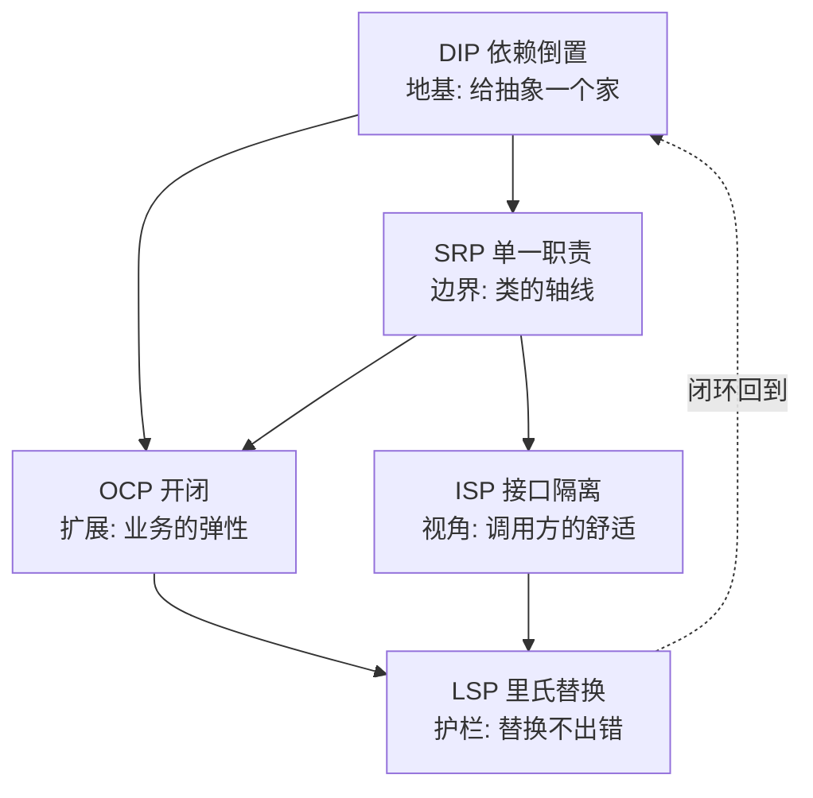

- **DIP 是地基**：没有抽象层，其他四条无处生根（开篇 §0.2 排查结论）。
- **SRP 是骨架**：定义类的边界。SRP 不立，OCP 谈何「扩展点」。
- **OCP 是肌肉**：让系统在业务变化下能伸展。
- **ISP 是皮肤**：让 caller 看到的视图舒服。
- **LSP 是免疫系统**：替换不破坏，OCP 才安全（不然「扩展点」就是地雷）。

> **五原则互为因果，不能孤立讨论。这就是 §0.3 Q1/Q2 的回答**。

### 6.2 与设计模式的映射

23 种 GoF 设计模式可以按「主治哪条 SOLID」归类（取代表性几个）：

| 模式 | 主治 SOLID | 病灶举例 |
|---|---|---|
| 策略模式 | OCP | 算法分支膨胀 |
| 模板方法 | OCP + LSP | 流程相同细节不同 |
| 装饰器 | OCP + ISP | 切面加在调用链上 |
| 适配器 | DIP | 老接口对接不上新需求 |
| 工厂方法 | DIP | new 钉死了类型 |
| 桥接 | DIP + OCP | 抽象与实现独立变化 |
| 观察者 | OCP + DIP | 变化源 → 多消费者 |
| 命令 | SRP + OCP | 把动词封装为对象 |
| 责任链 | OCP | 顺序处理可插拔 |
| 访问者 | OCP（双分派） | 数据结构稳定，操作变化 |

> **设计模式不是 23 个独立招式，而是 SOLID 在不同场景的"模板解"**。

---

## 07.综合案例实战

> 主线接力——06 篇我们用 SOLID 武装了 `OrderManager`，现在压力测试：**接入第三方风控**。

### 7.1 风控接入需求

PM 给的需求：

```
1. 选 5 家供应商之一: 同盾/邦盛/猛犸/百融/腾讯天御
2. 所有供应商接口都不同,但功能相似
3. 风控失败要写日志、发告警、阻断订单
4. 不同业务线(商城/票务/二手)有不同的风控阈值
5. POC 完成后会选定 1-2 家长期合作,但允许"双跑"
6. 每周可能调整阈值规则
```

### 7.2 不用SOLID翻车

工程师 A 第一版：

```java
public class RiskCheckService {
    public RiskResult check(Order order) {
        // 阶段 1: 业务线判别
        if ("MALL".equals(order.bizLine())) {
            // 阶段 2: 调风控供应商
            String body = httpClient.post("https://tongdun.com/api/v1/check",
                                          buildTongdunBody(order));
            // 阶段 3: 解析、判定
            JsonNode resp = json.read(body);
            if (resp.get("score").asInt() > 80) {
                logger.error("风控拦截: " + order);
                kafkaProducer.send("risk-alert", order.toString());
                return RiskResult.BLOCKED;
            }
        } else if ("TICKET".equals(order.bizLine())) {
            // 票务用邦盛 + 阈值不同
            ...
        } else if ("RESALE".equals(order.bizLine())) {
            ...
        }
        ...
    }
}
```

3 周后，需求方说「**双跑**——同盾和邦盛同时调，对比结果」。这一句话需要：
- **改 14 处** if 分支
- 把 HTTP 调用全部 `try-catch` 加重试
- 发邮件给两家供应商对账

工程师当场崩溃。**5 条 SOLID 全员违反**：

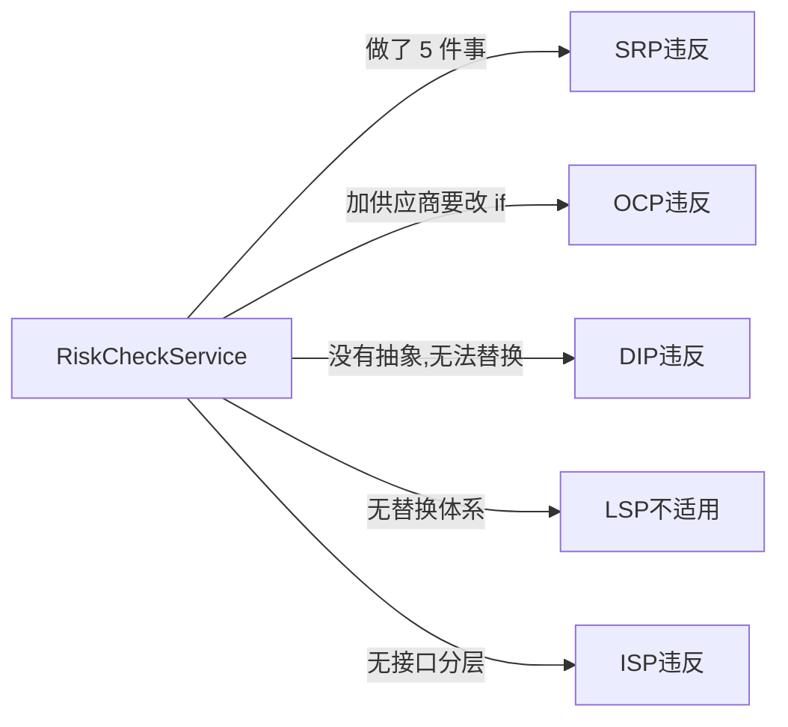

### 7.3 SOLID演化版

**第 1 步·DIP 打地基**（必须先做，§0.2 教训）：

```java
public interface RiskProvider {
    RiskScore evaluate(RiskRequest req);
}
public class TongdunProvider  implements RiskProvider { ... }
public class BangshengProvider implements RiskProvider { ... }
```

**第 2 步·SRP 划职责**：

```java
public class RiskCheckService {
    public RiskCheckService(RiskProviderRouter router,
                            RiskDecisionEngine decider,
                            RiskAuditor auditor,
                            RiskAlertPublisher alerter) { ... }

    public RiskResult check(Order order) {
        RiskScore score = router.choose(order).evaluate(toRequest(order));
        Decision  d     = decider.decide(order, score);
        auditor.audit(order, score, d);
        if (d.blocked()) alerter.alert(order, score);
        return d.toResult();
    }
}
```

5 件事 → 4 个协作者 + 1 个编排器。

**第 3 步·OCP 开扩展点**（针对「双跑」需求）：

```java
public interface RiskProviderRouter {
    RiskProvider choose(Order order);     // 单跑
    List<RiskProvider> chooseAll(Order order);  // 双跑
}
public class WeightedRouter         implements RiskProviderRouter { ... }
public class DualRunRouter          implements RiskProviderRouter { ... }
public class BizLineSpecificRouter  implements RiskProviderRouter { ... }
```

**新加策略 = 新加一个 Router 类**，原代码一行不动。

**第 4 步·LSP 守契约**：

`RiskProvider.evaluate` 的契约必须是「**纯函数 + 幂等**」，新加的 `BaironProvider` 如果偷偷做了缓存写库，就是 LSP 违反——必须重写文档。**契约文档不是装饰，是法律**。

**第 5 步·ISP 拆视角**：

```java
// 给 Controller 看到的接口
public interface RiskCheckApi {
    RiskResult check(Order order);
}
// 给运维看到的接口
public interface RiskOps {
    void hotReloadRules();
    Map<String, Long> stats();
}
// 给 BI 看到的接口
public interface RiskAuditQuery {
    List<RiskAudit> queryByOrder(OrderId id);
}
// 一个实现实现三个接口,但三类调用方互不知情
public class RiskCheckServiceImpl implements RiskCheckApi, RiskOps, RiskAuditQuery { ... }
```

**双跑需求最终落地**：只新增 `DualRunRouter` 一个文件 + 一行 Bean 注册。**5 条 SOLID 的复利效应**。

### 7.4 类图与时序

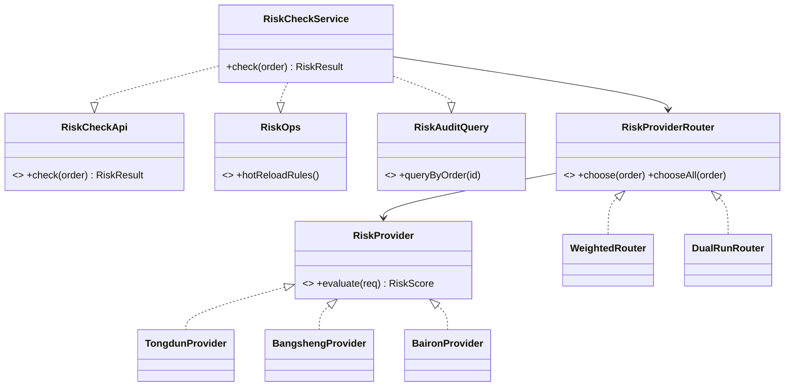

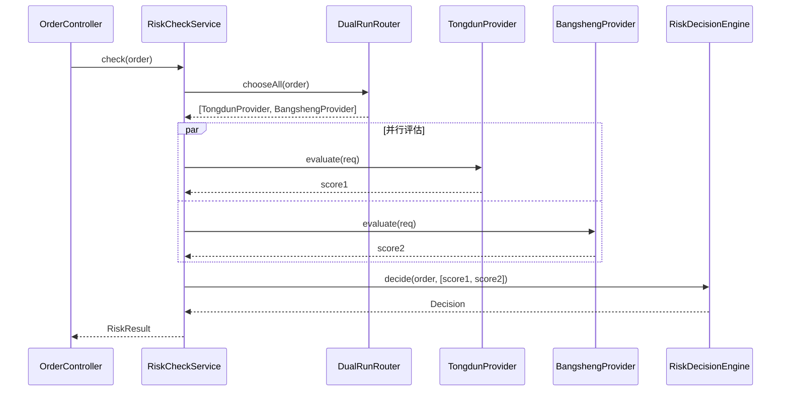

### 7.5 留下三道思考题

> 答案在第 08 篇开头揭晓。

- **🟢 易**：§7.3 第 5 步把同一个 `RiskCheckServiceImpl` 实现了 3 个接口。**有人会说这违反 SRP**——你怎么反驳？提示：actor 与 caller 的分别，§4.3。
- **🟡 中**：`DualRunRouter.chooseAll()` 返回 `List<RiskProvider>`，但**两家供应商的延时差 200ms**。`RiskCheckService.check` 是同步等所有结果，还是只等更快的那个？这两种语义会导致什么不同的问题？提示：与第 11 篇 DDD 的「最终一致」相关。
- **🔴 难**：风控规则每周调整。如果用「**配置中心 + DSL 表达式**」让运营自己配，不再编译——你**会绕过 OCP**（因为运营每周确实要"修改"规则配置）。这种「配置即代码」算违反 OCP 吗？SOLID 在「**应用代码**」与「**配置/数据**」之间的边界在哪？提示：这道题就是第 08 篇「过度设计 vs 不足设计」要回答的核心矛盾。

---

## 08.总结与下一篇

**一句话总结 SOLID**：

> **SOLID 不是写好代码的"五条规则"，而是面对烂代码时"五种诊断工具"**——SRP 看 actor、ISP 看 caller、OCP 看 diff、LSP 看契约、DIP 看抽象层归属。

与第 06 篇的关系——

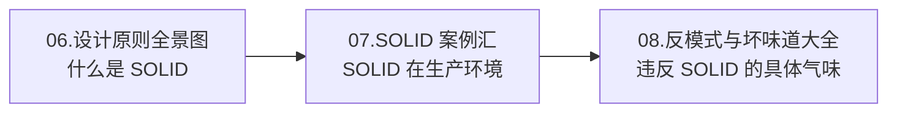

06 篇告诉你「**好代码的样子**」，本篇告诉你「**坏代码到底坏在哪条**」。但**精确诊断**还有上层——**先得有"嗅觉"**。光知道五条原则，还不够。在线上 Code Review 里，你需要在 3 秒内闻出「这段代码不对劲」，然后才轮到 SOLID 来确诊。

下一篇 [08.反模式与坏味道](./08.反模式与坏味道)——把 30+ 种代码坏味道映射到 SOLID，让你的"代码嗅觉"成为肌肉记忆。本篇 §7.5 的三道思考题答案，也将在下一篇开头揭晓。

下一篇 [08.反模式与坏味道](./08.反模式与坏味道)
