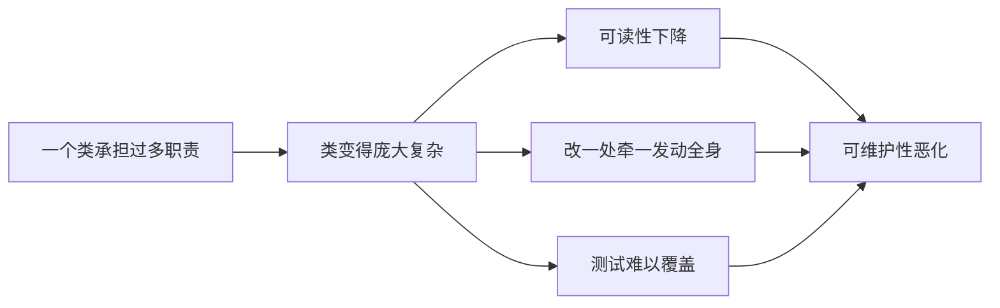
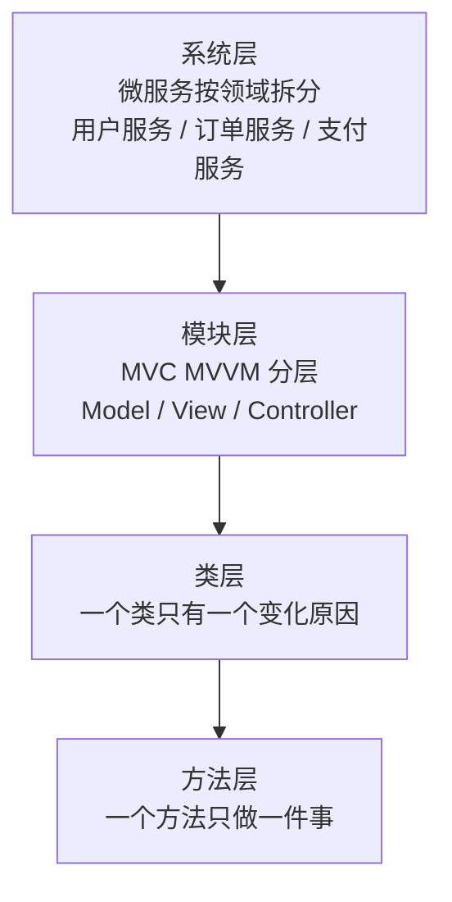

# 02.单一职责原则详解

#### 目录介绍
- [1.工作中的一个真实案例](#1工作中的一个真实案例)
- [2.问题思考分析](#2问题思考分析)
- [3.单一职责原则介绍](#3单一职责原则介绍)
- [4.如何理解"单一"](#4如何理解单一)
- [5.为何要遵守 SRP](#5为何要遵守-srp)
- [6.方法层面的单一职责](#6方法层面的单一职责)
- [7.接口层面的单一职责](#7接口层面的单一职责)
- [8.类层面的单一职责](#8类层面的单一职责)
- [9.判断职责单一的模糊地带](#9判断职责单一的模糊地带)
- [10.判断 SRP 的五条信号](#10判断-srp-的五条信号)
- [11.SRP 的本质：内聚与变化原因](#11srp-的本质内聚与变化原因)
- [12.SRP 的四个层次](#12srp-的四个层次)
- [13.回到开篇的详情页案例](#13回到开篇的详情页案例)
- [14.本篇收获](#14本篇收获)
- [15.思考题](#15思考题)
- [16.课后作业](#16课后作业)


## 1.工作中的一个真实案例

做终端开发几乎都会遇到这样一类"详情页"：

> 初版的"商品详情页" / "文章详情页" / "动态详情页"只有一个 `DetailController`（或 `DetailViewModel` / `DetailPresenter`）。
> 随着业务迭代，它陆续承担了：接口请求、字段转换、本地缓存读写、埋点上报、分享文案拼装、评论区分页、收藏按钮状态维护、悬浮广告轮播……
> 半年后，这一个类膨胀到 **2000 多行**。改一个"埋点字段"也要打开这个类滚半天鼠标才找到位置；两个人同时改这个文件 100% 会冲突；新同学第一次看到它的第一反应是"我怎么可能读懂它"。

这不是某个端的问题，是"**一个类承担了太多会独立变化的职责**"带来的必然结果。本篇要解决的就是它——**单一职责原则（SRP）**：怎么识别"职责过多"？怎么拆到"刚刚好"？拆到什么程度就停？读完本篇再回看这个 2000 行的详情页，你会清晰地知道它应该被拆成哪几块、每一块的边界在哪。


## 2.问题思考分析

1. 如何理解"类的单一职责"？"单一"是如何评判的？
2. 看懂了，但实际开发中怎么用？能否举例说明 SRP 的优势？
3. 是不是职责拆得越细越好？为什么？
4. SRP 除了应用在类的设计上，还能延伸到哪些层面？


## 3.单一职责原则介绍

单一职责原则（Single Responsibility Principle，SRP）是面向对象设计中的核心原则。英文定义：

> A class or module should have a single responsibility.

翻译过来：**一个类或者模块只负责完成一个职责（或者功能）**。

看起来简单，但"看懂"和"会用"是两回事，"用好"更是难上加难。很多同事因为对这条原则理解得不够透彻，在使用时过于教条，把原则当真理，生搬硬套，适得其反。


## 4.如何理解"单一"

SRP 描述的对象有两个：**类**（class）和**模块**（module）。

- 一种理解：模块是比类更抽象的概念，类也可以看作模块；
- 另一种理解：模块是比类更粗粒度的代码块，一个模块包含多个类。

不管哪种理解，SRP 应用到这两个对象时道理相通。下文主要从"类"的角度展开，"模块"可自行引申。

**一句话 SRP**：如果一个类包含两个或以上**业务不相干**的功能，就说它"职责不够单一"，应该拆成多个粒度更细、功能更单一的类。


## 5.为何要遵守 SRP



拆分到"职责单一"带来的直接好处：

1. **提高类的可维护性和可读性**：职责少了，复杂度降低，代码自然好读。
2. **提高系统的可维护性**：每个类可维护性高，整个系统的可维护性自然高。
3. **降低变更风险**：职责越多，变更概率越大，变更带来的风险也越大。


## 6.方法层面的单一职责

需求：修改用户名或密码。

**方式 1：把两件事塞进一个方法**

```java
public enum OperateEnum { UPDATE_USERNAME, UPDATE_PASSWORD }

public class UserOperateImpl {
    public void updateUserInfo(OperateEnum type, UserInfo info) {
        if (type == OperateEnum.UPDATE_USERNAME) {
            // 修改用户名
        } else if (type == OperateEnum.UPDATE_PASSWORD) {
            // 修改密码
        }
    }
}
```

**方式 2：拆成两个方法**

```java
public class UserOperateImpl {
    public void updateUserName(UserInfo info)     { /* 修改用户名 */ }
    public void updateUserPassword(UserInfo info) { /* 修改密码   */ }
}
```

对比：方式 1 把"修改用户名"和"修改密码"耦合在同一个方法里，调用方传错类型就会出 Bug；方式 2 两件事各司其职，调用意图也更清晰。**方式 2 才符合 SRP**——这是方法层面的体现。


## 7.接口层面的单一职责

场景：张三扫地，李四买菜。

**方式 1：一个大接口揽下所有家务**

```java
public interface HouseWork {
    void sweepFloor();
    void shopping();
}

public class Zhangsan implements HouseWork {
    public void sweepFloor() { /* 扫地 */ }
    public void shopping()   { /* 张三被迫实现一个空方法 */ }
}

public class Lisi implements HouseWork {
    public void sweepFloor() { /* 李四被迫实现一个空方法 */ }
    public void shopping()   { /* 买菜 */ }
}
```

问题：张三明明不买菜也要实现 `shopping()`；李四要新增"做饭"就得改接口，张三跟着受波及——**修改一处影响了其他不需要修改的地方**。

**方式 2：按角色拆成多个小接口**

```java
public interface HouseWork {}

public interface SweepFloor extends HouseWork { void sweepFloor(); }
public interface Shopping   extends HouseWork { void shopping();   }
public interface Cooking    extends HouseWork { void cooking();    }

public class Zhangsan implements SweepFloor {
    public void sweepFloor() { /* 张三扫地 */ }
}

public class Lisi implements Shopping, Cooking {
    public void shopping() { /* 李四买菜 */ }
    public void cooking()  { /* 李四做饭 */ }
}
```

新增"做饭"只影响李四，张三毫无感知。**这就是接口层面的 SRP**，也是下一篇 ISP（接口隔离）的雏形。


## 8.类层面的单一职责

类层面的拆分没有接口那么"一刀清晰"，往往要结合业务判断。举个"登录注册"的例子：

**方案 1：集中一个类**

```java
public interface UserOperate {
    void login(UserInfo info);
    void register(UserInfo info);
    void logout(UserInfo info);
}

public class UserOperateImpl implements UserOperate {
    public void login(UserInfo i)    { /* 登录 */ }
    public void register(UserInfo i) { /* 注册 */ }
    public void logout(UserInfo i)   { /* 登出 */ }
}
```

**方案 2：按动作拆类**

```java
public interface Login    { void login(UserInfo i);    }
public interface Register { void register(UserInfo i); }
public interface Logout   { void logout(UserInfo i);   }

public class LoginImpl    implements Login    { public void login(UserInfo i)    { /* ... */ } }
public class RegisterImpl implements Register { public void register(UserInfo i) { /* ... */ } }
public class LogoutImpl   implements Logout   { public void logout(UserInfo i)   { /* ... */ } }
```

谁更好？**没有绝对答案**——看业务。如果登录/注册/登出以后会各自独立演化（加验证码、加风控、加第三方登录…… 只影响其中一个），方案 2 更好；如果一直只是"轻量的三个方法"，方案 1 反而更简洁。

**类层面的 SRP 是相对的，靠业务判断；接口层面的 SRP 是绝对的，角色不同必须拆。**


## 9.判断职责单一的模糊地带

看一个更贴近实际的例子。社交产品中用 `UserInfo` 记录用户信息：

```java
public class UserInfo {
    private long userId;
    private String username;
    private String email;
    private String telephone;
    private long createTime;
    private long lastLoginTime;
    private String avatarUrl;
    private String provinceOfAddress;   // 省
    private String cityOfAddress;       // 市
    private String regionOfAddress;     // 区
    private String detailedAddress;     // 详细地址
    // ...
}
```

`UserInfo` 满足 SRP 吗？有两种观点：

1. 所有属性都隶属"用户"这一个业务模型，满足 SRP；
2. 地址信息占比不小，应当拆成独立的 `UserAddress`，两个类职责更单一。

**哪种对？离开业务场景没有答案**。

- 如果地址只是展示用，`UserInfo` 现在的设计就是合理的；
- 如果产品后来加入了电商模块，地址会参与物流，那就该拆成 `UserAddress`。

**同一个类，在不同场景、不同阶段的需求背景下，是否满足 SRP 的结论可能不同**。


## 10.判断 SRP 的五条信号

既然 SRP 本身比较主观，可以借助下面 5 条**侧面信号**来辅助判断——命中越多，越值得拆：

1. 类中的**代码行数、函数或属性过多**，影响可读性与可维护性；
2. 类**依赖的其他类过多**，或者**被依赖的其他类过多**，不符合高内聚低耦合；
3. **私有方法过多**，考虑抽成新类让其他地方也能复用；
4. **难以给类起一个合适的名字**——只能用 `Manager`、`Context`、`Helper` 这种笼统词，说明职责定义不清晰；
5. **大量方法集中操作某几个属性**——这几个属性和对应方法本身就是一个"小类"，应该拆出来。


## 11.SRP 的本质：内聚与变化原因

### 11.1 内聚度：SRP 追求的是"功能内聚"


| 内聚类型 | 描述 | 是否满足 SRP |
|---|---|---|
| 偶然内聚 | 模块内元素毫无关系 | 严重违反 |
| 逻辑内聚 | 执行逻辑上相似的功能（"处理所有输入"） | 通常违反 |
| 时间内聚 | 因在同一时间执行而聚合（"初始化模块"） | 可能违反 |
| 功能内聚 | 所有元素共同完成**一个且仅一个**功能 | **满足** |

### 11.2 "变化原因"的精确含义

Robert C. Martin 对 SRP 的精确定义是：

> A class should have only one reason to change.

这里的"reason to change"指的是**不同的利益相关者（stakeholder）或角色（actor）**。

```java
// ❌ 违反：三个角色驱动同一个类的变化
class Employee {
    double calcPay()    { /* CFO  财务部驱动 */ return 0; }
    int    reportHrs()  { /* COO  运营部驱动 */ return 0; }
    void   save()       { /* CTO  技术部驱动 */ }
}
```

```java
// ✅ 拆成三个类，每个类只被一个角色驱动
class PayCalculator { double calcPay(Employee e)    { return 0; } } // CFO
class HourReporter  { int    reportHrs(Employee e)  { return 0; } } // COO
class EmployeeRepo  { void   save(Employee e)       { }          } // CTO
```

**关键洞察**：不是看"功能数量"，而是看"**变化来源数量**"。如果一个类只有一个角色会要求它改变，那即使它有多个方法，也可能满足 SRP。


## 12.SRP 的四个层次



### 12.1 判断拆分粒度的三个准则

1. **变化频率**：两个功能总是一起变 → 放一起；独立变 → 拆开；
2. **复用需求**：某段逻辑其他地方要用 → 拆出来；
3. **团队边界**：不同团队负责不同功能 → 按团队边界拆分。

### 12.2 避免"类爆炸"

```
❌ 过度拆分
UserNameValidator / UserEmailValidator / UserPasswordValidator
UserNameFormatter / UserEmailNormalizer / ...  20 个小类

✅ 合理粒度
UserValidator    验证职责
UserFormatter    格式化职责
UserRepository   持久化职责
```

SRP 不是"能拆就拆"，而是"**同一角色驱动的放一起，不同角色驱动的拆开**"。


## 13.回到开篇的详情页案例

开篇那个 2000 行的详情页，用本篇的几条判断挨个过一遍：

| 原先塞进一个类 | 实际驱动它变化的"角色" | 该不该拆 |
|---|---|---|
| 接口请求 + 字段转换 | 后端接口变 | 拆成 `DetailRepository` |
| 本地缓存读写 | 产品要求"二次进入秒开" | 拆成 `DetailCache`（或合并进 Repository） |
| 埋点上报 | 数据团队要加/改字段 | 拆成 `DetailTracker` |
| 分享文案拼装 | 运营改分享话术 | 拆成 `ShareContentBuilder` |
| UI 状态（收藏 / 悬浮广告） | 交互改版 | 留在 `DetailController`，这是它本来的职责 |

拆完后 `DetailController` 只剩下"协调上面几位朋友 + 把结果扔给 UI"，行数从 2000 缩到 300。两人同时改不再冲突；新同学也能 30 分钟读完；改埋点只进 `Tracker`、改缓存只进 `Repository`，影响面清晰可控。

**这就是 SRP 的实用价值：不是让你"拆得多"，而是让你"每一次改动只碰一个类"**。


## 14.本篇收获

1. **一个精确定义**：SRP 不是"一个类只做一件事"，而是"**一个类只被一个角色驱动变化**"。
2. **四个层次的落地**：方法层 → 接口层 → 类层 → 模块/服务层，粒度逐级上升。
3. **五个实用信号**：代码行数/属性过多、依赖或被依赖过多、私有方法过多、难以起名、方法集中操作某几个属性——命中其一就考虑拆。
4. **一个反向约束**：**不是越细越好**。"类爆炸"让调用链变长、可读性反而下降——变化频率相同的东西应当在一起。


## 15.思考题

1. **识别题**：`UserInfo` 里同时有 `username / email / 省市区 / 发货人姓名 / 发货人手机`。在"只做展示"的社交 App 里它满足 SRP 吗？在"加了电商模块"的 App 里呢？同一个类在不同上下文里，职责单一性会变吗？
2. **辨析题**：SRP 和"函数要短"是一回事吗？一个 500 行但只被一个角色驱动的类，违反 SRP 吗？一个 30 行但被三个角色驱动的类呢？
3. **权衡题**：有人主张"凡是能拆的都要拆"，结果项目里出现了 `UserNameValidator`、`UserEmailValidator`、`UserPhoneValidator`…… 20 个 Validator。这是 SRP 的胜利还是失败？如何定一个"拆到此为止"的判据？


## 16.课后作业

在你当前项目里挑**一个你最怕打开的类**（行数最多、或最容易冲突的那个）：

1. **列角色**：列出近 3 个月里，有哪些"人或团队"提过让它变化的需求（产品、后端、数据、运营、安全……）。每一个都是一个"角色"。
2. **画拆分方案**：把当前的方法、属性按角色分组画一张表。每组未来拆成一个新类，给出新类名——**名字起不出来就说明职责还不单一**。
3. **拆一刀**：只挑其中**职责耦合最严重的一对**做一次最小拆分（例如把"埋点上报"从主类抽到 `Tracker`，其余暂时不动）。跑一遍回归，确认外部行为不变。

做完，带着"剩下那 80% 没拆的部分"进入下一篇《03.开闭原则详细介绍》——你会发现"拆开"只是第一步，"让它拥抱未来的变化"才是第二步。


