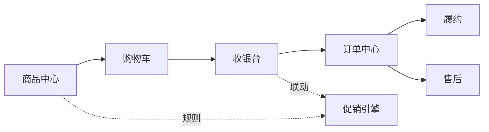
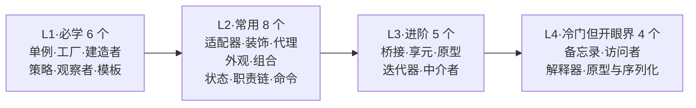
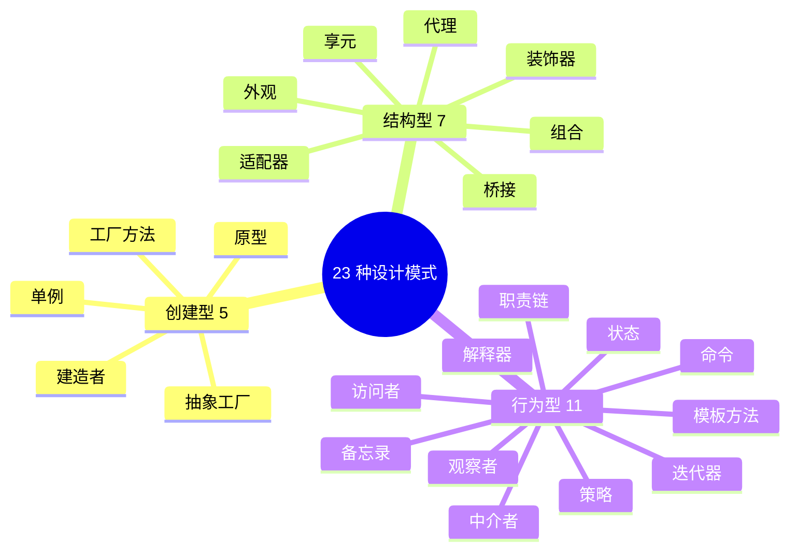

# 23种设计模式概括

#### 目录介绍

- [00.本专栏的特色](#00本专栏的特色)
- [01.主线案例：一个电商系统](#01主线案例一个电商系统)
- [02.阅读路径推荐](#02阅读路径推荐)
- [03.23 模式速查地图](#0323-模式速查地图)
- [04.创建型模式](#04创建型模式)
- [05.结构型模式](#05结构型模式)
- [06.行为型模式](#06行为型模式)

---

## 00.本专栏的特色

市面上的设计模式文章绝大多数是"**模式定义 → UML 图 → 通用例子 → 优缺点**"——读完一篇篇都懂，合上书还是不知道在自己的项目里到底什么时候用、和别的模式怎么配。

本专栏不同的地方有四点：

1. **一条主线、贯穿 23 篇**：所有模式都用同一个**电商系统**作为引子，模式之间不再各自孤立；
2. **每篇先讲"它解决什么问题（一句话）"**，再讲它"在电商主线里扮演谁"，避免上来就堆 UML；
3. **每篇都有"模式联动"章节**：明确指出它和已学模式的关系（替代/互补/组合），把零散的 23 个模式连成网；
4. **每篇配 Mermaid 图与决策树**：选型的"什么时候用 / 什么时候不用"被显式画出来，而不是埋在文字里。

---

## 01.主线案例：一个电商系统

我们假设要做这样一个电商系统，所有模式都从中找到自己的位置：

| 子域 | 主要痛点 | 主要登场的模式 |
|------|----------|----------------|
| 商品中心 | 大量相似对象、复杂构造 | 单例、工厂、建造者、原型、**享元** |
| 购物车/收银台 | 多组件高频联动 | **中介者**、观察者、命令 |
| 订单中心 | 状态机、多步前置/后置动作 | **状态**、**职责链**、**命令**、**备忘录** |
| 履约/售后 | 多种 SKU 的多种操作 | **访问者**、组合、迭代器 |
| 促销引擎 | 规则频繁变化、可配置 | 策略、模板、**解释器** |
| 跨切面 | 适配三方接口、加日志/限流/缓存 | 适配器、代理、装饰器、外观、桥接 |

**加粗** 的是本轮新增的 8 篇文章，配合原有 16 篇构成完整 23 模式专栏。

---

## 02.阅读路径推荐

- **3 天速通**：只看 L1，能看懂大部分开源代码；
- **2 周入门**：L1+L2，覆盖 80% 项目场景；
- **1 个月精通**：23 篇全跑一遍，结合主线案例自己写一个 demo。

---

## 03.23 模式速查地图

每篇文末都有**"模式联动"小节**，展示该模式与同组/跨组模式的关系——这才是把零散模式连成"工程能力"的关键。

---

## 设计模式汇总

完整的 23 种设计模式按意图分为三大类：**创建型 5、结构型 7、行为型 11**。下面依次展开：每一类先讲它是什么、解决什么问题，再逐个列出子模式的一句话定位。

## 04.创建型模式
### 4.1 是什么
创建型模式对类的实例化过程进行了抽象，将对象的创建与对象的使用分离，让系统在创建什么(What)、由谁创建(Who)、何时创建(When)三个维度上都获得灵活性。

### 4.2 包含模式
* 简单工厂模式（Simple Factory）
* 工厂方法模式（Factory Method）
* 抽象工厂模式（Abstract Factory）
* 建造者模式（Builder）
* 原型模式（Prototype）
* 单例模式（Singleton）

常见的有：单例模式、工厂模式、建造者模式。

### 4.3 解决什么问题
主要解决对象的创建问题：封装复杂的创建过程，解耦对象的创建代码和使用代码。

### 4.4 各模式简介
#### 4.4.1 单例模式
- 单例模式用来创建全局唯一的对象。
    - 一个类只允许创建一个对象（或者叫实例），那这个类就是一个单例类，这种设计模式就叫作单例模式。
    - 单例有几种经典的实现方式，它们分别是：饿汉式、懒汉式、双重检测、静态内部类、枚举。
- 有些人认为单例是一种反模式（anti-pattern），并不推荐使用，主要的理由有以下几点：
    - 单例对 OOP 特性的支持不友好
    - 单例会隐藏类之间的依赖关系
    - 单例对代码的扩展性不友好
    - 单例对代码的可测试性不友好
    - 单例不支持有参数的构造函数

#### 4.4.2 工厂模式
- 工厂模式用来创建不同但是相关类型的对象（继承同一父类或者接口的一组子类），由给定的参数来决定创建哪种类型的对象。
    - 如果创建对象的逻辑并不复杂，那我们直接通过 new 来创建对象就可以了，不需要使用工厂模式。当创建逻辑比较复杂，是一个“大工程”的时候，就考虑使用工厂模式，封装对象的创建过程。
- 当每个对象的创建逻辑都比较简单的时候，推荐使用简单工厂模式。当每个对象的创建逻辑都比较复杂的时候，推荐使用工厂方法模式。
- 工厂模式的作用有下面 4 个：
    - **封装变化**：创建逻辑有可能变化，封装成工厂类之后，创建逻辑的变更对调用者透明。
    - **代码复用**：创建代码抽离到独立的工厂类之后可以复用。
    - **隔离复杂性**：封装复杂的创建逻辑，调用者无需了解如何创建对象。
    - **控制复杂度**：将创建代码抽离出来，让原本的函数或类职责更单一。

#### 4.4.3 建造者模式
- 建造者模式用来创建复杂对象，可以通过设置不同的可选参数，“定制化”地创建不同的对象。重点是掌握应用场景，避免过度使用。
- 出现以下任何一种情况，就考虑使用建造者模式：
    - 必填属性多，构造函数参数列表过长；
    - 属性之间有依赖关系或约束条件需要一次性校验；
    - 需要创建“不可变对象”，对象创建后不能再修改内部属性值。

#### 4.4.4 原型模式
如果对象的创建成本比较大，而同一个类的不同对象之间差别不大（大部分字段都相同），就可以利用对已有对象（原型）进行复制（拷贝）的方式来创建新对象，以达到节省创建时间的目的。

## 05.结构型模式
### 5.1 是什么
结构型模式描述如何**将类或者对象结合在一起形成更大的结构**，就像搭积木，可以通过简单积木的组合形成复杂的、功能更为强大的结构。

### 5.2 包含模式
* 适配器模式（Adapter）
* 桥接模式（Bridge）
* 组合模式（Composite）
* 装饰模式（Decorator）
* 外观模式（Facade）
* 享元模式（Flyweight）
* 代理模式（Proxy）

常见的有：组合模式、代理模式。

### 5.3 解决什么问题
总结了一些类或对象组合在一起的经典结构，这些经典的结构可以解决特定应用场景的问题。

### 5.4 各模式简介
#### 5.4.1 代理模式
- 代理模式在不改变原始类接口的条件下，为原始类定义一个代理类，主要目的是**控制访问**，而非加强功能——这是它跟装饰器模式最大的不同。
- 静态代理需要针对每个类都创建一个代理类，重复代码多。动态代理在运行期动态创建原始类对应的代理类，能解决这个问题。
- 代理模式常用在业务系统的非功能性需求：监控、统计、鉴权、限流、事务、幂等、日志。除此之外，还可用在 RPC、缓存等场景。

#### 5.4.2 桥接模式
- 桥接模式代码实现简单，但理解起来有难度，应用场景也比较局限，实际项目中不那么常用，只需简单了解、见到能认识即可。
- 有两种理解方式：“将抽象与实现解耦，让它们能独立开发”，等同于“组合优于继承”设计原则。后一种更通用。

#### 5.4.3 装饰器模式
- 装饰器模式主要解决继承关系过于复杂的问题，通过组合来替代继承，给原始类添加增强功能。这也是判断是否该用装饰器模式的一个重要依据。
- 装饰器模式可以对原始类嵌套使用多个装饰器，为了满足这样的需求，在设计的时候，装饰器类需要跟原始类继承相同的抽象类或者接口。

#### 5.4.4 适配器模式
- 代理模式、装饰器模式提供的都是跟原始类相同的接口，而适配器提供跟原始类不同的接口。它将不兼容的接口转换为可兼容的接口，让原本不能一起工作的类可以一起工作。
- 适配器模式是一种**事后的补救策略**，用来补救设计上的缺陷。实际开发中出现接口不兼容的场景总结为五种：封装有缺陷的接口、设计统一多个类的接口、设计替换依赖的外部系统、兼容老版本接口、适配不同格式的数据。

#### 5.4.5 组合模式
- 组合模式主要用来处理**树形结构数据**。正因为应用场景的特殊性，数据必须能表示成树形结构，实际项目中不那么常用。但一旦数据满足树形结构，应用这种模式能让代码变得非常简洁。
- 组合模式将一组对象组织成树形结构，将单个对象和组合对象都看作树中的节点，以统一处理逻辑。

#### 5.4.6 享元模式
- “享元”顾名思义就是被**共享的单元**。享元模式的意图是复用对象、节省内存，前提是享元对象是不可变对象。
- 当系统中存在大量重复对象时，将对象设计成享元，在内存中只保留一份实例，供多处代码引用。也可以将相似对象中相同的部分（字段），提取出来设计成享元。

#### 5.4.7 外观模式
- 外观模式为多个复杂的子系统提供一个一致的入口，调用方不需要了解背后多个子系统。
- 应用场景：接口联调、包装下发、减少调用方与众多子模块的耦合。

## 06.行为型模式
### 6.1 是什么
行为型模式是对不同对象之间**划分责任和算法**的抽象化，不仅仅关注类和对象的结构，而且重点关注它们之间的**相互作用**。

### 6.2 包含模式
* 职责链模式（Chain of Responsibility）
* 命令模式（Command）
* 解释器模式（Interpreter）
* 迭代器模式（Iterator）
* 中介者模式（Mediator）
* 备忘录模式（Memento）
* 观察者模式（Observer）
* 状态模式（State）
* 策略模式（Strategy）
* 模板方法模式（Template Method）
* 访问者模式（Visitor）

### 6.3 解决什么问题
主要解决的是“类或对象之间的交互”问题。

### 6.4 各模式简介
#### 6.4.1 观察者模式
- 观察者模式将观察者和被观察者代码解耦。
    - 应用场景非常广泛，小到代码解耦，大到架构解耦、产品设计（邮件订阅、RSS Feeds）本质上都是观察者模式。
- 不同实现方式：同步阻塞/异步非阻塞；进程内/跨进程。同步阻塞主要用于代码解耦；异步非阻塞还能提高执行效率；跨进程一般基于消息队列。
- EventBus（事件总线）提供了实现观察者模式的骨架代码，可以基于此框架快速实现观察者模式。

#### 6.4.2 模板方法模式
- 什么是模板模式
    - 模板方法模式在一个方法中定义一个算法骨架，并将某些步骤推迟到子类中实现。模板方法模式可以让子类在不改变算法整体结构的情况下，重新定义算法中的某些步骤。这里的“算法”，我们可以理解为广义上的“业务逻辑”，并不特指数据结构和算法中的“算法”。这里的算法骨架就是“模板”，包含算法骨架的方法就是“模板方法”，这也是模板方法模式名字的由来。
- 复用和扩展
    - 模板模式有两大作用：复用和扩展。其中复用指的是，所有的子类可以复用父类中提供的模板方法的代码。扩展指的是，框架通过模板模式提供功能扩展点，让框架用户可以在不修改框架源码的情况下，基于扩展点定制化框架的功能。
- 回调
    - 除此之外，我们还讲到回调。它跟模板模式具有相同的作用：代码复用和扩展。在一些框架、类库、组件等的设计中经常会用到，比如JdbcTemplate就是用了回调。
    - 相对于普通的函数调用，回调是一种双向调用关系。A类事先注册某个函数F到B类，A类在调用B类的P函数的时候，B类反过来调用A类注册给它的F函数。这里的F函数就是“回调函数”。A调用B，B反过来又调用A，这种调用机制就叫作“回调”。
- 同步和异步
    - 回调可以细分为同步回调和异步回调。从应用场景上来看，同步回调看起来更像模板模式，异步回调看起来更像观察者模式。回调跟模板模式的区别，更多的是在代码实现上，而非应用场景上。回调基于组合关系来实现，模板模式基于继承关系来实现。回调比模板模式更加灵活。

#### 6.4.3 策略模式
- 什么是策略模式
    - 策略模式定义一族算法类，将每个算法分别封装起来，让它们可以互相替换。策略模式可以使算法的变化独立于使用它们的客户端（这里的客户端代指使用算法的代码）。策略模式用来解耦策略的定义、创建、使用。实际上，一个完整的策略模式就是由这三个部分组成的。
- 策略类的定义
    - 策略类的定义比较简单，包含一个策略接口和一组实现这个接口的策略类。策略的创建由工厂类来完成，封装策略创建的细节。策略模式包含一组策略可选，客户端代码选择使用哪个策略，有两种确定方法：编译时静态确定和运行时动态确定。其中，“运行时动态确定”才是策略模式最典型的应用场景。
- 常用应用场景
    - 在实际的项目开发中，策略模式也比较常用。最常见的应用场景是，利用它来避免冗长的if-else或switch分支判断。不过，它的作用还不止如此。它也可以像模板模式那样，提供框架的扩展点等等。实际上，策略模式主要的作用还是解耦策略的定义、创建和使用，控制代码的复杂度，让每个部分都不至于过于复杂、代码量过多。除此之外，对于复杂代码来说，策略模式还能让其满足开闭原则，添加新策略的时候，最小化、集中化代码改动，减少引入bug的风险。

#### 6.4.4 职责链模式
- 什么是职责链模式
    - 在职责链模式中，多个处理器依次处理同一个请求。一个请求先经过A处理器处理，然后再把请求传递给B处理器，B处理器处理完后再传递给C处理器，以此类推，形成一个链条。链条上的每个处理器各自承担各自的处理职责，所以叫作职责链模式。
- 定义
    - 在GoF的定义中，一旦某个处理器能处理这个请求，就不会继续将请求传递给后续的处理器了。当然，在实际的开发中，也存在对这个模式的变体，那就是请求不会中途终止传递，而是会被所有的处理器都处理一遍。
- 场景
    - 职责链模式常用在框架开发中，用来实现过滤器、拦截器功能，让框架的使用者在不需要修改框架源码的情况下，添加新的过滤、拦截功能。这也体现了之前讲到的对扩展开放、对修改关闭的设计原则。

#### 6.4.5 迭代器模式
- 什么是迭代器模式
    - 迭代器模式也叫游标模式，它用来遍历集合对象。这里说的“集合对象”，我们也可以叫“容器”“聚合对象”，实际上就是包含一组对象的对象，比如，数组、链表、树、图、跳表。迭代器模式主要作用是解耦容器代码和遍历代码。大部分编程语言都提供了现成的迭代器可以使用，我们不需要从零开始开发。
- 三种方式
    - 遍历集合一般有三种方式：for循环、foreach循环、迭代器遍历。后两种本质上属于一种，都可以看作迭代器遍历。相对于for循环遍历，利用迭代器来遍历有3个优势：
- 为何需要迭代器
    - 迭代器模式封装集合内部的复杂数据结构，开发者不需要了解如何遍历，直接使用容器提供的迭代器即可；
    - 迭代器模式将集合对象的遍历操作从集合类中拆分出来，放到迭代器类中，让两者的职责更加单一；
    - 迭代器模式让添加新的遍历算法更加容易，更符合开闭原则。除此之外，因为迭代器都实现自相同的接口，在开发中，基于接口而非实现编程，替换迭代器也变得更加容易。
    - 在通过迭代器来遍历集合元素的同时，增加或者删除集合中的元素，有可能会导致某个元素被重复遍历或遍历不到。针对这个问题，有两种比较干脆利索的解决方案，来避免出现这种不可预期的运行结果。一种是遍历的时候不允许增删元素，另一种是增删元素之后让遍历报错。第一种解决方案比较难实现，因为很难确定迭代器使用结束的时间点。第二种解决方案更加合理，Java语言就是采用的这种解决方案。增删元素之后，我们选择fail-fast解决方式，让遍历操作直接抛出运行时异常。

#### 6.4.6 状态模式
- 什么是状态模式
    - 状态模式一般用来实现状态机，而状态机常用在游戏、工作流引擎等系统开发中。状态机又叫有限状态机，它由3个部分组成：状态、事件、动作。其中，事件也称为转移条件。事件触发状态的转移及动作的执行。不过，动作不是必须的，也可能只转移状态，不执行任何动作。
- 三种实现方式
    - 第一种实现方式叫分支逻辑法。利用if-else或者switch-case分支逻辑，参照状态转移图，将每一个状态转移原模原样地直译成代码。对于简单的状态机来说，这种实现方式最简单、最直接，是首选。
    - 第二种实现方式叫查表法。对于状态很多、状态转移比较复杂的状态机来说，查表法比较合适。通过二维数组来表示状态转移图，能极大地提高代码的可读性和可维护性。
    - 第三种实现方式就是利用状态模式。对于状态并不多、状态转移也比较简单，但事件触发执行的动作包含的业务逻辑可能比较复杂的状态机来说，我们首选这种实现方式。

#### 6.4.7 访问者模式
- 什么是访问者模式
    - 访问者模式允许一个或者多个操作应用到一组对象上，设计意图是解耦操作和对象本身，保持类职责单一、满足开闭原则以及应对代码的复杂性。
- 代码实现
    - 对于访问者模式，学习的主要难点在代码实现。而代码实现比较复杂的主要原因是，函数重载在大部分面向对象编程语言中是静态绑定的。也就是说，调用类的哪个重载函数，是在编译期间，由参数的声明类型决定的，而非运行时，根据参数的实际类型决定的。除此之外，我们还讲到Double Disptach。如果某种语言支持Double Dispatch，那就不需要访问者模式了。
    - 正是因为代码实现难理解，所以，在项目中应用这种模式，会导致代码的可读性比较差。如果你的同事不了解这种设计模式，可能就会读不懂、维护不了你写的代码。所以，除非不得已，不要使用这种模式。

#### 6.4.8 备忘录模式
- 什么叫备忘录模式
    - 备忘录模式也叫快照模式，具体来说，就是在不违背封装原则的前提下，捕获一个对象的内部状态，并在该对象之外保存这个状态，以便之后恢复对象为先前的状态。这个模式的定义表达了两部分内容：一部分是，存储副本以便后期恢复；另一部分是，要在不违背封装原则的前提下，进行对象的备份和恢复。
- 场景
    - 备忘录模式的应用场景也比较明确和有限，主要用来防丢失、撤销、恢复等。它跟平时我们常说的“备份”很相似。两者的主要区别在于，备忘录模式更侧重于代码的设计和实现，备份更侧重架构设计或产品设计。
    - 对于大对象的备份来说，备份占用的存储空间会比较大，备份和恢复的耗时会比较长。针对这个问题，不同的业务场景有不同的处理方式。比如，只备份必要的恢复信息，结合最新的数据来恢复；再比如，全量备份和增量备份相结合，低频全量备份，高频增量备份，两者结合来做恢复。

#### 6.4.9 命令模式
- 什么是命令模式
    - 落实到编码实现，命令模式用到最核心的实现手段，就是将函数封装成对象。我们知道，在大部分编程语言中，函数是没法作为参数传递给其他函数的，也没法赋值给变量。借助命令模式，我们将函数封装成对象，这样就可以实现把函数像对象一样使用。
- 场景
    - 命令模式的主要作用和应用场景，是用来控制命令的执行，比如，异步、延迟、排队执行命令、撤销重做命令、存储命令、给命令记录日志等，这才是命令模式能发挥独一无二作用的地方。

#### 6.4.10 解释器模式
- 什么是解释器模式
    - 解释器模式为某个语言定义它的语法（或者叫文法）表示，并定义一个解释器用来处理这个语法。实际上，这里的“语言”不仅仅指我们平时说的中、英、日、法等各种语言。从广义上来讲，只要是能承载信息的载体，我们都可以称之为“语言”，比如，古代的结绳记事、盲文、哑语、摩斯密码等。
    - 要想了解“语言”要表达的信息，我们就必须定义相应的语法规则。这样，书写者就可以根据语法规则来书写“句子”（专业点的叫法应该是“表达式”），阅读者根据语法规则来阅读“句子”，这样才能做到信息的正确传递。而我们要讲的解释器模式，其实就是用来实现根据语法规则解读“句子”的解释器。
- 场景分析
    - 解释器模式的代码实现比较灵活，没有固定的模板。我们前面说过，应用设计模式主要是应对代码的复杂性，解释器模式也不例外。它的代码实现的核心思想，就是将语法解析的工作拆分到各个小类中，以此来避免大而全的解析类。一般的做法是，将语法规则拆分一些小的独立的单元，然后对每个单元进行解析，最终合并为对整个语法规则的解析。

#### 6.4.11 中介者模式
- 什么是中介模式
    - 中介模式的设计思想跟中间层很像，通过引入中介这个中间层，将一组对象之间的交互关系（或者说依赖关系）从多对多（网状关系）转换为一对多（星状关系）。原来一个对象要跟n个对象交互，现在只需要跟一个中介对象交互，从而最小化对象之间的交互关系，降低了代码的复杂度，提高了代码的可读性和可维护性。
- 场景
    - 观察者模式和中介模式都是为了实现参与者之间的解耦，简化交互关系。两者的不同在于应用场景上。在观察者模式的应用场景中，参与者之间的交互比较有条理，一般都是单向的，一个参与者只有一个身份，要么是观察者，要么是被观察者。而在中介模式的应用场景中，参与者之间的交互关系错综复杂，既可以是消息的发送者、也可以同时是消息的接收者。

