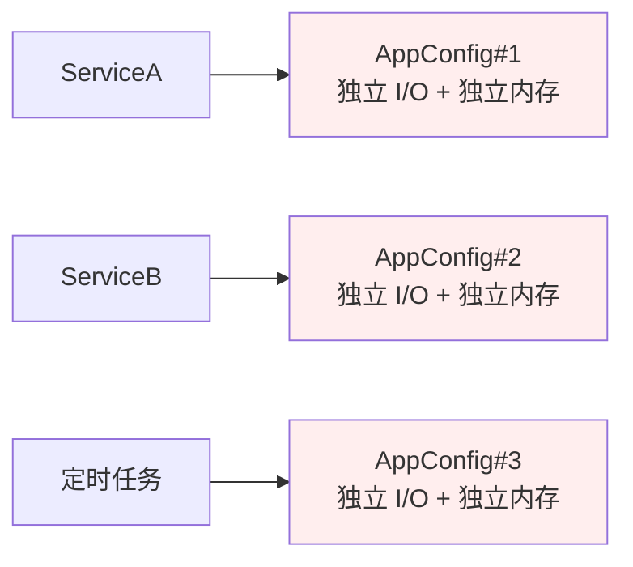
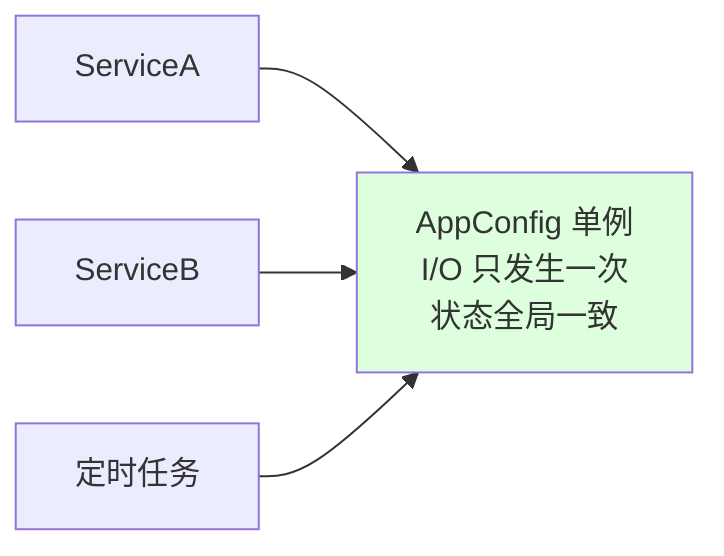
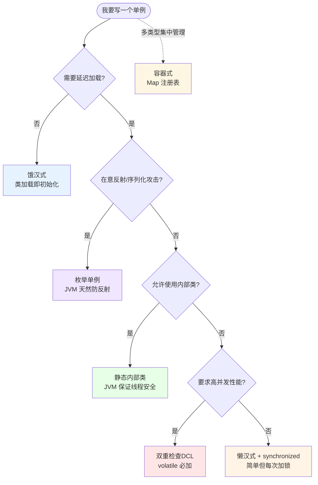
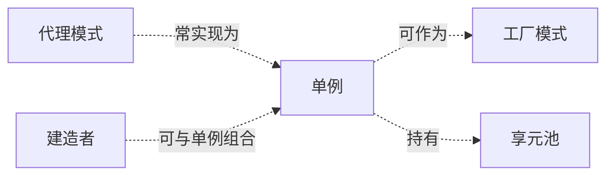

# 01.单例模式设计思想

#### 目录介绍
- [01.案例引入：从一个配置类说起](#01案例引入从一个配置类说起)
  - [1.1 痛点场景](#11-痛点场景)
  - [1.2 它哪里不舒服](#12-它哪里不舒服)
  - [1.3 引出本篇主角](#13-引出本篇主角)
- [02.单例模式基础介绍](#02单例模式基础介绍)
  - [2.1 模式的动机](#21-模式的动机)
  - [2.2 单例模式特点](#22-单例模式特点)
  - [2.3 单例模式定义](#23-单例模式定义)
  - [2.4 单例使用场景](#24-单例使用场景)
  - [2.5 单例模式思考](#25-单例模式思考)
- [03.单例模式设计思考](#03单例模式设计思考)
  - [3.1 为何要用单例](#31-为何要用单例)
  - [3.2 处理资源访问冲突](#32-处理资源访问冲突)
  - [3.3 表示全局唯一类](#33-表示全局唯一类)
- [04.如何实现单例模式](#04如何实现单例模式)
  - [4.1 如何实现一个单例](#41-如何实现一个单例)
  - [4.2 饿汉式实现方式](#42-饿汉式实现方式)
  - [4.3 懒汉式实现方式](#43-懒汉式实现方式)
  - [4.4 双重DCL校验模式](#44-双重dcl校验模式)
  - [4.5 静态内部类方式](#45-静态内部类方式)
  - [4.6 枚举方式单例](#46-枚举方式单例)
  - [4.7 容器实现单例模式](#47-容器实现单例模式)
  - [4.8 优缺点分析](#48-优缺点分析)
- [05.单例模式有那些不友好](#05单例模式有那些不友好)
  - [5.1 单例是反模式吗](#51-单例是反模式吗)
  - [5.2 单例对OOP不友好](#52-单例对oop不友好)
  - [5.3 隐藏类之间依赖](#53-隐藏类之间依赖)
  - [5.4 代码扩展性不友好](#54-代码扩展性不友好)
  - [5.5 可测试性不友好](#55-可测试性不友好)
  - [5.6 不支持有参构造函数](#56-不支持有参构造函数)
  - [5.7 有何替代解决方案](#57-有何替代解决方案)
- [06.最后总结一下](#06最后总结一下)
  - [6.1 适用环境分析](#61-适用环境分析)
  - [6.2 对单例总结下](#62-对单例总结下)


## 01.案例引入：从一个配置类说起

> **本篇主线**：日常开发中最高频的"全局配置类"

### 1.1 痛点场景：从问题发现到解决方案的探索

**探索起点**：几乎每个项目都会有一个"读配置"的工具类。让我们跟随一个新人的思考路径，看看问题是如何一步步显现的：

#### 第一步：直觉式实现
一个新人入职，第一反应往往是这样的直觉实现：

```java
public class AppConfig {
    public AppConfig() {
        // 解析配置文件，I/O 操作 + JSON 反序列化，约 50ms
        loadFromFile("/etc/app.conf");
    }
    public String get(String key) { ... }
}

// 调用方
AppConfig cfg = new AppConfig();   // ServiceA 用一次
AppConfig cfg2 = new AppConfig();  // ServiceB 又 new 一次
AppConfig cfg3 = new AppConfig();  // 拦截器、定时任务 ...
```

**💭 思考题**：这种实现看起来有什么问题？为什么会有问题？

#### 第二步：问题浮现
当系统运行一段时间后，监控系统开始报警：
- 内存占用异常升高
- 配置文件读取次数远超预期
- 配置更新后部分服务未生效

这时我们开始绘制对象关系图，问题变得清晰：



**🔍 发现问题**：每个调用方都拿到一份"自己的副本"，互不感知。

### 1.2 问题分析与探索路径

#### 第三步：深入分析问题根源
让我们通过一个探索性的问题列表来深入理解问题：

**❌ 重复 I/O 问题**
- **问题**：每 `new` 一次都重新读文件、重新解析
- **探索**：为什么配置加载后就不变？能否避免重复加载？
- **思考**：如果配置真的需要热更新，应该如何设计？

**❌ 状态分裂问题**
- **问题**：如果有人调了 `cfg.set("xxx")` 改了内存值，`cfg2` 完全不知道
- **探索**：如何保证配置状态的一致性？
- **思考**：配置对象应该是可变的还是不可变的？

**❌ 资源浪费问题**
- **问题**：底层的连接池、缓存、线程池如果也跟着多份，内存直接翻倍
- **探索**：哪些资源是真正需要共享的？
- **思考**：如何平衡资源复用和线程安全？

#### 第四步：解决方案的思考过程
**💡 启发式思考**：
1. 如果配置对象是全局唯一的，那么所有服务应该共享同一个实例
2. 我们需要一个机制来保证"创建权"的集中管理
3. 这个机制需要解决线程安全和延迟加载的问题

**🔍 设计原则的运用**：
- **单一职责原则**：配置管理应该独立出来
- **开闭原则**：配置获取方式应该对修改关闭，对扩展开放
- **依赖倒置原则**：服务应该依赖抽象，而不是具体实现

> 这类 "**对象只该有一个**、并且**全局都该看到同一个**" 的场景，正是单例模式要解决的核心问题。

### 1.3 引出本篇主角

> **单例模式（Singleton）的核心思想**：把"创建权"从调用方手里收回来，由类自己保证全进程只产出一个实例，并提供一个全局访问点。



听起来简单，但实现里藏着 6 种姿势（饿汉/懒汉/DCL/静态内部类/枚举/容器），每一种背后都是对线程安全、加载时机、反射攻击的不同权衡——这正是本篇要拆解的。

---

## 02.单例模式基础介绍
### 2.1 模式的动机
对于系统中的某些类来说，只有一个实例很重要，例如，一个系统中可以存在多个打印任务，但是只能有一个正在工作的任务；一个系统只能有一个窗口管理器或文件系统；一个系统只能有一个计时工具或ID（序号）生成器。

**如何保证一个类只有一个实例并且这个实例易于被访问呢？定义一个全局变量可以确保对象随时都可以被访问，但不能防止我们实例化多个对象**。

一个更好的解决办法是让类自身负责保存它的唯一实例。这个类可以保证没有其他实例被创建，并且它可以提供一个访问该实例的方法。这就是单例模式的模式动机。


### 2.2 单例模式特点
[单例模式](https://github.com/yangchong211/YCDesignBlog)是应用最广的模式

也是最先知道的一种设计模式，在深入了解单例模式之前，每当遇到如：getInstance（）这样的创建实例的代码时，我都会把它当做一种单例模式的实现。

**单例模式特点**

1. 构造函数不对外开放，一般为private
2. 通过一个静态方法或者枚举返回单例类对象
3. 确保单例类的对象有且只有一个，尤其是在多线程的环境下
4. 确保单例类对象在反序列化时不会重新构造对象


### 2.3 单例模式定义
保证一个类仅有一个实例，并提供一个访问它的全局访问点。

该[单例模式](https://github.com/yangchong211/YCDesignBlog)有三个基本要点：一是这个类只能有一个实例；二是它必须自行创建这个实例；三是它必须自行向整个系统提供这个实例。


### 2.3 单例使用场景
应用中某个实例对象需要频繁的被访问。

应用中每次启动只会存在一个实例。如账号系统，数据库系统。

一个具有自动编号主键的表可以有多个用户同时使用，但数据库中只能有一个地方分配下一个主键编号，否则会出现主键重复，因此该主键编号生成器必须具备唯一性，可以通过单例模式来实现。


### 2.4 思考几个问题
网上有很多讲解单例模式的文章，但大部分都侧重讲解，如何来实现一个线程安全的单例。重点还是希望搞清楚下面这样几个问题。

1. 为什么要使用单例？
2. 单例存在哪些问题？
3. 单例与静态类的区别？
4. 有何替代的解决方案？


## 03.单例模式设计思考
### 3.1 为什么要使用单例：设计思想的深度剖析

#### 设计模式背后的哲学思考
单例模式看似简单，但其背后蕴含着深刻的设计思想。让我们从三个层面来理解：

**第一层：资源管理的本质**
- **问题**：为什么有些对象需要全局唯一？
- **思考**：这涉及到资源的稀缺性和共享性
- **原理**：单例模式体现了"集中管理、全局共享"的资源管理思想

**第二层：控制权的转移**
- **传统方式**：调用方控制对象的创建和生命周期
- **单例方式**：类自身控制实例的创建和访问
- **设计思想**：这是"控制反转"（IoC）思想的早期体现

**第三层：契约与约束**
- **契约**：单例模式建立了一个"最多只有一个实例"的契约
- **约束**：通过私有构造器强制执行这个约束
- **设计原则**：体现了"约定优于配置"的设计理念

#### 单例模式的核心价值
单例设计模式（Singleton Design Pattern）不仅仅是"一个类只允许创建一个对象"的技术实现，更重要的是它解决了以下设计问题：

1. **资源访问冲突的协调者**
2. **全局唯一性的保证者**
3. **生命周期管理的集中者**

让我们通过两个实战案例来深入理解这些设计思想。


### 3.2 处理资源访问冲突
**实战案例一：处理资源访问冲突**

先来看第一个例子。在这个例子中，我们自定义实现了一个往文件中打印日志的 Logger 类。具体的代码实现如下所示：

```java
public class Logger {
    private final FileWriter writer;
    public Logger() {
        File file = new File("/Users/yangchong/log.txt");
        try {
            //true表示追加写入
            writer = new FileWriter(file, true);
        } catch (IOException e) {
            throw new RuntimeException(e);
        }
    }
    public void log(String message) {
        try {
            writer.write(message);
        } catch (IOException e) {
            throw new RuntimeException(e);
        }
    }
}

public class UserController {
    private final Logger logger = new Logger();

    public void login(String username, String password) {
        // ...省略业务逻辑代码...
        logger.log(username + " logined!");
    }
}

public class OrderController {
    private final Logger logger = new Logger();

    public void create(String order) {
        // ...省略业务逻辑代码...
        logger.log("created order: " + order);
    }
}
```

看完代码之后，先别着急看我下面的讲解，你可以先思考一下，这段代码存在什么问题。

1. 在上面的代码中，所有的日志都写入到同一个文件 /Users/yangchong/log.txt 中。在 UserController 和 OrderController 中，我们分别创建两个 Logger 对象。
2. 如果两个线程同时分别执行 login() 和 create() 两个函数，并且同时写日志到 log.txt 文件中，那就有可能存在日志信息互相覆盖的情况。
3. 为什么会出现互相覆盖呢？可以这么类比着理解。在多线程环境下，如果两个线程同时给同一个共享变量加 1，因为共享变量是竞争资源，所以，共享变量最后的结果有可能并不是加了 2，而是只加了 1。
4. 同理，这里的 log.txt 文件也是竞争资源，两个线程同时往里面写数据，就有可能存在互相覆盖的情况。


那如何来解决这个问题呢？

最先想到的就是通过加锁的方式：给 log() 函数加互斥锁（Java 中可以通过 [synchronized](https://yccoding.com/zh/java/advanced/6.3%E7%BA%BF%E7%A8%8B%E5%AE%89%E5%85%A8%E5%A6%82%E4%BD%95%E4%BF%9D%E8%AF%81.html) 的关键字），同一时刻只允许一个线程调用执行 log() 函数。具体的代码实现如下所示：
```java
public class Logger {
  private FileWriter writer;

  public Logger() {
    File file = new File("/Users/yangchong/log.txt");
    writer = new FileWriter(file, true); //true表示追加写入
  }
  
  public void log(String message) {
    synchronized(this) {
      writer.write(message);
    }
  }
}
```

不过，你仔细想想，这真的能解决多线程写入日志时互相覆盖的问题吗？

答案是否定的。这是因为，这种锁是一个对象级别的锁，一个对象在不同的线程下同时调用 log() 函数，会被强制要求顺序执行。

但是，不同的对象之间并不共享同一把锁。在不同的线程下，通过不同的对象调用执行 log() 函数，锁并不会起作用，仍然有可能存在写入日志互相覆盖的问题。


### 3.3 表示全局唯一类
从业务概念上，如果有些数据在系统中只应保存一份，那就比较适合设计为单例类。

比如，配置信息类。在系统中，我们只有一个配置文件，当配置文件被加载到内存之后，以对象的形式存在，也理所应当只有一份。

再比如，唯一递增 ID 号码生成器，如果程序中有两个对象，那就会存在生成重复 ID 的情况，所以，我们应该将 ID 生成器类设计为单例。
```java
public static class IdGenerator {
    private final AtomicLong id = new AtomicLong(0);
    private static final IdGenerator instance = new IdGenerator();
    private IdGenerator() {}

    public static IdGenerator getInstance() {
        return instance;
    }
    public long getId() {
        return id.incrementAndGet();
    }
}

public void test() {
    // IdGenerator使用举例
    long id = IdGenerator.getInstance().getId();
}
```

实际上，讲到的两个代码实例（Logger、IdGenerator），设计的都并不优雅，还存在一些问题。


## 04.如何实现单例模式
### 4.1 如何实现一个单例：设计权衡的艺术

#### 实现单例的本质思考
实现单例不仅仅是技术问题，更是设计权衡的艺术。让我们从设计原则的角度来分析实现要点：

**设计权衡的四个维度**：
1. **封装性**：构造函数 private，体现了"信息隐藏"原则
2. **线程安全**：多线程环境下的"竞态条件"处理
3. **性能优化**：延迟加载与性能的平衡
4. **可维护性**：代码简洁性与扩展性的权衡

#### 实现单例的核心关注点
概括起来，要实现一个高质量的单例，需要关注以下几个设计层面的问题：

1. **访问控制**：构造函数需要是 private 访问权限，这是"封装"思想的体现
2. **并发安全**：考虑对象创建时的线程安全问题，这是"健壮性"的要求
3. **加载时机**：考虑是否支持延迟加载，这是"性能优化"的考量
4. **访问性能**：考虑 getInstance() 性能是否高，这是"用户体验"的保证

#### 六种实现方式的设计思想对比
每种实现方式都体现了不同的设计权衡。让我们带着以下问题来理解每种实现：
- 这种实现牺牲了什么？获得了什么？
- 它适用于什么场景？
- 背后的设计哲学是什么？

下面是 6 种实现方式的选型图，每种方式都代表了不同的设计思想：




### 4.2 饿汉式实现方式：简单性与确定性的设计哲学

#### 饿汉式的设计思想
饿汉式体现了"简单即美"的设计哲学。它的核心思想是：**在不确定性中寻求确定性**。

**设计权衡分析**：
- **牺牲**：延迟加载的灵活性
- **获得**：绝对的线程安全性和代码简洁性
- **适用场景**：初始化开销不大，且确定会被使用的场景

#### 实现原理与设计思想
饿汉式的实现方式虽然简单，但背后蕴含着深刻的设计思想：

**确定性优先原则**：
- 在类加载的时候，instance 静态实例就已经创建并初始化好了
- 这种"提前初始化"体现了"确定性优于灵活性"的设计选择
- 线程安全性由 JVM 的类加载机制保证，这是"依赖平台特性"的设计思路

**简单性价值**：
- 代码极其简洁，几乎没有复杂性
- 体现了"少即是多"的设计美学
- 维护成本低，理解成本低

**设计思考题**：
- 什么时候应该选择简单性而不是灵活性？
- 平台特性在设计中应该被依赖到什么程度？

具体的代码实现如下所示：

```java
//饿汉式单例类.在类初始化时，已经自行实例化
public static class Singleton2 {
    //static修饰的静态变量在内存中一旦创建，便永久存在
    private static final Singleton2 singleton = new Singleton2();

    private Singleton2() {

    }

    public static Singleton2 getInstance() {
        return singleton;
    }

    public static void main(String[] args) {
        Singleton2 instance = Singleton2.getInstance();
    }
}
```

代码分析

使用了 static 修饰了成员变量 instance，所以该变量会在类初始化的过程中被收集进类构造器即方法中。在多线程场景下，JVM 会保证只有一个线程能执行该类的 方法，其它线程将会被阻塞等待。

等到唯一的一次方法执行完成，其它线程将不会再执行方法，转而执行自己的代码。也就是说，static 修饰了成员变量 instance，在多线程的情况下能保证只实例化一次。

其中 instance = new Singleton()可以写成：

```java
static {
    instance = new Singleton();
}
```

懒汉式单例说明

1. 在类初始化阶段就已经在堆内存中开辟了一块内存，用于存放实例化对象，所以也称为饿汉模式。
2. 饿汉模式实现的单例的优点是，可以保证多线程情况下实例的唯一性，而且 getInstance 直接返回唯一实例，性能非常高。

有人觉得这种实现方式不好，思考下是否认同这种观点

因为不支持延迟加载，如果实例占用资源多（比如占用内存多）或初始化耗时长（比如需要加载各种配置文件），提前初始化实例是一种浪费资源的行为。最好的方法应该在用到的时候再去初始化。不过，我个人并不认同这样的观点。如果初始化耗时长，那我们最好不要等到真正要用它的时候，才去执行这个耗时长的初始化过程，这会影响到系统的性能（比如，在响应客户端接口请求的时候，做这个初始化操作，会导致此请求的响应时间变长，甚至超时）。

采用饿汉式实现方式，将耗时的初始化操作，提前到程序启动的时候完成，这样就能避免在程序运行的时候，再去初始化导致的性能问题。如果实例占用资源多，按照 fail-fast 的设计原则（有问题及早暴露），那我们也希望在程序启动时就将这个实例初始化好。如果资源不够，就会在程序启动的时候触发报错（比如 Java 中的 PermGen Space OOM），我们可以立即去修复。这样也能避免在程序运行一段时间后，突然因为初始化这个实例占用资源过多，导致系统崩溃，影响系统的可用性。


### 4.3 懒汉式实现方式：延迟加载与性能权衡的设计思想

#### 懒汉式的设计哲学
懒汉式体现了"按需分配"的资源管理思想。它的核心是：**在需要的时候才付出代价**。

**设计权衡分析**：
- **牺牲**：线程安全性（基础版本）
- **获得**：资源使用的灵活性
- **适用场景**：初始化开销大，且可能不会被使用的场景

#### 延迟加载的设计价值
懒汉式的核心价值在于"延迟加载"，这背后体现了重要的设计思想：

**资源优化原则**：
- 只有在真正需要时才创建对象
- 避免了不必要的资源占用
- 体现了"最小化资源消耗"的设计理念

**性能与安全的权衡**：
- 基础版本牺牲线程安全换取性能
- 加锁版本牺牲性能换取线程安全
- 这种权衡体现了设计中的"没有银弹"原则

**设计思考题**：
- 什么时候延迟加载的价值大于线程安全的风险？
- 如何在性能和安全性之间找到平衡点？

具体的代码实现如下所示：

```java
//懒汉式单例类.在第一次调用的时候实例化自己
public static class Singleton3 {
    private static Singleton3 singleton;
    private Singleton3() {

    }
    public static Singleton3 getInstance() {
        if (singleton == null) {
            singleton = new Singleton3();
        }
        return singleton;
    }

    public static void main(String[] args) {
        Singleton3 instance = Singleton3.getInstance();
    }
}
```

代码分析：懒汉式（线程不安全）的单例模式分为三个部分：私有的构造方法，私有的全局静态变量，公有的静态方法。起到重要作用的是静态修饰符static关键字，在程序中，任何变量或者代码都是在编译时由系统自动分配内存来存储的，而所谓静态就是指在编译后所分配的内存会一直存在，直到程序退出内存才会释放这个空间，因此也就保证了单例类的实例一旦创建，便不会被系统回收，除非手动设置为null。

优缺点说明
1. 优点：延迟加载（需要的时候才去加载）
2. 缺点：线程不安全，在多线程中很容易出现不同步的情况，如在数据库对象进行的频繁读写操作时。

以上代码在单线程下运行是没有问题的，但要运行在多线程下，就会出现实例化多个类对象的情况。这是怎么回事呢？

当线程 A 进入到 if 判断条件后，开始实例化对象，此时 instance 依然为 null；又有线程 B 进入到 if 判断条件中，之后也会通过条件判断，进入到方法里面创建一个实例对象。

所以我们需要对该方法进行加锁，保证多线程情况下仅创建一个实例。这里我们使用 Synchronized 同步锁来修饰 getInstance 方法

上面这个可以看到是线程不安全的，其实还可以演变一下：

```java
public static synchronized Singleton3 getInstance() {
    if (singleton == null) {
        singleton = new Singleton3();
    }
    return singleton;
}
```

代码分析：这种单例实现方式的getInstance（）方法中添加了synchronized 关键字，也就是告诉Java（JVM）getInstance是一个同步方法。同步的意思是当两个并发线程访问同一个类中的这个synchronized同步方法时，一个时间内只能有一个线程得到执行，另一个线程必须等待当前线程执行完才能执行，因此同步方法使得线程安全，保证了单例只有唯一个实例。

优缺点
1. 优点：解决了[线程不安全](https://yccoding.com/zh/java/advanced/6.3%E7%BA%BF%E7%A8%8B%E5%AE%89%E5%85%A8%E5%A6%82%E4%BD%95%E4%BF%9D%E8%AF%81.html)的问题。
2. 缺点：效率有点低，每次调用实例都要判断同步锁，它的缺点在于每次调用getInstance（）都进行同步，造成了不必要的同步开销。这种模式一般不建议使用。

**不过懒汉式的缺点也很明显**
1. 给 getInstance() 这个方法加了一把大锁（synchronized），导致这个函数的并发度很低。量化一下的话，并发度是 1，也就相当于串行操作了。而这个函数是在单例使用期间，一直会被调用。
2. 如果这个单例类偶尔会被用到，那这种实现方式还可以接受。但是，如果频繁地用到，那频繁加锁、释放锁及并发度低等问题，会导致性能瓶颈，这种实现方式就不可取了。


### 4.4 双重DCL校验模式：并发优化的设计艺术

#### DCL的设计哲学
双重检查锁定（Double-Checked Locking）体现了"精细控制"的设计思想。它的核心是：**在保证正确性的前提下最大化性能**。

**设计权衡分析**：
- **牺牲**：代码复杂度增加
- **获得**：高性能的延迟加载
- **适用场景**：高并发环境下需要延迟加载的场景

#### 并发优化的设计思想
DCL模式背后蕴含着深刻的并发设计思想：

**锁粒度优化原则**：
- 只在真正需要的时候加锁
- 通过双重检查减少锁竞争
- 体现了"最小化锁范围"的并发设计原则

**内存可见性设计**：
- volatile关键字保证了内存可见性
- 这是"happens-before"原则的具体应用
- 体现了Java内存模型的深度理解

**设计思考题**：
- 为什么双重检查比单次检查更有效？
- volatile在并发设计中扮演什么角色？
- 指令重排序对设计有什么影响？

#### DCL的核心设计价值
1. **性能优化**：只要 instance 被创建之后，后续调用就不会再进入加锁逻辑
2. **并发度提升**：大大提高了多线程环境下的运行性能
3. **延迟加载保持**：既支持延迟加载，又解决了懒汉式的并发度问题

这种实现方式体现了"在复杂性和性能之间找到平衡点"的设计智慧。

具体的代码实现如下所示：
```java
public static class Singleton4 {
    private static Singleton4 singleton;  //静态变量

    private Singleton4() {
        //私有构造函数
    }  

    public static Singleton4 getInstance() {
        if (singleton == null) {  //第一层校验
            synchronized (Singleton4.class) {
                if (singleton == null) {  //第二层校验
                    singleton = new Singleton4();
                }
            }
        }
        return singleton;
    }

    public static void main(String[] args) {
        Singleton4 instance4 = Singleton4.getInstance();
    }
}
```

代码分析：这种模式的亮点在于getInstance（）方法上，其中对singleton 进行了两次判断是否空，第一层判断是为了避免不必要的同步，第二层的判断是为了在null的情况下才创建实例。

优缺点
1. 优点：在并发量不多，安全性不高的情况下或许能很完美运行单例模式
2. 缺点：不同平台编译过程中可能会存在严重安全隐患。

那这样做是不是就能保证万无一失了呢？还会有什么问题吗？

这里又跟 Happens-Before 规则和重排序扯上关系了，这里我们先来简单了解下 Happens-Before 规则和重排序。

编译器为了尽可能地减少寄存器的读取、存储次数，会充分复用寄存器的存储值，比如以下代码，如果没有进行重排序优化，正常的执行顺序是步骤 1/2/3，而在编译期间进行了重排序优化之后，执行的步骤有可能就变成了步骤 1/3/2，这样就能减少一次寄存器的存取次数。

在 JMM 中，重排序是十分重要的一环，特别是在并发编程中。如果 JVM 可以对它们进行任意排序以提高程序性能，也可能会给并发编程带来一系列的问题。
```java
int a = 1;//步骤1：加载a变量的内存地址到寄存器中，加载1到寄存器中，CPU通过mov指令把1写入到寄存器指定的内存中
int b = 2;//步骤2 加载b变量的内存地址到寄存器中，加载2到寄存器中，CPU通过mov指令把2写入到寄存器指定的内存中
a = a + 1;//步骤3 重新加载a变量的内存地址到寄存器中，加载1到寄存器中，CPU通过mov指令把1写入到寄存器指定的内存中
```

模拟分析，假设线程A执行到了singleton = new Singleton(); 语句，这里看起来是一句代码，但是它并不是一个原子操作，这句代码最终会被编译成多条汇编指令，它大致会做三件事情：

1. a）给Singleton的实例分配内存
2. b）调用Singleton（）的构造函数，初始化成员字段；
3. c）将singleton对象指向分配的内存空间（即singleton不为空了）；
4. 但是由于Java编译器允许处理器乱序执行，以及在jdk1.5之前，JMM（Java Memory Model：java内存模型）中Cache、寄存器、到主内存的回写顺序规定，上面的步骤b 步骤c的执行顺序是不保证了。
5. 也就是说执行顺序可能是a-b-c，也可能是a-c-b，如果是后者的指向顺序，并且恰恰在c执行完毕，b尚未执行时，被切换到线程B中，这时候因为singleton在线程A中执行了步骤c了，已经非空了，所以，线程B直接就取走了singleton，再使用时就会出错。这就是DCL失效问题。

**如何解决DCL中可能出现的失效问题（指a-b-c，顺序变成了a-c-b导致使用对象出错）**？

volatile 在 JDK1.5 之后还有一个作用就是阻止局部重排序的发生，也就是说，volatile 变量的操作指令都不会被重排序。

所以使用 [volatile](https://yccoding.com/zh/java/advanced/6.3%E7%BA%BF%E7%A8%8B%E5%AE%89%E5%85%A8%E5%A6%82%E4%BD%95%E4%BF%9D%E8%AF%81.html) 修饰 instance 之后，Double-Check 懒汉单例模式就万无一失了。将singleton定义的代码改成：
```java
private volatile static Singleton singleton;  //使用volatile 关键字
```

网上有人说，这种实现方式有些问题。

因为指令重排序，可能会导致 singleton 对象被 new 出来，并且赋值给 instance 之后，还没来得及初始化（执行构造函数中的代码逻辑），就被另一个线程使用了。

要解决这个问题，需要给 instance 成员变量加上 volatile 关键字，禁止指令重排序才行。

实际上，只有很低版本的 Java 才会有这个问题。现在用的高版本的 Java 已经在 JDK 内部实现中解决了这个问题（解决的方法很简单，只要把对象 new 操作和初始化操作设计为原子操作，就自然能禁止重排序）。


### 4.5 静态内部类方式：JVM机制的精妙运用

#### 静态内部类的设计哲学
静态内部类实现方式体现了"借力打力"的设计智慧。它的核心是：**利用语言特性来简化复杂性**。

**设计权衡分析**：
- **牺牲**：对语言特性的深度依赖
- **获得**：简洁而安全的实现
- **适用场景**：需要简洁安全实现的场景

#### JVM类加载机制的设计思想
这种实现方式巧妙地利用了JVM的类加载机制，体现了重要的设计思想：

**延迟加载的优雅实现**：
- 只有在第一次调用getInstance()时才会加载内部类
- 这是"按需加载"思想的完美体现
- 避免了显式的同步控制

**线程安全的天然保证**：
- JVM保证类加载过程的线程安全
- 这是"依赖平台保证"的设计策略
- 体现了"信任但不依赖"的设计原则

**设计思考题**：
- 为什么JVM能保证类加载的线程安全？
- 这种实现方式相比DCL有什么优势？
- 什么时候应该选择这种实现方式？

静态内部类方式有点类似饿汉式，但又能做到延迟加载，体现了"博采众长"的设计智慧。

在饿汉模式中，我们使用了 static 修饰了成员变量 instance，所以该变量会在类初始化的过程中被收集进类构造器即 方法中。

在多线程场景下，JVM 会保证只有一个线程能执行该类的 方法，其它线程将会被阻塞等待。这种方式可以保证内存的可见性、顺序性以及原子性。

如果我们在 Singleton 类中创建一个内部类来实现成员变量的初始化，则可以避免多线程下重复创建对象的情况发生。

这种方式，只有在第一次调用 getInstance() 方法时，才会加载 InnerSingleton 类，而只有在加载 InnerSingleton 类之后，才会实例化创建对象。
```java
public static class Singleton5 {
    private Singleton5() {

    }

    public static Singleton5 getInstance() {
        return SingletonHolder.INSTANCE;
    }

    //定义的静态内部类
    private static class SingletonHolder {
        private static final Singleton5 INSTANCE = new Singleton5();  //创建实例的地方
    }

    public static void main(String[] args) {
        Singleton5 singleton5 = Singleton5.getInstance();
    }
}
```

优缺点：优点：延迟加载，线程安全（java中class加载时互斥的），也减少了内存消耗

代码分析：当第一次加载Singleton 类的时候并不会初始化INSTANCE ，只有第一次调用Singleton 的getInstance（）方法时才会导致INSTANCE 被初始化。因此，第一次调用getInstance（）方法会导致虚拟机加载SingletonHolder 类，这种方式不仅能够确保单例对象的唯一性，同时也延迟了单例的实例化。


### 4.6 枚举方式单例：语言特性的极致运用

#### 枚举单例的设计哲学
枚举实现方式体现了"大道至简"的设计境界。它的核心是：**让语言特性为你工作，而不是对抗语言特性**。

**设计权衡分析**：
- **牺牲**：枚举语法的限制
- **获得**：绝对的安全性和简洁性
- **适用场景**：需要最高级别安全性的场景

#### 语言特性的设计思想
枚举单例巧妙地利用了Java枚举的语言特性，体现了重要的设计思想：

**防反射攻击的设计**：
- 枚举天然防止反射创建新实例
- 这是"利用语言约束"的设计策略
- 体现了"预防优于治疗"的安全设计原则

**序列化安全的设计**：
- 枚举的序列化机制保证了单例性
- 避免了readResolve()的显式实现
- 体现了"内置优于外挂"的设计理念

**设计思考题**：
- 为什么枚举能天然防止反射攻击？
- 枚举的序列化机制有什么特殊之处？
- 这种实现方式的局限性是什么？

这种实现方式通过 Java 枚举类型本身的特性，保证了实例创建的线程安全性和实例的唯一性，体现了"让工具为你工作"的设计智慧。
```java
public static Singleton6 getInstance6(){
    return Singleton6.INSTANCE;
}

public enum Singleton6 {

    INSTANCE;

    public void whateverMethod() {

    }
}
```

代码分析

枚举单例模式最大的优点就是写法简单，枚举在java中与普通的类是一样的，不仅能够有字段，还能够有自己的方法，最重要的是默认枚举实例是线程安全的，并且在任何情况下，它都是一个单例。

即使是在反序列化的过程，枚举单例也不会重新生成新的实例。而其他几种方式，必须加入如下方法：才能保证反序列化时不会生成新的对象。
```java
private Object readResolve()  throws ObjectStreamException{
    return INSTANCE;
}
```


### 4.7 容器实现单例模式
这一种比较少见，直接上代码，如下所示：

```java
public static class SingletonContainer {
    private static final Map<String, Singleton6> container = new HashMap<>();

    private SingletonContainer() {
        // 私有构造函数，防止外部实例化
    }
    
    public static Singleton6 getInstance(String key) {
        if (!container.containsKey(key)) {
            synchronized (SingletonContainer.class) {
                if (!container.containsKey(key)) {
                    Singleton6 instance = new Singleton6(); // 根据需要创建实例的方法
                    container.put(key, instance);
                }
            }
        }
        return container.get(key);
    }

    public static class Singleton6 {
        //单例类
    }
}
```

代码分析：在程序的初始，将多种单例模式注入到一个统一的管理类中，在使用时根据key获取对应类型的对象。


### 4.8 优缺点分析
**优点**

1. 提供了对唯一实例的受控访问。因为单例类封装了它的唯一实例，所以它可以严格控制客户怎样以及何时访问它，并为设计及开发团队提供了共享的概念。
2. 由于在系统内存中只存在一个对象，因此可以节约系统资源，对于一些需要频繁创建和销毁的对象，单例模式无疑可以提高系统的性能。
3. 允许可变数目的实例。我们可以基于单例模式进行扩展，使用与单例控制相似的方法来获得指定个数的对象实例。

**缺点**

1. 由于单例模式中没有抽象层，因此单例类的扩展有很大的困难。
2. 单例类的职责过重，在一定程度上违背了“单一职责原则”。因为单例类既充当了工厂角色，提供了工厂方法，同时又充当了产品角色，包含一些业务方法，将产品的创建和产品的本身的功能融合到一起。
3. 滥用单例将带来一些负面问题，如为了节省资源将数据库连接池对象设计为单例类，可能会导致共享连接池对象的程序过多而出现连接池溢出；现在很多面向对象语言(如Java、C#)的运行环境都提供了自动垃圾回收的技术，因此，如果实例化的对象长时间不被利用，系统会认为它是垃圾，会自动销毁并回收资源，下次利用时又将重新实例化，这将导致对象状态的丢失。


## 05.单例模式有那些不友好
### 5.1 单例是反模式吗
尽管单例是一个很常用的设计模式，在实际的开发中，我们也确实经常用到它，但是，有些人认为单例是一种反模式（anti-pattern），并不推荐使用。

所以，就针对这个说法详细地讲讲这几个问题：单例这种设计模式存在哪些问题？为什么会被称为反模式？如果不用单例，该如何表示全局唯一类？有何替代的解决方案？


### 5.2 单例对OOP不友好
OOP 的四大特性是[封装、抽象、继承、多态](https://yccoding.com/zh/design/more/02.%E5%9B%9B%E5%A4%A7%E7%89%B9%E6%80%A7%E8%AF%A6%E7%BB%86%E8%AF%B4%E6%98%8E.html)。

单例这种设计模式对于其中的抽象、继承、多态都支持得不好。为什么这么说呢？我们还是通过 IdGenerator 这个例子来讲解。
```java
public class Order {
  public void create(...) {
    //...
    long id = IdGenerator.getInstance().getId();
    //...
  }
}

public class User {
  public void create(...) {
    // ...
    long id = IdGenerator.getInstance().getId();
    //...
  }
}
```

IdGenerator 的使用方式违背了基于接口而非实现的设计原则，也就违背了广义上理解的 OOP 的抽象特性。

如果未来某一天，我们希望针对不同的业务采用不同的 ID 生成算法。比如，订单 ID 和用户 ID 采用不同的 ID 生成器来生成。

为了应对这个需求变化，我们需要修改所有用到 IdGenerator 类的地方，这样代码的改动就会比较大。

```java
public class Order {
  public void create(...) {
    //...
    long id = IdGenerator.getInstance().getId();
    // 需要将上面一行代码，替换为下面一行代码
    long id = OrderIdGenerator.getIntance().getId();
    //...
  }
}

public class User {
  public void create(...) {
    // ...
    long id = IdGenerator.getInstance().getId();
    // 需要将上面一行代码，替换为下面一行代码
    long id = UserIdGenerator.getIntance().getId();
  }
}
```

除此之外，单例对继承、多态特性的支持也不友好。

这里之所以会用“不友好”这个词，而非“完全不支持”，是因为从理论上来讲，单例类也可以被继承、也可以实现多态，只是实现起来会非常奇怪，会导致代码的可读性变差。

不明白设计意图的人，看到这样的设计，会觉得莫名其妙。所以，一旦你选择将某个类设计成到单例类，也就意味着放弃了继承和多态这两个强有力的面向对象特性，也就相当于损失了可以应对未来需求变化的扩展性。


### 5.3 隐藏类之间依赖
代码的可读性非常重要。

在阅读代码的时候，我们希望一眼就能看出类与类之间的依赖关系，搞清楚这个类依赖了哪些外部类。通过构造函数、参数传递等方式声明的类之间的依赖关系，我们通过查看函数的定义，就能很容易识别出来。

但是，单例类不需要显示创建、不需要依赖参数传递，在函数中直接调用就可以了。如果代码比较复杂，这种调用关系就会非常隐蔽。在阅读代码的时候，我们就需要仔细查看每个函数的代码实现，才能知道这个类到底依赖了哪些单例类。


### 5.4 代码扩展性不友好
单例类只能有一个对象实例。如果未来某一天，我们需要在代码中创建两个实例或多个实例，那就要对代码有比较大的改动。你可能会说，会有这样的需求吗？既然单例类大部分情况下都用来表示全局类，怎么会需要两个或者多个实例呢？

实际上，这样的需求并不少见。我们拿数据库连接池来举例解释一下。

在系统设计初期，我们觉得系统中只应该有一个数据库连接池，这样能方便我们控制对数据库连接资源的消耗。所以，我们把数据库连接池类设计成了单例类。但之后我们发现，系统中有些 SQL 语句运行得非常慢。这些 SQL 语句在执行的时候，长时间占用数据库连接资源，导致其他 SQL 请求无法响应。为了解决这个问题，我们希望将慢 SQL 与其他 SQL 隔离开来执行。为了实现这样的目的，我们可以在系统中创建两个数据库连接池，慢 SQL 独享一个数据库连接池，其他 SQL 独享另外一个数据库连接池，这样就能避免慢 SQL 影响到其他 SQL 的执行。

如果我们将数据库连接池设计成单例类，显然就无法适应这样的需求变更，也就是说，单例类在某些情况下会影响代码的扩展性、灵活性。所以，数据库连接池、线程池这类的资源池，最好还是不要设计成单例类。实际上，一些开源的数据库连接池、线程池也确实没有设计成单例类。


### 5.5 可测试性不友好
单例模式的使用会影响到代码的可测试性。如果单例类依赖比较重的外部资源，比如 DB，我们在写单元测试的时候，希望能通过 mock 的方式将它替换掉。而单例类这种硬编码式的使用方式，导致无法实现 mock 替换。

除此之外，如果单例类持有成员变量（比如 IdGenerator 中的 id 成员变量），那它实际上相当于一种全局变量，被所有的代码共享。如果这个全局变量是一个可变全局变量，也就是说，它的成员变量是可以被修改的，那我们在编写单元测试的时候，还需要注意不同测试用例之间，修改了单例类中的同一个成员变量的值，从而导致测试结果互相影响的问题。


### 5.6 不支持有参构造函数
单例不支持有参数的构造函数，比如我们创建一个连接池的单例对象，我们没法通过参数来指定连接池的大小。针对这个问题，我们来看下都有哪些解决方案。

第一种解决思路是：创建完实例之后，再调用 init() 函数传递参数。需要注意的是，我们在使用这个单例类的时候，要先调用 init() 方法，然后才能调用 getInstance() 方法，否则代码会抛出异常。具体的代码实现如下所示：

```java
public class Singleton {
  private static Singleton instance = null;
  private final int paramA;
  private final int paramB;

  private Singleton(int paramA, int paramB) {
    this.paramA = paramA;
    this.paramB = paramB;
  }

  public static Singleton getInstance() {
    if (instance == null) {
       throw new RuntimeException("Run init() first.");
    }
    return instance;
  }

  public synchronized static Singleton init(int paramA, int paramB) {
    if (instance != null){
       throw new RuntimeException("Singleton has been created!");
    }
    instance = new Singleton(paramA, paramB);
    return instance;
  }
}

Singleton.init(10, 50); // 先init，再使用
Singleton singleton = Singleton.getInstance();
```

第二种解决思路是：将参数放到 getIntance() 方法中。具体的代码实现如下所示：

```java
public class Singleton {
  private static Singleton instance = null;
  private final int paramA;
  private final int paramB;

  private Singleton(int paramA, int paramB) {
    this.paramA = paramA;
    this.paramB = paramB;
  }

  public synchronized static Singleton getInstance(int paramA, int paramB) {
    if (instance == null) {
      instance = new Singleton(paramA, paramB);
    }
    return instance;
  }
}

Singleton singleton = Singleton.getInstance(10, 50);
```

不知道你有没有发现，上面的代码实现稍微有点问题。如果我们如下两次执行 getInstance() 方法，那获取到的 singleton1 和 signleton2 的 paramA 和 paramB 都是 10 和 50。也就是说，第二次的参数（20，30）没有起作用，而构建的过程也没有给与提示，这样就会误导用户。这个问题如何解决呢？

```java
Singleton singleton1 = Singleton.getInstance(10, 50);
Singleton singleton2 = Singleton.getInstance(20, 30);
```

第三种解决思路是：将参数放到另外一个全局变量中。具体的代码实现如下。Config 是一个存储了 paramA 和 paramB 值的全局变量。里面的值既可以像下面的代码那样通过静态常量来定义，也可以从配置文件中加载得到。实际上，这种方式是最值得推荐的。

```java
public class Config {
  public static final int PARAM_A = 123;
  public static fianl int PARAM_B = 245;
}

public class Singleton {
  private static Singleton instance = null;
  private final int paramA;
  private final int paramB;

  private Singleton() {
    this.paramA = Config.PARAM_A;
    this.paramB = Config.PARAM_B;
  }

  public synchronized static Singleton getInstance() {
    if (instance == null) {
      instance = new Singleton();
    }
    return instance;
  }
}
```


### 5.7 有何替代解决方案
提到了单例的很多问题，你可能会说，即便单例有这么多问题，但我不用不行啊。业务上有表示全局唯一类的需求，如果不用单例，怎么才能保证这个类的对象全局唯一呢？

为了保证全局唯一，除了使用单例，我们还可以用静态方法来实现。这也是项目开发中经常用到的一种实现思路。比如，上一节课中讲的 ID 唯一递增生成器的例子，用静态方法实现一下，就是下面这个样子：

```java
// 静态方法实现方式
public class IdGenerator {
  private static AtomicLong id = new AtomicLong(0);

  public static long getId() {
    return id.incrementAndGet();
  }
}
// 使用举例
long id = IdGenerator.getId();
```

不过，静态方法这种实现思路，并不能解决我们之前提到的问题。实际上，它比单例更加不灵活，比如，它无法支持延迟加载。我们再来看看有没有其他办法。实际上，单例除了我们之前讲到的使用方法之外，还有另外一个种使用方法。具体的代码如下所示：

```java
// 1. 老的使用方式
public demofunction() {
  //...
  long id = IdGenerator.getInstance().getId();
  //...
}

// 2. 新的使用方式：依赖注入
public demofunction(IdGenerator idGenerator) {
  long id = idGenerator.getId();
}
// 外部调用demofunction()的时候，传入idGenerator
IdGenerator idGenerator = IdGenerator.getInsance();
demofunction(idGenerator);
```

基于新的使用方式，我们将单例生成的对象，作为参数传递给函数（也可以通过构造函数传递给类的成员变量），可以解决单例隐藏类之间依赖关系的问题。不过，对于单例存在的其他问题，比如对 OOP 特性、扩展性、可测性不友好等问题，还是无法解决。


## 06.最后总结一下
### 6.1 适用环境分析
在以下情况下可以使用单例模式：

1. 系统只需要一个实例对象，如系统要求提供一个唯一的序列号生成器，或者需要考虑资源消耗太大而只允许创建一个对象。
2. 客户调用类的单个实例只允许使用一个公共访问点，除了该公共访问点，不能通过其他途径访问该实例。
3. 在一个系统中要求一个类只有一个实例时才应当使用单例模式。反过来，如果一个类可以有几个实例共存，就需要对单例模式进行改进，使之成为多例模式


### 6.2 单例模式设计思想的深度总结

#### 设计思想的演进路径
通过本篇的学习，我们经历了从问题发现到解决方案的完整探索过程：

**第一阶段：问题识别**
- 发现了资源重复创建的问题
- 理解了全局唯一性的需求
- 认识到状态一致性的重要性

**第二阶段：方案探索**
- 从直觉实现到设计模式的转变
- 理解了不同实现方式的设计权衡
- 掌握了并发环境下的安全考虑

**第三阶段：思想升华**
- 理解了单例模式背后的设计哲学
- 学会了在不同场景下的选择策略
- 掌握了设计原则的实际应用

#### 六大实现方式的设计思想对比

| 实现方式 | 核心设计思想 | 适用场景 | 设计权衡 |
|---------|-------------|---------|---------|
| 饿汉式 | 确定性优先，简单即美 | 初始化开销小，确定使用 | 牺牲灵活性换取安全性 |
| 懒汉式 | 按需分配，延迟加载 | 初始化开销大，可能不用 | 牺牲安全性换取灵活性 |
| DCL | 精细控制，性能优化 | 高并发延迟加载 | 复杂度换性能 |
| 静态内部类 | 借力打力，JVM机制 | 简洁安全实现 | 依赖语言特性 |
| 枚举 | 大道至简，语言特性 | 最高安全性要求 | 语法限制换安全 |
| 容器式 | 集中管理，灵活扩展 | 多类型单例管理 | 复杂度换灵活性 |

#### 设计原则的实际应用
通过单例模式的学习，我们深刻理解了以下设计原则：

1. **单一职责原则**：单例类专注于实例管理
2. **开闭原则**：通过不同实现支持扩展
3. **依赖倒置原则**：服务依赖抽象而非具体实现
4. **接口隔离原则**：单例接口应该简洁明确
5. **迪米特法则**：减少类间的耦合度

#### 单例模式的适用边界
**什么时候该用单例？**
- 真正的全局唯一性需求
- 资源稀缺且需要共享
- 生命周期等于应用生命周期

**什么时候不该用单例？**
- 可以用依赖注入解决的问题
- 需要频繁测试的场景
- 需要灵活扩展的场景

#### 设计思想的迁移应用
单例模式教会我们的不仅仅是技术实现，更重要的是设计思考的方法：
- 如何识别设计问题
- 如何进行设计权衡
- 如何运用设计原则
- 如何选择合适方案

这些设计思想可以迁移到其他设计模式的学习和应用中。


### 6.3 模式联动与边界



| 模式 | 关系 | 一句话区别 |
|------|------|----------|
| 工厂 | 常组合 | 工厂本身常被实现成单例，让"创建逻辑"全局唯一 |
| 享元 | 互补 | 享元是"少量对象被共享"，单例是"只有一个对象" |
| 代理 | 配合 | 代理类常作为单例存在，避免每次都 new 出代理对象 |
| 多例（Multiton）| 易混 | 多例按 key 缓存有限实例，本质是 key→Singleton 的扩展 |

**⚠️ 什么时候不该用**

- **跟测试过不去**：单例隐藏依赖、难 Mock，能用依赖注入就别硬上单例；
- **持有可变状态**：单例若内部带可变字段，就成了"伪装的全局变量"，多线程踩踏概率极高；
- **跨容器/跨ClassLoader**：JVM 内的单例，到了多容器、多 ClassLoader 就不再"单"了；
- **生命周期长于业务**：单例一旦创建就活到 JVM 结束，不适合短生命周期资源（数据库连接应交给连接池）。

> 一句话：**单例是用来管理"一个进程内、生命周期等于进程、且无可变状态或可控并发"的稀缺资源的**，而不是图省事的全局变量替身。

**💭 思考题**

1. 如果一个类被反射 `setAccessible(true)` 强行调用了私有构造，你的单例还"单"吗？哪种实现可以彻底防住？
2. 序列化/反序列化会突破单例吗？`readResolve()` 解决的到底是什么问题？
3. 如果你的项目用了 Spring，是否还需要手写单例？Spring Bean 默认作用域 `singleton` 和 GoF 单例模式是同一个东西吗？

> 本篇 → [02.工厂模式](02.工厂模式设计思想.md)：当对象的"创建逻辑"开始膨胀（多分支 if-else、多种类型派生），光靠单例就不够了，工厂闪亮登场。

