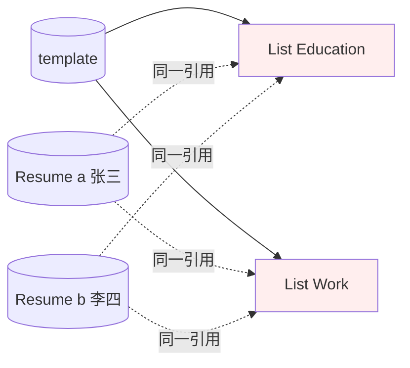
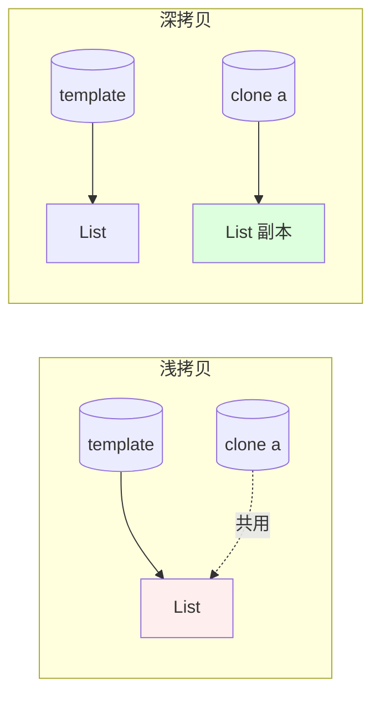
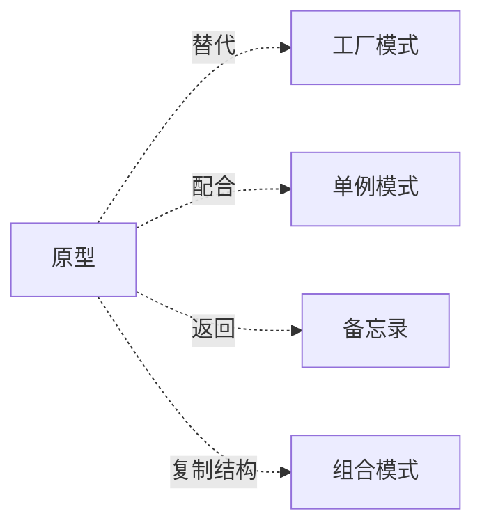

# 04.原型模式设计思想

#### 目录介绍
- [01.案例引入与思考](#01案例引入与思考)
    - [1.1 痛点场景](#11-痛点场景)
    - [1.2 它哪里不舒服](#12-它哪里不舒服)
    - [1.3 引出本篇主角](#13-引出本篇主角)
- [02.原型模式介绍](#02原型模式介绍)
    - [2.1 原型模式由来](#21-原型模式由来)
    - [2.2 原型模式定义](#22-原型模式定义)
    - [2.3 原型模式场景](#23-原型模式场景)
    - [2.4 原型模式思考](#24-原型模式思考)
- [03.原型模式原理与实现](#03原型模式原理与实现)
    - [3.1 罗列一个场景](#31-罗列一个场景)
    - [3.2 用例子理解原型](#32-用例子理解原型)
- [3.3 深拷贝改进方案](#33-深拷贝改进方案)
    - [3.4 原型模式基本实现](#34-原型模式基本实现)
- [04.原型模式分析](#04原型模式分析)
    - [4.1 原型模式VS工厂模式](#41-原型模式vs工厂模式)
    - [4.2 原型模式VS深拷贝](#42-原型模式vs深拷贝)
- [05.原型模式应用解析](#05原型模式应用解析)
    - [5.1 使用clone方法](#51-使用clone方法)
    - [5.2 实现接口Cloneable](#52-实现接口cloneable)
    - [5.3 深克隆和浅克隆](#53-深克隆和浅克隆)
- [06.原型模式总结](#06原型模式总结)
    - [6.1 优缺点分析](#61-优缺点分析)
    - [6.2 有哪些弊端](#62-有哪些弊端)
    - [6.3 应用环境说明](#63-应用环境说明)
- [07.原型模式拓展应用](#07原型模式拓展应用)
    - [7.1 模式扩展](#71-模式扩展)
    - [7.2 原型模式总结](#72-原型模式总结)
    - [7.3 模式联动与边界](#73-模式联动与边界)


## 01.案例引入与思考

> **本篇主线**：日常开发中最常见的"我要一个跟它一样的，但改两个字段"

### 1.1 痛点场景

做一个简历管理功能，用户基于一份模板生成自己的简历。模板里包含教育经历列表、工作经历列表、技能列表，结构很复杂：

```java
public class Resume {
    private String name;
    private List<Education> educations;  // 一组对象
    private List<Work> works;
    private List<String> skills;
    // 还有十几个字段...
}
```

用户点了"基于模板创建"，你的第一反应是：

```java
Resume template = templateService.loadHeavyTemplate();  // 200ms，从 DB 拼装

// 用户 A 复制
Resume a = new Resume();
a.setName(template.getName());
a.setEducations(template.getEducations());  // ⚠️ 引用！
a.setWorks(template.getWorks());            // ⚠️ 引用！
// ... 一行一行 set
a.setName("张三");

// 用户 B 又一次复制
Resume b = new Resume();
b.setEducations(template.getEducations());
// ...
```

画一张内存关系图，问题立刻浮现：



A、B 与 template 共用同一份 List——任何一方 add/remove，全员遭殃。

### 1.2 它哪里不舒服

- ❌ **手工 set 又长又错**：字段一多，漏拷一个就是隐 bug；新增字段时所有"复制点"都要补；
- ❌ **共享引用埋雷**：`a.getEducations().add(...)` 居然会污染 `template`，多人共享后线上事故；
- ❌ **重新构造太贵**：模板加载一次 200ms（DB + 反序列化），每个用户都重建一次明显浪费；
- ❌ **构造函数依赖一堆服务**：直接 `new Resume()` 不可能拿到完整字段，必须走"原始构造路径"，又慢又重。

### 1.3 引出本篇主角

> **原型模式（Prototype）的核心思想**：当"创建对象的成本"明显高于"复制对象的成本"时，先做一个**原型**，需要新对象就在原型上 `clone()` 出一份，而不是从零开始 `new`。

```java
Resume template = templateService.loadHeavyTemplate();  // 只加载一次

Resume a = template.clone();  // 几乎零成本
a.setName("张三");

Resume b = template.clone();
b.setName("李四");
```

但这里藏着一个关键陷阱：**浅拷贝 vs 深拷贝**。下面这张图把两者的区别说得最明白：



第一段代码 set 列表时之所以共享引用，就是因为浅拷贝只复制了"指针"。本篇会把 `Cloneable / clone()` 的怪异 API、深浅拷贝的取舍、以及"用序列化做深拷贝"的工程技巧讲清楚。

---

## 02.原型模式介绍
### 2.1 原型模式由来
我们来看一个例子——邮件。由于邮件对象包含的内容较多（如发送者、接收者、标题、内容、日期、附件等），某系统中现需要提供一个邮件复制功能，对于已经创建好的邮件对象，可以通过复制的方式创建一个新的邮件对象，如果需要改变某部分内容，无须修改原始的邮件对象，只需要修改复制后得到的邮件对象即可。

如果在每次复制的时候重新写一遍这个代码，可想而知是多么的复杂，所以这个时候需要封装一个基类，把这些赋值的过程全部封装好，由此可见，原型模式利用的无非就是面向对象编程的封装、继承特点。


### 2.2 原型模式定义
原型模式是通过给出一个原型对象来指明所创建的对象的类型，然后使用自身实现的克隆接口来复制这个原型对象，该模式就是用这种方式来创建出更多同类型的对象。

使用这种方式创建新的对象的话，就无需再通过 new 实例化来创建对象了。这是因为 Object 类的 clone 方法是一个本地方法，它可以直接操作内存中的二进制流，所以性能相对 new 实例化来说，更佳。

原型模式的基本工作原理是通过将一个原型对象传给那个要发动创建的对象，这个要发动创建的对象通过请求原型对象拷贝原型自己来实现创建过程。


### 2.3 原型模式场景
原型模式在以下情况下特别有用：

1. 当对象的创建过程比较复杂或耗时时，可以通过复制现有对象来提高性能。
2. 当需要创建多个相似对象，但又不希望与它们的具体类耦合时，可以使用原型模式。

原型模式的应用场景，以及它的两种实现方式：深拷贝和浅拷贝。虽然原型模式的原理和代码实现非常简单。


### 2.4 原型模式思考
提供了一种灵活的方式来创建对象，通过复制现有对象来创建新对象，从而避免了昂贵的对象创建过程。该模式的核心思想是通过复制现有对象来创建新对象，而不是通过实例化类来创建。


## 03.原型模式实现
### 3.1 罗列一个场景
拿[邮件例子代码](https://github.com/yangchong211/YCDesignBlog)来说，由于展示，我们封装邮件中的标题、内容和附件三个字段，其中附件是一个类，包含了名字、类型和文件大小。

首先采用默认的clone方式（浅克隆），即复制后的邮件中的附件与原邮件中的附件是同一对象；然后实现深克隆，即复制后的邮件中的附件与原邮件中的附件不是同一对象。


### 3.2 用例子理解原型
1.基类——为了方便子类调用clone不需要捕获异常

```java
public class Prototype implements Cloneable {
    public Prototype cloneMe() {
        Prototype prototype = null;
        try {
            prototype = (Prototype) this.clone();
        } catch (CloneNotSupportedException exception) {
        }
        return prototype;
    }
}
```

2.附件子类

```java
public class Attachment extends Prototype {

    // 附件名字
    private String name;
    // 附件文档类型
    private String type;
    // 附件大小
    private long length;

    public Attachment(String name, String type, long length) {
        super();
        this.name = name;
        this.type = type;
        this.length = length;
    }

    public void download() {
        System.out.println("下载了附件：" + name);
    }

    public String display() {
        return "Attachment [name=" + name + ", type=" + type + ", length=" + length + "]";
    }

    @Override
    public boolean equals(Object obj) {
        Attachment a = (Attachment) obj;
        if(a.name.equals(name) && a.type.equals(type) && a.length == length) {
            return true;
        }
        return false;
    }
}
```

3.邮件子类

```java
public class Email extends Prototype {
 
	// 标题
	private String title;
	// 内容
	private String content;
	// 附件
	private Attachment attachment;
	
	public Email(String title, String content, Attachment attachment) {
		super();
		this.title = title;
		this.content = content;
		this.attachment = attachment;
	}
 
	public String display() {
		return "Email [title=" + title + ", content=" + content + ", attachment=" + attachment.display();
	}
	
	public Attachment getAttachment() {
		return attachment;
	}
	
	@Override
	public boolean equals(Object obj) {
		Email e = (Email) obj;
		if(e.title.equals(title) && e.content.equals(content) && e.attachment.equals(attachment)) {
			return true;
		}
		return false;
	}
}
```

4.客户端类

```java
private void test() {
    Email email = new Email("邮件标题", "邮件内容，哈哈哈..", new Attachment("附件标题", "文档", 45987));
    System.out.println(email.display());
    Email copyEmail = (Email) email.cloneMe();
    System.out.println("邮件复制状态：" + (email != copyEmail && email.equals(copyEmail) ? "成功" : "失败") );
    Attachment attachment = email.getAttachment();
    Attachment copyAttachment = copyEmail.getAttachment();
    if(attachment.equals(copyAttachment)) {
        System.out.println("邮件附件内容一致");
    }
    if(attachment == copyAttachment) {
        System.out.println("邮件附件未复制");
    } else {
        System.out.println("邮件附件已复制");
    }
}
```

最后运行结果如下所示：

```
Email [title=邮件标题, content=邮件内容，哈哈哈.., attachment=Attachment [name=附件标题, type=文档, length=45987]
邮件复制状态：成功
邮件附件内容一致
邮件附件未复制
```

可以看到，由于重写了子类的equals方法，所以当每个字段的内容相等时，认为该类的内容相同，但是进行复制后，地址是不同的，最后一个判断是用于判断邮件类调用cloneMe方法后，当中的附件对象是否也进行了复制，若地址相同，所以未进行复制，此时是浅克隆。

### 3.3 深拷贝改进方案

**探索问题**：浅拷贝一起步就会踩到 1.2 里那个坑——`a` 和 `b` 仍在共享 Attachment。怎么让复制出来的邮件“未雨绸缪”、全夫独立？

**思路**：只需要重写邮件对象的 cloneMe 方法，先调用父类的克隆方法获得自身拷贝的对象，然后自身的附件对象也调用 cloneMe 方法，将得到的对象再赋值给拷贝后的邮件对象。

```java
public class EmailNew extends Prototype {

    // 标题
    private String title;
    // 内容
    private String content;
    // 附件
    private Attachment attachment;

    public EmailNew(String title, String content, Attachment attachment) {
        super();
        this.title = title;
        this.content = content;
        this.attachment = attachment;
    }

    public String display() {
        return "EmailNew [title=" + title + ", content=" + content + ", attachment=" + attachment.display();
    }

    public Attachment getAttachment() {
        return attachment;
    }

    @Override
    public boolean equals(Object obj) {
        EmailNew e = (EmailNew) obj;
        if(e.title.equals(title) && e.content.equals(content) && e.attachment.equals(attachment)) {
            return true;
        }
        return false;
    }

    @Override
    public EmailNew cloneMe() {
        EmailNew e = (EmailNew) super.cloneMe();
        e.attachment = (Attachment) attachment.cloneMe();
        return e;
    }
}
```

最后运行结果如下所示：

```
EmailNew [title=邮件标题, content=邮件内容，哈哈哈.., attachment=Attachment [name=附件标题, type=文档, length=45987]
邮件复制状态：成功
邮件附件内容一致
邮件附件已复制
```


### 3.4 原型模式基本实现
原型模式包含如下角色：

1. Prototype：抽象原型类。声明一个克隆自己的接口。
2. ConcretePrototype：具体原型类。实现原型类的 clone() 方法，实现克隆自己的操作。它是可被复制的对象，可以有多个。
3. Client：客户类。

要实现一个原型类，需要具备三个条件：

1. 实现 Cloneable 接口：Cloneable 接口与序列化接口的作用类似，它只是告诉虚拟机可以安全地在实现了这个接口的类上使用 clone 方法。在 JVM 中，只有实现了 Cloneable 接口的类才可以被拷贝，否则会抛出 CloneNotSupportedException 异常。
2. 重写 Object 类中的 clone 方法：在 Java 中，所有类的父类都是 Object 类，而 Object 类中有一个 clone 方法，作用是返回对象的一个拷贝。
3. 在重写的 clone 方法中调用 super.clone()：默认情况下，类不具备复制对象的能力，需要调用 super.clone() 来实现。

现在通过一个简单的例子来实现一个原型模式：

```java
//实现Cloneable 接口的原型抽象类Prototype 
class Prototype implements Cloneable {
    //重写clone方法
    public Prototype clone(){
        Prototype prototype = null;
        try{
            prototype = (Prototype)super.clone();
        }catch(CloneNotSupportedException e){
            e.printStackTrace();
        }
        return prototype;
    }
}
//实现原型类
class ConcretePrototype extends Prototype{
    public void show(){
        System.out.println("原型模式实现类");
    }
}

public class Client {
    public static void main(String[] args){
        ConcretePrototype cp = new ConcretePrototype();
        for(int i=0; i< 10; i++){
            ConcretePrototype clonecp = (ConcretePrototype)cp.clone();
            clonecp.show();
        }
    }
}
```


## 04.原型模式分析
### 4.1 原型模式VS工厂模式

目的和使用场景区别：

1. 原型模式的主要目的是通过复制现有对象来创建新对象，而不是通过实例化类来创建。它适用于需要创建多个相似对象，但又不希望与具体类耦合的情况。
2. [工厂模式](https://yccoding.com/zh/design/creational/02.%E5%B7%A5%E5%8E%82%E6%A8%A1%E5%BC%8F%E8%AE%BE%E8%AE%A1%E6%80%9D%E6%83%B3.html)的主要目的是封装对象的创建过程，通过一个工厂类来统一创建对象。它适用于需要根据不同的条件或参数创建不同类型的对象的情况。

创建方式区别：

1. 原型模式通过复制现有对象来创建新对象，可以是浅克隆（只复制基本类型属性）或深克隆（复制所有属性，包括引用类型属性）。
2. 工厂模式通过一个工厂类来创建对象，根据不同的条件或参数调用不同的[工厂方法](https://yccoding.com/zh/design/creational/02.%E5%B7%A5%E5%8E%82%E6%A8%A1%E5%BC%8F%E8%AE%BE%E8%AE%A1%E6%80%9D%E6%83%B3.html)来创建不同类型的对象。

灵活性区别：

1. 原型模式在运行时动态确定对象的类型，可以根据需要克隆不同类型的对象。
2. 工厂模式在编译时确定对象的类型，需要在工厂类中定义不同的工厂方法来创建不同类型的对象。

关注点不同：

1. 原型模式关注对象的复制和克隆过程，通过复制现有对象来创建新对象。
2. 工厂模式关注对象的创建过程，通过工厂类来封装对象的创建逻辑。


### 4.2 原型模式VS深拷贝

原型模式（Prototype Pattern）和深拷贝（Deep Copy）是两个概念，它们在对象复制和克隆方面有一些区别。

目的和使用场景：

1. 原型模式的主要目的是通过复制现有对象来创建新对象，而不是通过实例化类来创建。它适用于需要创建多个相似对象，但又不希望与具体类耦合的情况。
2. 深拷贝的主要目的是创建一个新对象，并将原始对象的所有属性都复制到新对象中，包括引用类型的属性。它适用于需要完全独立的对象副本，而不是共享引用的情况。

复制方式：

1. 原型模式通过复制现有对象来创建新对象，可以是浅克隆（只复制基本类型属性）或深克隆（复制所有属性，包括引用类型属性）。
2. 深拷贝是一种复制方式，它会递归地复制对象的所有属性，包括引用类型属性，确保新对象和原始对象完全独立。

实现方式的差异：

1. 原型模式可以通过实现Cloneable接口并重写clone()方法来实现对象的复制和克隆。
2. [深拷贝](https://yccoding.com/zh/java/advanced/3.3%E5%90%84%E7%A7%8D%E6%8B%B7%E8%B4%9D%E6%95%B0%E6%8D%AE%E6%AF%94%E8%BE%83.html)可以通过自定义的复制方法或使用序列化和反序列化来实现。


## 05.原型模式应用解析
### 5.1 使用clone方法
在原型模式结构中定义了一个抽象原型类，所有的Java类都继承自java.lang.Object，而Object类提供一个clone()方法，可以将一个Java对象复制一份。

因此在Java中，可以直接使用Object提供的clone()方法来实现对象的克隆，Java语言中的原型模式实现很简单。


### 5.2 实现接口Cloneable
能够实现克隆的Java类必须实现一个标识接口Cloneable，表示这个Java类支持复制。

如果一个类没有实现这个接口但是调用了clone()方法，Java编译器将抛出一个CloneNotSupportedException异常。

因此在Java中，Object类和Cloneable接口共同充当着抽象原型类，无需再次定义，不过由于调用clone方法需要捕获异常，每次调用的时候做处理比较麻烦，所以可以抽象出一个基类，来捕获，那么在具体子类中就不需要再次捕获（仅限于子类不需要处理异常的时候）。


### 5.3 深克隆和浅克隆

通常情况下，一个类包含一些成员对象，在使用原型模式克隆对象时，根据其成员对象是否也克隆，原型模式可以分为两种形式：深克隆和浅克隆。

1. 浅克隆：创建一个新对象，新对象的属性和原来对象完全相同，对于非基本类型属性，仍指向原有属性所指向的对象的内存地址。
2. 深克隆：创建一个新对象，属性中引用的其他对象也会被克隆，不再指向原有对象地址。

Java中的clone方法默认是浅克隆。

关于数据深克隆和浅克隆，我这边有一篇文章专门详细介绍其案例和原理。具体可以看：[各种拷贝数据比较](https://yccoding.com/zh/java/advanced/3.3%E5%90%84%E7%A7%8D%E6%8B%B7%E8%B4%9D%E6%95%B0%E6%8D%AE%E6%AF%94%E8%BE%83.html)


## 06.原型模式总结
### 6.1 优缺点分析
优点

1. 当创建新的对象实例较为复杂时，使用原型模式可以简化对象的创建过程，通过一个已有实例可以提高新实例的创建效率。
2. 可以动态增加或减少产品类。
3. 原型模式提供了简化的创建结构。
4. 可以使用深克隆的方式保存对象的状态。


### 6.2 有哪些弊端
缺点

1. 需要为每一个类配备一个克隆方法，而且这个克隆方法需要对类的功能进行通盘考虑，这对全新的类来说不是很难，但对已有的类进行改造时，不一定是件容易的事，必须修改其源代码，违背了“开闭原则”。
2. 在实现深克隆时需要编写较为复杂的代码。要修改clone方法的实现，有一定复杂。


### 6.3 应用环境说明
在以下情况下可以使用原型模式：

1. 创建新对象成本较大，新的对象可以通过原型模式对已有对象进行复制来获得，如果是相似对象，则可以对其属性稍作修改。
2. 如果系统要保存对象的状态，而对象的状态变化很小，或者对象本身占内存不大的时候，也可以使用原型模式配合备忘录模式来应用。相反，如果对象的状态变化很大，或者对象占用的内存很大，那么采用状态模式会比原型模式更好。
3. 需要避免使用分层次的工厂类来创建分层次的对象，并且类的实例对象只有一个或很少的几个组合状态，通过复制原型对象得到新实例可能比使用构造函数创建一个新实例更加方便。


## 07.原型模式拓展应用
### 7.1 一句话总结

原型模式是 "**创建贵 → 复制便宜**" 的工具：当一个对象的“初始化成本 >> 复制成本”且 存在“跟它一样、只改个别字段”的需求时，用 `clone()` 取代 `new` 能看见明显的性能增益。

### 7.2 原型模式总结
1.什么是原型模式？

如果对象的创建成本比较大，而同一个类的不同对象之间差别不大（大部分字段都相同），在这种情况下，我们可以利用对已有对象（原型）进行复制（或者叫拷贝）的方式，来创建新对象，以达到节省创建时间的目的。这种基于原型来创建对象的方式就叫作原型设计模式，简称原型模式。

2.原型模式的两种实现方法

原型模式有两种实现方法，深拷贝和浅拷贝。浅拷贝只会复制对象中基本数据类型数据和引用对象的内存地址，不会递归地复制引用对象，以及引用对象的引用对象……而深拷贝得到的是一份完完全全独立的对象。所以，深拷贝比起浅拷贝来说，更加耗时，更加耗内存空间。

如果要拷贝的对象是不可变对象，浅拷贝共享不可变对象是没问题的，但对于可变对象来说，浅拷贝得到的对象和原始对象会共享部分数据，就有可能出现数据被修改的风险，也就变得复杂多了。


### 7.3 模式联动与边界



| 模式 | 关系 | 一句话区别 |
|------|------|----------|
| 工厂 | 替代 | 工厂是"从零造"，原型是"在已有对象上复制"。创建昂贵时优先原型 |
| 建造者 | 互补 | 建造者负责造第一个，造好后存为原型，后续都靠 clone |
| 单例 | 配合 | 把"原型对象本身"做成单例，clone 出去的是新实例，不冲突 |
| 备忘录 | 易混 | 备忘录侧重"还原历史快照"，原型侧重"高效复制现在的状态" |

**⚠️ 什么时候不该用**

- **对象本来就轻**：构造一个对象只要 1μs，搞 clone 反而引入 `Cloneable` 的不雅 API；
- **字段全是值类型 / 不可变**：直接 `new` + 拷构造，比 `clone()` 更直观；
- **类层次深 + 有大量循环引用**：深拷贝代码自己写非常容易出错，可考虑序列化方案，但要权衡性能；
- **需要严格的不变量校验**：clone 会绕过构造函数，新对象可能跳过你精心设计的"不变式"，留下隐患。

> 一句话：**原型模式是"性能换便利"的工具**——它解决的是"造对象太贵"，但代价是"复制语义需要你自己想清楚"。

**💭 思考题**

1. Java 的 `Object.clone()` 为什么默认是 `protected`？为什么必须实现 `Cloneable` 才能调用——这是一个标记接口的"反例"吗？
2. 用 `ObjectOutputStream` + `ObjectInputStream` 做深拷贝是个偷懒办法，它的性能上限是什么？什么时候必须手写深拷贝？
3. Spring 的 `@Scope("prototype")` 与本篇的原型模式是同一个东西吗？区别在哪？

> 上一篇 [03.建造者](03.建造者模式设计思想.md) → 本篇 → [05.静态代理](05.静态代理设计模式.md)：创建型 4 篇收束完毕，进入结构型——当一个对象被使用时，我们想"在不动它"的前提下加点料，代理是第一站。

