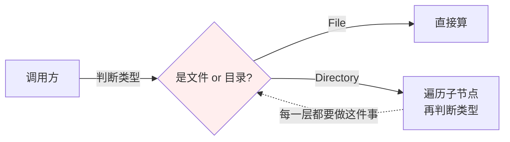
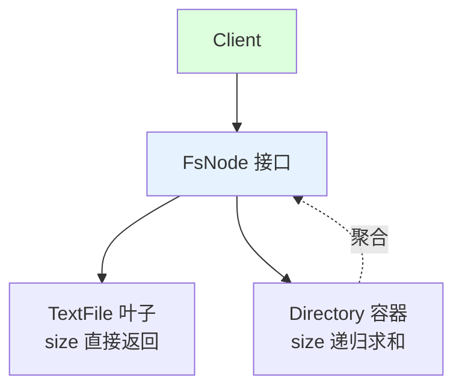
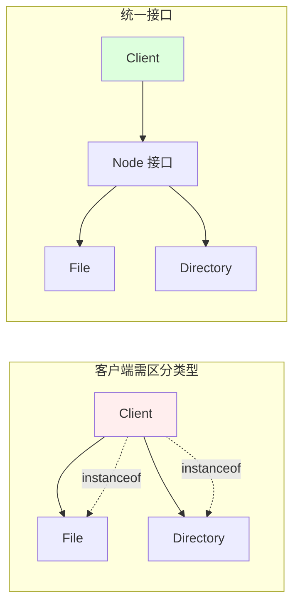

# 11.组合模式设计思想
#### 目录介绍
- [01.案例引入：遍历一棵"文件夹树"，你还在写递归 if-else 吗](#01案例引入遍历一棵文件夹树你还在写递归-if-else-吗)
    - [1.1 痛点场景](#11-痛点场景)
    - [1.2 它哪里不舒服](#12-它哪里不舒服)
    - [1.3 引出本篇主角](#13-引出本篇主角)
- [02.组合模式基础](#02组合模式基础)
    - [2.1 组合模式由来](#21-组合模式由来)
    - [2.2 组合模式定义](#22-组合模式定义)
    - [2.3 组合模式场景](#23-组合模式场景)
    - [2.4 组合模式思考](#24-组合模式思考)
    - [2.5 解决的问题](#25-解决的问题)
- [03.组合模式实现](#03组合模式实现)
    - [3.1 罗列一个场景](#31-罗列一个场景)
    - [3.2 组合结构](#32-组合结构)
    - [3.3 组合基本实现](#33-组合基本实现)
    - [3.4 有哪些注意点](#34-有哪些注意点)
- [04.组合实例演示](#04组合实例演示)
    - [4.1 需求分析](#41-需求分析)
    - [4.2 代码案例实现](#42-代码案例实现)
    - [4.3 是否可以优化](#43-是否可以优化)
    - [4.4 组合设计](#44-组合设计)
    - [4.5 演变代码案例](#45-演变代码案例)
- [05.组合实现方式](#05组合实现方式)
    - [5.1 组合模式分类](#51-组合模式分类)
    - [5.2 案例分析](#52-案例分析)
    - [5.3 透明式组合](#53-透明式组合)
    - [5.4 安全式组合](#54-安全式组合)
- [06.组合模式分析](#06组合模式分析)
    - [6.1 组合模式优点](#61-组合模式优点)
    - [6.2 组合模式缺点](#62-组合模式缺点)
    - [6.3 适用环境](#63-适用环境)
    - [6.4 模式拓展](#64-模式拓展)
    - [6.5 使用建议说明](#65-使用建议说明)
- [07.外观代理总结](#07外观代理总结)
    - [7.1 总结一下学习](#71-总结一下学习)
    - [7.2 模式联动与边界](#72-模式联动与边界)


## 推荐一个好玩网站

一个最纯粹的技术分享网站，打造精品技术编程专栏！[编程进阶网](https://yccoding.com/)

https://yccoding.com/

## 01.案例引入：遍历一棵"文件夹树"，你还在写递归 if-else 吗

> **本篇主线**：整体和部分的统一访问

### 1.1 痛点场景

要实现"统计某个路径下所有文件的总大小"。目录里可能有文件，也可能有子目录，子目录里又可能套目录——典型的树形结构。第一版你大概率这样写：

```java
public long calcSize(Object node) {
    if (node instanceof File) {
        return ((File) node).getSize();
    } else if (node instanceof Directory) {
        long total = 0;
        for (Object child : ((Directory) node).getChildren()) {
            // 对每个孩子，再判断是文件还是目录
            if (child instanceof File) {
                total += ((File) child).getSize();
            } else if (child instanceof Directory) {
                total += calcSize(child);  // 递归
            }
        }
        return total;
    }
    return 0;
}
```



调用方每次访问节点都要 `instanceof` 判断——这是典型的"结构暴露给客户端"。

### 1.2 它哪里不舒服

- ❌ **客户端耦合类型**：调用方要知道"文件"和"目录"两种类型，还要知道怎么对每种做不同处理；
- ❌ **新类型扩散**：哪天要新增"快捷方式"节点，所有写过 `instanceof` 的地方都要改；
- ❌ **递归逻辑写在外部**：本该由节点自己负责的"遍历我的孩子"，被写到了客户端；
- ❌ **操作无法统一**：`size()`、`count()`、`print()`、`search()`——每一种操作都要重新写一遍上面的 if-else；
- ❌ **树的深度越深，逻辑越乱**：多级嵌套时客户端代码变成一团乱麻。

### 1.3 引出本篇主角

> **组合模式（Composite）的核心思想**：让"叶子节点（文件）"和"容器节点（目录）"实现同一个接口。调用方只面向接口编程，不关心手里的是文件还是目录——`node.size()` 自己会算清楚。

```java
interface FsNode {
    long size();
}
class TextFile implements FsNode {
    public long size() { return bytes; }
}
class Directory implements FsNode {
    private List<FsNode> children = ...;
    public long size() {
        return children.stream().mapToLong(FsNode::size).sum(); // 自动递归
    }
}

// 调用方：不需要知道类型
FsNode root = ...;
System.out.println(root.size());
```



"整体-部分"的对称结构，正是组合模式要解决的核心：



典型场景：文件系统、GUI 组件树（Panel 包含 Button/Label 甚至子 Panel）、XML/JSON 的 DOM 树、组织架构（部门-员工）、菜单树。本篇会把**透明式**（所有操作都在统一接口里）vs **安全式**（只在容器里暴露子节点操作）的权衡讲清楚。

---

## 02.组合模式基础
### 2.0 本博客AI摘要

本文详细介绍了组合模式的设计思想和实现方法，涵盖组合模式的基础概念、实现步骤、实例演示、实现方式、优缺点分析等内容。通过具体的代码案例，展示了如何使用组合模式来处理具有层次结构的对象，如文件系统和购物清单，使客户端可以一致地处理单个对象和组合对象。文章还探讨了透明式和安全式组合模式的区别，并提供了设计建议和适用场景。适合初学者和有一定经验的开发者阅读。

### 2.1 组合模式由来

客户代码过多地依赖于对象容器复杂的内部实现结构，对象容器内部实现结构（而非抽象接口）的变化将引起客户代码的频繁变化，带来了代码的维护性、扩展性等弊端。

如何将“客户代码与复杂的对象容器结构”解耦？让对象容器自己来实现自身的复杂结构，从而使得客户代码就像处理简单对象一样来处理复杂的对象容器？

### 2.2 组合模式定义

定义：将对象以树形结构组织起来，以达成“部分－整体”的层次结构，使得客户端对单个对象和组合对象的使用具有一致性。

### 2.3 组合模式场景

使用场景

1. 当需要表示对象的层次结构时，如文件系统或组织结构。[更多内容](https://yccoding.com/)
2. 当希望客户端代码能够以一致的方式处理树形结构中的所有对象时。


### 2.4 组合模式思考

当我们思考组合模式时，以下几个方面值得考虑：

1. 对象的层次结构：组合模式适用于具有层次结构的对象集合。我们需要思考对象之间的关系，确定哪些对象可以作为容器对象，哪些对象可以作为叶子对象，以及它们之间的组合方式。
2. 统一的接口：组合模式通过定义统一的接口，使得容器对象和叶子对象可以被一致地对待。我们需要思考如何设计这个接口，以便能够在不同层次的对象上进行统一的操作。
3. 递归结构：组合模式通常使用递归结构来处理对象的层次关系。我们需要思考如何在递归中遍历和操作对象集合，以实现统一的操作和处理。
4. 叶子对象的特殊处理：组合模式中的叶子对象可能需要特殊处理，因为它们没有子对象。我们需要思考如何处理这些叶子对象，以确保它们能够正确地参与到组合结构中。

### 2.5 解决的问题

主要解决的问题

1. 简化树形结构中对象的处理，无论它们是单个对象还是组合对象。
2. 解耦客户端代码与复杂元素的内部结构，使得客户端可以统一处理所有类型的节点。[更多内容](https://yccoding.com/)


## 03.组合模式实现
### 3.1 罗列一个场景

假设我们有一个文件系统，其中有两种类型的文件：文本文件和文件夹。文本文件是叶子节点，文件夹是组合节点，可以包含其他文件。我们想要使用组合模式来实现文件系统的层次结构，并且提供一个打印文件路径的方法。


### 3.2 组合结构

组合模式包含如下角色：[更多内容](https://yccoding.com/)

1. 组件（Component）: 定义了组合中所有对象的通用接口，可以是抽象类或接口。它声明了用于访问和管理子组件的方法，包括添加、删除、获取子组件等。
2. 叶子节点（Leaf）: 表示组合中的叶子节点对象，叶子节点没有子节点。它实现了组件接口的方法，但通常不包含子组件。
3. 复合节点（Composite）: 表示组合中的复合对象，复合节点可以包含子节点，可以是叶子节点，也可以是其他复合节点。它实现了组件接口的方法，包括管理子组件的方法。
4. 客户端（Client）: 通过组件接口与组合结构进行交互，客户端不需要区分叶子节点和复合节点，可以一致地对待整体和部分。


### 3.3 组合基本实现

定义抽象组件（Component）

```java
public interface File {
    // 获取文件名称
    String getName();
    // 添加子文件
    void add(File file);
    // 删除子文件
    void remove(File file);
    // 获取子文件
    List<File> getChildren();
    // 打印文件路径
    void printPath(int space);
}
```

定义叶子节点（Leaf）

```java
public class TextFile implements File {
    private String name;

    public TextFile(String name) {
        this.name = name;
    }

    @Override
    public String getName() {
        return name;
    }

    @Override
    public void add(File file) {
        throw new UnsupportedOperationException("Text file cannot add child file");
    }

    @Override
    public void remove(File file) {
        throw new UnsupportedOperationException("Text file cannot remove child file");
    }

    @Override
    public List<File> getChildren() {
        throw new UnsupportedOperationException("Text file has no child file");
    }

    @Override
    public void printPath(int space) {
        StringBuilder sp = new StringBuilder();
        for (int i = 0; i < space; i++) {
            sp.append(" ");
        }
        System.out.println(sp + name);
    }
}
```

定义组合节点

```java
public class Folder implements File {
    private String name;
    private List<File> children;

    public Folder(String name) {
        this.name = name;
        children = new ArrayList<>();
    }

    @Override
    public String getName() {
        return name;
    }

    @Override
    public void add(File file) {
        children.add(file);
    }

    @Override
    public void remove(File file) {
        children.remove(file);
    }

    @Override
    public List<File> getChildren() {
        return children;
    }

    @Override
    public void printPath(int space) {
        StringBuilder sp = new StringBuilder();
        for (int i = 0; i < space; i++) {
            sp.append(" ");
        }
        System.out.println(sp + name);
        space += 2;
        for (File child : children) {
            child.printPath(space);
        }
    }
}
```

客户端代码

```java
private void test() {
    // 创建一个根文件夹，并添加两个文本文件和一个子文件夹
    File root = new Folder("root");
    root.add(new TextFile("a.txt"));
    root.add(new TextFile("b.txt"));
    File subFolder = new Folder("subFolder");
    root.add(subFolder);

    // 在子文件夹中添加两个文本文件
    subFolder.add(new TextFile("c.txt"));
    subFolder.add(new TextFile("d.txt"));

    // 打印根文件夹的路径
    root.printPath(0);
}
```

打印结果如下所示：

```text
root
  a.txt
  b.txt
  subFolder
    c.txt
    d.txt
```


### 3.4 有哪些注意点

在使用组合模式时，有几个注意点需要考虑：

1. 抽象构件的一致性：组合模式中，抽象构件定义了组合对象和叶子对象的共同接口。确保所有的组件都遵循相同的接口和行为，以保持一致性。
2. 添加和删除子节点的限制：在组合模式中，组合对象可以包含其他组合对象或叶子对象作为子节点。但是，有时可能需要限制添加或删除子节点的操作，以确保组合对象的结构和约束条件得到维护。
3. 叶子对象的操作限制：叶子对象是组合模式中的最小单位，它没有子节点。因此，对于叶子对象的操作可能需要进行限制或者抛出异常，以避免不必要的操作。
4. 透明性和安全性的权衡：组合模式可以采用透明性或安全性的实现方式。在选择实现方式时，需要权衡透明性和安全性之间的需求。


## 04.组合实例演示
### 4.1 需求分析

假设这样的场景：

在电脑E盘有个文件夹，该文件夹下面有很多文件，有视频文件，有音频文件，有图像文件，还有包含视频、音频及图像的文件夹，十分杂乱，现希望将这些杂乱的文件展示出来。[更多内容](https://yccoding.com/)

### 4.2 代码案例实现

不使用组合模式。注：当然可以一个循环遍历就搞定了，因为这里用的是文件的形式，如果是别的形式呢？所以不要太较真了，只是举例。

```java
private void test() {
    MusicFile m1 = new MusicFile("尽头.mp3");
    MusicFile m2 = new MusicFile("飘洋过海来看你.mp3");
    MusicFile m3 = new MusicFile("曾经的你.mp3");
    MusicFile m4 = new MusicFile("take me to your heart.mp3");

    VideoFile v1 = new VideoFile("战狼2.mp4");
    VideoFile v2 = new VideoFile("理想.avi");
    VideoFile v3 = new VideoFile("琅琊榜.avi");

    ImageFile i1 = new ImageFile("敦煌.png");
    ImageFile i2 = new ImageFile("baby.jpg");
    ImageFile i3 = new ImageFile("girl.jpg");

    Folder aa = new Folder("aa");
    aa.addImage(i3);
    Folder bb = new Folder("bb");
    bb.addMusic(m4);
    bb.addVideo(v3);
    Folder top = new Folder("top");
    top.addFolder(aa);
    top.addFolder(bb);
    top.addMusic(m1);
    top.addMusic(m2);
    top.addMusic(m3);
    top.addVideo(v1);
    top.addVideo(v2);
    top.addImage(i1);
    top.addImage(i2);
    top.print();
}

public class MusicFile {
    private String name;

    public MusicFile(String name){
        this.name = name;
    }

    public void print(){
        System.out.println(name);
    }
}

public class VideoFile {
    private String name;

    public VideoFile(String name){
        this.name = name;
    }

    public void print(){
        System.out.println(name);
    }
}

public class ImageFile {
    private String name;

    public ImageFile(String name){
        this.name = name;
    }

    public void print(){
        System.out.println(name);
    }
}

public class Folder {
    private String name;
    //音乐
    private List<MusicFile> musicList = new ArrayList<MusicFile>();
    //视频
    private List<VideoFile> videoList = new ArrayList<VideoFile>();
    //图片
    private List<ImageFile> imageList = new ArrayList<ImageFile>();
    //文件夹
    private List<Folder> folderList = new ArrayList<Folder>();

    public Folder(String name){
        this.name = name;
    }

    public void addFolder(Folder folder){
        folderList.add(folder);
    }

    public void addImage(ImageFile image){
        imageList.add(image);
    }

    public void addVideo(VideoFile video){
        videoList.add(video);
    }

    public void addMusic(MusicFile music){
        musicList.add(music);
    }

    public void print(){
        for (MusicFile music : musicList){
            music.print();
        }
        for (VideoFile video : videoList){
            video.print();
        }
        for(ImageFile image : imageList){
            image.print();
        }
        for (Folder folder : folderList){
            folder.print();
        }
    }
}
```

### 4.3 是否可以优化

如果采用上述的形式，有几个缺点：

1. 文件夹类Folder的设计和实现都非常复杂，需要定义多个集合存储不同类型的成员，而且需要针对不同的成员提供增加、删除和获取等管理和访问成员的方法，存在大量的冗余代码，系统维护较为困难；
2. 由于系统没有提供抽象层，客户端代码必须有区别地对待充当容器的文件夹Folder和充当叶子的MusicFile、ImageFile和VideoFile，无法统一对它们进行处理；
3. 系统的灵活性和可扩展性差，如果增加了新的类型的叶子和容器都需要对原有代码进行修改，例如如果需要在系统中增加一种新类型的文本文件TextFile，则必须修改Folder类的源代码，否则无法在文件夹中添加文本文件。


### 4.4 组合设计

为了让系统具有更好的灵活性和可扩展性，客户端可以一致地对待文件和文件夹，定义一个抽象构件AbstractFile，Folder充当容器构件，MusicFile、VideoFile和ImageFile充当叶子构件。[更多内容](https://yccoding.com/)


### 4.5 演变代码案例

抽象构件AbstractFile（Component）

```java
public abstract class AbstractFile {
    public void add(AbstractFile file) {
        throw new UnsupportedOperationException();
    }

    public void remove(AbstractFile file) {
        throw new UnsupportedOperationException();
    }

    public AbstractFile getChild(int i) {
        throw new UnsupportedOperationException();
    }

    public void print() {
        throw new UnsupportedOperationException();
    }
}
```

叶子构件（Leaf）

```java
public class MusicFile extends AbstractFile {
    private String name;

    public MusicFile(String name) {
        this.name = name;
    }

    public void print() {
        System.out.println(name);
    }
}

public class VideoFile extends AbstractFile {
    private String name;

    public VideoFile(String name) {
        this.name = name;
    }

    public void print() {
        System.out.println(name);
    }
}

public class ImageFile extends AbstractFile {
    private String name;

    public ImageFile(String name) {
        this.name = name;
    }

    public void print() {
        System.out.println(name);
    }
}
```

容器构件（Composite）

```java
public class Folder extends AbstractFile {
    private String name;
    private List<AbstractFile> files = new ArrayList<AbstractFile>();

    public Folder(String name) {
        this.name = name;
    }

    @Override
    public void add(AbstractFile file) {
        files.add(file);
    }

    @Override
    public void remove(AbstractFile file) {
        files.remove(file);
    }

    @Override
    public AbstractFile getChild(int i) {
        return files.get(i);
    }

    @Override
    public void print() {
        for (AbstractFile file : files) {
            file.print();
        }
    }
}
```

客户端测试：

```java
private void test() {
    AbstractFile m1 = new MusicFile("尽头.mp3");
    AbstractFile m2 = new MusicFile("飘洋过海来看你.mp3");
    AbstractFile m3 = new MusicFile("曾经的你.mp3");
    AbstractFile m4 = new MusicFile("take me to your heart.mp3");

    AbstractFile v1 = new VideoFile("战狼2.mp4");
    AbstractFile v2 = new VideoFile("理想.avi");
    AbstractFile v3 = new VideoFile("琅琊榜.avi");

    AbstractFile i1 = new ImageFile("敦煌.png");
    AbstractFile i2 = new ImageFile("baby.jpg");
    AbstractFile i3 = new ImageFile("girl.jpg");

    AbstractFile aa = new Folder("aa");
    aa.add(i3);

    AbstractFile bb = new Folder("bb");
    bb.add(m4);
    bb.add(v3);

    AbstractFile top = new Folder("top");
    top.add(aa);
    top.add(bb);
    top.add(m1);
    top.add(m2);
    top.add(m3);
    top.add(v1);
    top.add(v2);
    top.add(i1);
    top.add(i2);

    top.print();
}
```

用组合模式提供一个抽象构件后，客户端可以一致对待容器构件和叶子构件，进行统一处理，并且大量减少了冗余，扩展性也很好，新增TextFile无需修改Folder源码，只需修改客户端即可。

当然，这里似乎有点违法“迭代器模式”中讲的“单一职责原则”，的确是，抽象构件不但要管理层次结构，还要执行一些业务操作。

## 05.组合实现方式
### 5.1 组合模式分类

组合模式分为透明式的组合模式和安全式的组合模式。这两种类型的主要区别在于抽象构件（Component）角色上的差别。

1. 透明式的组合模式：在透明式的组合模式中，由于抽象构件声明了所有子类中的全部方法，所以客户端无须区别树叶对象和树枝对象，对客户端来说是透明的。
2. 安全式的组合模式：在安全式的组合模式中，将管理子构件的方法移到树枝构件中，抽象构件只定义树枝构件和树叶构件所共同的方法。避免了透明式的组合模式的空实现或抛异常问题。

### 5.2 案例分析

案例：用组合模式实现在超市购物后，显示并计算所选商品信息与总价。[更多内容](https://yccoding.com/)

案例说明：张三在超市购物，购物清单如下

- 1号小袋子装了2 包芒果干（单价15.8元）,1包薯片（单价9.8元）
- 2号小袋子装了3 包山楂（单价7.8元）,2包牛肉脯（单价19.8元）
- 中型袋子装了1号小袋子，1盒巧克力（单价39.8元）
- 大型袋子装了中型袋子,2号小袋子，1箱牛奶（单价79.8元）

大袋子的东西如下：

```java
{
    1箱牛奶（单价79.8元）
    2号小袋子{
    	3 包山楂（单价7.8元
    	2包牛肉脯（单价19.8元）
	}
    中型袋子:{
        1盒巧克力（单价39.8元）
        1号小袋子:{
        	2 包芒果干（单价15.8元）
        	1包薯片（单价9.8元）
    	}
    }
}
```

### 5.3 透明式组合

透明式的组合模式中抽象构件还声明访问和管理子类的接口

组件（Component）: 抽象构建角色。定义一个接口用于计算价格，显示商品，并且可以添加子节点。

```java
public interface Article {

    /**
     * 树枝构件特有的方法： 访问和管理子类的接口  大袋子装小袋子
     */
    void add(Article article);

    /**
     * 计算价格
     */
    Double calculation();

    /**
     * 显示商品
     */
    void show();
}
```


叶子节点（Leaf）: 叶子节点对象，叶子节点没有子节点。创建一个商品类，继承抽象角色。

```java
public class Goods implements Article {

    /**
     * 商品名称
     */
    private String name;
    /**
     * 购买数量
     */
    private Integer quantity;
    /**
     * 商品单价
     */
    private Double unitPrice;

    public Goods(String name, Integer quantity, Double unitPrice) {
        this.name = name;
        this.quantity = quantity;
        this.unitPrice = unitPrice;
    }

    /**
     * 树枝构件特有的方法
     * 在树叶构件中是能空实现或者抛异常
     */
    @Override
    public void add(Article article) {

    }

    @Override
    public Double calculation() {
        return this.unitPrice * this.quantity;
    }

    @Override
    public void show() {
        System.out.println(name + ": (数量：" + quantity + "，单价：" + unitPrice + "元)," +
                "合计：" + this.unitPrice * this.quantity + "元");
    }
}
```

复合节点（Composite）: 创建袋子

```java
/**
 * 树枝构件: 袋子
 */
public class Bag implements Article {

    /**
     * 袋子名字
     */
    private String name;

    public Bag(String name) {
        this.name = name;
    }

    /**
     * 袋子中的商品
     */
    private List<Article> bags = new ArrayList<Article>();

    /**
     * 往袋子中添加袋子或者商品
     */
    @Override
    public void add(Article article) {
        bags.add(article);
    }

    @Override
    public Double calculation() {
        AtomicReference<Double> sum = new AtomicReference<>(0.0);
        bags.forEach(e -> {
            sum.updateAndGet(v -> v + e.calculation());
        });
        return sum.get();
    }

    @Override
    public void show() {
        bags.forEach(Article::show);
    }
}
```

客户端（Client）: 通过组件接口与组合结构进行交互。

```java
private void test() {
    Article smallOneBag = new Bag("1号小袋子");
    smallOneBag.add(new Goods("芒果干", 2, 15.8));
    smallOneBag.add(new Goods("薯片", 1, 9.8));

    Article smallTwoBag = new Bag("2号小袋子");
    smallTwoBag.add(new Goods("山楂", 3, 7.8));
    smallTwoBag.add(new Goods("牛肉脯", 2, 19.8));

    Article mediumBag = new Bag("中袋子");
    mediumBag.add(new Goods("巧克力", 1, 39.8));
    mediumBag.add(smallOneBag);

    Article BigBag = new Bag("大袋子");
    BigBag.add(new Goods("牛奶", 1, 79.8));
    BigBag.add(mediumBag);
    BigBag.add(smallTwoBag);

    System.out.println("打工充选购的商品有：");
    BigBag.show();
    Double sum = BigBag.calculation();
    System.out.println("要支付的总价是：" + sum + "元");
}
```

以上客户端代码中 new Bag(），new Goods()的引用都是Article，无须区别树叶对象和树枝对象，对客户端来说是透明的，此时Article调用add()是空实现或抛异常的（案例是空实现）。[更多内容](https://yccoding.com/)


### 5.4 安全式组合

安全式的组合模式中不声明访问和管理子类的接口，管理工作由树枝构件完成，只定义一些通用的方法。

抽象构件（Component）角色。这里创建定义一个接口用于计算价格，显示商品。

```java
public interface Article {
    /**
     * 计算价格
     */
    Double calculation();

    /**
     * 显示商品
     */
    void show();
}
```

树叶构件（Leaf）角色

```java
public class Goods implements Article {

    /**
     * 商品名称
     */
    private String name;
    /**
     * 购买数量
     */
    private Integer quantity;
    /**
     * 商品单价
     */
    private Double unitPrice;

    public Goods(String name, Integer quantity, Double unitPrice) {
        this.name = name;
        this.quantity = quantity;
        this.unitPrice = unitPrice;
    }

    @Override
    public Double calculation() {
        return this.unitPrice * this.quantity;
    }

    @Override
    public void show() {
        System.out.println(name + ": (数量：" + quantity + "，单价：" + unitPrice + "元)," +
                "合计：" + this.unitPrice * this.quantity + "元");
    }
}
```

树枝构件（Composite）角色 / 中间构件

```java
/**
 * 树枝构件: 袋子
 */
public class Bag implements Article {
    /**
     * 袋子名字
     */
    private String name;

    public Bag(String name) {
        this.name = name;
    }

    /**
     * 袋子中的商品
     */
    private List<Article> bags = new ArrayList<Article>();

    /**
     * 树枝构件特有的方法： 访问和管理子类的接口  大袋子装小袋子
     * 往袋子中添加袋子或者商品
     */
    public void add(Article article) {
        bags.add(article);
    }

    @Override
    public Double calculation() {
        AtomicReference<Double> sum = new AtomicReference<>(0.0);
        bags.forEach(e -> {
            sum.updateAndGet(v -> v + e.calculation());
        });
        return sum.get();
    }

    @Override
    public void show() {
        bags.forEach(Article::show);
    }
}
```

客户端（Client）: 通过组件接口与组合结构进行交互。

```java
private void test() {
    Bag smallOneBag = new Bag("1号小袋子");
    smallOneBag.add(new Goods("芒果干", 2, 15.8));
    smallOneBag.add(new Goods("薯片", 1, 9.8));

    Bag smallTwoBag = new Bag("2号小袋子");
    smallTwoBag.add(new Goods("山楂", 3, 7.8));
    smallTwoBag.add(new Goods("牛肉脯", 2, 19.8));

    Bag mediumBag = new Bag("中袋子");
    mediumBag.add(new Goods("巧克力", 1, 39.8));
    mediumBag.add(smallOneBag);

    Bag BigBag = new Bag("大袋子");
    BigBag.add(new Goods("牛奶", 1, 79.8));
    BigBag.add(mediumBag);
    BigBag.add(smallTwoBag);

    System.out.println("打工充选购的商品有：");
    BigBag.show();
    Double sum = BigBag.calculation();
    System.out.println("要支付的总价是：" + sum + "元");
}
```

以上客户端代码中  new Bag(），new Goods()的引用都是Bag，Goods，客户端在调用时要知道树叶对象和树枝对象的存在。此时只有Bag才能调用add()。


## 06.组合模式分析
### 6.1 组合模式优点

1. 使客户端调用简单，客户端可以一致的使用组合结构或其中单个对象，用户就不必关系自己处理的是单个对象还是整个组合结构，这就简化了客户端代码。
2. 更容易在组合体内加入对象部件. 客户端不必因为加入了新的对象部件而更改代码。[更多内容](https://yccoding.com/)


### 6.2 组合模式缺点

1. 设计较复杂，需要明确类之间的层次关系；
2. 不容易限制容器中的构件；
3. 不容易用继承的方法来增加构件的新功能；


### 6.3 适用环境

在以下情况下可以考虑使用组合模式：

1. 在具有整体和部分的层次结构中，希望通过一种方式忽略整体与部分的差异，客户端可以一致地对待它们。
2. 在一个使用面向对象语言开发的系统中需要处理一个树形结构。
3. 在一个系统中能够分离出叶子对象和容器对象，而且它们的类型不固定，需要增加一些新的类型。


### 6.4 模式拓展

在实际开发过程中，可以对树叶节点和树枝节点分别进行抽象，通过继承的方式让不同的树叶节点和树枝节点子类来实现行为。


### 6.5 使用建议说明

在设计时，优先使用接口而非具体类，以提高系统的灵活性和可维护性。[更多内容](https://yccoding.com/)

适用于需要处理复杂树形结构的场景，如文件系统、组织结构等。


## 07.外观代理总结
### 7.1 总结一下学习

**01.组合模式基础**

组合模式定义 ：将对象以树形结构组织起来，以达成“部分－整体”的层次结构，使得客户端对单个对象和组合对象的使用具有一致性。

主要解决的问题 ：1.简化树形结构中对象的处理，无论它们是单个对象还是组合对象。2.解耦客户端代码与复杂元素的内部结构，使得客户端可以统一处理所有类型的节点。

**02.组合模式实现**

组合模式包含如下角色：

1. 组件（Component）: 定义了组合中所有对象的通用接口，可以是抽象类或接口。它声明了用于访问和管理子组件的方法，包括添加、删除、获取子组件等。
2. 叶子节点（Leaf）: 表示组合中的叶子节点对象，叶子节点没有子节点。它实现了组件接口的方法，但通常不包含子组件。
3. 复合节点（Composite）: 表示组合中的复合对象，复合节点可以包含子节点，可以是叶子节点，也可以是其他复合节点。它实现了组件接口的方法，包括管理子组件的方法。
4. 客户端（Client）: 通过组件接口与组合结构进行交互，客户端不需要区分叶子节点和复合节点，可以一致地对待整体和部分。

**04.组合实现方式**

组合模式分为透明式的组合模式和安全式的组合模式。这两种类型的主要区别在于抽象构件（Component）角色上的差别。

1. 透明式的组合模式：在透明式的组合模式中，由于抽象构件声明了所有子类中的全部方法，所以客户端无须区别树叶对象和树枝对象，对客户端来说是透明的。
2. 安全式的组合模式：在安全式的组合模式中，将管理子构件的方法移到树枝构件中，抽象构件只定义树枝构件和树叶构件所共同的方法。避免了透明式的组合模式的空实现或抛异常问题。


