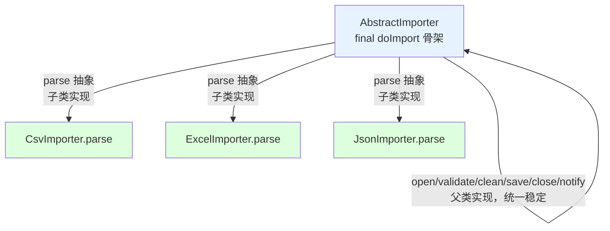
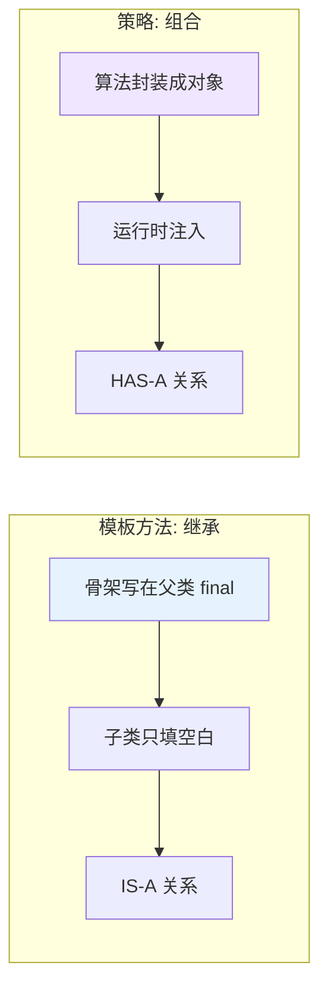

# 15.模版模式设计思想
#### 目录介绍
- [01.案例引入：三个导入任务，骨架一样、只有两步不一样](#01案例引入三个导入任务骨架一样只有两步不一样)
    - [1.1 痛点场景](#11-痛点场景)
    - [1.2 它哪里不舒服](#12-它哪里不舒服)
    - [1.3 引出本篇主角](#13-引出本篇主角)
- [02.模版模式基础](#02模版模式基础)
    - [2.1 模版模式由来](#21-模版模式由来)
    - [2.2 模版模式定义](#22-模版模式定义)
    - [2.3 模版模式场景](#23-模版模式场景)
    - [2.4 模版模式思考](#24-模版模式思考)
    - [2.5 模版模式特点](#25-模版模式特点)
    - [2.6 理解模版唯一性](#26-理解模版唯一性)
    - [2.7 主要解决问题](#27-主要解决问题)
- [03.模版模式原理](#03模版模式原理)
    - [3.1 罗列一个场景](#31-罗列一个场景)
    - [3.2 用例子理解模版](#32-用例子理解模版)
    - [3.3 需求普通实现](#33-需求普通实现)
    - [3.4 案例演变实现](#34-案例演变实现)
    - [3.5 模版模式实现步骤](#35-模版模式实现步骤)
- [04.模版模式结构](#04模版模式结构)
    - [4.1 模版标准案例](#41-模版标准案例)
    - [4.2 模版模式结构](#42-模版模式结构)
    - [4.3 模版模式时序图](#43-模版模式时序图)
- [05.模版模式案例分析](#05模版模式案例分析)
    - [5.1 角色分析](#51-角色分析)
    - [5.2 拓展一个场景](#52-拓展一个场景)
    - [5.3 模版模式实践](#53-模版模式实践)
- [06.模版者模式分析](#06模版者模式分析)
    - [6.1 模版模式优点](#61-模版模式优点)
    - [6.2 模版模式缺点](#62-模版模式缺点)
    - [6.3 使用建议说明](#63-使用建议说明)
    - [6.4 思考题考察](#64-思考题考察)
- [07.观察者模式总结](#07观察者模式总结)
    - [7.1 总结一下学习](#71-总结一下学习)
    - [7.2 模式联动与边界](#72-模式联动与边界)

## 推荐一个好玩网站

一个最纯粹的技术分享网站，打造精品技术编程专栏！[编程进阶网](https://yccoding.com/)

https://yccoding.com/

关于设计模式，所有的代码都放到了该项目。[设计模式大全](https://github.com/yangchong211/YCDesignBlog)


## 01.案例引入：三个导入任务，骨架一样、只有两步不一样

> **本篇主线**：算法骨架固定，只有局部需要变化

### 1.1 痛点场景

做数据导入功能，支持三种文件：CSV、Excel、JSON。每个导入任务的**骨架**几乎一模一样：

```
1. 打开文件 → 2. 校验格式 → 3. 解析内容 → 4. 数据清洗 → 5. 入库 → 6. 关闭文件 → 7. 发通知
```

第一版实现同事写了三个类，每个类把 7 步都写了一遍：

```java
public class CsvImporter {
    public void doImport(String path) {
        open(path);          // 1 所有类都一样
        validate();          // 2 所有类都一样
        List<Row> rows = parseCsv();  // 3 只有这里不同
        clean(rows);         // 4 所有类都一样
        save(rows);          // 5 所有类都一样
        close();             // 6 所有类都一样
        notify();            // 7 所有类都一样
    }
}
public class ExcelImporter {
    public void doImport(String path) {
        open(path);          // 复制
        validate();          // 复制
        List<Row> rows = parseExcel();  // 只这里不同
        clean(rows);         // 复制
        save(rows);          // 复制
        close();             // 复制
        notify();            // 复制
    }
}
// JsonImporter 再复制一份
```



```mermaid
flowchart TD
    subgraph CSV[CsvImporter]
        C1[open] --> C2[validate] --> C3[parseCsv] --> C4[clean] --> C5[save] --> C6[close] --> C7[notify]
    end
    subgraph Excel[ExcelImporter]
        E1[open] --> E2[validate] --> E3[parseExcel] --> E4[clean] --> E5[save] --> E6[close] --> E7[notify]
    end
    subgraph JSON[JsonImporter]
        J1[open] --> J2[validate] --> J3[parseJson] --> J4[clean] --> J5[save] --> J6[close] --> J7[notify]
    end
    style C1 fill:#fee
    style C2 fill:#fee
    style E1 fill:#fee
    style E2 fill:#fee
    style J1 fill:#fee
    style J2 fill:#fee
```

### 1.2 它哪里不舒服

- ❌ **骨架重复**：7 步里 6 步在三个类里一模一样，复制粘贴 3 份；
- ❌ **改一处漏一处**：`validate` 加一条新规则 → 三个类都要改，总会漏掉一个导致线上事故；
- ❌ **骨架顺序可能被打乱**：某个类写漏了 `close()` → 资源泄漏；
- ❌ **扩展要重写一切**：新增 XML 导入 → 又要把 7 步重新抄一遍；
- ❌ **无法强制顺序**：子类开发者有可能不按骨架顺序调用，流程稳定性靠纪律。

### 1.3 引出本篇主角

> **模板方法模式（Template Method）的核心思想**：把\"稳定的骨架\"写在父类的一个 `final` 方法里，把\"会变化的步骤\"声明为抽象方法，让子类去实现。骨架强制所有子类走同一条流程，变化点各自表达。

```java
public abstract class AbstractImporter {
    // 模板方法：骨架固定，final 防止子类覆盖
    public final void doImport(String path) {
        open(path);
        validate();
        List<Row> rows = parse();   // ← 变化点，交给子类
        clean(rows);
        save(rows);
        close();
        notify();
    }
    protected abstract List<Row> parse();  // 子类决定怎么解析
    // 其余骨架方法父类实现
}

class CsvImporter   extends AbstractImporter { protected List<Row> parse(){...} }
class ExcelImporter extends AbstractImporter { protected List<Row> parse(){...} }
class JsonImporter  extends AbstractImporter { protected List<Row> parse(){...} }
```



**模板方法 vs 策略模式**（本篇会详谈）：



Spring 的 `JdbcTemplate`、Servlet 的 `HttpServlet.service()`、JUnit 的 `@Before/@Test/@After`、Android Activity 生命周期——骨架全部来自模板方法。

---

## 02.模版模式基础介绍
### 2.1 模版模式由来

在软件构建过程中，对于某一项任务，它常常有稳定的整体操作结构，但各个子步骤却有很多改变的需求，或者由于固有的原因（比如框架与应用之间的关系）而无法和任务的整体结构同时实现。

如何在确定稳定操作结构的前提下，来灵活应对各个子步骤的变化或者晚期实现需求？如何保证架构逻辑的正常执行，而不被子类破坏 ？这个时候可以用模版模式！

### 2.2 模版模式定义

模板方法模式是类的行为模式。

模板模式（Template）将定义的算法抽象成一组步骤，在抽象类种定义算法的骨架，把具体的操作留给子类来实现。

模板方法使得子类可以不改变一个算法的结构即可重定义该算法的某些特定步骤。

### 2.3 模版模式场景

常见模板模式运用场景如下：

1. Java Servlet：HttpServlet 就是使用了模板模式。HttpServlet 类定义了 service() 方法作为模板方法，子类需要实现 doGet()、doPost() 等方法来处理具体的 HTTP 请求。
2. Spring Framework：例如，JdbcTemplate 使用了模板模式来简化 JDBC 数据访问代码，定义了模板方法来执行数据库操作，具体的 SQL 语句和参数由子类提供。

总结：当存在一些通用的方法，可以在多个子类中共用时。

### 2.4 模版模式思考

实际开发中常常会遇到，代码骨架类似甚至相同，只是具体的实现不一样的场景。

例如：休假流程都有开启、编辑、驳回、结束。共享单车都是先开锁、骑行、上锁、付款。每个流程都包含这几个步骤，不同的是不同的流程实例它们的内容不一样。你该如何设计？

### 2.5 模版模式特点

模板模式的主要特点包括：

1. 定义一个算法的骨架，将一些步骤留给子类实现。
2. 允许子类在不改变算法结构的基础上，重新定义某些步骤。
3. 适用于处理包含一系列基本相同步骤的过程，但某些步骤可能有不同的实现。

### 2.6 主要解决问题

解决在多个子类中重复实现相同的方法的问题，通过将通用方法抽象到父类中来避免代码重复。


## 03.模版模式原理
### 3.1 罗列一个场景

以生活中买菜做饭的例子来写个Demo，烧饭一般都是买菜、洗菜、烹饪、装盘四大过程。中国自古有八大菜系，制作方式肯定都避不开这四个过程。那在模板模式中如何实现呢？

### 3.2 用例子理解模版

这些大的步骤固定，不同的是每个实例的具体实现细节不一样。这些类似的业务我们都可以使用模板模式实现。

### 3.3 需求普通实现

关于实现买菜做饭，做川菜和徽菜。最原始的实现如下所示：

```java
private void cook() {
    System.out.println("----------川菜制作------------");
    Cooking chuanCaiService = new Cooking(0);
    chuanCaiService.process();
    System.out.println("-----------徽菜制作-----------");
    Cooking huiCaiService = new Cooking(1);
    huiCaiService.process();
}

public class Cooking {

    //type是0表示川菜
    //type是1表示徽菜
    private int type;
    public Cooking(int type) {
        this.type = type;
    }

    public void process() {
        shopping();
        wash();
        cooking();
        dishedUp();
    }

    protected void shopping() {
        if (type == 0) {
            System.out.println("买菜：黑猪肉一斤，蒜头5个");
        } else if (type == 1){
            System.out.println("买菜：新鲜鱼一条，红辣椒五两");
        }

    }

    protected void wash() {
        if (type == 0) {
            System.out.println("清洗：猪肉洗净，蒜头去皮");
        } else if (type == 1){
            System.out.println("清洗：红椒洗净切片，鱼头半分");
        }

    }

    protected void cooking() {
        if (type == 0) {
            System.out.println("烹饪：大火翻炒，慢火闷油");
        } else if (type == 1){
            System.out.println("装盘：用长形盘子装盛");
        }
    }

    protected void dishedUp() {
        if (type == 0) {
            System.out.println("装盘：深碗盛起，热油浇拌");
        } else if (type == 1){
            System.out.println("烹饪：鱼头水蒸，辣椒过油");
        }
    }
}
```

你有没有发现这样写，要是后期在拓展一个鲁菜，粤菜。这样就会修改原代码，会破坏代码的开闭原则。或者我想修改一下不同菜系的做菜步骤，那就导致代码非常难以修改。


### 3.4 案例演变实现

创建一个抽象类，它的模板方法被设置为 final。为防止恶意操作，一般模板方法都加上 final 关键词。

```java
public abstract class AbstractCookingService {
    //买菜
    protected abstract void shopping();
    //清洗
    protected abstract void wash();
    //烹饪
    protected abstract void cooking();
    //装盘
    protected abstract void dishedUp();

    public final void process() {
        shopping();
        wash();
        cooking();
        dishedUp();
    }
}
```

创建实现了上述抽象类的子类。

```java
/**
 * 徽菜制作大厨
 */
public class HuiCaiChef extends AbstractCookingService {

    @Override
    protected void shopping() {
        System.out.println("买菜：新鲜鱼一条，红辣椒五两");
    }

    @Override
    protected void wash() {
        System.out.println("清洗：红椒洗净切片，鱼头半分");
    }

    @Override
    protected void cooking() {
        System.out.println("烹饪：鱼头水蒸，辣椒过油");
    }

    @Override
    protected void dishedUp() {
        System.out.println("装盘：用长形盘子装盛");
    }
}

/**
 * 川菜制作大厨
 */
public class ChuanCaiChef extends AbstractCookingService {

    @Override
    protected void shopping() {
        System.out.println("买菜：黑猪肉一斤，蒜头5个");
    }

    @Override
    protected void wash() {
        System.out.println("清洗：猪肉洗净，蒜头去皮");
    }

    @Override
    protected void cooking() {
        System.out.println("烹饪：大火翻炒，慢火闷油");
    }

    @Override
    protected void dishedUp() {
        System.out.println("装盘：深碗盛起，热油浇拌");
    }
}
```

然后测试演示一下

```java
private void test() {
    System.out.println("----------川菜制作------------");
    AbstractCookingService chuanCaiService = new ChuanCaiChef();
    chuanCaiService.process();
    System.out.println("-----------徽菜制作-----------");
    AbstractCookingService huiCaiService = new HuiCaiChef();
    huiCaiService.process();
}
```

在模板模式中，定义了一个算法的框架，将算法的具体步骤延迟到子类中实现。这种模式允许子类重写算法的特定步骤而不改变算法的结构。

模板模式中通常包含两个角类，一个模板类和一个具体类，模板类就是一个算法框架。


### 3.5 模版模式实现步骤

模板模式也没什么高深莫测的，简单来说就是三大步骤：

1. 创建一个抽象类，定义几个抽象方法和一个final修饰的模板方法，而模板方法中设定了抽象方法的执行顺序或逻辑。
2. 无论子类有多少个，只需要继承该抽象类，实现父类的抽象方法重写自己的业务。
3. 根据不同的需求创建不同的子类实现，每次调用的地方只需调用模板方法，即可完成特定的模板流程。


## 04.模版模式结构
### 4.1 模版标准案例


### 4.2 模版模式结构

模板模式的主要角色包括：

1. 抽象类（AbstractClass）：负责实现模板方法，并声明在模板方法中所使用的抽象方法。
2. 具体类（ConcreteClass）：实现抽象类中的抽象方法。
3. 客户端（Client）：使用具体类继承的模板方法。


### 4.3 模版模式时序图


## 05.模版模式案例分析
### 5.1 角色分析

抽象类（Abstract）：定义了算法骨架，包含一个或多个抽象方法，这些方法由子类来具体实现。抽象类中通常还包含一个模板方法，用来调用抽象方法和具体方法，控制算法的执行顺序；还可以定义钩子方法，用于在算法中进行条件控制。

具体类（Concrete Class）：继承抽象类，实现抽象方法。

### 5.2 拓展一个场景

以订外卖为例，解释一下模板模式。假设订外卖的过程包含三个步骤：选择外卖、支付、取外卖、是否打赏。

我们可以定义一个OderFood的抽象类，那么选择外卖就可以是抽象方法，需要子类取实现它，支付和取外卖可以定义为具体方法，另外是否打赏为钩子方法，子类可以决定是否对算法的不同进行挂钩。

还需要定义一个模板方法，用以控制流程；不同的商家，如KFC、星巴克就是具体类。


### 5.3 模版模式实践

OrderFood——抽象类（Abstract）

```java
/**
 * @author Created by njy on 2023/6/24
 * 1.抽象类（Abstract Class）：点外卖
 * 包含选择外卖、支付、取外卖三个方法，
 * 其中选择外卖为抽象方法，需要子类实现
 * 支付、取外卖为具体方法
 * 另外是否打赏为钩子方法，子类可以决定是否对算法的不同进行挂钩
 */
public abstract class OrderFood {

    //模板方法
    public void order(){
        selectFood();
        pay();
        getFood();
    }
    //选择外卖   抽象方法 由子类实现具体细节
    public abstract void selectFood();
    //是否打赏   钩子方法 可以重写来做条件控制
    public boolean isGiveAward(){
        return false;
    }
    //-------具体方法----------
    public void pay(){
        System.out.println("支付成功，外卖小哥正在快马加鞭~~");
    }

    //取外卖
    public void getFood(){
        System.out.println("取到外卖");
        if (isGiveAward()){
            System.out.println("打赏外卖小哥");
        }
    }
}
```

具体类（Concrete Class）

```java
/**
 * 具体类（Concrete Class）：星巴克
 */
public class Starbucks extends OrderFood{

    //实现父类方法
    @Override
    public void selectFood() {
        System.out.println("一杯抹茶拿铁");
    }

    //重写钩子方法，打赏外卖小哥
    @Override
    public boolean isGiveAward(){
        return true;
    }
}

/**
 * 具体类（Concrete Class）：KFC
 */
public class KFC extends OrderFood{
    @Override
    public void selectFood() {
        System.out.println("一份汉堡炸鸡四件套");
    }
}
```

测试一下，代码如下：

```java
//星巴克（重写了钩子方法，打赏外卖小哥）
OrderFood orderFood=new Starbucks();
orderFood.order();
System.out.println("--------KFC------------");
//KFC
OrderFood orderFood1=new KFC();
orderFood1.order();
```


## 06.模版者模式分析
### 6.1 模版模式优点

1. 封装不变部分：算法的不变部分被封装在父类中。
2. 扩展可变部分：子类可以扩展或修改算法的可变部分。
3. 提取公共代码：减少代码重复，便于维护。


### 6.2 模版模式缺点

1. 类数目增加：每个不同的实现都需要一个子类，可能导致系统庞大。


### 6.3 使用建议说明

1. 当有多个子类共有的方法且逻辑相同时，考虑使用模板方法模式。
2. 对于重要或复杂的方法，可以考虑作为模板方法定义在父类中。

注意事项：为了防止恶意修改，模板方法通常使用final关键字修饰，避免被子类重写。


### 6.4 思考题考察

需求1: 实现字符打印和字符串打印两种不同的打印样式。

分析和实现：定义一个抽象类AbstractDisplay其中包含模板方法display，两个实现模板的具体类，CharDisplay和StringDisplay。具体可以看：[TemplateDesign](https://github.com/yangchong211/YCDesignBlog/tree/master/)

需求2: 做菜的步骤一般是：洗锅 --> 炒菜 --> 洗碗 ，不同的菜，只是炒菜这一个步骤具体细节是不同的。然后做一个煮糖醋鲤鱼，小炒肉，你该如何实现？

分析和实现：整体流程是一样的，有些步骤一样，有些步骤不一样，但是不使用模板模式，需要每个类都重写一遍方法，这个时候可以用模版模式实现。具体可以看：[TemplateDesign](https://github.com/yangchong211/YCDesignBlog/tree/master/)

## 07.观察者模式总结
### 7.1 总结一下学习

1. 定义：在模板模式（Template Pattern）中，一个抽象类公开定义了执行它的方法的方式/模板。它的子类可以按需要重写方法实现，但调用将以抽象类中定义的方式进行。这种类型的设计模式属于行为型模式。
2. 意图：定义一个操作中的算法的骨架，而将一些步骤延迟到子类中。模板方法使得子类可以不改变一个算法的结构即可重定义该算法的某些特定步骤
3. 主要解决：一些方法通用，却在每一个子类都重新写了这一方法。
4. 何时使用：有一些通用的方法。
5. 如何解决：将这些通用算法抽象出来。
6. 关键代码：在抽象类实现，其他步骤在子类实现。
7. 优点： 1、封装不变部分，扩展可变部分。 2、提取公共代码，便于维护。 3、行为由父类控制，子类实现。
8. 缺点：每一个不同的实现都需要一个子类来实现，导致类的个数增加，使得系统更加庞大。
9. 使用场景： 1、有多个子类共有的方法，且逻辑相同。 2、重要的、复杂的方法，可以考虑作为模板方法。


