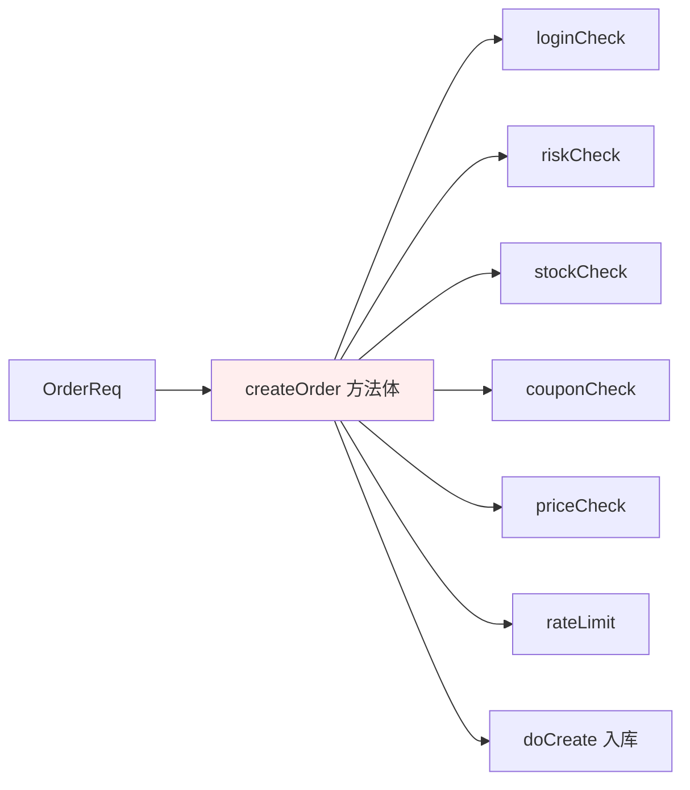
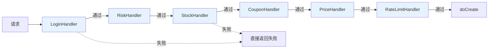
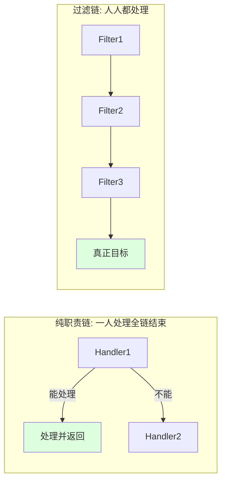
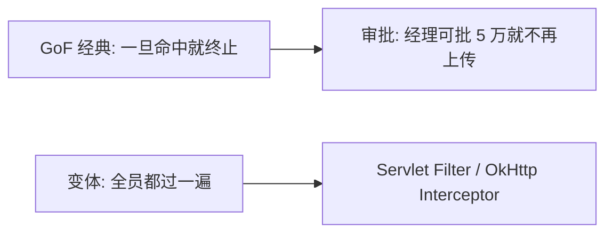
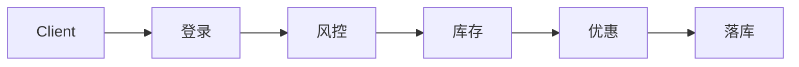
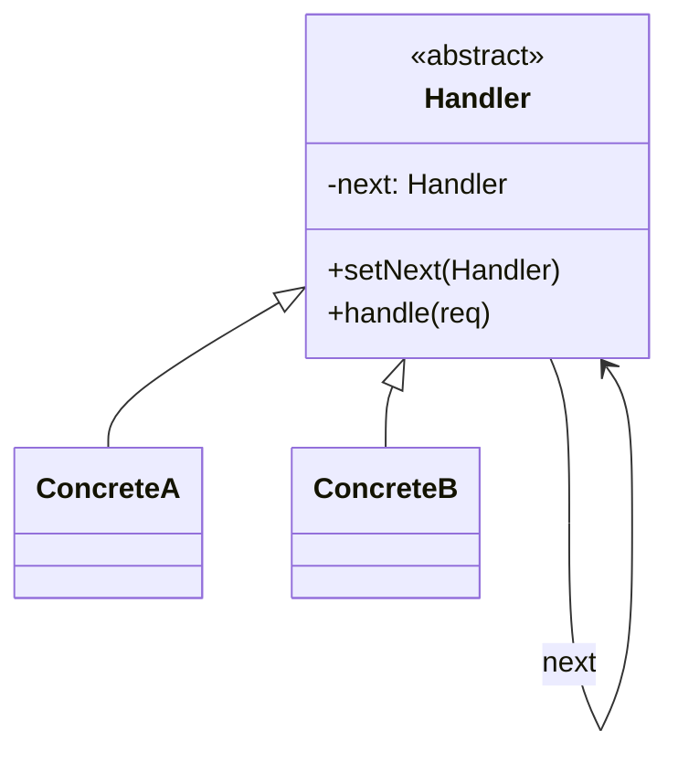
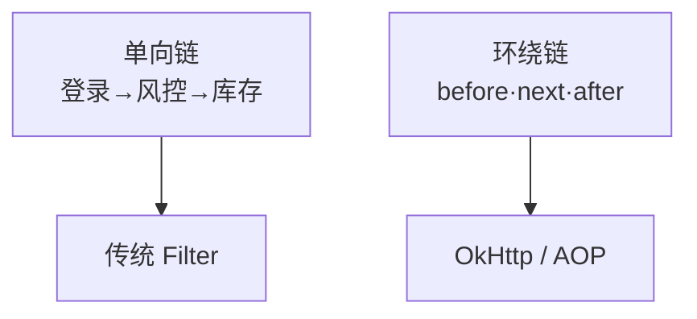
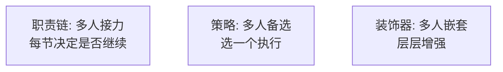

# 17.职责链模式设计思想

#### 目录介绍

- 01.案例引入：下单前的 6 道校验，写成嵌套 if-else 你就废了
- 02.职责链模式基础介绍
- 03.职责链模式原理
- 04.职责链模式结构
- 05.职责链模式案例
- 06.职责链模式分析
- 07.职责链模式总结

---

## 01.案例引入：下单前的 6 道校验，写成嵌套 if-else 你就废了

> **本篇主线**：多个处理器依次校验一个请求

### 1.1 痛点场景

电商下单接口在真正落库前要依次做 6 道校验：登录 → 风控 → 库存预占 → 优惠券核销 → 价格计算 → 防刷限流。第一版实现把全部逻辑塞在一个方法里：

```java
public OrderResult createOrder(OrderReq req) {
    if (!loginCheck(req)) return fail("未登录");
    if (!riskCheck(req))  return fail("风控拦截");
    if (!stockCheck(req)) return fail("库存不足");
    if (!couponCheck(req)) return fail("优惠券不可用");
    if (!priceCheck(req)) return fail("价格异常");
    if (!rateLimit(req))  return fail("请求太频繁");
    return doCreate(req);
}
```



### 1.2 它哪里不舒服

- ❌ **主流程被校验淹没**：`createOrder` 本该关心"下单落库"，却被 6 个 if-else 围起来；
- ❌ **顺序写死**：哪天风控要换到库存之后——要改主流程；
- ❌ **校验可插拔？不可能**：灰度关闭"风控"这一步、只对 VIP 跳过"防刷"——if-else 里塞开关，越塞越乱；
- ❌ **复用困难**：支付、退款、取消订单也要做一部分相同校验——校验代码各自复制；
- ❌ **扩展要改核心**：新增一步"黑名单校验"——必须改 `createOrder`，违反开闭原则。

### 1.3 引出本篇主角

> **职责链模式（Chain of Responsibility）的核心思想**：把每个校验/处理器做成独立的类，**各自持有一个"下一环"引用**，形成一条链。请求沿链传递，每个处理器只关心自己要不要处理、要不要继续传；调用方只和链头打交道。

```java
abstract class OrderHandler {
    protected OrderHandler next;
    public OrderHandler linkWith(OrderHandler n){ this.next = n; return n; }
    public abstract OrderResult handle(OrderReq req);
    protected OrderResult toNext(OrderReq req) {
        return next == null ? OrderResult.ok() : next.handle(req);
    }
}

class LoginHandler extends OrderHandler { public OrderResult handle(OrderReq r){
    if (!logined(r)) return fail("未登录");
    return toNext(r);
}}
// 其余处理器类似

// 组装链
OrderHandler head = new LoginHandler();
head.linkWith(new RiskHandler())
    .linkWith(new StockHandler())
    .linkWith(new CouponHandler())
    .linkWith(new PriceHandler())
    .linkWith(new RateLimitHandler());

// 调用方只认链头
public OrderResult createOrder(OrderReq req) {
    OrderResult r = head.handle(req);
    return r.ok() ? doCreate(req) : r;
}
```



链的两种经典形态（本篇会详谈）：



Servlet `FilterChain`、Spring Security 的 `SecurityFilterChain`、Spring MVC 的 `HandlerInterceptor`、OkHttp 的 Interceptor 链、Netty `ChannelPipeline`——它们本质都是职责链。

---

## 02.职责链模式基础介绍

### 2.1 模式动机

请求的处理需要经过**多个不固定的处理器**，且：

- 处理器顺序可能调整；
- 处理器可能新增/移除；
- 调用者**不需要知道**有几个处理器、是谁。

### 2.2 模式定义

> 让多个对象都有机会处理请求，从而避免请求发送者与接收者耦合。把这些对象连成一条链，请求沿链传递，直到有对象处理它（GoF 经典版）或全部处理完（变体版）。

### 2.3 两种变体



### 2.4 何时考虑

- 多个对象可处理同一请求，且**具体哪个处理由运行时决定**；
- 处理逻辑要**动态可配**；
- 不希望客户端知道处理细节。

---

## 03.职责链模式原理

### 3.1 朴素的 if-else

```java
// 反例
public Result placeOrder(Order o) {
    if (!checkLogin(o)) return Result.fail("未登录");
    if (!riskControl(o)) return Result.fail("风控拦截");
    if (!lockStock(o)) return Result.fail("库存不足");
    if (!useCoupon(o)) return Result.fail("券失效");
    // ……每加一项都要改
    return doPlace(o);
}
```

每加一个校验都修改主方法 = 违反 OCP。

### 3.2 职责链改造



每节只持有 `next` 引用，处理完决定**继续传**还是**短路**。

---

## 04.职责链模式结构

### 4.1 结构图



### 4.2 角色

- **抽象处理器**：定义 `handle()` 与 `next`；
- **具体处理器**：实现自己的 `handle()`，必要时调用 `next.handle()`；
- **客户端**：组装链，把请求丢给链头。

---

## 05.职责链模式案例

### 5.1 下单校验链

```java
public abstract class OrderHandler {
    protected OrderHandler next;
    public OrderHandler then(OrderHandler n) { this.next = n; return n; }

    public final Result handle(Order o) {
        Result r = doHandle(o);
        if (!r.success() || next == null) return r;
        return next.handle(o);
    }
    protected abstract Result doHandle(Order o);
}

public class LoginHandler extends OrderHandler {
    protected Result doHandle(Order o) {
        return o.user != null ? Result.ok() : Result.fail("未登录");
    }
}
public class RiskHandler extends OrderHandler { ... }
public class StockHandler extends OrderHandler { ... }

// 组装
OrderHandler chain = new LoginHandler();
chain.then(new RiskHandler()).then(new StockHandler()).then(new CouponHandler());

// 调用
Result r = chain.handle(order);
```

新增"防刷"校验？

```java
chain.then(new RateLimitHandler());   // 一行搞定
```

### 5.2 真实世界的职责链

| 框架 | 链 |
|------|----|
| Servlet | `FilterChain.doFilter()` |
| OkHttp | `Interceptor.Chain.proceed()` |
| Spring Security | `FilterSecurityInterceptor` 链 |
| Netty | `ChannelPipeline` 入站/出站链 |
| MyBatis | `Interceptor` 插件链 |

> **观察**：所有"过滤器/拦截器"功能，底层几乎都是职责链。

### 5.3 链的两种结构



环绕版处理器长这样：

```java
public Result handle(Order o, Chain c) {
    log.info("before");
    Result r = c.proceed(o);   // 调下一节
    log.info("after");
    return r;
}
```

---

## 06.职责链模式分析

### 6.1 优点

- **解耦**：发送者不知道处理者；
- **可扩展**：加节点只改装配，不改主流程（OCP）；
- **顺序灵活**：拼链顺序可配置。

### 6.2 缺点

- 调试链路稍烦——一次请求穿好几节；
- 链未正确终止可能导致请求**永远转下去**；
- 链过长时性能有累积。

### 6.3 与策略、装饰器对比



| 维度 | 职责链 | 策略 | 装饰器 |
|------|--------|------|--------|
| 执行个数 | 多个串行 | 一个 | 多个嵌套 |
| 关注点 | 谁来处理 | 怎么处理 | 增强什么 |
| 终止权 | 处理器自己 | — | — |

### 6.4 模式联动

- **与命令模式**：链上每节封装成 Command，可缓存/重放；
- **与装饰器**：环绕版职责链 ≈ 装饰器在动态运行期的兄弟；
- **与外观**：外观可作为链头对外的统一入口。

---

## 07.职责链模式总结

### 7.1 一句话记忆

> 职责链 = **链表 + 多态 + 短路控制**。

### 7.2 适用环境

下单/支付/审批 / 风控 / 框架级拦截器 / 中间件 pipeline。

### 7.3 思考题

电商订单链跑完没问题就落库——但若希望**任何一节失败都能"回滚已执行节"**，怎么办？（提示：链 + 命令 + 备忘录的组合）

下一站建议阅读 [18.命令模式](18.命令模式设计思想.md)——把"调用"也变成对象。
