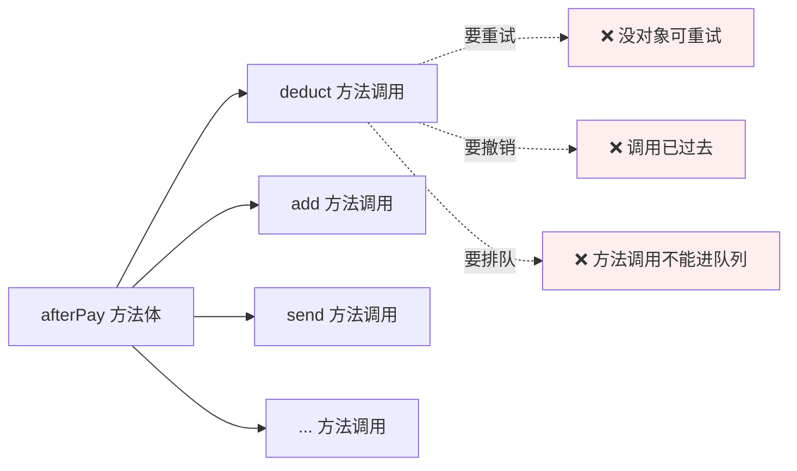
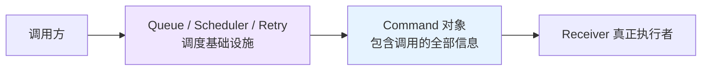
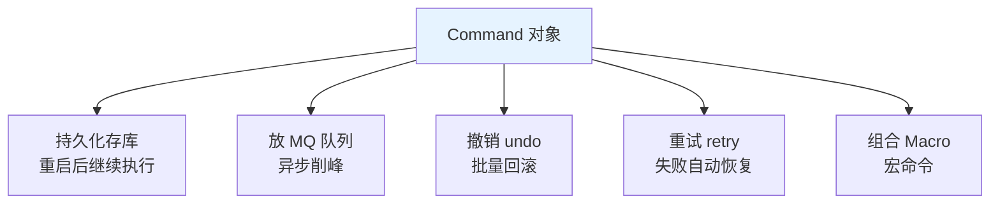
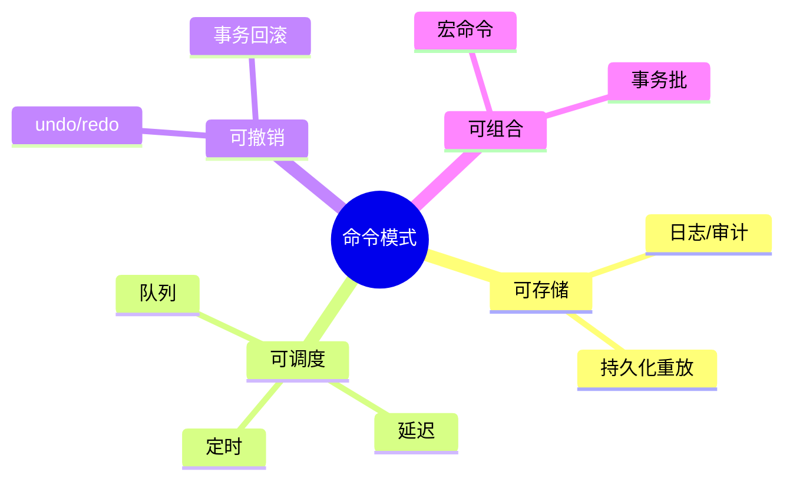
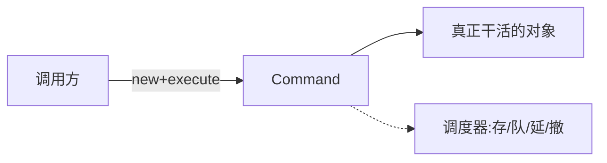
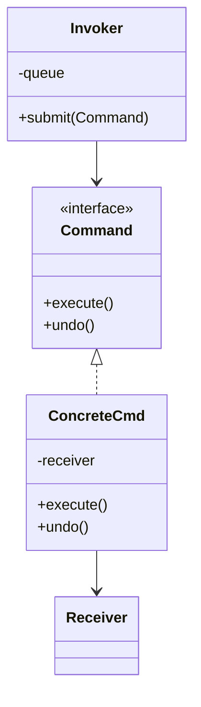
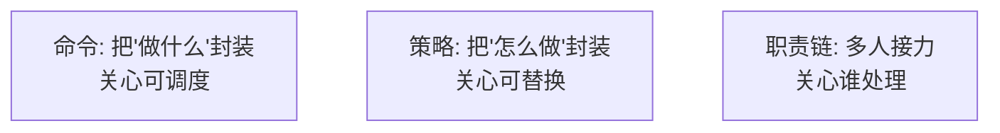

# 18.命令模式设计思想

#### 目录介绍

- 01.案例引入与思考
- 02.命令模式基础介绍
- 03.命令模式原理
- 04.命令模式结构
- 05.命令模式案例
- 06.命令模式分析
- 07.命令模式总结

---

## 01.案例引入与思考

> **本篇主线**：方法调用本身需要被存储、调度、回放

### 1.1 痛点场景

上一篇用职责链做完下单前置校验，下单成功后紧接着要触发一连串动作：**扣库存、加积分、发短信、推 Push、写账本、记日志**。第一版实现直接顺序调用：

```java
public void afterPay(Order o) {
    inventoryService.deduct(o);   // 同步
    pointsService.add(o);         // 同步
    smsService.send(o);           // 同步
    pushService.push(o);          // 同步
    accountingService.book(o);    // 同步
    auditService.log(o);          // 同步
}
```

然后需求来了：
- 短信挂了要**自动重试 3 次**；
- 用户秒退款，6 个动作要**反向撤销**；
- 高峰期希望把这些动作**扔到队列里慢慢消费**；
- 某些动作要**延迟 30 分钟**执行（比如 30 分钟后发提醒）。



### 1.2 它哪里不舒服

- ❌ **\"调用\"转瞬即逝**：方法调用不是对象，无法持久化、无法放队列；
- ❌ **重试没抓手**：失败时手上只有一个异常，要重现调用必须保存所有入参；
- ❌ **撤销难**：没有统一的 `undo` 抽象，每个动作都要手写反向逻辑；
- ❌ **调度困难**：想延迟/排队/限速，要给每个方法各写一套基础设施；
- ❌ **事务日志缺位**：出了问题想查\"当时发生了什么\"——日志散落各处。

### 1.3 引出本篇主角

> **命令模式（Command）的核心思想**：把\"一次调用\"封装成对象。对象里装着：要调谁、带什么参数、怎么执行、怎么撤销。一旦变成对象，它就能被**存储、传输、排队、重试、撤销、审计**。

```java
interface Command {
    void execute();
    default void undo() {}
}

class DeductInventoryCmd implements Command {
    private final SkuId sku;
    private final int count;
    public void execute(){ inventoryService.deduct(sku, count); }
    public void undo()   { inventoryService.release(sku, count); }  // 反向
}

// 发起方只认 Command
List<Command> cmds = List.of(
    new DeductInventoryCmd(o.sku, o.count),
    new AddPointsCmd(o.uid, o.points),
    new SendSmsCmd(o.phone, tpl)
);

// 想怎么调度都行：
cmds.forEach(Command::execute);       // 同步
queue.offerAll(cmds);                  // 入队
scheduler.scheduleAfter(30min, cmds);  // 延迟
retryRunner.run(cmd, 3);               // 重试
auditLog.record(cmd);                  // 审计
cmds.reverse().forEach(Command::undo); // 撤销
```



把调用物化成对象，才能支持：



Redis `MULTI/EXEC`、数据库的 WAL 日志、RocketMQ 事务消息、Git 的 `commit`、IDE 的 `Ctrl+Z`——背后都是命令模式。

---

## 02.命令模式基础介绍

### 2.1 模式动机

普通方法调用是"一次性"的：调用 → 执行 → 结束。命令模式把"调用"做成对象，让它具备**身份**——可被存储、传递、排队、撤销、重做。

### 2.2 模式定义

> 将请求封装为对象，从而让你可以用不同的请求对客户端进行参数化、对请求排队或记录请求日志，以及支持可撤销的操作。

### 2.3 关键能力



### 2.4 何时考虑

- 操作要**异步/排队/延迟**执行；
- 操作要支持**撤销/重做**；
- 操作要**记录历史**用于审计或回放；
- 操作要被**统一管理**（如全部加日志、加超时）。

---

## 03.命令模式原理

### 3.1 朴素调用的问题

```java
// 反例
inventory.deduct(orderId);
points.add(userId, 100);
sms.send(phone, msg);
// 想撤销？没办法
// 想重试？要 try-catch 包一遍
// 想异步？要再写一套线程池
```

### 3.2 命令化思路



把"做什么"打包到一个对象里：调度它、存它、撤它，全只对这个对象操作。

---

## 04.命令模式结构

### 4.1 结构图



### 4.2 角色

- **Command**：调用对象的统一接口；
- **ConcreteCommand**：持有真正的接收者 + 参数；
- **Receiver**：真正干活的业务对象；
- **Invoker**：调度器（队列/线程池/事务管理器）。

---

## 05.命令模式案例

### 5.1 下单后置动作命令化

```java
public interface Cmd {
    void execute();
    default void undo() { throw new UnsupportedOperationException(); }
}

public class DeductStockCmd implements Cmd {
    private final long skuId;
    private final int qty;
    private final InventoryService inv;
    public DeductStockCmd(...) { ... }

    public void execute() { inv.deduct(skuId, qty); }
    public void undo()    { inv.refill(skuId, qty); }
}
public class AddPointsCmd  implements Cmd { ... }
public class SendSmsCmd    implements Cmd { ... }
```

### 5.2 同步顺序执行

```java
List<Cmd> cmds = List.of(
    new DeductStockCmd(sku, qty, inv),
    new AddPointsCmd(uid, 100, pts),
    new SendSmsCmd(phone, msg, sms)
);
cmds.forEach(Cmd::execute);
```

### 5.3 异步排队（用 Invoker）

```java
public class CmdQueue {
    private final BlockingQueue<Cmd> q = new LinkedBlockingQueue<>();

    public CmdQueue() {
        new Thread(() -> {
            while (true) q.take().execute();
        }).start();
    }
    public void submit(Cmd c) { q.put(c); }
}
```

主流程从"同步执行"切换到"丢队列"——**业务代码零改动**：

```java
queue.submit(new SendSmsCmd(phone, msg, sms));
```

### 5.4 事务回滚（撤销栈）

```java
Deque<Cmd> done = new ArrayDeque<>();
try {
    for (Cmd c : cmds) { c.execute(); done.push(c); }
} catch (Exception e) {
    while (!done.isEmpty()) done.pop().undo();   // 反向回滚
    throw e;
}
```

> 看这一段——这正是上一篇思考题的答案：**职责链 + 命令 + 撤销栈** = 可回滚的下单管道。

### 5.5 真实世界的命令模式

| 场景 | 命令对象 |
|------|----------|
| `Runnable / Callable` | 最朴素的 Java 命令 |
| 数据库事务 redo / undo log | 命令日志 |
| Git commit | 一次提交 = 一个命令 |
| Kafka 消费消息 | 消息天然是命令 |
| Redis MULTI/EXEC | 命令队列 |
| 编辑器撤销/重做 | 编辑命令栈 |

---

## 06.命令模式分析

### 6.1 优点

- **彻底解耦**调用方和被调方；
- 天然支持**异步、队列、延迟、定时、撤销、重放**；
- 易于做**横切关注点**（统一加日志/重试/监控）。

### 6.2 缺点

- 类数量增加（每个动作一个类）——可用 Lambda 缓解；
- 简单调用使用命令模式属于"杀鸡用牛刀"。

### 6.3 命令 vs 策略 vs 职责链



| 维度 | 命令 | 策略 | 职责链 |
|------|------|------|--------|
| 封装的是 | 一次调用 | 一个算法 | 一组处理器 |
| 重点能力 | 可存可撤可调度 | 可换 | 顺序与短路 |
| 接口示例 | `execute/undo` | `algorithm()` | `handle(req)` |

### 6.4 模式联动

- **与职责链**：链上每节是命令时 → 失败可整链回滚；
- **与备忘录**：命令做撤销时，常配合备忘录保存执行前快照；
- **与组合模式**：宏命令（命令的命令）= 命令的组合。

---

## 07.命令模式总结

### 7.1 一句话记忆

> 命令 = **方法调用的对象化**。

### 7.2 适用环境

下单后置链、消息消费、事务、UI 撤销/重做、定时任务、远程调用（RPC 请求即命令）。

### 7.3 思考题

我们把扣库存等动作命令化后，撤销很容易；但**短信已发**这种"外部副作用"动作，`undo()` 该怎么实现？（提示：补偿命令——`Saga 事务`正是这个思路）

下一站建议阅读 [19.状态模式](19.状态模式设计思想.md)——订单不只是"下了"那一下，它的整个生命周期才刚刚开始。
