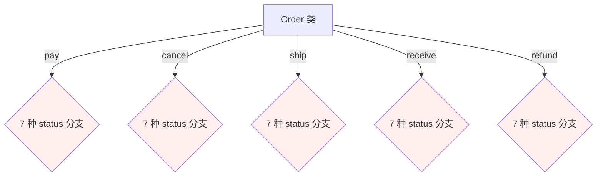
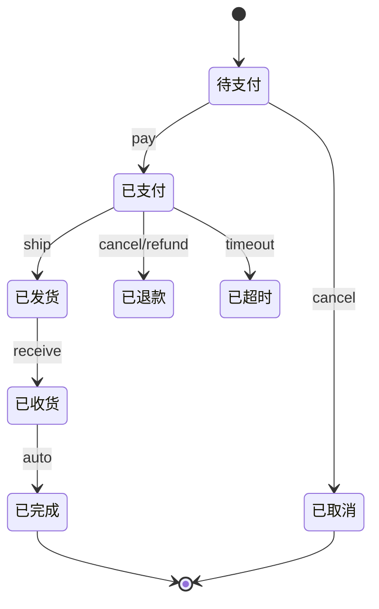
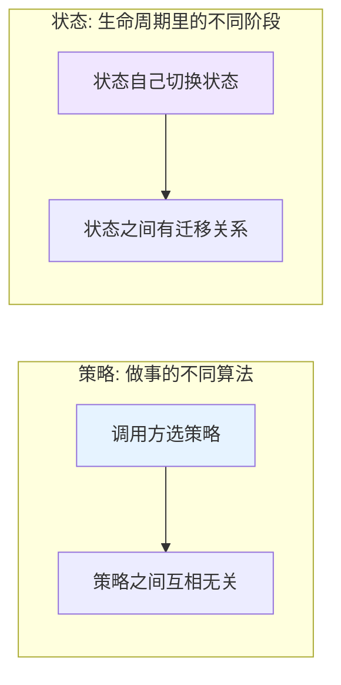
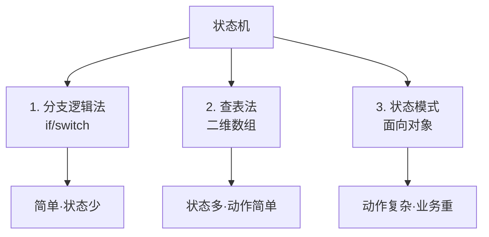
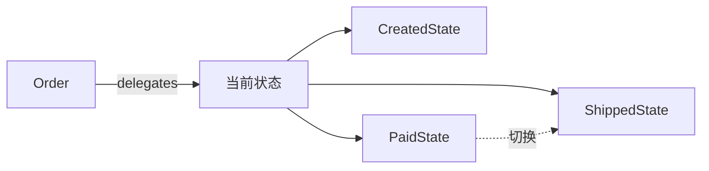
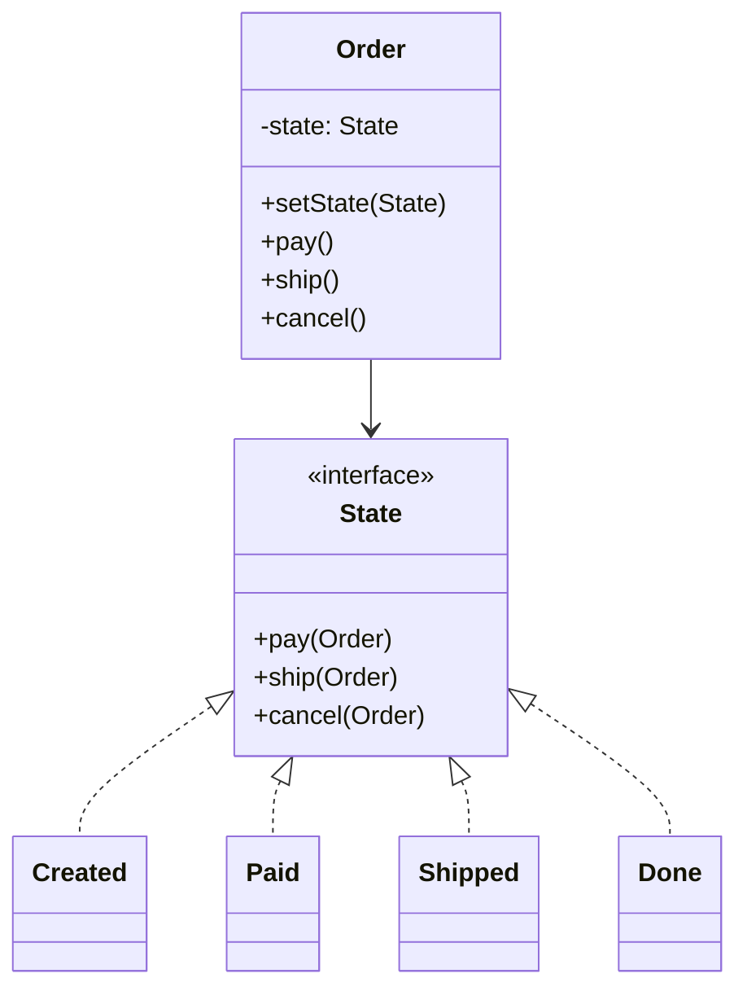
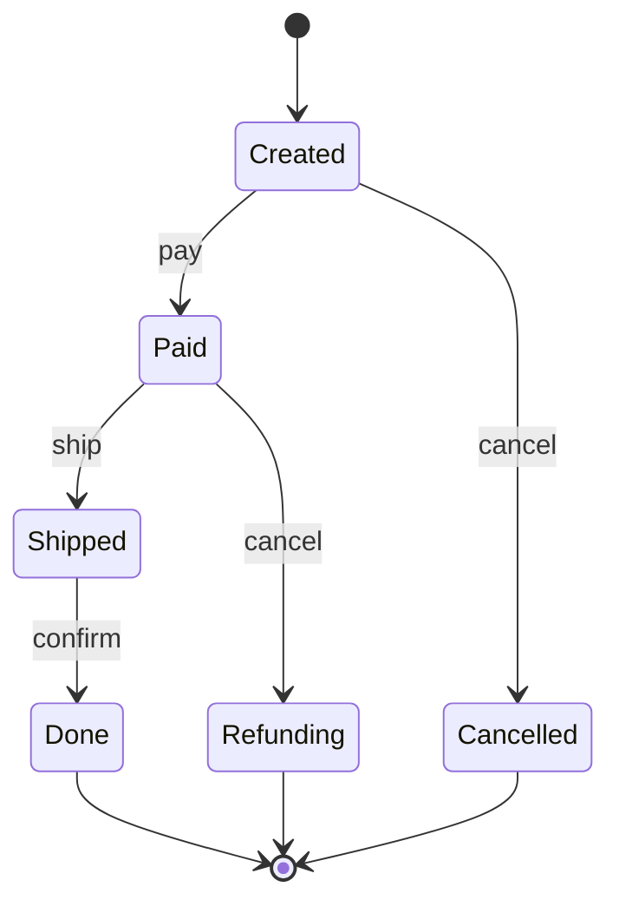
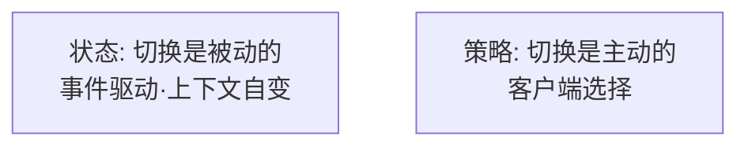
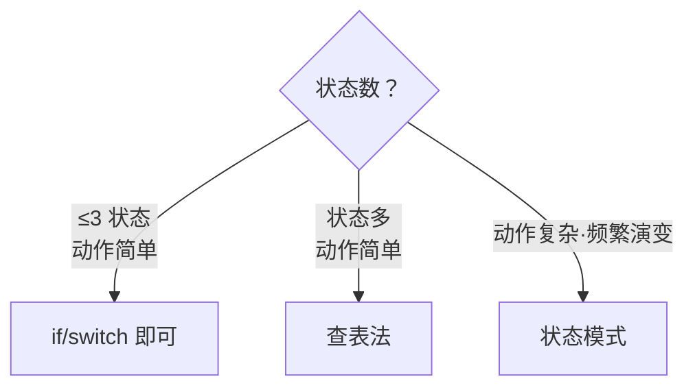

# 19.状态模式设计思想

#### 目录介绍

- 01.案例引入与思考
- 02.状态模式基础介绍
- 03.状态模式原理
- 04.状态模式结构
- 05.状态模式案例
- 06.状态模式分析
- 07.状态模式总结

---

## 01.案例引入与思考

> **本篇主线**：对象的行为随"当前状态"剧烈变化

### 1.1 痛点场景

上一篇用命令模式解决了"支付成功后的动作"。下单后，订单进入自己的"一生"：

```
待支付 → 已支付 → 已发货 → 已收货 → 已完成
     ↓        ↓       ↓
    已取消  已退款  已超时
```

用户能做的动作：**付款、取消、发货、收货、申请退款**。每个动作在不同状态下行为完全不同：

```java
public class Order {
    private String status;  // "待支付/已支付/已发货/已收货/已完成/已取消/..."

    public void pay() {
        if ("待支付".equals(status)) { /* 真付款 */ status = "已支付"; }
        else if ("已支付".equals(status)) throw new Exception("已支付过");
        else if ("已取消".equals(status)) throw new Exception("订单已取消");
        else if ("已完成".equals(status)) throw new Exception("订单已完成");
        // ...
    }
    public void cancel() {
        if ("待支付".equals(status)) { status = "已取消"; }
        else if ("已支付".equals(status)) { /* 发起退款 */ status = "已退款"; }
        else if ("已发货".equals(status)) throw new Exception("已发货不能取消");
        // ...
    }
    public void ship() {
        if ("已支付".equals(status)) { status = "已发货"; }
        else if ("待支付".equals(status)) throw new Exception("还没付款");
        // ...
    }
    // receive / refund / expire ... 每个方法都是 7 个 if-else
}
```



**7 个状态 × 5 个动作 = 35 个 if-else 分支**——整个订单类上千行。

### 1.2 它哪里不舒服

- ❌ **分支爆炸**：状态数 × 动作数 的笛卡尔积分支，且逻辑散落每个方法里；
- ❌ **状态迁移不可见**：要知道"已支付能走到哪"必须翻完所有方法才能拼出状态图；
- ❌ **无法防止非法转换**：有人忘了判状态就改 `status = "已完成"` → 数据错乱；
- ❌ **新增状态灾难**：产品加一个"已拆单"状态 → 所有方法都要加分支；
- ❌ **单测困难**：每个动作要覆盖 7 种状态 × N 种前置条件；
- ❌ **可视化缺位**：状态机图纸和代码分离，时间久了对不上。

### 1.3 引出本篇主角

> **状态模式（State）的核心思想**：把\"每个状态\"做成一个类，状态类自己决定能做什么、不能做什么、做完迁到哪个状态。`Order` 只持有\"当前状态对象\"引用，把所有行为委派给它。

```java
interface OrderState {
    default void pay(Order ctx)    { throw new IllegalStateException(); }
    default void cancel(Order ctx) { throw new IllegalStateException(); }
    default void ship(Order ctx)   { throw new IllegalStateException(); }
}

class WaitPayState implements OrderState {
    public void pay(Order ctx)    { /* 真付款 */ ctx.setState(new PaidState()); }
    public void cancel(Order ctx) { ctx.setState(new CancelledState()); }
}
class PaidState implements OrderState {
    public void cancel(Order ctx) { /* 退款 */ ctx.setState(new RefundedState()); }
    public void ship(Order ctx)   { ctx.setState(new ShippedState()); }
}
// ... 其他状态类各自实现自己能做的动作

// Order 只做委派
public class Order {
    private OrderState state = new WaitPayState();
    public void pay()    { state.pay(this); }
    public void cancel() { state.cancel(this); }
    public void ship()   { state.ship(this); }
    public void setState(OrderState s){ this.state = s; }
}
```



**状态 vs 策略**（本篇会详谈）：



TCP 协议栈（CLOSED/LISTEN/ESTABLISHED…）、工作流引擎、游戏角色 AI、支付状态机——都是状态模式的重头戏。

---

## 02.状态模式基础介绍

### 2.1 模式动机

实际开发里"状态机"无处不在：订单、TCP 连接、电梯、工作流、游戏角色。状态机的两大核心：

- **状态**：当前所处阶段；
- **事件**：触发状态转移的输入。

朴素实现要么 `if-else` 巨长，要么二维数组难读。状态模式给出第三条路。

### 2.2 模式定义

> 允许一个对象在其内部状态改变时改变它的行为。对象看起来好像修改了它的类。

### 2.3 三种实现方式（Fowler 总结）



订单系统属于第 3 类：动作复杂、业务规则随版本演变频繁。

---

## 03.状态模式原理

### 3.1 朴素 if-else

```java
// 反例
public void pay(Order o) {
    if (o.status == CREATED) { /* 扣款，改 PAID */ }
    else if (o.status == PAID) throw new IllegalStateException();
    else if (o.status == CANCELLED) throw new IllegalStateException();
    // ……
}
public void ship(Order o) {
    if (o.status == PAID) { /* 发货 */ }
    else if (o.status == ...) ...
}
// 加一个动作：所有 if 链都要改
// 加一个状态：所有 if 链也要改
```

**两个维度（状态 × 动作）的笛卡尔积**全摊在 `Order` 上。

### 3.2 状态模式改造



每个状态是个类，动作是状态对象的方法。"加状态"只新建类，"加动作"在接口加方法。

---

## 04.状态模式结构

### 4.1 结构图



### 4.2 角色

- **Context（订单）**：持有当前状态，把请求委托给它；
- **State（状态接口）**：声明所有动作；
- **ConcreteState**：每种状态自己实现动作和转移规则。

---

## 05.状态模式案例

### 5.1 订单状态机

```java
public interface OrderState {
    void pay(Order o);
    void ship(Order o);
    void cancel(Order o);
}

public class CreatedState implements OrderState {
    public void pay(Order o)    { /* 扣款 */ o.setState(new PaidState()); }
    public void ship(Order o)   { throw new IllegalStateException("未支付不能发货"); }
    public void cancel(Order o) { o.setState(new CancelledState()); }
}

public class PaidState implements OrderState {
    public void pay(Order o)    { throw new IllegalStateException("已支付"); }
    public void ship(Order o)   { /* 发货 */ o.setState(new ShippedState()); }
    public void cancel(Order o) { /* 触发退款 */ o.setState(new RefundingState()); }
}

public class ShippedState implements OrderState { ... }
public class DoneState implements OrderState    { ... }   // 全 throw
public class CancelledState implements OrderState { ... } // 全 throw
```

### 5.2 Order 上下文

```java
public class Order {
    private OrderState state = new CreatedState();
    public void setState(OrderState s) { this.state = s; }

    public void pay()    { state.pay(this); }
    public void ship()   { state.ship(this); }
    public void cancel() { state.cancel(this); }
}

// 使用
Order o = new Order();
o.pay();    // CreatedState → PaidState
o.ship();   // PaidState → ShippedState
o.cancel(); // 抛异常: 已发货不能直接 cancel，要走退货流程
```

### 5.3 状态转移图（业务文档可直接用）



> 这张图给产品看就是流程，给开发看就是类的拓扑——**状态模式的最大价值之一是让代码与状态图一一对应**。

### 5.4 真实世界的状态模式

| 系统 | 状态 |
|------|------|
| TCP | CLOSED / LISTEN / ESTABLISHED / FIN_WAIT… |
| 工作流引擎 | 节点状态 |
| 游戏角色 | 站立 / 跑 / 跳 / 攻击 / 死亡 |
| AQS（Java 锁框架）| 内部状态字段 |
| 视频播放器 | 缓冲 / 播放 / 暂停 / 错误 |

---

## 06.状态模式分析

### 6.1 优点

- 状态转移**显式**：从代码就能看出整张状态图；
- 加新状态、新动作都是"加类/加方法"，符合 OCP；
- 每种状态的复杂业务逻辑可独立测试。

### 6.2 缺点

- 状态多时类数量爆炸（10 状态 × 5 动作 = 50 个方法）；
- 状态间共享数据需要绕一下（通过 Context 传）；
- 状态对象**频繁 new**，可结合**享元**模式优化（无内蕴状态时单例化）。

### 6.3 状态 vs 策略

两者**结构几乎相同**——都是 Context 持有接口。但意图不同：



| 维度 | 状态 | 策略 |
|------|------|------|
| 谁切换 | 上下文/状态对象本身 | 客户端 |
| 变化频率 | 高（生命周期内不停变）| 低（一次设定多次使用）|
| 状态间是否互知 | 是（A 切到 B）| 否（互相独立）|

### 6.4 模式联动

- **与命令模式**：每个状态转移可包装成命令，便于审计/回滚；
- **与享元模式**：无内部数据的状态对象可单例享元化；
- **与观察者模式**：状态变化时广播事件（订单已发货 → 通知物流监控）。

---

## 07.状态模式总结

### 7.1 一句话记忆

> 状态模式 = **状态机的面向对象表达**。

### 7.2 选型决策



### 7.3 思考题

我们的订单状态模式跑得不错。但**多线程并发**调 `o.pay()` 和 `o.cancel()` 会出问题——状态模式本身**不解决并发**。如何加锁？怎么避免锁住整个 Order？（提示：CAS 或细粒度锁 + 状态校验）

下一站建议阅读 [20.备忘录模式](20.备忘录模式设计思想.md)——状态切换错了，能否一键撤回？
