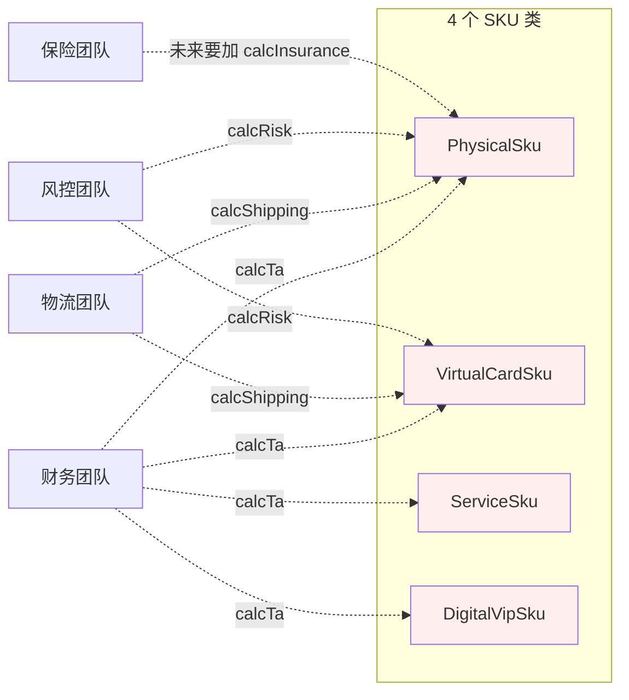
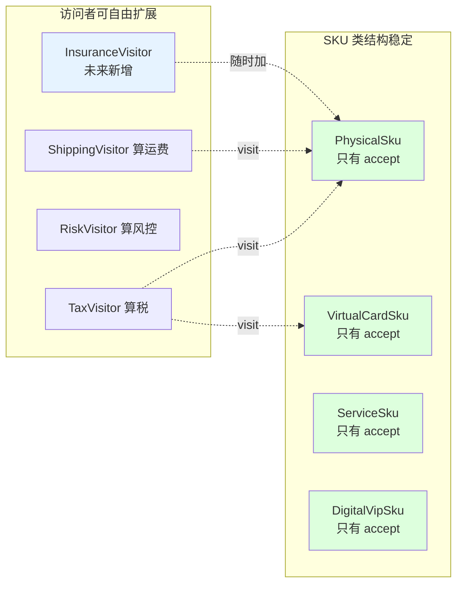
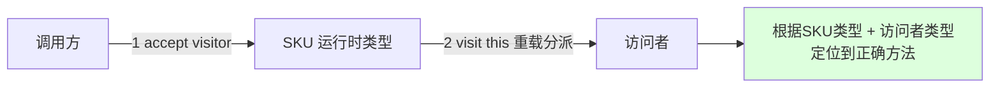
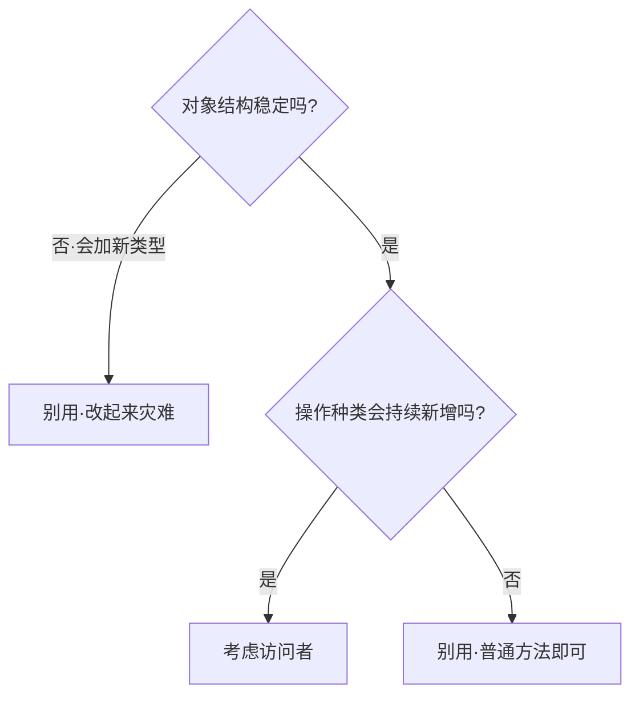
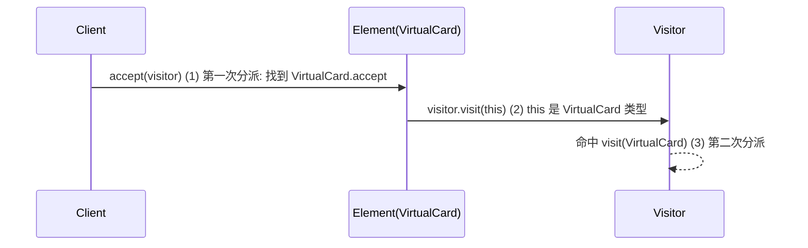
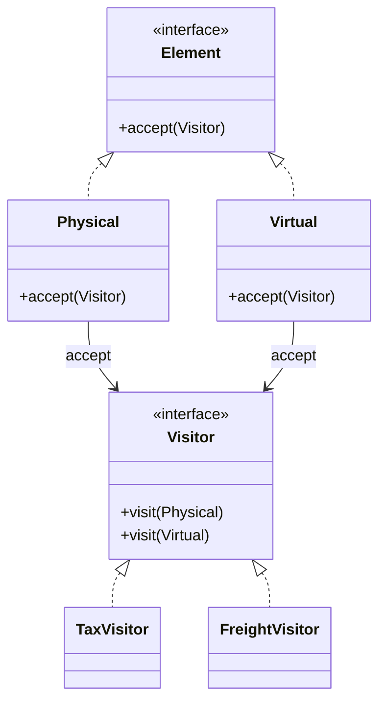
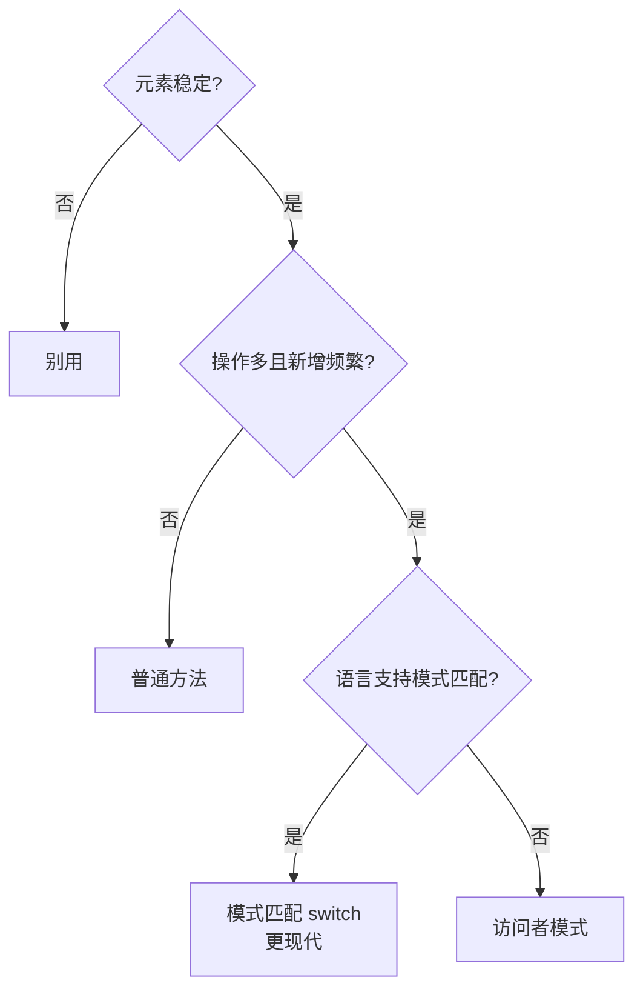

# 22.访问者模式设计思想

#### 目录介绍

- 01.案例引入：4 种 SKU × 3 个团队的算法，SKU 类要被改到什么时候
- 02.访问者模式基础介绍
- 03.访问者模式原理
- 04.访问者模式结构
- 05.访问者模式案例
- 06.访问者模式分析
- 07.访问者模式总结

---

## 01.案例引入：4 种 SKU × 3 个团队的算法，SKU 类要被改到什么时候

> **本篇主线**：对象结构稳定，但"对它做什么"经常新增

### 1.1 痛点场景

电商商品有 4 种 SKU 类型：**实物商品、虚拟卡券、服务订单、数字会员**。三个团队都要对所有 SKU 各算各的：

- 财务团队：**算税**（不同 SKU 税率不同）
- 物流团队：**算运费**（实物/虚拟/数字完全不同）
- 风控团队：**算风险评分**

第一版实现：给每个 SKU 类加方法。

```java
class PhysicalSku {
    BigDecimal calcTax()     { /* 实物商品税率 */ }
    BigDecimal calcShipping(){ /* 按重量体积 */ }
    int        calcRisk()    { /* 有实体仓发货风控 */ }
}
class VirtualCardSku {
    BigDecimal calcTax()     { /* 虚拟品无增值税 */ }
    BigDecimal calcShipping(){ return ZERO; }
    int        calcRisk()    { /* 防羊毛党重点 */ }
}
class ServiceSku   { /* 3 个方法 */ }
class DigitalVipSku{ /* 3 个方法 */ }

// 每次加一个团队的新算法：
// 保险团队要算保费 → 4 个 SKU 类都加 calcInsurance()
// 碳排放团队要算碳排 → 4 个 SKU 类又加 calcCarbon()
// 合规团队要算合规评分 → 4 个 SKU 类再加 calcCompliance()
```



### 1.2 它哪里不舒服

- ❌ **SKU 类永远被打扰**：SKU 本身是稳定的业务实体，却因"外人要算点啥"被频繁改动；
- ❌ **违反单一职责**：SKU 类既管自己的数据，又管税、运费、风控、保险——什么都管；
- ❌ **跨团队冲突**：4 个团队的 PR 同时落在 SKU 文件上，合并冲突天天见；
- ❌ **算法分散难对账**：财务想审查"实物商品税率"——要翻 4 个 SKU 类才能凑齐；
- ❌ **添加新算法 = 改 N 个类**：每加一个维度，4 个 SKU 类都要改——违反开闭原则；
- ❌ **算法内部需要访问私有字段**：要么把字段 public，要么在 SKU 里写一个臃肿的 public API。

### 1.3 引出本篇主角

> **访问者模式（Visitor）的核心思想**：SKU 结构稳定不变，\"对它做什么\"抽象成一个\"访问者\"。每个访问者（财务访问者/物流访问者）实现\"访问每种 SKU\"的方法；SKU 自己只需要一个 `accept(visitor)` 方法把自己\"交出去\"。新增一个维度 = 新增一个访问者类，**SKU 一行不用动**。

```java
interface SkuVisitor<R> {
    R visit(PhysicalSku sku);
    R visit(VirtualCardSku sku);
    R visit(ServiceSku sku);
    R visit(DigitalVipSku sku);
}

abstract class Sku {
    abstract <R> R accept(SkuVisitor<R> v);
}
class PhysicalSku extends Sku {
    public <R> R accept(SkuVisitor<R> v){ return v.visit(this); }
}

// 财务访问者：算税
class TaxVisitor implements SkuVisitor<BigDecimal> {
    public BigDecimal visit(PhysicalSku s)   { return s.price.multiply(...); }
    public BigDecimal visit(VirtualCardSku s){ return ZERO; }
    public BigDecimal visit(ServiceSku s)    { return ...; }
    public BigDecimal visit(DigitalVipSku s) { return ...; }
}

// 物流访问者：算运费（另一个类，SKU 完全不知道）
class ShippingVisitor implements SkuVisitor<BigDecimal> { ... }

// 用
BigDecimal tax = sku.accept(new TaxVisitor());
BigDecimal fee = sku.accept(new ShippingVisitor());
```



访问者模式的\"两次分派（Double Dispatch）\"是本篇的关键细节——为什么要写 `accept + visit` 两个方法（本篇会详谈）：



编译器 AST 遍历（同一棵树，做类型检查、代码生成、格式化）、ASM 字节码处理、Jackson 的 `JsonNode.accept()`、Lombok 的 AST 处理——都是访问者的工业级落地。

**适用场景边界**：对象结构\"稳定\"是大前提。如果 SKU 类型本身会频繁新增，访问者就不合适了（每加一个 SKU 要改所有访问者）。

---

## 02.访问者模式基础介绍

### 2.1 模式动机

OOP 鼓励"数据 + 行为"放一起，但当**操作的种类**比"数据的种类"变化更频繁时，硬塞进数据类反而违反 SRP。访问者把这两个变化方向**正交分离**。

### 2.2 模式定义

> 表示一个作用于某对象结构中的各元素的操作。它可以让你在不改变各元素的类的前提下，定义作用于这些元素的新操作。

### 2.3 何时考虑（与何时**不**用）



> **判断标准很硬性**：元素稳定 + 操作多变。反过来则禁用——这是访问者最大的"反人类"特点。

---

## 03.访问者模式原理

### 3.1 重载 vs 重写：单分派的局限

```java
class Visitor {
    void visit(PhysicalGoods g) { ... }
    void visit(VirtualCard g)   { ... }
    void visit(ServiceItem g)   { ... }
}

Goods g = new VirtualCard();
visitor.visit(g);   // 编译错误！或调用错版本
```

**Java/C++ 是单分派**——重载方法靠**编译期声明类型**决定调谁，而非运行期实际类型。所以仅靠"重载方法名"行不通。

### 3.2 双分派（Double Dispatch）

访问者用一个**精巧的两步**绕过单分派限制：



第一次分派由元素的运行时类型决定走哪个 `accept`，第二次分派由 `visit` 重载根据 `this`（编译期已固定为 `VirtualCard`）选中正确版本。**双分派的本质是用一次多态走到对的元素，再把"我是什么"通过 this 显式告诉访问者**。

---

## 04.访问者模式结构

### 4.1 结构图



### 4.2 角色

- **Element（元素）**：被访问对象，定义 `accept(Visitor)`；
- **ConcreteElement**：实现 `accept`，里面调 `v.visit(this)`；
- **Visitor（访问者接口）**：为每种 Element 重载 `visit`；
- **ConcreteVisitor**：具体操作（算税、算运费、算风险）；
- **ObjectStructure**：管理元素集合（如订单的 SKU 列表）。

---

## 05.访问者模式案例

### 5.1 SKU 多操作

```java
// 元素体系
public interface Goods { void accept(GoodsVisitor v); }

public class Physical implements Goods {
    double weight; double price;
    public void accept(GoodsVisitor v) { v.visit(this); }
}
public class Virtual implements Goods {
    double price;
    public void accept(GoodsVisitor v) { v.visit(this); }
}
public class Service implements Goods {
    double price; int hours;
    public void accept(GoodsVisitor v) { v.visit(this); }
}

// 访问者接口
public interface GoodsVisitor {
    void visit(Physical g);
    void visit(Virtual g);
    void visit(Service g);
}

// 三个具体访问者
public class TaxVisitor implements GoodsVisitor {
    double tax = 0;
    public void visit(Physical g) { tax += g.price * 0.13; }
    public void visit(Virtual g)  { tax += g.price * 0.06; }
    public void visit(Service g)  { tax += g.price * 0.06; }
}
public class FreightVisitor implements GoodsVisitor {
    double freight = 0;
    public void visit(Physical g) { freight += g.weight * 2; }
    public void visit(Virtual g)  { /* 0 */ }
    public void visit(Service g)  { /* 0 */ }
}
public class RiskVisitor implements GoodsVisitor { ... }

// 使用
List<Goods> cart = List.of(new Physical(...), new Virtual(...), new Service(...));
TaxVisitor tax = new TaxVisitor();
cart.forEach(g -> g.accept(tax));
System.out.println("税: " + tax.tax);
```

需求新增"碳排放统计"？**只新建一个 `CarbonVisitor`**，三个 SKU 类、收银主流程一行不动。

### 5.2 ASTVisitor：业界最经典的访问者

编译器/AST 工具是访问者的"原生场景"：

| 工具 | 访问者 |
|------|--------|
| Java JDT | `ASTVisitor` |
| Babel | `Visitor` 钩子 |
| Roslyn (C#) | `CSharpSyntaxWalker` |
| LLVM | `RecursiveASTVisitor` |

为什么？AST 节点种类**极其稳定**，但**对它做的事情**层出不穷——格式化、Lint、静态分析、覆盖率埋点、文档生成…… 完全契合访问者的硬要求。

### 5.3 用 instanceof / switch 替代？

```java
// 朴素写法
for (Goods g : cart) {
    if (g instanceof Physical p) tax += p.price * 0.13;
    else if (g instanceof Virtual v) tax += v.price * 0.06;
    // ……
}
```

可行——而且 Java 17+ 的 sealed interface + 模式匹配 switch 让它极其优雅：

```java
sealed interface Goods permits Physical, Virtual, Service {}

double tax = cart.stream().mapToDouble(g -> switch (g) {
    case Physical p -> p.price * 0.13;
    case Virtual  v -> v.price * 0.06;
    case Service  s -> s.price * 0.06;
}).sum();
```

> **现代 Java/Kotlin/Scala 的模式匹配，部分场景已能替代访问者**。访问者在新语言里地位下降，但在没有模式匹配的场景仍是首选。

---

## 06.访问者模式分析

### 6.1 优点

- **新增操作零改动元素**：完美 OCP 之于"操作维度"；
- **职责清晰**：算税的代码集中在 `TaxVisitor`；
- **跨结构遍历集中**：访问者一次访问可计算多个统计。

### 6.2 缺点

- **新增元素类是灾难**：所有访问者都要加 `visit` 方法（OCP 在"元素维度"反向破坏）；
- **可读性差**：双分派对不熟悉的人很费解；
- **破坏元素封装**：visit 内部要 get 元素私有数据。

### 6.3 模式选型决策



### 6.4 访问者 vs 迭代器

| 维度 | 迭代器 | 访问者 |
|------|--------|--------|
| 解耦的是 | 容器与遍历 | 元素与操作 |
| 新增什么免改 | 新容器/新遍历 | 新操作 |
| 元素类型 | 同质或泛型 | 多种异构 |

### 6.5 模式联动

- **与组合模式**：访问者最常作用于"组合树"上（菜单/AST）；
- **与迭代器**：迭代器负责遍历方式，访问者负责到达节点后做什么——常组合使用；
- **与外观模式**：复杂访问可外观化对外提供单方法。

---

## 07.访问者模式总结

### 7.1 一句话记忆

> 访问者 = **元素稳定 + 操作多变 + 双分派**。

### 7.2 适用环境

编译器 AST、报表统计、跨类型聚合计算、文件树扫描、UI 树遍历。

### 7.3 思考题

我们的 SKU 体系如果**未来一定会加新类型**（比如"组合套餐"），还能用访问者吗？怎样把"加元素的痛"降到最低？（提示：默认实现 + 抽象基类）

下一站建议阅读 [23.解释器模式](23.解释器模式设计思想.md)——本系列最后一个、也是最像"小型 DSL 设计"的模式。
