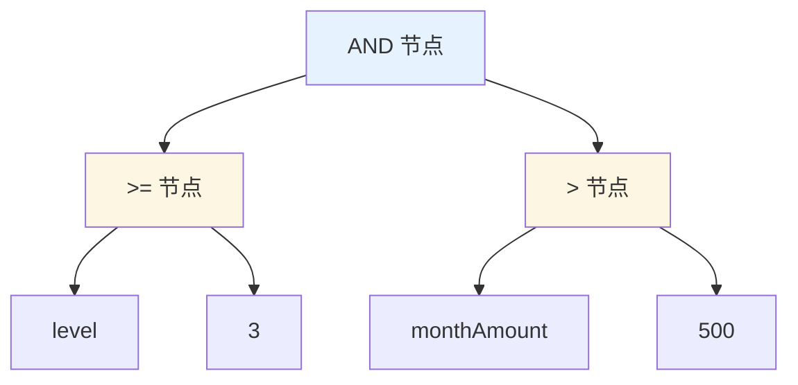
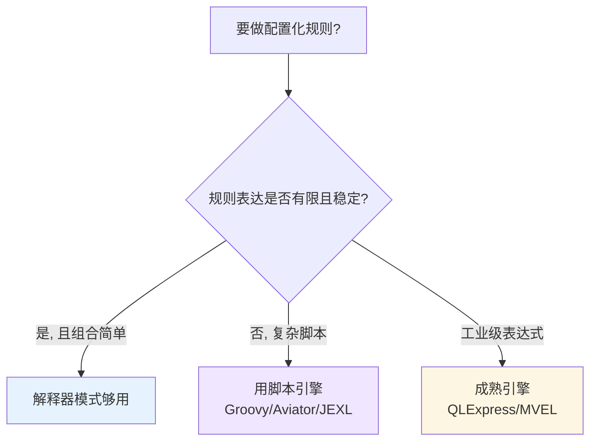
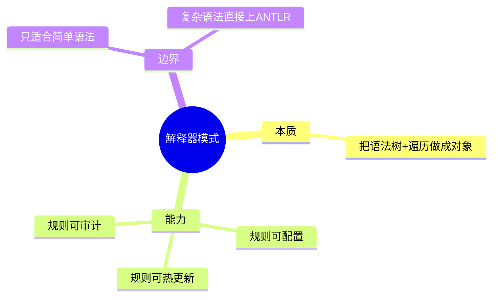
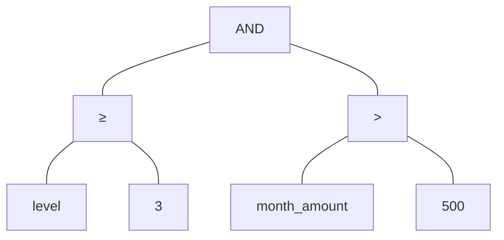
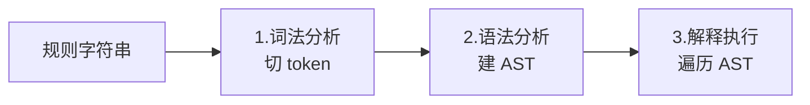
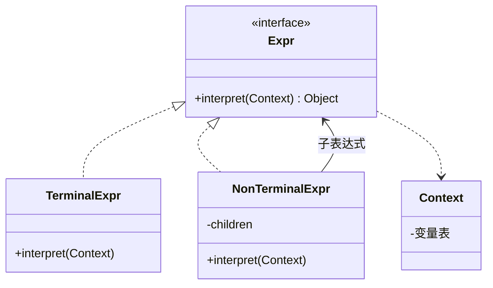
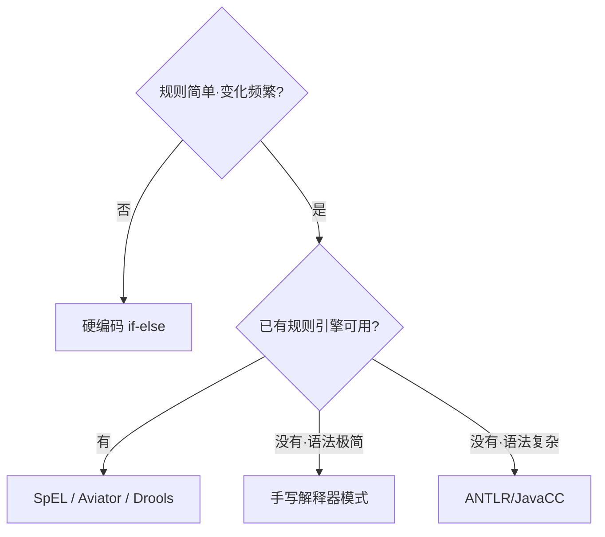
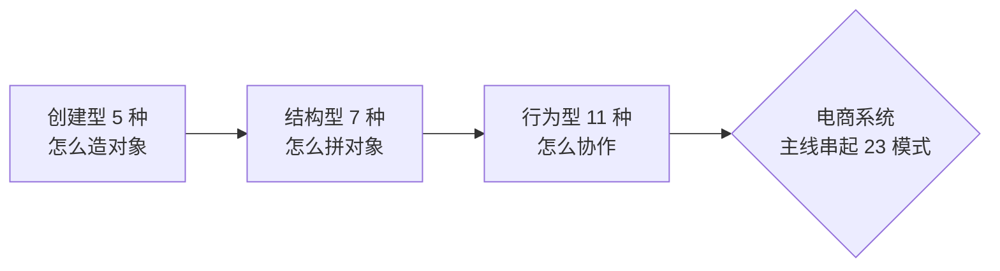

# 23.解释器模式设计思想

#### 目录介绍

- 01.案例引入与思考
- 02.解释器模式基础介绍
- 03.解释器模式原理
- 04.解释器模式结构
- 05.解释器模式案例
- 06.解释器模式分析
- 07.解释器模式总结

---

## 01.案例引入与思考

> **本篇主线**：可变的业务规则被硬编码进不可变的代码

### 1.1 痛点场景

电商促销运营每周都在改规则，而且规则逻辑表达非常灵活：

```
规则 A：会员等级 ≥ 3 且 本月消费 > 500 → 赠 50 积分
规则 B：下单时间在双11当天 且 商品类目 = 美妆 → 立减 20 元
规则 C：连续签到 ≥ 7 天 或 邀请好友 ≥ 3 → 发优惠券
规则 D：(年龄 ≥ 18 且 注册时长 > 30 天) 或 VIP等级 = 黑卡 → 可参加
```

第一版实现：每条规则在代码里写一个 `if` 方法。

```java
public class PromotionService {
    public boolean matchRuleA(User u) {
        return u.getLevel() >= 3 && u.getMonthAmount() > 500;
    }
    public boolean matchRuleB(Order o) {
        return isDoubleEleven(o.getTime()) && "美妆".equals(o.getCategory());
    }
    public boolean matchRuleC(User u) {
        return u.getSignDays() >= 7 || u.getInviteCount() >= 3;
    }
    // 下周又来 5 条新规则 → 加 5 个方法、打包发版...
}
```


### 1.2 它哪里不舒服

- ❌ **运营被迫等开发**：规则上线周期从\"改配置的几分钟\"变成\"发版的几小时到几天\"；
- ❌ **代码库膨胀**：每条促销规则一个方法，一年下来几百上千条，大部分都已下线却没人敢删；
- ❌ **组合逻辑复杂**：`(A 且 B) 或 (C 且非 D)`——用 if 写得又丑又长，改动风险大；
- ❌ **A/B 测试沉重**：想对 10% 用户试一条新规则——要改代码 + 配灰度 + 测试 + 发版；
- ❌ **审计困难**：\"去年双十一到底用了哪些促销规则？\"——要翻 git 历史；
- ❌ **业务人员不可参与**：运营只能写 Word 描述规则，翻译成代码全靠开发理解——经常翻译错。

### 1.3 引出本篇主角

> **解释器模式（Interpreter）的核心思想**：为这类\\\"灵活多变的规则\\\"设计一套**简单语法**（迷你 DSL），再实现一个**解释器**去运行它。规则变成配置数据（可以存库、可以热更新），代码只维护\\\"如何解释\\\"这个稳定骨架。

```java
// 运营填的规则（存在数据库/配置中心）：
String ruleA = "level >= 3 AND monthAmount > 500";
String ruleD = "(age >= 18 AND regDays > 30) OR vipLevel == 'BLACK'";

// 系统解析 + 执行
Expression expr = parser.parse(ruleA);
Map<String,Object> ctx = Map.of("level", u.level, "monthAmount", u.amount);
boolean matched = expr.interpret(ctx);   // true / false
```

表达式被建成一棵**抽象语法树（AST）**，解释器递归求值：



引入解释器之后，工作流彻底换了：


**适用边界**：解释器并不是万能的（本篇会详谈）——



SQL 解析器、正则引擎、Spring EL、Drools、Aviator、QLExpress、编译器前端、Excel 公式引擎——都是解释器模式的真实落地。本篇会手写一个**促销规则迷你解释器**，从"文法设计 → 词法 → 语法树 → 求值"走完一整轮。

---

## 02.解释器模式基础介绍

### 2.1 模式动机

某些业务规则的**变化频率**和**表达灵活性**远超普通代码——硬编码就是与运营的拉锯战。让规则脱离代码、变成**可配置的表达式**，是终极解法。

### 2.2 模式定义

> 给定一个语言，定义它的文法的一种表示，并定义一个解释器，这个解释器使用该表示来解释语言中的句子。

### 2.3 关键认识



### 2.4 何时考虑

- 规则**频繁变化**且**结构相似**；
- 规则可被**有限的语法描述**（操作符、变量、函数）；
- 规则要被**非开发人员**编辑（配置后台、运营平台）。

---

## 03.解释器模式原理

### 3.1 核心思想：句子 → 树

任何"会变的规则"，先用一种迷你语法描述。比如：

```
level >= 3 AND month_amount > 500
```

它在内存里就是一棵树：



每一类节点（AND/OR/比较/常量/变量）都是一个**表达式类**，自己知道怎么"解释自己"。整棵树解释完，规则也就执行完了。

### 3.2 三步走



解释器模式重点是**第 3 步**——AST 的设计与执行。1、2 步可以手写，复杂语法用 ANTLR 等工具直接生成。

---

## 04.解释器模式结构

### 4.1 结构图



### 4.2 角色

- **AbstractExpression**：所有表达式的抽象，定义 `interpret`；
- **TerminalExpression**：终结符（变量、常量）；
- **NonTerminalExpression**：非终结符（AND/OR/比较）；
- **Context**：解释时所需的上下文（如当前用户、订单数据）；
- **Client**：构建 AST 并调用 `interpret`。

---

## 05.解释器模式案例

### 5.1 促销规则解释器

定义最小语法：

```
expr   := or
or     := and ('OR' and)*
and    := cmp ('AND' cmp)*
cmp    := var ('>=' | '>' | '<=' | '<' | '==') number
var    := identifier
number := [0-9]+
```

支持的规则示例：

```
level >= 3 AND month_amount > 500
day == 1111 OR vip == 1
```

#### 表达式节点

```java
public interface Expr { boolean eval(Map<String, Object> ctx); }

public class Var implements Expr {
    private final String name;
    public Var(String n) { name = n; }
    public boolean eval(Map<String, Object> ctx) { return true; } // 占位
    public Number value(Map<String, Object> ctx) { return (Number) ctx.get(name); }
}

public class Cmp implements Expr {
    private final String op;
    private final Var left;
    private final Number right;
    public Cmp(Var l, String o, Number r) { left = l; op = o; right = r; }
    public boolean eval(Map<String, Object> ctx) {
        double a = left.value(ctx).doubleValue();
        double b = right.doubleValue();
        return switch (op) {
            case ">"  -> a >  b;
            case ">=" -> a >= b;
            case "<"  -> a <  b;
            case "<=" -> a <= b;
            case "==" -> a == b;
            default -> false;
        };
    }
}

public class And implements Expr {
    private final Expr l, r;
    public And(Expr l, Expr r) { this.l = l; this.r = r; }
    public boolean eval(Map<String, Object> ctx) { return l.eval(ctx) && r.eval(ctx); }
}

public class Or implements Expr {
    private final Expr l, r;
    public Or(Expr l, Expr r) { this.l = l; this.r = r; }
    public boolean eval(Map<String, Object> ctx) { return l.eval(ctx) || r.eval(ctx); }
}
```

#### 简易 Parser（递归下降）

```java
public class Parser {
    private final List<String> tokens;
    private int i = 0;
    public Parser(String src) { this.tokens = tokenize(src); }

    public Expr parse() { return or(); }
    private Expr or() {
        Expr l = and();
        while (peek("OR")) { eat(); l = new Or(l, and()); }
        return l;
    }
    private Expr and() {
        Expr l = cmp();
        while (peek("AND")) { eat(); l = new And(l, cmp()); }
        return l;
    }
    private Expr cmp() {
        Var v = new Var(eat());
        String op = eat();
        Number n = Double.parseDouble(eat());
        return new Cmp(v, op, n);
    }
    // tokenize/peek/eat 略
}
```

#### 使用

```java
String rule = "level >= 3 AND month_amount > 500";
Expr ast = new Parser(rule).parse();

Map<String, Object> ctx = Map.of("level", 4, "month_amount", 800);
boolean ok = ast.eval(ctx);    // true → 发积分
```

加新规则？**只改配置数据库里的字符串**，不改代码、不发版。

### 5.2 真实世界的解释器

| 场景 | 形式 |
|------|------|
| Spring SpEL | `#user.age > 18` |
| Drools / Aviator / QLExpress | 规则引擎 |
| 数据库 WHERE 子句解析 | SQL parser |
| 模板引擎（Velocity/Freemarker）| 模板 = 表达式语言 |
| 正则引擎 | 正则字符串 → NFA/DFA |
| Excel 公式 | `=SUM(A1:A10)*1.13` |

> 在企业级项目里，"自己写解释器"的场景越来越少——能用 SpEL/Aviator 就用。但**理解它的设计思想**，对设计任何"规则可配置"系统都很重要。

---

## 06.解释器模式分析

### 6.1 优点

- 规则**热更新**、可被非开发人员维护；
- 语法清晰时，AST 与领域对应整齐；
- 易扩展（加节点类型 = 加新语法）。

### 6.2 缺点

- **手写 Parser 很费**——稍复杂就不如 ANTLR；
- 节点类爆炸（每种语法元素一个类）；
- 性能比硬编码差（解析+解释开销，可缓存 AST 缓解）；
- **复杂语法时维护成本高**——本身就要变成一个"小编译器"。

### 6.3 选型决策



### 6.4 模式联动

- **与组合模式**：AST 本身就是组合树，解释器是组合的特例；
- **与访问者模式**：AST 上要做多种处理（求值/打印/优化），用访问者最舒服——SpEL/Babel 都是这套；
- **与策略模式**：不同节点的"如何解释"可视为策略；
- **与单例**：终结符（如常量节点）可享元化。

---

## 07.解释器模式总结

### 7.1 一句话记忆

> 解释器 = **AST 节点对象化 + 自解释**。

### 7.2 适用环境

促销规则、风控规则、报警表达式、模板渲染、SQL/正则、配置驱动行为。

### 7.3 思考题

促销规则解释器跑通了。但运营写错语法时（拼漏 `AND`），系统直接抛 NPE——**怎样给规则编辑器提供友好的语法校验和错误提示**？（提示：分离 Lexer/Parser，构造期就报错；可视化拖拽编辑器规避语法错误）

---

## 系列收束

至此，**23 种 GoF 设计模式**全部完结。回顾我们的电商主线一路走来：



| 阶段 | 我们用了哪些模式 | 解决什么 |
|------|-----------------|----------|
| 商品 | 单例·工厂·建造者·原型·享元 | 对象的诞生 |
| 订单 | 适配器·装饰·外观·桥接·组合·代理 | 对象的拼装 |
| 业务 | 观察者·策略·模板·迭代器·职责链·命令·状态·备忘录·中介·访问者·解释器 | 对象的协作 |

下一站推荐：

- 重读 [05.面向对象设计](../01.面向对象设计/README.md)——把 SOLID 与重构十二式与本专栏对照阅读；
- 阅读《重构》《Clean Code》——把模式当作"写代码时随时取用的工具"，而不是"一定要套上去的模板"；
- 真实项目里，**克制使用模式**比堆砌模式更重要。
