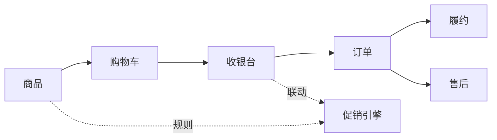
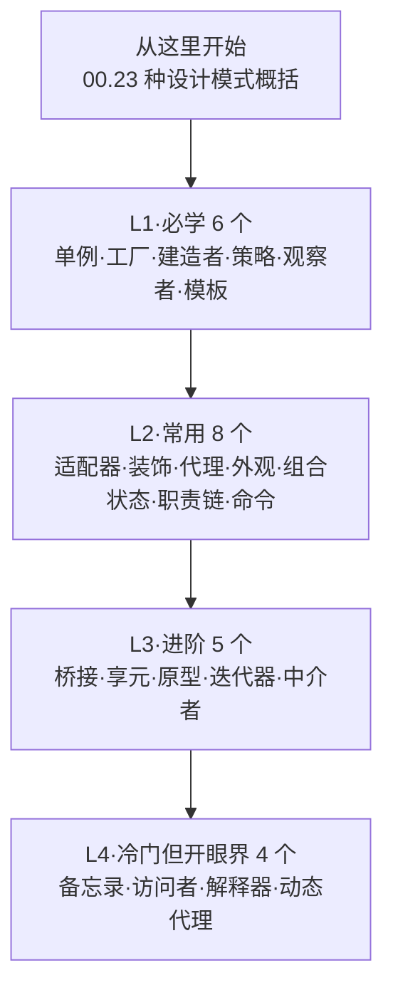
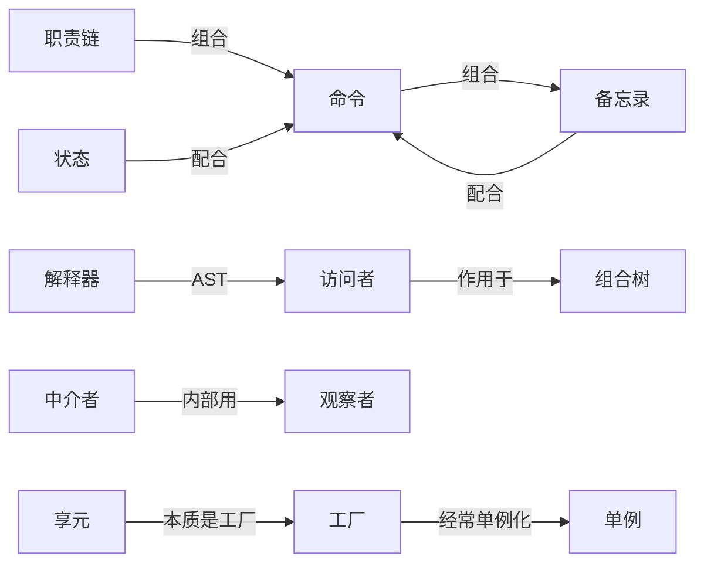

# 巧学设计模式

> **23 种 GoF 设计模式，一条电商主线串到底**——拒绝"模式定义 + UML"的流水账，每篇都从真实业务痛点引入，每篇都告诉你"它和别的模式怎么配"。

## 本专栏不一样的地方

| 别处 | 本专栏 |
|------|--------|
| 模式定义→UML→例子→优缺点 | **痛点引入→原理→案例→模式联动→思考题** |
| 例子之间互相孤立 | 全 23 篇共用**同一个电商系统**主线 |
| 只讲一种模式 | 每篇都标注**与其他模式的协作/对比/替代** |
| 文字描述选型 | 每篇都画 **Mermaid 决策树** |

## 主线案例：电商系统

每个模式都是这套电商系统中的一个具体子需求——读完整个专栏，相当于"在脑子里跑通一个电商架构"。

## 阅读路径

- **3 天速通**：只读 L1（6 篇）即可看懂多数开源代码
- **2 周入门**：L1 + L2（14 篇）覆盖 80% 项目场景
- **1 个月精通**：23 篇全过 + 自己用主线案例搭个 demo

## 完整章节列表

### 0. 总览

| 章节 | 内容 |
|------|------|
| [00.23种设计模式概括](24.23种设计模式概括) | 主线案例 + 速查地图 + 三大类详解 |

### 1. 创建型模式（5 种）

| 章节 | 一句话 | 主线扮演 |
|------|--------|---------|
| [01.单例模式](01.单例模式设计思想.md) | 全局唯一对象 | 配置中心、ID 生成器 |
| [02.工厂模式](02.工厂模式设计思想.md) | 把"造对象"封起来 | 商品/订单工厂 |
| [03.建造者模式](03.建造者模式设计思想.md) | 复杂对象一步步建 | 复杂订单组装 |
| [04.原型模式](04.原型模式设计思想.md) | 拷贝出新对象 | SKU 模板克隆 |
| —（单例的扩展也见此组） | | |

### 2. 结构型模式（7 种）

| 章节 | 一句话 | 主线扮演 |
|------|--------|---------|
| [05.静态代理](05.静态代理设计模式.md) | 加层壳控制访问 | 三方接口代理 |
| [06.动态代理](06.动态代理设计模式.md) | 运行时生成代理 | AOP 日志/事务 |
| [07.适配器模式](07.适配器模式设计思想.md) | 接口转换 | 老支付接口适配 |
| [08.装饰者模式](08.装饰者模式设计思想.md) | 不改原类加功能 | 订单加日志/缓存 |
| [09.外观模式](09.外观模式设计思想.md) | 一站式入口 | 下单门面服务 |
| [10.桥接模式](10.桥接模式设计思想.md) | 抽象与实现解耦 | 多渠道 × 多支付 |
| [11.组合模式](11.组合模式设计思想.md) | 树形结构统一处理 | 商品分类树 |
| [12.享元模式](12.享元模式设计思想.md) ✨ | 对象共享省内存 | 商品图标/品牌 Logo 共享 |

### 3. 行为型模式（11 种）

| 章节 | 一句话 | 主线扮演 |
|------|--------|---------|
| [13.观察者模式](13.观察者模式设计思想.md) | 一对多事件广播 | 订单事件通知 |
| [14.策略模式](14.策略者模式设计思想.md) | 算法可换 | 多种促销算法 |
| [15.模板模式](15.模版模式设计思想.md) | 骨架不变填空 | 多渠道支付骨架 |
| [16.迭代器模式](16.迭代器模式设计思想.md) | 解耦遍历与容器 | 商品列表遍历 |
| [17.职责链模式](17.职责链模式设计思想.md) ✨ | 链式处理 | 下单前置校验链 |
| [18.命令模式](18.命令模式设计思想.md) ✨ | 调用对象化 | 下单后置动作 |
| [19.状态模式](19.状态模式设计思想.md) ✨ | 状态机面向对象 | 订单生命周期 |
| [20.备忘录模式](20.备忘录模式设计思想.md) ✨ | 拍快照可回滚 | 订单变更撤销 |
| [21.中介者模式](21.中介者模式设计思想.md) ✨ | 网状变星状 | 收银页组件协作 |
| [22.访问者模式](22.访问者模式设计思想.md) ✨ | 元素稳·操作变 | SKU 多种统计 |
| [23.解释器模式](23.解释器模式设计思想.md) ✨ | 迷你 DSL 解析 | 促销规则引擎 |

> ✨ 标记为本轮新增（享元 + 7 个行为型），与原有 16 篇组成完整 23 模式专栏。

## 写作约定

每篇文章统一结构：

1. **引子**：电商主线下一个具体痛点
2. **基础介绍**：模式动机 / 定义 / 何时用
3. **原理**：朴素方案的问题 → 模式如何改造
4. **结构**：UML/Mermaid 类图 + 角色
5. **案例**：电商代码 + 真实世界用法
6. **分析**：优缺点 + 与近邻模式对比 + **模式联动**
7. **总结**：一句话记忆 + 选型决策树 + 思考题

## 模式之间的"联动网络"

设计模式真正的威力不在单点，而在组合。本专栏每篇都有**模式联动**小节，部分高频组合举例：

把这张图记住，就懂了"为什么资深工程师从不只用一个模式"。

## 配套延伸

| 方向 | 推荐 |
|------|------|
| OOP 思想根基 | [05.面向对象设计](../01.面向对象设计/README.md) |
| 重构落地能力 | [05.面向对象设计/07.重构十二式](../03.重学设计模式/01.面向对象设计/07.重构十二式实战.md) |
| 真实工程案例 | Spring 源码 / OkHttp 源码 / JDK 集合源码 |
| 进阶阅读 | 《Head First 设计模式》《重构》《Clean Code》 |

## 警告：克制使用模式

学完 23 个模式后最容易犯的错——**到处套模式**。请记住：

> 模式是用来**降低复杂度**的，不是用来**展示水平**的。  
> 当一个 `if` 就能解决的问题，硬上策略模式只会让代码更难懂。

什么时候用模式？**当你已经被痛点折磨到了**，模式才是解药；否则，它就是病。
