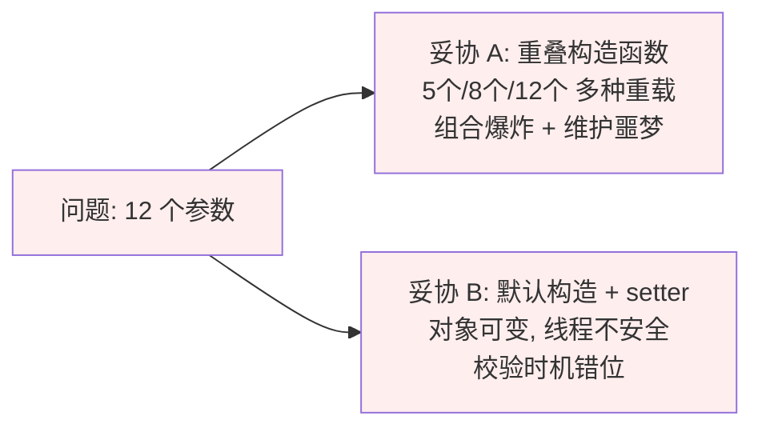
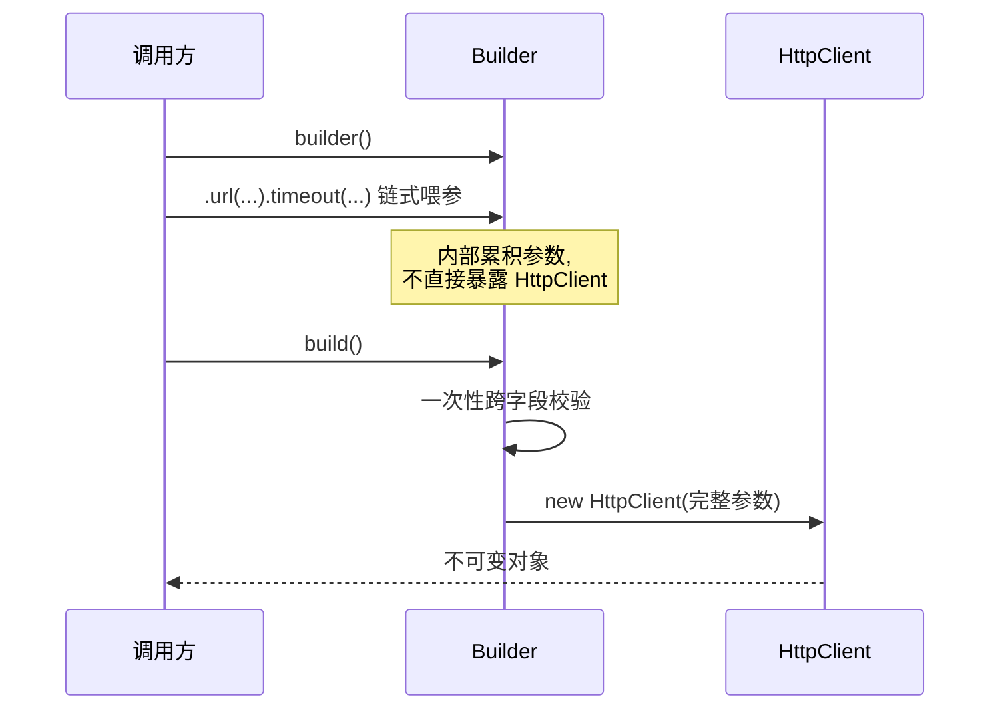
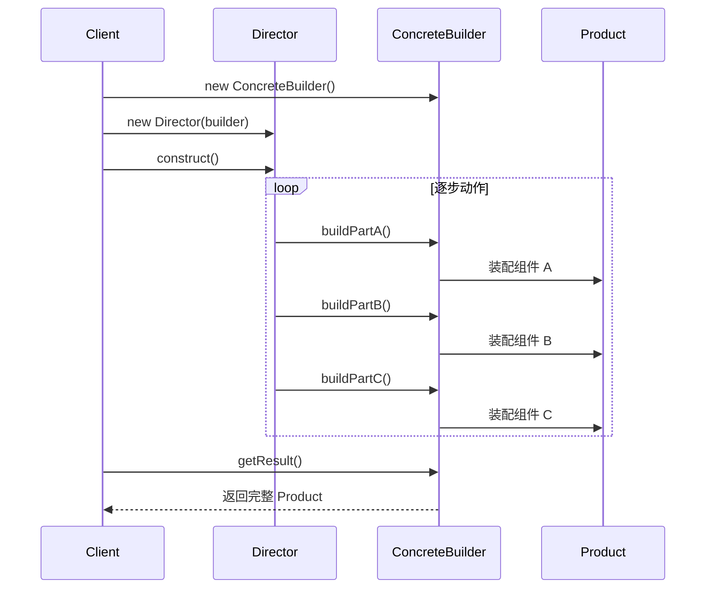
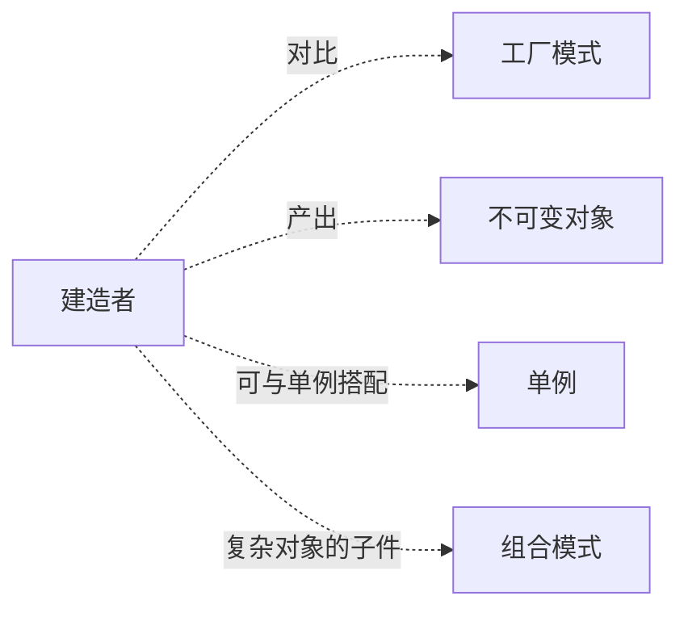

# 第三卷第3章：建造者模式设计思想

#### 目录介绍
- [01.案例引入与思考](#01案例引入与思考)
    - [1.1 痛点场景](#11-痛点场景)
    - [1.2 它哪里不舒服](#12-它哪里不舒服)
    - [1.3 引出本篇主角](#13-引出本篇主角)
- [02.建造者模式介绍](#02建造者模式介绍)
    - [2.1 建造者模式由来](#21-建造者模式由来)
    - [2.2 建造者模式定义](#22-建造者模式定义)
    - [2.3 建造者模式场景](#23-建造者模式场景)
    - [2.4 建造者模式思考](#24-建造者模式思考)
- [03.建造者模式实现](#03建造者模式实现)
    - [3.1 罗列一个场景](#31-罗列一个场景)
    - [3.2 创造对象弊端场景](#32-创造对象弊端场景)
    - [3.3 案例演变分析](#33-案例演变分析)
    - [3.4 用例子理解建造者](#34-用例子理解建造者)
- [04.建造者模式分析](#04建造者模式分析)
    - [4.1 建造者模式结构图](#41-建造者模式结构图)
    - [4.2 建造者模式时序图](#42-建造者模式时序图)
    - [4.3 基本代码实现](#43-基本代码实现)
- [05.建造者案例实践](#05建造者案例实践)
    - [5.1 盖房子案例开发](#51-盖房子案例开发)
    - [5.2 普通盖房子开发](#52-普通盖房子开发)
    - [5.3 构造者优化盖房子](#53-构造者优化盖房子)
- [06.建造者模式拓展](#06建造者模式拓展)
    - [6.1 建造者能简化吗](#61-建造者能简化吗)
    - [6.2 和工厂模式区别](#62-和工厂模式区别)
- [07.建造者优缺点分析](#07建造者优缺点分析)
    - [7.1 优点有哪些](#71-优点有哪些)
    - [7.2 不足的点分析](#72-不足的点分析)
- [08.构造者模式总结](#08构造者模式总结)
    - [8.1 该模式总结](#81-该模式总结)
    - [8.2 模式联动与边界](#82-模式联动与边界)


## 01.案例引入与思考

> **本篇主线**：日常开发中最常见的"构造参数失控"

### 1.1 痛点场景

写一个 HTTP 客户端配置类，最初只有 url、超时两个字段，后来一路加：

```java
HttpClient client = new HttpClient(
    "https://api.com",  // url
    5000,               // 连接超时
    10000,              // 读取超时
    null,               // 代理 host
    0,                  // 代理 port
    true,               // 是否启用 gzip
    3,                  // 重试次数
    "Bearer xxx",       // 认证头
    null,               // 自定义 header
    "UTF-8",            // 编码
    false,              // 是否走 HTTPS 校验
    null                // 拦截器列表
);
```

调用方根本看不出第 5 个参数 `0` 是端口、第 6 个 `true` 是开启 gzip。一旦把 `true` 和 `3` 写反——编译通过、运行炸裂。

### 1.2 它哪里不舒服

- ❌ **可读性归零**：调用现场只有一串字面量，需要跳到构造函数定义才知道每个参数是干嘛的；
- ❌ **可选参数地狱**：12 个里只有 3 个必填，其余 9 个常常传 `null` 或 `0`，语义混乱；
- ❌ **参数顺序错位**：相同类型的参数（多个 String、多个 int）调换位置编译器都不会警告；
- ❌ **校验放不下**：想做"如果启用 HTTPS 校验，就必须提供证书路径"这种**跨字段校验**，构造函数里一坨 if 写得很丑；
- ❌ **不可变性破坏**：为了规避构造爆炸，常退化成 `new HttpClient()` + 一堆 `setXxx()`，对象失去不可变性，多线程立即出问题。

两种"妥协方案"对比一下，全是雷区：



### 1.3 引出本篇主角

> **建造者模式（Builder）的核心思想**：把"对象的构造过程"从"对象本身"剥离出来，让调用方用**链式、命名、分步骤**的方式喂参数，最后在 `build()` 里一次性校验并产出一个**不可变**对象。

```java
HttpClient client = HttpClient.builder()
    .url("https://api.com")
    .connectTimeout(5000)
    .readTimeout(10000)
    .gzip(true)
    .retry(3)
    .auth("Bearer xxx")
    .build();   // 此处统一校验
```

代码瞬间从天书变成了说明文。流程一目了然：



本篇会一步步带你看清"为什么需要 Builder、和工厂/setter 的真正区别、它的代价是什么"。

---

## 02.建造者模式介绍
### 2.1 建造者模式由来
1.无论是在现实世界中还是在软件系统中，都存在一些复杂的对象，它们拥有多个组成部分。

如汽车，它包括车轮、方向盘、发送机等各种部件。而对于大多数用户而言，无须知道这些部件的装配细节，也几乎不会使用单独某个部件，而是使用一辆完整的汽车，可以通过建造者模式对其进行设计与描述。

[建造者模式](https://yccoding.com/zh/design/creational/03.%E5%BB%BA%E9%80%A0%E8%80%85%E6%A8%A1%E5%BC%8F%E8%AE%BE%E8%AE%A1%E6%80%9D%E6%83%B3.html)可以将部件和其组装过程分开，一步一步创建一个复杂的对象。用户只需要指定复杂对象的类型就可以得到该对象，而无须知道其内部的具体构造细节。

2.复杂对象相当于一辆有待建造的汽车，而对象的属性相当于汽车的部件，建造产品的过程就相当于组合部件的过程。

由于组合部件的过程很复杂，因此，这些部件的组合过程往往被“外部化”到一个称作建造者的对象里。

建造者返还给客户端的是一个已经建造完毕的完整产品对象，而用户无须关心该对象所包含的属性以及它们的组装方式，这就是建造者模式的模式动机。


### 2.2 建造者模式定义
[建造者模式](https://yccoding.com/zh/design/creational/03.%E5%BB%BA%E9%80%A0%E8%80%85%E6%A8%A1%E5%BC%8F%E8%AE%BE%E8%AE%A1%E6%80%9D%E6%83%B3.html)(Builder Pattern)：将一个复杂对象的构建与它的表示分离，使得同样的构建过程可以创建不同的表示。

建造者模式是一步一步创建一个复杂的对象，它允许用户只通过指定复杂对象的类型和内容就可以构建它们，用户不需要知道内部的具体构建细节。

建造者模式属于对象创建型模式。根据中文翻译的不同，[建造者模式](https://yccoding.com/zh/design/creational/03.%E5%BB%BA%E9%80%A0%E8%80%85%E6%A8%A1%E5%BC%8F%E8%AE%BE%E8%AE%A1%E6%80%9D%E6%83%B3.html)又可以称为生成器模式。


### 2.3 建造者模式场景
在以下情况下可以使用建造者模式：

1. 需要生成的产品对象有复杂的内部结构，这些产品对象通常包含多个成员属性。
2. 需要生成的产品对象的属性相互依赖，需要指定其生成顺序。
3. 对象的创建过程独立于创建该对象的类。在[建造者模式](https://yccoding.com/zh/design/creational/03.%E5%BB%BA%E9%80%A0%E8%80%85%E6%A8%A1%E5%BC%8F%E8%AE%BE%E8%AE%A1%E6%80%9D%E6%83%B3.html)中引入了指挥者类，将创建过程封装在指挥者类中，而不在建造者类中。
4. 隔离复杂对象的创建和使用，并使得相同的创建过程可以创建不同的产品。


### 2.4 建造者模式思考
建造者模式的原理和代码实现非常简单，掌握起来并不难，难点在于应用场景。

1. 比如，你有没有考虑过这样几个问题：直接使用构造函数或者配合 set 方法就能创建对象，为什么还需要建造者模式来创建呢？
2. 建造者模式和工厂模式都可以创建对象，那它们两个的区别在哪里呢？


## 03.建造者模式实现
### 3.1 罗列一个场景
在平时的开发中，创建一个对象最常用的方式是，使用 new 关键字调用类的构造函数来完成。

我的问题是，什么情况下这种方式就不适用了，就需要采用[建造者模式](https://yccoding.com/zh/design/creational/03.%E5%BB%BA%E9%80%A0%E8%80%85%E6%A8%A1%E5%BC%8F%E8%AE%BE%E8%AE%A1%E6%80%9D%E6%83%B3.html)来创建对象呢？你可以先思考一下，下面我通过一个例子来带你看一下。

**假设有这样一道设计面试题**：

我们需要定义一个资源池配置类 ResourcePoolConfig。这里的资源池，你可以简单理解为线程池、连接池、对象池等。在这个资源池配置类中，有以下几个成员变量，也就是可配置项。现在，请你编写代码实现这个 ResourcePoolConfig 类。


### 3.2 创造对象弊端场景
最常见、最容易想到的实现思路如下代码所示。
```java
public class BuilderDesign1 {

    public static void main(String[] args) {
        ResourcePoolConfig resourcePoolConfig = new ResourcePoolConfig("", 1, 2, 3);
    }

    public static class ResourcePoolConfig {
        private static final int DEFAULT_MAX_TOTAL = 8;
        private static final int DEFAULT_MAX_IDLE = 8;
        private static final int DEFAULT_MIN_IDLE = 0;

        private String name;
        private int maxTotal = DEFAULT_MAX_TOTAL;
        private int maxIdle = DEFAULT_MAX_IDLE;
        private int minIdle = DEFAULT_MIN_IDLE;

        public ResourcePoolConfig(String name, int maxTotal, int maxIdle, int minIdle) {
            this.name = name;
            if (maxTotal <= 0) {
                throw new IllegalArgumentException("maxTotal should be positive.");
            }
            this.maxTotal = maxTotal;
            if (maxIdle < 0) {
                throw new IllegalArgumentException("maxIdle should not be negative.");
            }
            this.maxIdle = maxIdle;
            if (minIdle < 0) {
                throw new IllegalArgumentException("minIdle should not be negative.");
            }
            this.minIdle = minIdle;
        }
        //...省略getter方法...
    }
}
```

现在，ResourcePoolConfig 只有 4 个可配置项，对应到构造函数中，也只有 4 个参数，参数的个数不多。

但是，如果可配置项逐渐增多，变成了 8 个、10 个，甚至更多，那继续沿用现在的设计思路，构造函数的参数列表会变得很长，代码在可读性和易用性上都会变差。

在使用构造函数的时候，我们就容易搞错各参数的顺序，传递进错误的参数值，导致非常隐蔽的 bug。
```java
// 参数太多，导致可读性差、参数可能传递错误
ResourcePoolConfig config = new ResourcePoolConfig("dbconnectionpool", 16, null, 8, null, false , true, 10, 20，false， true);
```


### 3.3 案例演变分析
解决这个问题的办法你应该也已经想到了，那就是用set()函数来给成员变量赋值，以替代冗长的构造函数。

我们直接看代码，具体如下所示。其中，配置项name是必填的，所以我们把它放到构造函数中设置，强制创建类对象的时候就要填写。

其他配置项 maxTotal、maxIdle、minIdle 都不是必填的，所以我们通过 set() 函数来设置，让使用者自主选择填写或者不填写。
```java
public static class ResourcePoolConfig {
    private static final int DEFAULT_MAX_TOTAL = 8;
    private static final int DEFAULT_MAX_IDLE = 8;
    private static final int DEFAULT_MIN_IDLE = 0;

    private String name;
    private int maxTotal = DEFAULT_MAX_TOTAL;
    private int maxIdle = DEFAULT_MAX_IDLE;
    private int minIdle = DEFAULT_MIN_IDLE;

    public ResourcePoolConfig(String name) {
        this.name = name;
    }

    public void setMaxTotal(int maxTotal) {
        if (maxTotal <= 0) {
            throw new IllegalArgumentException("maxTotal should be positive.");
        }
        this.maxTotal = maxTotal;
    }

    public void setMaxIdle(int maxIdle) {
        if (maxIdle < 0) {
            throw new IllegalArgumentException("maxIdle should not be negative.");
        }
        this.maxIdle = maxIdle;
    }

    public void setMinIdle(int minIdle) {
        if (minIdle < 0) {
            throw new IllegalArgumentException("minIdle should not be negative.");
        }
        this.minIdle = minIdle;
    }
    //...省略getter方法...
}
```

接下来，我们来看新的 ResourcePoolConfig 类该如何使用。我写了一个示例代码，如下所示。没有了冗长的函数调用和参数列表，代码在可读性和易用性上提高了很多。
```java
// ResourcePoolConfig使用举例
ResourcePoolConfig config = new ResourcePoolConfig("dbconnectionpool");
config.setMaxTotal(16);
config.setMaxIdle(8);
```

至此，我们仍然没有用到[建造者模式](https://yccoding.com/zh/design/creational/03.%E5%BB%BA%E9%80%A0%E8%80%85%E6%A8%A1%E5%BC%8F%E8%AE%BE%E8%AE%A1%E6%80%9D%E6%83%B3.html)，通过构造函数设置必填项，通过 set() 方法设置可选配置项，就能实现我们的设计需求。

1. set方式设置对象属性时，存在中间状态，并且属性校验时有前后顺序约束，逻辑校验的代码找不到合适的地方放置。
2. set方法还破坏了"不可变对象"的密闭性。也就是说，对象在创建好之后，就不能再修改内部的属性值。要实现这个功能，我们就不能在 ResourcePoolConfig 类中暴露 set() 方法。


### 3.4 用例子理解建造者
可以把校验逻辑放置到 Builder 类中，先创建建造者，并且通过 set() 方法设置建造者的变量值，然后在使用 build() 方法真正创建对象之前，做集中的校验，校验通过之后才会创建对象。

除此之外，我们把 ResourcePoolConfig 的构造函数改为 private 私有权限。这样我们就只能通过建造者来创建 ResourcePoolConfig 类对象。

并且，ResourcePoolConfig 没有提供任何 set() 方法，这样我们创建出来的对象就是不可变对象了。

用[建造者模式](https://yccoding.com/zh/design/creational/03.%E5%BB%BA%E9%80%A0%E8%80%85%E6%A8%A1%E5%BC%8F%E8%AE%BE%E8%AE%A1%E6%80%9D%E6%83%B3.html)重新实现了上面的需求，具体的代码如下所示：
```java
public class ResourcePoolConfig {
  private String name;
  private int maxTotal;
  private int maxIdle;
  private int minIdle;

  private ResourcePoolConfig(Builder builder) {
    this.name = builder.name;
    this.maxTotal = builder.maxTotal;
    this.maxIdle = builder.maxIdle;
    this.minIdle = builder.minIdle;
  }
  //...省略getter方法...

  //我们将Builder类设计成了ResourcePoolConfig的内部类。
  //我们也可以将Builder类设计成独立的非内部类ResourcePoolConfigBuilder。
  public static class Builder {
    private static final int DEFAULT_MAX_TOTAL = 8;
    private static final int DEFAULT_MAX_IDLE = 8;
    private static final int DEFAULT_MIN_IDLE = 0;

    private String name;
    private int maxTotal = DEFAULT_MAX_TOTAL;
    private int maxIdle = DEFAULT_MAX_IDLE;
    private int minIdle = DEFAULT_MIN_IDLE;

    public ResourcePoolConfig build() {
      // 校验逻辑放到这里来做，包括必填项校验、依赖关系校验、约束条件校验等
      if (StringUtils.isBlank(name)) {
        throw new IllegalArgumentException("...");
      }
      if (maxIdle > maxTotal) {
        throw new IllegalArgumentException("...");
      }
      if (minIdle > maxTotal || minIdle > maxIdle) {
        throw new IllegalArgumentException("...");
      }

      return new ResourcePoolConfig(this);
    }

    public Builder setName(String name) {
      if (StringUtils.isBlank(name)) {
        throw new IllegalArgumentException("...");
      }
      this.name = name;
      return this;
    }

    public Builder setMaxTotal(int maxTotal) {
      if (maxTotal <= 0) {
        throw new IllegalArgumentException("...");
      }
      this.maxTotal = maxTotal;
      return this;
    }

    public Builder setMaxIdle(int maxIdle) {
      if (maxIdle < 0) {
        throw new IllegalArgumentException("...");
      }
      this.maxIdle = maxIdle;
      return this;
    }

    public Builder setMinIdle(int minIdle) {
      if (minIdle < 0) {
        throw new IllegalArgumentException("...");
      }
      this.minIdle = minIdle;
      return this;
    }
  }
}

// 这段代码会抛出IllegalArgumentException，因为minIdle>maxIdle
ResourcePoolConfig config = new ResourcePoolConfig.Builder()
        .setName("dbconnectionpool")
        .setMaxTotal(16)
        .setMaxIdle(10)
        .setMinIdle(12)
        .build();
```

实际上，使用建造者模式创建对象，还能避免对象存在无效状态。我再举个例子解释一下。

比如我们定义了一个长方形类，如果不使用建造者模式，采用先创建后 set 的方式，那就会导致在第一个 set 之后，对象处于无效状态。具体代码如下所示：
```java
Rectangle r = new Rectange(); // r is invalid
r.setWidth(2); // r is invalid
r.setHeight(3); // r is valid
```

为了避免这种无效状态的存在，我们就需要使用构造函数一次性初始化好所有的成员变量。

如果构造函数参数过多，我们就需要考虑使用建造者模式，先设置建造者的变量，然后再一次性地创建对象，让对象一直处于有效状态。

实际上，如果我们并不是很关心对象是否有短暂的无效状态，也不是太在意对象是否是可变的。比如，对象只是用来映射数据库读出来的数据，那我们直接暴露 set() 方法来设置类的成员变量值是完全没问题的。

而且，使用建造者模式来构建对象，代码实际上是有点重复的，ResourcePoolConfig 类中的成员变量，要在 Builder 类中重新再定义一遍。


## 04.建造者模式分析
### 4.1 建造者模式结构图
建造者模式包含如下角色：

1. Builder：抽象建造者
2. ConcreteBuilder：具体建造者
3. Director：指挥者
4. Product：产品角色

**为什么需要 Director**：调用方不想记住"先 buildBasic、后 buildWalls、最后 roofed"这个顺序，于是抽出 Director 封装"装配流程"。Builder 专注怎么造，Director 专注运行顺序。如果流程固定、不需变体，Director 的价值会减弱（6.1 会提出可以省略）。


### 4.2 建造者模式时序图
建造者模式时序图如下所示：




## 05.建造者案例实践
### 5.1 盖房子案例开发
例如，让我们考虑如何创建一个House（房屋）对象。

为了建造一个简单的房子，您需要建造四堵墙和一层地板，安装一扇门，安装一对窗户，并建造一座屋顶。但是，如果您想要一个更大、更明亮的房子，带有后院和其他设施（如供暖系统、管道和电气布线）呢？

最简单的解决方案是扩展基类House并创建一组子类来涵盖所有参数的组合。

但是，最终您将得到相当数量的子类。任何新的参数，如门廊风格，都将需要进一步扩展这个层次结构。[建造者模式](https://yccoding.com/zh/design/creational/03.%E5%BB%BA%E9%80%A0%E8%80%85%E6%A8%A1%E5%BC%8F%E8%AE%BE%E8%AE%A1%E6%80%9D%E6%83%B3.html)允许您逐步构建复杂的对象。


### 5.2 普通方式盖房子
使用普通方式盖房子，代码如下所示：

```java
public class BuilderHouse {

    public static void main(String[] args) {
        CommonHouse commonHouse = new CommonHouse();
        commonHouse.build();
        HeightBuilding heightBuilding = new HeightBuilding();
        heightBuilding.build();
    }

    public static abstract class AbstractHouse {

        /**
         * 打地基
         */
        public abstract void buildBasic();

        /**
         * 砌墙
         */
        public abstract void buildWalls();

        /**
         * 封顶
         */
        public abstract void roofed();

        public void build() {
            buildBasic();
            buildWalls();
            roofed();
        }

    }

    public static class CommonHouse extends AbstractHouse {

        @Override
        public void buildBasic() {
            System.out.println(" 普通房子打地基 ");
        }

        @Override
        public void buildWalls() {
            System.out.println(" 普通房子砌墙 ");
        }

        @Override
        public void roofed() {
            System.out.println(" 普通房子封顶 ");
        }

    }

    public static class HeightBuilding extends AbstractHouse {

        @Override
        public void buildBasic() {
            System.out.println(" 高楼打地基 ");
        }

        @Override
        public void buildWalls() {
            System.out.println(" 高楼房子砌墙 ");
        }

        @Override
        public void roofed() {
            System.out.println(" 高楼房子封顶 ");
        }
    }
}
```

分析

1. 优点：比较好理解，简单易操作
2. 缺点：程序结构过于简单，没有设计缓存层对象，程序的扩展和维护不好。这种设计方案，把产品(即:房子) 和 创建产品的过程(即:建房子流程) 封装在一起，耦合性增强了
3. 改进：使用建造者模式，将产品和产品建造过程解耦


### 5.3 构造者优化盖房子
使用构建者模式实现房子的构建
```java
private void test() {
    ///盖普通房子
    //准备创建房子的指挥者
    HouseDirector houseDirector = new HouseDirector(new CommonHouse());
    //完成盖房子，返回产品(普通房子)
    House commonHouse = houseDirector.constructHouse();
    System.out.println("普通房子：" + commonHouse.toString());
    ///盖高楼
    //重置建造者，改成修高楼
    houseDirector.setHouseBuilder(new HighBuilding());
    //完成盖房子，返回产品(高楼)
    House highBuilding = houseDirector.constructHouse();
    System.out.println("高楼：" + highBuilding.toString());
}

/**
 * 产品->Product
 */
public class House {
    private String basic;
    private String wall;
    private String roofed;

    public String getBasic() {
        return basic;
    }

    public void setBasic(String basic) {
        this.basic = basic;
    }

    public String getWall() {
        return wall;
    }

    public void setWall(String wall) {
        this.wall = wall;
    }

    public String getRoofed() {
        return roofed;
    }

    public void setRoofed(String roofed) {
        this.roofed = roofed;
    }

    public House(String basic, String wall, String roofed) {
        this.basic = basic;
        this.wall = wall;
        this.roofed = roofed;
    }

    public House() {
    }

    @Override
    public String toString() {
        return "House{" +
                "basic='" + basic + '\'' +
                ", wall='" + wall + '\'' +
                ", roofed='" + roofed + '\'' +
                '}';
    }
}

/**
 * 抽象的建造者
 */
public abstract class HouseBuilder {
    /**
     * 组合House
     */
    protected House house = new House();

    //-------------------------将建造的流程写好--------------------------

    /**
     * 打地基
     */
    public abstract void buildBasic();

    /**
     * 砌墙
     */
    public abstract void buildWalls();

    /**
     * 封顶
     */
    public abstract void roofed();

    /**
     * 建造好房子后将产品(房子) 返回
     *
     * @return
     */
    public House buildHouse() {
        return house;
    }
}


/**
 * 具体建造者
 */
public class CommonHouse extends HouseBuilder {

    @Override
    public void buildBasic() {
        System.out.println("普通房子打地基5米 ");
        super.house.setBasic("地基5米");
    }

    @Override
    public void buildWalls() {
        System.out.println("普通房子砌墙10cm ");
        super.house.setWall("墙10cm");
    }

    @Override
    public void roofed() {
        System.out.println("普通房子屋顶 ");
        super.house.setRoofed("普通房子屋顶");
    }

}

/**
 * 具体建造者
 */
public class HighBuilding extends HouseBuilder {

    @Override
    public void buildBasic() {
        System.out.println("高楼的打地基100米 ");
        super.house.setBasic("地基100米");
    }

    @Override
    public void buildWalls() {
        System.out.println("高楼的砌墙20cm ");
        super.house.setWall("墙20cm");
    }

    @Override
    public void roofed() {
        System.out.println("高楼的透明屋顶 ");
        super.house.setRoofed("透明屋顶");
    }
}


/**
 * 指挥者，调用制作方法，返回产品
 */
public class HouseDirector {
    /**
     * 聚合
     */
    HouseBuilder houseBuilder = null;

    /**
     * 方式一：构造器传入 houseBuilder
     *
     * @param houseBuilder
     */
    public HouseDirector(HouseBuilder houseBuilder) {
        this.houseBuilder = houseBuilder;
    }

    /**
     * 方式二：通过setter 传入 houseBuilder
     *
     * @param houseBuilder
     */
    public void setHouseBuilder(HouseBuilder houseBuilder) {
        this.houseBuilder = houseBuilder;
    }

    /**
     * 指挥者统一管理建造房子的流程
     *
     * @return
     */
    public House constructHouse() {
        houseBuilder.buildBasic();
        houseBuilder.buildWalls();
        houseBuilder.roofed();
        return houseBuilder.buildHouse();
    }
}
```


## 06.建造者模式拓展
### 6.1 建造者能简化吗

**为什么要简化**：4 个角色全上阵是为了"同一流程、不同实现"。但实际业务中，很多场景只是"参数多、需要链式"，背水一整套会显得过重。于是产生了两种逐步变体：

1. **省略抽象建造者角色**：如果系统中只需要一个具体建造者的话，可以省略掉抽象建造者。指挥者直接面向具体建造者；
2. **省略指挥者角色**：在具体建造者只有一个的情况下，如果抽象建造者角色已经被省略掉，那么还可以省略指挥者角色，让 Builder 角色扮演指挥者与建造者双重角色。上节的 1.3 调用示例 `HttpClient.builder().url(...).build()` 就是这种"双重却退"后的经典形态，Lombok `@Builder` 生成的代码也是同一货色。


### 6.2 和工厂模式区别
实际上，工厂模式是用来创建不同但是相关类型的对象（继承同一父类或者接口的一组子类），由给定的参数来决定创建哪种类型的对象。

建造者模式是用来创建一种类型的复杂对象。通过设置不同的可选参数，“定制化”地创建不同的对象。

网上有一个经典的例子很好地解释了两者的区别。

顾客走进一家餐馆点餐，我们利用[工厂模式](http://localhost:8080/zh/design/creational/02.%E5%B7%A5%E5%8E%82%E6%A8%A1%E5%BC%8F%E8%AE%BE%E8%AE%A1%E6%80%9D%E6%83%B3.html)，根据用户不同的选择，来制作不同的食物，比如披萨、汉堡、沙拉。对于披萨来说，用户又有各种配料可以定制，比如奶酪、西红柿、起司，我们通过建造者模式根据用户选择的不同配料来制作披萨。

也不要太学院派，非得把[工厂模式](http://localhost:8080/zh/design/creational/02.%E5%B7%A5%E5%8E%82%E6%A8%A1%E5%BC%8F%E8%AE%BE%E8%AE%A1%E6%80%9D%E6%83%B3.html)、[建造者模式](https://yccoding.com/zh/design/creational/03.%E5%BB%BA%E9%80%A0%E8%80%85%E6%A8%A1%E5%BC%8F%E8%AE%BE%E8%AE%A1%E6%80%9D%E6%83%B3.html)分得那么清楚，我们需要知道的是，每个模式为什么这么设计，能解决什么问题。只有了解了这些最本质的东西，我们才能不生搬硬套，才能灵活应用，甚至可以混用各种模式创造出新的模式，来解决特定场景的问题。


## 07.建造者优缺点分析
### 7.1 优点有哪些
建造者优点分析

1. 在建造者模式中， 客户端不必知道产品内部组成的细节，将产品本身与产品的创建过程解耦，使得相同的创建过程可以创建不同的产品对象。
2. 每一个具体建造者都相对独立，而与其他的具体建造者无关，因此可以很方便地替换具体建造者或增加新的具体建造者， 用户使用不同的具体建造者即可得到不同的产品对象 。
3. 可以更加精细地控制产品的创建过程 。将复杂产品的创建步骤分解在不同的方法中，使得创建过程更加清晰，也更方便使用程序来控制创建过程。
4. 增加新的具体建造者无须修改原有类库的代码，指挥者类针对抽象建造者类编程，系统扩展方便，符合“开闭原则”。


### 7.2 不足的点分析
建造者缺点分析

1. [建造者模式](https://yccoding.com/zh/design/creational/03.%E5%BB%BA%E9%80%A0%E8%80%85%E6%A8%A1%E5%BC%8F%E8%AE%BE%E8%AE%A1%E6%80%9D%E6%83%B3.html)所创建的产品一般具有较多的共同点，其组成部分相似，如果产品之间的差异性很大，则不适合使用建造者模式，因此其使用范围受到一定的限制。
2. 如果产品的内部变化复杂，可能会导致需要定义很多具体建造者类来实现这种变化，导致系统变得很庞大。


## 08.构造者模式总结
### 8.1 该模式总结
**Builder模式有几个好处：**

1. Builder的setter函数可以包含安全检查，可以确保构建过程的安全，有效。
2. Builder的setter函数是具名函数，有意义，相对于构造函数的一长串函数列表，更容易阅读维护。
3. 可以利用单个Builder对象构建多个对象，Builder的参数可以在创建对象的时候利用setter函数进行调整

**当然Builder模式也有缺点：**

1. 更多的代码，需要Builder这样的内部类
2. 增加了类创建的运行时开销，但是当一个类参数很多的时候，Builder模式带来的好处要远胜于其缺点。


### 8.2 模式联动与边界



| 模式 | 关系 | 一句话区别 |
|------|------|----------|
| 工厂 | 易混 | 工厂关注"造哪个"（多种类型选一个），建造者关注"分步骤造一个复杂的" |
| 原型 | 替代 | 当对象"几乎一样、只改个别字段"时，原型 clone 比 Builder 链式重建更便宜 |
| 单例 | 配合 | Builder 自身可以做成线程安全的单例，重复使用 |
| 组合 | 协作 | 建造者常用来构造一棵树（XML/UI/AST），步骤就是"逐节点拼装" |

**⚠️ 什么时候不该用**

- **参数 ≤ 4 个、且都是必填**：构造函数 + 命名参数已经够清晰，Builder 是过度设计；
- **对象本身就是可变的**：Builder 的最大价值是**不可变性 + 一次性校验**，如果你后面还会到处 `setXxx`，等于白搭；
- **构造步骤无序、无依赖**：如果字段之间无任何约束，纯命名参数（Kotlin/Python）或 Lombok `@Builder` 已经足够，不必手写；
- **调用频次极低**：Builder 引入了一个伴生类的成本，一年才造一次的对象，直接 `new` 配注释更轻量。

> 一句话：**当"参数多 + 大部分可选 + 字段间有约束 + 想要不可变"四个条件同时出现，才是 Builder 的最佳时机**。否则它就是一层多余的脚手架。

**💭 思考题**

1. Lombok 的 `@Builder` 帮你省了几十行模板代码，但它能做"跨字段校验"吗？为什么？
2. StringBuilder / StringBuffer 算不算建造者模式？它和 GoF 定义的 Builder 有什么本质区别？
3. 链式调用一定要用 Builder 吗？能否在原对象上直接 `return this` 实现链式（Fluent API），它和 Builder 的边界在哪？

> 上一篇 [02.工厂](02.工厂模式设计思想.md) → 本篇 → [04.原型](04.原型模式设计思想.md)：当造一个对象太贵、而你又想要"一个差不多但小改的"，工厂和建造者都嫌慢，原型上场。

