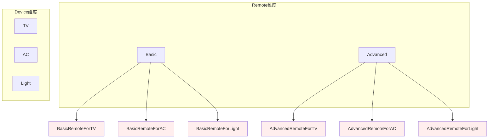
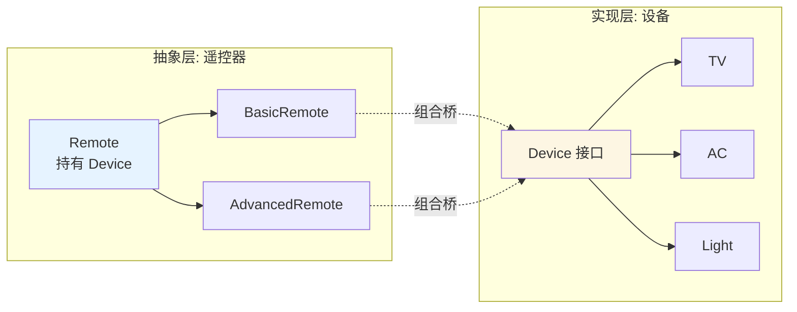
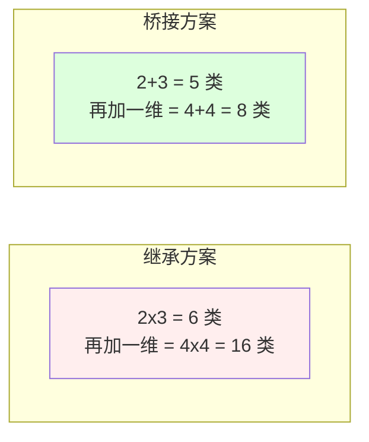

# 10.桥接模式设计思想

> **📚 本篇渐进学习节奏（建议按顺序食用）**
>
> 1. **第 01 节 · 案例引入** — 多端推送系统(4 端 × 4 通道 = 16 子类)的笛卡尔积爆炸事故
> 2. **第 02 节 · 模式基础** — 从形状×颜色讲透"两个独立变化维度"
> 3. **第 03 节 · 模式实现** — Abstraction / RefinedAbstraction / Implementor / ConcreteImplementor 四角色骨架
> 4. **第 04 节 · 实例演示** — 支付渠道 × 支付方式经典 2 维拆解（微信/支付宝 × 密码/人脸/指纹）
> 5. **第 05 节 · 实现方式** — 继承+组合 与 接口+内部类 两种落地姿势
> 6. **第 06 节 · 优缺分析** — 抽象与实现独立扩展的代价
> 7. **第 07 节 · 踩坑 + 联动** — 4 种翻车姿势 + 与适配器/策略/装饰者/抽象工厂的边界
>
> 阅读到任一节卡壳，直接跳回上一节复盘场景；本篇代码均可直接运行。

#### 目录介绍
- [01.案例引入与思考](#01案例引入与思考)
  - [1.1 痛点场景](#11-痛点场景)
  - [1.2 它哪里不舒服](#12-它哪里不舒服)
  - [1.3 引出本篇主角](#13-引出本篇主角)
- [02.桥接模式基础](#02桥接模式基础)
  - [2.1 桥接模式由来](#21-桥接模式由来)
  - [2.2 桥接模式定义](#22-桥接模式定义)
  - [2.3 桥接模式场景](#23-桥接模式场景)
  - [2.4 桥接模式思考](#24-桥接模式思考)
  - [2.5 解决的问题](#25-解决的问题)
- [03.桥接模式实现](#03桥接模式实现)
  - [3.1 罗列一个场景](#31-罗列一个场景)
  - [3.2 桥接结构](#32-桥接结构)
  - [3.3 桥接基本实现](#33-桥接基本实现)
  - [3.4 有哪些注意点](#34-有哪些注意点)
- [04.桥接实例演示](#04桥接实例演示)
  - [4.1 需求分析](#41-需求分析)
  - [4.2 代码案例实现](#42-代码案例实现)
  - [4.3 是否可以优化](#43-是否可以优化)
  - [4.4 桥接设计](#44-桥接设计)
  - [4.5 演变代码案例](#45-演变代码案例)
- [05.桥接实现方式](#05桥接实现方式)
  - [5.1 继承和组合](#51-继承和组合)
  - [5.2 接口和内部类](#52-接口和内部类)
- [06.桥接模式分析](#06桥接模式分析)
  - [6.1 桥接模式优点](#61-桥接模式优点)
  - [6.2 桥接模式缺点](#62-桥接模式缺点)
  - [6.3 适用环境](#63-适用环境)
  - [6.4 模式拓展](#64-模式拓展)
- [07.桥接模式总结](#07桥接模式总结)
  - [7.1 总结一下学习](#71-总结一下学习)
  - [7.2 模式联动与边界](#72-模式联动与边界)
  - [7.3 踩坑实录与开源案例](#73-踩坑实录与开源案例)


## 推荐一个好玩网站

一个最纯粹的技术分享网站，打造精品技术编程专栏！[编程进阶网](https://yccoding.com/)

https://yccoding.com/


## 01.案例引入与思考

> **本篇主线**：两个独立变化的维度被继承绑死

### 1.1 痛点场景

> **🔥 模拟事故复盘 · 消息推送中台 · 国际化扩张时的"维度灾难"**
>
> 9 月 12 日上午 10:00，市场部宣布："Q4 公司要拓展 3 个海外区域，App 端先支持东南亚、欧美、日韩本地化推送渠道。"
> 后端组打开当前推送系统一看——**当前实现是用『继承』把"端 × 通道"绑死的**：4 个端（PC / iOS / Android / Web）× 4 个通道（微信 / 钉钉 / 邮件 / SMS）= **16 个子类**：`PCWeChatPusher`、`IOSDingTalkPusher`、`AndroidEmailPusher`、`WebSMSPusher`...
> 现在要新增 3 个海外通道（**WhatsApp / Line / Telegram**），按现有写法：
>
> - **新增类数 = 4 端 × 3 新通道 = 12 个新子类**；
> - 而且新人小赵手抖，把 `IOSWhatsAppPusher` 的"重试逻辑"复制粘贴时漏掉一行——iOS 推送失败后没退避就疯狂重试，**WhatsApp 接口被风控限流，全公司 iOS 用户当晚收不到推送**。
>
> 更糟的是 9 月 20 日运营追加："新增『车机端』，因为我们要进车厂。"——4 个新通道还没加完，又来了一个新端：
>
> - **新增类数 = 1 新端 × 7 通道（4 老 + 3 新）= 7 个新子类**；
> - 总子类数从 16 → 16 + 12 + 7 = **35 个**；
> - 改一个"重试退避算法"——**35 个类要全改一遍**；
> - 单测脚本 35 套要重写。
>
> 这场"国际化推送扩张事故"暴露了一个本质问题：**当类的"变化维度"是两个或更多时（端 × 通道），用继承会让类数量按笛卡尔积爆炸**。每加一个端 → 类数 ×（通道数）；每加一个通道 → 类数 ×（端数）。如果一开始就把"端"和"通道"拆成 **抽象层（推送器）** 和 **实现层（通道）**，中间用组合连接——**加 3 个新通道只需新增 3 个 Channel 类，加 1 个新端只需新增 1 个 Pusher 类，总数只多 4 个，不是 19 个**。

做一套智能家居控制：遥控器有 `BasicRemote / AdvancedRemote` 两种，设备有 `TV / AirConditioner / Light` 三种。第一版你写成继承：

```java
class BasicRemoteForTV { ... }
class BasicRemoteForAC { ... }
class BasicRemoteForLight { ... }
class AdvancedRemoteForTV { ... }
class AdvancedRemoteForAC { ... }
class AdvancedRemoteForLight { ... }
// 2 × 3 = 6 个类
```

一维增加时成本是线性的，但双维度相乘后是**笛卡尔积爆炸**：



新增一个"语音遥控器" + 一个"窗帘设备"：立刻从 6 个类变成 4 × 4 = 16 个。

### 1.2 它哪里不舒服

- ❌ **笛卡尔积爆炸**：m × n 个子类，任一维扩展都会让类数量乘法增长；
- ❌ **代码重复**：`BasicRemoteForTV` 和 `AdvancedRemoteForTV` 都要调用 TV 的开关接口，却没法共享；
- ❌ **维度耦合**：遥控器层次和设备层次被绑死在同一棵继承树里，修改一边会影响另一边；
- ❌ **无法运行时切换**：一个遥控器不能从控制 TV 切到控制空调（类型都变了）。

### 1.3 引出本篇主角

> **桥接模式（Bridge）的核心思想**：把"两个独立变化的维度"拆开，一个作为抽象层（遥控器），另一个作为实现层（设备），中间用**组合**连接。两边可以各自扩展，互不影响。



扩展成本立刻从"乘法"退化成"加法"：



JDBC 的 `DriverManager`（抽象）× `Driver 实现`（MySQL/Oracle/PG）、日志门面 SLF4J（抽象）× 实现（Log4j/Logback），都是桥接的经典落地。

**🎯 用前用后效果对比（衔接 1.1 事故现场）**

基线：消息推送中台，4 端 × 4 通道 → 扩张到 5 端 × 7 通道：

| 维度 | ❌ 继承绑维度（事故现场） | ✅ 引入桥接模式 |
|------|----------------------|---------------|
| 初始类数（4×4） | **16 个子类** | 4 端 + 4 通道 = **8 个类** |
| 加 3 个新通道 | 新增 4 × 3 = **12 个子类** | 新增 **3 个 Channel** |
| 再加 1 个新端 | 新增 1 × 7 = **7 个子类** | 新增 **1 个 Pusher** |
| 最终类数（5×7） | 16 + 12 + 7 = **35 个** | 5 + 7 = **12 个** |
| 改"重试退避算法" | 35 个类全改 | **改 1 处抽象基类** |
| 端 × 通道动态切换 | 不支持（编译期固定） | `new IOSPusher(new LineChannel())` 任意组合 |
| 单元测试用例数 | 35 套 | 5 + 7 = 12 套 + 笛卡尔积烟雾测试 |
| 复用代码 | 16 处 iOS 重试逻辑各写一份 | iOS 重试逻辑只在 `IOSPusher` 里写一次 |

> **结论**：桥接的本质是 **"把乘法变成加法"**——把"维度组合"从编译期固定的继承树，转化为运行期组合的两条独立轴。**这就是为什么 JDBC 用 `DriverManager × Driver`、SLF4J 用 `Logger × Binding` 撑起整个生态**：一边可以加无数个数据库驱动，另一边可以加无数个连接池/事务管理器，两边互不影响。**桥接不是"高级炫技"，而是"在双维度场景下唯一不爆炸的解法"**。

---

## 02.桥接模式基础
### 2.1 桥接模式由来
设想如果要绘制矩形、圆形、椭圆、正方形，我们至少需要4个形状类，但是如果绘制的图形需要具有不同的颜色，如红色、绿色、蓝色等，此时至少有如下两种设计方案：

1. 第一种设计方案是为每一种形状都提供一套各种颜色的版本。
2. 第二种设计方案是根据实际需要对形状和颜色进行组合。

对于有两个变化维度（即两个变化的原因）的系统，采用方案二来进行设计系统中类的个数更少，且系统扩展更为方便。设计方案二即是桥接模式的应用。桥接模式将继承关系转换为关联关系，从而降低了类与类之间的耦合，减少了代码编写量。

### 2.2 桥接模式定义

桥接模式(Bridge Pattern)：将抽象部分与它的实现部分分离，使它们都可以独立地变化。它是一种对象结构型模式，又称为柄体(Handle and Body)模式或接口(Interface)模式。


### 2.3 桥接模式场景

在实际应用中有许多场景，以下是一些常见的应用场景：[更多内容](https://yccoding.com/)

1. 图形界面库：桥接模式可以用于图形界面库中的控件和主题的组合。
2. 数据库访问层：桥接模式可以用于数据库访问层中的数据库连接和数据库驱动的组合。
3. 消息传输协议：桥接模式可以用于消息传输协议中的消息和传输方式的组合。消息可以作为抽象部分，传输方式可以作为实现部分，通过桥接模式可以实现不同消息和传输方式的组合，而不需要修改消息传输协议的代码。
4. 音频和视频播放器：桥接模式可以用于音频和视频播放器中的播放器和解码器的组合。


### 2.4 桥接模式思考

当我们思考桥接模式时，以下几个方面值得考虑：

1. 系统的抽象和实现：首先，我们需要确定系统中的抽象部分和实现部分。抽象部分是指高层次的业务逻辑或功能，而实现部分是指底层的具体实现或细节。确定这两个部分有助于我们理解系统的结构和关系。
2. 动态选择和切换：桥接模式允许在运行时动态地选择和切换不同的实现。我们需要思考如何实现这种动态性，以及如何在系统中进行实际的选择和切换。
3. 解耦和灵活性：桥接模式的主要目标是解耦抽象和实现，使它们可以独立地变化。我们需要思考如何通过桥接模式来实现解耦，以及如何提高系统的灵活性和可维护性。

### 2.5 解决的问题

桥接模式用一种巧妙的方式处理多层继承存在的问题，用抽象关联来取代传统的多层继承，将类之间的静态继承关系转变为动态的组合关系，使得系统更加灵活，并易于扩展，有效的控制了系统中类的个数 (避免了继承层次的指数级爆炸)。[更多内容](https://yccoding.com/)


## 03.桥接模式实现
### 3.1 罗列一个场景

假设有一个几何形状Shape类，从它能扩展出两个子类：圆形Circle和方形Square。

你希望对这样的类层次结构进行扩展以使其包含颜色，所以你打算创建名为红色Red和蓝色Blue的形状子类。

但是，由于你已有两个子类，所以总共需要创建四个类才能覆盖所有组合，例如蓝色圆形Blue-Circle和红色方形Red-Square。在层次结构中新增形状和颜色将导致代码复杂程度指数增长。在这种情况下，桥接模式就能起到作用，它将形状和颜色解耦，使得两者可以相对独立地变化。


### 3.2 桥接结构

桥接模式包含如下角色：

1. Abstraction：抽象类。主要负责定义出该角色的行为，并包含一个对实现化对象的引用。
2. RefinedAbstraction：扩充抽象类。是抽象化角色的子类，实现父类中的业务方法，并通过组合关系调用实现化角色中的业务方法。
3. Implementor：实现类接口。定义实现化角色的接口，包含角色必须的行为和属性，并供扩展抽象化角色调用。
4. ConcreteImplementor：具体实现类。给出实现化角色接口的具体实现。

### 3.3 桥接基本实现

首先，我们创建一个抽象类 Shape，它有一个抽象方法 draw()：[更多内容](https://yccoding.com/)

```java
public abstract class Shape {
    public abstract void draw();
}
```

然后，我们创建两个实现了 Shape 接口的具体类：Circle 和 Square：

```java
public class Circle extends Shape {
    @Override
    public void draw() {
        System.out.println("画一个圆形");
    }
}

public class Square extends Shape {
    @Override
    public void draw() {
        System.out.println("画一个正方形");
    }
}
```

接下来，我们创建一个桥接类 Color，它也实现了 Shape 接口，并持有一个 Shape 类型的引用：

```java
public class Color extends Shape {
    private Shape shape;

    public Color(Shape shape) {
        this.shape = shape;
    }

    @Override
    public void draw() {
        setColor();
        shape.draw();
        resetColor();
    }

    private void setColor() {
        System.out.println("设置颜色");
    }

    private void resetColor() {
        System.out.println("重置颜色");
    }
}
```

最后，我们在主函数中测试这个桥接模式：

```java
private void test() {
    Shape circle = new Circle();
    Shape square = new Square();
    Shape coloredCircle = new Color(circle);
    Shape coloredSquare = new Color(square);
    coloredCircle.draw();
    coloredSquare.draw();
}
```


### 3.4 有哪些注意点

使用桥接模式时需要注意以下几点：[更多内容](https://yccoding.com/)

- 1、抽象部分和实现部分应该分离，不应该有过多的耦合。
- 2、桥接模式适用于多个维度的变化，如果只有一两个维度的变化，使用继承会更加简单。
- 3、桥接模式会增加系统的复杂度，需要谨慎使用。
- 4、桥接模式要求正确选择和使用抽象类和接口，避免过度抽象或过于具体化。
- 5、桥接模式的实现需要考虑对象的创建和管理，需要合理设计对象之间的关系和依赖关系。


## 04.桥接实例演示
### 4.1 需求分析

以当下支付场景为例，看下不同支付模式中桥接模式的应用。

如微信和支付宝都可以完成支付操作，而支付操作又可以有扫码支付、密码支付、人脸支付等，那么关于支付操作其实就有两个维度，包括：支付渠道和支付方式。


### 4.2 代码案例实现

不使用设计模式来模拟实现不同模式的支付场景。不使用设计模式缺点：维护和扩展都会变得非常复杂，需要修改原来代码，风险较大。[更多内容](https://yccoding.com/)

```java
public class PayController {

    /**
     * @param uId         用户id
     * @param tradeId     交易流水号
     * @param amount      交易金额
     * @param channelType 渠道类型 1 微信, 2 支付宝
     * @param modeType    支付模式 1 密码,2 人脸,3 指纹
     * @return: boolean
     */
    public void doPay(String uId, String tradeId, BigDecimal amount, int channelType, int modeType) {
        //微信支付
        if (1 == channelType) {
            System.out.println("微信渠道支付划账开始......");
            if (1 == modeType) {
                System.out.println("密码支付");
            } else if (2 == modeType) {
                System.out.println("人脸支付");
            } else if (3 == modeType) {
                System.out.println("指纹支付");
            }
        }

        //支付宝支付
        if (2 == channelType) {
            System.out.println("支付宝渠道支付划账开始......");
            if (1 == modeType) {
                System.out.println("密码支付");
            } else if (2 == modeType) {
                System.out.println("人脸支付");
            } else if (3 == modeType) {
                System.out.println("指纹支付");
            }
        }
    }
}
```

使用一下，如下所示：

```java
private void test1() {
    PayController payController = new PayController();
    System.out.println("测试: 微信支付、人脸支付方式");
    payController.doPay("weixin", "1000112333333", new BigDecimal(100), 1, 2);
    System.out.println("\n测试: 支付宝支付、指纹支付方式");
    payController.doPay("zhifubao", "1000112334567", new BigDecimal(100), 2, 3);
}
```

### 4.3 是否可以优化

虽然不使用设计模式也能实现该支付场景需求，但以后若增加支付渠道或修改支付方式，比如增加了京东支付，抖音支付，或者增加一个微信刷掌支付，则成本比较高，不利于后边的扩展和维护。

使用桥接模式重构支付场景代码。

桥接模式原理的核心是: 首先有要识别出一个类所具有的的两个独立变化维度，将它们设计为两个独立的继承等级结构，为两个维度都提供抽象层，并建立抽象耦合。[更多内容](https://yccoding.com/)

针对该支付场景上边已经抽出了2个维度，即：支付渠道 和 支付方式；这里我们可以把支付渠道作为抽象层，支付方式作为实现层，支付渠道*支付模式 = 相对应的支付组合；


### 4.4 桥接设计

1）Pay抽象类（支付渠道）

1. I）支付渠道子类: 微信支付
2. II）支付渠道子类: 支付宝支付

2）IPayMode接口（支付方式）

1. I）支付模式实现: 刷脸支付
2. II）支付模式实现: 指纹支付
3. III）密码支付


### 4.5 演变代码案例

Implementor：实现类接口。定义实现化角色的接口，包含角色必须的行为和属性，并供扩展抽象化角色调用。[更多内容](https://yccoding.com/)，这个定义支付方式接口！

```java
/**
 * 支付模式接口
 */
public interface IPayMode {

    //安全校验功能: 对各种支付模式进行风控校验
    boolean security(String uId);
}
```

ConcreteImplementor：具体实现类。给出实现化角色接口的具体实现。这里有密码支付，刷脸支付，指纹支付等。

```java
/**
 * 密码支付及风控校验
 * 具体实现化（Concrete Implementor）角色
 */
public class PayCypher implements IPayMode {
    @Override
    public boolean security(String uId) {
        return false;
    }
}


/**
 * 刷脸支付及风控校验
 * 具体实现化（Concrete Implementor）角色
 */
public class PayFaceMode implements IPayMode {
    @Override
    public boolean security(String uId) {
        return true;
    }
}

/**
 * 指纹支付及风控校验
 * 具体实现化（Concrete Implementor）角色
 */
public class PayFingerprintMode implements IPayMode {

    @Override
    public boolean security(String uId) {
        return false;
    }
}
```

Abstraction：抽象类。主要负责定义出该角色的行为，并包含一个对实现化对象的引用。这里针对渠道抽象出角色。[更多内容](https://yccoding.com/)

```java
/**
 * 支付抽象化类
 * 抽象化（Abstraction）角色
 */
public abstract class Pay {

    protected IPayMode payMode;

    public Pay(IPayMode payMode){
        this.payMode = payMode;
    }

    //划账功能
    public abstract String transfer(String uId, String tradeId, BigDecimal amount);

}
```

RefinedAbstraction：扩充抽象类。是抽象化角色的子类，实现父类中的业务方法，并通过组合关系调用实现化角色中的业务方法。

```java
/**
 * 支付渠道-微信
 * 扩展抽象化（RefinedAbstraction）角色
 */
public class WxPay extends Pay{

    public WxPay(IPayMode payMode) {
        super(payMode);
    }

    @Override
    public String transfer(String uId, String tradeId, BigDecimal amount) {
        System.out.println("微信渠道支付划账开始......");

        //支付方式校验
        boolean security = payMode.security(uId);
        System.out.println("微信渠道支付风险校验: " + uId + " , " + tradeId +" , " + security);

        if(!security){
            System.out.println("微信渠道支付划账失败!");
            return "500";
        }

        System.out.println("微信渠道划账成功! 金额: "+ amount);
        return "200";
    }
}


/**
 * 支付渠道--支付宝
 * 扩展抽象化（RefinedAbstraction）角色
 */
public class ZfbPay extends Pay{

    public ZfbPay(IPayMode payMode) {
        super(payMode);
    }

    @Override
    public String transfer(String uId, String tradeId, BigDecimal amount) {
        System.out.println("支付宝渠道支付划账开始......");

        //支付方式校验
        boolean security = payMode.security(uId);
        System.out.println("支付宝渠道支付风险校验: " + uId + " , " + tradeId +" , " + security);

        if(!security){
            System.out.println("支付宝渠道支付划账失败!");
            return "500";
        }

        System.out.println("支付宝渠道划账成功! 金额: "+ amount);
        return "200";
    }
}
```

最后测试一下桥接模式，如下

```java
private void test1() {
    System.out.println("测试场景1: 微信支付、人脸方式.");
    Pay wxpay = new WxPay(new PayFaceMode());
    wxpay.transfer("weixin","10001900",new BigDecimal(100));

    System.out.println();

    System.out.println("测试场景2: 支付宝支付、指纹方式");
    Pay zfbPay = new ZfbPay(new PayFingerprintMode());
    zfbPay.transfer("zhifubao","567689999999",new BigDecimal(200));
}
```

## 05.桥接实现方式
### 5.1 继承和组合

使用继承和组合的方式实现桥接模式。[更多内容](https://yccoding.com/)

这种方式需要创建两个类，一个作为抽象类，另一个作为具体类。抽象类中定义了对抽象部分和实现部分的引用，具体类中实现了抽象部分的具体逻辑。

```java
// 抽象部分
abstract class Abstraction {
    protected Implementation implementation;

    public void setImplementation(Implementation implementation) {
        this.implementation = implementation;
    }

    public abstract void operation();
}

// 具体部分
class ConcreteAbstraction extends Abstraction {
    @Override
    public void operation() {
        System.out.println("具体操作");
    }
}

// 实现部分
interface Implementation {
    void operationImpl();
}

class ConcreteImplementationA implements Implementation {
    @Override
    public void operationImpl() {
        System.out.println("实现A的操作");
    }
}

class ConcreteImplementationB implements Implementation {
    @Override
    public void operationImpl() {
        System.out.println("实现B的操作");
    }
}

// 客户端代码
private void test() {
    Abstraction abstraction = new ConcreteAbstraction();
    Implementation implementationA = new ConcreteImplementationA();
    Implementation implementationB = new ConcreteImplementationB();

    abstraction.setImplementation(implementationA);
    abstraction.operation(); // 输出：具体操作

    abstraction.setImplementation(implementationB);
    abstraction.operation(); // 输出：具体操作
}
```

### 5.2 接口和内部类

使用接口和内部类的方式实现桥接模式

这种方式需要创建一个接口，一个抽象类和一个内部类。抽象类中定义了对接口的引用，内部类中实现了抽象类的具体逻辑。

```java
// 接口
interface Shape {
    void draw();
}

// 抽象部分
abstract class AbstractShape {
    protected Shape shape;

    public void setShape(Shape shape) {
        this.shape = shape;
    }

    public abstract void draw();
}

// 具体部分
class Rectangle extends AbstractShape {
    @Override
    public void draw() {
        shape.draw();
    }
}

class Circle extends AbstractShape {
    @Override
    public void draw() {
        shape.draw();
    }
}

// 内部类实现接口
class ShapeImpl implements Shape {
    @Override
    public void draw() {
        System.out.println("绘制形状");
    }
}

// 客户端代码
private void test() {
    AbstractShape abstractShape = new Rectangle();
    Shape shapeA = new ShapeImpl();
    Shape shapeB = new ShapeImpl();

    abstractShape.setShape(shapeA);
    abstractShape.draw(); // 输出：绘制形状

    abstractShape.setShape(shapeB);
    abstractShape.draw(); // 输出：绘制形状
}
```

## 06.桥接模式分析
### 6.1 桥接模式优点

桥接模式的优点:

1. 分离抽象接口及其实现部分。
2. 桥接模式有时类似于多继承方案，但是多继承方案违背了类的单一职责原则（即一个类只有一个变化的原因），复用性比较差，而且多继承结构中类的个数非常庞大，桥接模式是比多继承方案更好的解决方法。
3. 桥接模式提高了系统的可扩充性，在两个变化维度中任意扩展一个维度，都不需要修改原有系统。
4. 实现细节对客户透明，可以对用户隐藏实现细节。

### 6.2 桥接模式缺点

桥接模式的缺点:

1. 桥接模式的引入会增加系统的理解与设计难度，由于聚合关联关系建立在抽象层，要求开发者针对抽象进。[更多内容](https://yccoding.com/)

### 6.3 适用环境

在以下情况下可以使用桥接模式：

1. 如果一个系统需要在构件的抽象化角色和具体化角色之间增加更多的灵活性，避免在两个层次之间建立静态的继承联系，通过桥接模式可以使它们在抽象层建立一个关联关系。
2. 抽象化角色和实现化角色可以以继承的方式独立扩展而互不影响，在程序运行时可以动态将一个抽象化子类的对象和一个实现化子类的对象进行组合，即系统需要对抽象化角色和实现化角色进行动态耦合。
3. 一个类存在两个独立变化的维度，且这两个维度都需要进行扩展。
4. 虽然在系统中使用继承是没有问题的，但是由于抽象化角色和具体化角色需要独立变化，设计要求需要独立管理这两者。
5. 对于那些不希望使用继承或因为多层次继承导致系统类的个数急剧增加的系统，桥接模式尤为适用。


### 6.4 模式拓展

适配器模式与桥接模式的联用:[更多内容](https://yccoding.com/)

桥接模式和适配器模式用于设计的不同阶段，桥接模式用于系统的初步设计，对于存在两个独立变化维度的类可以将其分为抽象化和实现化两个角色，使它们可以分别进行变化；而在初步设计完成之后，当发现系统与已有类无法协同工作时，可以采用适配器模式。但有时候在设计初期也需要考虑适配器模式，特别是那些涉及到大量第三方应用接口的情况。

## 07.桥接模式总结
### 7.1 总结一下学习

**01.桥接模式基础**

桥接模式的由来是为了解决软件系统中的复杂性和耦合性问题。在大型软件系统中，各个子系统之间可能存在复杂的依赖关系和交互逻辑，这导致了系统的可维护性和可扩展性变得困难。为了简化客户端与子系统之间的交互，桥接模式被引入。

桥接模式(Bridge Pattern)：将抽象部分与它的实现部分分离，使它们都可以独立地变化。

主要解决的问题：桥接模式用一种巧妙的方式处理多层继承存在的问题，用抽象关联来取代传统的多层继承，将类之间的静态继承关系转变为动态的组合关系，使得系统更加灵活，并易于扩展。

**02.桥接模式实现**

假设有一个几何形状Shape类，从它能扩展出两个子类：圆形Circle和方形Square。对这样的类层次结构进行扩展以使其包含颜色，所以你打算创建名为红色Red和蓝色Blue的形状子类。

桥接模式实现如下所示：

1. 创建一个抽象类 Shape，它有一个抽象方法 draw()。
2. 抽象化角色的子类，创建两个实现了 Shape 接口的具体类：Circle 和 Square。
3. 创建一个桥接类 Color，它也实现了 Shape 接口，并持有一个 Shape 类型的引用。
4. 在主函数中测试这个桥接模式。

**03.桥接实例演示**

如微信和支付宝都可以完成支付操作，而支付操作又可以有扫码支付、密码支付、人脸支付等，那么关于支付操作其实就有两个维度，包括：支付渠道和支付方式。

不使用设计模式来模拟实现不同模式的支付场景。不使用设计模式缺点：维护和扩展都会变得非常复杂，需要修改原来代码，风险较大。

以后若增加支付渠道或修改支付方式，比如增加了京东支付，抖音支付，或者增加一个微信刷掌支付，则成本比较高，不利于后边的扩展和维护。

桥接模式原理的核心是: 首先有要识别出一个类所具有的的两个独立变化维度，将它们设计为两个独立的继承等级结构，为两个维度都提供抽象层，并建立抽象耦合。


### 7.2 模式联动与边界

- 与**适配器模式**：桥接是"前期分维度设计"，适配器是"后期接口对接补丁"——桥接预防类爆炸，适配器解决兼容；
- 与**策略模式**：策略只关注"算法可替换"一个维度，桥接关注"抽象层 × 实现层"两个维度；外形相似但意图不同；
- 与**装饰器模式**：装饰器同接口"叠加增强"，桥接是双层独立扩展；
- 与**抽象工厂**：抽象工厂常用来创建桥接两侧的对象族（不同实现层的产品族）。

**与状态机/命令模式边界对照**：
- vs **状态模式**：状态模式中"状态"会切换（动态行为），桥接中"实现层"运行期通常稳定；
- vs **模板方法**：模板方法是"骨架固定 + 步骤填空"，桥接是"两根独立可变的轴"。

**何时说 NO**：当系统只有一个变化维度（例如只有不同形状没有不同颜色）；变化维度之间不是完全正交（高度耦合时分了反而别扭）。

下一站建议阅读 [11.组合模式](11.组合模式设计思想.md)——继续看"结构型"如何用对象间关系替代继承。


### 7.3 踩坑实录与开源案例

桥接被誉为"最被低估的结构型模式"，但用错的人比用对的人还多。以下 4 类问题几乎人人翻过车，**每一类都对应一个真实事故场景**：

**坑 1：把"非正交维度"硬拆成桥接，结果两边互相调用**
```java
public abstract class Pusher {
    protected Channel channel;
    public void send(Msg m) {
        if (channel instanceof WeChatChannel) {       // ❌ 抽象层判断实现层类型
            ((WeChatChannel) channel).appendOpenId(m);
        }
        channel.send(m);
    }
}
```
**根因**：桥接的前提是 **"两个维度真的独立"**。如果"端"必须知道"通道"的具体细节才能工作，那它们根本不正交，强拆桥接反而比继承还乱。**正解**：先用 PoC 写 5 个组合，看能否各自独立扩展，再决定是否上桥接。

**坑 2：抽象层退化成空壳，桥变成了"组合调用器"**
```java
public abstract class Pay {
    protected IPayMode payMode;
    public abstract String transfer(...);   // 抽象方法
}
public class WxPay extends Pay {
    public String transfer(...) {
        return payMode.security(uId);  // ❌ 抽象层一行代码,啥都没做
    }
}
```
**根因**：桥接的"抽象层"应该承载 **"端独有的逻辑"**（iOS 推送的退避算法、PC 推送的连接复用），如果抽象层只是"调用一下实现层"，那继承都不用，直接组合 1 个 Channel 字段即可。**正解**：抽象层必须有"自己的非平凡逻辑"，否则桥接就是过度设计。

**坑 3：用了桥接，但客户端还在 `new` 具体组合**
```java
// ❌ 客户端硬编码组合,桥接的"运行时灵活性"全废
Pay pay = new WxPay(new PayFaceMode());
```
**根因**：桥接的核心价值之一是 **"运行时动态组合"**——根据用户配置/AB 实验/国家/渠道动态选择端 × 通道。如果客户端写死 `new`，那退化成"两层继承+组合"，桥接的灵活性等于零。**正解**：用工厂方法 + 配置中心动态拼装组合，例如 `PayFactory.create(channelType, modeType)`。

**坑 4：把桥接和适配器写在一起，自己都分不清在做哪个**
```java
// ❌ 既"对接老接口"又"做维度拆分",代码看不懂
public class LegacyPayAdapter extends Pay {
    private OldPaySDK sdk;     // 适配老 SDK
    private IPayMode mode;     // 桥接维度
    public String transfer(...) {
        sdk.oldDoPay(...);     // 适配
        return mode.security(...);  // 桥接
    }
}
```
**根因**：桥接和适配器都是"组合一个对象、转发调用"，外形非常像。但 **桥接是设计阶段就规划好的双维拆分**，**适配器是后期补救兼容的临时桥**。把两者混在一个类里，新人接手后根本理不清职责。**正解**：分两层——先用 Adapter 把老 SDK 包成新 `IPayMode`，再让 `Pay` 桥接到 `IPayMode`，**职责分离**。

**🔍 真实开源代码中的桥接模式**

桥接是 Java 生态中"教科书最经典"的结构型模式：

| 出处 | 抽象层（Abstraction） | 实现层（Implementor） | 它桥接了什么 |
|------|---------------------|---------------------|------------|
| **JDBC** | `Connection` / `Statement` / `PreparedStatement` 等 SPI | `Driver` 接口的 MySQL/Oracle/PostgreSQL/SQL Server 实现 | "数据库操作语义" × "厂商驱动实现" |
| **SLF4J** | `Logger` 接口 | `Log4jLoggerAdapter` / `LogbackLogger` / `JulLogger` | "日志门面 API" × "底层日志实现" |
| Spring `Resource` | `Resource` 接口 | `ClassPathResource` / `FileSystemResource` / `UrlResource` / `ByteArrayResource` | "资源访问统一抽象" × "资源物理位置" |
| Spring `JmsTemplate` 系 | `JmsTemplate` | `ConnectionFactory`（ActiveMQ/RabbitMQ/Solace） | "JMS 操作模板" × "MQ 厂商实现" |
| AWT / Swing | `Component` / `Window` | `ComponentPeer` / `WindowPeer` 由各 OS 平台实现（Windows / X11 / Mac） | "GUI 控件抽象" × "OS 原生窗口实现" |
| Netty | `Channel`（NioSocketChannel / OioSocketChannel / EpollSocketChannel） | `EventLoop` / `ChannelPipeline` | "Channel 行为抽象" × "IO 模型实现" |
| MyBatis | `Executor`（Simple/Reuse/Batch） | `Transaction`（JDBC/Managed/Spring） | "SQL 执行策略" × "事务管理实现" |
| Apache Commons Logging | `Log` 接口 | `Log4JLogger` / `Jdk14Logger` / `SimpleLog` | 早期"日志门面 × 实现"，是 SLF4J 前辈 |
| Spring Cache | `CacheManager` × `Cache` | `EhCacheManager` / `RedisCacheManager` / `CaffeineCacheManager` | "缓存管理抽象" × "缓存底层实现" |

> **学习路径**：先读 **JDBC 的 `DriverManager.getConnection()`**（30 行核心代码就是教科书级桥接：抽象层负责连接管理，实现层由各厂商 Driver 提供）→ 再读 **SLF4J 的 `LoggerFactory.getLogger()`**（含 SPI binding 机制，是桥接 + Facade 的组合应用）→ 最后读 **Spring `Resource` 体系**（抽象层 5 个方法，实现层 8+ 种资源位置，工程级桥接巅峰）。

**⚠️ 桥接 vs 三个最易混淆的兄弟**

| 模式 | 出场时机 | 维度数 | 客户端关系 |
|------|---------|-------|----------|
| **桥接（Bridge）** | **设计期**就规划好双维独立 | 2 个独立变化维度 | 客户端**同时**持有抽象 + 实现的引用 |
| **适配器**（07 篇） | **后期**才发现接口不兼容 | 1 个（接口转换） | 客户端只面对适配后的接口 |
| **策略模式**（14 篇） | 同一行为有多种算法 | 1 个（算法可替换） | 客户端注入一个策略 |
| **装饰者**（08 篇） | 想给对象动态加责任 | 1 个（叠加增强） | 客户端拿到的是层层包裹的对象 |

一句话区分：
- **想拆双维度避免笛卡尔爆炸 → 桥接**；
- **想把老接口对接新接口 → 适配器**；
- **想让一个算法可替换 → 策略**；
- **想给对象层层加料 → 装饰者**。

**⚠️ 什么时候不该用桥接**

- **维度只有 1 个**：只有不同形状没有不同颜色 → 直接继承即可；
- **维度高度耦合**：端 A 必须搭配通道 X，端 B 必须搭配通道 Y → 继承反而清晰；
- **类数量本来就少**：3 × 3 = 9 个类一辈子不会变，套桥接是过度设计；
- **抽象层无独立逻辑**：如果"端"自己没事干，只是转发给"通道"，那就直接组合，别套桥接。

> 一句话：**桥接的价值在于"双维都会持续扩展"**。如果只有一边扩展、或两边都不扩展，那继承/组合更合适。**桥接不是炫技，是"避免笛卡尔爆炸"的工程化兜底**。

