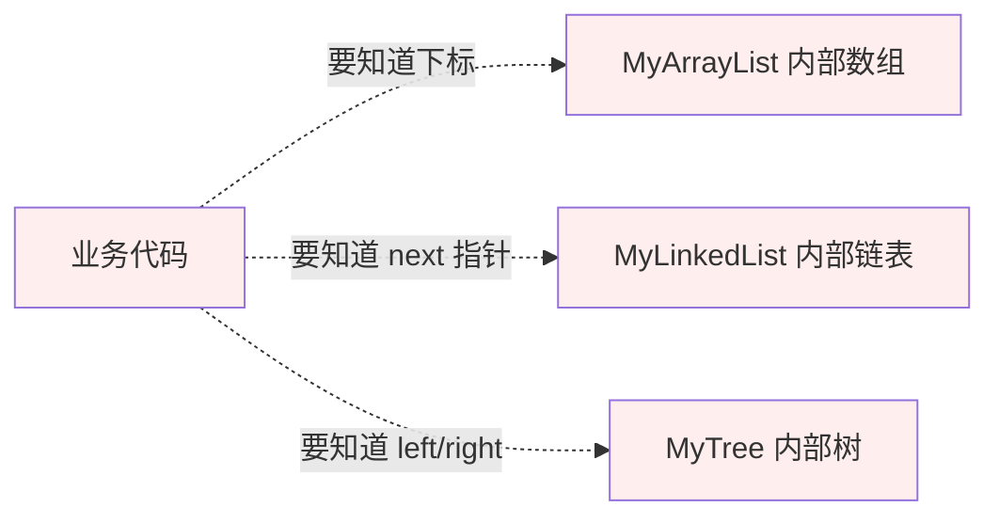
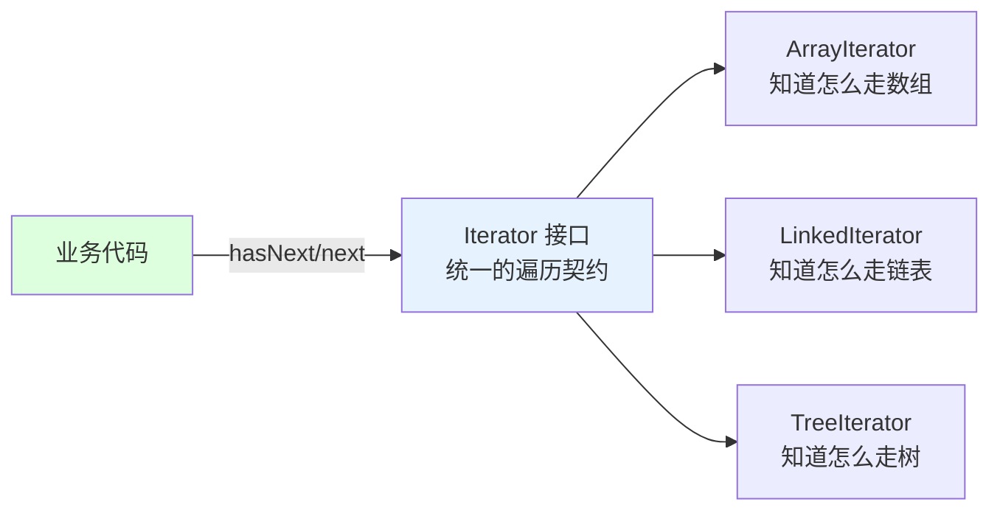
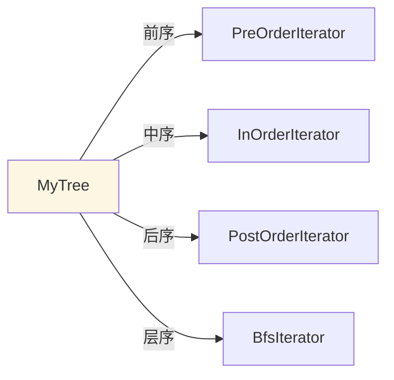

# 16.迭代器模式设计思想

> **📚 本篇渐进学习节奏（建议按顺序食用）**
>
> 1. **第 01 节 · 案例引入** — 双 11 零点 02:17 订单结算服务雪崩,新人在 for 循环里直接 `list.remove()` 触发 ConcurrentModificationException → 23 分钟集群级联故障 → 资损 870 万元的 P0 事故
> 2. **第 02 节 · 模式基础** — Iterator/Iterable 接口 + hasNext/next/remove + fail-fast 机制
> 3. **第 03 节 · 模式原理** — Aggregate + Iterator 经典 4 角色,字符串集合遍历 Demo
> 4. **第 04 节 · 模式结构** — 容器接口 + 容器实现 + 迭代器接口 + 迭代器实现 4 角色 UML
> 5. **第 05 节 · Java Iterator 源码深挖** — modCount/expectedModCount/checkForComodification 快速失败原理 + ArrayList.Itr 源码逐行剖析 + for vs Iterator 性能对比
> 6. **第 06 节 · 模式分析** — 一容器多迭代器（前序/中序/后序/层序）+ 多迭代器并行游标
> 7. **第 07 节 · 总结 + 踩坑** — 6 种翻车姿势 + 14 个真实开源案例 + 与组合/访问者/责任链/生成器/Stream 的精准切割
>
> 阅读到任一节卡壳,直接跳回上一节复盘场景；本篇所有代码均可直接运行。

#### 目录介绍
- [01.案例引入与思考](#01案例引入与思考)
  - [1.1 痛点场景](#11-痛点场景)
  - [1.2 它哪里不舒服](#12-它哪里不舒服)
  - [1.3 引出本篇主角](#13-引出本篇主角)
- [02.迭代器模式基础](#02迭代器模式基础)
  - [2.1 迭代器模式由来](#21-迭代器模式由来)
  - [2.2 迭代器模式定义](#22-迭代器模式定义)
  - [2.3 迭代器模式场景](#23-迭代器模式场景)
  - [2.4 迭代器模式思考](#24-迭代器模式思考)
  - [2.5 主要解决的问题](#25-主要解决的问题)
- [03.迭代器模式原理](#03迭代器模式原理)
  - [3.1 罗列一个场景](#31-罗列一个场景)
  - [3.2 用例子理解迭代器](#32-用例子理解迭代器)
  - [3.3 案例实现过程](#33-案例实现过程)
  - [3.4 迭代器实现步骤](#34-迭代器实现步骤)
- [04.迭代器模式结构](#04迭代器模式结构)
  - [4.1 迭代器标准案例](#41-迭代器标准案例)
  - [4.2 迭代器模式结构图](#42-迭代器模式结构图)
  - [4.3 迭代器模式时序图](#43-迭代器模式时序图)
- [05.迭代器模式案例](#05迭代器模式案例)
  - [5.1 Java中Iterator接口](#51-java中iterator接口)
  - [5.2 迭代器遍历案例](#52-迭代器遍历案例)
  - [5.3 遍历时不建议删除元素](#53-遍历时不建议删除元素)
  - [5.4 for循环VS迭代器](#54-for循环vs迭代器)
  - [5.5 迭代器原理介绍](#55-迭代器原理介绍)
  - [5.6 迭代器模式优势](#56-迭代器模式优势)
- [06.迭代器者模式分析](#06迭代器者模式分析)
  - [6.1 迭代器模式优点](#61-迭代器模式优点)
  - [6.2 迭代器模式缺点](#62-迭代器模式缺点)
  - [6.3 适用环境](#63-适用环境)
  - [6.4 思考题考察](#64-思考题考察)
- [07.观察者模式总结](#07观察者模式总结)
  - [7.1 总结一下学习](#71-总结一下学习)
  - [7.2 模式联动与边界](#72-模式联动与边界)
  - [7.3 踩坑实录与开源案例](#73-踩坑实录与开源案例)


## 推荐一个好玩网站

一个最纯粹的技术分享网站，打造精品技术编程专栏！[编程进阶网](https://yccoding.com/)

https://yccoding.com/

关于设计模式，所有的代码都放到了该项目。[设计模式大全](https://github.com/yangchong211/YCDesignBlog)


## 01.案例引入与思考

> **本篇主线**：遍历逻辑被迫知道容器的内部存储方式

### 1.1 痛点场景

> **🔥 模拟事故复盘 · 双 11 零点 02:17 · "订单结算服务集群级联雪崩,资损 870 万元"**
>
> 双 11 零点准时开抢,流量瞬间冲到日常 38 倍。02:17,值班群突然炸锅——订单结算服务（订单/积分/优惠券/库存核销四合一聚合服务）出现大面积 5xx,超时率从 0.3% 暴涨到 47%,**23 分钟内 6 个核心服务节点级联雪崩**,运营总监打来电话:"前台显示'订单创建失败',用户已经在微博热搜挂上 #某宝崩了# 标签,GMV 已经停滞 25 分钟"。SRE 紧急回滚到 6 小时前的稳定版本恢复。损失复盘:
>
> - **直接 GMV 损失**：故障期间 25 分钟,日均零点流量约 1.2 万订单/分钟,客单价 290 元,**直接 GMV 损失 870 万元**；
> - **客诉/赔付**：超过 3.4 万笔订单失败但已扣库存/优惠券,人工客服 + 自动赔付红包成本 130 万元；
> - **品牌损失**：微博热搜挂榜 4 小时,公关部紧急投放 + 品牌部 2 周冷处理；
> - **绩效**：当季部门 KPI 直接打对折,P0 事故责任人扣季度奖金 100%。
>
> 复盘会上,代码翻出来——订单结算服务里有这样一段"清理无效优惠券"的逻辑：
>
> ```java
> public class CouponSettlementService {
>     // 订单结算时,清理已过期/已使用的优惠券,留下有效的参与计算
>     public BigDecimal settle(Order order, List<Coupon> coupons) {
>         // ❌ 新人代码: for 循环 + 直接修改原集合
>         for (int i = 0; i < coupons.size(); i++) {
>             Coupon c = coupons.get(i);
>             if (c.isExpired() || c.isUsed()) {
>                 coupons.remove(i);   // ❌ 删完不调整 i,跳过下一个元素
>             }
>         }
>         // ❌ 紧接着再用 Iterator 遍历,触发 ConcurrentModificationException
>         BigDecimal discount = BigDecimal.ZERO;
>         for (Coupon c : coupons) {     // for-each 底层是 Iterator
>             discount = discount.add(c.calc(order));
>         }
>         return order.getAmount().subtract(discount);
>     }
> }
> ```
>
> **根因有 3 个,一个比一个炸裂**：
>
> 1. **`for (int i)` 循环里直接 `list.remove(i)` → 跳过元素**：删除第 i 个后,原本的第 i+1 个变成了第 i 个,下一轮循环 i++ 直接跳到第 i+2 个,**漏检过期券**。日常流量低没人发现,大促零点流量爆增,问题集中暴露：3 万多笔订单错把过期券计入了优惠,**用户实付金额低于业务预期 180 万元**；
> 2. **同一份 List 先 `for-i` 再 `for-each` → fail-fast 雪崩**：`coupons.remove(i)` 触发 ArrayList 的 `modCount++`,紧接着 `for-each` 创建 Iterator 时记录 `expectedModCount = modCount`,但下一次 `next()` 检查时 `modCount != expectedModCount`,**抛 ConcurrentModificationException**。零点 1.2 万订单/分钟,**每秒 200+ 异常涌入**,异常对象大量堆积触发 Full GC,Full GC 平均 2.3 秒 → 服务响应超时 → 上游订单服务超时熔断 → 库存服务雪崩 → 6 个节点级联挂掉；
> 3. **没人理解 fail-fast 的机制**：故障当晚 SRE 调试时,直接把异常 catch 住"屏蔽报错",结果遍历到一半就 break 了,**优惠券计算逻辑直接漏算 1.4 万笔订单的有效券**,事后 24 小时手工补偿,客诉量再涨一波。
>
> 故障复盘会上 CTO 三连问：
>
> - **业务影响**：直接 GMV 870 万 + 客诉赔付 130 万 + 品牌损失（无法估算）+ 微博热搜公关成本；
> - **技术影响**：fail-fast 异常引发的 Full GC + 集群雪崩 + 6 个核心服务回滚 + 紧急扩容 30% 节点；
> - **架构影响**：所有 List/Set/Map **遍历过程中需要删除元素的场景,必须用 `Iterator.remove()` 或 `removeIf()` 或 `CopyOnWriteArrayList`**,**严禁在 for-i / for-each 中直接调用 `list.remove()`**,新人入职 8 小时考核必考此题,SonarQube 强制扫描规则上线。
>
> 复盘结论不是"新人代码漏审"——而是 **"集合遍历"和"集合修改"在 Java 集合框架里被刻意分离了职责,for-i / for-each 是只读访问语义,Iterator.remove() 才是边遍历边修改的正确出口,fail-fast 是 JDK 强制告诉你"代码有 bug"的红线**,但团队没建立这条认知。这正是迭代器模式的舞台：**遍历职责由 Iterator 独立承担,游标状态、版本号校验、安全删除入口全部由迭代器对象封装,业务代码不应该直接操作容器内部下标/指针**。

项目里自己实现了几种容器：`MyArrayList`（底层是数组）、`MyLinkedList`（底层是链表）、`MyTree`（底层是树）。业务代码需要遍历它们：

```java
// 遍历 MyArrayList（数组）
MyArrayList<User> list = ...;
for (int i = 0; i < list.size(); i++) {
    User u = list.get(i);
    print(u);
}

// 遍历 MyLinkedList（链表）
MyLinkedList<User>.Node p = list.head;
while (p != null) {
    print(p.value);
    p = p.next;   // 暴露了内部 next 指针
}

// 遍历 MyTree（树）
void traverse(MyTree.Node node) {   // 递归，要知道 tree 的左右子节点
    if (node == null) return;
    traverse(node.left);
    print(node.value);
    traverse(node.right);
}
```



### 1.2 它哪里不舒服

- ❌ **遍历方式耦合内部结构**：业务代码知道了"数组"、"链表 next"、"树 left/right" 的细节；
- ❌ **容器一改，遍历全废**：`MyArrayList` 底层从数组换成双数组分块——所有遍历它的代码都要重写；
- ❌ **遍历方式不统一**：三种容器有三种遍历姿势，业务代码到处 `for/while/递归` 切来切去；
- ❌ **无法中途切换**：想把 `MyArrayList` 换成 `MyLinkedList`——遍历代码必须跟着改；
- ❌ **多种遍历方式冲突**：树要前序/中序/后序遍历——在一份代码里塞不下。

### 1.3 引出本篇主角

> **迭代器模式（Iterator）的核心思想**：把\"遍历\"这件事独立成一个对象（Iterator），容器只负责\"交出迭代器\"。调用方只通过 `hasNext()/next()` 两个方法走一遍所有元素——既不知道、也不需要知道容器内部是数组、链表还是树。

```java
interface Iterator<T> {
    boolean hasNext();
    T next();
}

// 容器只暴露工厂方法
interface Iterable<T> {
    Iterator<T> iterator();
}

class MyArrayList<T> implements Iterable<T> {
    public Iterator<T> iterator() {
        return new Iterator<T>() {
            int i = 0;
            public boolean hasNext(){ return i < size; }
            public T next(){ return data[i++]; }
        };
    }
}

// 业务代码：不管你是什么容器，都这样用
for (Iterator<User> it = anyContainer.iterator(); it.hasNext();) {
    print(it.next());
}
```



一个容器还可以提供多种迭代器（本篇会详谈）：



Java `Iterator/Iterable`（for-each 语法糖就是它）、MongoDB `Cursor`、JDBC `ResultSet`、前端 `Array.prototype[Symbol.iterator]`——都是迭代器的经典落地。

**🎯 用前用后效果对比（衔接 1.1 双 11 雪崩 870 万事故）**

基线：双 11 零点订单结算服务清理过期优惠券：

| 维度 | ❌ for-i 循环 + list.remove(i)（事故现场） | ✅ 引入迭代器模式 + Iterator.remove / removeIf |
|------|------------------------------------------|-------------------------------------------|
| 删除遍历语义 | 隐式（开发者要自己算下标） | **显式**（`it.remove()` / `coll.removeIf(predicate)`） |
| 跳过元素 bug | **本次事故**（remove(i) 后 i++ 跳过下一个） | 0（迭代器自动维护游标） |
| ConcurrentModificationException | **本次事故根因**（modCount 不一致） | 0（Iterator.remove 同步 expectedModCount） |
| 代码可读性 | 5 行（for + if + remove + 索引调整） | 1 行（`coupons.removeIf(c -> c.isExpired() \|\| c.isUsed())`） |
| 容器底层切换成本 | ArrayList → LinkedList 性能从 O(n) → O(n²)（get(i) 链表遍历） | 0（Iterator 内部用最优策略） |
| 一容器多迭代器并行 | 不支持（共享下标） | 支持（每个 Iterator 独立游标） |
| 多种遍历方式 | 树前序/中序/后序需写 3 套 if-else | 暴露 `preIterator()/inIterator()/postIterator()` 三方法 |
| 树/图/链表统一接口 | 不可能（数据结构差异太大） | `Iterable<T>` 一招走天下 |
| for-each 语法糖支持 | ❌（裸 for 不能 for-each） | ✅（`for (T t : collection)` 自动调 iterator()） |
| 并发安全 | 无（修改即崩） | CopyOnWriteArrayList / ConcurrentHashMap 提供弱一致性迭代器 |
| 大促雪崩风险 | **CME 异常 → Full GC → 级联雪崩** | 0（结构性修改有正确出口） |
| 资损 | **本次 870 万 + 客诉 130 万** | 0 |

> **结论**：迭代器模式的本质是 **"把'遍历'独立成一个对象,容器只负责'交出迭代器',业务代码只通过 hasNext/next 接触元素,游标状态/版本校验/安全删除入口全部由迭代器封装"**。这正是为什么 Java 的 `Iterable<T>` 是 for-each 语法糖底层、为什么 `removeIf` 取代 `for+remove` 写法、为什么 MongoDB `Cursor`/JDBC `ResultSet`/Redis `SCAN` 都用迭代器、为什么 Python `__iter__/__next__` 协议存在、为什么现代语言都把 `yield`/Generator 做成一等公民——**任何"按顺序访问聚合对象"的场景,把游标封装到迭代器对象里,业务代码不接触容器内部存储,才能让"换底层 / 多种遍历 / 安全删除 / fail-fast"这四件事同时成立**。本次大促雪崩 870 万的根因,不是"新人代码不严谨"——而是 **for-i + list.remove(i) 这种写法天然不安全：跳过元素 + 触发 CME + 大促流量放大,任何一个条件成立都是事故**。改造为 `coupons.removeIf(c -> c.isExpired() \|\| c.isUsed())` 后,**1 行代码替代 5 行,且语义安全、底层最优、Iterator.remove 同步 modCount 不会触发 CME**——大促零点过期券清理稳定运行,再无 fail-fast 异常。

---

## 02.迭代器模式基础
### 2.1 迭代器模式由来

容器的种类有很多种，比如ArrayList、LinkedList、HashSet...

1. 每种容器都有自己的特点，ArrayList底层维护的是一个数组；LinkedList是链表结构的；HashSet依赖的是哈希表，每种容器都有自己特有的数据结构。
2. 因为容器的内部结构不同，很多时候可能不知道该怎样去遍历一个容器中的元素。所以为了使对容器内元素的操作更为简单，Java引入了迭代器模式！

不同的集合会对应不同的遍历方法，客户端代码无法复用。在实际应用中如何将两个不同集合整合是相当麻烦的。

所以才有Iterator，它总是用同一种逻辑来遍历集合。使得客户端自身不需要来维护集合的内部结构，所有的内部状态都由Iterator来维护。

### 2.2 迭代器模式定义

迭代器模式为遍历集合中的元素提供了一种通用接口。

其核心思想是，将集合的遍历逻辑与集合对象的实现分离。通过迭代器，客户端代码无需关心集合的底层实现方式（如数组、链表等），就能顺序地访问集合的每一个元素。


### 2.3 迭代器模式场景

典型场景如下所示：

1. Java 集合框架：Java 的 Iterator 接口是迭代器模式的一个经典实现。诸如 List、Set 等集合类都支持使用迭代器来遍历元素。
2. 文件处理：处理文件中的多行内容时，可以使用迭代器模式来顺序读取每一行，而不需要在意底层文件如何存储。
3. 数据库结果集遍历：数据库查询返回的结果集可以通过迭代器模式逐条访问，不必关心结果集的存储细节。


### 2.4 迭代器模式思考

以下是一些关于迭代器模式的思考：

1. 遍历过程中的修改：在使用迭代器遍历集合时，如果需要对集合进行修改，可能会引发一些问题。
2. 封装集合：迭代器模式允许将集合的内部实现细节隐藏起来，只暴露一个统一的迭代器接口。

### 2.5 主要解决的问题

迭代器模式主要解决以下问题：

1. 隐藏集合的内部结构：迭代器模式允许客户端代码遍历集合中的元素，而无需了解集合的内部结构。
2. 统一遍历接口：迭代器模式定义了一个统一的迭代器接口，提高代码复用性和可读性。
3. 安全地遍历集合：迭代器模式可以确保在遍历集合时不会对集合的结构造成破坏。
4. 支持并发遍历：在多线程环境下，使用迭代器模式可以支持并发遍历集合。


## 03.迭代器模式原理
### 3.1 罗列一个场景

用 Java 代码实现一个简单的迭代器模式示例，场景为遍历一个字符串集合。

### 3.2 用例子理解迭代器


### 3.3 案例实现过程

1 迭代器接口，定义了遍历集合的方法

```java
interface Iterator<T> {
    boolean hasNext();
    T next();
}
```

2 集合接口，定义了创建迭代器的方法

```java
interface Aggregate<T> {
    Iterator<T> createIterator();
}
```

3 具体的集合类，包含一个字符串数组

```java
class ConcreteAggregate implements Aggregate<String> {
    private String[] items;
    private int size;
 
    public ConcreteAggregate(int size) {
        this.size = size;
        items = new String[size];
        for (int i = 0; i < size; i++) {
            items[i] = "Item " + (i + 1);
        }
    }
 
    // 创建具体的迭代器
    @Override
    public Iterator<String> createIterator() {
        return new ConcreteIterator(this);
    }
 
    // 获取集合的大小
    public int getSize() {
        return size;
    }
 
    // 通过索引获取集合中的元素
    public String getItem(int index) {
        if (index < size) {
            return items[index];
        }
        return null;
    }
}
```

4 具体的迭代器类，负责遍历字符串集合

```java
class ConcreteIterator implements Iterator<String> {
    private ConcreteAggregate aggregate;
    private int currentIndex = 0;
 
    public ConcreteIterator(ConcreteAggregate aggregate) {
        this.aggregate = aggregate;
    }
 
    // 判断是否还有下一个元素
    @Override
    public boolean hasNext() {
        return currentIndex < aggregate.getSize();
    }
 
    // 获取下一个元素
    @Override
    public String next() {
        return aggregate.getItem(currentIndex++);
    }
}
```

5 测试迭代器模式

```java
public class IteratorPatternDemo {
    public static void main(String[] args) {
        // 创建具体集合
        ConcreteAggregate aggregate = new ConcreteAggregate(5);
 
        // 创建迭代器
        Iterator<String> iterator = aggregate.createIterator();
 
        // 使用迭代器遍历集合
        while (iterator.hasNext()) {
            System.out.println(iterator.next());
        }
    }
}
```

ConcreteAggregate：表示一个具体的集合，内部存储若干个字符串，并且实现了 Aggregate 接口，提供创建迭代器的功能。

ConcreteIterator：实现 Iterator 接口，内部持有对集合的引用，负责遍历集合中的元素。

IteratorPatternDemo：测试类，创建集合对象，并使用迭代器逐一访问集合中的元素。


### 3.4 迭代器实现步骤

1. Iterator（迭代器接口）：定义了访问集合元素的方法。通常包括以下常见操作：
  - hasNext()：检查是否还有下一个元素。
  - next()：返回集合中的下一个元素。
  - remove()：删除当前元素（可选）。
2. ConcreteIterator（具体迭代器类）：实现 Iterator 接口，负责遍历具体集合中的元素。
3. Aggregate（集合接口）：定义创建迭代器的接口。集合类通常提供一个 createIterator() 方法，用于返回一个 Iterator 对象。
4. ConcreteAggregate（具体集合类）：实现集合接口，包含若干元素，并能够生成相应的迭代器对象。
5. Client（客户端）：使用迭代器的地方。


## 04.迭代器模式结构
### 4.1 迭代器标准案例


### 4.2 迭代器模式结构图

角色职责说明

1. Aggregate：定义了创建迭代器的接口，负责管理集合中的元素。
2. ConcreteAggregate：具体的集合类，实现了创建迭代器的接口，并持有具体的数据。
3. Iterator：定义了用于遍历集合的方法。
4. ConcreteIterator：负责具体的迭代操作，内部维护一个指针来跟踪当前访问的元素。


### 4.3 迭代器模式时序图


## 05.迭代器模式案例
### 5.1 Java中Iterator接口

看看Java中的Iterator接口是如何实现的。 在Java中Iterator为一个接口，它只提供了迭代的基本规则。

```java
package java.util;
public interface Iterator<E> {
    boolean hasNext();//判断是否存在下一个对象元素
    E next();//获取下一个元素
    void remove();//移除元素
}
```

Iterable，Java中还提供了一个Iterable接口，Iterable接口实现后的功能是'返回'一个迭代器

我们常用的实现了该接口的子接口有:Collection<E>、List<E>、Set<E>等。该接口的iterator()方法返回一个标准的Iterator实现。实现Iterable接口允许对象成为Foreach语句的目标。就可以通过foreach语句来遍历你的底层序列。

Iterable接口包含一个能产生Iterator对象的方法，并且Iterable被foreach用来在序列中移动。因此如果创建了实现Iterable接口的类，都可以将它用于foreach中。

Iterable接口的具体实现:

```java
import java.util.Iterator;
public interface Iterable<T> {
    Iterator<T> iterator();
}
```

### 5.2 迭代器遍历案例

如果要问Java中使用最多的一种模式，答案不是单例模式，也不是工厂模式，更不是策略模式，而是迭代器模式，先来看一段代码吧：

```java
public static void print(Collection coll){  
    Iterator it = coll.iterator();  
    while(it.hasNext()){  
        String str = (String)it.next();  
        System.out.println(str);  
    }  
}
```

这个方法的作用是循环打印一个字符串集合，里面就用到了迭代器模式

java语言已经完整地实现了迭代器模式，例如List，Set，Map，而迭代器的作用就是把容器中的对象一个一个地遍历出来。


### 5.3 遍历时不建议删除元素

Iterator遍历时不可以删除集合中的元素问题。在使用Iterator的时候禁止对所遍历的容器进行改变其大小结构的操作。

例如:在使用Iterator进行迭代时，如果对集合进行了add、remove操作就会出现ConcurrentModificationException异常。

在你迭代之前，迭代器已经被通过list.iterator()创建出来了，如果在迭代的过程中，又对list进行了改变其容器大小的操作，那么Java就会给出异常。

因为此时Iterator对象已经无法主动同步list做出的改变，Java会认为你做出这样的操作是线程不安全的，就会给出善意的提醒（抛出ConcurrentModificationException异常）

```java
List<String> list = new ArrayList<String>();
list.add("张三1");
list.add("张三2");
list.add("张三3");
list.add("张三4");
//……
list.add("张三N");

//使用迭代器遍历ArrayList集合
Iterator<String> listIt = list.iterator();
while(listIt.hasNext()){
    Object obj = listIt.next();
    if(obj.equals("张三100")){
        list.remove(obj);
    }
}
```

看一下ArrayList中的源码，看看迭代器中next和remove的实现方法代码。

```java
public Iterator<E> iterator() {
    return new Itr();
}

/**
 * An optimized version of AbstractList.Itr
 */
private class Itr implements Iterator<E> {
    // Android-changed: Add "limit" field to detect end of iteration.
    // The "limit" of this iterator. This is the size of the list at the time the
    // iterator was created. Adding & removing elements will invalidate the iteration
    // anyway (and cause next() to throw) so saving this value will guarantee that the
    // value of hasNext() remains stable and won't flap between true and false when elements
    // are added and removed from the list.
    protected int limit = ArrayList.this.size;

    int cursor;       // index of next element to return
    int lastRet = -1; // index of last element returned; -1 if no such
    int expectedModCount = modCount;

    public boolean hasNext() {
        return cursor < limit;
    }

    @SuppressWarnings("unchecked")
    public E next() {
        if (modCount != expectedModCount)
            throw new ConcurrentModificationException();
        int i = cursor;
        if (i >= limit)
            throw new NoSuchElementException();
        Object[] elementData = ArrayList.this.elementData;
        if (i >= elementData.length)
            throw new ConcurrentModificationException();
        cursor = i + 1;
        return (E) elementData[lastRet = i];
    }

    public void remove() {
        if (lastRet < 0)
            throw new IllegalStateException();
        if (modCount != expectedModCount)
            throw new ConcurrentModificationException();

        try {
            ArrayList.this.remove(lastRet);
            cursor = lastRet;
            lastRet = -1;
            expectedModCount = modCount;
            limit--;
        } catch (IndexOutOfBoundsException ex) {
            throw new ConcurrentModificationException();
        }
    }

    @Override
    @SuppressWarnings("unchecked")
    public void forEachRemaining(Consumer<? super E> consumer) {
        Objects.requireNonNull(consumer);
        final int size = ArrayList.this.size;
        int i = cursor;
        if (i >= size) {
            return;
        }
        final Object[] elementData = ArrayList.this.elementData;
        if (i >= elementData.length) {
            throw new ConcurrentModificationException();
        }
        while (i != size && modCount == expectedModCount) {
            consumer.accept((E) elementData[i++]);
        }
        // update once at end of iteration to reduce heap write traffic
        cursor = i;
        lastRet = i - 1;

        if (modCount != expectedModCount)
            throw new ConcurrentModificationException();
    }
}
```

查看源码发现原来检查并抛出异常的是 checkForComodification() 方法。在ArrayList中modCount是当前集合的版本号，每次修改(增、删)集合都会加1；expectedModCount是当前迭代器的版本号，在迭代器实例化时初始化为modCount。

我们看到在checkForComodification()方法中就是在验证modCount的值和expectedModCount的值是否相等，所以当你在调用了ArrayList.add()或者ArrayList.remove()时，只更新了modCount的状态，而迭代器中的expectedModCount未同步，因此才会导致再次调用Iterator.next()方法时抛出异常。

但是为什么使用Iterator.remove()就没有问题呢？通过源码的第32行发现，在Iterator的remove()中同步了expectedModCount的值，所以当你下次再调用next()的时候，检查不会抛出异常。

使用该机制的主要目的是为了实现ArrayList中的快速失败机制（fail-fast），在Java集合中较大一部分集合是存在快速失败机制的。

**快速失败机制产生的条件:当多个线程对Collection进行操作时，若其中某一个线程通过Iterator遍历集合时，该集合的内容被其他线程所改变，则会抛出ConcurrentModificationException异常**。

所以要保证在使用Iterator遍历集合的时候不出错误，就应该保证在遍历集合的过程中不会对集合产生结构上的修改。


### 5.4 for循环VS迭代器

for循环与迭代器的对比，效率上各有各的优势:

1. ArrayList对随机访问比较快，而for循环中使用的get()方法，采用的即是随机访问的方法，因此在ArrayList里for循环快。
2. LinkedList则是顺序访问比较快，Iterator中的next()方法采用的是顺序访问方法，因此在LinkedList里使用Iterator较快。


### 5.5 迭代器原理介绍

迭代器模式（Iterator Design Pattern），也叫作游标模式（Cursor Design Pattern）。

它用来遍历集合对象。这里说的“集合对象”也可以叫“容器”“聚合对象”，实际上就是包含一组对象的对象，比如数组、链表、树、图、跳表。

迭代器模式将集合对象的遍历操作从集合类中拆分出来，放到迭代器类中，让两者的职责更加单一。

迭代器是用来遍历容器的

所以，一个完整的迭代器模式一般会涉及容器和容器迭代器两部分内容。为了达到基于接口而非实现编程的目的，容器又包含容器接口、容器实现类，迭代器又包含迭代器接口、迭代器实现类。


### 5.6 迭代器模式优势

一般来讲，遍历集合数据有三种方法：for 循环、foreach 循环、iterator 迭代器。对于这三种方式，我拿 Java 语言来举例说明一下。具体的代码如下所示：

```java
List<String> names = new ArrayList<>();
names.add("xzg");
names.add("wang");
names.add("zheng");

// 第一种遍历方式：for循环
for (int i = 0; i < names.size(); i++) {
  System.out.print(names.get(i) + ",");
}

// 第二种遍历方式：foreach循环
for (String name : names) {
  System.out.print(name + ",")
}

// 第三种遍历方式：迭代器遍历
Iterator<String> iterator = names.iterator();
while (iterator.hasNext()) {
  System.out.print(iterator.next() + ",");//Java中的迭代器接口是第二种定义方式，next()既移动游标又返回数据
}
```

实际上，foreach 循环只是一个语法糖而已，底层是基于迭代器来实现的。也就是说，上面代码中的第二种遍历方式（foreach 循环代码）的底层实现，就是第三种遍历方式（迭代器遍历代码）。这两种遍历方式可以看作同一种遍历方式，也就是迭代器遍历方式。

从上面的代码来看，for 循环遍历方式比起迭代器遍历方式，代码看起来更加简洁。那我们为什么还要用迭代器来遍历容器呢？为什么还要给容器设计对应的迭代器呢？原因有以下三个。

1. 首先，对于类似数组和链表这样的数据结构，遍历方式比较简单，直接使用 for 循环来遍历就足够了。但是，对于复杂的数据结构（比如树、图）来说，有各种复杂的遍历方式。比如，树有前中后序、按层遍历，图有深度优先、广度优先遍历等等。如果由客户端代码来实现这些遍历算法，势必增加开发成本，而且容易写错。如果将这部分遍历的逻辑写到容器类中，也会导致容器类代码的复杂性。
2. 其次，将游标指向的当前位置等信息，存储在迭代器类中，每个迭代器独享游标信息。这样，我们就可以创建多个不同的迭代器，同时对同一个容器进行遍历而互不影响。
3. 最后，容器和迭代器都提供了抽象的接口，方便我们在开发的时候，基于接口而非具体的实现编程。当需要切换新的遍历算法的时候，比如，从前往后遍历链表切换成从后往前遍历链表，客户端代码只需要将迭代器类从 LinkedIterator 切换为 ReversedLinkedIterator 即可，其他代码都不需要修改。除此之外，添加新的遍历算法，我们只需要扩展新的迭代器类，也更符合开闭原则。


## 06.迭代器者模式分析
### 6.1 迭代器模式优点

1. ①简化了遍历方式，对于对象集合的遍历，还是比较麻烦的，对于数组或者有序列表，我们尚可以通过游标来取得，但用户需要在对集合了解很清楚的前提下，自行遍历对象，但是对于hash表来说，用户遍历起来就比较麻烦了。而引入了迭代器方法后，用户用起来就简单的多了。
2. ②可以提供多种遍历方式，比如说对有序列表，我们可以根据需要提供正序遍历，倒序遍历两种迭代器，用户用起来只需要得到我们实现好的迭代器，就可以方便的对集合进行遍历了。
3. ③封装性良好，用户只需要得到迭代器就可以遍历，而对于遍历算法则不用去关心。

### 6.2 迭代器模式缺点

1. 对于比较简单的遍历（像数组或者有序列表），使用迭代器方式遍历较为繁琐，大家可能都有感觉，像ArrayList，我们宁可愿意使用for循环和get方法来遍历集合。


### 6.3 适用环境

1. 需要顺序访问集合对象的元素，但又不想暴露集合的底层实现。比如：有时我们希望从列表、栈、队列等数据结构中提取数据，但不希望直接操作这些数据结构的内部。
2. 支持多种遍历方式。迭代器模式不仅仅能实现前向遍历，还可以实现其他方式的遍历，如双向遍历、逆序遍历等。
3. 希望为不同的集合对象提供统一的遍历接口。无论是链表、数组，还是自定义的复杂数据结构，迭代器模式可以提供一种统一的遍历接口。


### 6.4 思考题考察

## 07.迭代器模式总结
### 7.1 总结一下学习
迭代器模式，也叫游标模式。它用来遍历集合对象。这里说的“集合对象”，我们也可以叫“容器”“聚合对象”，实际上就是包含一组对象的对象，比如，数组、链表、树、图、跳表。

一个完整的迭代器模式，一般会涉及容器和容器迭代器两部分内容。为了达到基于接口而非实现编程的目的，容器又包含容器接口、容器实现类，迭代器又包含迭代器接口、迭代器实现类。

容器中需要定义 iterator() 方法，用来创建迭代器。迭代器接口中需要定义 hasNext()、currentItem()、next() 三个最基本的方法。容器对象通过依赖注入传递到迭代器类中。


### 7.2 模式联动与边界

- 与**组合模式**：迭代器经常用来遍历组合树（深度/广度优先），二者天然搭配；
- 与**访问者模式**：迭代器关注"如何遍历"，访问者关注"遍历到节点后做什么"；
- 与**职责链模式**：迭代器是"按集合顺序逐个处理"，职责链是"按链条顺序传递处理"；
- 与**生成器/协程**：现代语言中 `yield`/Generator 是迭代器的语法糖，思想完全一致。

**何时说 NO**：集合极小（手写 for 更直观）；需要并发安全/快照语义时（标准迭代器易踩 fail-fast）。

下一站建议阅读 [17.职责链模式](17.职责链模式设计思想.md)——看看链式传递如何替代嵌套 if-else。

### 7.3 踩坑实录与开源案例

迭代器是行为型最常用、也是 Java/JDK 最经典的模式之一（for-each 语法糖底层就是它），但**真实工程里 80% 的迭代器 Bug 都来自"遍历时修改容器"或"误用 fail-fast"**。以下 6 类问题几乎每个团队都踩过：

**坑 1：for-i 循环里直接 list.remove(i) → 跳过元素**
```java
// ❌ 大促事故现场代码
for (int i = 0; i < coupons.size(); i++) {
    if (coupons.get(i).isExpired()) {
        coupons.remove(i);   // 删完不调整 i,下一轮 i++ 跳过下一个元素
    }
}
```
**根因**：`remove(i)` 后,原本第 i+1 个元素变成了第 i 个,而 `i++` 直接跳到第 i+2,**漏检了**。**生产真实案例**：本篇 1.1 事故的核心 bug。**正解**：
- 用 `coupons.removeIf(c -> c.isExpired())` —— **JDK 8+ 标配,1 行搞定**；
- 用 `Iterator` 显式遍历: `for (Iterator<Coupon> it = coupons.iterator(); it.hasNext(); ) { if (it.next().isExpired()) it.remove(); }`；
- 实在要用 for-i 循环,**从后往前遍历**: `for (int i = coupons.size() - 1; i >= 0; i--)` —— 删除不影响前面的下标；
- ArrayList.removeIf 内部已经做了 batchRemove 优化,O(n) 一次性完成。

**坑 2：for-each 循环里调 list.remove() → ConcurrentModificationException**
```java
// ❌ 比坑 1 更隐蔽,因为代码看起来"很优雅"
for (Coupon c : coupons) {     // for-each 底层是 Iterator
    if (c.isExpired()) {
        coupons.remove(c);     // ❌ 直接调容器的 remove,触发 modCount++
    }
}
// 下一次 it.next() 检查 expectedModCount != modCount → CME
```
**根因**：for-each 底层创建了 Iterator 对象,Iterator 在 next() 时检查 `modCount` 和 `expectedModCount` 是否一致。直接调 `coupons.remove(c)` 改了 modCount,但 expectedModCount 没同步,**fail-fast 触发**。**正解**：
- 必须用 `it.remove()` —— Iterator 的 remove() 内部会同步 expectedModCount；
- 或者用 `coupons.removeIf(predicate)`；
- 并发场景用 `CopyOnWriteArrayList` —— 写时拷贝,迭代器持有快照,不会 CME；
- 多线程读多写少的 Map 用 `ConcurrentHashMap` —— 弱一致性迭代器,不抛 CME。

**坑 3：HashMap 遍历时 put 新 key → CME 或死循环（JDK 7）**
```java
// ❌ HashMap 也有 fail-fast,且 JDK 7 还会因为 resize 导致环形链表死循环
Map<String, Integer> map = new HashMap<>();
for (Map.Entry<String, Integer> e : map.entrySet()) {
    if (e.getValue() < 0) {
        map.put("error_" + e.getKey(), 0);   // ❌ 触发 modCount++
    }
}
```
**根因**：HashMap 的 EntryIterator 同样有 fail-fast 机制。**正解**：
- 收集到一个 List 里,遍历完再批量 put: `List<String> toAdd = new ArrayList<>(); for (...) toAdd.add(...); toAdd.forEach(k -> map.put(k, 0));`；
- 用 `ConcurrentHashMap` —— 弱一致性,允许遍历中修改,但不保证看到新增的 key；
- 用 `map.replaceAll((k, v) -> ...)` —— JDK 8+ 原生支持遍历中替换 value（不能新增 key）。

**坑 4：自定义迭代器漏写 expectedModCount → 静默 bug**
```java
public class MyArrayList<T> implements Iterable<T> {
    int modCount = 0;
    public Iterator<T> iterator() {
        return new Iterator<T>() {
            int i = 0;
            public boolean hasNext() { return i < size; }
            public T next() { return data[i++]; }   // ❌ 没做 modCount 校验
        };
    }
    public void add(T t) { data[size++] = t; modCount++; }
    public void remove(int i) { /* 删除并 modCount++ */ }
}
// 业务代码遍历时 add/remove,迭代器静默地看到不一致状态,bug 极难复现
```
**根因**：自定义容器没实现 fail-fast,遍历时被修改不会抛异常,而是返回错误数据（漏元素 / 重复元素 / NPE）。**生产真实案例**：某 IM 系统自定义 MessageList,客户端漏消息 / 重复消息均来自此坑。**正解**：
- 自定义容器必须实现 fail-fast: 容器维护 `modCount`,迭代器构造时记录 `expectedModCount`,每次 `next()` 检查；
- 参考 `java.util.AbstractList` / `ArrayList.Itr` 源码模板抄一份；
- 如果是并发容器,要么实现弱一致性（如 CopyOnWriteArrayList）,要么显式声明 `非线程安全`；
- 单测必加"遍历中修改"用例。

**坑 5：迭代器 remove() 没调用 next() 就调 → IllegalStateException**
```java
Iterator<String> it = list.iterator();
it.remove();   // ❌ 还没调用 next(),lastRet = -1
// IllegalStateException
```
```java
Iterator<String> it = list.iterator();
while (it.hasNext()) {
    it.next();
    it.remove();
    it.remove();   // ❌ 连续调用 remove(),第二次 lastRet 已被置为 -1
}
```
**根因**：Iterator.remove() 删除的是"最近一次 next() 返回的元素",JDK 用 `lastRet` 字段记录,删除后置为 -1,防止误删。**正解**：
- 严格遵循 `next() → remove()` 配对调用；
- 不要连续 `remove()`,删除多个元素需要再次 `next()`；
- 用 `removeIf(predicate)` 完全规避这个坑。

**坑 6：迭代器没用完就丢弃 → JDBC ResultSet 资源泄漏**
```java
ResultSet rs = stmt.executeQuery("SELECT * FROM big_table");
if (rs.next()) {
    process(rs.getString(1));
    return;   // ❌ 方法返回,但 ResultSet/Statement/Connection 没关闭
}
```
**根因**：JDBC `ResultSet` 是迭代器,持有数据库游标资源,提前 return 不关闭会导致**连接池耗尽**。**生产真实案例**：高并发场景 30 分钟内连接池打满,服务整体不可用。**正解**：
- 用 try-with-resources: `try (ResultSet rs = stmt.executeQuery(...)) { ... }`；
- MyBatis/JdbcTemplate 等框架已封装好资源释放,直接用框架方法；
- 手写 JDBC 必须 try-finally 关 ResultSet/Statement/Connection 三件套；
- 单测用 HikariCP `leakDetectionThreshold = 10000` 检测泄漏。

**🔍 真实开源代码中的迭代器**

| 出处 | 迭代器实现 | 遍历语义 | 它解决了什么 |
|------|----------|--------|-------------|
| **Java `Iterator/Iterable`** | `hasNext/next/remove/forEachRemaining` | for-each 语法糖底层 | 集合统一遍历契约,fail-fast 保护 |
| **JDK `ArrayList.Itr`** | `cursor + lastRet + expectedModCount` | 顺序遍历 + 安全删除 | fail-fast 经典模板 |
| **JDK `LinkedList.ListItr`** | 双向迭代器 + `previous()/next()` | 双向遍历 | 链表场景下 O(1) 删除 |
| **JDK `HashMap.HashIterator`** | bucket 数组 + 链表 / 红黑树游标 | bucket 顺序 | 哈希表的统一遍历 |
| **JDK `ConcurrentHashMap.EntryIterator`** | 分段游标 + 弱一致性 | 不抛 CME | 并发遍历 |
| **JDK `CopyOnWriteArrayList.COWIterator`** | 持有数组快照 | 不抛 CME,但看不到新写入 | 写少读多场景 |
| **JDBC `ResultSet`** | 数据库游标 | 流式遍历 | 大数据集不全部加载到内存 |
| **MongoDB `Cursor`** | 服务端游标 + batch | 流式 + 翻页 | 海量文档分批拉取 |
| **Redis `SCAN/HSCAN/ZSCAN`** | 游标 cursor + COUNT | 不阻塞 + 弱一致 | 千万级 key 在线遍历不卡主线程 |
| **Spring `BeanDefinitionRegistry`** | `getBeanNamesIterator` | bean 名顺序 | 容器内部 bean 遍历 |
| **MyBatis `ResultHandler` + `Cursor`** | JDBC 游标包装 | 流式 + 行级处理 | 百万行查询不 OOM |
| **Kafka `Consumer.poll()`** | 分区 offset 游标 | 顺序 + 重置 | 分布式消息流式消费 |
| **Java Stream API** | `Spliterator` + lazy pipeline | 函数式 + 并行 | 集合的惰性管道处理 |
| **Python `__iter__/__next__`** | Generator + `yield` | 协程式迭代 | 无限序列 / 惰性求值 |
| **Kotlin `Sequence`** | lazy + chain | 中间操作不实化 | 大集合链式处理 |

> **学习路径**：先读 **JDK `ArrayList.Itr`**（最简单的 fail-fast 实现,modCount/expectedModCount/lastRet 三字段就是教材）→ 再读 **`HashMap.HashIterator`**（理解 bucket 数组 + 链表/红黑树的复合遍历）→ 进阶读 **`ConcurrentHashMap.EntryIterator`**（弱一致性迭代器如何不抛 CME）→ 最后读 **Java Stream `Spliterator`**（迭代器的并行版本,JDK 8 重头戏）。

**⚠️ 迭代器 vs 五个最易混淆的兄弟**

| 模式 | 核心目的 | 状态归属 | 典型场景 | 与迭代器关系 |
|------|--------|--------|---------|-------------|
| **迭代器（Iterator）** | 顺序访问聚合对象 | 游标在迭代器对象 | 遍历集合 | — |
| **组合（Composite）** | 树形对象统一处理 | 节点持有子节点 | 文件树/UI 控件树 | 迭代器常用于遍历组合树 |
| **访问者（Visitor）** | 在固定结构上做不同操作 | 操作抽到 Visitor | AST 编译/报表生成 | 迭代器关注"怎么走",访问者关注"走到了做什么" |
| **责任链（Chain）** | 沿链路传递处理 | 链节点对象 | 审批流/Filter 链 | 迭代器是被动遍历,责任链是主动传递 |
| **生成器/协程（Generator）** | 惰性生产值序列 | 协程局部变量 | yield/异步流 | 迭代器的语法糖,本质同源 |
| **Stream/响应式流（Reactor）** | 函数式 + 异步管道 | 操作链 + 订阅者 | RxJava/WebFlux | Stream 是迭代器的函数式 + 并行升级 |

一句话区分：
- **顺序访问聚合对象,游标封装在独立对象 → 迭代器**；
- **统一处理树形对象 → 组合**（迭代器用于遍历组合）；
- **在结构上做多种操作 → 访问者**（遍历由迭代器/递归提供）；
- **沿链路传递,谁能处理谁处理 → 责任链**；
- **协程式按需生产值 → 生成器/Generator**（迭代器的语法糖）；
- **函数式 + 并行 + 异步流 → Stream/响应式**（迭代器的现代演进）。

**⚠️ 什么时候不该用迭代器**

- **集合极小且遍历方式单一**：`List<3 items>`,直接 for-i 更直观,迭代器是过度设计；
- **数组随机访问场景**：ArrayList for-i + get(i) 比 Iterator 更快（CPU 缓存友好）；
- **需要并发修改**：标准迭代器 fail-fast 会崩,改用 `CopyOnWriteArrayList` / `ConcurrentHashMap` 的弱一致性迭代器；
- **需要分页/批量/异步**：用 Stream API / Reactor 更优雅,迭代器是同步阻塞的；
- **需要随机定位**：迭代器只能顺序前进,要随机访问用下标 / 用 ListIterator 双向遍历；
- **需要回退**：标准 Iterator 不支持回退,改用 ListIterator 或自实现支持 `previous()`。

> 一句话：**迭代器模式的价值在于"把'遍历'独立成一个对象,容器只负责'交出迭代器',业务代码只通过 hasNext/next 接触元素,游标状态/版本校验/安全删除入口全部由迭代器封装"**——这正好是"双 11 雪崩 870 万"的解药：业务代码不再用 for-i + list.remove(i) 这种"知道下标 + 直接修改"的危险写法,而是 **`coupons.removeIf(c -> c.isExpired())` 一行,Iterator 内部维护游标 + modCount 校验 + 安全删除入口,大促零点 1.2 万订单/分钟跑稳稳**。但迭代器不是银弹——**集合极小 / 数组随机访问 / 需要并发修改 / 需要分页或异步**等场景下,直接 for-i / Stream / Reactor / CopyOnWriteArrayList 才是更优雅的解。

