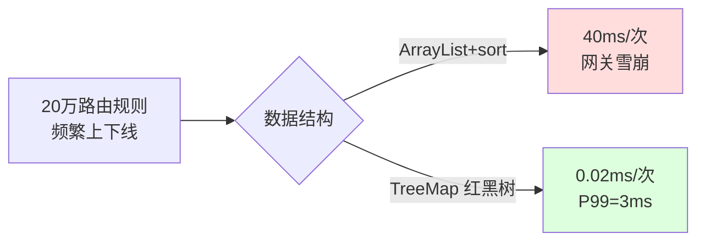
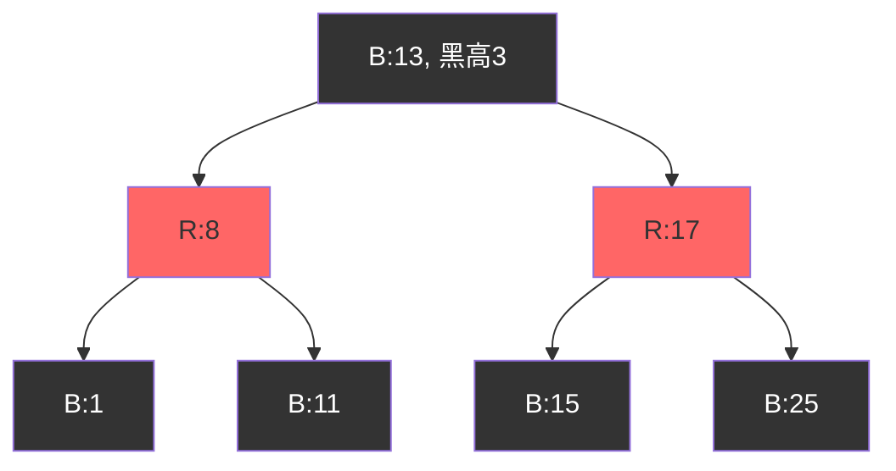
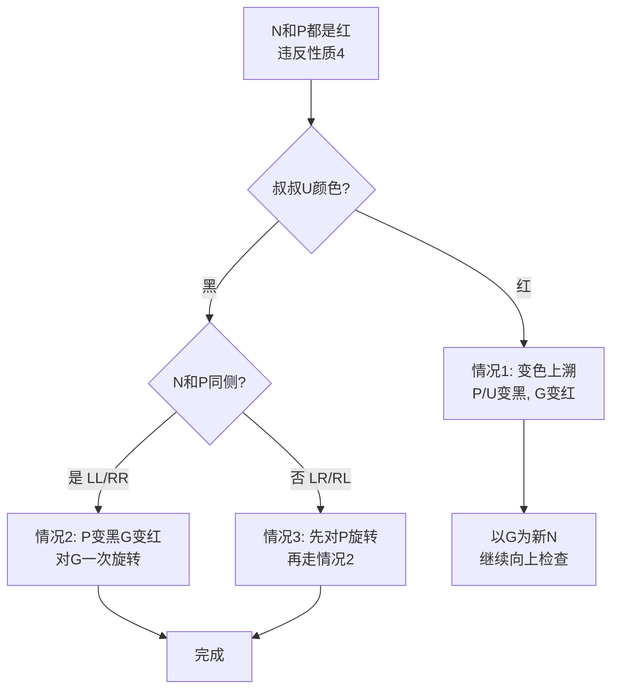
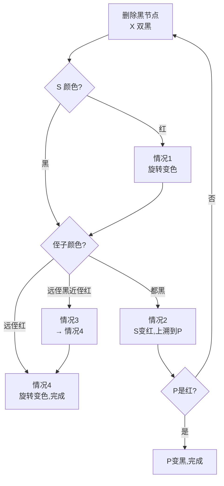

# 09.红黑树的操作实践

## 目录指引与导读

> 阅读建议：本篇围绕"红黑树为什么是工业默认平衡树"展开，先讲它和 AVL 的取舍，再走一遍五大性质 → 旋转 → 插入修复 → 删除修复 → 工业应用的完整链条。

- [01. 从工作案例说起](#01-从工作案例说起)
- [02. 为什么AVL不够](#02-为什么avl不够)
- [03. 红黑树五大性质](#03-红黑树五大性质)
- [04. 旋转保有序操作](#04-旋转保有序操作)
- [05. 插入与修复逻辑](#05-插入与修复逻辑)
  - [5.1 插入基本策略](#51-插入基本策略)
  - [5.2 三种修复情况](#52-三种修复情况)
  - [5.3 插入修复实现](#53-插入修复实现)
- [06. 删除与修复逻辑](#06-删除与修复逻辑)
  - [6.1 删除基本策略](#61-删除基本策略)
  - [6.2 四种修复情况](#62-四种修复情况)
  - [6.3 删除修复实现](#63-删除修复实现)
- [07. 红黑树工业应用](#07-红黑树工业应用)
- [08. 完整实现复杂度](#08-完整实现复杂度)
- [09. 本篇收获与回扣](#09-本篇收获与回扣)
- [10. 思考题深度练](#10-思考题深度练)
- [11. 课后作业实战](#11-课后作业实战)
- [12. 进阶专题与延伸](#12-进阶专题与延伸)


## 01. 从工作案例说起

去年做一个路由网关的「命中规则表」。需求简单：

- 约 20 万条路由规则，按优先级排序；
- 规则会频繁上下线（灰度、熔断、紧急变更），**每秒插入/删除上百次**；
- 网关选路需要按前缀做范围查询：`rules.subMap(prefix, prefix + '\uffff')`。

第一版代码用 `ArrayList<Rule>` + `Collections.sort`，每次上下线都重排一次，平均耗时 40ms。压测 5000 QPS 时，网关直接抖到不可用。

第二版改成 `TreeMap<String, Rule>`（底层红黑树），插入/删除 O(log N)，范围查询直接 `subMap`，上下线降到 **0.02ms**，P99 从 120ms 降到 3ms。

从那以后，凡是遇到"有序 + 频繁改 + 范围查"的场景，我的第一反应就是红黑树。



这篇我们就来拆解：红黑树到底凭什么能在"频繁改 + 有序查"这个工业级战场上长期占据主力位置。


## 02. 为什么AVL不够

上一篇讲 AVL 树，它通过「平衡因子 ≤ 1」保证最严格的平衡。查询最快，但代价昂贵：

| 维度 | AVL 树 | 红黑树 |
|------|--------|--------|
| 平衡约束 | 严格（高度差 ≤ 1） | 宽松（最长 ≤ 2×最短） |
| 树高 | ~1.44·log N | ~2·log N |
| 插入旋转 | ≤ 2 次 | **≤ 2 次** |
| 删除旋转 | **O(log N) 次** | **≤ 3 次** |
| 查询性能 | 快约 20% | 稍慢 |
| 混合读写 | 一般 | **综合最优** |

**核心矛盾**：AVL 追求"完美平衡"，完美的代价是高昂的维护成本。红黑树的哲学是"足够好就行"——放弃 20% 的查询速度，换来 3~5 倍的插入删除吞吐。

```
技术演变：
BST (1960)         → 可能退化 O(N)
  ↓
AVL (1962)         → 严格平衡，删除开销大
  ↓
红黑树 (1972-1978) → 放宽平衡，≤3 次旋转，工业级标杆
```

红黑树诞生于 1972 年（Bayer 的"对称二叉 B 树"），1978 年由 Guibas 和 Sedgewick 引入红黑着色方案正式命名。Sedgewick 后来笑称选红黑只是因为"当时的激光打印机这两种颜色最漂亮"。


## 03. 红黑树五大性质

每个节点额外带 1 bit 颜色（红/黑），满足：

| # | 性质 | 意义 |
|---|------|------|
| 1 | 每个节点非红即黑 | 1 bit 足够 |
| 2 | 根节点是黑色 | 简化边界 |
| 3 | 每个叶子（NIL）是黑色 | 哨兵统一处理 |
| 4 | 红节点的子节点必为黑 | **禁止连续红** |
| 5 | 任一节点到所有后代叶子路径上黑节点数相同 | **黑高一致** |

**性质 4 + 性质 5 联合保证了"近似平衡"**：

- 最短路径（全黑）长度 = 黑高 h
- 最长路径（红黑交替）长度 ≤ 2h

所以：`最长路径 ≤ 2 × 最短路径`，树高 `h ≤ 2·log₂(N+1)`，查询仍是 O(log N)。



**与 2-3-4 树等价**：红黑树其实是 2-3-4 树的二叉表达。

```
黑节点                        = 2-节点
黑节点 + 1 个红子              = 3-节点
黑节点 + 2 个红子              = 4-节点

红黑树的插入修复  ≈  2-3-4 树节点分裂
红黑树的删除修复  ≈  2-3-4 树节点合并/借用
```

理解这个等价关系，后面的复杂修复逻辑会瞬间清晰。


## 04. 旋转保有序操作

旋转是所有平衡树的共同武器。**旋转不改变中序遍历结果，只调整形状**。

```
       X                        Y
      / \     左旋 X          / \
     α   Y    ────────►      X   γ
        / \                 / \
       β   γ               α   β

   中序：α X β Y γ  （旋转前后一致）
```

右旋是左旋的镜像。两者都是 O(1) 指针操作——**这就是红黑树高效的根本：修复平衡只要常数次 O(1) 操作**。

```java
private void leftRotate(Node x) {
    Node y = x.right;
    x.right = y.left;
    if (y.left != NIL) y.left.parent = x;
    y.parent = x.parent;
    if (x.parent == null)            root = y;
    else if (x == x.parent.left)     x.parent.left = y;
    else                             x.parent.right = y;
    y.left = x;
    x.parent = y;
}
```

> **底层说明**：旋转之所以能"保持中序顺序"，是因为它本质上只是"把同一棵中序遍历下的子树换了一种父子归属表达"——形状变了、序列没变。这条不变量是所有平衡树修复算法正确性的基础。


## 05. 插入与修复逻辑

### 5.1 插入基本策略

1. 按 BST 找位置，挂上新节点；
2. **新节点染红**；
3. 若违反性质 4（父节点也是红），进入修复。

**为什么染红？** 染红最多违反性质 4（局部问题，好修）；染黑必然违反性质 5（全局黑高改变，难修）。用 2-3-4 树视角看：新元素优先"并入已有节点"，不新建一层。

### 5.2 三种修复情况

设新节点 N，父 P，祖父 G，叔叔 U。前提：P 是红色。



**情况 1（叔红）** — 变色上溯（2-3-4 树中的节点分裂）：

```
    G:B                 G:R ← 变红，上溯
   / \      变色        / \
  P:R U:R  ───►       P:B U:B
  |                   |
  N:R                 N:R
```

**情况 2（叔黑，同侧 LL）** — 一次旋转 + 变色：

```
    G:B                   P:B
   / \    P变黑 G变红     / \
  P:R U:B  对G右旋      N:R G:R
  /      ───►                 \
 N:R                          U:B
```

**情况 3（叔黑，异侧 LR）** — 两次旋转：先对 P 左旋转化为情况 2，再对 G 右旋。

### 5.3 插入修复实现

```java
private void insertFixup(Node z) {
    while (z.parent != null && z.parent.color == RED) {
        if (z.parent == z.parent.parent.left) {
            Node uncle = z.parent.parent.right;
            if (uncle.color == RED) {                          // 情况1
                z.parent.color = BLACK;
                uncle.color    = BLACK;
                z.parent.parent.color = RED;
                z = z.parent.parent;
            } else {
                if (z == z.parent.right) {                     // 情况3 → 2
                    z = z.parent;
                    leftRotate(z);
                }
                z.parent.color = BLACK;                        // 情况2
                z.parent.parent.color = RED;
                rightRotate(z.parent.parent);
            }
        } else {
            // 镜像：父是祖父的右子节点（左右互换）
            Node uncle = z.parent.parent.left;
            if (uncle.color == RED) {
                z.parent.color = BLACK;
                uncle.color    = BLACK;
                z.parent.parent.color = RED;
                z = z.parent.parent;
            } else {
                if (z == z.parent.left) {
                    z = z.parent;
                    rightRotate(z);
                }
                z.parent.color = BLACK;
                z.parent.parent.color = RED;
                leftRotate(z.parent.parent);
            }
        }
    }
    root.color = BLACK;
}
```

**复杂度**：情况 1 最多上溯 O(log N) 层（只变色，O(1) 每层）；情况 2、3 **最多 2 次旋转**即结束。

> **直觉构建**：插入修复的"叔红 → 上溯，叔黑 → 旋转结束"，对应 2-3-4 树的"满 4-节点向上分裂 vs 在 3-节点里直接合并"——同一件事的两种视角。


## 06. 删除与修复逻辑

### 6.1 删除基本策略

```
删除节点 N：
  ├── N 有两个孩子 → 用中序后继 S 替换 N 的值，转为删 S
  ├── N 有一个孩子 → N 必黑，孩子必红，替换并染黑 ✓
  └── N 是叶子
       ├── N 是红 → 直接删，结束 ✓
       └── N 是黑 → 违反性质 5，进入"双黑"修复
```

**关键洞察**：只有删除黑色节点才需要修复。删除红节点不影响黑高。

### 6.2 四种修复情况

设替代者 X，兄弟 S，S 的远、近侄子为 SR/SL。

| 情况 | 触发条件 | 处理 | 结果 |
|------|----------|------|------|
| 1 | S 是红 | S 变黑、P 变红、对 P 旋转 | 转为 2/3/4 |
| 2 | S 黑，两个侄子都黑 | S 变红 | X 上移到 P，继续 |
| 3 | S 黑，远侄黑、近侄红 | 近侄变黑、S 变红、对 S 旋转 | 转为 4 |
| 4 | S 黑，远侄红 | 变色 + 对 P 旋转 | **完成** |



**情况 4（最核心）** — 通过旋转"借用"远侄子的红色填补 X 缺失的黑：

```
     P:?                     S:P的颜色
    / \       变色           / \
  X:B  S:B   对P左旋       P:B  SR:B
       / \   ─────►        / \
     SL:? SR:R           X:B  SL:?
```

### 6.3 删除修复实现

```java
private void deleteFixup(Node x) {
    while (x != root && x.color == BLACK) {
        if (x == x.parent.left) {
            Node s = x.parent.right;
            if (s.color == RED) {                                      // 情况1
                s.color = BLACK;
                x.parent.color = RED;
                leftRotate(x.parent);
                s = x.parent.right;
            }
            if (s.left.color == BLACK && s.right.color == BLACK) {     // 情况2
                s.color = RED;
                x = x.parent;
            } else {
                if (s.right.color == BLACK) {                          // 情况3
                    s.left.color = BLACK;
                    s.color      = RED;
                    rightRotate(s);
                    s = x.parent.right;
                }
                s.color = x.parent.color;                              // 情况4
                x.parent.color = BLACK;
                s.right.color  = BLACK;
                leftRotate(x.parent);
                x = root;
            }
        } else {
            // 镜像（左右互换）
            Node s = x.parent.left;
            if (s.color == RED) {
                s.color = BLACK;
                x.parent.color = RED;
                rightRotate(x.parent);
                s = x.parent.left;
            }
            if (s.right.color == BLACK && s.left.color == BLACK) {
                s.color = RED;
                x = x.parent;
            } else {
                if (s.left.color == BLACK) {
                    s.right.color = BLACK;
                    s.color       = RED;
                    leftRotate(s);
                    s = x.parent.left;
                }
                s.color = x.parent.color;
                x.parent.color = BLACK;
                s.left.color   = BLACK;
                rightRotate(x.parent);
                x = root;
            }
        }
    }
    x.color = BLACK;
}
```

**复杂度**：情况 2 可上溯 O(log N) 层；情况 1、3、4 各最多 1 次，**总旋转 ≤ 3 次**。

> **底层说明**：删除修复的核心是"双黑债务"——删除一个黑节点等于欠了 1 点黑高，必须通过旋转 / 变色把这点债务"还掉"或"传递"给父节点。情况 2 是"借不到，向上传"，情况 4 是"从远侄子借一个红色做偿付，收工"。


## 07. 红黑树工业应用

### 7.1 Java TreeMap / TreeSet

```java
TreeMap<String, Rule> rules = new TreeMap<>();
rules.put("api/v1/order", ruleA);
rules.put("api/v1/user",  ruleB);

// 有序遍历、范围查询、最近键
SortedMap<String, Rule> sub = rules.subMap("api/v1/", "api/v1/\uffff");
Map.Entry<String, Rule> floor = rules.floorEntry("api/v1/order/999");
```

底层 `Entry` 节点带 `color = BLACK`，插入删除走标准红黑修复。Java 8 HashMap 的链表长度到 8 也会转成红黑树，防止哈希碰撞攻击。

### 7.2 Linux 内核 CFS 调度器

每个进程有虚拟运行时间 `vruntime`，CFS 把所有可运行进程按 `vruntime` 挂在红黑树上：

```
调度：取最左节点（vruntime 最小）O(log N)，常驻缓存可做到 O(1)
进程唤醒/阻塞/创建：插入/删除 O(log N)
时间片消耗后：vruntime 更新，重新插入
```

**为什么选红黑树？** 实时性要求——需要最坏情况可控（不能抖动）、频繁增删（进程状态变化）、按键（vruntime）有序。

### 7.3 C++ STL、Nginx 定时器

- `std::map` / `std::set` / `std::multimap`：一律红黑树实现，支持 `lower_bound` / `upper_bound`；
- Nginx 定时器：按超时时间组织，取最小（最近要超时的事件）、任意位置删除（连接关闭）都是 O(log N)——比最小堆的"任意删除 O(N)"强得多。

### 7.4 Java HashMap 的红黑树化

JDK 7 的 HashMap 用数组+链表，最坏查找 O(N)——这是一个著名的 **Hash Collision DoS** 攻击点（构造大量同 hash 的 key 让链表退化）。JDK 8 引入红黑树化：

```java
// HashMap 核心常量
static final int TREEIFY_THRESHOLD   = 8;   // 链表长度 ≥ 8 转树
static final int UNTREEIFY_THRESHOLD = 6;   // 树大小 ≤ 6 退回链表
static final int MIN_TREEIFY_CAPACITY = 64; // 表容量小于 64 先扩容而非转树
```

**为什么是 8？** HashMap 作者 Doug Lea 在源码注释里给出了概率分析：假设 hash 完全均匀，某个 bucket 长度为 k 的概率服从泊松分布 λ=0.5：

```
长度 0:   0.60653066
长度 1:   0.30326533
长度 2:   0.07581633
长度 3:   0.01263606
长度 4:   0.00157952
长度 5:   0.00015795
长度 6:   0.00001316
长度 7:   0.00000094
长度 8:   0.00000006     ← 一千万分之六
```

**链表长度达到 8 几乎只可能是恶意 hash 冲突**，此时的红黑树化是一种安全兜底。**为什么退化阈值 6 不是 8？** 防止在 7/8 边界反复 treeify/untreeify 抖动——类似 CPU 温控的滞后阈值设计。

**为什么表容量 <64 时先扩容？** 小表扩容比转树便宜；扩容后 hash 分散，bucket 长度自然回落到 1-2。

### 7.5 对比决策矩阵

| 需求特征 | 推荐结构 | 原因 |
|----------|----------|------|
| 有序 + 频繁增删 + 范围查 | **红黑树** | 综合最优 |
| 纯静态字典、查询极多 | AVL | 树最矮 |
| 磁盘索引 | B+ 树 | 减少 IO |
| 支持并发、实现简单 | 跳表 | 无旋转、易上锁 |
| 只要 Top-K | 堆 | 常数好 |


## 08. 完整实现复杂度

### 8.1 最小可用版本

```java
public class RedBlackTree {
    static final boolean RED = true, BLACK = false;

    static class Node {
        int key;
        boolean color;
        Node left, right, parent;
        Node(int key, boolean color) { this.key = key; this.color = color; }
    }

    private final Node NIL = new Node(-1, BLACK);
    private Node root = NIL;

    public void insert(int key) {
        Node node = new Node(key, RED);
        node.left = node.right = NIL;
        Node parent = null, cur = root;
        while (cur != NIL) {
            parent = cur;
            if      (key < cur.key) cur = cur.left;
            else if (key > cur.key) cur = cur.right;
            else                    return;                 // 去重
        }
        node.parent = parent;
        if      (parent == null)     root = node;
        else if (key < parent.key)   parent.left  = node;
        else                         parent.right = node;
        insertFixup(node);
    }

    public Node search(int key) {
        Node cur = root;
        while (cur != NIL && cur.key != key) {
            cur = key < cur.key ? cur.left : cur.right;
        }
        return cur == NIL ? null : cur;
    }

    // leftRotate / rightRotate / insertFixup / delete / deleteFixup
    // 见 04 / 05 / 06 章节
}
```

### 8.2 复杂度总结

| 操作 | 时间 | 旋转（最坏） | 空间 |
|------|------|-------------|------|
| 查找 | O(log N) | 0 | O(1) |
| 插入 | O(log N) | **≤ 2** | O(1) |
| 删除 | O(log N) | **≤ 3** | O(1) |
| 遍历 | O(N) | 0 | O(log N) 栈 |

**记忆要点**：
1. 新节点染红 — 只可能违反性质 4，不违反性质 5；
2. 插入看**叔叔**颜色 — 红则变色上溯，黑则旋转；
3. 删除看**兄弟**与**侄子**颜色 — 四种情况步步转化到情况 4 收尾；
4. 红黑树 ≡ 2-3-4 树的二叉表达，遇到卡壳就切换视角。


## 09. 本篇收获与回扣

回到开头那 20 万路由规则的网关：

**第一版问题拆解**：
- `ArrayList` + `Collections.sort`：每次上下线 O(N log N) = 20万×17 ≈ 340 万次比较；
- 无法 O(log N) 做前缀范围查，只能全表扫描；
- 修改和查询的锁冲突，拖垮了整个热路径。

**第二版 `TreeMap` 解法**：
- 底层红黑树，插入/删除/查找都是 O(log 20万) ≈ 17 次比较；
- `subMap(prefix, prefix+'\uffff')` 做前缀范围查只需 O(log N + K)，K 是命中数；
- 旋转最多 3 次 —— 抖动可控，P99 稳定在 3ms。

**更深层的收获**：
- 红黑树的设计哲学是"**足够好 > 完美**"——放弃 20% 查询速度，换 3~5 倍写入吞吐；
- 所有"有序 + 频繁改 + 范围查"的需求，TreeMap / std::map 是默认答案；
- 遇到红黑修复的复杂情况，切到 2-3-4 树视角（分裂、合并、借用）会豁然开朗；
- Java HashMap 的"链表转红黑树"、CFS 调度器、Nginx 定时器，都是同一套原理在不同场景的复用——数据结构的迁移能力，才是工程师的核心资产。

下一次当你要做"有序表 + 频繁改 + 范围扫"的系统，就不会再犯我当年那种 ArrayList + sort 的初级错误了。


## 10. 思考题深度练

> 由浅入深，建议先独立思考再查证。

**1. 基础理解**：红黑树的 5 条性质中，为什么新插入节点必须染红色？如果强制染黑会带来什么后果？请从性质 5 的"黑高一致"角度回答。

**2. 对比权衡**：AVL 最坏树高 `1.44·log N`，红黑树 `2·log N`，查询慢约 40%。但 `TreeMap`、CFS、`std::map` 都选红黑树。从"修复代价"角度分析这个取舍，并说出一个 AVL 反而更合适的场景。

**3. 等价视角**：把红黑树的红色节点"吸收"到父节点里，会得到一棵 2-3-4 树。请画出下面这棵红黑树对应的 2-3-4 树，并说明"左旋+变色"对应 2-3-4 树的哪种操作：

```
       B:10
       /  \
     R:5   B:15
     / \
   B:3  B:7
```

**4. 工程细节**：Java 8 HashMap 链表长 ≥ 8 转红黑树、≤ 6 退化回链表。(1) 为什么是 8 不是 4？(2) 为什么退化阈值是 6 不是 8？(3) 这种"滞后阈值"的工程价值是什么？

**5. 边界思考**：删除修复的"兄弟黑 + 两个侄子全黑"情况（情况 2）需要把问题上溯到父节点。为什么这个上溯过程不会导致旋转次数超过 3？（提示：情况 2 只变色，真正触发旋转的是 1/3/4，后三种每种至多 1 次。）


## 11. 课后作业实战

### 作业 1：手写红黑树验证器（必做）

实现 `is_valid_rb_tree(root) -> bool`，校验下列所有性质并返回原因：

- 根是黑色；
- 无连续红色；
- 所有路径黑高一致；
- 叶子（NIL）视为黑色。

要求：返回 `(True, "")` 或 `(False, "违反性质X：具体描述")`，不依赖任何库。

### 作业 2：LeetCode 刷题清单

| 难度 | 题目 | 要点 |
|------|------|------|
| 中等 | [红黑树插入（设计题）](https://leetcode.cn/problems/design-a-hashmap/) | 手写 TreeMap 雏形 |
| 中等 | 220. 存在重复元素 III | `TreeSet` 的 `ceiling/floor` |
| 中等 | 729. 我的日程安排表 I | `TreeMap.floorKey/ceilingKey` 区间冲突 |
| 中等 | 731. 我的日程安排表 II | 区间计数，双 TreeMap |
| 困难 | 715. Range 模块 | `TreeMap` 区间合并 |
| 困难 | 480. 滑动窗口中位数 | `TreeMap` 维护双指针 |

### 作业 3：工程实战 — 模拟 CFS 调度器（选做）

用你熟悉的语言实现一个**简化版 CFS 进程调度器**：

- 每个进程有 `pid`、`vruntime`；
- 支持 `add_task(pid, vruntime)`、`pick_next()`（选 vruntime 最小）、`on_tick(pid, delta)`（更新 vruntime 并重挂）、`remove(pid)`；
- 底层用 `TreeMap` / `std::map` / 自己实现的红黑树；
- 输出：1000 个进程、10 万次 tick 下的 P50/P99 延迟，观察是否稳定 O(log N)。

完成后对比下"如果换成堆会怎样"：提示——堆按 pid 删除需要先线性查找，性能会有数量级差距。

---

读到这里，红黑树在你手上应该不再是一堆天书般的 case。记住三句话：

1. **新节点染红，叔黑就旋，叔红就上溯。**
2. **删除看兄弟，情况 4 是终点，其他三种都是在往情况 4 过渡。**
3. **遇到看不懂的修复，切到 2-3-4 树视角，一切都会清晰起来。**

---

## 12. 进阶专题与延伸

### 12.1 左倾红黑树：Sedgewick 的极简重构

2008 年 Robert Sedgewick 发表 *Left-leaning Red-Black Trees*，提出红黑树的简化版——**LLRB**：增加一条约束"红色节点只允许出现在左子树"。这让情况数从红黑树的 8 种（含镜像）降到 3-4 种，**完整实现代码从 300+ 行压缩到 100 行以内**。

```java
// LLRB 插入的核心，仅需三步
private Node insert(Node h, int key) {
    if (h == null) return new Node(key, RED);
    if (key < h.key) h.left = insert(h.left, key);
    else if (key > h.key) h.right = insert(h.right, key);
    // 修复三板斧
    if (isRed(h.right) && !isRed(h.left)) h = rotateLeft(h);
    if (isRed(h.left) && isRed(h.left.left)) h = rotateRight(h);
    if (isRed(h.left) && isRed(h.right)) flipColors(h);
    return h;
}
```

**代价**：平均查询略慢（左倾导致树更不对称）、删除操作仍然复杂。LLRB 非常适合**教学**和**ACM 竞赛**，但工业界仍沿用经典红黑树（JDK、Linux 内核都没换）——因为经典版代码虽多但常数更好。

### 12.2 并发红黑树：为什么没有"红黑树版 ConcurrentHashMap"

JDK 的 `ConcurrentHashMap` 里单个 bucket 会用红黑树，但**整棵并发红黑树**并不存在（`TreeMap` 不是线程安全的）。原因：

1. **旋转影响范围广**：一次插入最多 2 次旋转但影响 3 个节点 + 它们的父、祖父；删除影响路径上一连串节点；
2. **锁粒度难以细化**：锁一棵子树 = 锁整棵树；锁单节点 = 无法保证旋转安全；
3. **MVCC 又复杂又费空间**：每次旋转都要创建新节点（copy-on-write）。

**工业替代方案**：
- **跳表**（`ConcurrentSkipListMap`）——每个节点独立 CAS 链入/链出，无需全局重排；
- **CTrie / Ctrie**——函数式 MVCC 版本的 HAMT（Scala 并发数据结构）；
- **分段锁**——ConcurrentHashMap 的做法：hash 分桶，每桶内部用红黑树但整桶加锁。

这也是为什么 **JDK 没有 `ConcurrentTreeMap`** ——"有序并发"的工业选择几乎都是跳表。

### 12.3 与 B 树家族的血缘关系

Bayer & McCreight 1972 年提出 B 树，同年 Bayer 发表"对称二叉 B 树"——**这就是红黑树的原型**。它们的等价关系：

```
红黑树  ≡  2-3-4 树（B 树阶数 4）的二叉表达
   │
   ├── LLRB  ≡  2-3 树（B 树阶数 3）的二叉表达
   │
   └── AA 树  ≡  2-3 树 的另一种表达（Arne Andersson 1993）
```

**这意味着**：所有平衡 BST 本质上都是 B 树家族在二叉维度的投影；工程上磁盘用 B+ 树（多叉、高扇出）、内存用红黑树（二叉、1-bit 色标），背后是**同一个平衡理论**。

### 12.4 红黑树 vs 跳表：工业决策对比

| 维度 | 红黑树 | 跳表 |
|------|--------|------|
| 查找/插入/删除 | O(log N) 严格 | O(log N) 期望 |
| 最坏情况 | O(log N) | O(N)（极低概率） |
| 代码量 | 300+ 行 | 100 行 |
| 单次插入最多"写节点数" | 3-5 | 1-2 |
| 并发友好 | **差**（旋转改动大） | **好**（单节点链入链出） |
| 范围查询 | 中序遍历 O(log N + K) | 沿底层链表 O(log N + K) |
| 代表实现 | JDK TreeMap、Linux rb_tree | Redis ZSet、Java ConcurrentSkipListMap、LevelDB MemTable |

**经典故事**：Redis 作者 antirez 在 2011 年的博客里解释为什么 ZSet 选跳表不选红黑树：
1. 内存占用更少（平均 1.33 指针 vs 红黑树的 3 个指针 + 1-bit 色）；
2. 范围查询代码更简单；
3. 并发扩展性更好（虽然 Redis 目前单线程，但未来可扩）；
4. **实现难度低**——Redis 内核代码需要极简可审计。

### 12.5 红黑树在 Linux 内核的五个位置

Linux 内核 `lib/rbtree.c` 是最经典的工业级侵入式红黑树实现。核心使用场景：

1. **CFS 调度器**（`kernel/sched/fair.c`）——按 vruntime 排序可运行进程；
2. **epoll 事件树**（`fs/eventpoll.c`）——存放所有注册的 fd，O(log N) 增删查；
3. **VMA 管理**（`mm/mmap.c`）——每个进程的 mm_struct 里用红黑树索引所有虚拟内存区域；
4. **高精度定时器**（`kernel/time/hrtimer.c`）——按到期时间排序；
5. **I/O 调度器**（CFQ、Deadline 调度）——按扇区或时间排序请求队列。

**共性**：都是"大量对象、频繁增删、按某键有序、偶尔做范围/最小查"的场景——红黑树的黄金舞台。

### 12.6 红黑树的理论延伸

- **B 树证明**：红黑树等价于 2-3-4 B 树，这让它继承了 Bayer 1972 年关于 B 树高度上界的证明（高度 ≤ log_(⌈m/2⌉)(N+1)）；
- **Finger Tree**：函数式版的平衡树，支持从两端 O(log N) 操作，被 Haskell Data.Sequence 使用；
- **Order-Statistic Tree**：红黑树节点加一个 `size` 字段，就能 O(log N) 查询"第 K 小"和"某值的排名"——GCC 的 `__gnu_pbds::tree` 直接内置这个特性。

```cpp
// GCC 内置的 pbds 库——ACM 竞赛神器
#include <ext/pb_ds/tree_policy.hpp>
using namespace __gnu_pbds;
tree<int, null_type, less<int>, rb_tree_tag,
     tree_order_statistics_node_update> rbtree;
rbtree.insert(5);
int rank = rbtree.order_of_key(3);  // 3 的排名 O(log N)
int kth  = *rbtree.find_by_order(0); // 第 1 小 O(log N)
```

### 12.7 经典书与论文

- Guibas, L. J. & Sedgewick, R. 1978. *A Dichromatic Framework for Balanced Trees*——红黑树原论文（正式命名）
- Bayer, R. 1972. *Symmetric Binary B-Trees: Data Structure and Maintenance Algorithms*——对称二叉 B 树（红黑树前身）
- Sedgewick, R. 2008. *Left-leaning Red-Black Trees*——LLRB 简化版
- Cormen et al. 《算法导论》第 13 章——最权威的红黑树教材章节
- Sedgewick & Wayne 《算法（第 4 版）》——LLRB 完整实现和讲解
- 《Linux 内核设计与实现》（Robert Love）——rb_tree 在内核的使用
- Doug Lea. *Concurrent HashMap Design Notes*——HashMap 红黑树化的设计思考（jdk 源码 HashMap.java 顶部注释）

**工业代码**：
- JDK `TreeMap.java`、`HashMap.TreeNode`——Java 红黑树参考实现
- Linux 内核 `lib/rbtree.c`、`include/linux/rbtree.h`——侵入式红黑树典范
- GCC libstdc++ `bits/stl_tree.h`——C++ STL red-black tree
- nginx `src/core/ngx_rbtree.c`——带哨兵的红黑树工程版

---

> 至此，从数组→链表→栈→队列→二叉树→红黑树这条**线性到分层**的主线完整闭环。下一篇《10.递归常见操作实践》会回到算法维度——**递归不是一种数据结构，而是一种思维方式**——它既是树/图遍历的天然表达，也是分治、回溯、动态规划的共同语言。学好递归，才能真正驾驭这些高级算法。
