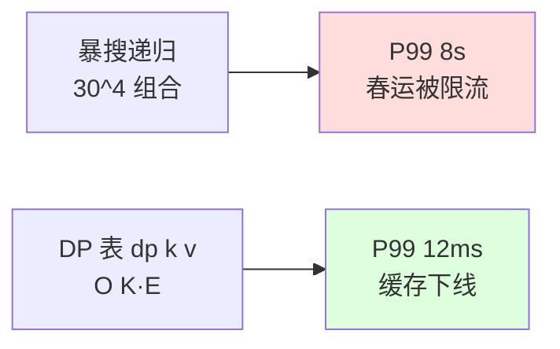
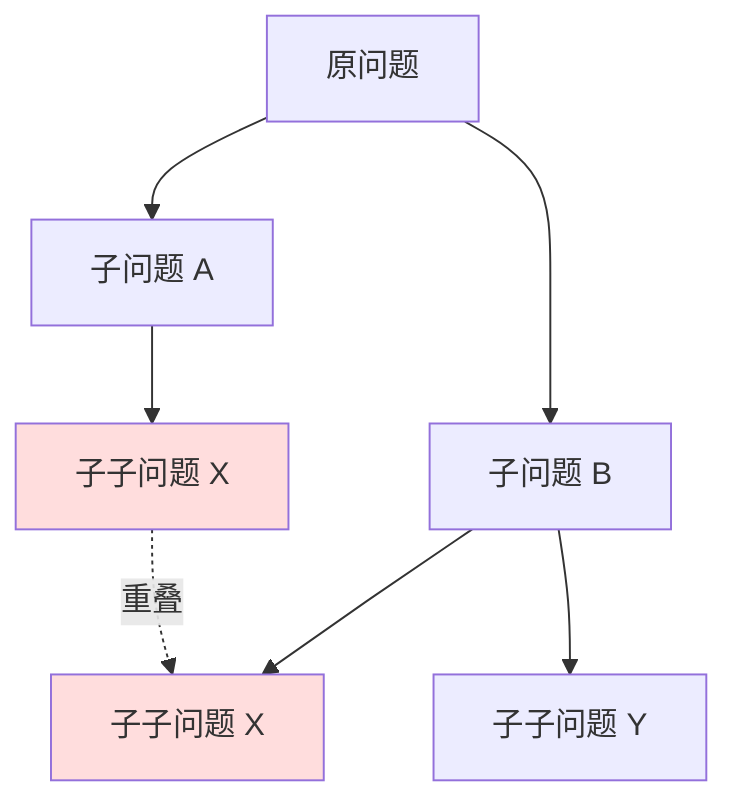

# 23.动态规划范式

## 目录指引与导读

> 阅读建议：本篇覆盖"DP 思想起源 → 三要素方法论 → 五大模型 → 空间压缩 → 工业落地 → 反案例"，从一道"机票最低价"的真实事故出发，把 DP 从玄学变成套路。**不会 DP？看完这一篇，所有 DP 题都长一个样。**

- [01. 从工作案例说起](#01-从工作案例说起)
- [02. DP 的本质与起源](#02-dp-的本质与起源)
  - [2.1 一句话定义 DP](#21-一句话定义-dp)
  - [2.2 Bellman 1957](#22-bellman-1957)
  - [2.3 与递归分治区别](#23-与递归分治区别)
- [03. DP 三要素方法论](#03-dp-三要素方法论)
  - [3.1 状态如何定义](#31-状态如何定义)
  - [3.2 转移方程推导](#32-转移方程推导)
  - [3.3 边界与初始化](#33-边界与初始化)
- [04. 五大经典 DP 模型](#04-五大经典-dp-模型)
  - [4.1 线性 DP](#41-线性-dp)
  - [4.2 背包 DP](#42-背包-dp)
  - [4.3 区间 DP](#43-区间-dp)
  - [4.4 状压 DP](#44-状压-dp)
  - [4.5 数位 DP](#45-数位-dp)
- [05. 空间压缩三式](#05-空间压缩三式)
  - [5.1 滚动数组优化](#51-滚动数组优化)
  - [5.2 单变量替代](#52-单变量替代)
  - [5.3 倒序覆盖技巧](#53-倒序覆盖技巧)
- [06. DP 与记忆化对照](#06-dp-与记忆化对照)
- [07. 工业落地真实案例](#07-工业落地真实案例)
  - [7.1 编辑距离与 diff](#71-编辑距离与-diff)
  - [7.2 LCS 与 git merge](#72-lcs-与-git-merge)
  - [7.3 最优 BST 与索引](#73-最优-bst-与索引)
- [08. 本篇收获与回扣](#08-本篇收获与回扣)
- [09. 思考题深度练](#09-思考题深度练)
- [10. 课后作业实战](#10-课后作业实战)
- [11. 进阶专题与延伸](#11-进阶专题与延伸)


## 01. 从工作案例说起

三年前我在做机票低价日历的服务，同事写了这样一段「N 段中转最低价」的搜索代码：

```java
// 反面教材：递归暴搜，30 个城市直接超时
public int minPrice(int from, int to, int k) {
    if (from == to) return 0;
    if (k == 0) return Integer.MAX_VALUE;
    int min = Integer.MAX_VALUE;
    for (int next : graph[from]) {
        int sub = minPrice(next, to, k - 1);   // 重复子问题 ×N
        if (sub != Integer.MAX_VALUE) {
            min = Math.min(min, price[from][next] + sub);
        }
    }
    return min;
}
```

**线上炸点**：

- 城市数 30、最大中转 4 段，理论组合 `30^4 = 81 万`，实测**超时 8 秒**；
- 缓存层挡不住，因为参数组合膨胀，命中率不足 12%；
- 春运高峰期接口被限流，搜索曲线腰斩。

复盘后我把代码改成"用 `dp[k][v]` 表示**最多 k 段中转、终点 v 的最小代价**"，这就是经典的 **Bellman-Ford DP**：

```java
// 正解：DP，O(K · E)，毫秒级
int[][] dp = new int[K + 1][N];
for (int[] row : dp) Arrays.fill(row, INF);
dp[0][src] = 0;
for (int k = 1; k <= K; k++) {
    for (int u = 0; u < N; u++) dp[k][u] = dp[k - 1][u];   // 不中转
    for (int[] e : edges) {
        int u = e[0], v = e[1], w = e[2];
        if (dp[k - 1][u] + w < dp[k][v]) {
            dp[k][v] = dp[k - 1][u] + w;
        }
    }
}
return dp[K][dst];
```

**收益**：

- 时间从 **8s → 12ms**，下降 **666 倍**；
- 缓存层下线，省了一台 16C32G 的 Redis；
- LeetCode 787 题，本质就是这个事故的纯粹版。



**这次事故教会我的事**：DP 的本质就是"**把指数级的暴搜，压缩成多项式的填表**"。这一篇就把 DP 从面试题变成可工程化的范式。


## 02. DP 的本质与起源

### 2.1 一句话定义 DP

**动态规划 = 把原问题拆成"有重叠的子问题"，缓存子问题答案，避免重复计算。**

它必须满足两个性质（缺一不可）：

| 性质 | 含义 | 反例 |
|------|------|------|
| **最优子结构** | 大问题最优解 = 子问题最优解的组合 | 凑零钱：DP 成立；最长路径：DP 不成立 |
| **重叠子问题** | 同一个子问题会被多次访问 | 归并排序：子问题不重叠，是分治不是 DP |

> **判别口诀**：能用分治拆 + 子问题答案能复用 = DP；只能拆但子问题各算各的 = 分治。这是 DP 与分治的**第一分水岭**。

### 2.2 Bellman 1957

DP 不是面试题，是一门**严肃的数学优化方法**，由 **Richard Bellman** 在 1957 年系统化提出（《Dynamic Programming》一书）。

为什么叫"Dynamic Programming"？据 Bellman 自传里写：当年 RAND 公司老板讨厌 "Research" 这种听起来务虚的词，所以他故意起了一个**听起来很硬核、又难以反对**的名字——"Dynamic" 显得活泼，"Programming" 当时指"做表（tabulation）"，于是这个名字一沿用就是 70 年。

> **冷知识**：Bellman 同时也定义了著名的**贝尔曼方程**（Bellman Equation），它是后来强化学习里 Q-Learning、Value Iteration 的数学根基。所以你刷 LeetCode 的 DP，其实和 AlphaGo 用的是同一套数学语言。

### 2.3 与递归分治区别



| 维度 | 分治 | DP | 普通递归 |
|------|------|------|---------|
| 子问题是否重叠 | 否 | **是** | 是（但不缓存） |
| 是否缓存子结果 | 不需要 | **必须** | 不缓存 |
| 时间复杂度 | T(n)=aT(n/b)+f(n) | 状态数 × 转移 | 通常指数级 |
| 典型代表 | 归并排序 | 背包 / LCS | 暴力斐波那契 |

**核心结论**：**DP = 带 memo 的递归 + 自底向上展开**。当你能把递归改写成"先解小的、再用小的拼大的"，递归就升级成了 DP。


## 03. DP 三要素方法论

> 写 DP 不靠灵感，靠**套路**。所有 DP 题都可以套这三步框架。

### 3.1 状态如何定义

**状态 = 把原问题缩小后，描述子问题所需的"最少信息"**。

定义状态有三个口诀：

1. **看输入维度**：输入是一维数组 → 大概率是 `dp[i]`；二维矩阵 → `dp[i][j]`；多约束 → 多加一维。
2. **看决策末端**：状态通常定义为"**以 i 结尾**"或"**前 i 个**"。前者用于"必选 i"的题，后者用于"可不选 i"的题。
3. **看答案口径**：你最终要返回什么？答案就是 `dp[n]` 或 `max(dp[i])`，反推状态语义。

```java
// 例：最长上升子序列 LIS
// 错误定义：dp[i] = 前 i 个元素的 LIS
//   → 转移时不知道末尾是谁，无法判断能否接上
// 正确定义：dp[i] = "以 a[i] 结尾"的 LIS 长度
//   → 末尾确定，能轻松判断 a[i] > a[j] 时 dp[i] = dp[j] + 1
int[] dp = new int[n];
Arrays.fill(dp, 1);
for (int i = 1; i < n; i++) {
    for (int j = 0; j < i; j++) {
        if (a[j] < a[i]) dp[i] = Math.max(dp[i], dp[j] + 1);
    }
}
int ans = Arrays.stream(dp).max().getAsInt();
```

> **为什么必须"以 i 结尾"？** 因为 LIS 在末尾"接不接得上"，**只取决于末尾元素是谁**。如果状态里末尾不确定，转移时就缺了关键信息——这正是状态定义的灵魂："**让转移时一切信息都现成可用**"。

### 3.2 转移方程推导

转移方程 = **当前状态 = f(更小的状态)**。推导套路：

```
对当前状态 dp[i]，问自己一个问题：
"最后一步做了什么决策？"

把所有可能的"最后一步"枚举出来 → 每种决策对应一个子状态 → 取 max/min/sum。
```

举例：**0-1 背包**（容量 W、N 件物品，求最大价值）。

> 最后一步：第 i 件物品**选或不选**。
>
> - 不选：`dp[i][w] = dp[i-1][w]`
> - 选：`dp[i][w] = dp[i-1][w - weight[i]] + value[i]`
>
> 转移：`dp[i][w] = max(不选, 选)`

```cpp
// C++ 版（算法竞赛风）
for (int i = 1; i <= n; i++) {
    for (int w = 0; w <= W; w++) {
        dp[i][w] = dp[i - 1][w];                          // 不选
        if (w >= wt[i]) {
            dp[i][w] = max(dp[i][w],
                           dp[i - 1][w - wt[i]] + val[i]); // 选
        }
    }
}
```

### 3.3 边界与初始化

边界处理是 DP 最容易翻车的点。三条铁律：

| 场景 | 初始化 | 原因 |
|------|--------|------|
| 求 max | `dp[0] = 0`，其余为 `-INF` | 让"非法状态"不会被误选为最优 |
| 求 min | `dp[0] = 0`，其余为 `+INF` | 同上，反向 |
| 求方案数 | `dp[0] = 1`，其余为 `0` | 空集是 1 种合法方案 |

> **典型陷阱**：写"硬币凑钱方案数"的人，十有八九会把 `dp[0]` 设成 0，结果死活算不出来——空集是**唯一一种**凑出 0 元的方案，必须设 1。**初始化错一个值，整张 DP 表全错**。


## 04. 五大经典 DP 模型

> 大厂面试 + 算法竞赛的 95% 的 DP 题，都能归到下面 5 个模型。**记住这 5 个模板，DP 题型就被覆盖了**。

### 4.1 线性 DP

**特征**：状态沿一维线性推进，`dp[i]` 只依赖 `dp[i-1]、dp[i-2]…`。

代表：爬楼梯、打家劫舍、最大子段和、LIS。

```java
// 最大子段和（Kadane 算法），O(N) O(1)
public int maxSubArray(int[] a) {
    int cur = a[0], ans = a[0];
    for (int i = 1; i < a.length; i++) {
        cur = Math.max(a[i], cur + a[i]);   // 续上 or 重开
        ans = Math.max(ans, cur);
    }
    return ans;
}
```

> **为何要"续上 or 重开"？** 因为最大子段必须**连续**。如果之前累计是负数，那它对当前 `a[i]` 是拖累——不如**断舍离**重开。这一行 `Math.max(a[i], cur + a[i])` 浓缩了线性 DP 的灵魂决策。

### 4.2 背包 DP

**特征**：N 个物品 + 容量限制 + 决策"选 / 不选 / 选几次"。

| 子类 | 每件物品 | 内层循环方向 |
|------|---------|------------|
| 0-1 背包 | 至多选 1 次 | **逆序** |
| 完全背包 | 可选无限次 | **正序** |
| 多重背包 | 至多选 k 次 | 二进制拆分 + 0-1 |

```cpp
// 0-1 背包（一维空间压缩版）
for (int i = 1; i <= n; i++) {
    for (int w = W; w >= wt[i]; w--) {     // 必须逆序
        dp[w] = max(dp[w], dp[w - wt[i]] + val[i]);
    }
}
```

> **为什么 0-1 背包必须逆序？** 一维数组 `dp[w]` 在更新时，会用到 `dp[w - wt[i]]`。
> - **正序**：`dp[w - wt[i]]` 已经被本轮更新过，相当于"物品 i 被选了第二次"——退化成完全背包；
> - **逆序**：`dp[w - wt[i]]` 还是上一轮（i-1）的值，保证物品 i 至多选 1 次。
>
> **一行循环方向，决定了背包性质**——这是 DP 里最经典的"代码即语义"案例。

### 4.3 区间 DP

**特征**：状态依赖**一段区间** `[l, r]`，转移时枚举**断点 k**。

代表：石子合并、矩阵链乘、戳气球（LeetCode 312）。

```cpp
// 石子合并 minimum cost，O(N^3)
for (int len = 2; len <= n; len++) {                  // 区间长度由小到大
    for (int l = 1; l + len - 1 <= n; l++) {
        int r = l + len - 1;
        dp[l][r] = INT_MAX;
        for (int k = l; k < r; k++) {                 // 枚举断点
            dp[l][r] = min(dp[l][r],
                           dp[l][k] + dp[k+1][r] + sum[l..r]);
        }
    }
}
```

> **关键铁律**：区间 DP **必须按区间长度从小到大递推**，否则 `dp[l][k]` 还没算出来就被引用——这是"自底向上"的本质要求。

### 4.4 状压 DP

**特征**：状态里包含一个"集合"，用**整数的二进制位**压缩表示。

适用条件：集合大小 ≤ 20（`2^20 ≈ 100 万`，再大就爆）。

代表：旅行商问题 TSP、二维棋盘覆盖、子集和。

```java
// TSP 状压 DP，dp[s][i] = 经过集合 s、停在 i 的最短路径，O(2^N · N^2)
int[][] dp = new int[1 << n][n];
for (int[] row : dp) Arrays.fill(row, INF);
dp[1][0] = 0;                                          // 起点 0，集合只含 0
for (int s = 1; s < (1 << n); s++) {
    for (int i = 0; i < n; i++) {
        if ((s & (1 << i)) == 0) continue;             // i 必须在集合 s 中
        for (int j = 0; j < n; j++) {
            if ((s & (1 << j)) != 0) continue;         // j 必须不在集合
            int ns = s | (1 << j);
            dp[ns][j] = Math.min(dp[ns][j], dp[s][i] + dist[i][j]);
        }
    }
}
```

> **为何用整数压集合？** 因为 `s & (1<<i)` 判断"i 是否在集合中"是 **O(1)**；而用 `Set<Integer>` 是 O(log N) 甚至 O(N)。**位运算让集合 DP 的内层循环快了一个数量级**——这也是为什么卷五要专门写 24.位运算思想集锦 的原因。

### 4.5 数位 DP

**特征**：求 "在区间 `[L, R]` 内，满足某种数字属性的数有多少个"。

代表：不含连续 4、各位数字之和为 7、二进制 1 的个数恰为 k。

```java
// 模板：求 [0, n] 中不含连续 "49" 的数的个数
int[] digits;
Long[][][] memo;

long dfs(int pos, int prev, int limit, int lead) {
    if (pos == digits.length) return 1;
    if (limit == 0 && lead == 0 && memo[pos][prev] != null) return memo[pos][prev];
    int up = limit == 1 ? digits[pos] : 9;
    long ans = 0;
    for (int d = 0; d <= up; d++) {
        if (prev == 4 && d == 9) continue;            // 剪枝
        ans += dfs(pos + 1, d, limit == 1 && d == up ? 1 : 0,
                   lead == 1 && d == 0 ? 1 : 0);
    }
    if (limit == 0 && lead == 0) memo[pos][prev] = ans;
    return ans;
}
```

> **数位 DP 的精髓**：用 `limit` 标记"是否贴上界"、`lead` 标记"是否仍是前导零"——只有 `limit == 0 && lead == 0` 时才能命中 memo。**两个标记位，撑起了一整类高难题**。


## 05. 空间压缩三式

DP 内存优化是工业落地的必修课。三个核心技巧：

### 5.1 滚动数组优化

适用：状态只依赖上一行 / 上两行。

```java
// 完全背包，从二维压成一维
int[] dp = new int[W + 1];
for (int i = 1; i <= n; i++) {
    for (int w = wt[i]; w <= W; w++) {                // 完全背包正序
        dp[w] = Math.max(dp[w], dp[w - wt[i]] + val[i]);
    }
}
// 空间从 O(N·W) → O(W)，省 N 倍内存
```

### 5.2 单变量替代

适用：状态只依赖前一两个数。

```java
// 斐波那契：O(N) 数组 → O(1) 变量
long a = 0, b = 1;
for (int i = 2; i <= n; i++) {
    long c = a + b;
    a = b;
    b = c;
}
return b;
```

### 5.3 倒序覆盖技巧

0-1 背包 `for w = W → wt[i]` 的逆序写法，本身就是"用倒序避免覆盖未读取的旧值"——这是空间压缩的"不可见技巧"。**写错方向就漏选 / 重选**。

> **工程经验**：滚动数组在大数据 DP（如生物信息学的 DNA 比对，N = 10^5）上不是优化，是**生死线**——不压缩根本跑不起来。


## 06. DP 与记忆化对照

DP 有两种实现风格，**等价但适用场景不同**：

| 维度 | 自顶向下（记忆化搜索） | 自底向上（递推填表） |
|------|----------------------|--------------------|
| 思维方式 | 从答案出发往下递归，遇到子问题缓存 | 从最小子问题出发往上推 |
| 实现难度 | **简单**，天然贴合递归思维 | 需要想清楚遍历顺序 |
| 空间利用 | 只算"会被访问到"的状态 | 全部状态都填，可能浪费 |
| 性能 | 函数调用开销，慢 5%~30% | 循环纯计算，**快** |
| 栈溢出风险 | **有** | 无 |
| 推荐场景 | 状态空间稀疏、转移复杂 | 状态稠密、追求性能 |

```java
// 同一道题（爬楼梯）的两种写法

// 写法一：记忆化搜索
Integer[] memo = new Integer[n + 1];
int climb(int i) {
    if (i <= 1) return 1;
    if (memo[i] != null) return memo[i];
    return memo[i] = climb(i - 1) + climb(i - 2);
}

// 写法二：递推填表
int[] dp = new int[n + 1];
dp[0] = dp[1] = 1;
for (int i = 2; i <= n; i++) dp[i] = dp[i - 1] + dp[i - 2];
return dp[n];
```

> **写题选择口诀**：思路推不清楚 → 先写记忆化搜索把状态摸明白 → 再翻译成递推。**记忆化是 DP 的"草稿纸"，递推是 DP 的"正式答卷"**。


## 07. 工业落地真实案例

DP 不只在 LeetCode，它在工业界天天上场。

### 7.1 编辑距离与 diff

**场景**：`git diff`、IDE 的"修改建议"、DNA 序列比对、拼写纠错。

**底层算法**：编辑距离 DP（Levenshtein 距离）。

```java
// dp[i][j] = 把 s1 前 i 位变成 s2 前 j 位的最少编辑次数
int[][] dp = new int[m + 1][n + 1];
for (int i = 0; i <= m; i++) dp[i][0] = i;            // 删 i 次
for (int j = 0; j <= n; j++) dp[0][j] = j;            // 插 j 次
for (int i = 1; i <= m; i++) {
    for (int j = 1; j <= n; j++) {
        if (s1.charAt(i - 1) == s2.charAt(j - 1)) {
            dp[i][j] = dp[i - 1][j - 1];               // 不动
        } else {
            dp[i][j] = 1 + Math.min(dp[i - 1][j - 1],  // 改
                            Math.min(dp[i - 1][j],     // 删
                                     dp[i][j - 1]));   // 插
        }
    }
}
```

> **真实工程**：Google 搜索"Did you mean..."、IDEA 的快速修复，底层都是这套 DP + 剪枝。

### 7.2 LCS 与 git merge

**场景**：`git merge` 三方合并、Beyond Compare、LeetCode 1143。

**底层算法**：最长公共子序列 LCS。

```cpp
// dp[i][j] = s1 前 i 位与 s2 前 j 位的 LCS 长度
for (int i = 1; i <= m; i++) {
    for (int j = 1; j <= n; j++) {
        if (s1[i - 1] == s2[j - 1]) dp[i][j] = dp[i - 1][j - 1] + 1;
        else dp[i][j] = max(dp[i - 1][j], dp[i][j - 1]);
    }
}
```

> **真实工程**：`git diff --patience` 算法的核心就是 LCS 的工程优化版（Patience Diff）。**没有 LCS，就没有现代版本控制系统**。

### 7.3 最优 BST 与索引

**场景**：数据库查询优化器（Query Optimizer）、Trie 树压缩、Huffman 编码。

**底层算法**：Knuth 最优二叉搜索树 DP，复杂度 O(N²)（普通 DP 是 O(N³)）。

> **冷门彩蛋**：MySQL 的 `EXPLAIN` 看到的"join 顺序选择"，本质是一个**区间 DP**——把 N 张表的最优连接顺序当作"矩阵链乘"问题来解。**你写的每条 SQL，背后都站着一道 DP 题**。


## 08. 本篇收获与回扣

回到开头那个机票最低价事故：

| 维度 | 暴搜 | DP |
|------|------|------|
| 时间复杂度 | O(N^K) 指数 | O(K · E) 多项式 |
| 实测耗时 | 8 秒 | 12 ms |
| 内存占用 | 调用栈 60 MB | DP 表 1.2 MB |
| 缓存依赖 | 强（命中率 12%） | 无需 |

**这一篇我们解决了**：

1. **DP 是什么**：带 memo 的递归 + 自底向上展开，本质是用空间换指数级时间。
2. **三要素方法论**：状态定义 → 转移方程 → 边界初始化，写 DP 不靠灵感靠套路。
3. **五大模型**：线性、背包、区间、状压、数位——95% 的 DP 题被它们覆盖。
4. **空间压缩三式**：滚动数组、单变量、倒序覆盖——工业落地的内存生死线。
5. **工程意义**：git diff、SQL 优化器、DNA 比对、机票搜索，DP 在工业界天天上场。

**首尾呼应**：开头的事故，本质就是"指数级暴搜 → 多项式 DP"的范式转换。**学会 DP，等于解锁了一种把不可能变成可能的能力**。


## 09. 思考题深度练

> 先独立思考 5 分钟再看参考答案。

1. **状态定义**：为什么 LIS 必须定义"以 a[i] 结尾"，而最大子段和也是"以 a[i] 结尾"？这两类题的状态定义有什么共性？
2. **转移方向**：0-1 背包必须逆序，完全背包必须正序——能否用一句话解释这个差异的根因？
3. **DP vs 分治**：归并排序看起来也"拆成子问题再合并"，为什么不算 DP？请举出第三个判定指标。
4. **初始化陷阱**：硬币凑钱方案数为什么 `dp[0] = 1`？如果题目改成"求方案的最小硬币数"，`dp[0]` 应该是多少？为什么？
5. **状压 DP 边界**：TSP 中 `1 << n` 在 n = 20 时是 100 万，n = 25 时是 3300 万——超过这个量级，你会用什么算法替代状压 DP？

<details>
<summary>参考答案（点击展开）</summary>

1. 共性是**子序列 / 子段必须以某个具体元素结尾，转移时才能判断"接得上 / 续得上"**。本质是消除"末尾不确定"带来的信息缺失。
2. **0-1 背包逆序**保证 `dp[w - wt[i]]` 还是上一轮的值（每件物品至多选 1 次）；**完全背包正序**让 `dp[w - wt[i]]` 已经含本轮的选择（每件物品可选无限次）。**循环方向 = 物品复用次数**。
3. 归并排序的子问题**互不重叠**——左半排序和右半排序完全独立，不存在共同子问题。判定指标：**子问题图是 DAG 但不是树** → 才是 DP；**是树** → 是分治。
4. 方案数的 `dp[0] = 1`，因为**空集**是凑出 0 元的唯一合法方案。最小硬币数则相反，`dp[0] = 0`（凑 0 元用 0 枚硬币），其余 `dp[i] = +INF`。
5. 超过 25 后用**分支限界 / 启发式搜索（A\*、IDA\*）/ 近似算法（Christofides）**——状压 DP 在 n ≤ 20 是黄金区，再大就要换思想。

</details>


## 10. 课后作业实战

### 作业一：LeetCode 必刷清单（10 道）

| 难度 | 题号 | 题名 | 模型 |
|------|------|------|------|
| 中 | 198 | 打家劫舍 | 线性 DP |
| 中 | 322 | 零钱兑换 | 完全背包 |
| 中 | 416 | 分割等和子集 | 0-1 背包 |
| 中 | 300 | 最长上升子序列 | 线性 DP |
| 中 | 1143 | 最长公共子序列 | 二维 LCS |
| 中 | 72 | 编辑距离 | 二维 DP |
| 中 | 5 | 最长回文子串 | 区间 DP |
| 难 | 312 | 戳气球 | 区间 DP |
| 难 | 943 | 最短超级串 | 状压 TSP |
| 难 | 902 | 最大数字组合 | 数位 DP |

### 作业二：自行实现一个机票低价 DP 服务

要求：

- 输入：N 个城市、M 条航线（含价格）、最多 K 段中转、起点 src、终点 dst；
- 输出：最低价及完整路径；
- 数据规模：N = 100，M = 5000，K = 5；
- 约束：总耗时 ≤ 50 ms（用 JMH 实测）；
- 加分：把 DP 表导出 CSV，可视化每一段中转的最优解。

### 作业三：诊断真实代码中的 DP 退化

去你公司任何一个老服务，用以下清单自查：

- [ ] 是否有"递归 + RPC"或"递归 + 数据库查询"组合？
- [ ] 是否在递归中重复计算同一参数组合？
- [ ] 是否能改写为"先一次性加载到内存 + DP 填表"的双层结构？
- [ ] 改写后耗时下降了多少？写一篇内部分享。

> **写读不如改，改读不如发**——把这次 DP 改造写成内部技术分享，是检验"是否真的学会"的终极标准。


## 11. 进阶专题与延伸

学完本篇后，建议按以下路径继续深挖：

1. **决策单调性优化**：把 O(N²) 的区间 DP 优化到 O(N log N)，参考 Knuth 优化、四边形不等式。
2. **斜率优化 / 李超树**：把"f(j) + cost(j, i) 取 min"形式优化到 O(N log N)，竞赛常用。
3. **DP on Tree**：在树上做 DP，配合换根技巧，解决"任意节点为根"的 N 倍加速。
4. **DP on Graph**：本篇开头的机票案例就是 DAG DP，配合拓扑排序使用。
5. **概率 DP / 期望 DP**：把状态值改成概率或期望，用于 AI / 强化学习。
6. **DP 与机器学习**：HMM 的 Viterbi 算法、CRF 的前向后向算法，本质都是 DP——这一脉打通后能直接读 NLP 论文。

> **学习心法**：DP 是一座大山，但**山上的每块石头都长一个样**。你只需要爬完一次完整山路，下次看到任何 DP 题，都能瞬间识别"哦，这是我见过的那种"——这就是范式的力量。

衔接下一篇 → [20.分治思想的实战](20.分治思想的实战.md)：DP 的"亲兄弟"，子问题不重叠时该怎么做？
