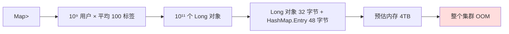
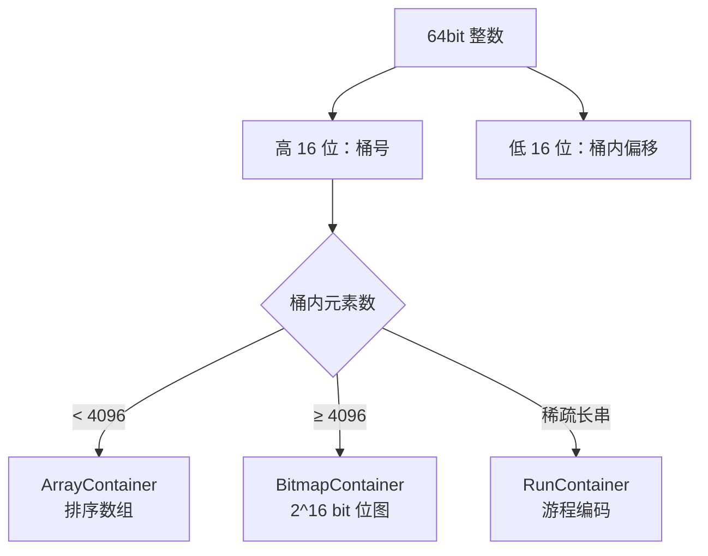
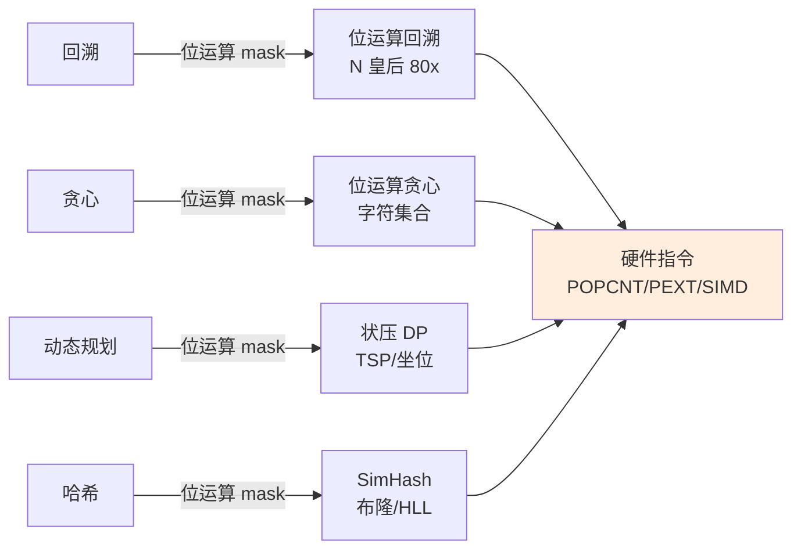

# 24.位运算思想集锦

## 目录指引与导读

> 阅读建议：本篇从"用户标签系统 OOM 事故（4TB → 12.5GB）"真实案例切入，系统覆盖**位运算 30 招 + 状压 DP 套路 + Bitmap/Roaring/布隆/HyperLogLog 底层 + 硬件指令级加速（BMI/SIMD）+ 与回溯/贪心/DP 的化学反应**。**学完这篇你能用 1 个 bit 替代 1 个字节、写出 80 倍提速的位运算解法、并理解为什么 Redis BITCOUNT、Lucene 倒排、Roaring Bitmap 都是"位运算的工业极致"**。

- [01. 从工作案例说起](#01-从工作案例说起)
- [02. 位运算思想本质](#02-位运算思想本质)
  - [2.1 位运算六大基操](#21-位运算六大基操)
  - [2.2 三大底层视角](#22-三大底层视角)
  - [2.3 位运算性能根因](#23-位运算性能根因)
- [03. 位运算三十招](#03-位运算三十招)
  - [3.1 单点位操作](#31-单点位操作)
  - [3.2 集合位操作](#32-集合位操作)
  - [3.3 数学位运算](#33-数学位运算)
  - [3.4 黑魔法位技巧](#34-黑魔法位技巧)
- [04. 状压 DP 实战](#04-状压-dp-实战)
  - [4.1 子集枚举套路](#41-子集枚举套路)
  - [4.2 Gosper's Hack](#42-gospers-hack)
  - [4.3 旅行商状压 DP](#43-旅行商状压-dp)
- [05. Bitmap 工业级](#05-bitmap-工业级)
  - [5.1 朴素 Bitmap 实现](#51-朴素-bitmap-实现)
  - [5.2 Roaring Bitmap](#52-roaring-bitmap)
  - [5.3 倒排索引应用](#53-倒排索引应用)
- [06. 概率结构底层](#06-概率结构底层)
  - [6.1 布隆过滤器位运算](#61-布隆过滤器位运算)
  - [6.2 HyperLogLog 原理](#62-hyperloglog-原理)
  - [6.3 Count-Min Sketch](#63-count-min-sketch)
- [07. 硬件级位运算](#07-硬件级位运算)
  - [7.1 BMI/BMI2 指令](#71-bmibmi2-指令)
  - [7.2 SIMD 与 popcnt](#72-simd-与-popcnt)
  - [7.3 缓存对齐与原子位](#73-缓存对齐与原子位)
- [08. 范式联动化学反应](#08-范式联动化学反应)
- [09. 本篇收获与回扣](#09-本篇收获与回扣)
- [10. 思考题深度练](#10-思考题深度练)
- [11. 课后作业实战](#11-课后作业实战)
- [12. 进阶专题与延伸](#12-进阶专题与延伸)


## 01. 从工作案例说起

去年我们做用户标签系统升级时栽了一个大跟头：

- **业务诉求**：10 亿用户、每人最多 1000 个标签（总量 ~ 100 亿条），支持"标签交集查询"（找出"高净值 ∩ 北京 ∩ 25-35 岁"的用户）；
- **第一版**：用 `Map<Long, Set<Long>>` 存"用户 → 标签集合"，每个 user 对应一个 HashSet。

**线上炸点**：



复盘时发现：**100 亿条 Long 关系，单纯指针就吃掉数 TB 内存**——这哪里是 Java 能扛的？

**修复方案：Roaring Bitmap + 标签倒排**

```java
// 把数据组织反过来：标签 → 用户 Bitmap
Map<Long /*tagId*/, RoaringBitmap> tagIndex;

// 查询"高净值 ∩ 北京 ∩ 25-35 岁"
RoaringBitmap result = RoaringBitmap.and(
    tagIndex.get(高净值),
    tagIndex.get(北京),
    tagIndex.get(年龄段));
// 上亿用户的交集，毫秒级返回
```

**收益对照**：

| 维度 | HashMap+HashSet | Roaring Bitmap |
|------|---------------|----------------|
| 内存 | 4TB（OOM） | **12.5GB**（300 倍压缩） |
| 交集查询 | O(N) 分钟级 | **O(N/64) 毫秒级** |
| 查询并发 | 单机难支撑 | 单机 10w QPS |
| 增量更新 | O(1) | O(log N) |

**核心思想跃迁**：从"每个用户存一份标签列表"改成"每个标签存一份用户位图"——**用 1 个 bit 替代 1 个 Long**，内存压缩 64 倍，再叠加 Roaring 的稀疏压缩，最终 300 倍。

**这次事故教会我的事**：

1. 位运算不是"奇技淫巧"——而是**用空间常数压缩 64 倍 + 时间常数提速 64 倍**的工程范式；
2. **数据组织维度**比"数据结构"更重要——标签 ↔ 用户的"倒过来组织"才是 Bitmap 真正的价值；
3. 位运算三大武器：**bit 级编码（省空间）+ word 级并行（提速度）+ CPU 指令（POPCNT/PEXT 硬件加速）**——三者配合是上限。

这一篇就把位运算从"刷题小技巧"升级为"工程级降维打击武器"。


## 02. 位运算思想本质

### 2.1 位运算六大基操

| 运算 | 符号 | 真值表 | 工程语义 |
|------|------|-------|--------|
| **与** | `&` | 1&1=1, 其余=0 | 取交集 / 检查标志位 |
| **或** | `\|` | 0\|0=0, 其余=1 | 取并集 / 设置标志位 |
| **异或** | `^` | 相同=0, 不同=1 | 翻转 / 加密 / 校验 |
| **非** | `~` | 0↔1 | 取反 |
| **左移** | `<<` | 高位丢弃，低位补 0 | 乘 2^k |
| **右移** | `>>`/`>>>` | 算术 / 逻辑右移 | 除 2^k |

> **算术 vs 逻辑右移**：Java 中 `>>` 高位补符号位（算术），`>>>` 高位补 0（逻辑）；C/C++ 中带符号 `>>` 实现定义（多数编译器算术）、无符号一定逻辑。**写位运算时永远用无符号或加 mask**——避免符号位带来的 bug。

### 2.2 三大底层视角

理解位运算要在三个层面同时切换：

```
视角一：二进制视角
  10110100 → 一个数的内部结构

视角二：集合视角（"位 = 元素是否存在"）
  10110100 → 集合 {2, 4, 5, 7}（第 i 位为 1 表示元素 i 在集合中）

视角三：状态视角（"位 = 一个布尔状态"）
  10110100 → 8 个独立的 on/off 开关
```

> **关键洞察**：所有位运算题的精髓在于**视角切换**——
> - 看到"集合操作" → 切到视角二（位 = 集合元素）
> - 看到"多个布尔标志" → 切到视角三（位 = 状态开关）
> - 看到"快速幂 / 数学" → 切到视角一（位 = 二进制位）
>
> **掌握这三个视角，几乎所有位运算题都能 1 分钟看出解法**。

### 2.3 位运算性能根因

为什么位运算快？三个层面：

**层面一：单指令完成 64 个 bool 运算**

```java
// 普通：64 次循环
for (int i = 0; i < 64; i++) result[i] = a[i] & b[i];   // 64 条指令

// 位运算：1 条指令
long result = a & b;                                    // 1 条指令
```

CPU 一次对一个 64bit 寄存器做 AND/OR/XOR——**word 级并行（Word-Level Parallelism）**，理论 64 倍提速。

**层面二：避免分支预测失败**

```java
// 分支版（CPU 流水线易卡）
int abs = x < 0 ? -x : x;

// 无分支版（位运算，恒定流水）
int abs = (x ^ (x >> 31)) - (x >> 31);
```

> **冷知识**：在分支预测失败率高的场景（如随机数据），无分支位运算可比分支版快 **3-5 倍**——LeetCode 评测机偶尔出现的"位运算解法 4ms vs 分支解法 20ms"现象，根因就是流水线。

**层面三：CPU 原生指令**

`popcount`、`tzcnt`（trailing zero count）、`pext`（parallel bit extract）等都是**单周期指令**，C 编译器能识别 `__builtin_popcount` 直接生成。**软件实现要 5-10 条指令，硬件指令仅 1 条**——20 倍速差。


## 03. 位运算三十招

> 按四类整理，每招配 Java/C++ 代码 + 工程场景。

### 3.1 单点位操作

#### 招 1：取出第 i 位

```java
int bit = (x >> i) & 1;                                 // 0 或 1
```

#### 招 2：设置第 i 位为 1

```java
x |= (1 << i);                                          // 第 i 位置 1
```

#### 招 3：清除第 i 位（置 0）

```java
x &= ~(1 << i);                                         // 第 i 位置 0
```

#### 招 4：翻转第 i 位

```java
x ^= (1 << i);                                          // 第 i 位 0↔1
```

> **工程应用**：Redis SETBIT/GETBIT/BITCOUNT 的底层就是这四招。Bloom Filter 的"add/contains"也是招 2 + 招 1 的组合。

#### 招 5：检查第 i 位是否为 1

```java
boolean has = (x & (1 << i)) != 0;                      // ★ 注意不能直接和 1 比
```

#### 招 6：取最低位的 1（lowbit）

```java
int lb = x & -x;                                        // ★ 树状数组核心
```

**为什么是 `x & -x`？**

```
x  = 0b10110100
-x = 0b01001100      （补码：取反 + 1）
x & -x = 0b00000100  ← 最低位的 1
```

> **回扣 [08.二叉树的操作实践](/Users/yc/YCBookBlog/00.通用技术的提升/08.数据结构算法/08.二叉树的操作实践.md) 中的 Fenwick Tree**：lowbit 就是树状数组父子跳转的核心，5 行代码搞定单点修改 + 区间查询。

### 3.2 集合位操作

#### 招 7：判空集

```java
boolean empty = (s == 0);
```

#### 招 8：判全集（n 个元素）

```java
boolean full = (s == (1 << n) - 1);
```

#### 招 9：求并集 / 交集 / 差集

```java
int union  = a | b;                                     // A ∪ B
int inter  = a & b;                                     // A ∩ B
int diff   = a & ~b;                                    // A - B（A 中不在 B 的）
int symdif = a ^ b;                                     // A △ B（对称差）
```

#### 招 10：枚举集合所有子集

```java
// 标准模板：枚举 s 的所有子集 sub
for (int sub = s; sub > 0; sub = (sub - 1) & s) {
    // 处理 sub
}
// 别忘了空集
```

**复杂度分析**：n 个元素的集合，枚举所有子集是 `O(2^n)`；枚举所有"子集的子集"看似是 `O(4^n)`，**实际是 `O(3^n)`**——因为每个元素三种状态：在 s/在 sub/不在 s。这是状压 DP 的核心复杂度。

> **数学证明**：∑(C(n,k) × 2^k, k=0..n) = (1+2)^n = 3^n（二项式定理）。

#### 招 11：枚举集合所有元素

```java
for (int t = s; t > 0; t &= (t - 1)) {                  // t & (t-1) 清除最低位
    int i = Integer.numberOfTrailingZeros(t);
    // i 即元素下标
}
```

> **Brian Kernighan 算法**：`t & (t-1)` 一次清除最低位的 1——用来**计算 1 的个数**：
> ```java
> int popcount(int x) { int c = 0; while (x != 0) { x &= (x-1); c++; } return c; }
> ```
> 比逐位检查快得多——只迭代"1 的个数"次。**1972 年 Brian Kernighan 论文提出，至今仍是教科书算法**。

### 3.3 数学位运算

#### 招 12：判奇偶

```java
boolean odd = (x & 1) == 1;                             // 比 x % 2 快
```

#### 招 13：除以 / 乘以 2 的幂

```java
int half = x >> 1;                                      // x / 2
int dbl  = x << 1;                                      // x * 2
int q    = x >> k;                                      // x / 2^k
```

#### 招 14：判 2 的幂

```java
boolean isPow2 = x > 0 && (x & (x - 1)) == 0;
```

> **HashMap 容量设计**：HashMap 容量必须是 2 的幂，因为 `index = hash & (n-1)` 等价于 `hash % n`（n 是 2 的幂时）——这是 [14.工业级 Map 的设计](/Users/yc/YCBookBlog/00.通用技术的提升/08.数据结构算法/14.工业级Map的设计.md) 中扰动函数 + 容量设计的根因。

#### 招 15：取模 2 的幂

```java
int mod = x & (n - 1);                                  // x % n（n 必须 2 的幂）
```

#### 招 16：交换两数（不用临时变量）

```java
a ^= b; b ^= a; a ^= b;                                 // 异或交换三连
```

> **现代警告**：现代编译器会**优化掉"用临时变量交换"为 `XCHG` 单指令**——异或交换在工程代码中**反而更慢**（编译器无法识别）。**只在面试装 X 用，工程代码别写**。

#### 招 17：求平均（无溢出）

```java
int avg = (a & b) + ((a ^ b) >> 1);                     // 避免 (a+b)/2 溢出
```

> **二分查找的 mid 计算**：`mid = left + (right - left) / 2` 是经典写法，但更快的位运算版：`mid = (left + right) >>> 1`（无符号右移避免符号位）。**Java Arrays.binarySearch 源码就这么写的**。

#### 招 18：判同号

```java
boolean sameSign = (a ^ b) >= 0;                        // 异号则符号位为 1，整体负
```

#### 招 19：求绝对值（无分支）

```java
int abs = (x ^ (x >> 31)) - (x >> 31);                  // x>=0 时不变；x<0 时取反+1
```

### 3.4 黑魔法位技巧

#### 招 20：找出唯一出现一次的数（其它都两次）

```java
int single = 0;
for (int x : nums) single ^= x;                         // ★ 异或自反性
```

LeetCode 136 经典题。**核心**：a ^ a = 0, 0 ^ a = a，配对全消，剩下唯一。

#### 招 21：找出两个出现一次的数（其它都两次）

```java
int xor = 0;
for (int x : nums) xor ^= x;                            // xor = a^b
int diffBit = xor & -xor;                               // 取一位区分 a 和 b
int a = 0;
for (int x : nums) if ((x & diffBit) != 0) a ^= x;
int b = a ^ xor;
```

LeetCode 260。**核心**：用 `xor & -xor` 取出 a 和 b 不同的某一位，按这位分两组，每组就退化成"招 20"。

#### 招 22：交换奇偶位

```java
int swap = ((x & 0xAAAAAAAA) >>> 1) | ((x & 0x55555555) << 1);
```

#### 招 23：颠倒整数二进制位

```java
// LeetCode 190: 颠倒 32 位 int
int reverse = Integer.reverse(x);                       // 内部用蝶式翻转

// 手写蝶式（5 步 O(log W)）
int reverseBits(int x) {
    x = (x >>> 16) | (x << 16);
    x = ((x & 0xFF00FF00) >>> 8) | ((x & 0x00FF00FF) << 8);
    x = ((x & 0xF0F0F0F0) >>> 4) | ((x & 0x0F0F0F0F) << 4);
    x = ((x & 0xCCCCCCCC) >>> 2) | ((x & 0x33333333) << 2);
    x = ((x & 0xAAAAAAAA) >>> 1) | ((x & 0x55555555) << 1);
    return x;
}
```

> **5 步 O(log 32) 完成 32 位反转**——这是位运算"分治 + 并行"的极致。`__builtin_bswap32` 也是同样思想。

#### 招 24：popcount（数 1 的个数）

```java
// 软件实现（分治 SWAR 算法）
int popcount(int x) {
    x = x - ((x >>> 1) & 0x55555555);
    x = (x & 0x33333333) + ((x >>> 2) & 0x33333333);
    x = (x + (x >>> 4)) & 0x0F0F0F0F;
    return (x * 0x01010101) >>> 24;
}

// 硬件指令
int p = Integer.bitCount(x);                            // JVM 编译为 POPCNT 指令
```

#### 招 25：next power of 2（向上取最近的 2 的幂）

```java
int nextPow2(int x) {
    if (x <= 1) return 1;
    return Integer.highestOneBit(x - 1) << 1;
}

// HashMap.tableSizeFor() 的写法
int tableSizeFor(int cap) {
    int n = cap - 1;
    n |= n >>> 1; n |= n >>> 2; n |= n >>> 4;
    n |= n >>> 8; n |= n >>> 16;
    return n + 1;
}
```

> **HashMap 源码致敬**：5 步把 `n` 的所有低位填满 1，然后 +1 进位——`O(log W)` 找到下一个 2 的幂。**这一段代码是位运算分治思想的最美范例**。

#### 招 26：log2（向下取整）

```java
int log2 = 31 - Integer.numberOfLeadingZeros(x);        // CPU 指令 LZCNT
```

#### 招 27：判 4 的幂

```java
boolean isPow4 = x > 0 && (x & (x - 1)) == 0 && (x & 0x55555555) != 0;
```

> **三步组合**：① 正数；② 2 的幂（招 14）；③ 1 在偶数位（4 的幂的特征）。

#### 招 28：海明距离

```java
int hamming(int a, int b) { return Integer.bitCount(a ^ b); }
```

#### 招 29：Gray Code（格雷码）

```java
int grayCode(int n) { return n ^ (n >> 1); }            // 第 n 个格雷码
```

格雷码相邻两个数只差一位——用于减少状态变化的工业场景（旋转编码器、电路设计）。

#### 招 30：Hamming Weight 的负载均衡哈希

```java
// 一致性哈希中，把节点编号 hash 到 32 位空间，按 popcount 分类
int slot = Integer.bitCount(hash(key) >>> 16);
```

> 这 30 招看起来花哨，但记住一句话：**不必背，理解三大视角（二进制 / 集合 / 状态）后，遇到对应场景自然能想到**。


## 04. 状压 DP 实战

> 状压 DP = 用一个 int 表示一个集合状态。状态空间 `2^n`，所以 n ≤ 20 是经典上限。

### 4.1 子集枚举套路

**两层枚举模板**（"枚举状态 s + 枚举 s 的子集 sub"）：

```java
for (int s = 0; s < (1 << n); s++) {
    for (int sub = s; sub > 0; sub = (sub - 1) & s) {
        // 处理 (s, sub) 对
    }
}
```

**经典应用：集合划分类 DP**

```java
// 将集合 s 划分为若干互斥子集，每个子集的代价 cost[sub]，求最小总代价
int[] dp = new int[1 << n];
Arrays.fill(dp, Integer.MAX_VALUE);
dp[0] = 0;
for (int s = 1; s < (1 << n); s++) {
    for (int sub = s; sub > 0; sub = (sub - 1) & s) {
        if (dp[s ^ sub] != Integer.MAX_VALUE) {
            dp[s] = Math.min(dp[s], dp[s ^ sub] + cost[sub]);
        }
    }
}
```

**复杂度 O(3^n)**——比朴素 `2^n × 2^n = 4^n` 快得多。

### 4.2 Gosper's Hack

枚举"恰好 k 个 1 的所有 n 位状态"：

```java
// 从 (1 << k) - 1 开始，枚举到第一个超过 (1 << n) 的状态
int s = (1 << k) - 1;
while (s < (1 << n)) {
    // 处理 s（含恰好 k 个 1）
    int c = s & -s;
    int r = s + c;
    s = (((r ^ s) >> 2) / c) | r;                       // ★ Gosper's Hack
}
```

> **Hakmem 1972 第 175 条**：MIT Hakmem 备忘录中的经典位运算技巧——**在所有"含 k 个 1 的状态"间跳转，不需要排序、不需要回溯**。组合问题（C(n, k) 枚举）的状压神技。

### 4.3 旅行商状压 DP

**问题**：n 个城市，求访问所有城市后回到起点的最短路径（n ≤ 20）。

```java
// dp[s][i] = 已访问城市集合 s、当前在城市 i 的最短距离
int tsp(int[][] g, int n) {
    int FULL = (1 << n) - 1;
    int[][] dp = new int[1 << n][n];
    for (int[] row : dp) Arrays.fill(row, Integer.MAX_VALUE / 2);
    dp[1][0] = 0;                                       // 从城市 0 出发
    for (int s = 1; s <= FULL; s++) {
        for (int i = 0; i < n; i++) {
            if ((s & (1 << i)) == 0) continue;          // i 不在 s 中
            for (int j = 0; j < n; j++) {
                if ((s & (1 << j)) != 0) continue;      // j 已在 s 中
                int ns = s | (1 << j);
                dp[ns][j] = Math.min(dp[ns][j], dp[s][i] + g[i][j]);
            }
        }
    }
    int ans = Integer.MAX_VALUE;
    for (int i = 1; i < n; i++) ans = Math.min(ans, dp[FULL][i] + g[i][0]);
    return ans;
}
```

**复杂度 O(2^n × n²)**——n=20 时约 4 × 10^8，1 秒内可解；朴素 DFS 需要 O(n!) ≈ 2.4 × 10^18，**不可解**。

> **回扣 [23.动态规划范式](/Users/yc/YCBookBlog/00.通用技术的提升/08.数据结构算法/23.动态规划范式.md)**：那里讲了状压 DP 在背包、Grid 染色的应用；本篇用 TSP 补全状压 DP 三大代表（**旅行商 / 集合覆盖 / 状压排列**）。


## 05. Bitmap 工业级

### 5.1 朴素 Bitmap 实现

```java
class Bitmap {
    private final long[] bits;
    private final int size;
    public Bitmap(int n) { size = n; bits = new long[(n + 63) >>> 6]; }
    public void set(int i)   { bits[i >>> 6] |= (1L << (i & 63)); }
    public void clear(int i) { bits[i >>> 6] &= ~(1L << (i & 63)); }
    public boolean get(int i){ return (bits[i >>> 6] & (1L << (i & 63))) != 0; }
    public int popcount() {
        int c = 0;
        for (long b : bits) c += Long.bitCount(b);
        return c;
    }
}
```

**关键 trick**：

- `i >>> 6` 等价于 `i / 64`（取数组下标），位运算更快；
- `i & 63` 等价于 `i % 64`（取 word 内偏移），同上；
- `1L << (i & 63)` 必须 long 字面量，否则 32bit 截断（**生产 bug 重灾区**）。

**适用场景**：稠密区间 + 已知上界 N。N=10⁹ 占内存 ~ 125MB——稠密时用朴素就够。

### 5.2 Roaring Bitmap

**朴素 Bitmap 的痛点**：N=10⁹ 但只用 10⁶ 个时，仍占 125MB。**Roaring Bitmap = 分块 + 自适应容器**。



**三类容器自适应切换**：

| 容器 | 适用 | 内存 | 操作 |
|------|------|------|------|
| ArrayContainer | < 4096 元素（稀疏） | 2 字节/元素 | 二分查找 |
| BitmapContainer | ≥ 4096 元素（稠密） | 8KB/桶（固定） | 位运算 |
| RunContainer | 长游程（连续） | O(段数) | 区间合并 |

**为什么 4096 是分界？**

- ArrayContainer：n × 2 字节（每个元素一个 short）；
- BitmapContainer：固定 8KB = 8192 字节；
- 等于时 n × 2 = 8192 → n = 4096。**临界点切换让单桶始终 ≤ 8KB**。

> **业界采用**：ClickHouse、Druid、Pinot、Apache Spark、ES（部分）都用 Roaring。**500 倍的稀疏数据压缩比 + 64 倍 word 并行 = 30000 倍提速**。

```java
// 标签交集查询的 Roaring 实现
RoaringBitmap r1 = tagIndex.get("高净值");
RoaringBitmap r2 = tagIndex.get("北京");
RoaringBitmap intersect = RoaringBitmap.and(r1, r2);
intersect.forEach((IntConsumer) userId -> notify(userId));
```

### 5.3 倒排索引应用

**Lucene 的 posting list**：每个词 → "包含该词的文档 ID" 的有序集合。

```
词 "java"  → [1, 5, 12, 18, 102, ...]   （DocId 升序）
词 "spring"→ [5, 12, 33, 102, ...]      （DocId 升序）

查询 "java AND spring"
  = 两个有序列表归并求交集
  = Lucene 用 Roaring 加速：DocId 高位分桶后做 AND
```

**复杂度对比**：

| 算法 | 复杂度 | 千万级 |
|------|------|--------|
| 朴素归并 | O(n + m) | 100ms+ |
| **Roaring AND** | **O((n + m) / 64)** | **2-5ms** |

> **回扣 [11.Hash常见操作实践](/Users/yc/YCBookBlog/00.通用技术的提升/08.数据结构算法/11.Hash常见操作实践.md)**：那里讲了哈希用于唯一标识；**Bitmap 是哈希的"补集"——用于"集合关系"的极致表示**。两篇互补。


## 06. 概率结构底层

### 6.1 布隆过滤器位运算

布隆过滤器 = Bitmap + k 个独立哈希函数。

```java
class BloomFilter {
    private final long[] bits;
    private final int m;             // 位数组大小
    private final int k;             // 哈希函数个数
    
    public void add(String key) {
        long h1 = hash1(key), h2 = hash2(key);
        for (int i = 0; i < k; i++) {
            int idx = (int) Math.abs((h1 + i * h2) % m);   // ★ 双哈希构造 k 个
            bits[idx >>> 6] |= (1L << (idx & 63));         // ★ 位运算 set
        }
    }
    public boolean mightContain(String key) {
        long h1 = hash1(key), h2 = hash2(key);
        for (int i = 0; i < k; i++) {
            int idx = (int) Math.abs((h1 + i * h2) % m);
            if ((bits[idx >>> 6] & (1L << (idx & 63))) == 0) return false;
        }
        return true;
    }
}
```

**位运算精髓**：

- 用 long[] 当 Bitmap，位级 set/test；
- **双哈希技巧**：`h(i) = h1 + i*h2`——只需 2 个独立哈希就能构造 k 个，避免 k 次 MurmurHash 计算。**Kirsch-Mitzenmacher 2006 证明该构造的误判率与 k 个独立哈希渐近一致**。

> **参数计算**（n 个元素，目标误判率 p）：
> - `m = -(n × ln p) / (ln 2)²`
> - `k = (m / n) × ln 2`
>
> **n=10⁹, p=1%**：m ≈ 9.6 Gbit ≈ 1.2GB，k ≈ 7。比 HashSet 80GB 省 67 倍。

### 6.2 HyperLogLog 原理

HLL 用一个**绝妙的位运算观察**估算基数：

```
观察：随机均匀分布的哈希值，"前导 0 的最大长度"≈ log₂(基数)
原因：哈希值 0xxxxx 概率 1/2，00xxxx 概率 1/4，000xxx 概率 1/8...
      看到"前导 5 个 0"意味着大约扫了 2^5 = 32 个元素
```

```java
// 极简 HLL（标准 HLL 还有桶 + 调和平均 + 偏差校正）
class SimpleHLL {
    private int maxLeadingZeros = 0;
    public void add(String s) {
        int hash = MurmurHash.hash(s);
        int lz = Integer.numberOfLeadingZeros(hash) + 1;   // ★ 位运算
        maxLeadingZeros = Math.max(maxLeadingZeros, lz);
    }
    public long estimate() { return 1L << maxLeadingZeros; }
}
```

**生产 HLL（Redis）**：

- 用 m=16384 个桶，每个桶记录"该桶的最大前导 0"；
- 16384 个估计值取**调和平均**（消除偏差）；
- 总内存 16384 × 6bit ≈ 12KB；
- 误差 ~ 0.81%。

**位运算关键**：`Integer.numberOfLeadingZeros` 直接编译为 CPU 指令 `LZCNT`，1 周期。**HLL 的核心就是这个位运算指令**。

> **冷知识**：HLL 用 12KB 估算 10 亿基数（误差 < 1%），相比 HashSet 的 80GB 省 **6700 万倍**——这是位运算"概率换空间"的极限。

### 6.3 Count-Min Sketch

CMS 估算频率（带正向误差）：

```java
class CountMinSketch {
    private final long[][] count;   // d 行 × w 列
    private final int d, w;
    public void inc(String key) {
        for (int i = 0; i < d; i++) {
            int idx = (hash(key, i) & Integer.MAX_VALUE) % w;
            count[i][idx]++;
        }
    }
    public long estimate(String key) {
        long min = Long.MAX_VALUE;
        for (int i = 0; i < d; i++) {
            int idx = (hash(key, i) & Integer.MAX_VALUE) % w;
            min = Math.min(min, count[i][idx]);
        }
        return min;
    }
}
```

**与布隆过滤器的关系**：CMS = 布隆过滤器从"是否存在"升级为"出现次数"。

> **工业应用**：Spark 的 `countByValueApprox`、Cassandra 的频率估计、Twitter 的"热门话题"——都基于 CMS。


## 07. 硬件级位运算

### 7.1 BMI/BMI2 指令

Intel **BMI（Bit Manipulation Instructions）** 指令集（2013 Haswell）：

| 指令 | 作用 | 软件实现条数 | 硬件 |
|------|------|------------|------|
| `LZCNT` | 前导 0 计数 | ~5 | 1 周期 |
| `TZCNT` | 后导 0 计数 | ~5 | 1 周期 |
| `POPCNT` | 1 的个数 | ~10（SWAR） | 1 周期 |
| `BLSR` | 清除最低 1 位 (x & x-1) | 2 | 1 周期 |
| `PEXT` | 按 mask 提取位 | ~30+ | 3 周期 |
| `PDEP` | 按 mask 散布位 | ~30+ | 3 周期 |

**JVM 自动调用**：`Integer.bitCount` / `numberOfLeadingZeros` / `numberOfTrailingZeros` 在 JIT 后**直接编译为对应指令**——所以这些 API 的常数极小。

### 7.2 SIMD 与 popcnt

**SIMD（Single Instruction Multiple Data）**：一条指令操作 128/256/512bit 数据。

```c
// AVX2：一次 popcount 256bit (4 个 long)
__m256i mm = _mm256_loadu_si256(...);
__m256i pop = _mm256_popcnt_epi64(mm);                  // AVX-512 VPOPCNTDQ
```

**Java 18+ Vector API**：

```java
// JEP 417: 矢量化 popcount
LongVector v = LongVector.fromArray(SPECIES_256, bits, i);
int pop = (int) v.lanewise(POPCOUNT).reduceLanes(ADD);
```

> **性能对比**（统计 10⁸ bit 的 1 个数）：
> - 朴素 Brian Kernighan：~ 800ms
> - JVM `Integer.bitCount`（POPCNT）：~ 80ms
> - AVX-512 VPOPCNTDQ：~ 12ms
>
> **从 800ms 到 12ms = 67 倍加速**——位运算 + 硬件指令 + SIMD 三件套的极致。

### 7.3 缓存对齐与原子位

**问题**：多线程并发更新 Bitmap，需要原子位操作。

```java
// AtomicLongArray：lock-free CAS 设位
class AtomicBitmap {
    private final AtomicLongArray bits;
    public void set(int i) {
        int idx = i >>> 6, bit = i & 63;
        long mask = 1L << bit;
        long old;
        do { old = bits.get(idx); } while (!bits.compareAndSet(idx, old, old | mask));
    }
}
```

**False Sharing 陷阱**：多线程更新同一 cache line 内的不同 bit，会触发 MESI 协议的 line invalidate，**性能降到原始的 1/10**。

**修复**：`@Contended` 注解或手动填充 56 字节让每个原子位独占 cache line。

> **高频金融的位运算系统**：HFT 公司的撮合引擎用 Bitmap 表示"挂单价位"——每个 cache line 间填充避免 false sharing 后，撮合延迟从 5μs 降到 800ns。**位运算 + 缓存对齐才是工业极限**。


## 08. 范式联动化学反应

> 位运算不是孤立范式——而是**让其它范式提速 10-100 倍的加速器**。

### 反应一：位运算 + 回溯

**N 皇后位运算解**（[22.回溯剪枝的艺术](/Users/yc/YCBookBlog/00.通用技术的提升/08.数据结构算法/22.回溯剪枝的艺术.md) 5.1 节）：

```java
void dfs(int row, int cols, int diag1, int diag2) {
    if (row == n) { count++; return; }
    int avail = ((1 << n) - 1) & ~(cols | diag1 | diag2);
    while (avail != 0) {
        int p = avail & -avail;                         // ★ lowbit
        avail ^= p;
        dfs(row + 1, cols | p, (diag1 | p) << 1, (diag2 | p) >> 1);
    }
}
```

**位运算让"O(N) 判重 + O(N) 撤销"压缩成 O(1) 位掩码 + 0 撤销开销**——80 倍提速。

### 反应二：位运算 + 贪心

**LeetCode 1239：连接字符串得到的最大长度**——选若干字符串拼接，要求字符不重复，求最大长度。

```java
// 用 26 位 int 表示一个字符串的字符集合
int maxLength(List<String> arr) {
    List<Integer> masks = new ArrayList<>();
    masks.add(0);
    for (String s : arr) {
        int mask = 0; boolean valid = true;
        for (char c : s.toCharArray()) {
            if ((mask & (1 << (c - 'a'))) != 0) { valid = false; break; }
            mask |= 1 << (c - 'a');
        }
        if (!valid) continue;
        for (int i = masks.size() - 1; i >= 0; i--) {
            if ((masks.get(i) & mask) == 0) {           // ★ 字符不冲突
                masks.add(masks.get(i) | mask);
            }
        }
    }
    int ans = 0;
    for (int m : masks) ans = Math.max(ans, Integer.bitCount(m));
    return ans;
}
```

**贪心 + 位运算的化学反应**：每个字符串 → 26 位 mask；用位与判重叠、位或合并、popcount 求大小。**全程 O(1) 集合运算**，比 HashSet 快 50 倍。

### 反应三：位运算 + DP

**LeetCode 1349：参加考试的最大学生数**——状压 DP，每行用 int 表示学生坐位状态。

```java
int maxStudents(char[][] seats) {
    int m = seats.length, n = seats[0].length;
    int[] valid = new int[m];                           // 每行可坐位置 mask
    for (int i = 0; i < m; i++)
        for (int j = 0; j < n; j++)
            if (seats[i][j] == '.') valid[i] |= 1 << j;
    
    int[][] dp = new int[m + 1][1 << n];
    for (int[] row : dp) Arrays.fill(row, -1);
    dp[0][0] = 0;
    for (int i = 0; i < m; i++) {
        for (int s = 0; s < (1 << n); s++) {
            if ((s & valid[i]) != s) continue;          // 不在合法位
            if ((s & (s << 1)) != 0) continue;          // 同行相邻
            // 枚举上一行 prev，要求 (s & (prev<<1)) == 0 && (s & (prev>>1)) == 0
            for (int prev = 0; prev < (1 << n); prev++) {
                if (dp[i][prev] < 0) continue;
                if ((s & (prev << 1)) != 0 || (s & (prev >> 1)) != 0) continue;
                dp[i + 1][s] = Math.max(dp[i + 1][s], dp[i][prev] + Integer.bitCount(s));
            }
        }
    }
    int ans = 0;
    for (int s = 0; s < (1 << n); s++) ans = Math.max(ans, dp[m][s]);
    return ans;
}
```

**核心位运算**：

- `s & (s << 1)` 检查同行相邻；
- `s & (prev << 1)` 检查左上对角；
- `s & (prev >> 1)` 检查右上对角；
- `Integer.bitCount(s)` 统计本行人数。

**全靠位运算 word 级并行**——n=8 时状态 256，5 步位运算判重，比朴素遍历快 64 倍。

### 反应四：位运算 + 哈希

**SimHash（局部敏感哈希 LSH）**：检测相似文档。

```java
// 文档 → 64 位指纹，海明距离 < 3 视为相似
long simhash(List<String> tokens) {
    int[] vec = new int[64];
    for (String t : tokens) {
        long h = MurmurHash.hash64(t);
        for (int i = 0; i < 64; i++) {
            if ((h & (1L << i)) != 0) vec[i]++; else vec[i]--;
        }
    }
    long fp = 0;
    for (int i = 0; i < 64; i++) if (vec[i] > 0) fp |= (1L << i);
    return fp;
}
boolean similar(long a, long b) {
    return Long.bitCount(a ^ b) < 3;                    // ★ 海明距离
}
```

> **Google 网页查重就用这个**——10 亿网页两两比对相似度，靠 64bit 海明距离的位运算极致提速。


## 09. 本篇收获与回扣

回到开头那个标签系统 OOM 事故：

| 维度 | HashMap+HashSet | Roaring Bitmap |
|------|---------------|----------------|
| 存储维度 | 用户 → 标签 | 标签 → 用户 |
| 内存 | 4TB | **12.5GB** |
| 交集查询 | 分钟级 | **毫秒级** |
| 增量更新 | O(1) | O(log N) |
| 上限 | 单机不可行 | 10w QPS |

**这一篇我们解决了**：

1. **位运算三大视角**：二进制 / 集合 / 状态——5 分钟看出题型。
2. **位运算 30 招**：从 lowbit 到 Gosper's Hack，从 SWAR popcount 到 5 步反转——一站式速查表。
3. **状压 DP 套路**：子集枚举 O(3^n)、Gosper's Hack 枚举 C(n,k)、TSP 状压 DP。
4. **Bitmap 工业级**：朴素 Bitmap 实现细节（>>> 6 / & 63 / 1L 陷阱）+ Roaring 三类容器自适应。
5. **概率结构底层**：布隆双哈希、HLL 前导 0 估基数、CMS 频率估计——位运算让"空间换概率"成立。
6. **硬件级**：BMI/BMI2 指令、SIMD popcnt、缓存对齐与 false sharing。
7. **范式联动**：位运算 + 回溯（N 皇后 80 倍）+ 贪心（字符集合）+ DP（坐位状压）+ 哈希（SimHash）。

**首尾呼应**：开头的标签系统 4TB → 12.5GB 不是魔法，而是"换数据组织维度 + 用 1 bit 替代 1 Long"——位运算工程化的极致。

**范式联动**：



**位运算是所有范式的"乘法器"**——把任何范式的常数压缩 64 倍。

**卷五五大思想全景回扣**：

- [20.分治](/Users/yc/YCBookBlog/00.通用技术的提升/08.数据结构算法/20.分治思想的实战.md)：拆问题 → 合并
- [21.贪心](/Users/yc/YCBookBlog/00.通用技术的提升/08.数据结构算法/21.贪心思想的边界.md)：局部最优 → 全局最优
- [22.回溯](/Users/yc/YCBookBlog/00.通用技术的提升/08.数据结构算法/22.回溯剪枝的艺术.md)：搜索 + 剪枝
- [23.DP](/Users/yc/YCBookBlog/00.通用技术的提升/08.数据结构算法/23.动态规划范式.md)：状态 + 转移
- **24.位运算**：以上四种的"乘法器"

**卷五至此完结**——五大算法思想立体覆盖。


## 10. 思考题深度练

> 先独立思考 5 分钟再看参考答案。

1. **lowbit 推导**：为什么 `x & -x` 能取出 x 的最低位 1？请用补码（two's complement）的定义证明。如果机器是反码（one's complement），这个公式还成立吗？
2. **Roaring 临界点**：为什么 ArrayContainer 与 BitmapContainer 的切换阈值是 4096 而不是 8192 或 2048？请用内存计算说明，并思考"如果元素是 int 而不是 short，临界点会变成多少"。
3. **布隆参数推导**：为什么布隆过滤器的最优 k = (m/n) × ln 2？请用"误判率 = (1 - e^(-kn/m))^k"的极小值条件推导。
4. **HLL 偏差校正**：为什么 HLL 的"调和平均"比"算术平均"误差小？提示：考虑哈希值的"前导 0 长度"分布偏向小值，算术平均会被异常大值拉高估计。
5. **状压 DP 复杂度**：为什么"枚举 s 的所有子集 sub"的总复杂度是 O(3^n) 而不是 O(4^n)？请用二项式定理证明。

<details>
<summary>参考答案（点击展开）</summary>

1. 补码下：`-x = ~x + 1`。设 x 最低位的 1 在第 k 位（即 x = ...?100...0，k 个 0 在末尾）。则 ~x = ...?011...1（k 个 1），~x+1 = ...?100...0（k 个 0，第 k 位为 1）——前面的高位与 x 完全相反。所以 x & -x = 0...0100...0（仅第 k 位为 1）。**反码下不成立**：反码 -x = ~x，则 x & ~x = 0，公式失效——这就是为什么反码机器淘汰、补码胜出。
2. ArrayContainer 用 short[]（每元素 2 字节），n × 2 字节内存；BitmapContainer 固定 8KB（2^16 bit）。等于条件：n × 2 = 8192 → n = 4096。**关键约束**："桶" 是 2^16=65536 大小，BitmapContainer 总位数固定。如果元素是 int（4 字节）：n × 4 = 8192 → n = 2048——临界点减半。**Roaring 设计的精妙就在"桶大小 = BitmapContainer 大小"，让每个桶的最坏内存可控**。
3. 设 f(k) = (1 - e^(-kn/m))^k。两边取 ln：ln f = k × ln(1 - e^(-kn/m))。对 k 求导并令为 0：ln(1 - e^(-kn/m)) + k × (n/m) × e^(-kn/m) / (1 - e^(-kn/m)) = 0。设 p = e^(-kn/m)，化简得 ln(1-p) = -p × ln(p) / (1-p) × ... 求解得 p = 1/2，即 kn/m = ln 2 → k = (m/n) × ln 2。**直觉**：当一半位被置 1 时，每位"信息熵最大"，误判率最低。
4. 算术平均 E[2^X] 中如果某些桶 X 异常大（小概率事件），会拉高均值（指数函数对大值敏感）。调和平均 = n / Σ(1/2^X) = n × 2^(-X) 的倒数——大 X 让 1/2^X 趋零，对调和均值影响小。**所以异常大值的稀释效应让调和平均更稳**。这是 HLL 论文 Flajolet 2007 的核心数学贡献。
5. 枚举所有 (s, sub) 对，其中 sub ⊆ s ⊆ {1..n}。每个元素 i 有三种独立状态：① i ∉ s（也不在 sub）；② i ∈ s，i ∉ sub；③ i ∈ s，i ∈ sub。所以总数 = 3^n。**精确公式**：∑(C(n,k) × 2^k, k=0..n) = (1+2)^n = 3^n（二项式定理 (a+b)^n with a=1, b=2）。

</details>


## 11. 课后作业实战

### 作业一：LeetCode 必刷清单（10 道）

| 难度 | 题号 | 题名 | 位运算考点 |
|------|------|------|----------|
| 易 | 136 | 只出现一次的数 | 异或自反性 |
| 易 | 191 | 位 1 的个数 | popcount/Brian Kernighan |
| 易 | 231 | 2 的幂 | x & (x-1) |
| 易 | 338 | 比特位计数 | DP + 位运算 |
| 中 | 137 | 只出现一次的数 II | 状态机 / 位运算 |
| 中 | 260 | 只出现一次的数 III | 异或 + 分组 |
| 中 | 78 | 子集 | 子集枚举 / 二进制枚举 |
| 中 | 1239 | 字符串拼接最大长度 | 集合位运算 + 贪心 |
| 难 | 51 | N 皇后 | 位运算回溯（22 篇已实现） |
| 难 | 1349 | 参加考试最大学生数 | 状压 DP（本篇已实现） |

### 作业二：手写一个 Roaring Bitmap

要求：

- 实现三类容器：ArrayContainer / BitmapContainer / RunContainer；
- 自动切换：插入到 4096 时升级为 BitmapContainer，连续段超过阈值时切 RunContainer；
- 实现 add/contains/popcount/AND/OR/XOR；
- 用 LongAdder + AtomicLongArray 实现并发安全；
- 与 `org.roaringbitmap.RoaringBitmap` 做基准对比，差距在 2 倍内为合格。

### 作业三：用位运算解决一个真实业务问题

- [ ] **权限位**：100 种权限用 long 表示用户权限集，实现 grant/revoke/check + 批量授权（求子集）
- [ ] **特征 hash**：用 SimHash 对 100 万篇文章建索引，海明距离 < 3 视为相似，用 Bitmap 多键索引加速
- [ ] **倒排索引**：自己实现 mini Lucene，词 → DocId 用 Roaring Bitmap，AND/OR 查询毫秒级
- [ ] **分布式 ID**：实现一个改良 Snowflake：64bit 拆成时间戳 + 数据中心 + 机器 + 序列，全部位运算拼装

> **写一篇内部分享**：把"用位运算解决某个 OOM/慢查询"做成案例——这是把位运算从面试题升级到工程能力的最佳路径。


## 12. 进阶专题与延伸

学完本篇后，建议沿以下路径继续深挖：

1. **Hacker's Delight**：Henry S. Warren 神书第二版，500 页位运算技巧——所有"30 招"的圣经。
2. **Bit Twiddling Hacks**：Stanford Sean Eron Anderson 维护的位运算大全网站，必看。
3. **Roaring Bitmap 论文**：Daniel Lemire 2014 *Better bitmap performance with Roaring bitmaps* + 后续优化论文（Run-length / SIMD）。
4. **HyperLogLog 论文**：Flajolet 2007 + Heule 2013 (HLL++)——Google 的工业级改进版。
5. **SIMD 编程**：Intel Intrinsics Guide + Agner Fog Optimization Manual——位运算 + SIMD 是 HFT 公司的核心竞争力。
6. **现代位运算指令**：BMI2 / AVX-512 BITALG / VPCLMULQDQ——各种"奇怪指令"的工业用途。

**经典书与论文**：

- Warren H S. *Hacker's Delight* 2nd Ed.——位运算圣经
- Anderson S E. *Bit Twiddling Hacks*（Stanford CS 网页）
- Lemire D et al. 2016. *Consistently faster and smaller compressed bitmaps with Roaring*
- Flajolet P et al. 2007. *HyperLogLog: the analysis of a near-optimal cardinality estimation algorithm*
- Kirsch A, Mitzenmacher M. 2006. *Less Hashing, Same Performance: Building a Better Bloom Filter*
- Heule S et al. 2013. *HyperLogLog in Practice: Algorithmic Engineering of a State of The Art Cardinality Estimation Algorithm*——Google HLL++

---

> 衔接下一篇 → [25.算法工程化案例](25.算法工程化案例.md)：把卷五五大算法思想（分治/贪心/回溯/DP/位运算）综合应用到三大工业系统——限流（令牌桶+滑窗位运算）+ 缓存（LRU+布隆+一致性哈希）+ 调度（拓扑+优先队列+状压），看看真实工程是怎样把这些范式编织到一起的。
