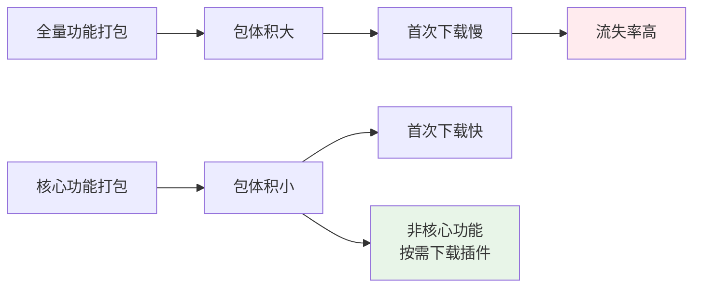
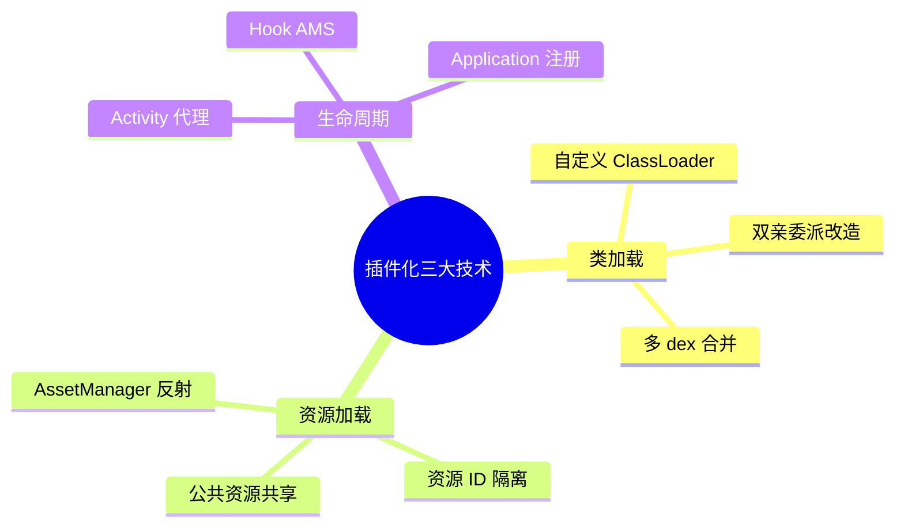
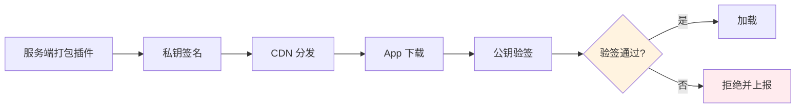
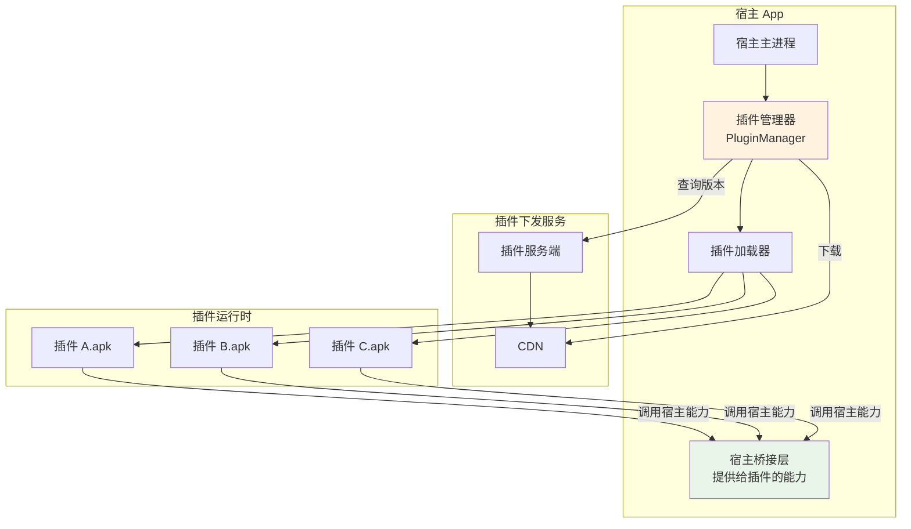
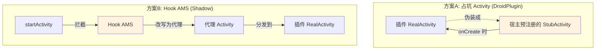
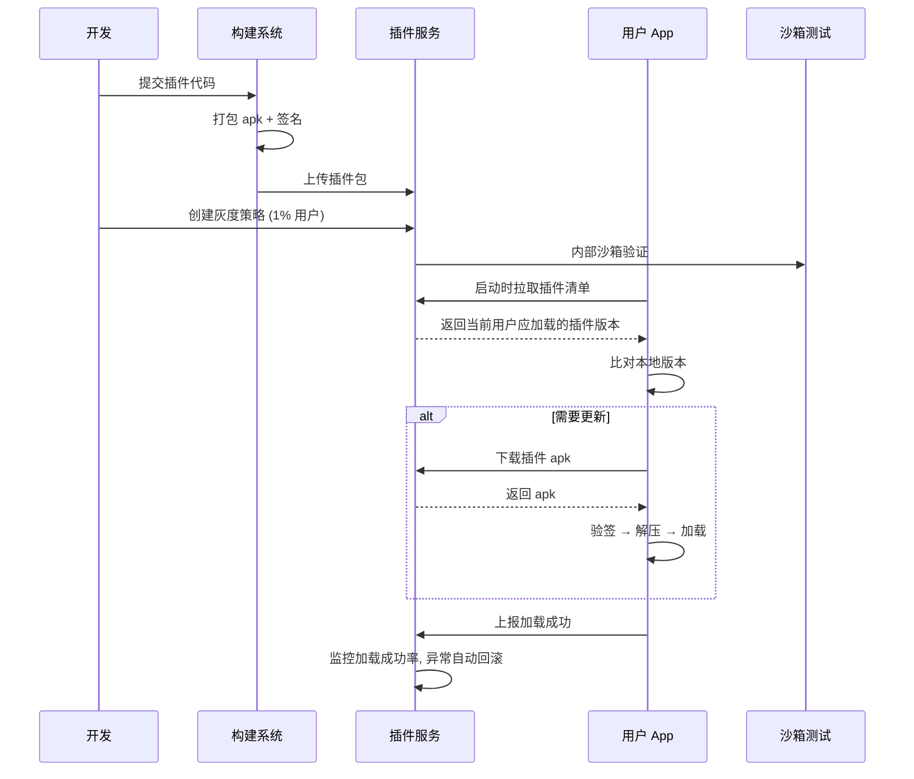
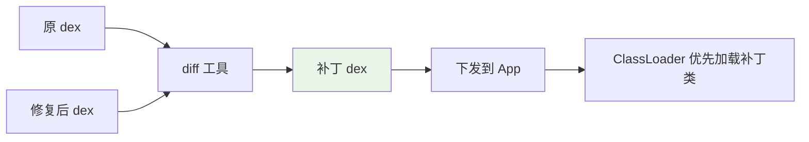
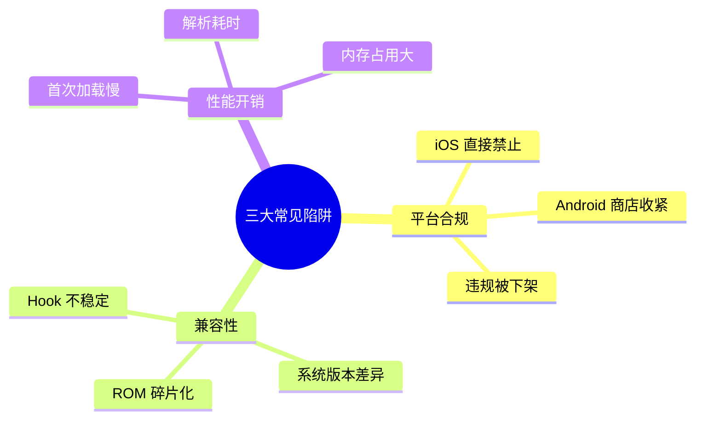
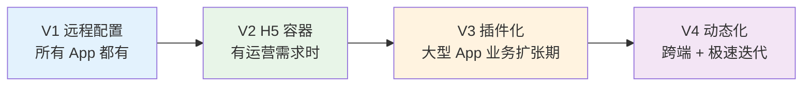

# 03.插件化与热加载方案

> **本篇定位**：组件化（02 篇）解决的是"编译期解耦"，插件化解决的是"运行期解耦"——让 App 在不重新发版的前提下，动态加载新业务、修复 Bug、上线运营活动。本文回答三个核心问题——**为什么需要插件化？业界三大方案怎么选？什么时候千万不要用？**

#### 目录介绍
- [01.一个上线的危机](#01一个上线的危机)
  - [1.1 双 11 前的事故](#11-双-11-前的事故)
  - [1.2 发版周期的瓶颈](#12-发版周期的瓶颈)
  - [1.3 插件化的契机](#13-插件化的契机)
- [02.要解决的核心矛盾](#02要解决的核心矛盾)
  - [2.1 应用商店审核](#21-应用商店审核)
  - [2.2 包体积的膨胀](#22-包体积的膨胀)
  - [2.3 灰度回滚困难](#23-灰度回滚困难)
  - [2.4 插件化的本质](#24-插件化的本质)
- [03.业界主流方案](#03业界主流方案)
  - [3.1 三种技术路线](#31-三种技术路线)
  - [3.2 横向对比矩阵](#32-横向对比矩阵)
  - [3.3 关键技术拆解](#33-关键技术拆解)
- [04.插件化设计原则](#04插件化设计原则)
  - [4.1 隔离优先原则](#41-隔离优先原则)
  - [4.2 兼容性原则](#42-兼容性原则)
  - [4.3 安全性原则](#43-安全性原则)
- [05.插件化方案落地](#05插件化方案落地)
  - [5.1 整体架构设计](#51-整体架构设计)
  - [5.2 类加载机制](#52-类加载机制)
  - [5.3 资源加载机制](#53-资源加载机制)
  - [5.4 生命周期管理](#54-生命周期管理)
  - [5.5 插件下发流程](#55-插件下发流程)
- [06.热修复方案落地](#06热修复方案落地)
  - [6.1 类替换方案](#61-类替换方案)
  - [6.2 dex 替换方案](#62-dex-替换方案)
  - [6.3 资源修复方案](#63-资源修复方案)
- [07.常见陷阱与反例](#07常见陷阱与反例)
  - [7.1 平台合规风险](#71-平台合规风险)
  - [7.2 兼容性碎片化](#72-兼容性碎片化)
  - [7.3 性能开销失控](#73-性能开销失控)
- [08.演进路线](#08演进路线)
  - [8.1 V1 远程配置](#81-v1-远程配置)
  - [8.2 V2 H5 容器](#82-v2-h5-容器)
  - [8.3 V3 插件化](#83-v3-插件化)
  - [8.4 V4 动态化框架](#84-v4-动态化框架)
- [09.总结与决策](#09总结与决策)
  - [9.1 适用场景清单](#91-适用场景清单)
  - [9.2 选型决策树](#92-选型决策树)


## 01.一个上线的危机

### 1.1 双 11 前的事故

某电商 App 在 2019 年双 11 前 3 天发现一个致命 Bug：**优惠券计算在特定 SKU 组合下会算错金额**，最严重的场景能用 1 元买 2000 元的商品。

按正常流程：
- 修复代码 → 走灰度 → 全量发版 → 用户更新 → 至少 7 天

但**双 11 还有 3 天就开始**。如果不能在 24 小时内修掉这个 Bug，预计损失 8000 万。

### 1.2 发版周期的瓶颈

复盘一下传统发版到底有多慢：

```mermaid
gantt
    title 传统 App 发版周期
    dateFormat  HH:mm
    axisFormat  %H:%M
    
    section 开发
    修复 Bug         :done, fix, 00:00, 2h
    内部测试         :done, qa1, after fix, 4h
    
    section 发布
    提交应用商店     :done, submit, after qa1, 1h
    平台审核         :crit, review, after submit, 24h
    
    section 用户更新
    50% 用户更新到 7 天后
```

**真正的卡点是审核 + 用户更新**——开发改完只要几小时，但 iOS 审核 24 小时打底，用户主动更新到 50% 通常要 3-7 天。

### 1.3 插件化的契机

那个事故团队最终用 **dex 热替换** 在 6 小时内把修复推到了 80% 用户，避免了灾难。事后他们做了一个决定：**将所有"营销玩法"模块插件化**，未来这种紧急运营都不再依赖发版。

这就是插件化最朴素的诉求——**把"必须发版"的成本降下来**。

## 02.要解决的核心矛盾

### 2.1 应用商店审核

iOS 强制审核（24-48 小时），Android 各应用商店也有 4-24 小时不等的审核。在以下场景这成为致命瓶颈：

| 场景 | 时效要求 | 审核能否满足 |
|---|---|---|
| 紧急 Bug 修复 | < 6 小时 | ❌ |
| 春晚红包等活动 | 精确到小时 | ❌ |
| A/B 实验快速迭代 | 1 天 1 版 | ❌ |
| 区域差异化运营 | 不影响其他区域 | ❌ |

### 2.2 包体积的膨胀

App 功能越来越多，包体积也越来越大。某电商 App 从 2018 年的 35MB 涨到 2022 年的 180MB，**用户首次下载流失率从 8% 涨到 23%**。



**插件化让"按需下载"成为可能**：核心 App 只 30MB，其他功能用到时再拉。

### 2.3 灰度回滚困难

发版后想回滚，只能再发一版（又要审核）。但插件化方案下，回滚 = 把插件版本号从 1.2 改回 1.1，**5 分钟全量生效**。

### 2.4 插件化的本质

> **插件化 = 把"代码 + 资源 + 配置"从 App 里解耦出来，让它们可以独立下发、加载、卸载**

它解决的是**业务节奏**和**发版节奏**之间的矛盾。

## 03.业界主流方案

### 3.1 三种技术路线

**路线一：插件化框架（动态加载完整业务）**
代表：DroidPlugin、VirtualAPK、Replugin、Shadow。把整个 Activity / Fragment / Service 打包成插件 apk，运行时动态加载。

**路线二：热修复（动态替换有缺陷的代码）**
代表：Tinker（微信）、Robust（美团）、Sophix（阿里）、AndFix。只能修复已有逻辑，不能新增功能。

**路线三：动态化框架（用 DSL/JS 描述 UI 和逻辑）**
代表：React Native、Flutter（with code push）、小程序、动态化布局（Tangram、Virtualview）。**不动 Java/Kotlin 代码，只动 JS/DSL**。


每代方案的"动态能力"和"风险/复杂度"都不同。

### 3.2 横向对比矩阵

| 维度 | 插件化 | 热修复 | 动态化 |
|---|---|---|---|
| **能否新增功能** | ✅ | ❌ 只能修 | ✅ |
| **能否修 Bug** | ⚠️（要替换整个插件） | ✅ 首选 | ⚠️（只修 JS 层） |
| **iOS 是否可用** | ❌ 违规 | ⚠️ 灰色地带 | ✅（RN/小程序合规） |
| **包体积影响** | 减小（核心包） | 增加 5-10MB | 增加 RN/Flutter 引擎 |
| **首屏性能** | 首次有下载 | 无影响 | 首次有 JS 加载 |
| **接入成本** | 高 | 中 | 高 |
| **开发体验** | 与原生一致 | 与原生一致 | JS / Dart / DSL |
| **典型代表** | Shadow / VirtualAPK | Tinker / Sophix | RN / Flutter / 小程序 |

### 3.3 关键技术拆解

无论哪种方案，核心都要解决三个技术问题：



- **类加载**：怎么让 App 能加载未知 apk 里的 class
- **资源加载**：怎么让插件里的图片、布局、字符串能用 R.id 引用
- **生命周期**：怎么让插件 Activity 能正常响应 onCreate / onResume

这三个问题决定了方案的"动态能力上限"。

## 04.插件化设计原则

### 04.1 隔离优先原则

插件出错不能拖死宿主。三层隔离：

| 层级 | 隔离手段 | 防什么 |
|---|---|---|
| **类隔离** | 独立 ClassLoader | 类冲突 |
| **资源隔离** | 独立 AssetManager / 命名空间 | 资源 ID 冲突 |
| **进程隔离** | 多进程 | 崩溃影响主进程 |

### 4.2 兼容性原则

Android 碎片化严重，插件化方案要穿越多个版本。任何依赖 **Hook 系统 API** 的方案都要做版本适配，建议每年回归 Top 10 ROM。

### 4.3 安全性原则

插件 = **可执行代码下发**，必须签名校验：



否则一旦中间人攻击成功，攻击者就能往用户 App 里塞任意代码。

## 05.插件化方案落地

### 5.1 整体架构设计



### 5.2 类加载机制

Android 默认双亲委派的 PathClassLoader 不能加载未知 apk 里的 class，所以需要**自定义 ClassLoader 把插件 dex 路径告诉它**：

```kotlin
class PluginClassLoader(
    dexPath: String,
    optimizedDirectory: File,
    parent: ClassLoader
) : DexClassLoader(dexPath, optimizedDirectory.absolutePath, null, parent) {
    
    override fun findClass(name: String): Class<*> {
        // 1. 先查插件自己的 dex
        try {
            return super.findClass(name)
        } catch (e: ClassNotFoundException) {
            // 2. 找不到再问宿主（共享类）
            return hostClassLoader.loadClass(name)
        }
    }
}
```

**关键改造点**：默认双亲委派会先问宿主，导致插件里和宿主同名的类被宿主"抢答"。**自定义 ClassLoader 要让插件优先**，但共享类（比如基础库）必须用宿主版本（避免内存里两份）。

### 5.3 资源加载机制

插件的 R.id 是独立编号，但 Android 的资源系统是按 packageId 索引的。两种主流做法：

| 方案 | 思路 | 代表 |
|---|---|---|
| **共用 AssetManager** | 把插件 apk 路径 addAssetPath 进宿主 AssetManager | Replugin |
| **独立 AssetManager** | 每个插件一个独立 AssetManager，访问时切换 | VirtualAPK |

共用方案性能更好但要解决资源 ID 冲突（aapt 修改 packageId）；独立方案隔离彻底但访问插件资源要切换 Context。

### 5.4 生命周期管理

插件的 Activity 没有在 AndroidManifest 注册，系统不认识。两种主流 Hook 思路：



腾讯 Shadow 走得更彻底——**完全无 Hook 方案**：把插件 Activity 改成"普通类"，由宿主代理 Activity 来分发生命周期。这个方案兼容性最好，是当前业界推荐方向。

### 5.5 插件下发流程



**关键点**：
- 灰度比例从 1% → 5% → 20% → 50% → 100% 阶梯放量
- 加载失败自动上报，超过阈值（如 0.5%）自动停止灰度
- 服务端可以一键"停发"任意版本，强制用户回退

## 06.热修复方案落地

### 6.1 类替换方案

代表：Robust。**为每个方法都插入一个 patch 字段**，发现需要修复时把 patch 类绑定上去：

```kotlin
// 编译期插桩后的代码
fun calculatePrice(...) {
    if (patch != null) {
        return patch.calculatePrice(...)  // 走修复版本
    }
    // 原有逻辑
}
```

**优点**：兼容性极好，立即生效。
**缺点**：包体积膨胀（每个方法都插桩）、不能改方法签名。

### 6.2 dex 替换方案

代表：Tinker、Sophix。**把修复后的 class 和原 class 做 diff，生成补丁 dex，用自定义 ClassLoader 让补丁优先加载**：



**优点**：能力强，可以新增字段、新增类。
**缺点**：需要重启 App 才生效（Android N 之前）；某些 ROM 兼容性差。

### 6.3 资源修复方案

修复布局 / 图片 / 字符串，思路类似插件化的资源加载——把补丁包 addAssetPath 进 AssetManager，让补丁资源优先匹配。

## 07.常见陷阱与反例

### 7.1 平台合规风险

**反例**：某 App 用 dex 热修复在 iOS 上实现了"动态改业务逻辑"，2016 年被苹果集体下架。

**苹果规则**：iOS 不允许下载可执行代码（除非是 JS / WebView 内）。这意味着**插件化 + dex 热修复在 iOS 完全不可行**，只能走动态化（RN / Flutter / 小程序）这条路。

**Android 国内市场也在收紧**：华为 / 小米等应用商店 2021 年后陆续禁止"频繁动态下发代码"，违规会被下架处理。

### 7.2 兼容性碎片化

**反例**：某团队用了一个 Hook 系统 AMS 的插件化方案，每年新 Android 版本发布后都要紧急修复，3 年内累计花了 200+ 人日做兼容。

**教训**：**任何依赖 Hook 私有 API 的方案都有版本债务**。优先选择"无 Hook"或"只 Hook 公开接口"的方案（如 Shadow）。

### 7.3 性能开销失控

**反例**：某 App 把首页全部改成动态化，启动时要下载 + 解析 6MB JS Bundle，**冷启动时间从 1.2s 涨到 3.5s**，DAU 下跌 6%。

**教训**：动态化和插件化都有"加载成本"。**核心路径（启动、首页、登录）千万不要做动态化**，除非有完善的预加载和缓存方案。



## 08.演进路线

> 大多数团队不会一开始就上重型插件化方案，而是从轻到重渐进。

### 8.1 V1 远程配置

**做了什么**：服务端下发 JSON 配置（如开关、文案、URL），App 启动时读取并应用。

**能解决**：
- 紧急关闭某个功能
- 替换文案 / 图片
- 切换接口环境

**不能解决**：业务逻辑改动、新增页面

**适用阶段**：所有 App 都应该有

### 8.2 V2 H5 容器

**做了什么**：把营销活动、运营页面用 H5 实现，App 提供 WebView 容器。

**能解决**：营销活动 0 发版上线、跨端共用一套页面

**不能解决**：性能要求高的核心页面（H5 体验差）

**适用阶段**：业务需要高频运营活动

### 8.3 V3 插件化

**做了什么**：把"非核心 + 高频迭代"的业务做成插件（如某个节日玩法、某个新业务试水）。

**能解决**：动态新增完整业务、按需下载减小包体积

**典型方案**：Shadow（推荐）、VirtualAPK、Replugin

**适用阶段**：DAU 千万级 + 业务高速扩张期

### 8.4 V4 动态化框架

**做了什么**：核心业务也用动态化方案重写（RN / Flutter with code push）。

**能解决**：跨端开发提效、核心业务也能动态更新

**适用阶段**：跨端团队 + 业务变化极快



> ⚠️ **不是每个团队都需要走到 V3 / V4**。一个内部工具 App 长期停在 V1 完全合理。

## 09.总结与决策

### 9.1 适用场景清单

✅ **该用插件化的场景**：

- DAU 千万级 + 高频运营活动（电商、内容、社交）
- 业务模块差异巨大需要按需下载（金融、超级 App）
- 紧急 Bug 修复时效要求 < 24 小时

❌ **不该用插件化的场景**：

- 团队 < 30 人，自身代码量不大
- 主战场是 iOS（合规风险）
- 性能敏感的核心路径（启动、首页）
- 团队没有专人维护框架（一旦遇到 ROM 兼容问题没人解）

### 9.2 选型决策树

```mermaid
flowchart TD
    Start([我需要"动态更新"能力吗?]) --> Q1{是否上线后<br/>就不太需要变?}
    Q1 -->|是| Skip[不需要插件化<br/>正常发版即可]
    Q1 -->|否| Q2{只是配置或文案?}
    
    Q2 -->|是| Config[V1 远程配置]
    Q2 -->|否| Q3{只是营销活动?}
    
    Q3 -->|是| H5[V2 H5 容器]
    Q3 -->|否| Q4{需要新增完整业务?}
    
    Q4 -->|是| Q5{主要是 iOS 还是 Android?}
    Q5 -->|iOS 为主| RN[V4 动态化<br/>RN / 小程序]
    Q5 -->|Android 为主| Q6{紧急修 Bug 优先?}
    
    Q6 -->|是| HotFix[热修复<br/>Tinker / Sophix]
    Q6 -->|否| Plugin[V3 插件化<br/>Shadow]
    
    Q4 -->|否| HotFix
    
    style Skip fill:#e3f2fd
    style Config fill:#e8f5e8
    style H5 fill:#fff3e0
    style Plugin fill:#ffebee
    style RN fill:#f3e5f5
    style HotFix fill:#ffebee
```

**最后一句话**：插件化是一把双刃剑——它能让你 6 小时止损 8000 万损失，也能让你为兼容性问题熬 3 年夜。**只有当"不发版的成本"远高于"维护框架的成本"时，它才是好方案**。

> 好的插件化 = **关键时刻能救命，平时不会要命**。
