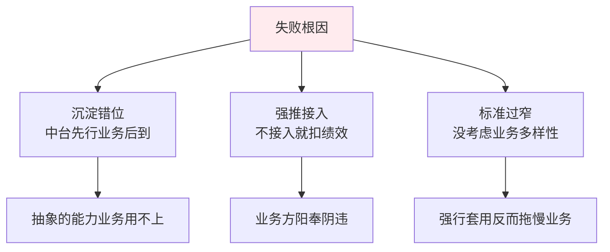
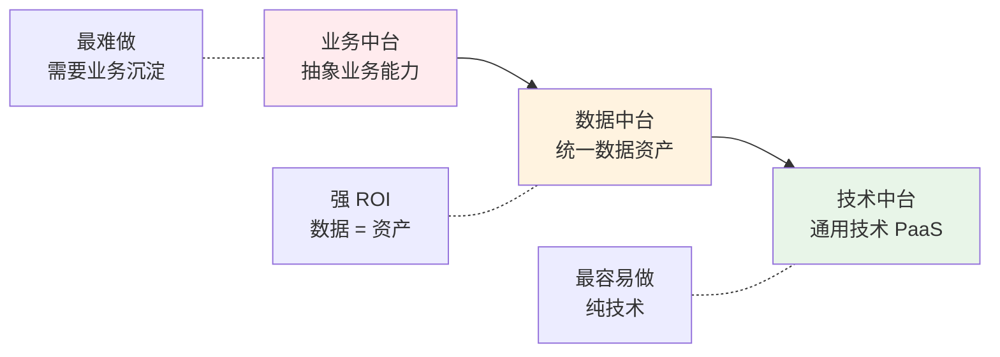
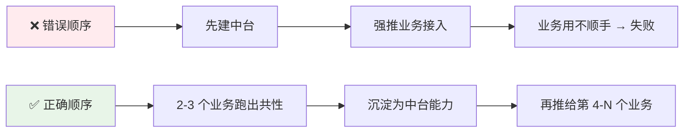
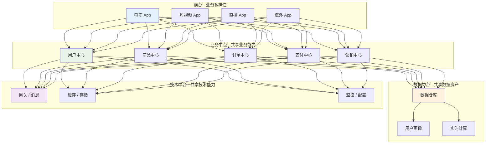
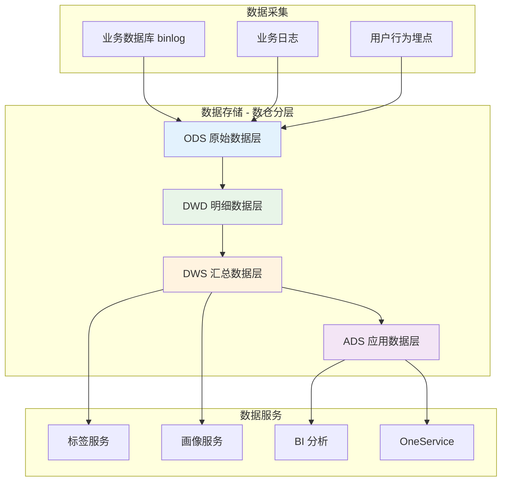
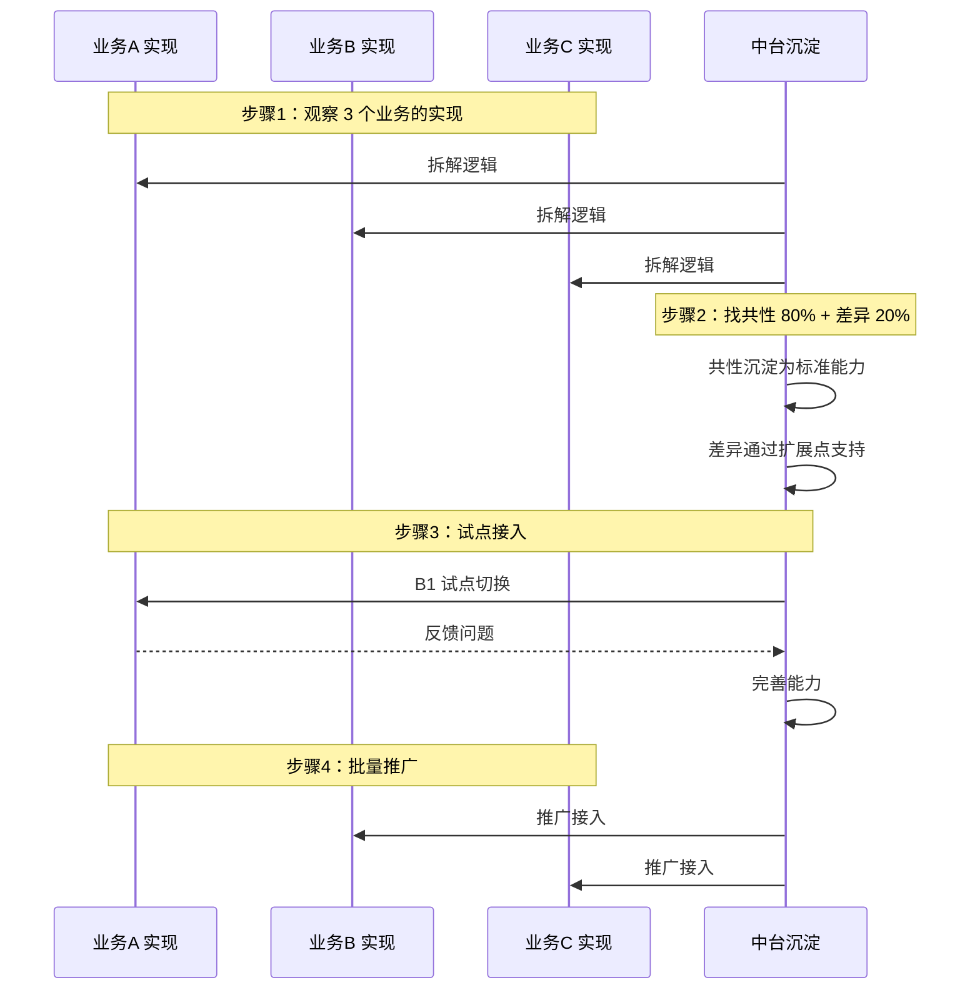
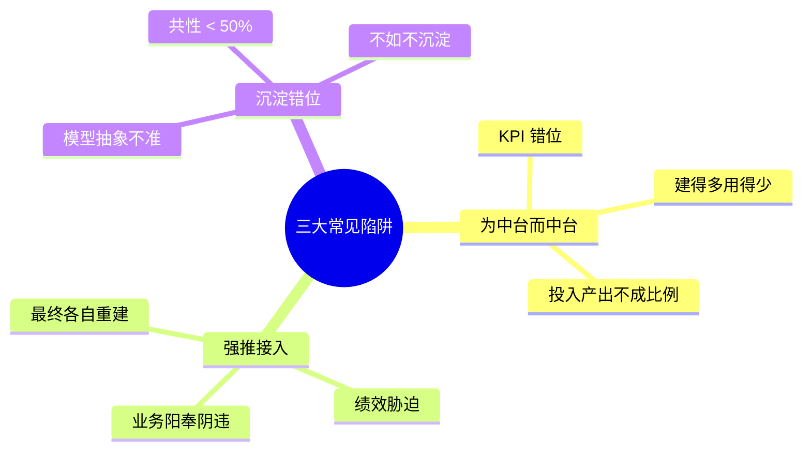
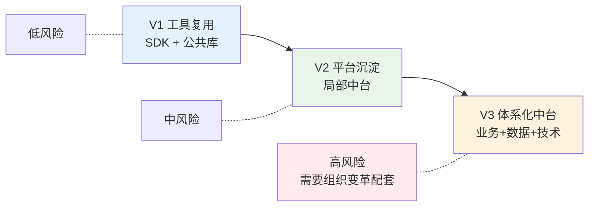
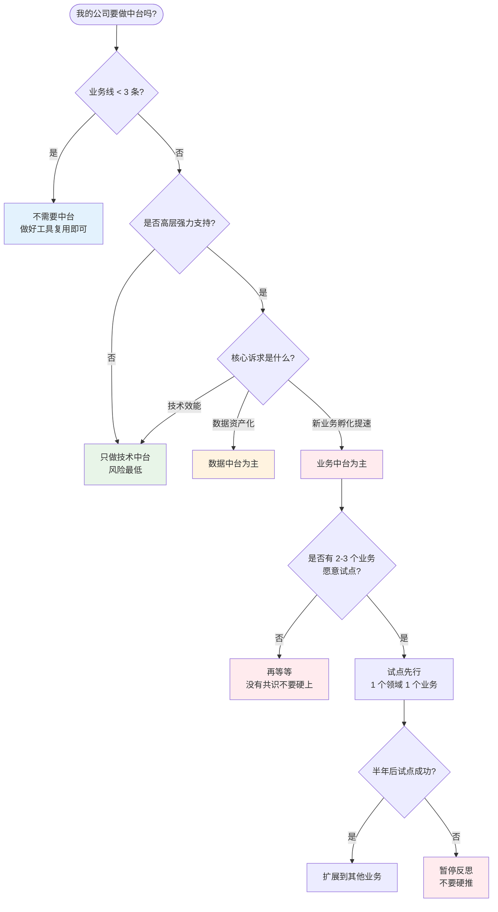

# 05.中台化能力沉淀方案

> **本篇定位**：组件化（02 篇）和 SDK（04 篇）解决的是"代码如何复用"，中台解决的是"**能力如何被多业务共享**"。这是一个被神话也被妖魔化的概念——本文回答三个核心问题——**中台到底是什么？什么样的公司适合做？怎么避免"中台失败"？**

#### 目录介绍
- [01.一个被叫停的中台](#01一个被叫停的中台)
  - [1.1 兴致勃勃的启动](#11-兴致勃勃的启动)
  - [1.2 业务方的反抗](#12-业务方的反抗)
  - [1.3 失败的根因](#13-失败的根因)
- [02.要解决的核心矛盾](#02要解决的核心矛盾)
  - [2.1 重复造轮子](#21-重复造轮子)
  - [2.2 数据烟囱化](#22-数据烟囱化)
  - [2.3 业务响应慢](#23-业务响应慢)
  - [2.4 中台的本质](#24-中台的本质)
- [03.业界主流方案](#03业界主流方案)
  - [3.1 三种中台流派](#31-三种中台流派)
  - [3.2 横向对比矩阵](#32-横向对比矩阵)
  - [3.3 典型公司案例](#33-典型公司案例)
- [04.中台设计原则](#04中台设计原则)
  - [4.1 业务驱动原则](#41-业务驱动原则)
  - [4.2 沉淀演进原则](#42-沉淀演进原则)
  - [4.3 自助服务原则](#43-自助服务原则)
  - [4.4 度量考核原则](#44-度量考核原则)
- [05.中台架构落地](#05中台架构落地)
  - [5.1 整体分层设计](#51-整体分层设计)
  - [5.2 业务中台拆分](#52-业务中台拆分)
  - [5.3 数据中台架构](#53-数据中台架构)
  - [5.4 技术中台架构](#54-技术中台架构)
- [06.能力沉淀流程](#06能力沉淀流程)
  - [6.1 识别可沉淀能力](#61-识别可沉淀能力)
  - [6.2 抽象与下沉](#62-抽象与下沉)
  - [6.3 接入与运营](#63-接入与运营)
- [07.常见陷阱与反例](#07常见陷阱与反例)
  - [7.1 为中台而中台](#71-为中台而中台)
  - [7.2 强推接入](#72-强推接入)
  - [7.3 沉淀错位](#73-沉淀错位)
- [08.演进路线](#08演进路线)
  - [8.1 V1 工具复用](#81-v1-工具复用)
  - [8.2 V2 平台沉淀](#82-v2-平台沉淀)
  - [8.3 V3 体系化中台](#83-v3-体系化中台)
- [09.总结与决策](#09总结与决策)
  - [9.1 中台启动检查表](#91-中台启动检查表)
  - [9.2 选型决策树](#92-选型决策树)


## 01.一个被叫停的中台

### 1.1 兴致勃勃的启动

2018 年某互联网公司模仿阿里搞中台，**集结 80 人组成中台部门**，目标"沉淀公司全部业务能力"。启动会上一句口号让人热血沸腾：

> "建中台，让业务方像搭积木一样组装产品。"

### 1.2 业务方的反抗

但 18 个月后，中台部门被默默拆解。复盘时发现的真实情况：

| 视角 | 反馈 |
|---|---|
| 中台团队 | "我们建了 12 个能力中心，但接入率只有 30%" |
| 电商业务 | "中台的订单服务不支持我们的预售场景，我们自己写了一套" |
| 短视频业务 | "中台用户中心查询慢，我们直连数据库" |
| 海外业务 | "中台只支持人民币，我们海外要美元、日元、卢比" |
| 高层 | "投入 80 人，业务效率没提升，反而增加了协作摩擦" |

### 1.3 失败的根因

事后复盘发现这个中台失败的根因有三：



**本质问题**：**这个公司学了阿里的"形"，但没学到阿里的"势"**——阿里的中台是从淘宝、天猫、聚划算多年沉淀自然抽象出来的，而这家公司是先搭中台再找业务接入。

带着这个失败案例，我们重新审视中台的本质。

## 02.要解决的核心矛盾

### 2.1 重复造轮子

公司有 5 个业务线，每个都自己写一套用户系统、订单系统、支付系统。表面上看每套都独立可控，实际上：

- **5 套用户表**：同一个用户在不同业务线 ID 不同
- **5 套支付逻辑**：每接入一个新支付渠道都要做 5 次
- **5 套风控规则**：黑产换个业务线就能绕过

**中台想解决**：把"用户""订单""支付"这种**所有业务都需要的核心能力**沉淀到一处。

### 2.2 数据烟囱化

```mermaid
graph TB
    subgraph "烟囱式架构"
        B1[电商业务] --> D1[(电商 DB)]
        B2[短视频业务] --> D2[(视频 DB)]
        B3[直播业务] --> D3[(直播 DB)]
    end
    
    Q[公司想要: 跨业务的用户画像 / 商业分析]
    Q -.-X- D1
    Q -.-X- D2
    Q -.-X- D3
    
    style Q fill:#ffebee
```

数据散落在各业务系统，公司想做"全域用户画像"、"跨业务推荐"几乎不可能。

### 2.3 业务响应慢

新业务孵化时从 0 开始搭基础：用户、商品、订单、支付、消息、风控……6 个月才能出第一版。**中台想让新业务 1-2 周就能搭起来**。

### 2.4 中台的本质

> **中台 = 把"多业务共享的能力"和"业务专属的能力"分离开，让共享能力被高效复用、专属能力快速创新**

它不是技术产物，而是**组织产物**——它本质是回答："公司的核心资产由谁拥有？"

## 03.业界主流方案

### 3.1 三种中台流派

**流派一：业务中台（Business Middle Platform）**
把"用户""商品""订单""支付""营销"等核心业务能力下沉。代表：阿里巴巴的"五大中心"。

**流派二：数据中台（Data Middle Platform）**
把跨业务的数据统一治理，提供数据服务。代表：阿里数据中台、字节数据平台。

**流派三：技术中台（Technical Middle Platform）**
把通用技术能力（消息、缓存、配置、监控、风控）下沉为内部 PaaS。代表：美团基础设施部。



### 3.2 横向对比矩阵

| 维度 | 业务中台 | 数据中台 | 技术中台 |
|---|---|---|---|
| **本质** | 业务能力共享 | 数据资产共享 | 技术能力共享 |
| **典型组件** | 用户/订单/支付中心 | 数据仓库/标签/画像 | 消息/缓存/网关 |
| **难度** | 极难（业务抽象） | 难（数据治理） | 中（技术工程） |
| **ROI** | 长期高，短期负 | 中长期高 | 立竿见影 |
| **失败率** | 60%+ | 30% | 10% |
| **公司规模门槛** | 5 个业务线以上 | 3 个业务线以上 | 任何规模 |
| **典型代表** | 阿里五大中心 | 字节数据平台 | 美团基础架构 |

### 3.3 典型公司案例

| 公司 | 中台思路 | 关键经验 |
|---|---|---|
| **阿里** | 业务+数据+技术三位一体 | 中台是"沉淀"出来的，不是"建"出来的；3+1+N 大组织架构变革配套 |
| **字节** | 数据中台 + 技术中台为主，弱化业务中台 | 业务方保持高度自主权，中台只提供"工具" |
| **美团** | 技术中台为主，业务领域内沉淀 | 不做"大一统"业务中台，分领域中台（外卖中台、酒旅中台） |
| **腾讯** | 早期反中台，2019 后推"技术委员会" | 业务赛马文化天然抗拒中台，但开源协同已经类中台 |

**关键洞察**：**没有任何一家公司复制阿里的中台成功**。每家都在适应自己的组织文化和业务结构。

## 04.中台设计原则

### 4.1 业务驱动原则

**铁律**：**先有业务，再有中台**。



阿里的"用户中心"是从淘宝、天猫、聚划算 3 个业务里**长出来**的，不是 PPT 设计出来的。

### 4.2 沉淀演进原则

**沉淀不是一次性工程，而是持续渐进的**。

| 阶段 | 行为 |
|---|---|
| **观察期** | 看 2-3 个业务都怎么实现这个能力 |
| **抽象期** | 找共性 80%、剥离差异 20% |
| **试点期** | 选 1 个业务先用中台版本，保留逃生通道 |
| **推广期** | 试点稳定后再推第 2-N 个业务 |
| **演进期** | 业务有新需求时，沉淀方持续吸收 |

### 4.3 自助服务原则

**好的中台 = 业务方不需要找你也能用**。

| 维度 | 自助服务 vs 强耦合 |
|---|---|
| 接入 | 看文档自己接 vs 必须中台团队对接 |
| 配置 | 后台界面自配 vs 提工单 |
| 监控 | 业务方能看到自己的指标 vs 只有中台能看 |
| 故障 | 自助回滚 vs 等中台值班 |

**反例**：某中台所有变更都要走中台团队的流程，业务方一个文案改动等 3 周，最后都绕开中台自己搞。

### 4.4 度量考核原则

中台必须有量化指标，否则就是"沉淀感动自己"：

| 维度 | 指标 |
|---|---|
| 复用度 | 接入业务数 / 公司总业务数 |
| 效能提升 | 新业务接入耗时（天） |
| 稳定性 | 中台 SLA |
| 业务满意度 | NPS 评分 |
| 成本节约 | 节约的人月数 |

**关键指标**：**接入率**。如果中台某个能力接入率 < 50%，说明这个能力要么没被需要，要么做得不好用。

## 05.中台架构落地

### 5.1 整体分层设计



**关键约束**：**前台只调用中台，不能跨过中台直接访问底层**。这是数据资产化的前提。

### 5.2 业务中台拆分

业务中台的拆分黄金法则：**按"领域"而不是"功能"拆**。

| 领域 | 中心 | 共享能力 |
|---|---|---|
| 用户域 | 用户中心 | 注册/登录/账号体系/隐私 |
| 商品域 | 商品中心 | 类目/属性/SKU/库存 |
| 交易域 | 订单中心 | 下单/订单状态/履约 |
| 资金域 | 支付中心 | 收银台/对账/结算 |
| 营销域 | 营销中心 | 优惠券/促销/会员 |

**反例**：按功能拆（"通用接口中心""通用工具中心"），最后变成大杂烩。

### 5.3 数据中台架构



数据中台的核心能力 = **OneID（用户在所有业务的唯一标识）+ OneModel（统一数据建模）+ OneService（统一对外服务）**。

### 5.4 技术中台架构

技术中台是最容易做、ROI 最高的。常见组件：

| 类别 | 能力 |
|---|---|
| **接入层** | API 网关、BFF、长连接网关 |
| **通信** | 消息队列、RPC 框架、注册中心 |
| **存储** | 缓存、对象存储、KV 数据库 |
| **观测** | 监控、日志、链路追踪 |
| **安全** | 风控、鉴权、加密 |
| **效能** | CI/CD、配置中心、灰度发布 |

每一项详细方案在本系列后续篇章中展开。

## 06.能力沉淀流程

### 6.1 识别可沉淀能力

**判断一个能力值不值得沉淀，问 5 个问题**：

| 问题 | 是否得分 |
|---|---|
| 是否被 ≥ 3 个业务使用？ | +1 |
| 业务对它的逻辑诉求是否 80% 一致？ | +1 |
| 它是否会被新业务持续需要？ | +1 |
| 业务方愿意放弃自主权吗？ | +1 |
| 它的变化频率低于业务前台吗？ | +1 |

**得分 ≥ 4 才值得沉淀**。否则沉淀也会被冷落。

### 6.2 抽象与下沉



**关键技术**：**扩展点（SPI / 插件）机制**——共性逻辑标准化，差异点开扩展点让业务自己实现。

### 6.3 接入与运营

中台不是"建好就完了"，需要持续运营：

| 运营动作 | 目标 |
|---|---|
| 文档与 Demo | 让业务方 30 分钟跑通 |
| 接入培训 | 季度内训 + 答疑 |
| 反馈通道 | 工单 + 钉钉群 + 月度业务方会议 |
| 接入率追踪 | 月报，给老板看 |
| 持续优化 | 季度迭代，吸纳业务方需求 |

## 07.常见陷阱与反例

### 7.1 为中台而中台

**反例**：本文开头那个 80 人中台，KPI 是"建多少能力中心"，结果建了 12 个但只有 4 个被业务真正用起来。

**教训**：中台 KPI 应该是**接入率 + 业务效能提升**，而不是"建了多少"。

### 7.2 强推接入

**反例**：某公司规定"业务方必须接入中台用户中心，不接入扣绩效"。结果业务方表面接入，实际只调一个空接口绕过去。

**教训**：**中台是吸引力的产物，不是强制力的产物**。强推就是失败的开始。

### 7.3 沉淀错位

**反例**：某中台把"商品中心"做成了"通用商品 CRUD"，结果电商需要 SKU 维度、内容业务需要标签维度，两边都不满意。

**教训**：**沉淀错位 = 没找到真正的共性**。如果两个业务对同一个"商品"的认知模型完全不同，强行合并就是灾难。这种情况应该**做"领域中台"**（电商商品中心 / 内容资产中心），而不是"通用商品中心"。



## 08.演进路线

> 中台不是一蹴而就的，而是 3 个阶段的渐进。

### 8.1 V1 工具复用

**特征**：业务方各自独立，公司层面只是"工具复用"。

**做法**：
- 抽出公共 SDK（日志、网络、监控）
- 公共组件库（UI Kit、工具库）
- 共用 Maven / npm 仓库

**适用阶段**：< 3 个业务线、 < 200 人

### 8.2 V2 平台沉淀

**特征**：开始有"平台"概念，技术中台成型，业务中台局部沉淀。

**做法**：
- 技术中台（消息、配置、监控）
- 数据中台萌芽（OneID）
- 局部业务中台（用户、支付）

**适用阶段**：3-10 个业务线、200-1000 人

### 8.3 V3 体系化中台

**特征**：业务+数据+技术三位一体，组织变革配套。

**做法**：
- 业务中台完整（用户/商品/订单/支付/营销）
- 数据中台体系化（数仓 + 画像 + BI）
- 技术中台 PaaS 化
- 组织上独立成"中台部门"

**适用阶段**：10+ 业务线、1000+ 人 + 高层强力支持



> ⚠️ **绝大多数公司停在 V2 是健康的**。V3 体系化中台需要的组织能量极大，强行推进就是开篇那个 80 人中台失败的剧本。

## 09.总结与决策

### 9.1 中台启动检查表

启动中台项目前对照这张清单，**至少满足 6 项再启动**：

- [ ] 公司有 ≥ 3 个独立业务线
- [ ] 业务间已经发现明显的能力重复
- [ ] CTO / CEO 强力支持（不只是口头）
- [ ] 有专职中台团队（不是临时抽调）
- [ ] 有 1-2 个业务愿意做"试点接入"
- [ ] 中台团队成员来自一线业务（懂业务）
- [ ] 接受"中台 KPI = 业务满意度"
- [ ] 有 12-18 个月不出明显业绩的耐心
- [ ] 接受"业务可以不接入中台"的逃生通道
- [ ] 不照搬阿里架构，按自己业务特点设计

### 9.2 选型决策树



**最后一句话**：中台是一面镜子——**它照出的不只是技术能力，更是公司的组织成熟度**。能成功做出中台的公司，都是**先解决了组织问题，再解决了技术问题**。如果你公司组织协作还很挣扎，**先别碰中台**。

> 好的中台 = **业务方说"少了它真不行"，而不是中台团队说"业务方必须接入"**。
