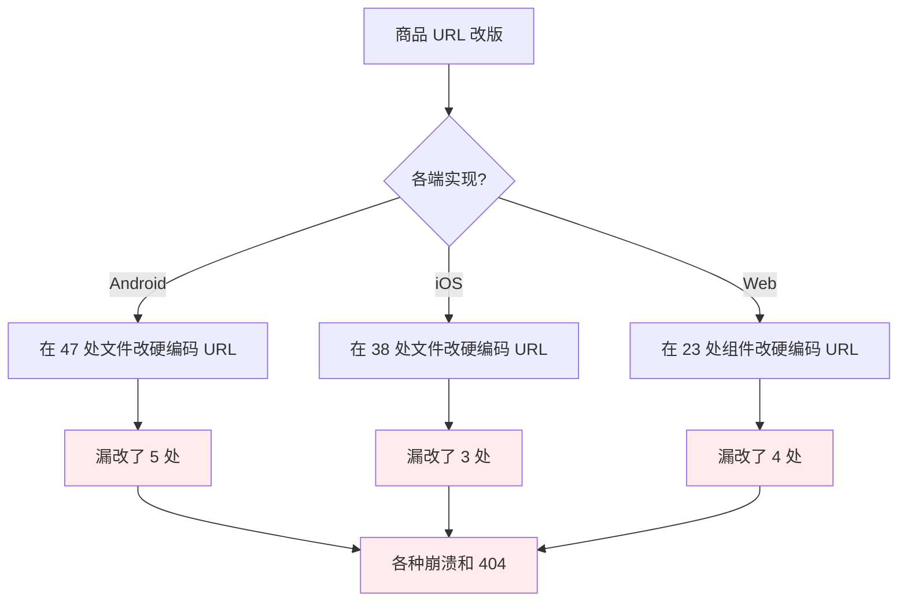
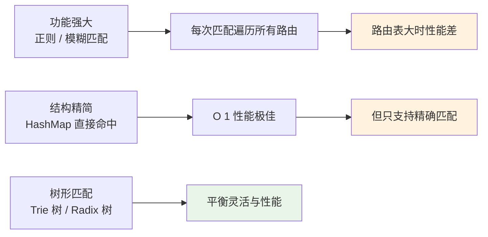
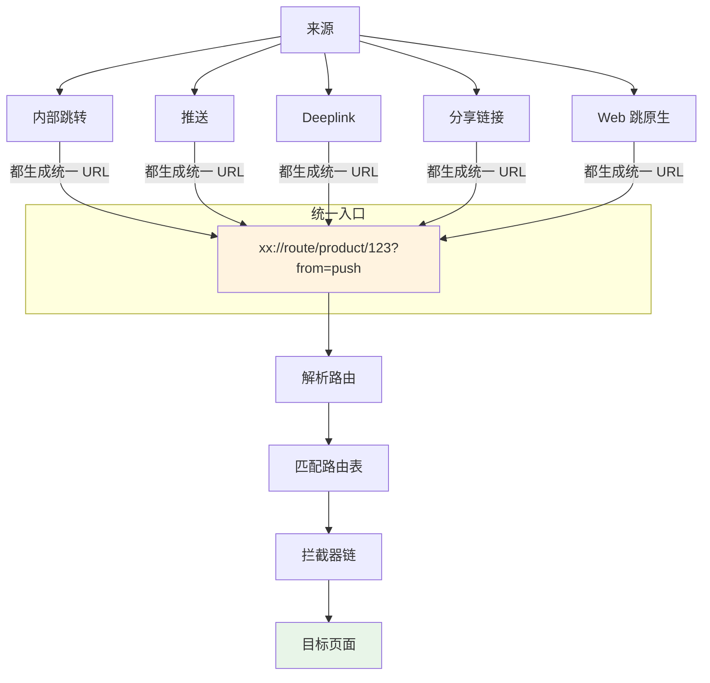
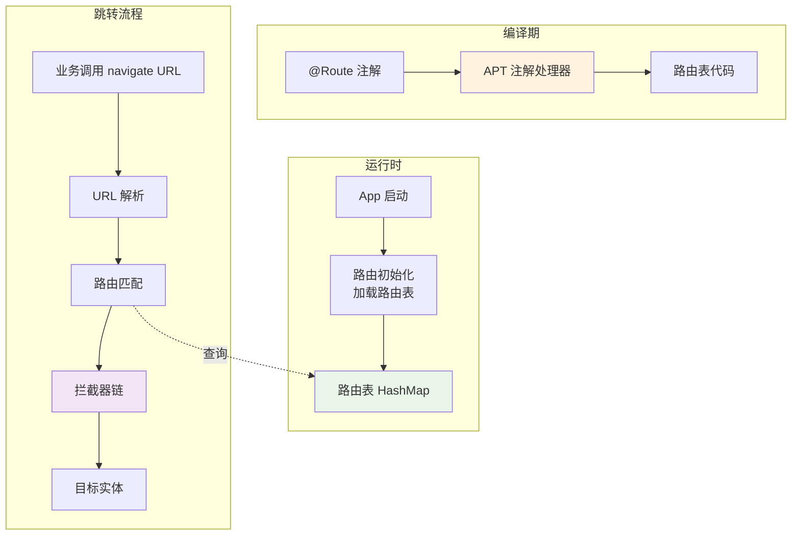
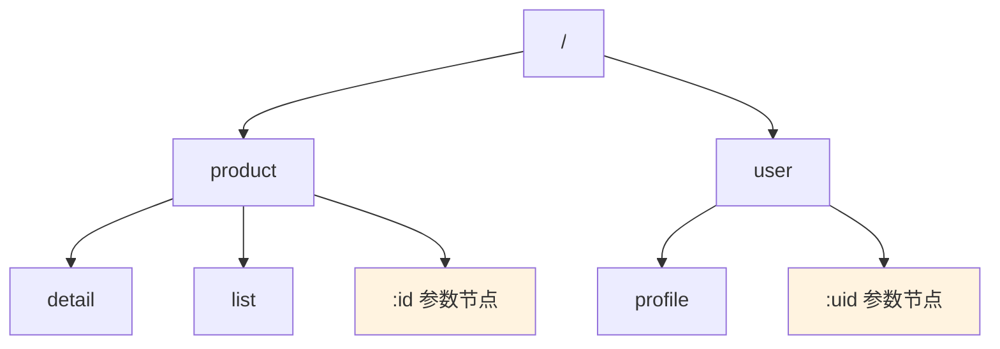
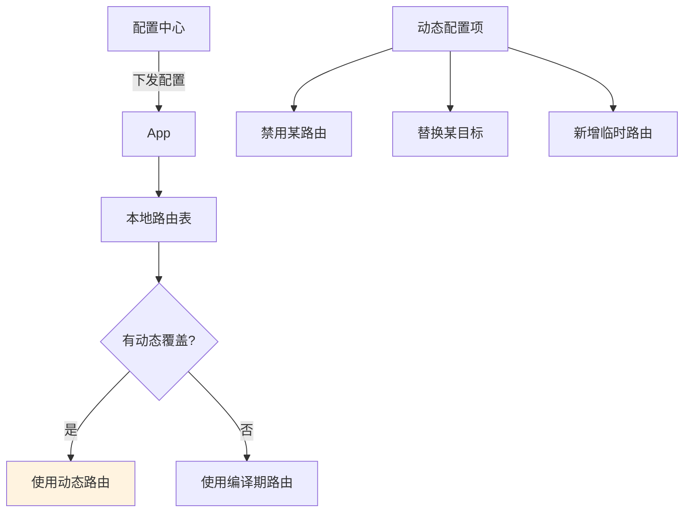
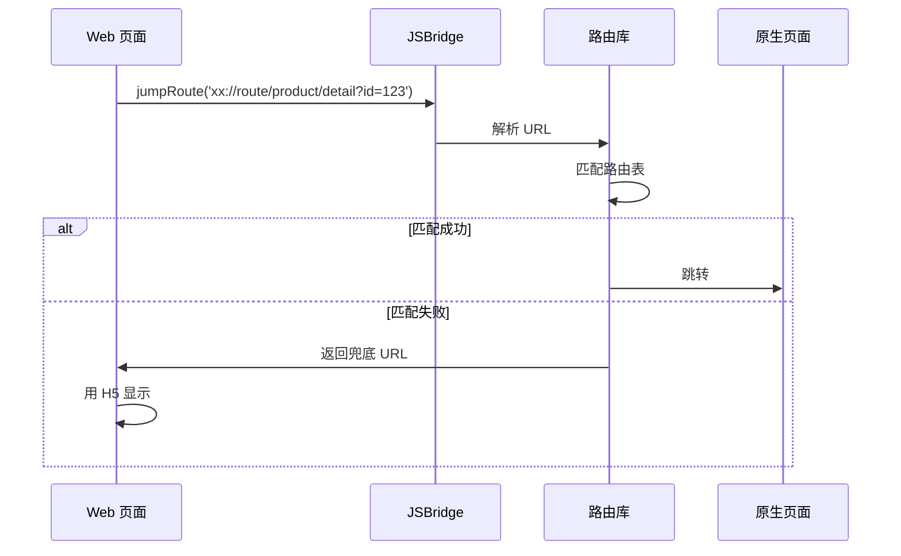
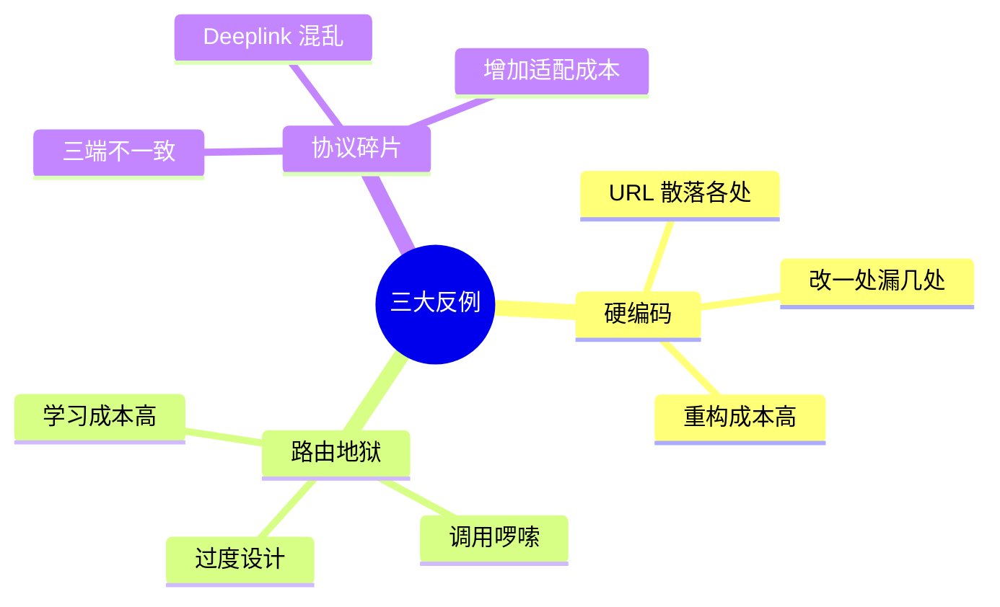
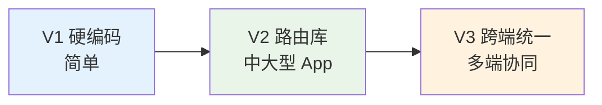
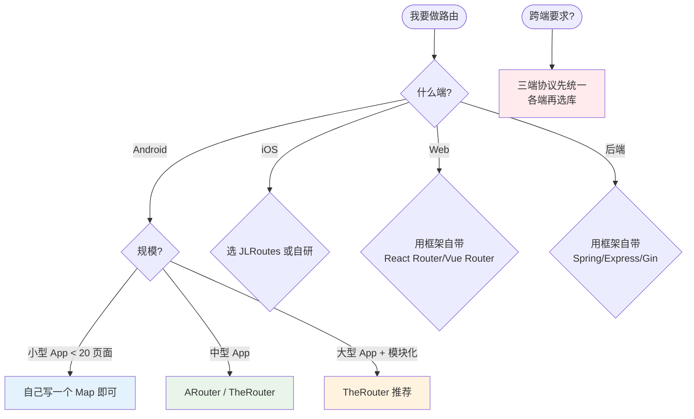

# 15.路由库设计思想

> **本篇定位**：路由是分布式系统和端侧应用的"导航系统"——决定一个请求 / 跳转到底去哪里。本文从一个跨端不一致的故事讲起，回答三个核心问题——**路由解决什么本质问题？端侧与服务端路由有什么共性？怎么设计一个跨端统一的路由库？**

#### 目录介绍
- [01.一次跳转的灾难](#01一次跳转的灾难)
  - [1.1 三端不一致](#11-三端不一致)
  - [1.2 重构的代价](#12-重构的代价)
  - [1.3 反思路由设计](#13-反思路由设计)
- [02.要解决的核心矛盾](#02要解决的核心矛盾)
  - [2.1 硬编码的痛](#21-硬编码的痛)
  - [2.2 灵活与性能](#22-灵活与性能)
  - [2.3 跨端一致性](#23-跨端一致性)
  - [2.4 路由的本质](#24-路由的本质)
- [03.业界主流方案](#03业界主流方案)
  - [03.1 端侧路由库](#031-端侧路由库)
  - [03.2 服务端路由](#032-服务端路由)
  - [03.3 横向对比矩阵](#033-横向对比矩阵)
- [04.设计核心原则](#04设计核心原则)
  - [04.1 注解驱动原则](#041-注解驱动原则)
  - [04.2 协议统一原则](#042-协议统一原则)
  - [04.3 拦截器原则](#043-拦截器原则)
  - [04.4 性能优先原则](#044-性能优先原则)
- [05.路由架构落地](#05路由架构落地)
  - [05.1 整体架构](#051-整体架构)
  - [05.2 路由表生成](#052-路由表生成)
  - [05.3 路由匹配算法](#053-路由匹配算法)
  - [05.4 拦截器链](#054-拦截器链)
  - [05.5 跨端协议设计](#055-跨端协议设计)
- [06.关键问题解决](#06关键问题解决)
  - [06.1 鉴权与降级](#061-鉴权与降级)
  - [06.2 动态路由更新](#062-动态路由更新)
  - [06.3 跨端跳转一致](#063-跨端跳转一致)
- [07.常见陷阱与反例](#07常见陷阱与反例)
  - [07.1 硬编码反例](#071-硬编码反例)
  - [07.2 路由地狱反例](#072-路由地狱反例)
  - [07.3 协议碎片反例](#073-协议碎片反例)
- [08.演进路线](#08演进路线)
  - [08.1 V1 字符串硬编码](#081-v1-字符串硬编码)
  - [08.2 V2 集中路由库](#082-v2-集中路由库)
  - [08.3 V3 跨端统一路由](#083-v3-跨端统一路由)
- [09.总结与决策](#09总结与决策)
  - [09.1 上线检查表](#091-上线检查表)
  - [09.2 选型决策树](#092-选型决策树)


## 01.一次跳转的灾难

### 1.1 三端不一致

某电商在搞"商品详情页改版"——把商品 ID 从路径参数改成了查询参数：

```
旧：/product/123
新：/product?id=123&from=search
```

**改了一周后**，发现用户反馈：
- **Android**：从首页点商品能进，从消息推送进就崩溃
- **iOS**：从分享链接进的人看到的是空白页
- **Web**：搜索结果跳转还是用旧 URL，新 URL 报 404



### 1.2 重构的代价

事后清点：
- **3 个端工程师各花 2 周排查漏改**
- **回滚了 2 次发版**
- **客服收到 4000+ 条相关投诉**
- **GMV 当周下跌 8%**

更恶劣的是，**这种"商品 URL 改版"在 3 年里发生过 5 次**，每次都要走一遍这个流程。

### 1.3 反思路由设计

事后这个团队意识到了几个最深刻的问题：

1. **URL 不该硬编码在业务代码里**——应该有统一的路由表
2. **三端协议必须一致**——别一个用 path 一个用 query
3. **路由必须可灰度可降级**——出问题能秒级回滚
4. **跳转必须有兜底**——目标页不存在时不能崩溃

> 路由是看似简单实则关键的基础设施——做对了项目稳定 5 年，做错了每次改版都是地狱。

## 02.要解决的核心矛盾

### 2.1 硬编码的痛

**反例**（业界普遍存在）：

```kotlin
// 业务代码各处直接写 URL / 类名
fun gotoProduct(id: Long) {
    val intent = Intent(this, ProductActivity::class.java)
    intent.putExtra("id", id)
    startActivity(intent)
}

// 上百个 Activity，几百个跳转点，全都这么写
```

**问题**：
- ProductActivity 改名 → 几百处都要改
- 加个公共拦截器（如登录校验） → 改不动
- 通过推送 / 链接进入 → 没法跳

### 2.2 灵活与性能



### 2.3 跨端一致性

移动端 + Web + 服务端，路由概念不同：

| 端 | 路由对象 | 协议 |
|---|---|---|
| Android | Activity / Fragment | Intent + Scheme |
| iOS | ViewController | URLScheme |
| Web | 组件 / 页面 | URL Hash / History |
| 服务端 | API 处理函数 | HTTP Path |

**统一的关键**：**用 URL 作为通用契约**——所有端都用 URL 表示路由。

### 2.4 路由的本质

> **路由 = "符号"到"实体"的映射 + 跳转控制**

它的核心是 **解耦"调用方"和"被调用方"**——调用方只需要知道一个字符串（URL / 路径），不需要知道具体类、模块、地址。

## 03.业界主流方案

### 03.1 端侧路由库

| 平台 | 主流路由库 | 特点 |
|---|---|---|
| **Android** | ARouter（阿里）/ TheRouter（货拉拉） | 注解 + APT 编译期生成路由表 |
| **iOS** | JLRoutes / MGJRouter（蘑菇街） | 运行时注册 + Block 处理 |
| **Web** | React Router / Vue Router | Hash / History 路由 |
| **Flutter** | Fluro / GoRouter | 声明式路由 |

### 03.2 服务端路由

| 框架 | 路由风格 |
|---|---|
| **Spring MVC** | 注解 `@RequestMapping` |
| **Express.js** | 链式 API `app.get('/path')` |
| **Gin (Go)** | Radix Tree + 链式 |
| **FastAPI (Python)** | 装饰器 + 类型注解 |

### 03.3 横向对比矩阵

以 Android 端为例对比主流路由库：

| 维度 | ARouter | TheRouter | DeepLinkDispatch | 自研 |
|---|---|---|---|---|
| **作者** | 阿里 | 货拉拉 | Airbnb | - |
| **匹配方式** | URL Path + APT | URL Path + APT | URL Pattern + APT | 多样 |
| **支持模块化** | ✅ | ✅ | ✅ | 取决于实现 |
| **拦截器** | ✅ | ✅ | 弱 | 取决于实现 |
| **降级处理** | ✅ | ✅ | 弱 | - |
| **跨端** | ❌ | 部分 | ❌ | 自定义 |
| **性能** | 高（编译期） | 高 | 中 | - |
| **维护状态** | 较少更新 | ✅ 活跃 | 维护 | - |

**实战推荐**：
- **大型 App**：TheRouter / ARouter
- **中型 App**：DeepLinkDispatch
- **小型 App**：自己写一个简单的路由表 Map 也行

## 04.设计核心原则

### 04.1 注解驱动原则

**让"声明"和"实现"绑在一起**：

```kotlin
// 直接在目标类上声明路由
@Route(path = "/product/detail")
class ProductDetailActivity : Activity() {
    @Autowired var productId: Long = 0
}

// 跳转时只需要 URL
ARouter.getInstance()
    .build("/product/detail")
    .withLong("productId", 123)
    .navigation()
```

**好处**：
- 路由信息一目了然
- 删除目标类时编译报错
- 不需要维护额外路由表

### 04.2 协议统一原则

**铁律**：**所有路由跳转都走 URL**——内部跳转、推送跳转、分享链接、Deeplink 都一致。



### 04.3 拦截器原则

**横切关注点必须能集中处理**：


**典型拦截器**：

| 拦截器 | 作用 |
|---|---|
| **登录拦截** | 未登录跳转到登录页，登录后回到原目标 |
| **实名拦截** | 强制实名才能进入特定页面 |
| **白名单** | 灰度页面仅特定用户可进 |
| **降级** | 页面下线时跳备用页或提示 |
| **埋点** | 自动记录页面跳转 |

### 04.4 性能优先原则

**路由匹配是高频操作**——每次跳转都要做。性能要求：

- **匹配 O(1) 或 O(log N)**：用 HashMap / Trie / Radix Tree
- **避免反射**：用 APT 编译期生成代码
- **路由表可分组**：按业务模块分组，减少冲突

## 05.路由架构落地

### 05.1 整体架构



### 05.2 路由表生成

**编译期路由表生成的核心**：

```kotlin
// 1. 业务代码声明
@Route(path = "/product/detail", desc = "商品详情页")
class ProductDetailActivity : Activity()

// 2. APT 在编译期生成对应的注册类
class Route$$Group$$product : IRouteGroup {
    override fun loadInto(atlas: Map<String, RouteMeta>) {
        atlas["/product/detail"] = RouteMeta(
            type = ACTIVITY,
            destination = ProductDetailActivity::class.java,
            path = "/product/detail",
            group = "product"
        )
    }
}

// 3. 启动时按需加载
ARouter.init { /* 自动加载所有 Route$$Group$$xxx */ }
```

**为什么编译期生成而不是运行时反射**：
- **性能**：反射开销巨大（每次都要扫包）
- **可控**：编译期错误能立即发现（如重复路径）
- **支持模块化**：每个模块生成自己的路由表

### 05.3 路由匹配算法

**简单 HashMap 匹配**：

```kotlin
val routeMap = HashMap<String, RouteMeta>()
val target = routeMap["/product/detail"]  // O(1)
```

**支持参数的 Trie 树匹配**：



**路径匹配示例**：
- `/product/detail` → 直接命中 detail 节点
- `/product/123` → 命中参数节点 `:id`，提取 id = 123
- `/user/456/profile` → user → :uid (uid=456) → profile

**Radix Tree（基数树）优化**：把"只有一个子节点的链"压缩成一个节点，**Gin 框架就用这种**。

### 05.4 拦截器链

**经典责任链模式**：

```kotlin
interface Interceptor {
    fun intercept(chain: Chain)
}

class LoginInterceptor : Interceptor {
    override fun intercept(chain: Chain) {
        if (!isLoggedIn()) {
            // 跳到登录页，登录后回到原目标
            saveOriginalRoute(chain.request)
            chain.redirect("/login")
        } else {
            chain.proceed()  // 放行
        }
    }
}

class InterceptorChain {
    fun run(request: Request) {
        val interceptors = listOf(
            LoginInterceptor(),
            AuthInterceptor(),
            DegradationInterceptor()
        )
        // 依次执行
        executeNext(0, request, interceptors)
    }
}
```

### 05.5 跨端协议设计

**统一的 URL 协议**：

```
xx://route/{path}?{params}

例：
xx://route/product/detail?id=123&from=push
xx://route/h5?url=https://example.com
xx://route/native/login?redirect=/product/detail
```

**协议字段约定**：

| 字段 | 含义 | 示例 |
|---|---|---|
| **scheme** | App 内统一 scheme | `xx` |
| **host** | 路由标识 | `route` |
| **path** | 路由路径 | `/product/detail` |
| **query** | 路由参数 | `id=123` |
| **fragment** | 锚点（Web） | `#section1` |

**三端实现接同一协议**：

```mermaid
graph TB
    URL["xx://route/product/detail?id=123"] --> A[Android Router]
    URL --> I[iOS Router]
    URL --> W[Web Router]
    URL --> S[Server Path]
    
    A --> ProductAct[ProductActivity]
    I --> ProductVC[ProductViewController]
    W --> ProductPage[ProductPage 组件]
    S --> ProductHandler[/api/v1/product/detail Handler]
    
    style URL fill:#fff3e0
```

## 06.关键问题解决

### 06.1 鉴权与降级

**鉴权**：通过拦截器实现：

```kotlin
@Route(path = "/order/list", needLogin = true)
class OrderListActivity : Activity()

// 拦截器自动处理
class LoginInterceptor : Interceptor {
    override fun intercept(chain: Chain) {
        val meta = chain.request.meta
        if (meta.needLogin && !User.isLoggedIn()) {
            chain.request.saveAsRedirect()
            chain.replaceRoute("/login")
        }
    }
}
```

**降级**：远程配置降级路由表：

```kotlin
// 远程下发降级配置
{
    "/product/detail": {
        "enable": false,
        "fallback": "/h5?url=https://example.com/maintenance"
    }
}

// 拦截器优先检查降级配置
class DegradationInterceptor : Interceptor {
    override fun intercept(chain: Chain) {
        val config = remoteConfig.getRouteConfig(chain.request.path)
        if (config?.enable == false) {
            chain.replaceRoute(config.fallback)
        }
    }
}
```

### 06.2 动态路由更新

**热更新场景**：上架新页面、临时下线某页面、跳转策略变更。



### 06.3 跨端跳转一致

**典型场景**：Web 页面里点链接打开原生页。



## 07.常见陷阱与反例

### 07.1 硬编码反例

**反例**：开篇那个改 URL 漏改了 12 处的故事。

**教训**：**任何路由相关的字符串都不能散落在业务代码**。集中到常量类或路由库。

### 07.2 路由地狱反例

**反例**：某团队为了"灵活"，路由库支持：动态注册、运行时反射、模糊匹配、回调嵌套……结果每次跳转的代码超过 50 行。

```kotlin
// ❌ 过度设计
Router.with(this).context(this).withParams(params)
    .interceptors(listOf(...))
    .fallback(...)
    .timeout(5000)
    .onSuccess { ... }
    .onFail { ... }
    .onIntercept { ... }
    .navigate()
```

**教训**：路由库要"简单到 1 行调用"。

```kotlin
// ✅ 简洁
Router.go("/product/detail", "id" to 123)
```

### 07.3 协议碎片反例

**反例**：Android 用 `app://product/123`，iOS 用 `myapp://product?id=123`，Web 用 `/product?productId=123`——三端 URL 不一致，分享链接、推送、Deeplink 全都要做适配。

**教训**：**协议必须三端一致**。在最早期就要约定。



## 08.演进路线

### 08.1 V1 字符串硬编码

**特征**：项目起步、跳转不多。

**做法**：直接 `startActivity(Intent(this, XxxActivity::class.java))`。

**痛点**：随项目变大不可维护。

### 08.2 V2 集中路由库

**特征**：项目复杂、模块化、需要拦截器。

**做法**：
- 引入 ARouter / TheRouter
- 注解 + APT
- 拦截器体系
- URL 协议统一

**适用阶段**：中大型 App

### 08.3 V3 跨端统一路由

**特征**：多端共存、动态运营。

**做法**：
- 三端协议统一
- 远程降级配置
- 动态路由表
- 数据驱动埋点

**适用阶段**：大型多端应用



## 09.总结与决策

### 09.1 上线检查表

新引入路由库或新增路由前对照：

- [ ] 路由协议（scheme/host/path）跨端一致
- [ ] 路由路径有命名规范（`/业务/页面`）
- [ ] 注解驱动而非手动注册
- [ ] 编译期校验（重复路径报错）
- [ ] 拦截器机制完备（登录 / 实名 / 降级 / 埋点）
- [ ] 远程降级配置就位
- [ ] 跳转失败有兜底（404 页 / 默认页）
- [ ] 参数传递有类型校验
- [ ] 跳转性能 < 50ms
- [ ] 路由 Map 监控（数量 / 命中率）
- [ ] Deeplink / Push 统一入口
- [ ] 文档化路由列表（自动生成）

### 09.2 选型决策树



**最后一句话**：路由库是**代码量小但作用大**的基础设施——一个商品详情 URL 改版能拖垮三个端的发布节奏，根因就在路由没设计好。

> 好的路由设计 = **简单到一行调用、灵活到任意拦截、统一到跨端一致、可控到秒级降级**。