# 17.幂等性设计方案

> **本篇定位**：幂等性是分布式系统的"防重保险丝"——网络抖动、客户端重试、消息重投都可能让同一个操作执行多次。本文从一次"扣两次款"的支付事故讲起，回答三个核心问题——**为什么必须做幂等？业界主流方案怎么选？怎么落地一个生产级幂等体系？**

#### 目录介绍
- [01.一次扣两次款](#01一次扣两次款)
  - [1.1 重复扣款事故](#11-重复扣款事故)
  - [1.2 故障扩散链路](#12-故障扩散链路)
  - [1.3 反思幂等设计](#13-反思幂等设计)
- [02.要解决的核心矛盾](#02要解决的核心矛盾)
  - [2.1 重复请求的来源](#21-重复请求的来源)
  - [2.2 一致性与性能](#22-一致性与性能)
  - [2.3 判重与时效](#23-判重与时效)
  - [2.4 幂等的本质](#24-幂等的本质)
- [03.业界主流方案](#03业界主流方案)
  - [03.1 主流方案概览](#031-主流方案概览)
  - [03.2 横向对比矩阵](#032-横向对比矩阵)
  - [03.3 适用场景速查](#033-适用场景速查)
- [04.设计核心原则](#04设计核心原则)
  - [04.1 唯一标识原则](#041-唯一标识原则)
  - [04.2 先判后做原则](#042-先判后做原则)
  - [04.3 状态机原则](#043-状态机原则)
  - [04.4 时效边界原则](#044-时效边界原则)
- [05.方案落地实战](#05方案落地实战)
  - [05.1 整体架构](#051-整体架构)
  - [05.2 Token 防重方案](#052-token-防重方案)
  - [05.3 唯一索引方案](#053-唯一索引方案)
  - [05.4 状态机方案](#054-状态机方案)
  - [05.5 分布式锁方案](#055-分布式锁方案)
- [06.关键问题解决](#06关键问题解决)
  - [06.1 幂等键设计](#061-幂等键设计)
  - [06.2 结果回放问题](#062-结果回放问题)
  - [06.3 跨服务幂等](#063-跨服务幂等)
- [07.常见陷阱与反例](#07常见陷阱与反例)
  - [07.1 先做后判反例](#071-先做后判反例)
  - [07.2 时间戳幂等反例](#072-时间戳幂等反例)
  - [07.3 部分幂等反例](#073-部分幂等反例)
- [08.演进路线](#08演进路线)
  - [08.1 V1 业务唯一约束](#081-v1-业务唯一约束)
  - [08.2 V2 通用幂等中间件](#082-v2-通用幂等中间件)
  - [08.3 V3 全链路幂等](#083-v3-全链路幂等)
- [09.总结与决策](#09总结与决策)
  - [09.1 上线检查表](#091-上线检查表)
  - [09.2 选型决策树](#092-选型决策树)


## 01.一次扣两次款

### 1.1 重复扣款事故

某电商支付系统某天晚上 22:00 大促，**有 3700 个用户被重复扣款**——一笔订单 199 元的，账户被扣了 398 元。

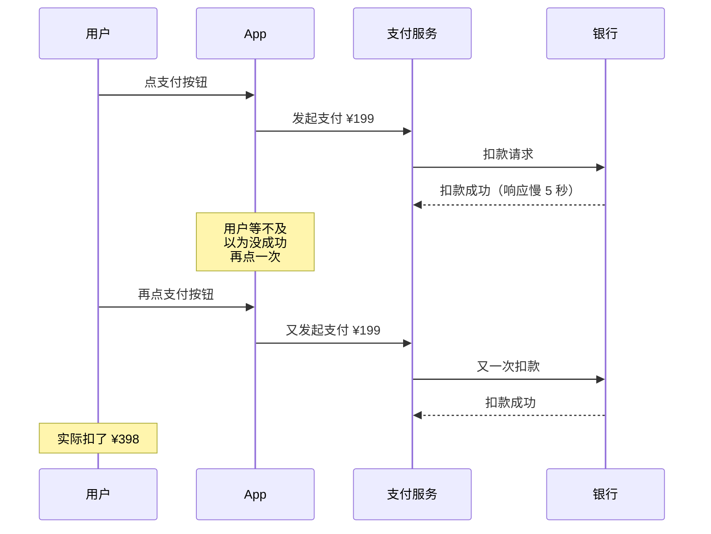

**故障代价**：
- 客服 3 天处理 3700+ 投诉
- 退款 + 补偿 ¥73 万
- App 评分掉到 2.1 星
- 监管约谈

### 1.2 故障扩散链路

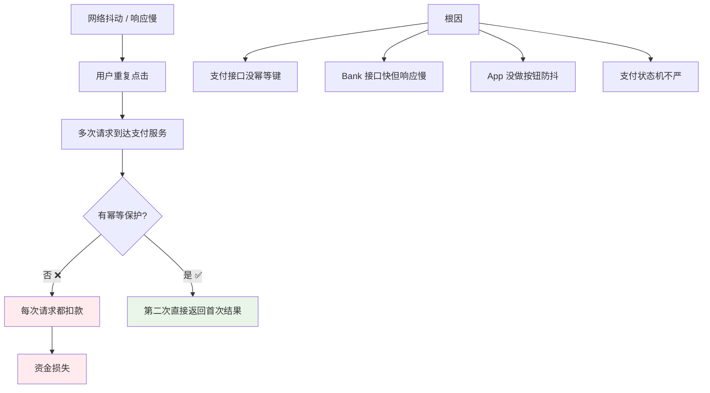

### 1.3 反思幂等设计

事后这个团队总结了三个最深刻的教训：

1. **重试是分布式系统的常态**——网络抖动、超时重发、用户重点击都会触发
2. **幂等不是"可选优化"，而是"必备保险"**——尤其涉及钱、库存、消息
3. **幂等要靠"业务唯一标识 + 服务端去重"**——不能依赖客户端不重发

> 这次事故揭示一个本质：**分布式系统不存在"恰好一次"的网络通信**——只有"至少一次 + 服务端幂等 = 恰好一次"。

## 02.要解决的核心矛盾

### 2.1 重复请求的来源

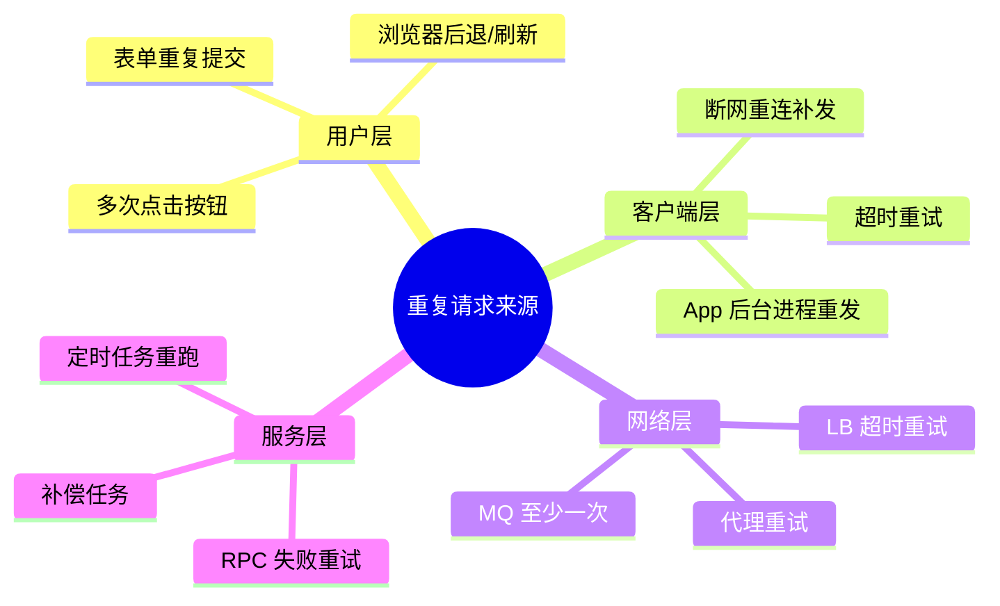

**关键认知**：**只要有重试就一定会有重复请求**——而分布式系统离不开重试。

### 2.2 一致性与性能

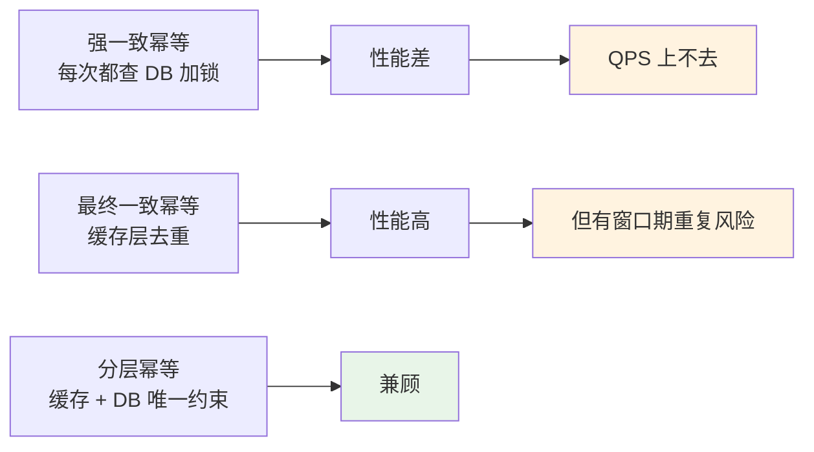

### 2.3 判重与时效

幂等记录不能永久保留（成本爆炸），但保留太短又会失效：

| 业务 | 保留时长 | 理由 |
|---|---|---|
| 支付下单 | 24 小时 | 重试一般几分钟内 |
| 消息消费 | 7 天 | MQ 最长重投周期 |
| 接口调用 | 1 小时 | 短期重试为主 |
| 定时任务 | 30 天 | 跨月对账 |

### 2.4 幂等的本质

> **幂等 = 同一操作执行 N 次和执行 1 次的结果完全相同**

数学上：`f(f(x)) = f(x)`。

工程上：**操作前先判断"这件事我做过没"，做过就直接返回首次结果**。

## 03.业界主流方案

### 03.1 主流方案概览

| 方案 | 核心思路 | 典型场景 |
|---|---|---|
| **唯一索引** | DB 唯一约束阻止重复 | 创建订单、注册用户 |
| **Token 防重** | 调用前先取 Token，调用时消费 | 表单提交、支付 |
| **状态机** | 仅在特定状态下才执行 | 订单状态流转 |
| **乐观锁** | version 字段控制 | 库存扣减、计数器 |
| **悲观锁/分布式锁** | 串行化操作 | 高竞争场景 |
| **幂等表** | 单独存幂等键和结果 | 通用接口幂等 |

### 03.2 横向对比矩阵

| 维度 | 唯一索引 | Token | 状态机 | 乐观锁 | 分布式锁 | 幂等表 |
|---|---|---|---|---|---|---|
| **实现复杂度** | ⭐ | ⭐⭐ | ⭐⭐⭐ | ⭐⭐ | ⭐⭐ | ⭐⭐ |
| **性能** | ⭐⭐⭐⭐ | ⭐⭐⭐⭐⭐ | ⭐⭐⭐⭐ | ⭐⭐⭐⭐ | ⭐⭐ | ⭐⭐⭐⭐ |
| **可靠性** | ⭐⭐⭐⭐⭐ | ⭐⭐⭐ | ⭐⭐⭐⭐ | ⭐⭐⭐⭐ | ⭐⭐⭐⭐⭐ | ⭐⭐⭐⭐ |
| **是否返回首次结果** | ❌ | ✅ | ❌ | ❌ | ❌ | ✅ |
| **跨服务可用** | ❌ | ✅ | ❌ | ❌ | ✅ | ✅ |

### 03.3 适用场景速查

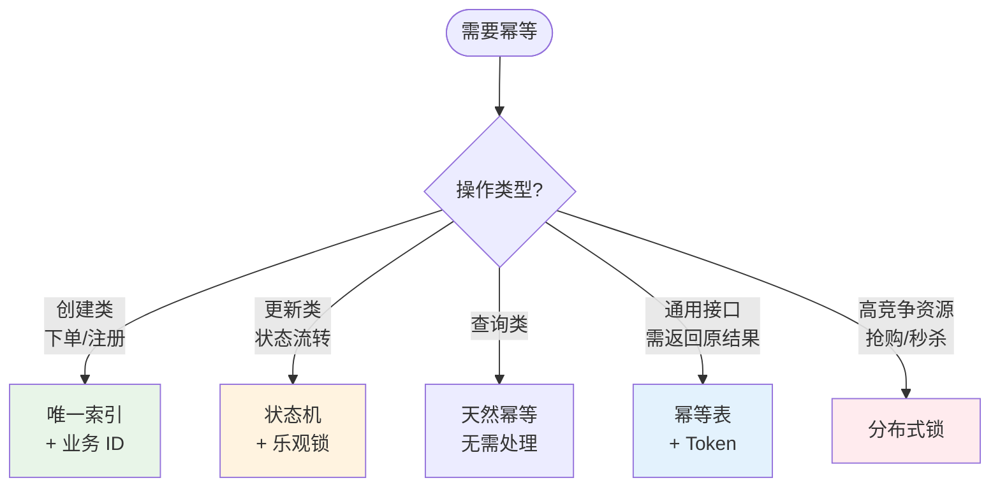

## 04.设计核心原则

### 04.1 唯一标识原则

**铁律**：**必须有一个业务级唯一 ID 来标识这次操作**。

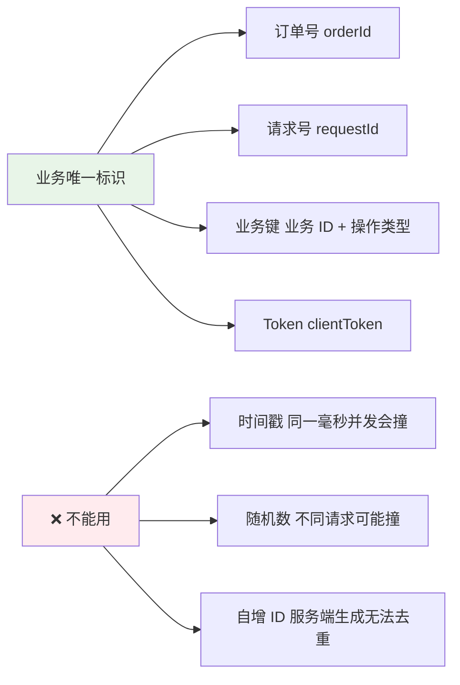

**幂等键的好特征**：
- **客户端生成**（如 UUID）—— 服务端才能识别"这是同一个请求"
- **业务相关**（如 `userId+orderId+amount`）—— 防止业务上的重复
- **可读性**—— 排查问题时一眼看出是哪笔

### 04.2 先判后做原则

**永远先判重，再执行业务**：

```kotlin
// ✅ 正确：先判重
fun pay(req: PayRequest): PayResult {
    val key = "pay:${req.requestId}"
    val cached = cache.get(key)
    if (cached != null) return cached  // 重复请求，返回首次结果
    
    val result = doPayment(req)  // 真正业务
    cache.set(key, result, ttl = 24.hours)
    return result
}

// ❌ 错误：先做后判（资金已经动了）
fun pay(req: PayRequest): PayResult {
    val result = doPayment(req)  // 已经扣款
    val key = "pay:${req.requestId}"
    if (cache.exists(key)) {
        rollback(result)  // 回滚已经晚了
        return cache.get(key)
    }
    cache.set(key, result)
    return result
}
```

### 04.3 状态机原则

**业务状态只能按规定路径流转**：

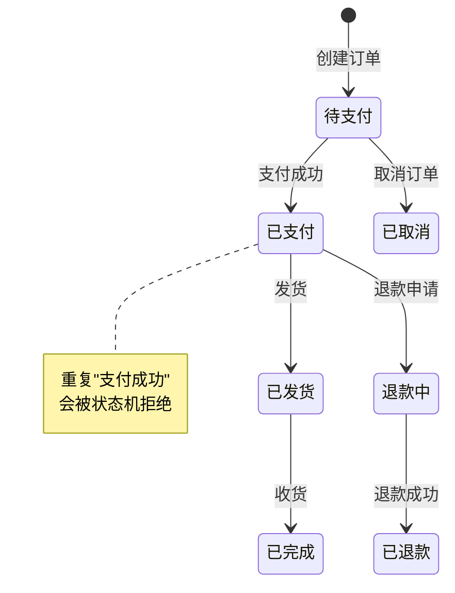

**状态机天然幂等**：因为只有"待支付 → 已支付"是允许的，第二次想再"已支付 → 已支付"会被拒绝。

```sql
-- 用 SQL 实现状态机
UPDATE orders 
SET status = 'PAID', pay_time = NOW()
WHERE order_id = ? 
  AND status = 'WAITING_PAY';  -- 只在特定状态下才执行

-- 影响行数 = 0 → 已经执行过了
-- 影响行数 = 1 → 首次执行成功
```

### 04.4 时效边界原则

**幂等不是永久的，必须有清晰的时效边界**：

| 业务 | 时效 | 过期后怎么办 |
|---|---|---|
| 支付下单 | 24 小时 | 同样的 requestId 算新订单 |
| 消息消费 | 7 天 | 跟 MQ 最长重投周期对齐 |
| Token 防重 | 5-30 分钟 | 表单页面停留时间 |

## 05.方案落地实战

### 05.1 整体架构

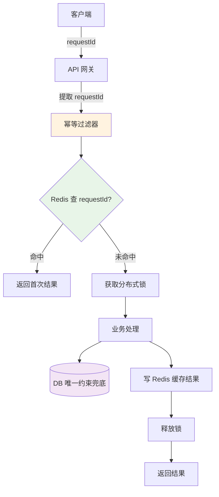

### 05.2 Token 防重方案

**适用场景**：表单提交、支付按钮等"用户主动触发"的操作。

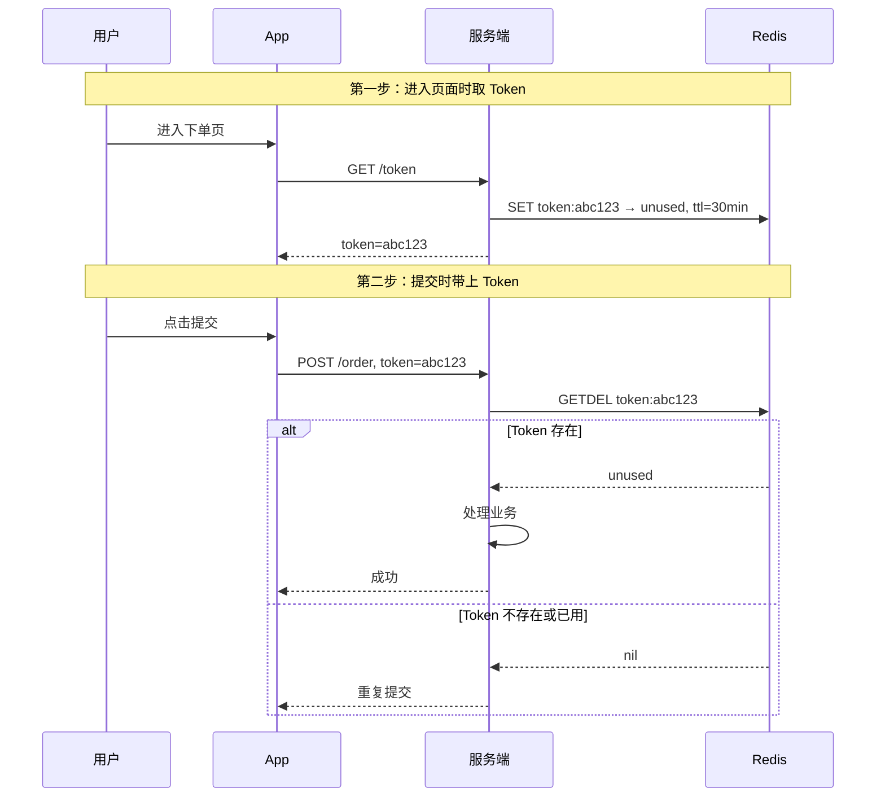

**核心逻辑**：**`GETDEL` 是原子操作**——同一 Token 只能成功"消费"一次，第二次必然失败。

### 05.3 唯一索引方案

**适用场景**：创建类操作（订单、用户、支付单）。

```sql
-- 业务唯一键作为唯一索引
CREATE TABLE orders (
    id BIGINT PRIMARY KEY AUTO_INCREMENT,
    user_id BIGINT NOT NULL,
    request_id VARCHAR(64) NOT NULL,
    amount DECIMAL(10,2),
    status VARCHAR(20),
    UNIQUE KEY uk_request_id (request_id)
);

-- 插入：重复 requestId 会抛 DuplicateKey 异常
INSERT INTO orders(user_id, request_id, amount, status)
VALUES (?, ?, ?, 'WAITING_PAY');
```

**捕获异常的两种处理**：

```kotlin
fun createOrder(req: OrderRequest): Order {
    return try {
        orderDao.insert(req.toEntity())
    } catch (e: DuplicateKeyException) {
        // 重复请求，查首次记录返回
        orderDao.findByRequestId(req.requestId) 
            ?: throw IllegalStateException("数据不一致")
    }
}
```

**为什么唯一索引最可靠**：DB 是数据的最后一道防线，缓存可以丢、应用可以重启，但 DB 唯一约束**永远生效**。

### 05.4 状态机方案

**适用场景**：状态流转类（订单支付、退款、发货）。

```kotlin
@Transactional
fun payOrder(orderId: String): PayResult {
    val rows = orderDao.updateStatus(
        orderId = orderId,
        fromStatus = "WAITING_PAY",
        toStatus = "PAID"
    )
    
    return when (rows) {
        1 -> {
            // 首次执行成功
            triggerPaidEvents(orderId)
            PayResult.SUCCESS
        }
        0 -> {
            // 状态不对，可能已支付或已取消
            val current = orderDao.findById(orderId)
            when (current.status) {
                "PAID" -> PayResult.ALREADY_PAID  // 幂等返回
                "CANCELLED" -> PayResult.CANCELLED
                else -> PayResult.STATUS_ERROR
            }
        }
        else -> error("unexpected rows: $rows")
    }
}
```

**关键：UPDATE 影响行数判断**——这是最优雅的状态机幂等。

### 05.5 分布式锁方案

**适用场景**：高并发竞争资源（秒杀、抢购、防超卖）。

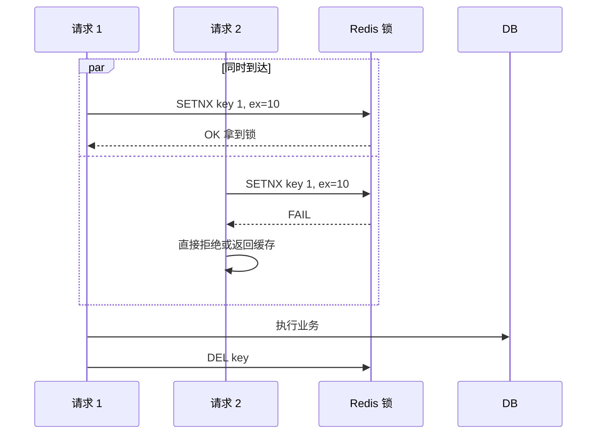

**注意**：分布式锁性能差（每个请求多一次 Redis），**只在真正高竞争场景用**。

详见下一篇 18.分布式锁方案。

## 06.关键问题解决

### 06.1 幂等键设计

**好的幂等键设计示例**：

| 业务场景 | 幂等键构造 |
|---|---|
| 用户下单 | `userId + orderTraceId + sku` |
| 支付 | `payOrderId + paymentChannel` |
| 退款 | `refundId + originalOrderId` |
| 消息消费 | `consumerGroup + topic + msgId` |
| 资金转账 | `srcAccount + dstAccount + serialNo` |

**避免的设计**：
- ❌ `userId + timestamp` —— 同毫秒并发撞键
- ❌ 随机字符串 —— 重发时无法识别
- ❌ 自增 ID —— 客户端无法生成

### 06.2 结果回放问题

**进阶问题**：重复请求时，要不要返回**完全一致**的结果？

```mermaid
flowchart TD
    Q[重复请求来了] --> Q1{要返回首次结果吗?}
    
    Q1 -->|是 严格幂等| Plan1[幂等表存请求 + 响应]
    Q1 -->|否 业务幂等就行| Plan2[只校验"已处理"<br/>返回当前状态]
    
    Plan1 --> R1[需要存储响应内容]
    Plan1 --> R2[空间成本]
    
    Plan2 --> R3[实现简单]
    Plan2 --> R4[但客户端要能识别"已处理"]
    
    style Plan1 fill:#fff3e0
    style Plan2 fill:#e8f5e8
```

**幂等表设计**：

```sql
CREATE TABLE idempotent_record (
    id BIGINT PRIMARY KEY AUTO_INCREMENT,
    biz_type VARCHAR(50),           -- 业务类型
    idempotent_key VARCHAR(128),    -- 幂等键
    request_body TEXT,              -- 原始请求（可选）
    response_body TEXT,             -- 首次响应
    status VARCHAR(20),             -- PROCESSING / SUCCESS / FAIL
    created_at DATETIME,
    expired_at DATETIME,
    UNIQUE KEY uk_biz_key (biz_type, idempotent_key)
);
```

### 06.3 跨服务幂等

**链路**：A → B → C，三个服务都要幂等。

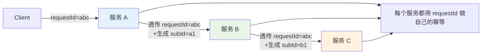

**核心**：**幂等键沿调用链透传**——每个服务都用同一个 requestId 来识别"这是不是同一次外部请求"。

## 07.常见陷阱与反例

### 07.1 先做后判反例

**反例**：先扣款再判重，重复时回滚。

**问题**：
- 重复扣款的瞬间已经发生了资金变化
- 回滚可能失败（网络抖动）
- 多次调用银行接口浪费资源

**正确**：**永远先判后做**。

### 07.2 时间戳幂等反例

**反例**：用时间戳做幂等键。

```kotlin
// ❌ 错误
val key = "${userId}:${System.currentTimeMillis()}"
```

**问题**：
- 同毫秒并发撞键
- 跨机器时钟不同步
- 重试时时间戳变了，幂等失效

**正确**：用客户端生成的 UUID 或业务唯一 ID。

### 07.3 部分幂等反例

**反例**：接口"主流程"做了幂等，但"副作用"（发短信、写日志、扣积分）没做。

**问题**：
- 用户收到 2 条相同短信
- 积分被扣 2 次
- 业务上看起来"重复"

**正确**：**所有副作用都要纳入幂等保护**——要么全部跳过（已处理），要么打包在事务里。

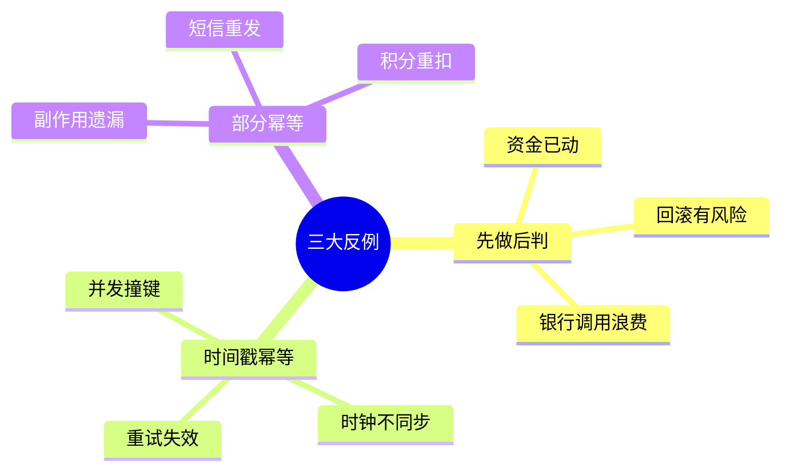

## 08.演进路线

### 08.1 V1 业务唯一约束

**特征**：业务起步、单体应用。

**做法**：
- 在关键表上加唯一索引
- 业务代码捕获 DuplicateKey
- 状态机控制流转

**适用阶段**：单体 / 小型微服务

### 08.2 V2 通用幂等中间件

**特征**：微服务规模化、需要标准化。

**做法**：
- 抽象幂等切面（注解 + AOP）
- 统一幂等表 / Redis 幂等键
- Token 防重组件
- 失败补偿机制

```kotlin
@Idempotent(key = "#req.requestId", expire = 24, unit = HOURS)
fun pay(req: PayRequest): PayResult { ... }
```

**适用阶段**：中大型微服务

### 08.3 V3 全链路幂等

**特征**：超大规模 / 多团队协同。

**做法**：
- 网关层注入 requestId 并透传
- 链路追踪整合
- 全链路幂等监控（重复率统计）
- 自动化补偿与对账

**适用阶段**：超大型分布式系统

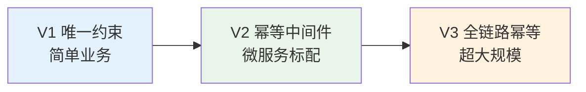

## 09.总结与决策

### 09.1 上线检查表

新增涉及"写"操作的接口前对照：

- [ ] 已识别幂等键（业务唯一标识）
- [ ] 幂等键由客户端生成（重试时不变）
- [ ] 选定幂等方案（唯一索引 / Token / 状态机 / 锁）
- [ ] 重复请求时返回明确语义（成功/已处理/拒绝）
- [ ] 副作用纳入幂等保护（短信、积分、消息）
- [ ] 幂等键有时效（不会无限期占用）
- [ ] DB 唯一约束作为最后一道防线
- [ ] 异常处理覆盖 DuplicateKey / 锁超时
- [ ] 客户端有按钮防抖（前端兜底）
- [ ] 监控覆盖（重复率、命中率）
- [ ] 测试覆盖（并发重发、超时重试场景）

### 09.2 选型决策树

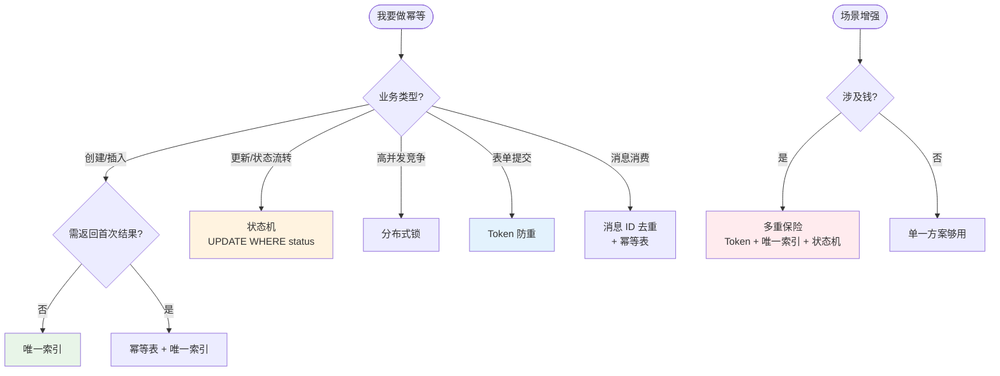

**最后一句话**：幂等是分布式系统的"防重保险丝"——开篇 3700 个用户被扣两次款只是因为支付接口少了一个 requestId 字段。

> 好的幂等设计 = **业务唯一标识、先判后做、时效清晰、副作用全包**。
