# 19.监控告警方案设计

> **本篇定位**：监控告警是分布式系统的"心电图"——出问题第一时间知道、知道是哪里出问题、知道严重不严重。本文从一次"用户先发现的 P0 故障"讲起，回答三个核心问题——**好的监控应该长什么样？业界四大维度怎么覆盖？怎么避免告警风暴和告警麻痹？**

#### 目录介绍
- [01.用户先于监控发现](#01用户先于监控发现)
  - [1.1 P0 来自微博](#11-p0-来自微博)
  - [1.2 故障扩散链路](#12-故障扩散链路)
  - [1.3 反思监控设计](#13-反思监控设计)
- [02.要解决的核心矛盾](#02要解决的核心矛盾)
  - [2.1 黑盒与白盒](#21-黑盒与白盒)
  - [2.2 全面与精准](#22-全面与精准)
  - [2.3 实时与开销](#23-实时与开销)
  - [2.4 监控的本质](#24-监控的本质)
- [03.业界主流方案](#03业界主流方案)
  - [03.1 监控四大维度](#031-监控四大维度)
  - [03.2 主流监控栈](#032-主流监控栈)
  - [03.3 横向对比矩阵](#033-横向对比矩阵)
- [04.设计核心原则](#04设计核心原则)
  - [04.1 分层监控原则](#041-分层监控原则)
  - [04.2 USE/RED 方法](#042-usered-方法)
  - [04.3 告警分级原则](#043-告警分级原则)
  - [04.4 可观测三件套](#044-可观测三件套)
- [05.方案落地实战](#05方案落地实战)
  - [05.1 整体架构](#051-整体架构)
  - [05.2 Metrics 体系](#052-metrics-体系)
  - [05.3 日志体系](#053-日志体系)
  - [05.4 链路追踪](#054-链路追踪)
  - [05.5 告警体系](#055-告警体系)
- [06.关键问题解决](#06关键问题解决)
  - [06.1 告警风暴问题](#061-告警风暴问题)
  - [06.2 告警麻痹问题](#062-告警麻痹问题)
  - [06.3 根因定位问题](#063-根因定位问题)
- [07.常见陷阱与反例](#07常见陷阱与反例)
  - [07.1 监控盲区反例](#071-监控盲区反例)
  - [07.2 告警刷屏反例](#072-告警刷屏反例)
  - [07.3 阈值僵化反例](#073-阈值僵化反例)
- [08.演进路线](#08演进路线)
  - [08.1 V1 基础监控](#081-v1-基础监控)
  - [08.2 V2 全栈可观测](#082-v2-全栈可观测)
  - [08.3 V3 智能运维](#083-v3-智能运维)
- [09.总结与决策](#09总结与决策)
  - [09.1 上线检查表](#091-上线检查表)
  - [09.2 选型决策树](#092-选型决策树)


## 01.用户先于监控发现

### 1.1 P0 来自微博

某互联网公司，**周日下午 14:30，CTO 在微博上看到用户吐槽"App 闪退"——这是公司第一次知道**。

```mermaid
gantt
    title 故障时间线
    dateFormat HH:mm
    axisFormat %H:%M
    
    section 真实故障
    某次发布触发崩溃 :a, 12:00, 60m
    崩溃率 3% → 18% :crit, b, 12:30, 120m
    
    section 用户感知
    微博吐槽涌现   :c, 13:00, 90m
    应用商店差评   :d, 13:30, 90m
    CTO 看到微博    :e, 14:30, 30m
    
    section 内部反应
    技术团队介入   :f, 14:35, 60m
    定位 + 回滚    :g, 14:50, 45m
    完全恢复       :h, 15:35, 0m
```

**复盘发现一个尴尬事实**：
- 公司有 Prometheus、有日志系统、有 APM
- **但没有任何告警在 12:00-14:30 之间触发**
- 监控体系做了 100 个 dashboard，但**没人盯**

### 1.2 故障扩散链路

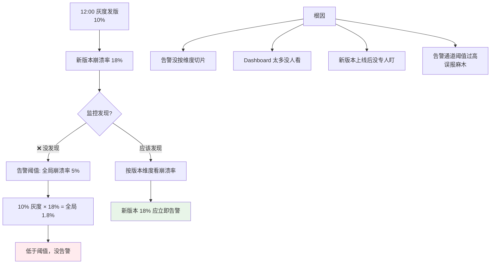

### 1.3 反思监控设计

事后这个团队总结了三个最深刻的教训：

1. **监控不只是"装上"，更要"用对"**——告警维度、阈值、值班机制都得到位
2. **告警要"按维度切片"**——按版本、地区、用户群分别看
3. **业务指标比技术指标更重要**——CPU/RT 正常但崩溃率涨了也是故障

> 这次故障揭示一个真相：**没人看的 Dashboard 等于没有，没人响应的告警也等于没有**。

## 02.要解决的核心矛盾

### 2.1 黑盒与白盒

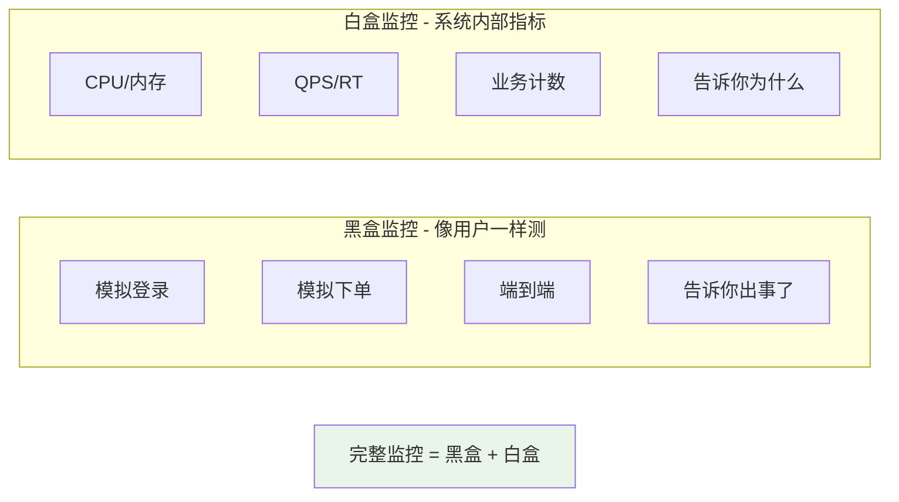

**实战**：**两者都要**——黑盒发现问题，白盒定位问题。

### 2.2 全面与精准

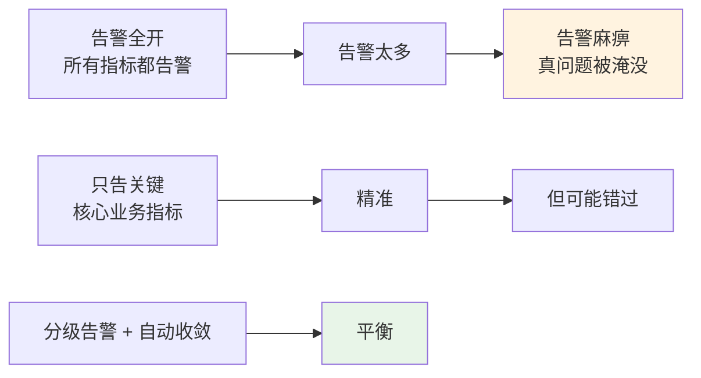

### 2.3 实时与开销

| 维度 | 收益 | 代价 |
|---|---|---|
| **每秒采集 + 实时计算** | 秒级发现 | 系统开销大 |
| **每分钟采集** | 分钟级发现 | 平衡 |
| **采样上报** | 节省成本 | 个别请求漏掉 |
| **全量上报** | 完整 | 海量存储 |

**实战**：**核心指标实时 + 全量，次要指标分钟 + 采样**。

### 2.4 监控的本质

> **监控 = 让你比用户先知道问题，并且知道问题在哪**

它的核心追求 = **MTTR（平均故障恢复时间）越短越好**：发现快、定位快、恢复快。

## 03.业界主流方案

### 03.1 监控四大维度

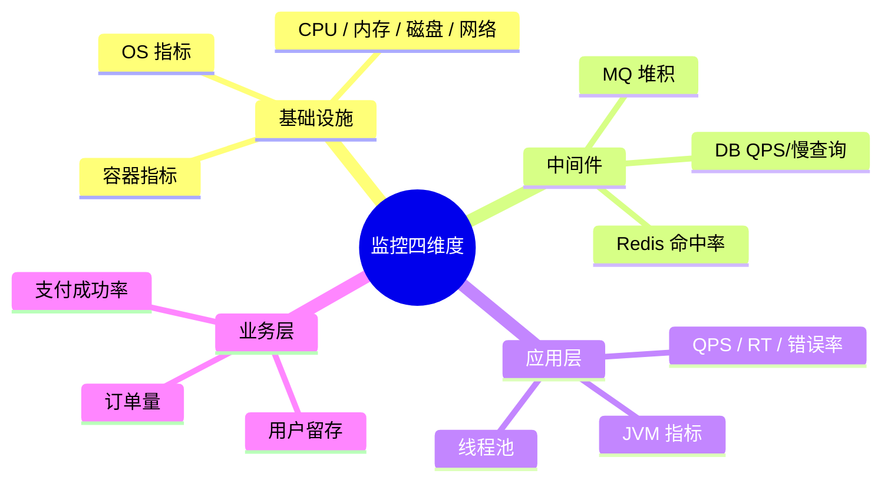

**经典口诀**：**金字塔从下往上覆盖**，**业务指标在最顶层但最重要**。

### 03.2 主流监控栈

| 类别 | 主流方案 |
|---|---|
| **Metrics** | Prometheus + Grafana / InfluxDB / OpenTSDB |
| **日志** | ELK（Elastic + Logstash + Kibana）/ Loki |
| **Tracing** | Jaeger / SkyWalking / Zipkin / Tempo |
| **APM** | Pinpoint / SkyWalking / NewRelic / DataDog |
| **告警** | Alertmanager / PagerDuty / OpsGenie |
| **大盘** | Grafana / Kibana |
| **国内云** | 阿里云 ARMS / 腾讯云 CAT / 华为云 AOM |

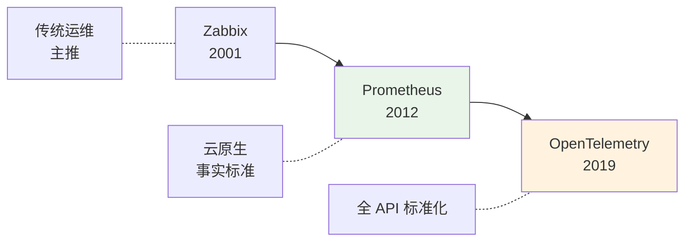

### 03.3 横向对比矩阵

| 维度 | Prometheus | InfluxDB | Zabbix |
|---|---|---|---|
| **采集模式** | Pull（拉） | Push（推） | Push |
| **数据模型** | 多维 label | TSDB | 简单 K-V |
| **查询语言** | PromQL（强大） | InfluxQL / Flux | 自定义 |
| **告警** | Alertmanager | Kapacitor | 自带 |
| **生态** | ⭐⭐⭐⭐⭐ | ⭐⭐⭐ | ⭐⭐⭐ |
| **K8s 友好** | ⭐⭐⭐⭐⭐ | ⭐⭐⭐ | ⭐⭐ |
| **典型用户** | 互联网 / K8s | IoT / 时序 | 传统运维 |

## 04.设计核心原则

### 04.1 分层监控原则

**好的监控按"分层金字塔"覆盖**：

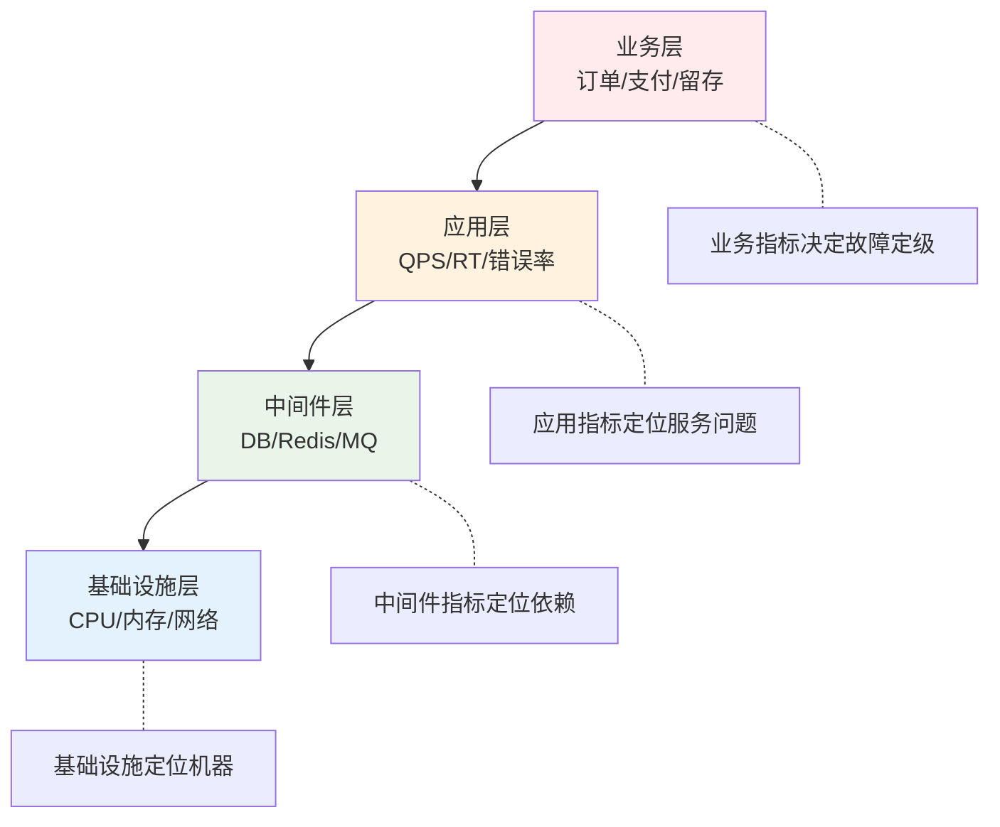

### 04.2 USE/RED 方法

**Google 提出的两个经典方法论**：

**USE 方法**（适合资源类）：
- **U**tilization：使用率（CPU 用了多少）
- **S**aturation：饱和度（请求队列长度）
- **E**rrors：错误数

**RED 方法**（适合服务类）：
- **R**ate：QPS
- **E**rror：错误率
- **D**uration：耗时分布（P50/P90/P99）

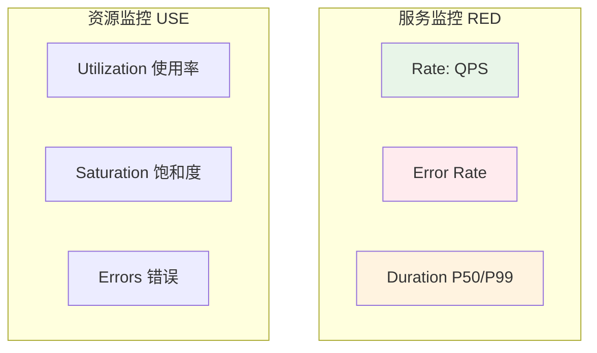

### 04.3 告警分级原则

**业界经典 4 级告警**：

| 级别 | 含义 | 响应时间 | 通道 |
|---|---|---|---|
| **P0** | 影响核心业务 | 5 分钟内 | 电话 + 短信 + IM |
| **P1** | 影响部分业务 | 30 分钟内 | 短信 + IM |
| **P2** | 性能下降 | 2 小时内 | IM |
| **P3** | 趋势异常 | 工作日处理 | 邮件 |

**告警通道选择心法**：
- **能用 IM 就别用短信**——避免麻痹
- **P0 一定要打电话**——保证 5 分钟内响应
- **下班/周末告警要错峰**——避免疲劳轰炸

### 04.4 可观测三件套

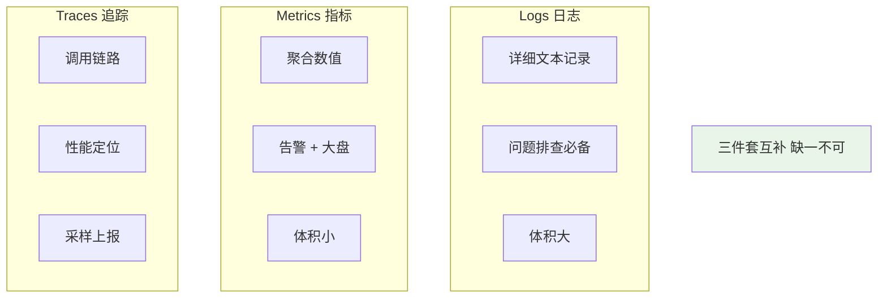

**互补关系**：
- **Metrics 告诉你"出事了"**
- **Traces 告诉你"在哪一步"**
- **Logs 告诉你"具体什么错"**

## 05.方案落地实战

### 05.1 整体架构

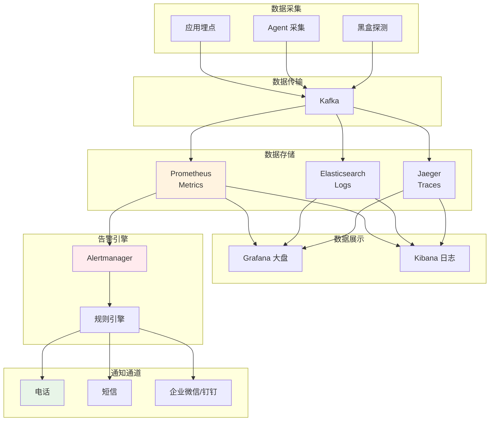

### 05.2 Metrics 体系

**关键指标分类**：

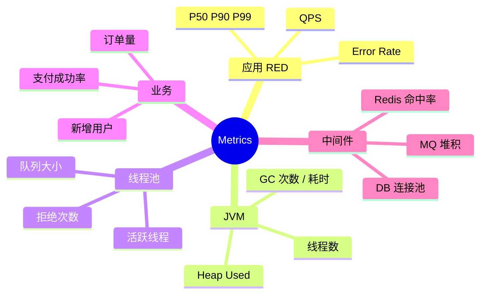

**Prometheus 数据模型示例**：

```promql
# 按服务和接口统计 QPS
rate(http_requests_total{service="order"}[1m])

# P99 延迟
histogram_quantile(0.99, 
    rate(http_duration_seconds_bucket{service="order"}[5m]))

# 错误率
sum(rate(http_requests_total{status=~"5.."}[5m])) 
/ sum(rate(http_requests_total[5m]))
```

### 05.3 日志体系

**日志的分级**：

| 级别 | 用途 | 例子 |
|---|---|---|
| **ERROR** | 异常错误 | 数据库连接失败、空指针 |
| **WARN** | 警告 | 慢查询、降级触发 |
| **INFO** | 关键流程 | 订单创建、支付成功 |
| **DEBUG** | 调试 | 本地开发用 |

**结构化日志**（JSON 格式）便于查询：

```json
{
    "time": "2024-01-01T12:00:00Z",
    "level": "ERROR",
    "service": "order-service",
    "trace_id": "abc123",
    "user_id": 12345,
    "order_id": "ORD001",
    "message": "stock not enough",
    "stock": 0,
    "request": 5
}
```

### 05.4 链路追踪

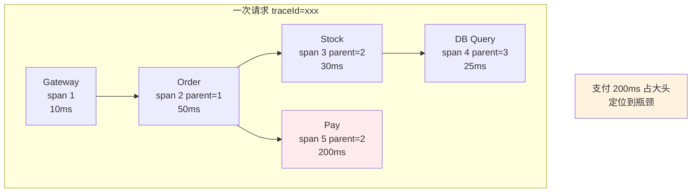

**核心字段**：
- `traceId`：全链路唯一
- `spanId`：每跳唯一
- `parentSpanId`：父跨度
- `tags`：附加属性（用户、错误码）

### 05.5 告警体系

**告警规则示例**：

```yaml
groups:
  - name: order-service
    rules:
      # P0: 错误率超 5%
      - alert: OrderErrorRateHigh
        expr: |
          sum(rate(http_requests_total{service="order",status=~"5.."}[5m]))
          / sum(rate(http_requests_total{service="order"}[5m])) > 0.05
        for: 2m
        labels:
          severity: P0
        annotations:
          summary: "订单错误率超 5%"
          runbook: "https://wiki/runbook/order-error"
      
      # P1: P99 超 1s
      - alert: OrderLatencyHigh
        expr: |
          histogram_quantile(0.99, 
            rate(http_duration_bucket{service="order"}[5m])) > 1
        for: 5m
        labels:
          severity: P1
```

**告警抑制 / 静默规则**：
- **抑制**：上游告警时屏蔽下游告警
- **静默**：维护期间静默告警
- **聚合**：同类告警合并发送

## 06.关键问题解决

### 06.1 告警风暴问题

**典型场景**：DB 挂了 → 100 个微服务都报警 → 短信疯狂炸 → 真正告警被淹没。

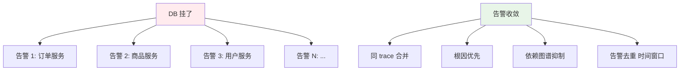

**解决方案**：
- **依赖关系抑制**：DB 告警触发时屏蔽所有"依赖 DB"的告警
- **告警聚合**：同类告警 5 分钟内只发一次
- **根因优先**：智能识别最底层的根因

### 06.2 告警麻痹问题

**反例**：每天 50+ 告警，70% 是误报 → 工程师麻木 → 真问题也被忽略。

**解决方案**：

| 措施 | 效果 |
|---|---|
| **定期复盘告警**（每周） | 删掉无效告警 |
| **告警分级 + 通道分级** | P3 别用电话 |
| **告警自愈** | 自动重启等不再人工 |
| **告警值守轮班** | 固定专人响应 |

### 06.3 根因定位问题

**理想流程**：

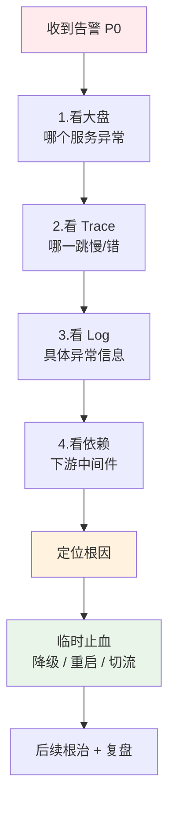

## 07.常见陷阱与反例

### 07.1 监控盲区反例

**反例**：开篇那个"全局阈值"导致灰度问题没发现。

**教训**：
- **关键指标必须按维度切片**（版本、地区、运营商、用户群）
- **新发布要专门看新版本指标**
- **业务指标和技术指标都要监控**

### 07.2 告警刷屏反例

**反例**：某团队所有告警都发到一个钉钉群，**一天 800 条告警**——所有人都关了通知。

**教训**：
- **告警必须分级、分通道**
- **告警频次合理（同类 5 分钟一次）**
- **定期清理无效告警**

### 07.3 阈值僵化反例

**反例**：CPU > 80% 告警 —— 但**周末本来就低，工作日中午就是 85%**，结果**工作日中午天天告警**。

**教训**：
- **阈值要分时段（业务高峰期 vs 低峰期）**
- **用同比/环比代替绝对值**（"比昨天同时段涨了 50%"）
- **更进一步**：用机器学习自动学习正常范围

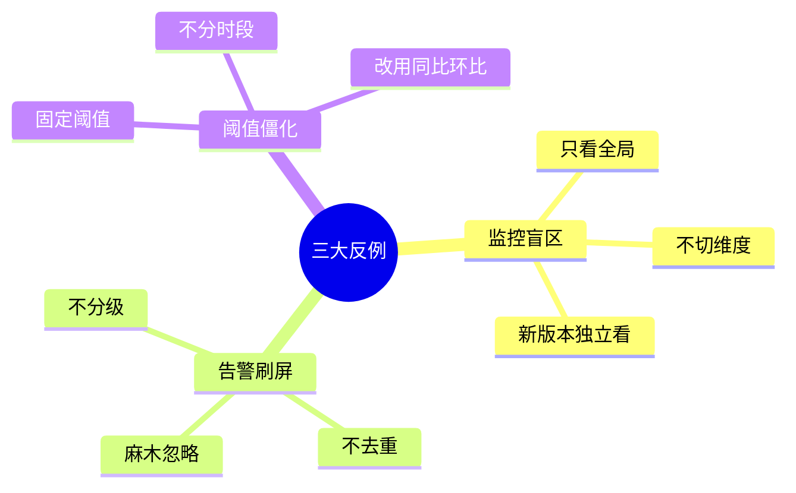

## 08.演进路线

### 08.1 V1 基础监控

**特征**：业务起步、< 50 个指标。

**做法**：
- Prometheus + Grafana 基础栈
- 关键指标告警（CPU/内存/QPS/Error）
- 告警钉钉/邮件即可

**适用阶段**：< 100 服务

### 08.2 V2 全栈可观测

**特征**：微服务规模化。

**做法**：
- Metrics + Logs + Traces 三件套齐备
- 业务监控接入（订单量、支付成功率）
- 告警分级 + 多通道
- 大盘按业务划分

**适用阶段**：100-1000 服务

### 08.3 V3 智能运维

**特征**：超大规模 / 7×24 业务。

**做法**：
- 异常检测（基于 ML）
- 自动告警收敛
- 自愈系统（自动重启/切流）
- 故障预测

**适用阶段**：超大型互联网公司

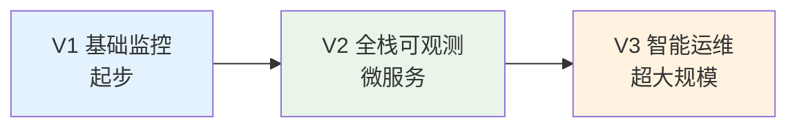

## 09.总结与决策

### 09.1 上线检查表

新服务上线 / 新增监控前对照：

- [ ] RED 三件套就位（QPS/Error/Duration）
- [ ] USE 三件套就位（资源类）
- [ ] 业务指标接入（订单/支付/留存）
- [ ] 关键指标按维度切片（版本/地区/用户群）
- [ ] Logs 结构化（JSON / 含 traceId）
- [ ] Traces 接入并采样
- [ ] 告警分级（P0/P1/P2/P3）
- [ ] 告警通道分级（电话/IM/邮件）
- [ ] 告警有 Runbook（处置手册链接）
- [ ] 告警有去重 / 抑制规则
- [ ] 大盘按业务划分（一图盖一域）
- [ ] 值班机制建立
- [ ] 故障演练 + 告警演练
- [ ] 定期复盘清理无效告警

### 09.2 选型决策树

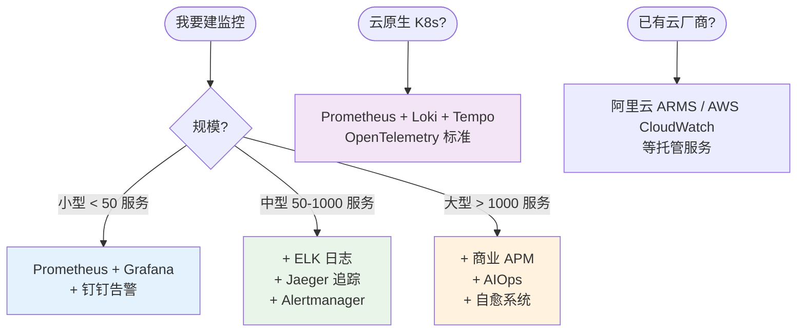

**最后一句话**：监控告警是分布式系统的"心电图"——开篇那家公司花了大钱建监控却用户先发现问题，问题不在工具而在"用法"。

> 好的监控告警 = **覆盖完整、分级精准、响应迅速、根因清晰**。
