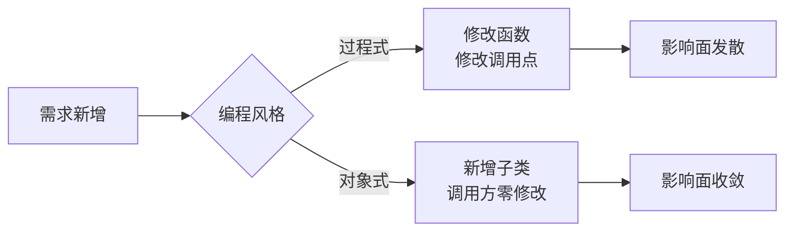
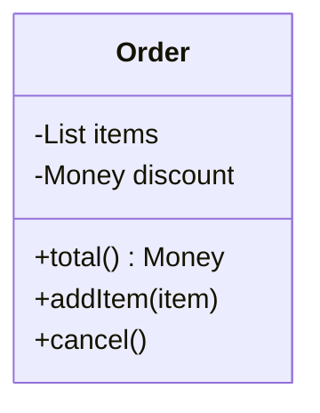
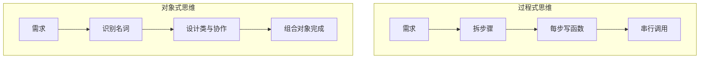
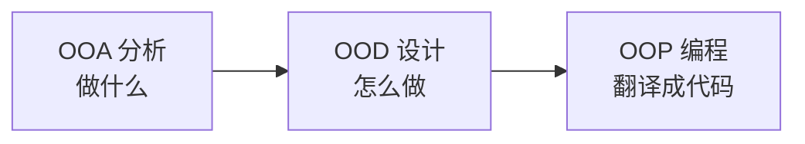
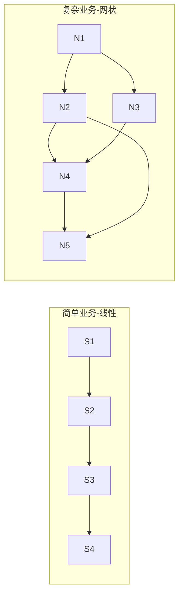

# 01.面向对象设计思想

#### 目录介绍
- [01.从一个案例切入](#01从一个案例切入)
  - [1.1 订单需求](#11-订单需求)
  - [1.2 过程式实现](#12-过程式实现)
  - [1.3 痛点暴露](#13-痛点暴露)
  - [1.4 对象式重构](#14-对象式重构)
  - [1.5 两种风格对比](#15-两种风格对比)
- [02.对象到底是什么](#02对象到底是什么)
  - [2.1 现实的映射](#21-现实的映射)
  - [2.2 数据加行为](#22-数据加行为)
  - [2.3 类是模板](#23-类是模板)
- [03.从过程到对象](#03从过程到对象)
  - [3.1 过程式范式](#31-过程式范式)
  - [3.2 演化的动力](#32-演化的动力)
  - [3.3 对象式范式](#33-对象式范式)
  - [3.4 思维差异](#34-思维差异)
- [04.OOP 三阶段](#04oop-三阶段)
  - [4.1 OOA 分析](#41-ooa-分析)
  - [4.2 OOD 设计](#42-ood-设计)
  - [4.3 OOP 编程](#43-oop-编程)
  - [4.4 UML 工具](#44-uml-工具)
- [05.两种范式取舍](#05两种范式取舍)
  - [5.1 复杂度阈值](#51-复杂度阈值)
  - [5.2 网状 vs 线性](#52-网状-vs-线性)
  - [5.3 伪 OOP 风险](#53-伪-oop-风险)
- [06.总结与下一步](#06总结与下一步)

---

## 01.从一个案例切入

### 1.1 看订单需求

设想电商平台一个朴素需求：**给定一个订单，计算实付金额（含商品总价、折扣、运费、税费）并打印**。

刚接到这个需求时，几乎所有人脑海里浮现的第一版伪代码都是相似的：取出商品列表 → 把单价乘以数量加起来 → 减去折扣 → 加上运费 → 加上税。它如此自然，以致我们很容易低估它在工程上的演化复杂度。

但需求看似简单，工程中却会被叠加：会员折扣、优惠券、跨境税费、海运/空运运费、不同地区税率、跨币种结算、活动期叠加规则……更糟的是，这些规则不是一次性写进文档的，而是**一年内每一两周就有人提出新的"小调整"**。这些"小调整"中的每一项，都会落到一段被无数下游函数共享的代码里。

我们用这个订单案例贯穿全篇，对比两种范式在面对**"持续叠加的复杂度"**时表现有何不同。看到第 5 篇你会发现，几乎所有面向对象设计原则要解决的，都是这同一类问题——只是抽象层级不同而已。

### 1.2 过程式实现

最直观的写法：函数 + 数据。

```java
public class OrderProcedural {
    public static void main(String[] args) {
        double[] prices = {100.0, 200.0, 50.0};
        int[] counts = {1, 2, 3};
        double discount = 0.9;
        double shipFee = 20.0;
        double taxRate = 0.06;

        double subtotal = calcSubtotal(prices, counts);
        double afterDisc = subtotal * discount;
        double total = afterDisc + shipFee + afterDisc * taxRate;

        System.out.println("应付：" + total);
    }

    static double calcSubtotal(double[] p, int[] c) {
        double s = 0;
        for (int i = 0; i < p.length; i++) s += p[i] * c[i];
        return s;
    }
}
```

数据是裸数组，行为是静态函数，二者各自漂浮、靠参数串起来。

这种写法在脚本工具或者算法题里完全没问题，甚至效率高、易理解。但它隐含了一个致命假设：**所有调用方都"懂规矩"**——知道 `prices` 和 `counts` 必须等长、知道 `discount` 是乘数而非百分数、知道 `taxRate` 不能为负。一旦项目成员超过 3 人，这种"心照不宣"的规矩就会被一次次破坏。

### 1.3 痛点暴露

把需求滚动一轮：
- 加一种折扣策略 → 改 `main` 的拼装顺序；
- 同一个订单要既导出 PDF 又发短信 → 又得新增两组函数；
- 多人协作时，数组下标含义全靠注释维护，调用方写错下标 → 静默 bug。

这些问题都不是单一的"代码风格不好看"，而是会让线上事故率随代码规模呈指数增长的真实风险。在百万行规模的工程里，过程式代码每多一个全局函数，就多一份"潜在被调错"的可能。

**根因**：数据和行为没有边界，复杂度随需求线性扩散到调用点。换言之，**复杂度并没有消失，只是被你"摊到了未来每一个调用方头上"**——这正是面向对象设计要修复的根本问题。

### 1.4 对象式重构

把"订单"当作一等公民：

```java
class Order {
    private List<Item> items;
    private DiscountPolicy discount;   // 多态扩展点
    private ShippingPolicy shipping;
    private TaxPolicy tax;

    public Order(List<Item> items,
                 DiscountPolicy d, ShippingPolicy s, TaxPolicy t) {
        this.items = items; this.discount = d; this.shipping = s; this.tax = t;
    }

    public Money total() {
        Money sub = items.stream().map(Item::amount)
                                  .reduce(Money.ZERO, Money::add);
        Money afterDisc = discount.apply(sub);
        return afterDisc.add(shipping.fee(this))
                        .add(tax.of(afterDisc));
    }
}
```

调用方只关心 `order.total()`，**新增折扣只需新加一个 `DiscountPolicy` 实现**，不改 `Order`、不改调用点。

请仔细体会这句话——它是面向对象与面向过程在"扩展成本"上的根本差距。在过程式版本里，新增一种折扣策略意味着 `main` 函数里的拼装顺序、参数清单、判断分支都要随之调整；而在对象版本里，这种新增几乎是"加法式的"：新增一个文件、新增一个类、注入到容器里，已有代码完全不需要触碰。

更深一层看，`Order` 不再是一个被动的"数据袋子"，而成了一个**主动的业务概念**——它知道自己由哪些商品构成、知道自己应当套用什么折扣、知道自己最终的总价应当怎么算。调用方的代码因而变成了"声明式"：**告诉对象做什么，不告诉它怎么做**。这是面向对象与面向过程在"心智模型"上的根本分歧。

### 1.5 两种风格对比

| 维度 | 过程式 | 对象式 |
|------|--------|--------|
| 组织单元 | 函数 + 全局数据 | 类（数据+行为） |
| 扩展方式 | 改函数/加分支 | 加新类，旧码不动 |
| 复杂度承载 | 全部压在调用点 | 切片到各类内部 |
| 协作友好度 | 靠纪律 | 靠类型与边界 |



---

## 02.对象到底是什么

### 2.1 现实的映射

OOP（Object Oriented Programming）的核心隐喻是 **"用对象模拟现实世界"**。

> 一辆车、一张订单、一次远程连接，都可以是对象；对象之间的关系（聚合、依赖、组合）就是现实关系的映射。

这种映射不是装饰，而是**降低认知负担**：人脑天然擅长以名词+动词理解世界，过程式则强迫你切换到"步骤序列"的思维。

在产品经理嘴里说出来的需求，几乎从来不是"先做 A，再做 B，最后做 C"——而是"用户应该能下单、订单可以取消、商家可以发货"。需求天然以"实体 + 行为"的方式存在，而面向对象的代码只是把这种自然语言"低损"地翻译进了程序。这种"贴近需求语言"的特性，让代码在长期演化中更容易被理解和修改——你不需要先在脑海里把"步骤"反推回"业务概念"，再去做改动。

### 2.2 数据加行为

对象 = **属性**（数据/状态）+ **方法**（行为/能力）。



属性是"它是什么"，方法是"它能做什么"。**两者绑定**是对象式与过程式最根本的区别。

在过程式编程里，数据是"被加工的原料"，函数是"加工车间"，二者通过参数链接。这种"分离"在小规模代码里很轻巧，但当业务规则越来越多时，数据走到哪里，规则就要在哪里被重新校验一次——校验逻辑因此散落在系统各处，没人能保证它们彼此一致。而对象把数据与守护它的行为锁在同一个边界里，**规则只写一次，永远不会被绕过**。这就是后面要讲的"封装"特性的真正价值。

### 2.3 类是模板

类（class）是对象的蓝图，对象（object）是类的实例。

```
Class:  Order （定义结构与行为）
          ↓ new
Object: order1, order2, order3 …（带具体状态）
```

类是编译期的概念，对象是运行期的实体；类描述"形状"，对象拥有"内容"。

---

## 03.从过程到对象

### 3.1 过程式范式

把"大象装冰箱"作为典型样本：

1. 打开冰箱
2. 放入大象
3. 关上冰箱

每一步都是参与者要亲自完成的动作——**面向过程**就是这种"我是执行者"的视角。它在小脚本、单一线性流程里高效、直观。

### 3.2 演化的动力

需求一旦从"装一头大象"变成"装多种动物、多种容器、还要校验空间"，过程式就不堪重负：

- 步骤会爆炸 → 函数列表越来越长；
- 数据散落 → 每个函数都要传一堆参数；
- 复用困难 → 每个新场景重写一遍流程。

工程界对此的回应就是：**把"高内聚的步骤+数据"打包成一个类**。

### 3.3 对象式范式

```
冰箱.open()
冰箱.put(大象)
冰箱.close()
```

调用者从"亲自做每一步"转变为"指挥对象做事"，角色从**执行者** → **指挥者**。

### 3.4 思维差异



**过程式问"怎么做"，对象式问"谁来做"**。问法不同，复杂度的归宿就不同。

---

## 04.OOP 三阶段

软件开发中三个连贯阶段：



### 4.1 OOA 分析

**搞清楚做什么**。从需求中识别名词（候选类）、动词（候选方法）、关系（候选关联），输出领域模型草图。

### 4.2 OOD 设计

**搞清楚怎么做**。把候选类细化为：哪些类、各自属性方法、类之间是聚合/继承/依赖、接口边界在哪。这一阶段直接决定后续编码的难易。

### 4.3 OOP 编程

把 OOD 的产物翻译为具体语言代码。这是最易被简化甚至被跳过的一步，但**OOA/OOD 做得好，OOP 才会顺畅**。

### 4.4 UML 工具

UML（Unified Modeling Language）是 OOA/OOD 的可视化沟通工具：

| 图类 | 用途 |
|------|------|
| 类图 | 静态结构（类/属性/方法/关系） |
| 时序图 | 动态调用顺序 |
| 用例图 | 用户角度的功能边界 |
| 状态图 | 单对象的状态机 |

不必苛求全部掌握，**会画类图与时序图即可应付 90% 设计沟通**。

---

## 05.两种范式取舍

### 5.1 复杂度阈值

简单脚本（百行以内、单一线程、一次性使用）选过程式；可演进系统（多模块、多人协作、长期维护）选对象式。**复杂度是范式选择的唯一硬指标**。

### 5.2 网状 vs 线性



线性流程，过程式贴合；网状协作，对象式才能把局部复杂度封住。

### 5.3 伪 OOP 风险

最常见的误区：**用面向对象语言写面向过程代码**——比如全是 `static` 工具类、几百行的"上帝类"、一切公开字段。

判断标准很简单：把字段全设 public 之后，**程序行为是否依然正确？** 如果是，说明类没承担任何不变量保护，等于过程式包了一层壳。

---

## 06.总结与下一步

本文用"订单总价"这一案例切入，对比两种范式在复杂度增长下的命运分叉，揭示对象的本质是**数据与行为的绑定**，并梳理 OOA/OOD/OOP 三阶段。

但**只懂"什么是对象"还不够**，要写出真正的对象式代码，必须掌握四大特性：

- **封装**——不变量的守卫
- **抽象**——隐藏实现复杂度
- **继承**——复用与类型层级
- **多态**——统一接口处理一族类型

下一篇 [02.面向对象的特性](./02.面向对象的特性.md) 将继续以订单/钱包为案例，逐一拆解四大特性的原理、底层实现与工程取舍。
