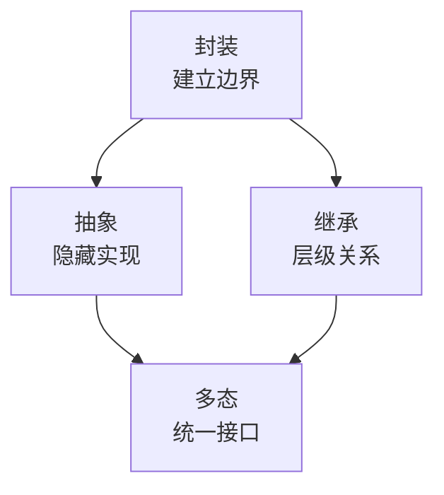
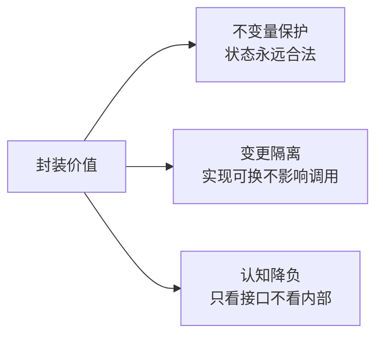
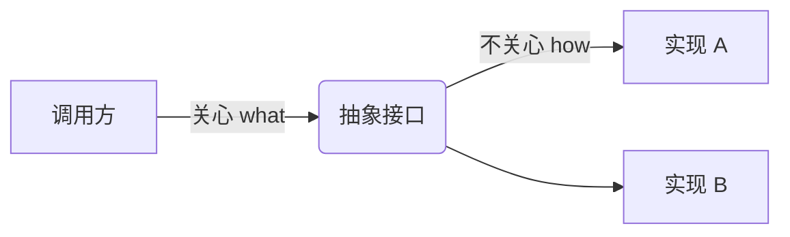
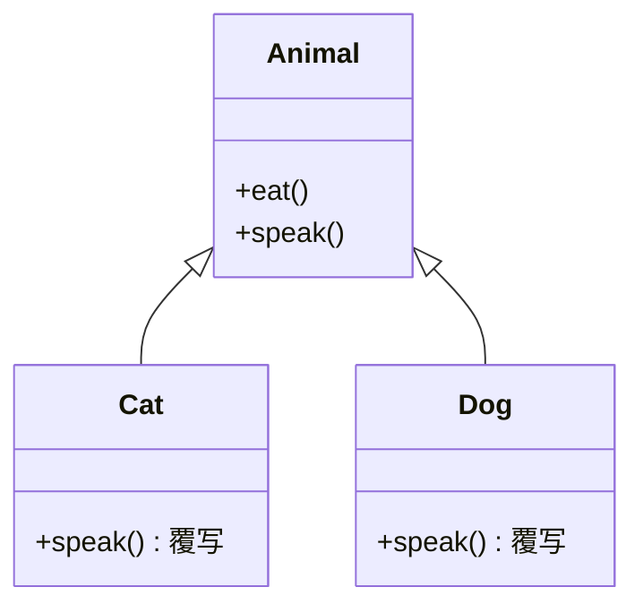
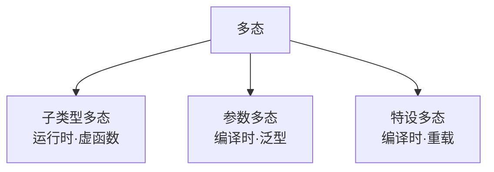

# 02.面向对象的特性

#### 目录介绍
- [01.从一个 Bug 说起](#01从一个-bug-说起)
  - [1.1 钱包翻车现场](#11-钱包翻车现场)
  - [1.2 Bug 的根因](#12-bug-的根因)
  - [1.3 四大特性登场](#13-四大特性登场)
- [02.特性全景图](#02特性全景图)
  - [2.1 四大特性关系](#21-四大特性关系)
  - [2.2 三大还是四大](#22-三大还是四大)
- [03.封装特性](#03封装特性)
  - [3.1 封装的动机](#31-封装的动机)
  - [3.2 钱包封装版](#32-钱包封装版)
  - [3.3 不变量守卫](#33-不变量守卫)
  - [3.4 封装的层次](#34-封装的层次)
  - [3.5 实现原理](#35-实现原理)
  - [3.6 好坏封装对比](#36-好坏封装对比)
- [04.抽象特性](#04抽象特性)
  - [4.1 抽象的动机](#41-抽象的动机)
  - [4.2 接口与抽象类](#42-接口与抽象类)
  - [4.3 抽象的层级](#43-抽象的层级)
  - [4.4 命名即抽象](#44-命名即抽象)
- [05.继承特性](#05继承特性)
  - [5.1 继承的动机](#51-继承的动机)
  - [5.2 类型层级](#52-类型层级)
  - [5.3 实现原理](#53-实现原理)
  - [5.4 继承的代价](#54-继承的代价)
- [06.多态特性](#06多态特性)
  - [6.1 多态的动机](#61-多态的动机)
  - [6.2 三种形态](#62-三种形态)
  - [6.3 实现原理](#63-实现原理)
  - [6.4 多态的代价](#64-多态的代价)
- [07.特性总结与延展](#07特性总结与延展)

---

## 01.从一个 Bug 说起

### 1.1 钱包翻车现场

接续上一篇的电商系统。线上突然出现"用户余额变了，但 `balanceLastModifiedTime` 还是上周的时间"。排查代码：

```java
public class Wallet {
    public BigDecimal balance;
    public long balanceLastModifiedTime;
}

// 某处业务代码
wallet.balance = wallet.balance.add(amount);  // 偷偷加了钱
// 忘了更新 balanceLastModifiedTime
```

这种"忘记同步"在百万行代码库里几乎无法靠纪律堵住。

### 1.2 Bug 的根因

字段 public、行为外置 → **不变量（balance 与时间必须同步变更）的守卫被分散到了 N 个调用点**，任何一处疏忽都会全局污染。

### 1.3 四大特性登场

OOP 的四大特性，每一个都直接对应一类**复杂度治理**问题：

| 特性 | 对治的问题 |
|------|------------|
| 封装 | 数据被任意修改 |
| 抽象 | 实现细节泄漏到调用方 |
| 继承 | 重复代码与类型层级 |
| 多态 | 调用方写满 if-else |

---

## 02.特性全景图

### 2.1 四大特性关系



**封装是地基**：没有边界，其余三者无从谈起；
**抽象是骨架**：定义"做什么"；
**继承+多态是肌肉**：让骨架在不同形态下复用与变形。

### 2.2 三大还是四大

业内常争论"抽象"是否独立——因为抽象不依赖特殊语法，函数本身就是一种抽象。**记住一句话即可**：四大特性争的是分类法，工程价值在于解决了什么问题，名字只是标签。

---

## 03.封装特性

### 3.1 封装的动机

**根本目的：管理复杂度**。人脑同时处理信息约 7±2 单元，百万行系统若全暴露，没人能理解。

封装的本质是把复杂度藏起来，**只留必要的操作面板**。

```
没有封装的车：油门控制喷油量、变速箱档位、ABS 频率…… → 没人能开
有封装的车：方向盘 + 油门 + 刹车 + 挡位 → 人人能开
```

### 3.2 钱包封装版

```java
public class Wallet {
    private final String id;
    private final long createTime;
    private BigDecimal balance;
    private long balanceLastModifiedTime;

    public Wallet() {
        this.id = IdGenerator.gen();
        this.createTime = System.currentTimeMillis();
        this.balance = BigDecimal.ZERO;
        this.balanceLastModifiedTime = this.createTime;
    }

    public BigDecimal getBalance() { return balance; }

    public void increase(BigDecimal amount) {
        if (amount.compareTo(BigDecimal.ZERO) <= 0)
            throw new InvalidAmountException("金额必须 > 0");
        this.balance = this.balance.add(amount);
        this.balanceLastModifiedTime = System.currentTimeMillis();  // ← 同步更新
    }

    public void decrease(BigDecimal amount) {
        if (amount.compareTo(BigDecimal.ZERO) <= 0)
            throw new InvalidAmountException("金额必须 > 0");
        if (amount.compareTo(this.balance) > 0)
            throw new InsufficientAmountException("余额不足");
        this.balance = this.balance.subtract(amount);
        this.balanceLastModifiedTime = System.currentTimeMillis();
    }
}
```

字段 `private` + 关键约束写在方法内部 → **不变量被强制守卫**，调用方再也无法绕过。

### 3.3 不变量守卫

封装解决的核心问题有三类：



### 3.4 封装的层次

封装不仅在类一级：

```
系统层：微服务以 API 交互
模块层：Java module / Go package
类  层：private 字段 + public 方法
函数层：局部变量对外不可见
```

四个层次原理一致：**隐藏实现，暴露接口，降低耦合**。

### 3.5 实现原理

不同语言的封装机制差异巨大：

| 语言 | 机制 | 强度 |
|------|------|------|
| C++ | 编译期访问检查 + 名称查找 | 编译期君子协定 |
| Java | 字节码 access_flags，JVM 持续校验 | 编译期+运行时 |
| JavaScript | 闭包 / `#` 私有字段（Symbol 隔离） | 引擎级隔离 |
| Go | 包级（首字母大小写） | 编译期 |
| Python | 约定（`_`/`__`） | 不强制 |

**关键洞察**：C++ 的 `private` 在二进制里没有任何痕迹，靠 `reinterpret_cast` 可以"破"；Java 的 `private` 写在字节码里，反射能"破"，但模块系统能进一步堵死；JS 的闭包是真正不可达的——三种封装强度递进。

### 3.6 好坏封装对比

```java
// ✗ 坏封装：getter/setter 满天飞，等于没封装
class Bad {
    private int x;
    public int getX() { return x; }
    public void setX(int x) { this.x = x; }
}

// ✓ 好封装：方法背后有规则
class Good {
    private List<Item> items;
    private Money totalPrice = Money.ZERO;
    public void addItem(Item item) {
        if (items.size() >= MAX) throw new CapacityException();
        items.add(item);
        totalPrice = totalPrice.add(item.amount());   // 派生状态同步
        notifyObservers();                            // 副作用触发
    }
}
```

封装的灵魂不是"加 private"，而是**让方法承担"必须如此"的业务约束**。

---

## 04.抽象特性

### 4.1 抽象的动机

封装藏数据，**抽象藏实现**——调用者只需知道"能做什么"，无需知道"怎么做"。



### 4.2 接口与抽象类

```java
public interface PictureStorage {
    void save(Picture p);
    Picture get(String id);
}

public class OssStorage implements PictureStorage { /* … */ }
public class S3Storage  implements PictureStorage { /* … */ }
```

调用方只面向 `PictureStorage`，**底层换 OSS 还是 S3，调用方零感知**。

注意：抽象不必依赖 `interface`/`abstract` 语法。函数本身就是抽象——`malloc(size)` 没人去看它的伙伴算法。

### 4.3 抽象的层级

抽象有不同层级：

```
高层抽象：业务概念（Order、Payment）
中层抽象：服务接口（PaymentGateway）
低层抽象：函数（calcTax(amount)）
```

越靠上越稳定，越靠下越易变。设计原则之一：**让稳定的东西被依赖，让易变的东西被替换**——这就是后两篇的主题。

### 4.4 命名即抽象

`getAliyunPictureUrl()` 与 `getPictureUrl()` 的差别：前者把"阿里云"这一实现细节焊死到了名字里。一旦换私有云，名字就要改，连锁影响调用点。

**好命名只描述能力，不暴露策略**——这是抽象思维最日常的体现。

---

## 05.继承特性

### 5.1 继承的动机

人类天然以**分类与层级**理解世界：

```
生物 → 动物 → 哺乳动物 → 猫科 → 猫
                              → 虎
                       → 犬科 → 狗
```

继承把这种"分类思维"引入代码：每层继承上层特征 + 增加自己的特化。

### 5.2 类型层级

继承构造的是**子类型关系**：

```
所有猫的集合 ⊂ 所有动物的集合
→ 任何"动物"位置放一只"猫"都合法
```

这就是**里氏替换原则（LSP）** 的数学本质：子类可以替换父类，不破坏程序正确性。



### 5.3 实现原理

C++/Java 的继承落到底层就是**虚函数表（vtable）**：

```
Cat 对象:
┌─────────┐
│ vptr ───────→ Cat_vtable: [Cat::speak, Animal::eat]
├─────────┤
│ age     │
└─────────┘

Animal* a = new Cat();
a->speak();  // 编译为：查 vptr → 查表 → 间接调用 → 找到 Cat::speak
```

子类对象前半段与父类布局一致 → 父类指针可以安全指向子类对象。**这就是多态的物理基础**。

### 5.4 继承的代价

继承也是双刃剑：

| 代价 | 说明 |
|------|------|
| 强耦合 | 父类改动影响所有子类 |
| 层级爆炸 | 深继承难读、难调 |
| 破坏封装 | 子类依赖父类内部实现 |
| 静态绑定 | 编译期确定，运行时不可换 |

> 这正是后续第 5 篇 **"多用组合少用继承"** 要破的题。

---

## 06.多态特性

### 6.1 多态的动机

没有多态时，调用方必须知道每种具体类型：

```java
void pay(Object obj) {
    if (obj instanceof Alipay)  ((Alipay) obj).pay();
    else if (obj instanceof Wechat) ((Wechat) obj).pay();
    else if (obj instanceof CreditCard) ((CreditCard) obj).pay();
    // 每加一种支付方式，这里都得改 ← 灾难
}
```

多态后：

```java
void pay(Payment p) { p.pay(); }   // 永远不用改
```

**多态消除条件分支**——把"类型判断"从代码里彻底拿掉。

### 6.2 三种形态



| 形态 | 例子 | 时机 |
|------|------|------|
| 子类型多态 | `Animal a = new Cat(); a.speak();` | 运行时 |
| 参数多态 | `List<T>`、C++ 模板 | 编译时 |
| 特设多态 | 函数重载、运算符重载 | 编译时 |

### 6.3 实现原理

子类型多态依赖**延迟绑定**——把"调哪个函数"推到运行时：

```
早绑定: call 0x401000   ← 编译期写死
晚绑定: call [vptr+0]   ← 运行时查表
```

JIT/V8 还能进一步优化：**内联缓存（Inline Cache）** 把"高频路径"的虚调用降到接近直接调用的开销。

### 6.4 多态的代价

| 代价 | C++ | Java | JS |
|------|-----|------|-----|
| 内存 | 每对象多 8B vptr | 对象头自带类型 | 隐藏类自带原型 |
| 调用 | 2 次内存间接寻址 | 类似，可 JIT 内联 | 首次慢，IC 后接近直调 |
| 分支预测 | 不友好 | JIT 反馈优化 | IC 可预测 |

**没有银弹**：多态用一次次间接跳转换来了扩展性；当性能极致敏感（紧内层循环、SIMD 段），刻意去多态也是合理工程选择。

---

## 07.特性总结与延展

| 特性 | 核心问题 | 关键机制 |
|------|----------|----------|
| 封装 | 不变量守卫 | 访问控制 + 业务方法 |
| 抽象 | 隐藏实现 | 接口/抽象类/函数 |
| 继承 | 类型层级与复用 | vtable/原型链 |
| 多态 | 消除条件分支 | 延迟绑定 |

四大特性是**面向对象的语法层基础**，但只懂特性还不够。真正的工程难题是：

- **何时用接口、何时用抽象类？** → [03.接口vs抽象类比较](./03.接口vs抽象类比较.md)
- **如何让代码不锁死在某个实现上？** → [04.接口而非实现编程](./04.接口而非实现编程.md)
- **继承怎么用才不翻车？** → [05.多用组合和少继承](./05.多用组合和少继承.md)

下一篇就从**抽象类与接口的取舍**说起。
