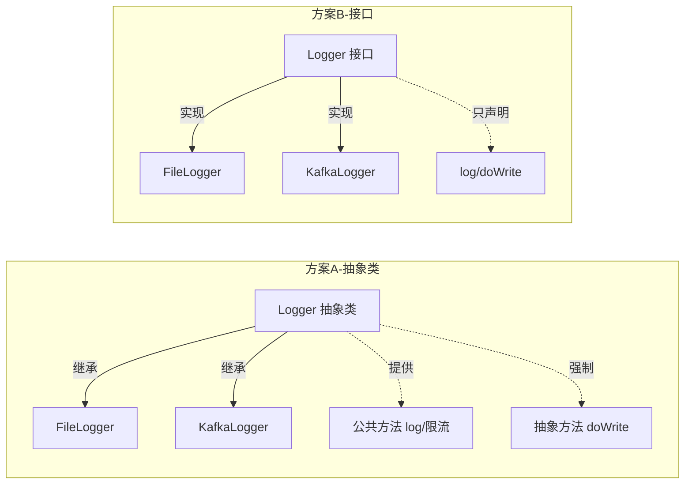
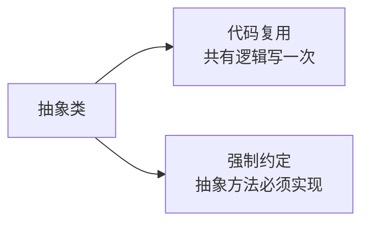
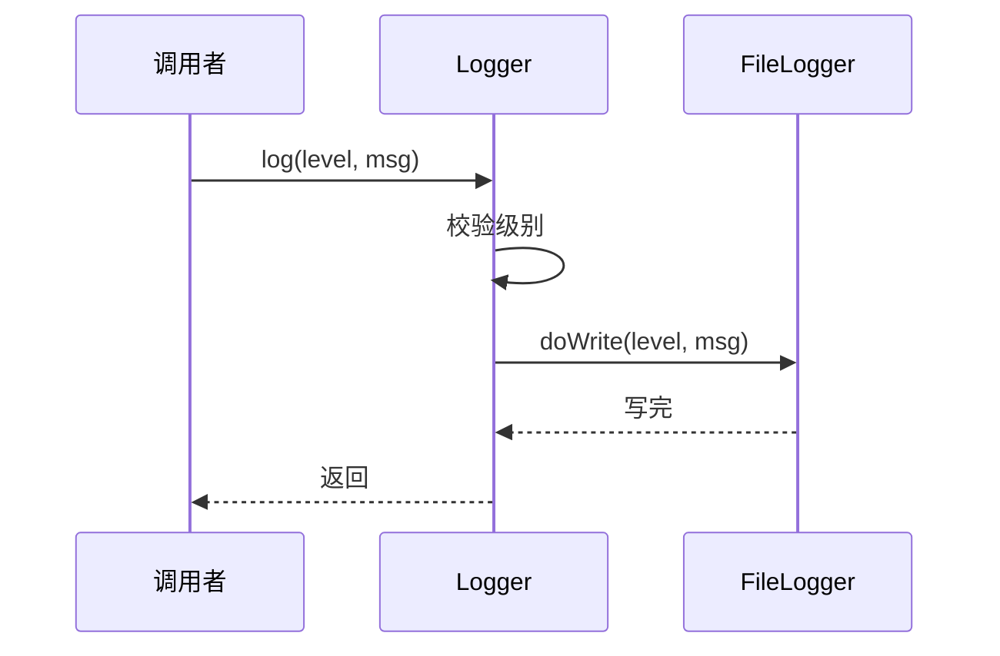
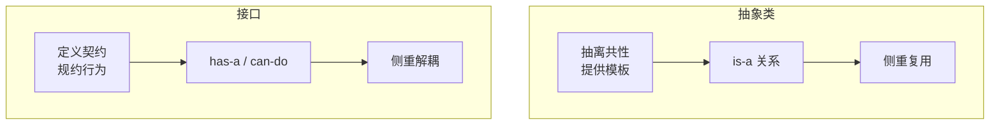
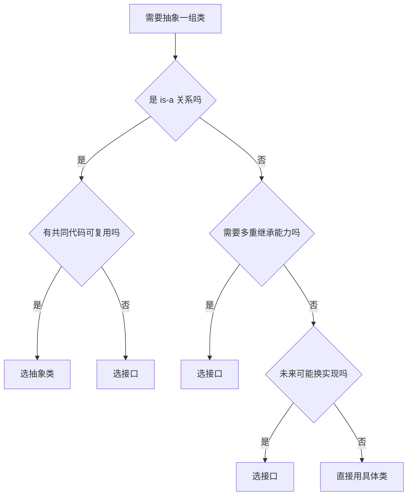

# 03.接口vs抽象类比较

#### 目录介绍
- [01.从一个困惑切入](#01从一个困惑切入)
  - [1.1 日志器的烦恼](#11-日志器的烦恼)
  - [1.2 两种方案对比](#12-两种方案对比)
  - [1.3 抽象的本质](#13-抽象的本质)
- [02.抽象类详解](#02抽象类详解)
  - [2.1 语法定义](#21-语法定义)
  - [2.2 三大特点](#22-三大特点)
  - [2.3 解决的问题](#23-解决的问题)
  - [2.4 模板模式](#24-模板模式)
  - [2.5 模拟实现](#25-模拟实现)
- [03.接口详解](#03接口详解)
  - [3.1 语法定义](#31-语法定义)
  - [3.2 三大特点](#32-三大特点)
  - [3.3 解决的问题](#33-解决的问题)
  - [3.4 标记接口](#34-标记接口)
  - [3.5 默认方法](#35-默认方法)
- [04.两者深度对比](#04两者深度对比)
  - [4.1 语法层差异](#41-语法层差异)
  - [4.2 设计层差异](#42-设计层差异)
  - [4.3 关系建模差异](#43-关系建模差异)
  - [4.4 演化路径差异](#44-演化路径差异)
- [05.如何选择](#05如何选择)
  - [5.1 决策树](#51-决策树)
  - [5.2 实战场景](#52-实战场景)
  - [5.3 组合使用](#53-组合使用)
- [06.总结与延伸](#06总结与延伸)

---

## 01.从一个困惑切入

### 1.1 日志器的烦恼

继上一篇的电商系统。我们要给系统加一个日志组件，要支持：
- 写文件
- 写消息队列（kafka）
- 写远程 ES

**所有日志器都要做几件相同的事**：判断日志级别是否启用、组装消息头、限流。**而具体"写到哪里"则各不相同**。

### 1.2 两种方案对比



方案 A 用抽象类——**有公共代码可复用**；
方案 B 用接口——**只定义契约，无任何复用**。

哪个更好？答案不是"哪个更高级"，而是**取决于你想解决什么问题**。

### 1.3 抽象的本质

抽象的根本动作：**从具体细节中抽离共性**。

- 抽象类抽离的是 **"是什么 + 共同行为实现"**——is-a 关系；
- 接口抽离的是 **"能做什么"**——has-a / can-do 关系。

记住这两个关系词，后面所有差异都从此推导。

---

## 02.抽象类详解

### 2.1 语法定义

```java
public abstract class Logger {
    private String name;
    private Level minLevel;

    public Logger(String name, Level minLevel) {
        this.name = name; this.minLevel = minLevel;
    }

    // 模板方法：固定流程，复用给所有子类
    public final void log(Level level, String msg) {
        if (level.intValue() < minLevel.intValue()) return;
        doWrite(level, msg);   // 留给子类去实现
    }

    // 抽象方法：必须由子类实现
    protected abstract void doWrite(Level level, String msg);
}

public class FileLogger extends Logger {
    @Override
    protected void doWrite(Level level, String msg) {
        // 写文件
    }
}
```

### 2.2 三大特点

```
1. 不能 new（强制被继承）
2. 可以包含字段、可以包含已实现方法
3. 子类必须实现所有抽象方法
```

### 2.3 解决的问题

抽象类同时给你两件武器：



如果用普通父类 + 空 `log()` 方法：
- 子类**忘记重写也不会报错**——bug 在运行时才暴露；
- 父类可以被 `new` 出来——增加误用风险。

抽象类正是为了堵住这两个口子。

### 2.4 模板模式

抽象类天然适合**模板方法模式**：

```
固定算法骨架（基类的 final 方法）
   └─ 可变步骤（abstract 方法，子类填空）
```



**调用方只看到 `log`，子类只关心 `doWrite`**——双方都不用关心对方。

### 2.5 模拟实现

Python 没有 `abstract` 关键字？也能模拟：

```python
class Logger:
    def __init__(self):
        if type(self) is Logger:
            raise TypeError("不能直接实例化")
    def do_write(self, level, msg):
        raise NotImplementedError("子类必须实现 do_write")
```

通过**构造函数禁止实例化 + 方法抛 `NotImplementedError`**，实现等价的语义保护。

---

## 03.接口详解

### 3.1 语法定义

```java
public interface Filter {
    void doFilter(RpcRequest req) throws RpcException;
}

public class AuthFilter implements Filter {
    public void doFilter(RpcRequest req) { /* 鉴权 */ }
}

public class RateLimitFilter implements Filter {
    public void doFilter(RpcRequest req) { /* 限流 */ }
}
```

### 3.2 三大特点

```
1. 不能有实例字段（Java 8 前不能有方法体）
2. 只声明契约，不提供实现
3. 类可以实现多个接口（突破单继承限制）
```

### 3.3 解决的问题

接口的核心价值是 **解耦**，不是复用：

```java
public class App {
    private List<Filter> filters;   // 只依赖接口
    public void handle(RpcRequest req) {
        for (Filter f : filters) f.doFilter(req);
    }
}
```

- 新增一种过滤器（如黑名单）→ **只加新类**，`App` 零修改；
- 测试时可以注入假 Filter；
- 不同模块各自演进，互不踩脚。

### 3.4 标记接口

有一类接口什么方法都不声明（如 `Cloneable`、`Serializable`），称为 **Marker Interface**。它们的唯一作用是**贴标签**——通知编译器/运行时"这个类具有某种能力"。

### 3.5 默认方法

Java 8 起，接口可以有 `default` 方法：

```java
public interface Comparator<T> {
    int compare(T a, T b);
    default Comparator<T> reversed() { return (a, b) -> compare(b, a); }
}
```

这是为了**接口演化**——给老接口加方法时不破坏已有实现。但要警惕：默认方法不应承担"代码复用"职责，那是抽象类的活。

---

## 04.两者深度对比

### 4.1 语法层差异

| 维度 | 抽象类 | 接口 |
|------|--------|------|
| 字段 | 任意 | 仅 `static final` |
| 方法实现 | 可有 | Java 8+ 限默认方法 |
| 构造器 | 有 | 无 |
| 子类关键字 | extends | implements |
| 多重继承 | 单 | 多 |

### 4.2 设计层差异



### 4.3 关系建模差异

| 关系 | 选择 | 例子 |
|------|------|------|
| is-a（本质相同） | 抽象类 | `FileLogger is-a Logger` |
| can-do（具备能力） | 接口 | `Bird can-do Fly` |
| like-a（外观相似） | 接口 | `List like-a Iterable` |

### 4.4 演化路径差异

- **抽象类**：自下而上——先有重复子类，再抽公因式上提；
- **接口**：自上而下——先定义协议，再让任何愿意遵守的类实现。

```
抽象类设计：发现 FileLogger 与 KafkaLogger 都要做"级别校验" → 提到父类
接口设计：先约定"凡是日志器，必须 doWrite()" → 谁愿意做日志器谁实现
```

---

## 05.如何选择

### 5.1 决策树



### 5.2 实战场景

| 场景 | 推荐 | 理由 |
|------|------|------|
| Android `BaseActivity` | 抽象类 | 子类共享生命周期模板 |
| MVP 的 View / Presenter | 接口 | 仅约束行为，便于替换 |
| 支付渠道（支付宝/微信） | 接口 | 多种实现并存 |
| HTTP 框架的 `Filter` 链 | 接口 | 无关类型层级，仅需契约 |
| ORM 的 `BaseEntity` | 抽象类 | 共享 id/createTime 字段 |

### 5.3 组合使用

实际项目里两者经常**搭配出场**：

```java
// 接口定义协议
public interface PaymentGateway {
    PayResult pay(Order order);
}

// 抽象类提供公共骨架
public abstract class AbstractGateway implements PaymentGateway {
    @Override
    public final PayResult pay(Order order) {
        validate(order);
        log(order);
        PayResult r = doPay(order);
        notify(r);
        return r;
    }
    protected abstract PayResult doPay(Order order);
}

// 具体实现只填空
public class AlipayGateway extends AbstractGateway {
    protected PayResult doPay(Order order) { /* 调支付宝 */ }
}
```

**接口给契约，抽象类给骨架，具体类给特殊性**——这是企业级框架的经典三层。

---

## 06.总结与延伸

| 维度 | 抽象类 | 接口 |
|------|--------|------|
| 关系 | is-a | has-a / can-do |
| 主要价值 | 复用 | 解耦 |
| 设计方向 | 自下而上 | 自上而下 |
| 适用场景 | 同源类的共同骨架 | 跨类型的能力契约 |

但选好了"用接口还是抽象类"还不够。更重要的是：**调用方应该依赖接口，而不是具体实现**——这是软件设计中最常被引用、也最常被违反的一条原则。

下一篇 [04.接口而非实现编程](./04.接口而非实现编程.md) 会用图片存储与支付渠道两个真实案例，详细拆解这条原则的应用与边界。
