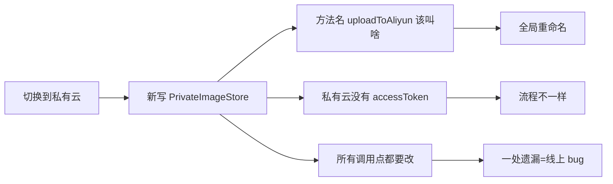
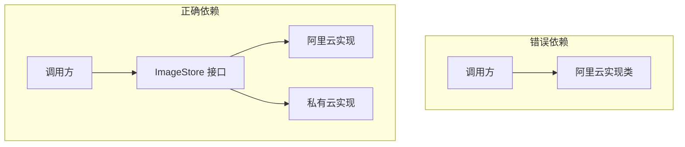
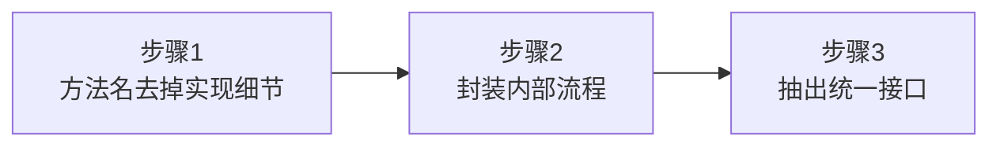
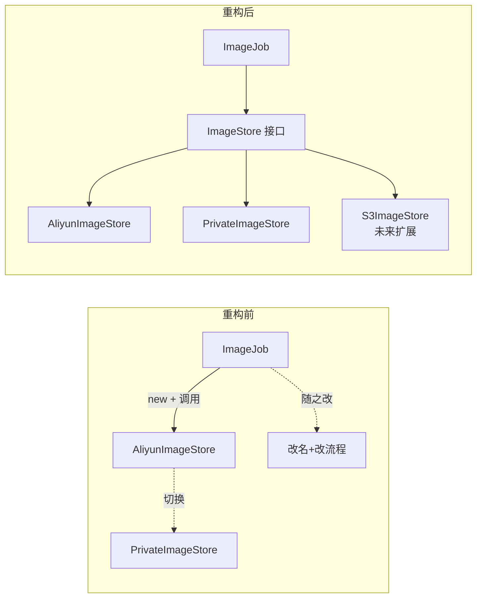
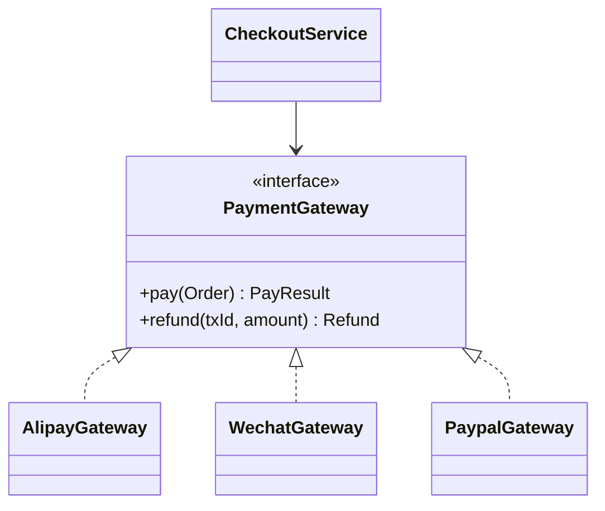
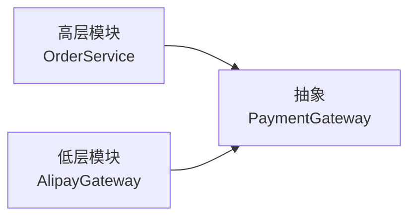

# 04.接口而非实现编程

#### 目录介绍
- [01.从一个搬迁切入](#01从一个搬迁切入)
  - [1.1 上云搬迁案例](#11-上云搬迁案例)
  - [1.2 改造的代价](#12-改造的代价)
  - [1.3 问题的根因](#13-问题的根因)
- [02.原则的本质](#02原则的本质)
  - [2.1 一句话理解](#21-一句话理解)
  - [2.2 接口的双重含义](#22-接口的双重含义)
  - [2.3 抽象层的价值](#23-抽象层的价值)
- [03.重构图片存储](#03重构图片存储)
  - [3.1 三步重构法](#31-三步重构法)
  - [3.2 重构后代码](#32-重构后代码)
  - [3.3 演化对比图](#33-演化对比图)
- [04.支付渠道实战](#04支付渠道实战)
  - [4.1 多支付场景](#41-多支付场景)
  - [4.2 抽象统一接口](#42-抽象统一接口)
  - [4.3 调用方零修改](#43-调用方零修改)
- [05.设计的边界](#05设计的边界)
  - [5.1 接口的代价](#51-接口的代价)
  - [5.2 何时不需要](#52-何时不需要)
  - [5.3 反模式警示](#53-反模式警示)
- [06.原则进阶](#06原则进阶)
  - [6.1 与依赖倒置](#61-与依赖倒置)
  - [6.2 与开闭原则](#62-与开闭原则)
  - [6.3 与可测试性](#63-与可测试性)
- [07.总结与延伸](#07总结与延伸)

---

## 01.从一个搬迁切入

### 1.1 上云搬迁案例

承接上一篇电商系统。系统里有图片处理模块，最初图片传阿里云：

```java
public class AliyunImageStore {
    public void createBucketIfNotExisting(String bucketName) { /* … */ }
    public String generateAccessToken() { /* 阿里云鉴权 */ }
    public String uploadToAliyun(Image img, String bucket, String token) { /* … */ }
    public Image downloadFromAliyun(String url, String token) { /* … */ }
}

public class ImageJob {
    public void process() {
        AliyunImageStore store = new AliyunImageStore();
        store.createBucketIfNotExisting("ai_images");
        String token = store.generateAccessToken();
        store.uploadToAliyun(image, "ai_images", token);
    }
}
```

代码看起来"很正常"。

### 1.2 改造的代价

公司决定切换到自建私有云。**只是换个存储**，结果改造量惊人：



- `uploadToAliyun()` 这个名字写死了"阿里云" → 调用点全要重命名；
- 私有云不需要 `accessToken` → 调用流程也要改；
- 散落在几十个文件里的 `new AliyunImageStore()` 一处改漏就翻车。

### 1.3 问题的根因

**调用方依赖了具体实现**，而具体实现把"阿里云"这个易变细节渗透进了：
- 类名（AliyunImageStore）
- 方法名（uploadToAliyun）
- 流程结构（必须 generateAccessToken）

调用方与一个"会变的东西"绑死了，变化的代价就以**乘法**形式爆炸。

---

## 02.原则的本质

### 2.1 一句话理解

> **Program to an interface, not an implementation.**
>
> 依赖抽象的契约，不依赖具体的实现。



### 2.2 接口的双重含义

这里的"接口"有两层：

1. **语法层**：Java `interface`、C++ 抽象类——具体的语法机制；
2. **设计层**：一组**协议/契约**，描述"做什么"而非"怎么做"。

设计层的含义比语法层更广：**只要你定义了稳定的对外能力清单**，哪怕用普通类承载，本质也是"面向接口编程"。

### 2.3 抽象层的价值

```
不稳定的实现       稳定的接口          调用方
   ↓                   ↓                ↓
易变细节  ─封装─→  统一契约  ←─依赖─  关心 what 不关心 how
```

**接口是"防火墙"**：把不稳定的底层与稳定的上层隔开，变化被堵在防火墙之内。

---

## 03.重构图片存储

### 3.1 三步重构法



| 步骤 | 反例 | 正例 |
|------|------|------|
| 1.命名抽象 | `uploadToAliyun` | `upload` |
| 2.流程封装 | 调用方拼装 token+upload | 接口内部一次完成 |
| 3.接口提取 | 直接 new AliyunImageStore | new ImageStore 接口 |

### 3.2 重构后代码

```java
// 1. 接口：只描述"做什么"
public interface ImageStore {
    String upload(Image image, String bucketName);
    Image download(String url);
}

// 2. 阿里云实现：把 token、bucket 等内部流程封进 upload
public class AliyunImageStore implements ImageStore {
    @Override
    public String upload(Image image, String bucketName) {
        ensureBucket(bucketName);
        String token = generateToken();    // 内部细节
        return doUpload(image, bucketName, token);
    }
    @Override
    public Image download(String url) {
        String token = generateToken();
        return doDownload(url, token);
    }
    private void ensureBucket(String n) { /* … */ }
    private String generateToken() { /* … */ }
    private String doUpload(Image i, String b, String t) { /* … */ }
    private Image  doDownload(String u, String t) { /* … */ }
}

// 3. 私有云实现：流程不同，但接口一致
public class PrivateImageStore implements ImageStore {
    @Override
    public String upload(Image image, String bucketName) {
        ensureBucket(bucketName);
        return doUpload(image, bucketName);   // 不需要 token
    }
    @Override
    public Image download(String url) { return doDownload(url); }
    private void ensureBucket(String n) { /* … */ }
    private String doUpload(Image i, String b) { /* … */ }
    private Image  doDownload(String u) { /* … */ }
}

// 4. 调用方：永远只看到 ImageStore
public class ImageJob {
    private final ImageStore store;
    public ImageJob(ImageStore store) { this.store = store; }
    public void process(Image image) {
        store.upload(image, "ai_images");
    }
}
```

### 3.3 演化对比图



切换实现 → **构造时换一行**，调用方零改动。

---

## 04.支付渠道实战

### 4.1 多支付场景

电商系统支付：支付宝、微信、信用卡、PayPal……且未来还要加。

```java
// ❌ 反例：开关变成调用方的负担
public class CheckoutService {
    public void pay(Order order, String channel) {
        if ("alipay".equals(channel)) new Alipay().pay(...);
        else if ("wechat".equals(channel)) new Wechat().pay(...);
        else if ("paypal".equals(channel)) new PayPal().pay(...);
    }
}
```

加一种渠道 → 改 `CheckoutService` → 改测试 → 改调用方……**坏味道全套齐了**。

### 4.2 抽象统一接口

```java
public interface PaymentGateway {
    PayResult pay(Order order);
    Refund    refund(String txId, Money amount);
}

public class AlipayGateway implements PaymentGateway { /* … */ }
public class WechatGateway implements PaymentGateway { /* … */ }
public class PaypalGateway implements PaymentGateway { /* … */ }
```



### 4.3 调用方零修改

```java
public class CheckoutService {
    private final Map<String, PaymentGateway> gateways;  // 注入

    public CheckoutService(Map<String, PaymentGateway> gateways) {
        this.gateways = gateways;
    }

    public void pay(Order order, String channel) {
        PaymentGateway g = gateways.get(channel);
        if (g == null) throw new UnsupportedChannelException(channel);
        g.pay(order);
    }
}
```

新增 PayPal → **只加一个 `PaypalGateway` + 注入 Map**，业务层完全不动。

---

## 05.设计的边界

### 5.1 接口的代价

抽象不是免费的：

| 代价 | 说明 |
|------|------|
| 类爆炸 | 每个实现一个接口 → 类数量翻倍 |
| 间接调用 | 多一层调度，调试栈更深 |
| 阅读负担 | 看到接口要再找实现 |
| 过度设计 | 永远只会有一种实现的也加接口，纯负担 |

### 5.2 何时不需要

不是所有地方都要"基于接口"。判断标准：**这个能力未来可能被替换吗？**

| 情况 | 是否抽接口 |
|------|------------|
| 一次性脚本 | 否 |
| 内部工具类（StringUtil） | 否 |
| 业务实体（Order） | 否 |
| 三方依赖（支付/消息/存储） | **是** |
| 跨模块协议 | **是** |
| 易变策略（折扣/风控） | **是** |

### 5.3 反模式警示

**反推接口陷阱**——先写实现类，再把它的方法照搬成接口：

```java
// ❌ 把 generateAccessToken 也放进接口 → 接口被实现污染
public interface ImageStore {
    String upload(...);
    String generateAccessToken();   // 这是阿里云的细节，泄漏了
}
```

接口要"自上而下"设计——先想清楚**调用方需要什么能力**，才决定接口长什么样，**绝不能由实现反推**。

---

## 06.原则进阶

### 6.1 与依赖倒置

依赖倒置原则（DIP）：**高层不依赖低层，二者都依赖抽象**。

"接口而非实现编程"是 DIP 的具体落地手段：



依赖关系从"高层 → 低层"反转为"两侧 → 抽象"，故得名"倒置"。

### 6.2 与开闭原则

开闭原则（OCP）：**对扩展开放，对修改关闭**。

```
新增 PayPal → 加新类（扩展开放）
不改 CheckoutService（修改关闭）
```

**接口编程是 OCP 的入场券**——没有抽象层，扩展就只能靠改旧码。

### 6.3 与可测试性

```java
// 单测时注入假实现
class FakeGateway implements PaymentGateway {
    public PayResult pay(Order o) { return PayResult.success("fake_tx"); }
    public Refund refund(String t, Money m) { return Refund.ok(); }
}

@Test
void test_checkout() {
    CheckoutService svc = new CheckoutService(Map.of("fake", new FakeGateway()));
    svc.pay(order, "fake");
    // 验证业务逻辑，不需要真支付宝
}
```

**没有接口就没有 Mock，没有 Mock 就没有可靠单测**。可测试性是接口编程的副产品，也是衡量设计质量的硬指标。

---

## 07.总结与延伸

| 关键点 | 内容 |
|--------|------|
| 一句话 | 依赖抽象，不依赖实现 |
| 解决的痛 | 实现切换的连锁修改 |
| 三步重构 | 命名抽象 → 流程封装 → 接口提取 |
| 边界 | 仅一种实现且不会变 → 不必抽 |
| 配套原则 | DIP、OCP、可测试性 |

到这里，你已经能写出"调用方依赖接口"的代码。但接口/抽象类只是组装代码的方式之一，**"继承"也常被用来做扩展点**。问题是：继承用多了会带来什么？

下一篇 [05.多用组合和少继承](./05.多用组合和少继承.md) 将揭示继承的暗坑，并展示组合如何成为更优解。
